# 系列 3：P173：【Linux】子网掩码介绍 - 马士兵_马小雨 - BV1zh411H79h

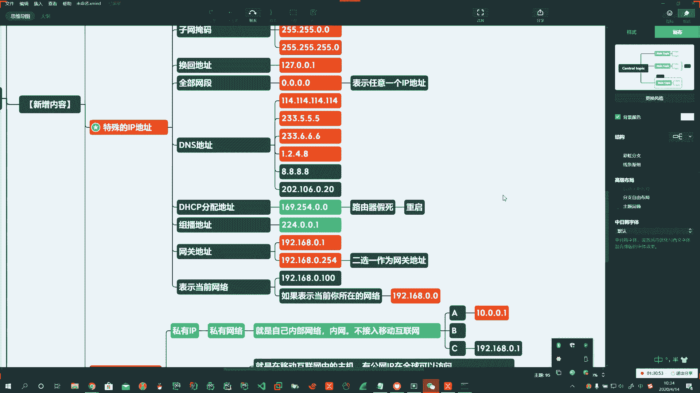

今天呢新内容呢啊在这个基础上。介绍一个新。大概知万。

啊。有网源码这一块。也不这别。网络里也可以问。法律。那么主网源码呢在这一块啊。那么我们双看希望。嗯嗯。定意见。对吧。好。中网源码。他也。32个。32位。是吧。被告诉。利用这个。字段来评定。Okay。

原来网络。是。话灯。红儿。能够。获得。🤧一个范围这小的。范围较小。可以实际。有用是吧。有。

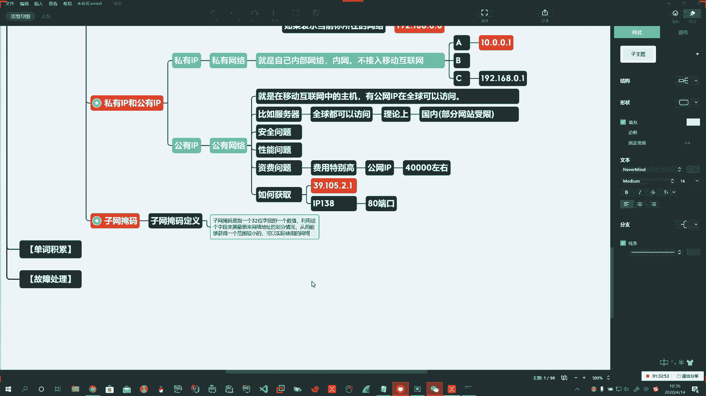

哎，这就是他。

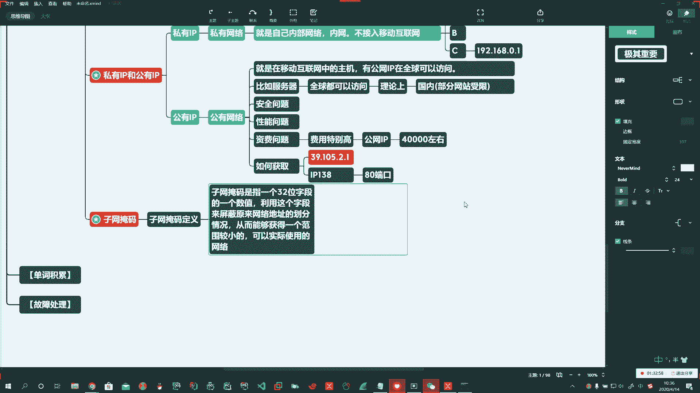

那使用你这个指网炎嘛。你有哪些好？为什么呀？

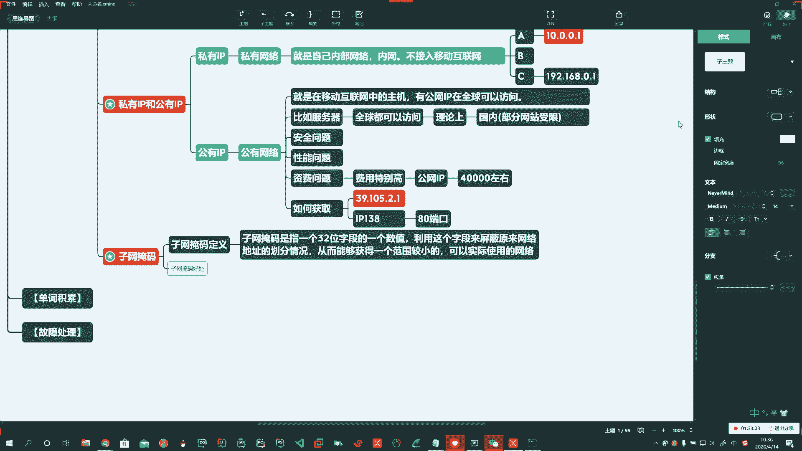

好。第一个。年月。二地是0人。

第二个。减少。

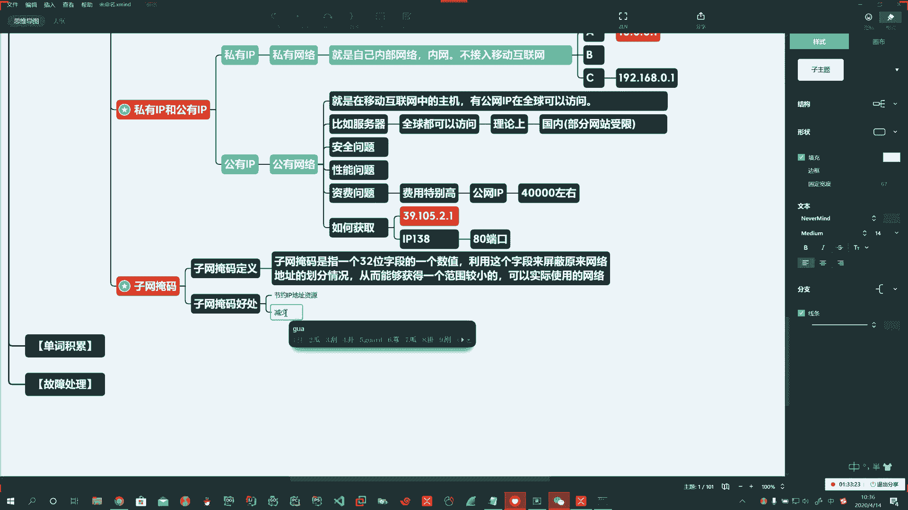

我播。第3个。嗯。减少洗空间。说你在原来一个较大的网络中，我能给你缩小到一个较小的网络啊，较小的网络也就是说我主机之间没有进行浪费，我主机没有浪费的话啊。

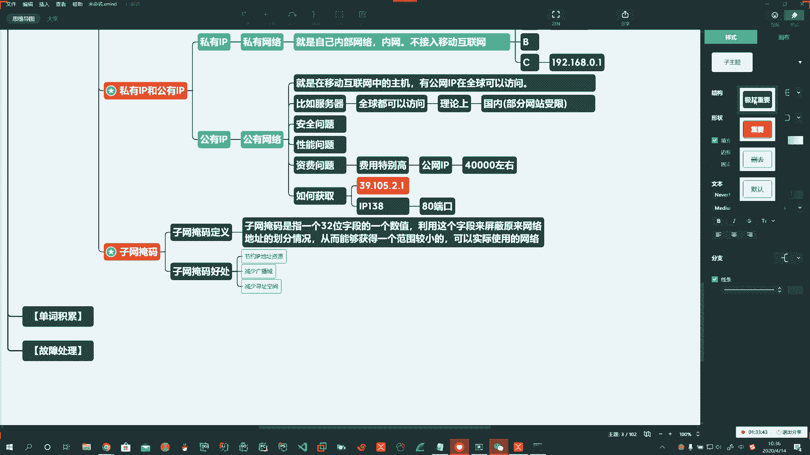

那这样的话。我们能做的一件什么事？对不对？哎，那我主机就变少了，实际浪费的就减小了啊，IP地址它也是我们计算机里头的一个资源。啊，也是一种资源。对吧那我们都知道这个资源也是很宝贵的。啊，减少寻指空间。

说原来呀我这个。去做这件事的时候，可能啊你这里头200个地址，但实际上只有50个主。对吧啊这些个都是我们需要考虑的问题啊，这就是子网研码的好处。

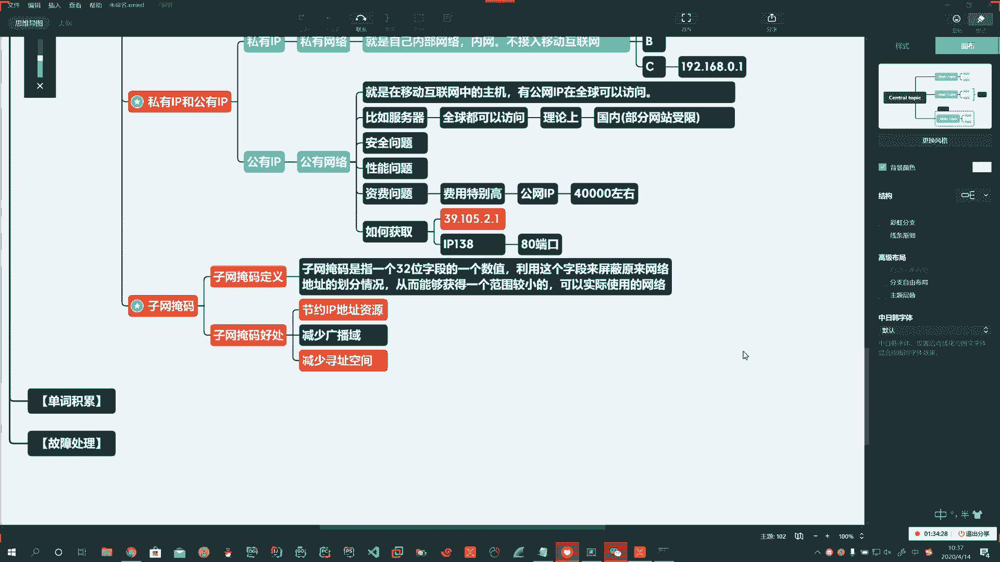

那么常见的。子网掩码。嗯。哎，常见的子网源码。🤧我们介绍一下啊。

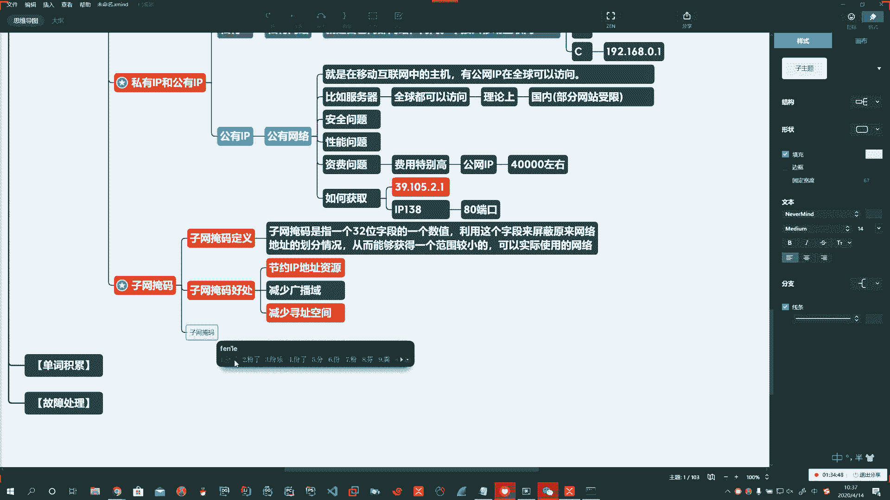

那么它对应的是我们什么呢？对应的是我们IP地址啊。

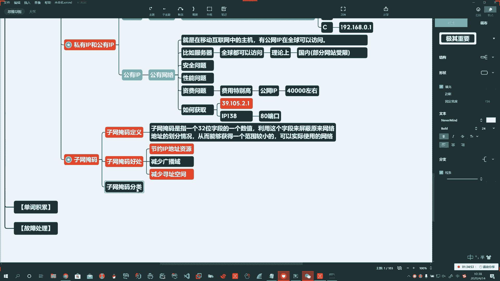

好，我给你介绍ABC3类啊，BE那两种，我们用的少。

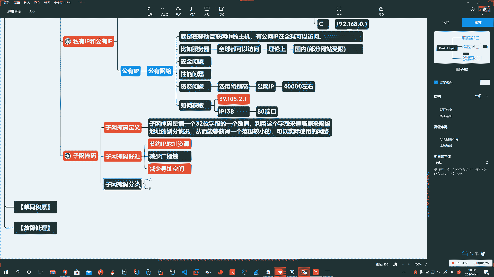

所以介绍常见的。A类的子网掩码，根据他的IP地址来了。啊，说它的网络位是多少啊？前八位对不对呀？哎，所以也是它的网络位啊。255。啊，B类的那就是16位255。255点0。也就是网络位权为一。

主机位权为0。可以这么去表示。C类呢那就是255点255。255。0。啊。那么分解成二进制，那就是这样，1A111。1111啊。Yeah。啊啊，你都是一算出来数就是这么多啊，算出这事就是这么多。好。

这是ABC的。🤧好，B类和C类啊也都一样。掌握常见的C类的啊子网源码的表示方式。C类地址呢在我们平时使用的时候较常见。啊，这是第一种。啊，第一种用IP的方式去表示子网源码。

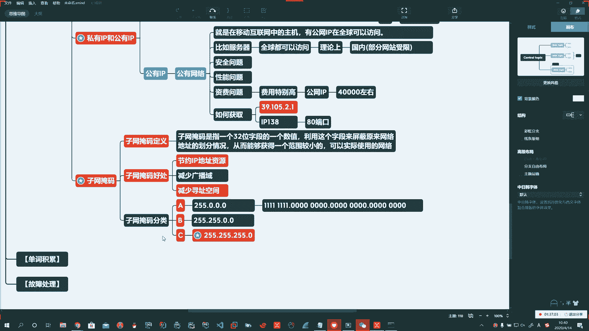

Yeah。对。

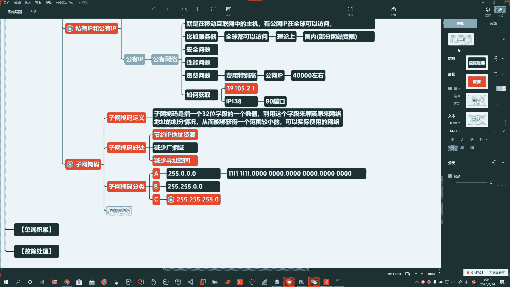

Yeah。Okay。

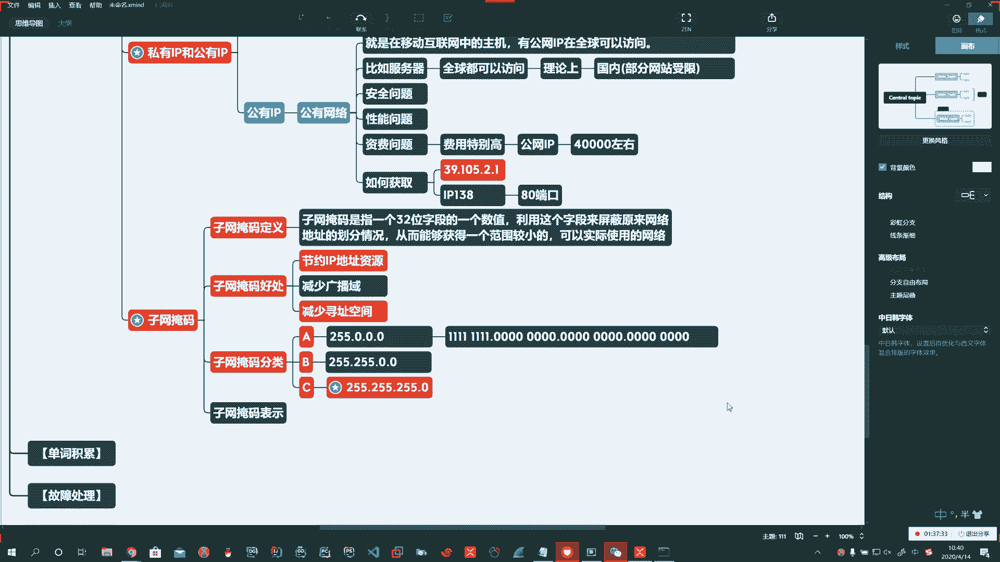

好啊，昨晚圆满。字圆满的表示呢两种方式啊，第一种呢就是用点分啊。减分。用点儿啊跟表示IP地址一样。啊。这是第一种。

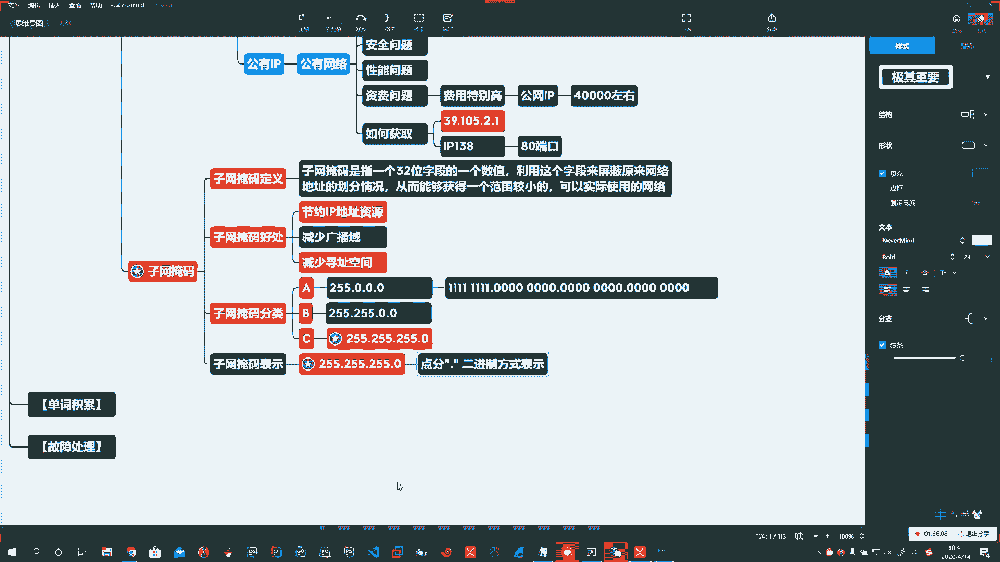

第二种呢啊我们可以呢使用什么呢？哎。第二种表示方式，我们可以使用。这种方式表示啊，比如192。168啊，点0。1杠。斜杠24。

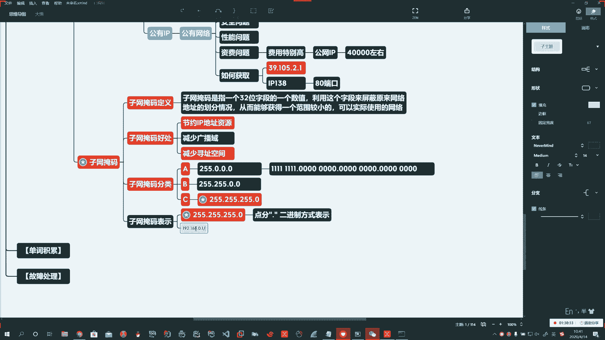

啊，斜杠24。这种表示方法叫做CIDR。表示方法。Yeah。这二者都重要。啊，这二者都重要给大家呢一分钟的时间，你就看这个把它往脑子中记啊，把它往脑子中记。有。P。好啊。

那么呢我们就把这两种表示方法给大家啊说了啊这个。

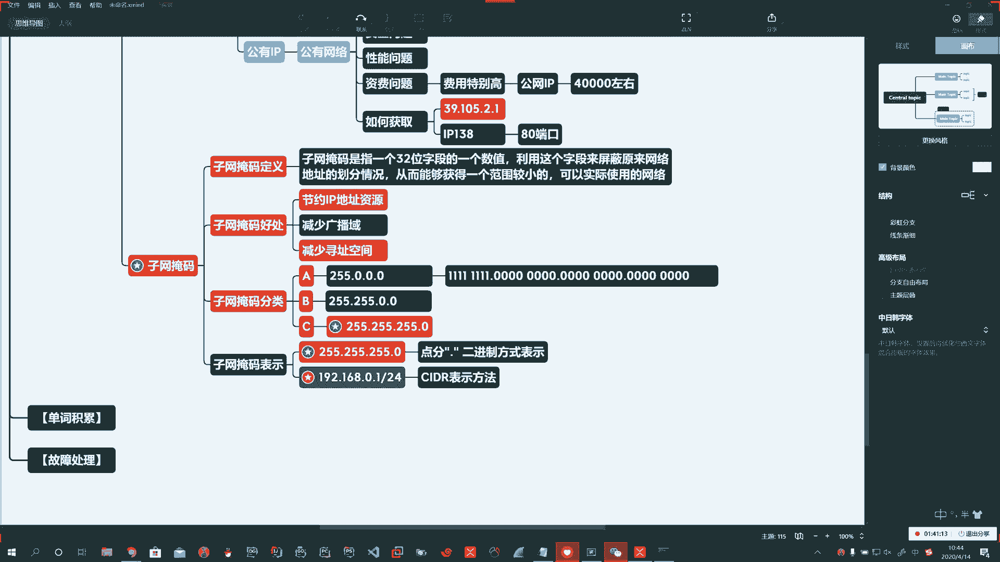