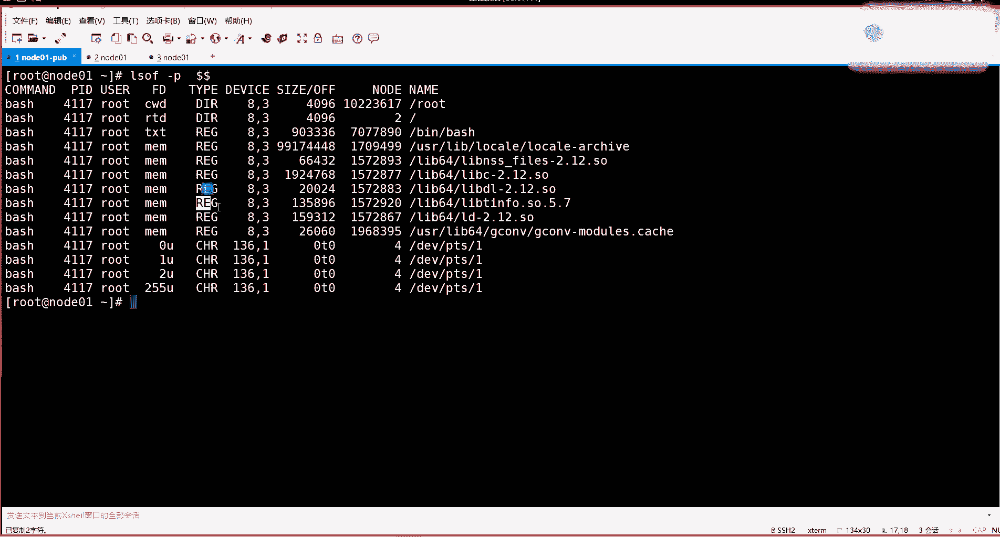
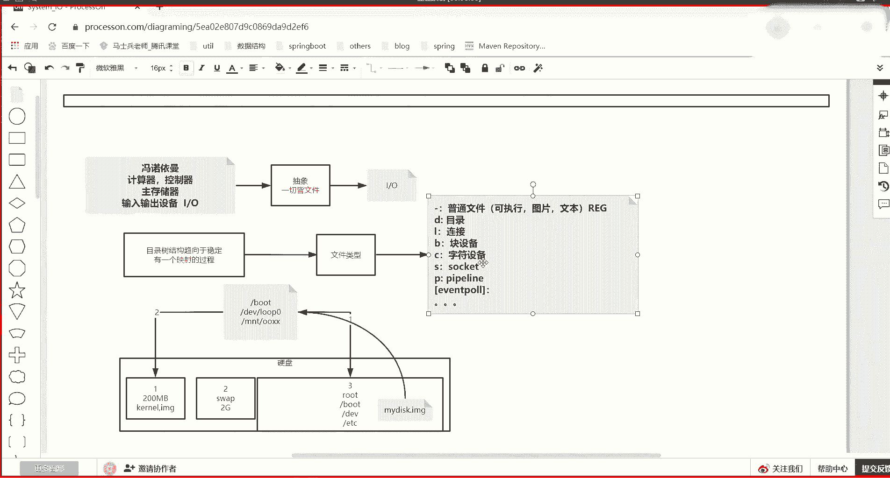
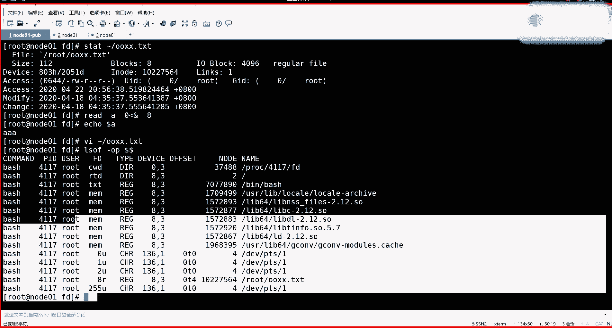
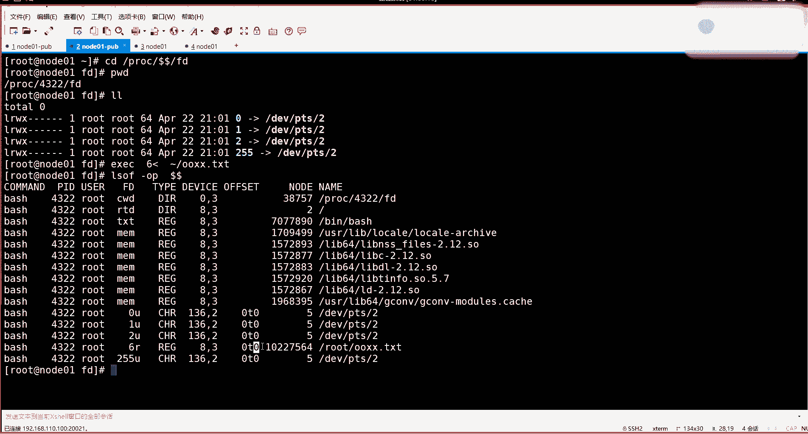
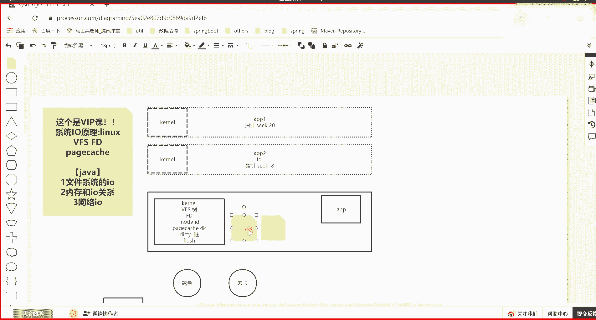
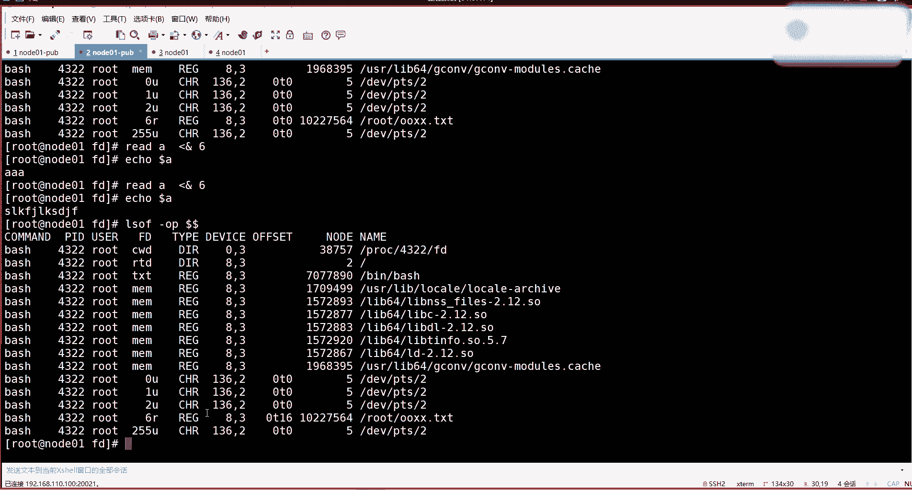

# 系列 3：P180：【IO／NIO】文件描述符,nodeid,脏读 - 马士兵_马小雨 - BV1zh411H79h

第第一个知点。那么下面怎么去演示，还是介绍一个都是用指令啊，今天是指令层次的应用层次的，不是那时源码级的去直接解读。因为看那个你也看不懂，我也看不懂说实在的，我们还不如用指令去去演示这个东西。

先介绍一个命令LSOF。ISOF的话是可以显示呃进程打开了哪些文件啊，打开了哪些文件。比如说杠P告诉他。这个进程两个doer，就是我当前那个b事进程。能理解吧？嗯，回折之后。

你会发现当前这个拜事的这个进程啊。它里边上边比如说current work direct当前目录是这个我现在工作的这个这个这个目录啊，然后ro的跟目录在哪？

像下边会一些这这个东西这个列的FDM完就没有没有符。但是除了我之前给你们讲过，听过的或者012，这里边还有这些概念。比如说文本域这个文本域其实说白了就是进程启动的时候加载那个可程序可程序。

可定行程序的代码段。然后下边这些mememory说白了就是你分配的内存空间，比如做了一些独态库链接的挂载。或者未来你会用M map去挂载一一些个这个文件，到你的内存，直接带成buffer可以铺的时候。

也会出现这样的一个引用。下边的012到这个环节，这个区域当中，零就是这个程序的标准输入，一就是标准输出，这个就是文件标准符了。二就是报错输出。任何程序都有0123个文件描符这个知识点。应该都知道吧啊。

知道来说波一。别蒙啊，因为使用操作系统这种命令行的时候，它打印的都是一大票的字符，你肯定蒙。但是你要知道这些东西它代表啥意思。哎，现在没听懂的也不要紧，现在我给你整体解讲一遍啊。

这个我的公公开课都没有讲过。REG是类型是啥？这个那个单词怎么翻译完了，就是基本文件的意思，就是它来自于是一个基础的一个文件。这个它是tab类型嘛。啊，这就是那个中线。

刚才我看类型当中是不是有中线。这个中线如果看的话，就是REG。然后这个叉是什么意思？就是字符设备CH2。

好吧，嗯，然后什么是文件描述符？注意我刚才说了，文件描述符，它代表的是你打开的这个文件，它里边会有什么东西，会这个文件它是在哪？啊，以及他的应该还有一个I这个就只能用那个I的号。

这这列其实是按卓的号的意思啊，只不过现在这个是我们抽象那个抽象，那个这个先不用管，待会我给你看别的东西，先先记。第一列是tap，就是这个文件标符，它代表的是哪一类。然后下边这个它的设备啊。

这个设备号以及是哪哪哪一块，这块是有一个偏移量。像这个零样呃，你可能看不懂，看我现在下边做这么一件事情。我让我担心那个程序打开一个东西，嗯，打开一个。叉叉点2494调查。

刚才是不是应该有一个提一个叉叉圈圈啊，被我删了是吧？谁看看。我先看你圈传这个文件，里边有一些乱七八糟字符的的。他有一一定的体梁，它有一定的体梁啊，然后做一件事情EIEC然后令我的8，然后呢可以去。

读取我的。圈圈叉叉这个文件回车。POC去到根目录的POC，然后。FD目录。我先给你演示啊，你没看到这个程序，它自己有012，还有一个8这个八指向了这个文件。那这时候之前给你这么演示的。

用LSOF杠P当前这个进程里边对应的这有一个程序看它FD的目录里边会有012和1个825先不用管，在这你可以看到跟刚才也不一样，有012这个读起来很麻烦。但是你看这是不是多了一个8且是读取。

刚才我说了定义的创建了一个文件描符的时候，就创建了一个8，它是读输入流读取这个文件，这就是一个读U的话就是读写都可以，后边我读的这个就是一个普通文件了。

这个文件就是这个单词REG然后它在的是这个设备的第三个就是跟目录那个第三分区，然后它的先移量，这个可以再加一个。看O啊，再加一个O啊，带偏量的。它的偏移量，因为这个文件刚打开，对于就是这个进程啊。

刚打开这个文件，它的偏移量为0，指针为0。就是一读的话，读第一个字节，它的Iode号是7564，你可以stateate。就把知刚才讲这都都串起来了。我刚才那个打开的文件是圈圈叉叉这个文件。

它的I号就是7564。这是它的文件名。那么什么叫做文件描述符，你也得想成想成就是文件描述符，它就描述了你打开的这个文件的一些具体信息，以及指针偏移。退回来刷波一。这是第一个啊。

我们先通过LOF这个指令看一个进程的时候，可以得到唉这里边有个文件描符它。然后这时候注意啊，我再给你演示一下，今天先看演示，今天先看演示，为什么是0T0。你看着看着read是读取东西的。

我可以把读到东西放到一个变量A里边去，然后read读的时候，它可以从标准输出读，也可以让它的标准就是任何程序都有012，这种输入输出流的文件描符，我让read标准输入零来自于后边加上按的符。

一个文件标符8，就是刚来自于我这个8。这个八指行了一个文件，但是readd有一个特征，它只读到换行符就不读了，所以它不会造成把整个文件都读完。这个指针偏移量到换行符的停住。后边的不读。

所以这个偏音量不会走到末尾。能明白我什么意思吧？哎，那我当执行了这一行之后，首先先看这个指令啊，从他读取了把这个文件描符指向这个文件的东西付给了A，那A就应该是可以看到读到那个文件的开头的3个A。

因为刚才看那个文件的时候，他打开那个文件啊。这个文件的第一行是不是3个A，这有一个换行符你看不到，但是它的确存在换行符。到这步能看怎学来shop波一就是read通过8读取了这个文件的三个是三个吗？

应该是4个字节，加一个黄合符，对不对？哎，加一个黄横符，一共读了4个字节。开始我创建它的时候，它的偏量是0，但是这时候LOF。杠。offset进程ID。当前那一个进程，再来看它的偏音量。

那个sick指针就指向了4了。A是一个变量，这个A是一个变量，是我当在这个环境里的一个变量。我可以用ecle打印doller A来取这个变量的值。这是重林项的事。哎呦，我操这些知识不是都讲一遍？

到这儿哎，就是咱这个没听懂的，不要紧，我到时争取的我我看时间，要不我给你把这个linux系统再给你讲一下。呃，得讲不讲的话，到是管道不好讲。那个因为你要看一个 paperline啊。

就是咱咱先一分分批来啊，分批来。所以我这个这个能听懂的同学或者嫌我讲的慢同学，你就忍一忍，咱们的确有很多还是不太。😊，不太了解这个东西的啊，首先能听懂就中间这一层能听懂的啊，不嫌弃我的啊。

然后我讲这个能不能听懂啊，就是什么是文件描述符，它里边存了一些个对这个文这个打开这个文件的一些描述故我这个进程来使用的。但是这时候注意了，我是不是还可以再开一个程序。

再开一个对这个这个这个系统的连接访问的这个程序。

这个程序它又是一个b，然后呢，它也有自己的这个CDPROC，然后呢，两个都是代代表自己的这个进态ID号，然后呢FD目录。就是4322是自己的进程，前边这个是。4117这另外一个进程等于两个程序。

然后但是这里边刚才这个程序打开了，用一个8，打开了一个文件，可以读它了。通过读立的一个文件面符的时候，然后这边这个程序还没有，那其实它也可以用1个AC，然后用随便用1个6。

然后也是想读取加目录下的圈圈叉这个文件走。那这时候前面你注意看啊，这边的应用程序已经让这个文件的偏移量到四了。那这边这个程序打开的时候，注意看LOLSOF杠OP哦这个O是outset这个P是新加记号走。

这个六是不是也是这个当前这个432这个程序，它用了一个6的文件描符，代表了这个文件，且记录了一一个对这个文件的一个使用。然后它的偏移量是不是现在为零了？

那也就是我把我刚才我讲的东西，我说了，我先讲概念，后边给你验证。开始我说了两个程序可以同时打开一个文件。但是FD里边他们会各自维护各自的指针。但是这个文件的数据是在内存里是一份的。

dollar dollar是当前这个by是进程的进程的IDID号。这个概念是不是印用过来了？哎，如果这边如果也是read的一个往往A里去写，读的时候，来自于6号文件面号符，读6就是读它偏量为0。

那它应该也是读到3个A。对不对？然后让他再多读一下，你看他再让他多读一下，再让他这个read的A来自于6号文件妙尔符。因为在这个流里边已经读完去第一行了，再读的话应该是第二行。

所以再看这个变量就读到第二行东西。然后这时候IOSOF杠OP然后当前进程它的偏量已经到16了。就是这个文件的偏量到16，但是注意了，这是这个6号文件描符这个进程里边的文件描符的偏量到16。

但是去看另外一边这个。这个进程里边对于这个文件的文件描符。还是这个4，所以他在读的时候读的是他的四后边那个数据，他读取的时候是不会受他那个偏量影响的这个有点像我们扎当当中的D代器，现在听懂了吧？哎。

其实说白了，内核为每一个进程各自维护了一套数据。这个数据里就是包含这个进程的FD文件标符FD里边维护了。一些关于这个FD指向的这个物这个虚拟这个一切金文件嘛，这个所谓的文件的啊偏移呀。

然后一些这个安号一些元素信息以及这个但是缓存p是通用的，公用的，在这没有没有看到啊。

