# 系列 3：P184：【IO／NIO】 磁盘IO - 马士兵_马小雨 - BV1zh411H79h

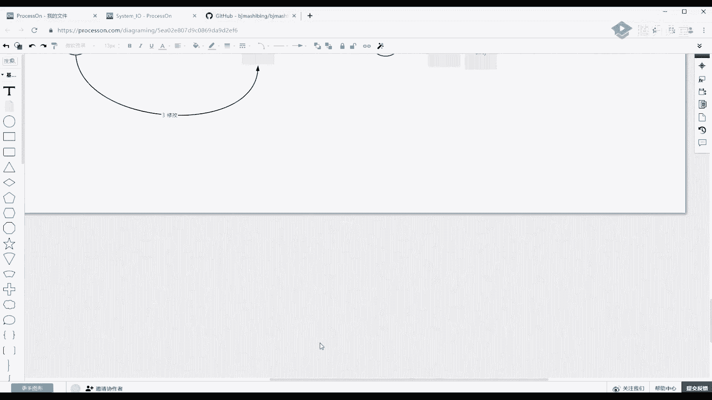

那接着讲啊接着讲讲啥。把刚才那个追踪那个事他给你演示一下啊。从来刚才那个流程，我要从来刚才是给你讲pa cash，现在给你讲的是我们就是最终咱们扎入程序员，对不对？

你得知道你写的代码当中为什么不推荐使用这种直接IO这直接使防IO的方式要使用8分的对吧？

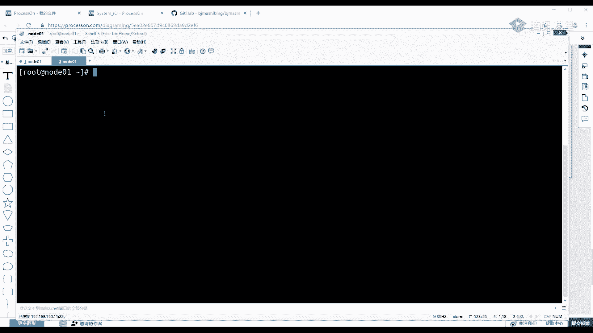

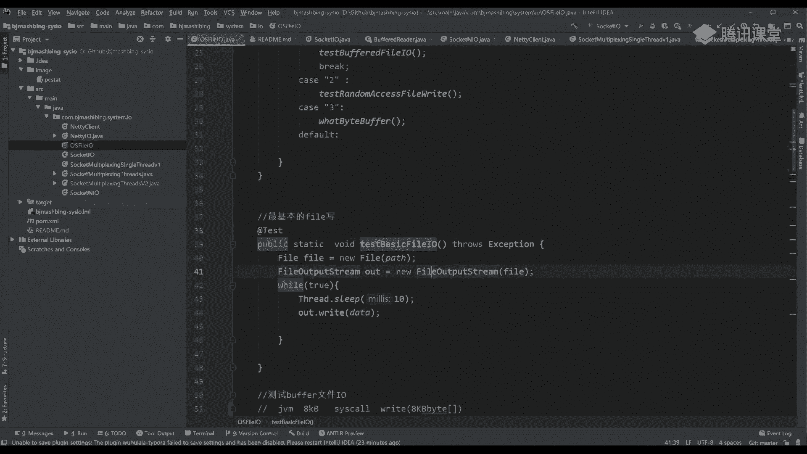

Okay。然后是执行我买需。去导相的木啊。买需深直灵使用基本L的方式。然后呢，我我不不去追踪pa cash了，我追踪的是让他们去生成这些文件之后。

我去追踪他这个追踪系统调用这个这个里边怎么怎么去执行的啊，让他跑起来，跑一会儿，我就给他结束了，结束之后跟着我的思路走啊。然后这时候你会发现out一系列的后边搭搭上的是现成的ID号。

这个应该是一个基本的一个常识。就是我们GVM跑起来之后，ja个程序跑起来之后，它是一个多线程的。啊，那么这个1350就是它的主方案的主线程，我们代码也在主线程里，这个能听懂来，稍波一。

其他的还有什么GC线程等等的啊。🤧然后我们打开VN1350off点1350。打开这个文件。这个文件里我们找啥，开始是不是输出了123456789。

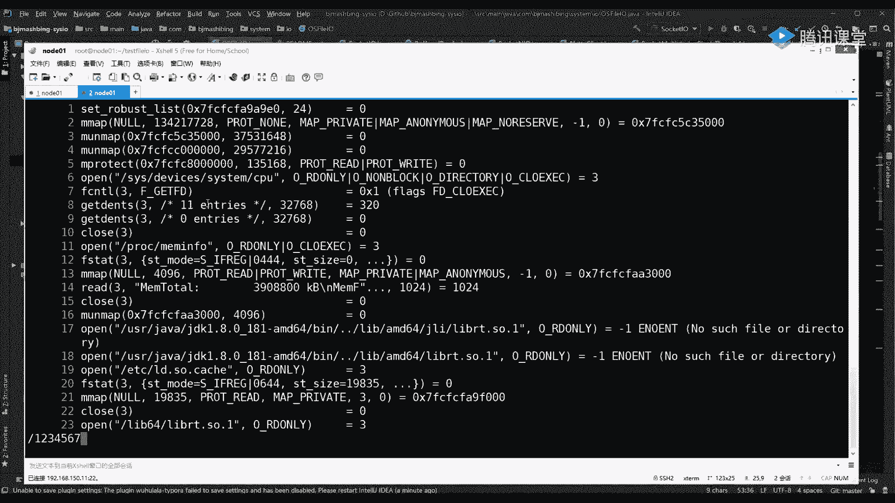

来，我在我们那个程序代码当中啊。他他第一大嘛，第二个嘛就是嗯。在我们的成序代码当中，是不是你写了一个死循环，一直要调，就是我们调的是我们那个output stream。

然后out点right写data这个data是啥？这个data就是123789，然后换行。所以你会看到从2248行起，然后就一直是rightite123489，然后写的字节数量是10，一直这么写。

一直这么写一直这么写，一直这么写，一直这么写。

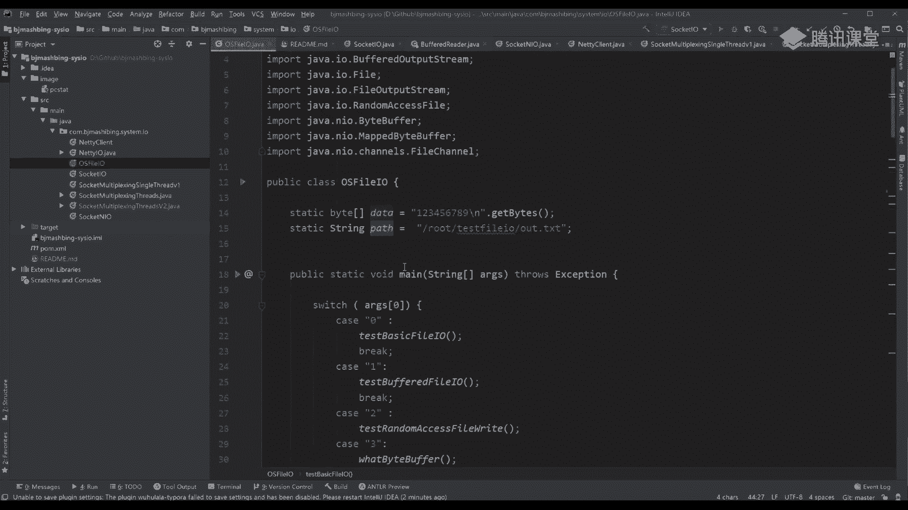

然后这个东西现在你看到的是啥？现在你看到的是通过str追踪的应用程序，对内核的系统调用，其中每一行都是一次系统调用。也就是用户态到内核态切换的过程，这个能听懂同学来稍边一。

你听了前面马老师讲的机组就应该知道这一过程会有计存器保护现场，一系列复杂的消耗CPU指令机时间的事情。所以像现在第一种我们的基于IO直接写。不使用8ffer的时候，其为什么写的那个数量变化的有点慢。

体长的比较慢，就是因为单位时间内这个燃脂了太多的用在那个内在切切换这个这个浪费的时间，好吧，这应该都知道，不不多过多的扩展了。对吧这个这个认可同学来刷666。没问题吧。

🤧这是刚才第一个啊第一第第一种方式。然后同比啊同比，其实我可以拷贝一下outt点1350变成base点out。这个base点outt其实存的就是刚才那个很，你看大小在这摆着呢。

然后他就是疯狂掉这个这个性标用。我把这个文件先删一下。这圈着圈。我看到这个大小好大。挺挺挺心疼的，因为占有硬盘空间啊，然后再来执行。

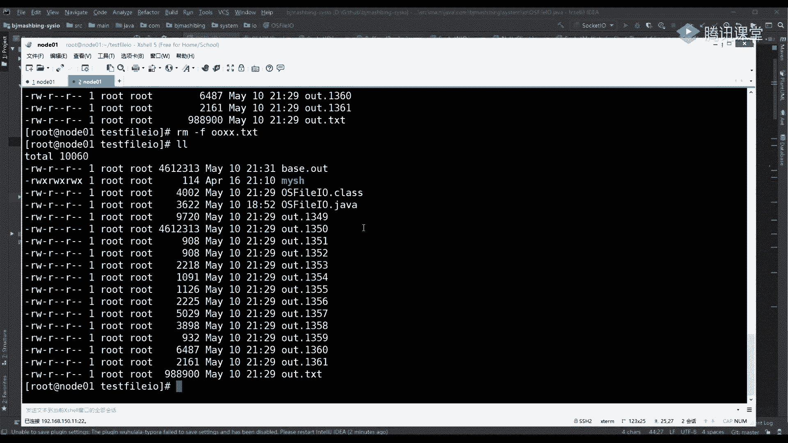

这个时候给的参数一给的参数一什么意思？参数为一的时候是要测试我8分。8分刚才已经说了，它其实长得比较快，它肯定比上面那个那个那个体长的比较快。因为说了它里边其实是有1个8K的那么一个缓冲的。

所以这时候我们来看啊走。

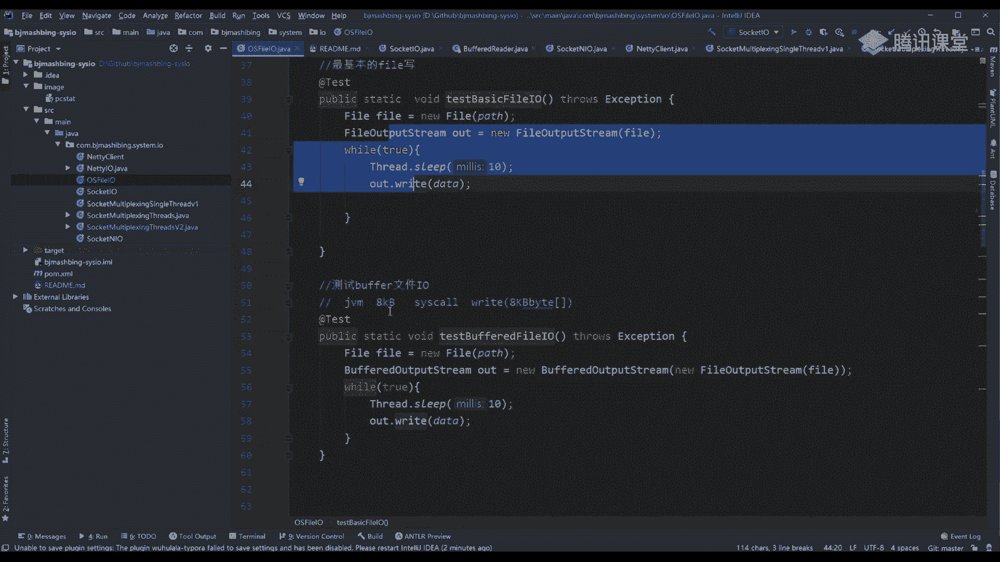

好一会儿crl C结束它，然后他把所有文件删除，重新生成。啊，个我我的个 base呢，一个删了是吗？我这被子给带了一个out也给删了，不好意思啊，但是不管咱们体积数不去比刚才那小一点了。

是不是outt点1389，这是另外一个了VI out点1389，打开这个文件。😊，然后注意看也搜123456789搜它。但是这时候注意看。这个rightite里边还是只写1个123789吗？😡。

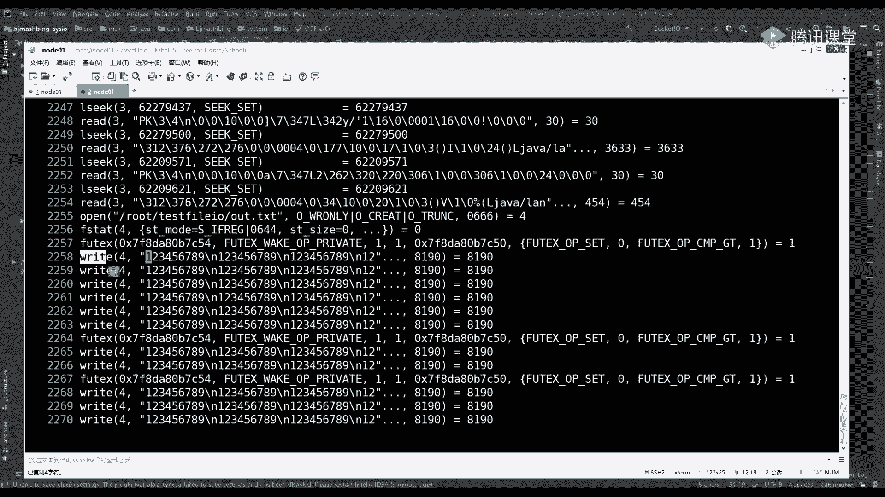

就是你看啊在我们java代码当中，你是不是死循环r写了date，这个date是不是就是123789啊，但是现在它写的是一个缓冲区大小。

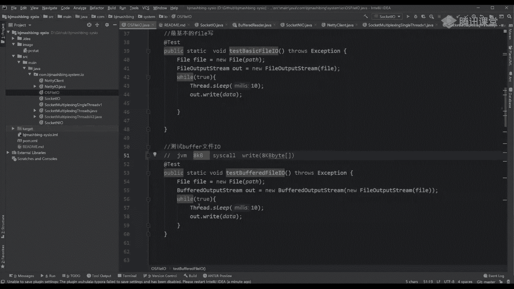

890。这个跟刚才的比法就是同样也是必须要调right，但是这个就比它少了很多次right调用，减少了来回切换，只不过单位传输的数据多一点点。す个。

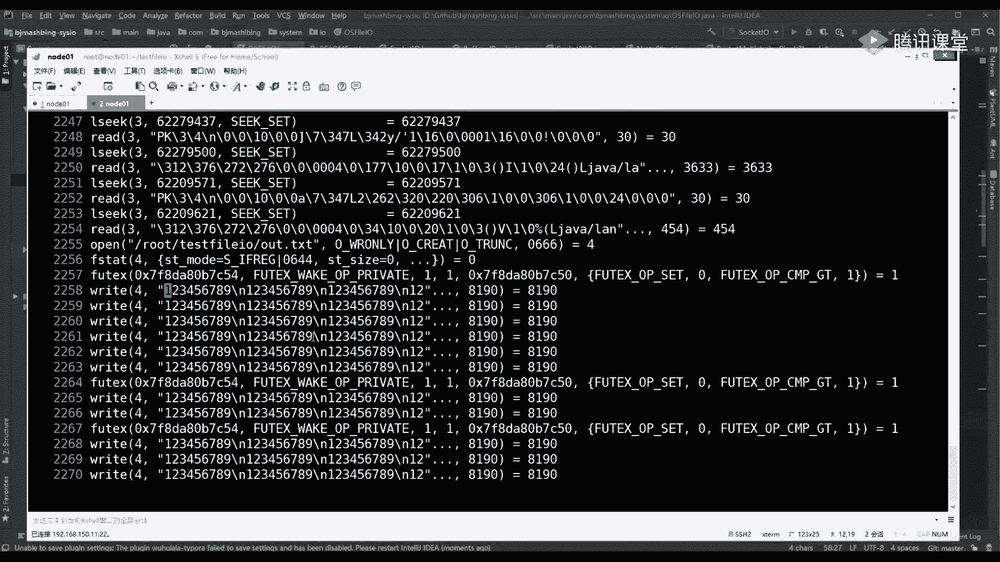

对吧啊，这块能听懂同学来刷波666，这是两种方式。曾经你可能只知道说。啊，我们的使用8分的8分的。啊，当然现在知道了buffer其实不是说什么缓冲不缓冲的问题。

是应用了缓冲而去解决系统调用这种损耗这种损耗。其实后边讲到网络IO的时候，也是要减少系用调用，才有了多路复用器。因为没有多路容器的话，你有1万个连接，1万个都要调1万次receive和read啊。

有了多路服务器只需要掉一次，我就知道哪些了。然后我就可能就是只调了6次或者几有有限次数的一个read和receive，对不对？

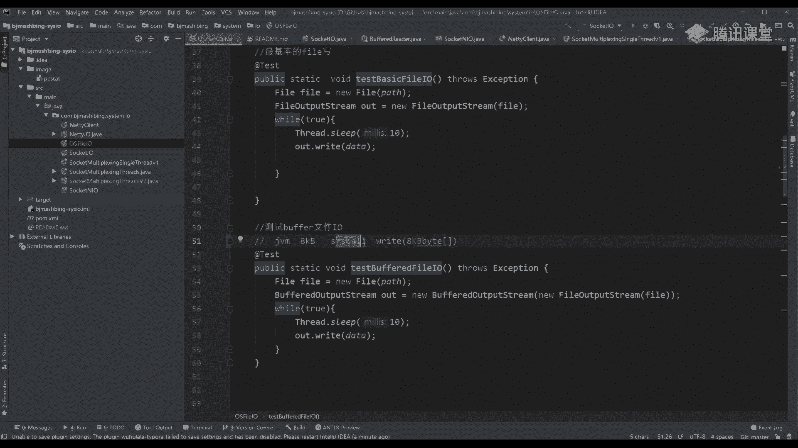

其实这些技术这些技术知识啊都是都是相通的，好吧。

🤧OK那么像这些啊。这个这些个IO，他们其实在的包啊，在他们所在的包都是java点IO的包下。啊，都是javaIO的保险。那么其实。咱们现在开始测试GDK新的它是不是有1个NIO了？

对NIO你一定要理解啊这NIO什么意思？是newIO新的IO体系。在新的要体系当中，其实有有现在目前说，现在我们只讲文件，有两个概念，一个是channel，一个是ba buffer。也就是换言之。

其实从以上普通IO当中，我们总结到了这个尽量使用buffer形式的。IO形式。所以NL当中啊，它其实是首先抽现时channel，没有抽现这ch之前，它有输入输出。有了chnel之后。

channel把输入输出合并成一个了。然后其实它也是基于8分的。他并没有超越所谓的这个前面这个形式，只不过在AP上给我们提供新的。然后他扩展了一些新的。

比如说m这个mped bufferffer的或者是direct bufferffer啊，这个后边来说先我们先去看一个什么东西啊。

再讲这个random file它这个NLO这种文件的这种channel的访访问方式之前，我们先去讲另外一个东西，就是因为它会用了一个ba bufferfferbut bufferffer是一个啥东西。

ba bufferffer是一个字节的一个数组。你这么想就可以了。啊，直接数度。这个字节数组，然后围绕它有一些指令啊，像我可以往里put填充东西，然后就翻转东西，然后get获得东西啊。

然后等等cleer清除等等一些一一系列的概念。然后呢，我们直接把它先运行起来吧，然后一边描述1111一边说啊跑下，我现在直直直点示它。我怎么去做的bed bufferffer，然后我分配了1个1024。

这点错了吗？Okay。哦，应该使的是这个。对。要了。Yeah。系啊。对。嗯。有什么主方法？就ts没有持持跑起来吗？没有。不是我这要跑这个test。你个收过。算了，我给他传一个三传三吧。这样这个。

不在这浪费时间了。2在下午再看X0。等于算。就是默认我给他传了一个三啊，默认给他传了一个3三的话就走到我这个back个buffer，好吧，先不先给先给他跑起来啊，我们先给他跑起来。这个金额不让我们。て。

对。我这么发不行。这。系唔这啊。这个静态吗？有什么的办法。你度我な。啊，对应该前面加了一个静态啊。对对吧，是。除掉。这该是。就是真个。是这个。大概点用。全大。有。其な。对吧。这又是啥？

T space fan。你这么费劲的。不需要。有我。不我。不去了。也是吧？根据方呢是。こ。我跑完了啊跑完了。うん。其实其实应该这个这块应该大家大家都知道吧，我就得我就快点讲了。

就是这有一个b bufferffer，然后我分配了一个大小是1024，在这分配的时候注意注意听啊，你可以这么去分配，还可以。嗯个。他有另外一种分配方式。可以普通的分配，这个分配在堆上，也可以分配在堆外。

就是它的分配方式有两种，这两种分配方式不影响它的执行的。执行的这个这个这个API的这个这个这个过程啊，这是先说两种，还有一个就是基于random Excelel拿channel。

拿那个fi channelnel的时候那个。麦y的这个。mabe这个 bad bufferffer现在我只是说的是最普通的在堆上分配，或者是在对外分配。然后分配的是1024，你就想成它就是一个字节数组。

字节数组有了之后，然后上面我打印了12344个，这四个代表就是这个数组，它其实有4个维度，这个有4个指针，一个是偏移指针，一个是它的大小限制，limit1024啊，一个是总大小1024啊。

然后打印了这个。其实其实其实直接攒8分的话，会带出它这个这个尤其得最最重要的三个维度。然后我们简单画一个图。

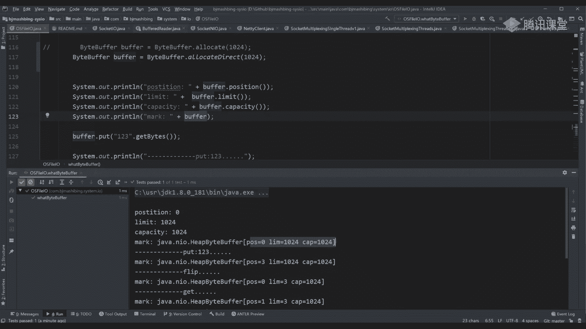

就是如果你分配了一个ba bufferer。わ。这是一个position。啊，只否。默认的话，position是指向零的，然后呢，还有一个limit。还有一个是它的总大小。现在是我们这个执行的时候。

上面我们看到的它的一个状态。好吧。

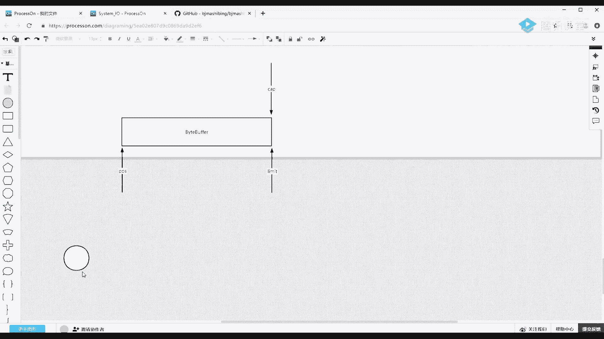

别别嫌这个浪费时间啊，因为这块我想讲的一个比相对比较完整的一个一个一个过程。然后下边是哎我对buffer点putput的时候，我添加了1233个字节，get the balance放进去了。

那put的话其实它是沿着左边沿文里放了三个字节。那这个position其实会往后移动三个位置。

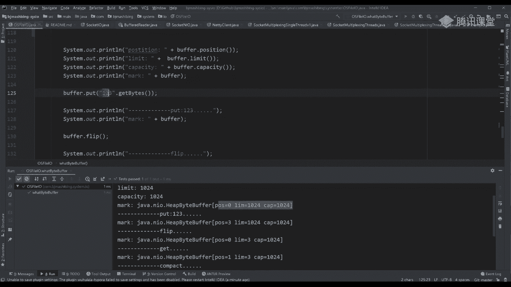

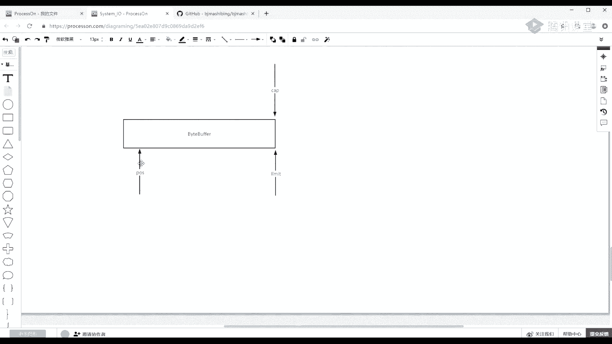

啊，一共三个位置，所以这是候put完了，你要put123了，然后再去打印这个ba bufferffer，to position就为3limit就是1024。然后这个大小从大小1024。

然后最终一个flip翻转，翻转什么意思？翻转的意思就是一个bed bufferffer其实我们是可以往里放。但是它不能只往里放而不去读取它，读的时候，其实你要让它回到你position就是偏移。

就是要回到开始的位置，但是又怕读超过了它，所以这时候limit就要去占它那个position那个位置。所以flip这个flip是什么什么概念啊，所以我调了f之后。

然后你再去看它的position为零limit为3。

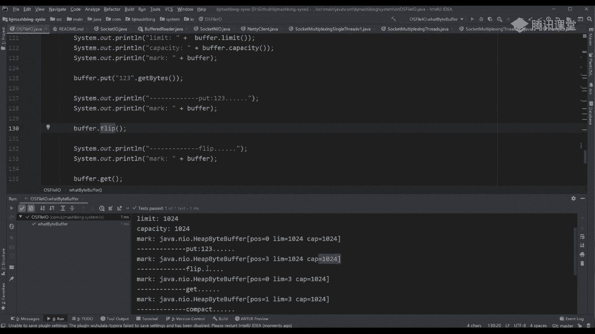

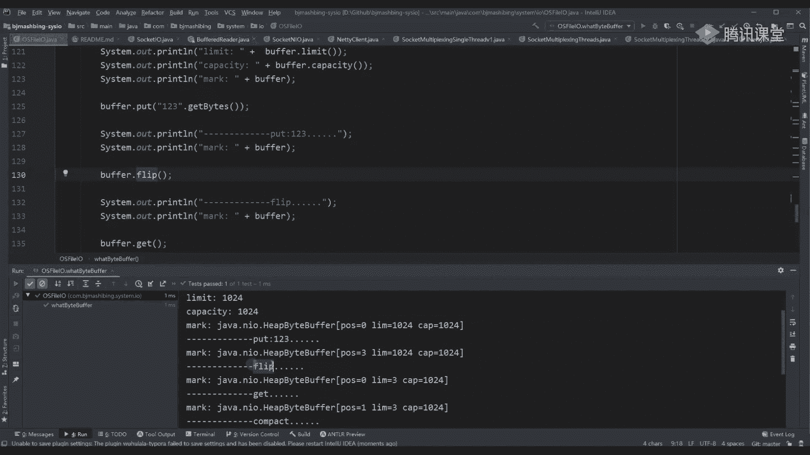

所以往里放的时候，它会往后走。但是如果想读它的时候，这是分为这个这个形态了，就往你放的时候这这么走的，想读的时候必须要先flip一下，把它搁到前面去，把limit移动到它曾经写到那个位置。

这是为什么使用bbuffer的时候，它要翻转一下，翻转的目的其实是为了就是在读写行为的一个交替过程当中。

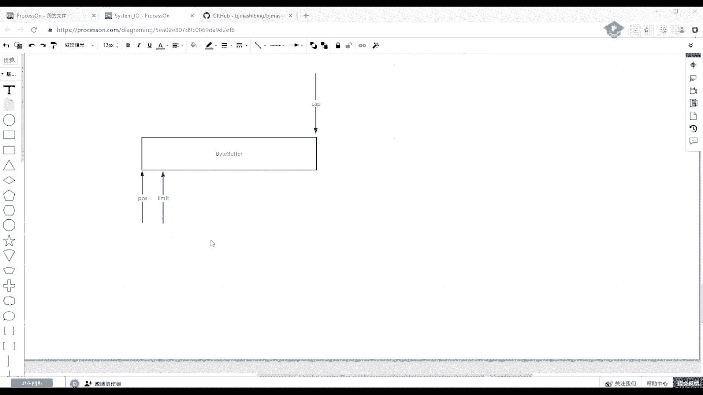

五万。多一个交替，先简单介绍一下，然后ge你只有交替完之后才能getget的时候，你的get会让你的这个position向后移动。你get一个了还是get所有了，这会有一个向后移动的过程。

就是putput和get都会移动它。

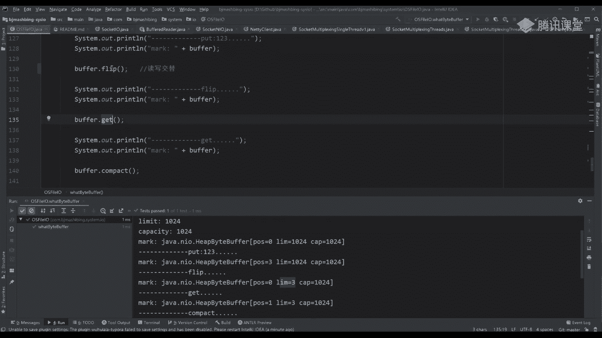

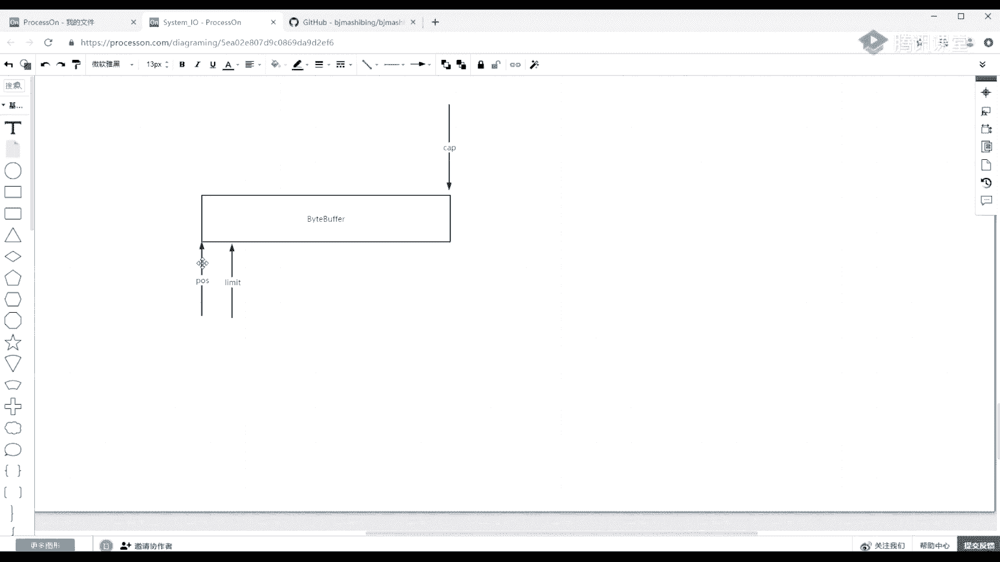

到这能听懂来shopber一啊，因为你get完了之后，po你get的时候，我只get了一个字节，在这在这个这这只掉了一个字节，读读了一下，然后再打印呢，打印就get之后再打印的话。

它的position就唯一了。然后向后的话是一个。comit这个在调的时候，是把你的position标成2，把limit再调到后边去。然后其实是一个。

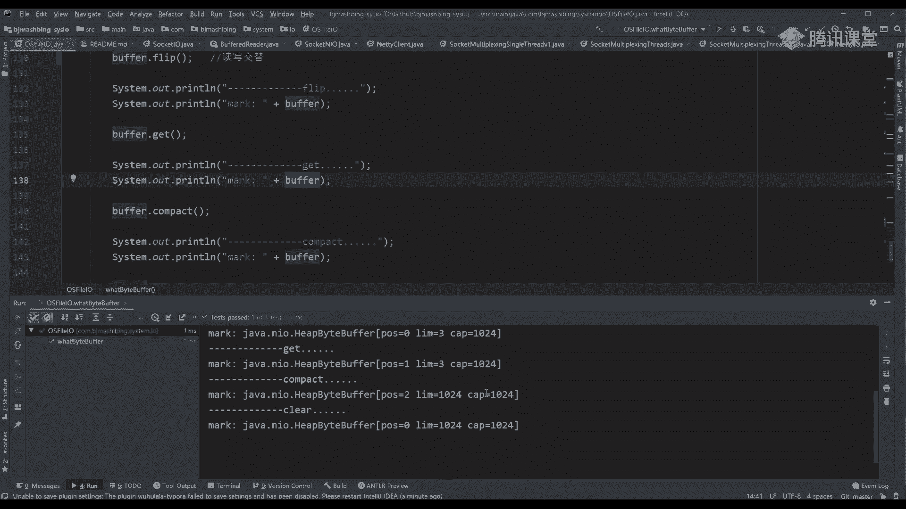

就你读完一次之后到这儿了，然后再去调compact的话，然后再去把它置到后边去，然后呢把它移动到后边这个位置。因为你前面那个已经读过了01，然后挪到2这个位置，然后往往往挤压一下。

然后剩下这个空间是前面是你曾经往里写，然后没有get完的，后边是剩余可用的。

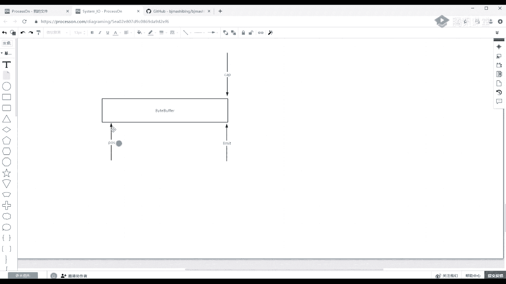

就是就仅仅的靠了这个尤其 the position limitit，然后一个是flip，一个是compact来达到了让你使用它的剩余空间或者读取他已写的东西。还有一个。

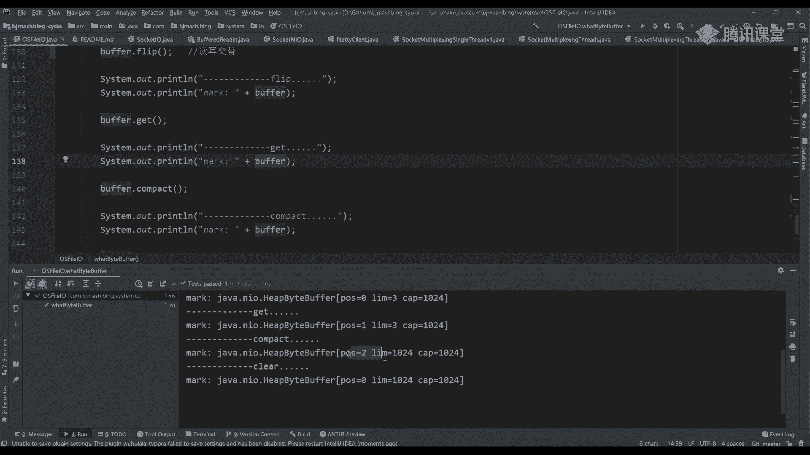

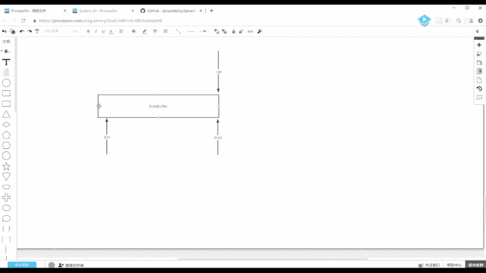

你来看，就是你ge之后开始是不是012写了3个，我get了一个这position为一了。那这个里边还剩谁，是不是剩下两个两个字节没读了。两个字节没读之后，然后这个你compact之后。

你的posation为下标为2，那就是01，那两个没读的排排在最前面了，然后limit放到了1024。

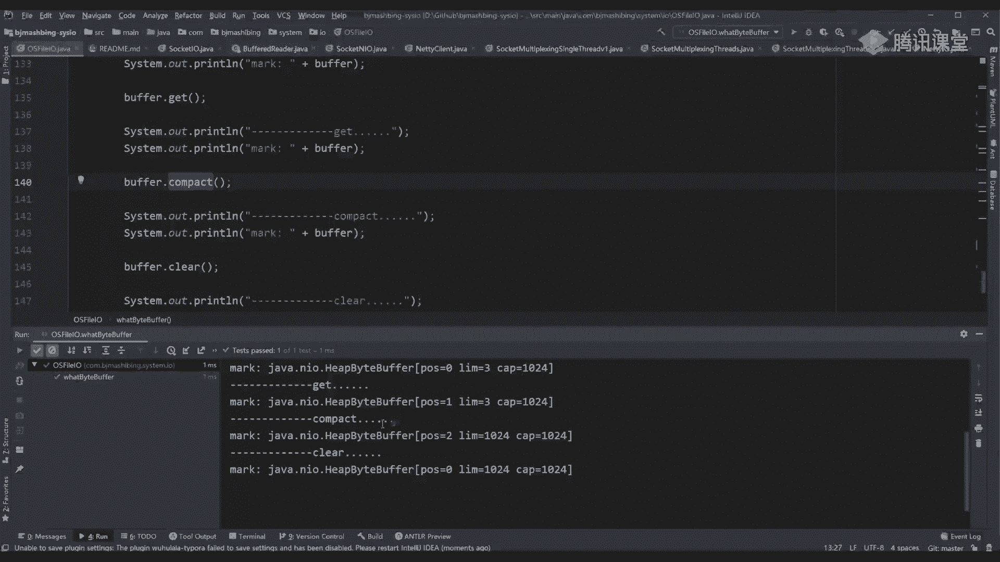

现在。明白什么意思吧？啊，就是我再给你画的精准一点，开始我这里边有仨东西。有三个字节。そ。那接。开始po，就是fep之后啊，就是先往里放哎，放到这儿了。这往里铺的put的3个，然后浮了之后。

然后它是不是回回零，limit是不是在这儿了，在这之后，然后我盖了之后是不是取出了一个，然后pos指针是不是往前移动一下到一了，compy之后什么意思？哎，把前面挤压掉。然后呢，comide之后是交换。

把指针交换到外边。因为com麦代表你要是从读取到写入状态，然后要拿到一个剩余空间limit再回到结束这个位置。然后这时候你可以往里写了。想写的时候comp一下，想读的时候le一下。分天来说。

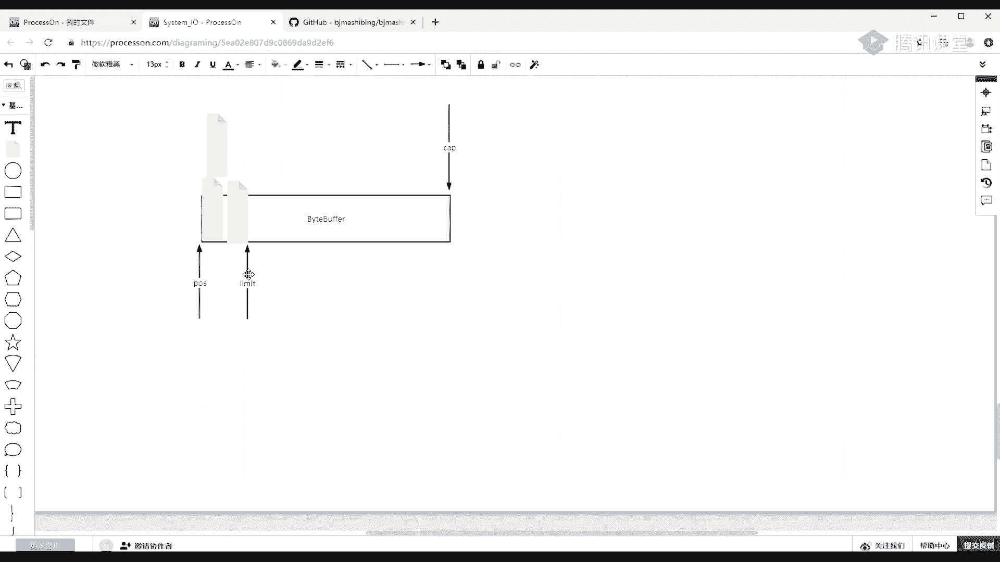

好吧，这个这个理解了吧。啊，其实你就就就就这个代码嘛，你你就拿我的代码，其实你都跑一遍，你把所有方码调一遍，然后都打开它那个偏移，你一看就是这么回事啊，肯定就清除一下啊，都都都归位。好吧。

这个理解了之后啊，这是第一步啊，butta bufferffer，他其实对这个自己数组这块怎么怎么去操作。然后再往上导导到回来之后，我们来看。😊，NIO里边的基于文件的啊，基于基于文件的NILO测试。

后边的话我会讲基于scket的NIO的测试，这就是几个分支了。先说文件的文件的时候怎么去做，你有一个random x file还是读取一个这个out这个文件，然后注意你要给出它的读写啊。

或者只读或者只写或者读写都有，然后给出这个权限，然后你得到了这个random s这个这个这个这个对象，然后注意先我先捋一下这个逻辑都做哪些事情，基这个文件。拿到这个对象之后，直接写啊。

直接写写了一个hello空格马士兵换行符。那我对应的文件当中就会出现这一行写搭了一个换行符。然后我继续再写第二行hello肖婉珠，这是我的名字，然后再一换行符。那文件当中应该出现两行字符串。

然后我给屏幕上提示一下，我readite写完了，然后这时候sim点 in点read那程序在这阻塞着，这是第一个阶段创建了它，并调用了普通的写。这普通的写是怎么回事？待时候我们去看一看这个这是第一个环节。

能理解的同学来上边一。理解吧嗯，很简单一个事情啊。你周。出了写之后，这个为什么它它叫做random access file，就是随机读写的。因为其实这个你之前如果没有这个随机读写的话。

之前使用IO要写东西。如果这个文件你往上写写写，你只能往后追加写。你说我再从头写，我写一半了，我再从头开始写，不行。它有一个方法叫sick。就修改你的指针的写那个偏移。我说了。

其实就刚新画图的时候也说了，每一个文件标符就是一个程序，两个程序或者一个程序可以打开这个文件。就是它是有一个sigsig一般就是你用用到哪儿了，它还可以移动这个sig到前面的pagec。

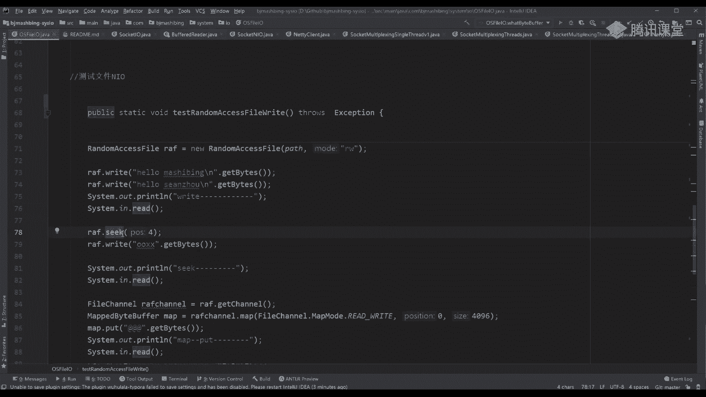

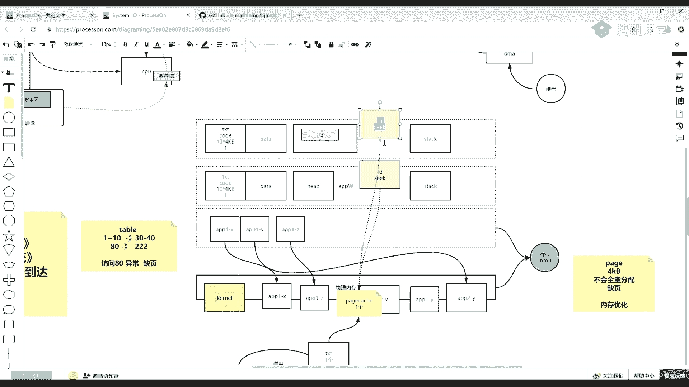

如果你学过大数据的话，就应该知道HDFS里边也有一个sick这个sick就支撑起了它的分布式并行计算。因为每一个程序打开同相同的文件，它们各自sick到自己的那个数据段里边。

去并行拿着自己的N分之1数据去计算，这块能定回来2边一。就店出。不有。然后注意看偏音量是4。🤧你可以理解成断点虚传，这个偏音量是40米，就没错，这也也就是因为s个可以实现断点续传。

没有4个没有这个sig能不能实现断点去传也可以，只不过重新打开重新走嘛。有了四个只不过分便点嘛。这个四什么意思是下标啊，这个字节那个那个偏音量，那也就是说0123到这比就是从这个位置，第四个这个位置。

然后我先移动过去，然后又写了群圈叉叉，而我们又重新打开文件。所以这时候如果这步完了之后，我告诉你sick了。我再再等着录入的时候，我们就偷窥那个文件，你会会发现就不是哈lo马是冰，而是HEL。

然后应该圈圈叉叉，然后马是兵，就就就被这个这个覆盖掉了。这就是它很灵活的一个特点。第一个特点，random S file，它就是像我们之前写的那那种那种LU一样，可以写。第二个支识点，它可以自个修改。

指针偏移，很方便。然后这个事完了之后再往下，你可以通过这个对象get channel拿到了NL的最重要的角色，这时候才开始真正NL的讲解。final这是一个fi channel。文件的通道。

且这个通道在我们上次上来创建的时候，是读写两两个方向的。那么拿到它之后，注意它身上啊只有只有文件的通道上有map。如果是server soet或者scket上边是没有这个map方法的。明白？

只有文件上可以做做内存映射。因为文件被称为块设备，块设备可以什么叫块设备。我上次上节课讲文件系统时候也说了，你可以来回自由寻址，读读历史的前面的某一块，读后面某一块这数据去趋向于都有，你们都能读到。

明白吧？所以只有文件才会做内存映射，就是把内存的那个配置c内核的那个配置c和文件的那个那个这个数据也映射起来。那个地址空间映映射起来。这不能听出来说边一就是只有文件的通道才会有M map。

咱拎这个这个内核里边。🤧啊，其他流逝的自负性的是没有的。那么这这一步mve的时候，然后模型是读写啊模式，然后是映什么？映射的是文件0到4096。其实这时候你还一会儿还要验证一件事情。

就是在这上面验证的时候，这个文件我只写了这么一点。你先看这个文件的体积是多大，体积是多大。但是如果做完这步之后，其实这时候体积就被就被扩展成4个字节4096。然后得到了一个map。注意这个map叫什么。

叫做mpe的 bad buffer，只有文件系统有map，只有map可以得到一个mpe的 bad buffer。如果从bed buffer去获取，你只能获取。堆上的和堆外的。独立的内存空间。

但是只有文件系统的fin the channel可以调map。这个map其实通过的是M，那就是内核的性调用M map得到了一个对外的，注意听是对外的。面向java的是对外的且核文件。映射的。

一个拜拜拜拜的八分。到这步能听的同学来说波一，这是一个极特殊的一个一个一个一个场景。什么时候用对外内存啊，一会我一会儿给你解释啊，尤其讲到后面边sry的时候，我都会让你看。你即便你在java程序里边。

你想分配一个。堆内的1624，你会发现使用s给的血的时候，他会脱了裤子放屁，他再弄一个堆外的那个字接数组，做一次拷贝之后，拿着对外的再去调内核的血。那你还不如上来直接分配对外。あの。咁啊。

这是为什么java，你是要先从堆内的数据拷到java进程的堆里边，就是从GVM的那个虚拟堆里边，拷到java进程的C的堆这个程序堆里边，然后再拷虑到内核的空间里边，然后再拷拷到相关设备里去。Yeah。

好吧，所以对外这个事儿是大数据也好，后端工程师高级这个支撑的时候，或做系统调度的时候，都得要去想着对外尽量去调对对外这件事情。个通司。还有。这个这这这就是搞死您的思想吗？高司令，你是说高司令的思想吗？

还是说之前的思想落后了，不是思想落后了。因为对外注意听对外，你看现在啊所有特征都是拜的buffer。只有ban。Not or be jack。没有对象的概念啊堆内的时没有对象对象的概念啊。大い？对啊。

然后再往下捋，然后我得到了一个map之后，注意之前我们都是通过r IO去写什么数据。但是你得了by buffer之后，我说了b bufferffer下边给你演示了。

它是可以通过调一个bed bufferffer字节数组的put往里放。但是这时候注意它不是系统调用。不是系统调用，这一定要记住了，就是你得到b bufferer之后，往buffer里放东西。

这个不是系统调用了，像下面普通的就是像堆里或像堆外的内存里边放了一些个字节数字字字节。但是这种特殊的通过finfi file channel里边得到这个 bad bufferffer你这个put表面上也是像你的这个字节数组里边。

这个b buffer里边去放了一些字节。但是这个字节又因为是映核文件映射了，其实就映射到了内核的配置cach。但是数据会到达。内核的配置catch。那么曾经我们是需要注意跟写啊。曾经我们。

是需要dot点儿。Right。这样的系统调用。才能让程序的data。进入内核的pager catch。这曾经是这样才能进入这个pay。要这也是换言之，这曾经必须有。用户太内核太切换。

那现在如果使用了这种my的 bad buffer，它只有映射了，就减少了系统交用了。但是数据也能到pa cache里边。但是。MVP的内存映射依然是内核的。配age catch。体系。所约束的。

能看懂吧。换言之。丢出据。呢个。都能都能都能听懂的，来刷波一。就是现在你没有现在你使用java目前来说，GDK没有能力让你逃离内核的p cache。目前的所有的AAPIun什么东西的。

都没有这个这个能力。你可以去G去找一些关于就是你可以。去ge他。Hub上找一些。其他的C。程序员。写的JNI。扩展。库。然后使用linux内核的。directIO这个内核的directIO什么？

直接IO直接IO是忽略。是忽略。linux的。Pr catch。どの？是忽略了一个pay catch，但是不是说忽略pay catch，这东西就特别快了，是把pa catch一定要正确描述啊。

别为面试规台节奏，是把配置。Catch。交给了程序自己开立。嗯，那这样的一个间接间接想法就是pre cash的好处是我内核把这个数据放在p cash里边，仨程序访问这个文件。

你们从pay cash都能都能拿到。但是如果使用directO跳过的那个pay cash。那这个同样这个文件的数据被拷到我的内存的时候，是不是交给内核的共享，而是交给了你程序的p cash是你私有的。

但是你依然要去动用代码量。一致性。脏等等一系列的复杂问题。あめ老。对。我相信现在因为我给你讲过了page cash的工作原理，然后再跟你说Dri虽然咱们没有API去可以模拟，但是现在应该能听懂了。

相当于自己管理了payage cash吧？没错。自是了。就自己开辟啊自己开辟一个字节数组。这是最通俗的，就是你自己开辟一个字节数组，开辟1个4K的。然后呢，通过DL的方式。

直接把数据通过DMA直接拿到你程序的一个字节数组里去了。还有说都是。自节受讼。对吧该丢也丢，只要你不晚血，你不维护脏，你不晚不使用DI，直接把数据写为那那那个硬盘，该丢也丢。啊，你去频繁写为内盘。

频频繁写写写向那这个字盘性能依然很低，也受也受IO影响。其实说白了你程序自己维护和你使用配没毛区别，该丢丢该慢卖。只不过你可以控制的细力度更多一些。因为那核的话。

你要一改刚才咱们改过这个这个配置这个配置项的话，它是全局的。它是对整个系统当中所有的这个这个IO就是统一管理的。但是现在的话，其实如果这个系统别人没怎么用的话。

你就可以完全细粒度的可以控制自己的这个这个程序的这个性能了。仅此而已。像操作系统不是像DDB数据库一般会使用DYIO。仅此而已，好吧。🤧Yeah。ma bad buffer能flash吗？啊。

你看看着看着来啊，你看着来啊，我下边都给你演示的呀。现在知道了，这个现在给你讲完了吧，这个IO模型这叫IO模型，你现在剪一上就可以感写精通IO模型了，对吧？😊，你在高。对不对？现花在哪儿啊。

666在哪儿？对不对？啊，还你还不能敢写，为啥一一票的soc you，你还不懂呢，你敢写。😡，ま。还差一堆scket的那个那个那个在弄完了之后就就就就改写了啊。但在这儿注意了，以上所所依据的。

也就是文件在我们使用file channel之后，然后可以达到它拿到map。但是这东西它依然走p catch，所以它依然会要么等系统帮你去刷写，要么就是map点for这个叫forse。

它类似于我们的flash。就程序我们自己可以强制刷写。这就类似于我们的flash。你刚才那个同学问的就是他。对。或。对不现在现在现在听清楚了吧？这是my，然后也会就整个代码，我给你演示它的普通写。

演示它的随机写，然后演示它的对外映射写，然后对外映射写之后，然后在下边再给s文件开始再s文件开始上面不是直接内存映射写了吗？那下边再使用普通的 buffer，我可以堆上分配，可以对外分配，得到八分。

然后这是把八下面我讲的8ffer直连应用到这个channel连接起来时候，因为把刚才刚才给你给你举个例子，现在咱们就直接给它用起来了，用起来之后，我先分配了一个堆上的或者一个对外的拿到一个八分。

这个八ffer注意，我是通过因为之前这个文件上面已经写过一些东西了。然后我给它偏量为零了，然后这时我通过这个文件，然后读取文件的内容，通过这个对象读取文内容。put到buffer里这个读写文件内容。

把buffer作为参数去是，其实是这个运等于。8号。点铺子了啊，往里往往往里去添东西了。bffer里put了，put完了之后，然后读到了多少东西。然后这个时候这一步是要翻转，因为从读就是从从往里放东西。

到后来你如果想对着它去读取东西的话，那这个时候其实你要给它做一个翻转的。翻转完之后，然后开始复循环，复循之后，然后开始对着我的这个buffer点get。啊，就取出它的每一个字节。

这个字节来自于它limit，因为翻转完之后就知道它的limit的这个控制大小了。这就是把be bufferffer给你演示逻辑，以及b bufferffer在我通道的联合使用的一个演示。

这是整个的一个rdom X five这个演示的一个案案例的一个一个逻辑。逻辑上清楚同学来说边一。

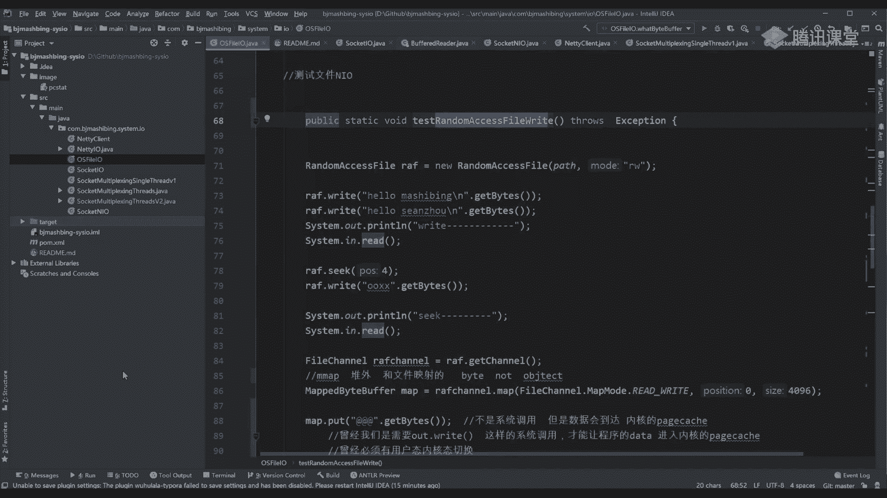

对对。这个是。演示好吧，就开始演示。啊。然后就。啊，不用删，他自己会删。妈把它跑跑的是012，开以跑2了，2二度测试啊。第一个注意看啊，该机执行。

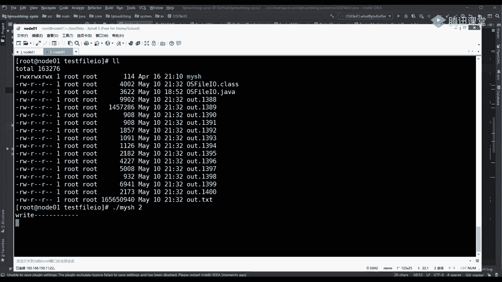

提示了一个right，他现在等着这我我输入呢，我先不摁啊，就到这步了，然后我们去开一个窗口去看一眼。

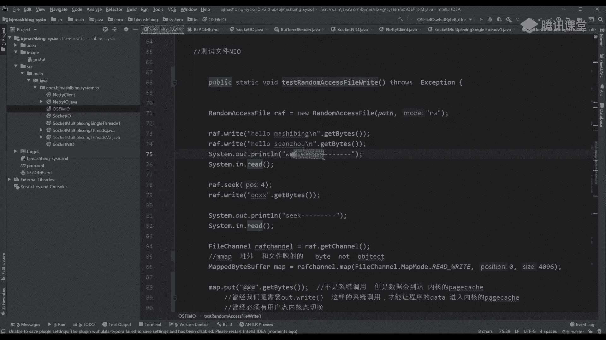

哎，outt点KID大小31个字节，我们来看一眼它里边写了啥。chat out点填加T它里边是不是写了hello马士兵，hello需周。当然这个你看到这个东西在磁盘上吗？如果现在面试官问你。

现在你看到的东西，他在磁盘上吗？前面写了。没错，还没有，他现在是是是配置K这里的，他是不在你磁盘上的，因为还没有做刷写这一件事情啊。

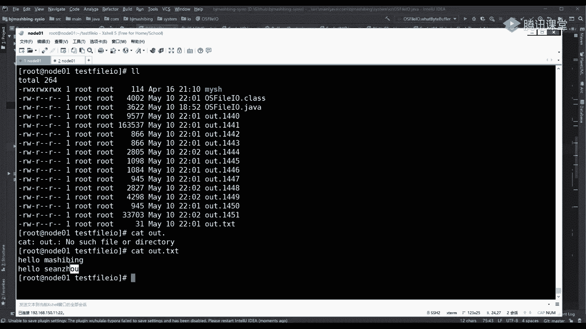

那么这步写完之后，然后我摁摁了个回车，它就开始往下走啊，你也知道这个数据长什么样子了。那我开始摁一个回车啊，哎8摁一个回车告诉你sick完了，它能sick完。

其实这里边也代表着他完里边又写了一个圈圈叉叉s到4写了一个圈圈叉。所以这时候你看能sick完之后就写了完之后，你再去ca out点TIT是不是HERL圈圈叉叉士兵，这个就是它的随机读写能力。

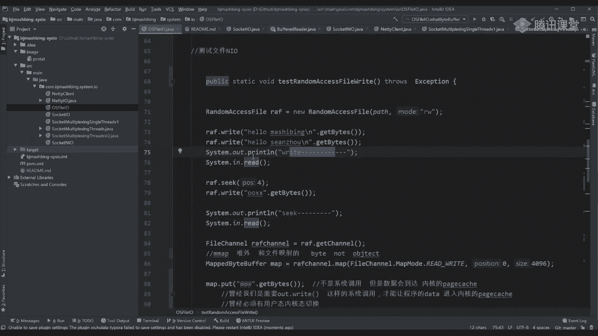

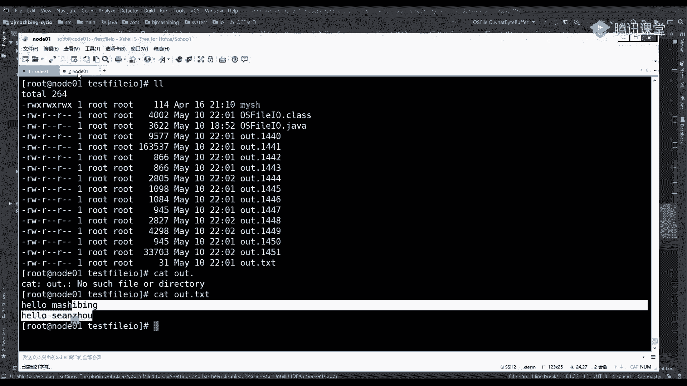

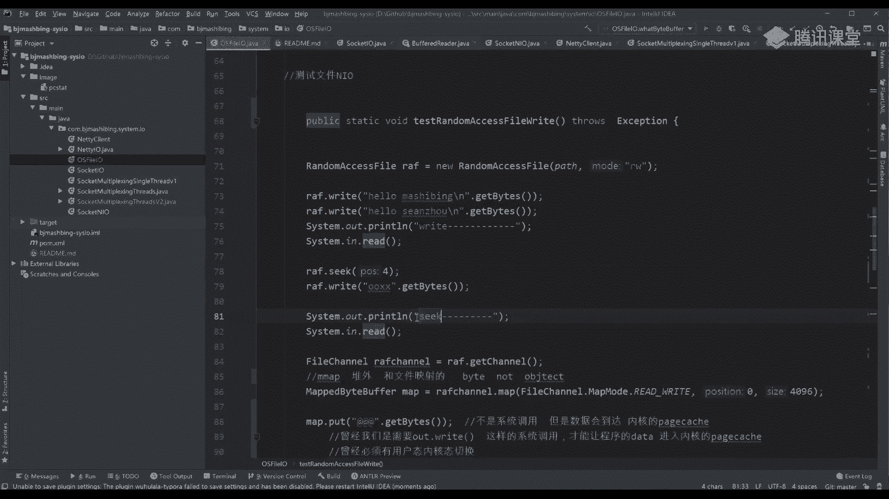

这个能看出出来，上边一赵勇还是这这。

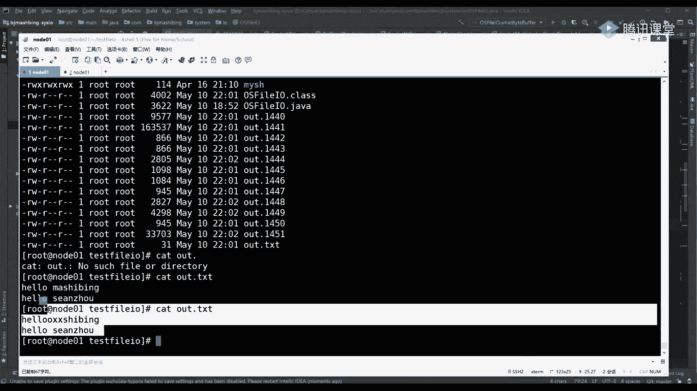

好吧，那这个完了之后又又开始等着我，我找一回车之后。下面就没有太多的，这还有一个read这还read。那这个这个过程当中，这个就是在上面这个read之间到这个read之间，它会触发一个MMP映射。

对不对？哎，这是MMP映射这个M映射怎么去验证然后开一下另外一个窗口GPS一下我们的这个程序加进程是1440注意看是140。

用我之前教你的这个东西都是之前教你的LOF让P1440来看它的所有文件标符以及内存映射。你会看到它现在文件标符012是标准的输入输出报错。

然后这里面三是加载运营时的time点账包4就是开启的对这个文件的一个文件标符普通的读写。然后我说了上面这个MEM呢是它做过所有内存分配。

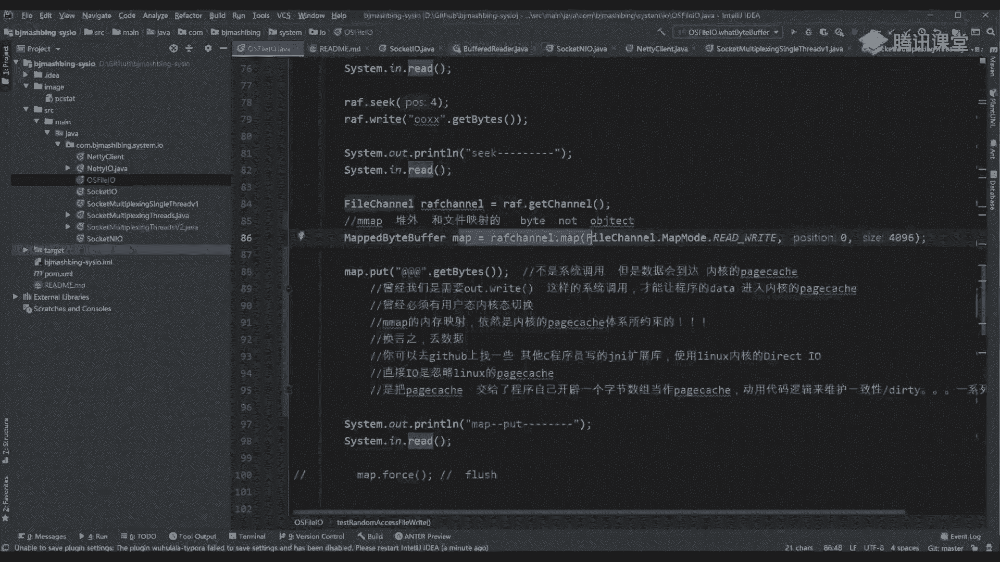

开启的目前这个里边是看不到奥点PIT。都是一些炸包，到这步能听出来，这就是他的那个代码段。加载咱们这个java的可执行程序，就是代码段KIT。对吧啊，这现在还看不到，但是注意看，如果我一旦摁下回车。

map put完了，先不看结果，再来看。因为你刚才开过一次fifin点map了，再来看这个程序，它就多了一个。就在这儿。memory一个内存映射4096大小。这。还有一个4号是普通的文件面符。

有两个都可以对这个文件开始操作了。你要么使用buffer put往里写东西，要么基于继续使用这个文件标符right read读写到这步能听懂同学说边一。就让你看到，让你看到。是不是看到了嗯。

然后且这时候再来看那个文件。😊。

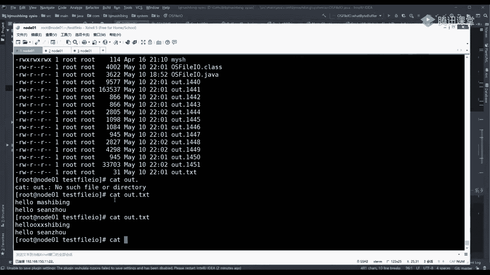

是不是又在前面加了三个艾？

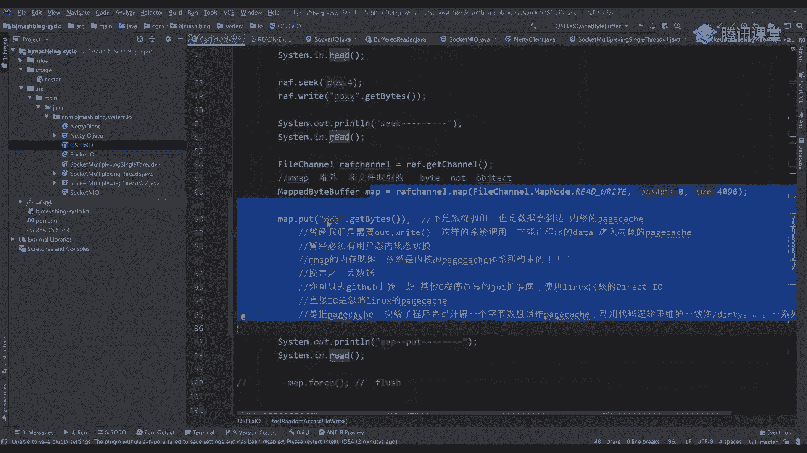

是不是前面加了3个艾 put的进去了啊。😀ふ。😊，然后再看那个文件大小。文天大小是不是涨到了4096对，没有。对吧。所有理论的东西都让你能看到一个实际的一个实物啊。那这个瑞德兰之后。

那接下来其实使用的是。

不是使用上面这个ba那个m bad bufferffer，是自己随便分分配一个一个buffer，然后呢C个为0，然后读啊读取这个这个相应的数据，然后再把它打印出来。这段其实没啥可以演示的了。

就是最后最后就告诉你他能这么操作，主要主要是给给你演示那个ba bufferer怎么使用的，往往下走，然后这时候开始就看这两个开始读这个。

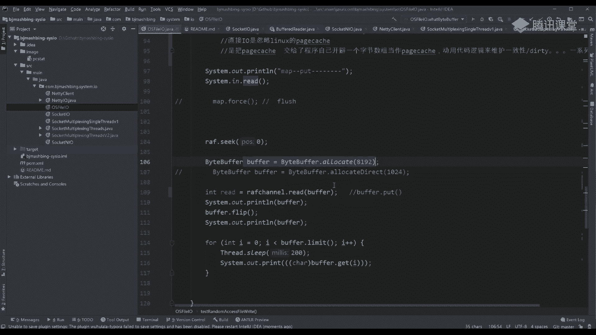

是读完了之后，读了1个4096啊，然后但是他读到多少是一个数值的。然后f利分成之后，从零开始limit4096。然后因为我分配了892，但是我那个磁盘那个那个缓缓存页是4K。所以这个读完之后。

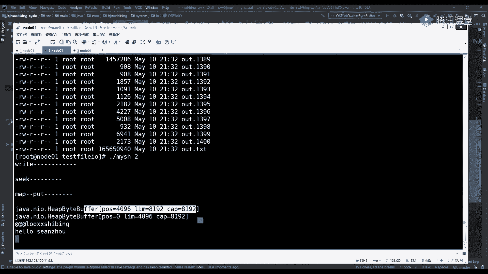

啊，这个瑞子没有没有没有没有没有用气啊。

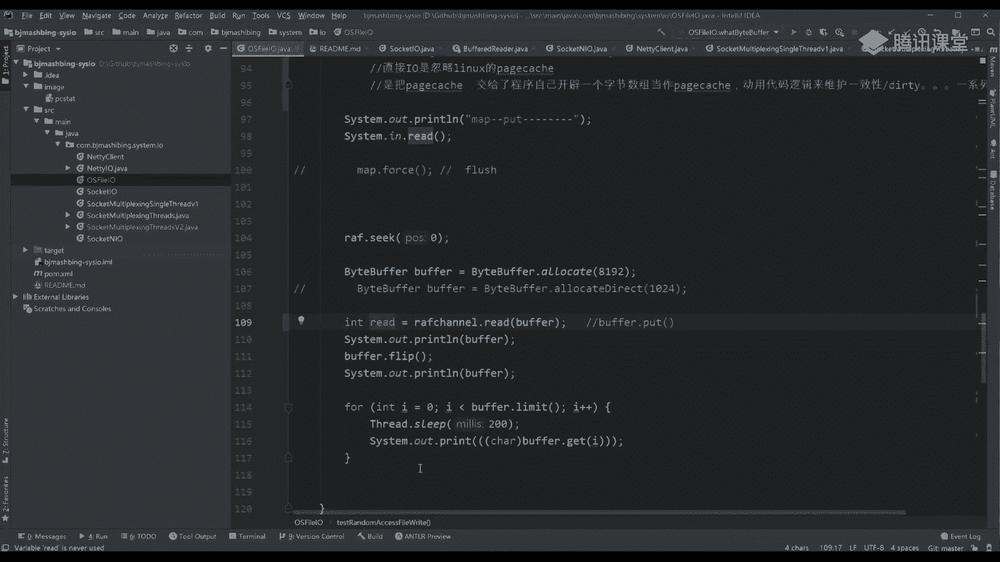

系下。但是不管怎么样，是不是也有足导东西也被打印出来了。我者。Yeah。mpper put会用到 page看什么？会呀会呀。

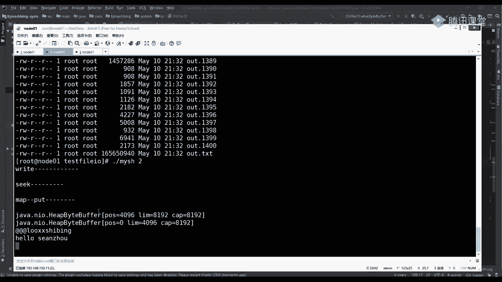

我说了这个就总结一下总结一下总结一下，把刚才的总结一下，尤其到这个redom X five这。首先第一个指点这这个我之前你听过公开课的，我也说过这件事情。但是今天我再说，你就听懂我在说什么东西了。

首先扎了。它是一个用C或C加言开发的一个普通的一个程序啊，它的级别，它的level是linux系统下的一个进程。这个能听的同学来说个一，就java进程跑起来之后，你就像刚才咱们看这。

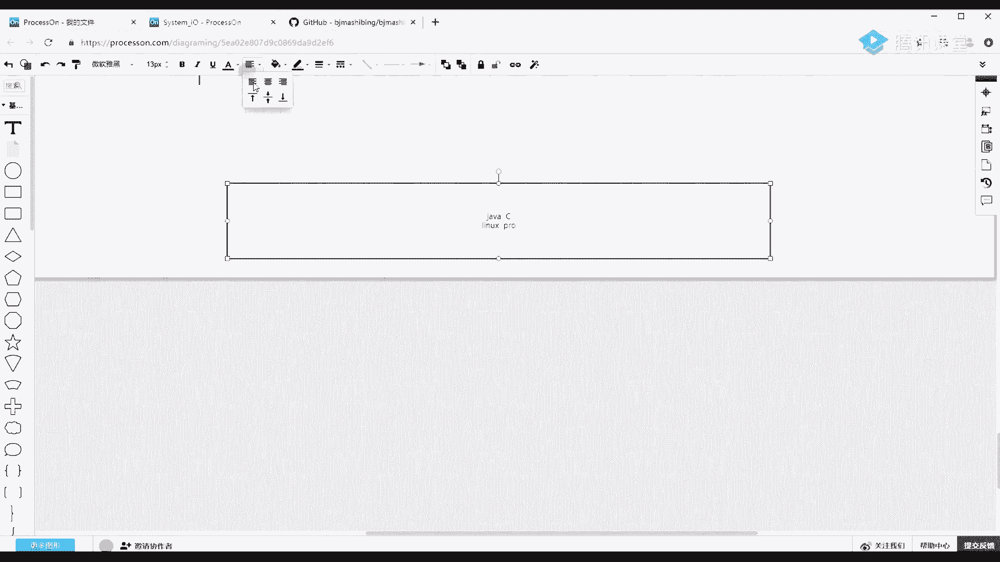

你java是个程序，它的二0制编译完的这个二0制代码段是你的这个进程里边的这个代码段TIT。

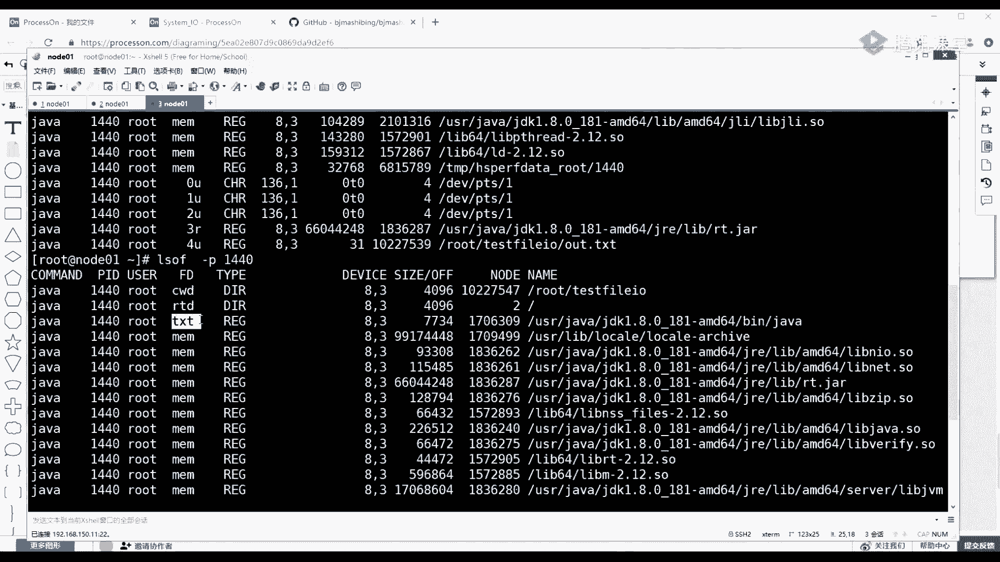

🤧然后也就是他的TIT是。java，然后它会分配，就是这个程序里边还有data，还有这个堆。然后这些个概念都是操作系统进程该有的。只不过在堆里边，它可以根据我们给定的差。

这里边可以根据我们给定的一个配置项。就是你启动。到时候杠叉。M叉吧啊M叉比如说EG。那这时候其实你的这源代码会跟系统分申请分配一个。系い。Yeah。と部。反正你。分配这么一个。

这就是我们所谓的javaJVM里的。Heap。哦。是线下对就是分配了一个堆上的一个分为了一个堆了。堆了之后，然后如果你用的是bad bufferffer。

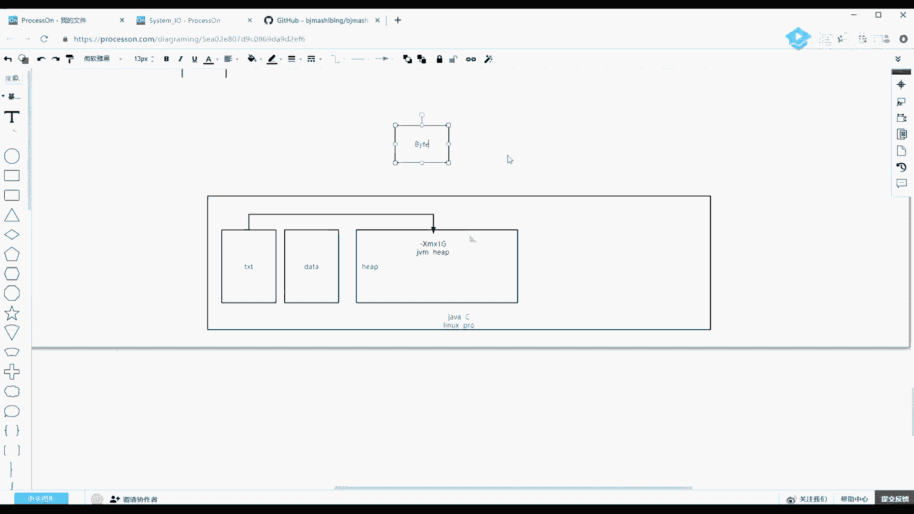

我。然后分配的时候，我就直接抄了，单词老记不住。

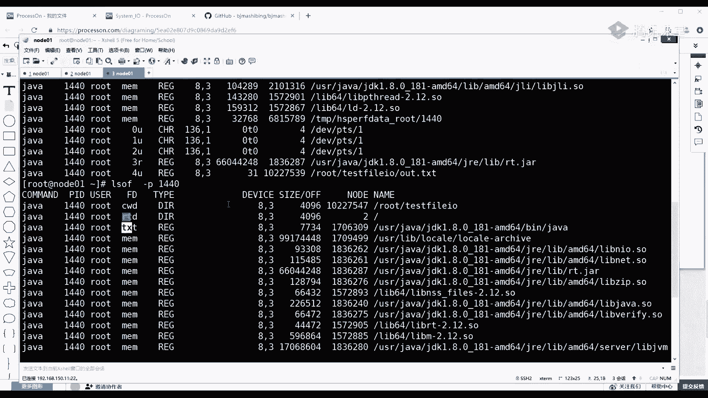

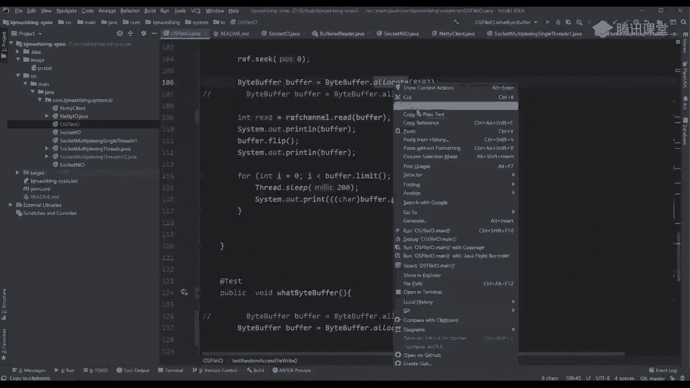

真的不见到。这种分配方式是把你的字节数组。分配到了堆上。哇。

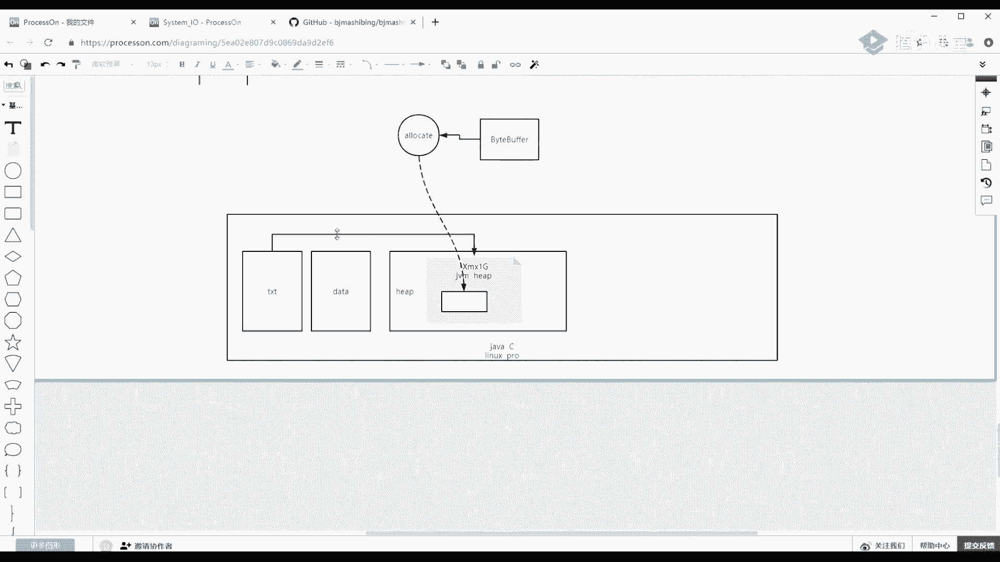

对吧但是如果你使用的是另外一种分配方式。

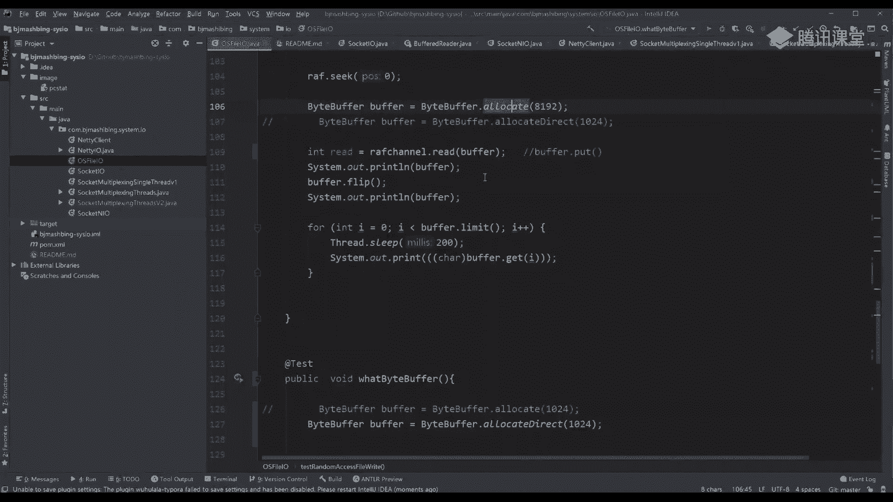

然后。那个。是分配到了你不是GVM里边的，是分配到你这个java进程的堆空间里边啊，他申请了这么一个区域，这是你的这个babuer。Yeah。这是这是unhi，然后这个是onhi。对于面向java来说。

unhi这是of hip。尤其你学大数据，学sk，这点一定要是分清楚了啊。然后对于程序来说，对我们的C程序来说，访问这段代码是直接访问。因为这段代码所在的这个字节数组的这个线性地址。

就是你进程的线性地址空间。但是这这段字节数组的地址，它不是你的这个G进程的线性地址空间，是你乘GVM的线性地址空间。它需要一次这个这个这个这个翻译，或者把它拷贝出来，再给你直接使用。

然后如果你不是用的这个b bufferer去分配的。还有一种分一共三种分配方式对呗，有第一种对上分配，第二种对外分配，这只是分配。这个这个作用域是只是分配了字节数组，可以往里填东西。但是数组的东西。

如果想交给系统的话，想交给系统的话，依然是要通过你channel的right写和读。也就是我最后re后边，就是如果你想你想用这个but bufferffer。

你肯定是要通过channel去读它或者是chan去写它啊，这个channel点right写这个ffer，所以你肯定还得是去要通过别的那个FD就调那个系统系统调用给它写出去，它只不过是一个缓中区。

它类似于你咱们传统的那个自己定义的那个字节数组。

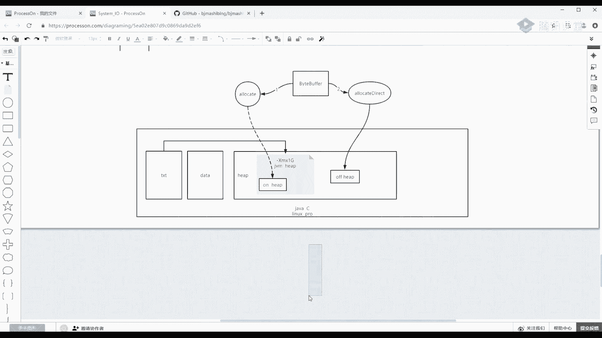

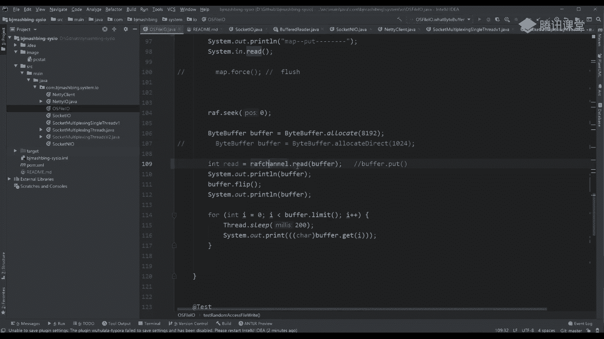

对不对。这个hiap是进程的，是你这个java进程的，黄色的才是GVM的off hip说的是GVM的堆外onhi是说的GVM的堆内，这是一个堆，这是一个这个hi。我这不写了吗？下面的这个这一行。

这不写了吗？就GVM的黑。但系可。这个是你就写成写想成是linux。都黑。Yeah。清楚了吗？脑子一定要一定要一定要一别别别等片，一定要一定要想明这个事儿。多人。当日会打。反呢佢。我你好。

然后但是有一个对象叫做fill channel。它里边会有一个。麦克方法。麦克风法会分配一个ba by。my bad buffer就在java里边，是叫做m by bad buffer。

但是其实它也是一个字节数组。啊，这个东西就是my的。这个mag什么意思？这个magit首先它也是一个直接数组，就是在一个操一个操作操作性统的一个普通技能里边，你可以有代码段数据段堆段。

然后或者是通过MMAP系统调用。分配的空间。然后还有就是映射空间嘛，还有战区，有几个内存区域嘛，还有战区。这怎么写来着？这样吧。啊，战区这是一个进程里边可以有的几个区域啊，是这个。好吧，这是这个区域。

就是你通过内存映射M就其实你反正这个就掉了MVP了。映射之后，然后他做了一件什么事？这个映射这个映射它的线性地址空间。就是在用户的性引率空间，其实到达了内核的。这是你个。空间是可以直接访问的。这些。ふ。

Yeah。あ这个。这里边的逻辑地址，然后呢是直接映射到了我们内核的逻辑地址。就内核在这个这块怎么说呢？就是内核里边的配配agec啊，应该说是内核的pc。当る。这个。嗯，这样说就好说了，可着开。

然后且这个pagec，最终这个pc它应射到哪去了？根据上面的这个这个这个这个描述啊，这个p置开内核里边这个pagec它是来自于如果它是脏的话，在未来你要写的话，如果它是脏的话，你要写的话。

它依然是受内核的胚盖的影响，最终是要落掉到我们的磁盘里边去。1班的文件。但是文件因为在你map的时候，可以给出参数，说我这个参数是从文件的从哪儿到哪儿做多少多少结束。其实它映射的是某一个区域。

文件的某一个区域，这个区域你可以来再自己定。🤧只不过在这个应用区域里边啊在这个应用区里边，这个是通过铺的方法。就是我们的程序里边只需要写put。且这个铺的方法，它不会产生系统调用。

但是后边这个从dirty到这儿是受内核影响。现在能看到了吧？就这几个区域一个。两个。3个。你要记住了，只有five channel map完了之后，你这个m的 bad buffer。

这个字节数组的地址空间对应了page catch，它是配 catch的。然后你这个分配的堆内对外这个。虽然他们也是在你的page catch里边，但是它不会一一对应上啊，不会一一对应上。

而且这是在你的绝对的用空间，如果这些字节数组里边的数据想要达到内核的那个page catch里边，就是内核肯定还有如果是。想写到文件的pca里边，就是他们与他们之间的过渡里边是要通过必然调一个方法。

这个方法就是channel点read或read。就在他们之间一定加了一个channel点right或read。也就是必然有系统调用，也就是必然有系统调用这个方向。

这个方案仅使用堆内对外的bed bufferffer，必然有有系统调用，使用m就减少了系统调用，速度更快一些，减少系统调用。但是他们都是在payca这个级别都会丢数据。

然后堆内堆外只不过是使用堆外的divide buffer，它的性能要大于。就是减少了性能好。就他们两就他们两者比起来，他就一样两者比起来，它的性能稍高一些。就能收购一些。

那就是说为什么还存在这种方式这种方式？因为这个。如果是你纯手写的代码，就是你从obB get。注意听啊，就是如果OBJ取决于OBJ。如果OBje。是谁？如果这个OBI的对象是你的。

你就可以直接让他你直接可以分配一个对外的，就是OBD是你能控制的。就在逻辑代码当中，你的方法里传入了一1个obBJ，你可以给他们多序列化，转能字接数组，那你就开辟对外。但是这个obBJ如果不是你的。

他这个obB被别人的炸包先转成了一个。因外这个这个这个bag一个数组怎么说呢？就是你能控制的时候，你是可以控制对外的。但是有的有的时候你可能是只能让他去这块怎么能给你解释，我给给我自个讲晕了。

大家帮我想一想，就什么的时候你只能使用对外的，然后必须要完成一次拷贝的过程。🤧。然后。Yeah。对。嗯，这块我还没有想到太多的。对。没错，就是OBG可能它是要先序列化，序列化之后呢。

还不能放到堆外直接去往外发送，它可能需要加工。但是基于字节数组加工的话都加工了，那什么时候就必须得分配一个堆内的。而不能使用对外的。だね。对，这个这头对。反正这边就是你方法能接收能控制的。

这个是明非常明确的。Yeah。就先写一个，你不能控制吧，先先留留留留个断留留个断点吧。🤧当是这个描述不太准确，肯定不太准确。大家一块儿集思广益，想到了，你可以帮我补补充一点啊，先这么放着，没错。好吧。

OK。😊，还行吧，这节课讲这么多可以吗？教是。🤧onhi是不是先传到进城里，再传到皮利看onhi是。是你GVM要分要拗一个自觉数组，然后放到你的堆里边。那个自觉数组其实也是一个也是一个对象啊。

是先放在这里面。如果要往往外去写的pca的话，没错，是要其实是要走一个对外的过程的，这个线还不能直接这么过来，不是但是这这这这个这条线我想表示的什么意思啊？就这两线怎么走什么意思？就是想表示的嗯。

是要走他。是这个级别，就是这两条就是你堆内的对外的。如果想到pay cash都是要走系统调用的。只不过这个系统调用的话，它可能是要先其实先往对外走一下。

这他能啊就他先先从这里边去到外边才能走走走走出去啊，这条线应该是虚的这条线应该是虚的。这现实了。这东西。我是。呢个。

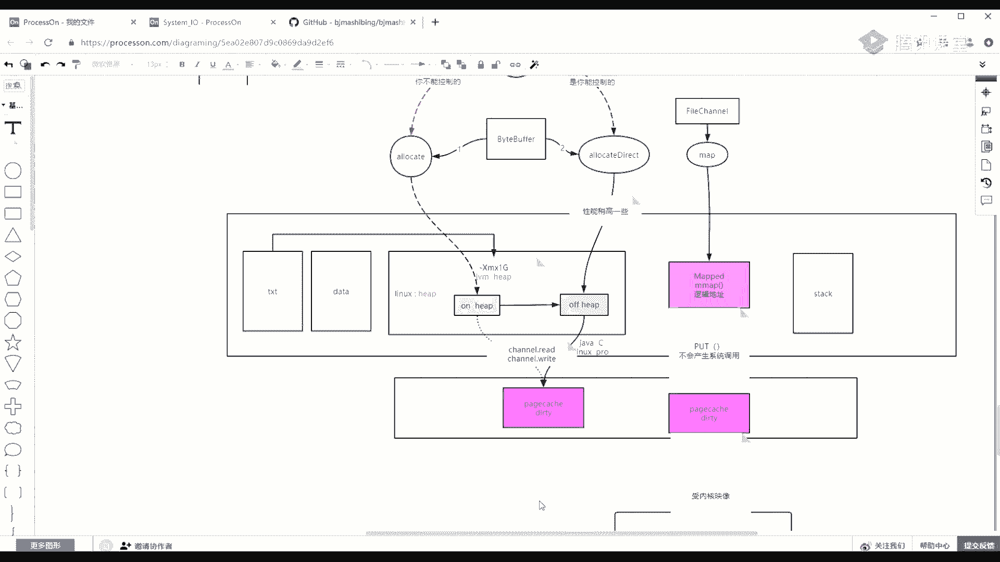

🤧这样我也不太清楚，我们可以看一下，当你写一个东西，通过redom x file这上看看看原文嘛，你要写的时候别须走写写readd by balance，你给了一个字节数组，他要写。

8进来这个进来说native啊，这就看不出来了。但是从哪能看出它拷贝的过程。我来了。其实这个应该是可以看出来一个所这这个这没有写出来。

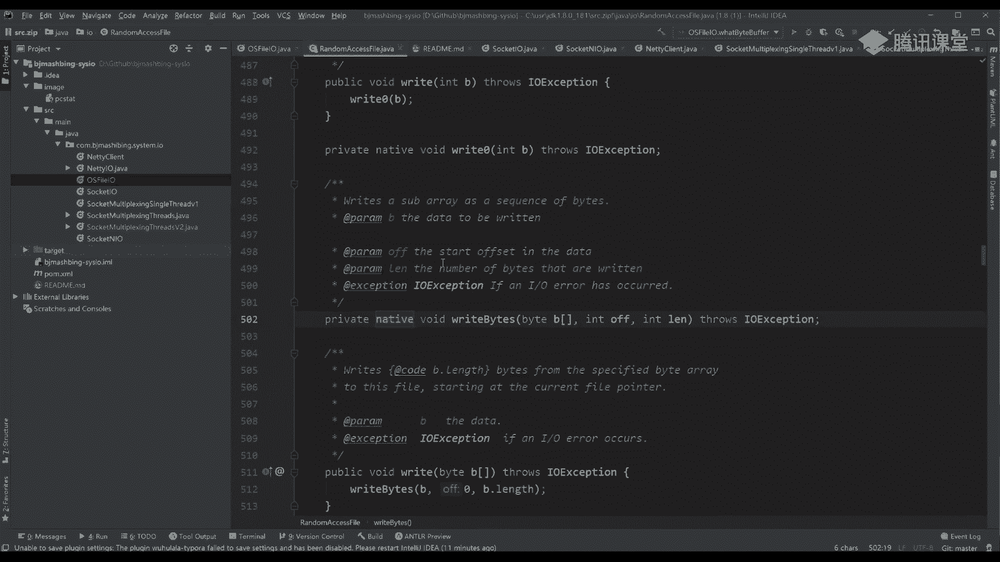

这已经叫nty native ninety的话，其实nive是。

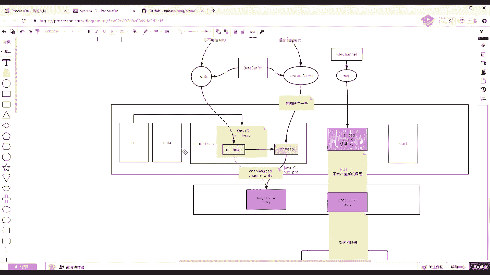

这很难看出来技能怎么掉的对。Yeah。对有。但如果看一个。いや。我这边没有没有那个那个DDK的源码。然后在这面我还有输出秒，稍费点输出。对即经。

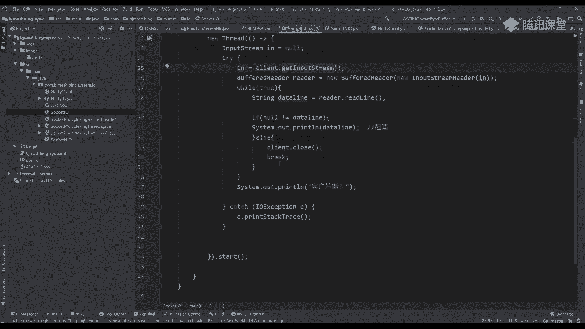

算了，不带你聚了，太麻烦了。你先记住这一点嘛，这个肯定是有一个拷贝的过程啊，肯定一个拷贝的过程。从里边到外边一个传输一个一个一个一个比较比较影响性的这么一个过程。そなはい。

堆内是在GVM进城里的堆空间里的，堆外是内存是GVM进程里的。而。别课。对我给你写，我给你把文本写出来啊。嗯。这方。堆内的。说的是。GVM。的对。理的。数组。我就少写一个字节啊，写上么字节数据。有けな。

然后。堆于外子。注意对外的也是面向对也是面向GVM的说的。是。GVM。对外。也就是。java进程的堆里的。有都。不明我。有时。然后前面有一句话。然我公司这。这是这。不太准确的一个描述啊。

你就想成你就想你就想成。你就想成。GVM的堆。在java的堆立。好吧，你这么去想一件事情。然后另外一个就是my的映射M映射。对。是通过是m的映射是。这个调用。或者这个。这点么。进城。好。那会儿。共享。

嚟。区内存区域，然后且。这个内存区且。区域是配置开。然后。到文件。应用社。映射就这个区这个这个你想是逻辑上是一个区域卖卖这个M卖MAP的，然后呢，且和p cash是1比1的关系。

且直接和我们的文件有一个映射关系。我好月。那横面一个应射关系，然后最终就是。性能来说，onhi。小于of hip，然后小于mype。但是只限。文件。现在我因为我只给你讲了文件系统，这些文件。

为什么会容易丢失数据讲讲呗，这是不是前面配置开的内容吗？这节课可能信量比较大，你前面断片了。那没有什么明了？条件反射没有了。是不是陈建海盛没有了嗯。这。Yeah。先先去先去攒这个吧啊，后边我再给你。

穿起来再给你讲一遍，再给你总复习的时候再讲一下，好吧。像场景使用啊场景使用的话嗯。比如nty。nty它里边可以onhi也可以。就是那里边拜的八ffer，就跟文件没有关系。因为那偏偏骚给的偏网络多一些。

为什么现在不要给你总结，因为差东西呢。然后两个都可以，然后最终其实他更优胜一些。啊，讲到netty时候我可以带你看到原码。你即便开备了一个unhi。

但是它net底层也是要把那个那个耳拷贝拷贝到这个ophi里边去。然后像卡夫卡啊，然后它的log它的log是用的MMAP麦。啊文件的这个方式。然后在这儿顶多呃场景的话，其实看这个没有那么太细的场景。

这本来想后边跟你说的，非得要问，我先给你写，但是我不知道我网络通信啊，我点没讲，我不知道能理解啊。我告诉你一个最值钱的一个答法，这是在面试面试的时候，你要必须会答的一个问题。首先你听了这样的一个。

就是你如果学过记组，有了像样这样的基础知识，其实你可以给出一个结论，这个结论就是这个计算机。就是我们的操作系统啊OS。没有。绝对的数据可靠性。最少他肯定丢一条啊，你刚刚写。

然后那个那个数据肯能肯定丢一条，最少最少多少他肯能肯定丢一条，就绝没有绝对可靠性。而且你要知道了，就是他为了他就是为什么开辟。为什么要就为什么要设计配置catch。来回说这事啊。

为什么说得pay着 cash，因为就是减少。减少IO的调用，就是是减少硬件的调用，减少硬件。无论网卡还是这个磁板，就减少硬件的IO的真正那个那个那个调用，他们是想提速。啊，优先。使用内存。很简单，这个。

比如说你我就想对着我这个文件，这文件就就几百个字符，先改这个后改那个后频的改拼的频频频的改，你如果能改一下就存下来。因为他连4K都没到。这个时候如果隔一个时间窗的给你往往往下搞的话。

其实你中间操作变化的结果给你写写下去了，能理白什么意思吧？啊，就是优先使用内存。😊，😀H。如果你追求性能的话，那这个时候其实你是要在可靠性、一致性和性能之间做权衡了。说这些东西是一个基本常识。

最终你要说出哪一句话，注意听做哎，没错，你看卡牌也丢出去，绕WQ丢出去，只要使用操作系统，使用IO就绝对会丢数据，你要性能高就丢的越越多，但是这时候怎么办？你即便你注意听，这是你要换位思考。

再往上升高一级别，再往上升高一级别。即便你想要可靠性。调成。最慢的。方式就是没写一条是flash没条flash。但是。单点。问题会让你的性能。损耗。一毛钱收益都没有。这句话能听明白来，说边一。

就是你要辛辛苦苦，你学了所有的机计算机组成知识了，你也知道了该调整哪个级别了。但是你辛辛苦苦的把所有性能损耗就全搭进去了。但是单点故障让你的一收益一毛钱收益都没有，这机子整个全挂挂没了炸成灰了。

所以尤其在现在的封水情况当中啊，都会做一件事情。😊，就是什么呀？主存复制。准备。A3。我不会。🤧这就是为什么？尤其你比如说。为什么卡夫卡他要让你去做一个就是卡夫卡和ES测试啊，就先给你说到的卡夫卡。

你举个例子，或者ES测试，它里边都得有一个这个副本的概念。但是这个副本你知道这个我还没讲呢，这个副本肯定通通过哪儿得到这个副本的呀，socket。sorry的是什么？他也是IO。

但是没有办法综合考虑多机多副本性能调到差不多的一个合适点上就OK了。那么在副本的时候又分为同步和异步。一步的区别，巴拉巴这个支识点就很多了。就是架构师为什么之前你的知识体系得堆堆堆堆堆堆掉。

你知道所有的所有的知识点之后，往那一往那一扔，我把所有的细节都想一想，可能出现的问题都想一想，我得调一个我认可的我的需求可以接受的一个合适的一个点上。能有吧嗯。Yeah。好吧，周这课讲那么多，可不可以？

😊，啊，回去好好看啊，这个课没天着讲，就是给你一周的时间回去可以复习一下。啊。这视频过个两三遍吧，行吧嗯。好，下课了。

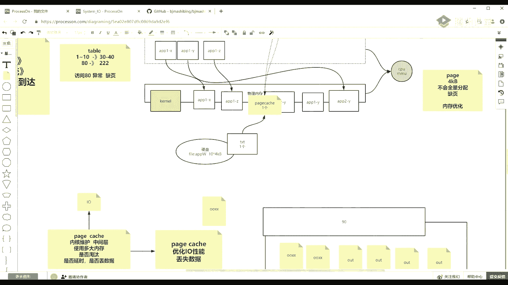