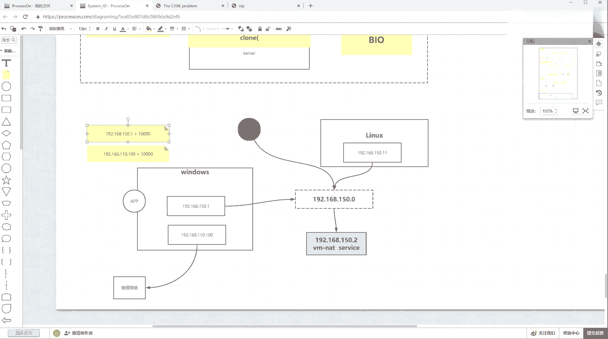
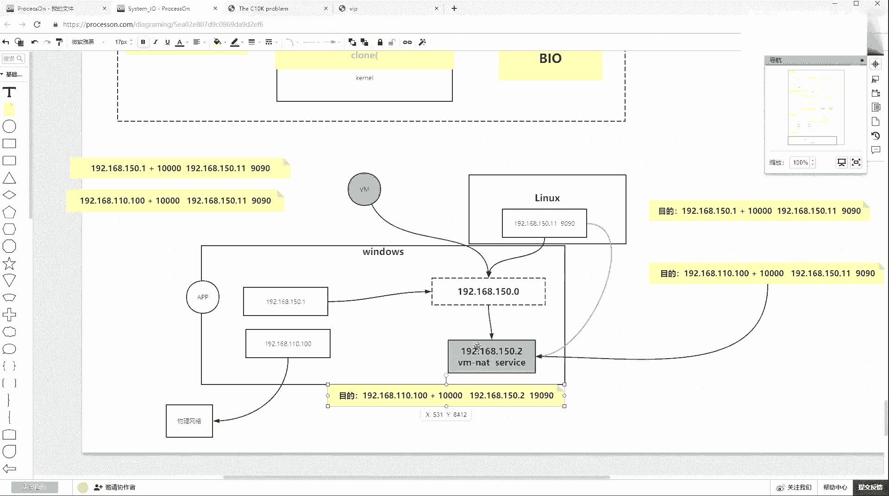

# 系列 3：P190：【IO／NIO】拓扑结构 - 马士兵_马小雨 - BV1zh411H79h

首先我先画一下我的to结构，我是不是有一个linux。这么讲，没问题吧，我是不是另了一个地址，192。168点150。11，这是他的地址。那么这个地址其实我说了，我的整个还有一个windows。

系个 windows。加我我这个。我琢磨了半天啊，我我我您可我讲的慢一点，这节课讲的累一点慢一点，讲的东西不多。但是我一定要给你讲明白了。因为通过最近大家问问题，我发现了网络，尤其IO这个环节。

大家很多问题都想不明白。所以我这块我宁天给你讲明白了啊，你烦也不我我我也不看啊，那那个一块网卡，然后我windows上有2块网卡，一块网卡是1。2。168点。150点1这个案子地址。

然后还有一个地址是192。168。110。100。Yeah。有两个，然后呢，我们会有一个东东，这个东东是微莫尔。它是一个软件，它除了能给我们模拟虚拟机，还能模拟虚拟网络。所以它呢模拟出了一个网络。

这个网络是什么？这个网络是1个192。168。150。0这个网络网络号是150。0。他不止给你维护这么一个一个网络。这在网络当中，它有一个东东，这个东东叫做网关，也就是它的net。一个地址，192。

168点150。2。有这么一个所谓的网关。那也就是说其实不应该拿过来画。あ。今。终于看了一个对应关系。如果vivo有虚拟这么一个网络，然后网这个网络里边还有虚，还有windows上还有一个软件。

一个一个进程。这个进程其实就是15。2持有，就是vivo的那个net服务啊，vimo的net服务。那个service。带你看一眼吧，就是找你的电脑，然后管理。管理里边你可以找你的服务，然后服务。嗯。

V到we more，它是不是一个net service啊，we morenet service它也能运行着它其实持有的就是我们19219216815。2这个地方。然后这个时候它是有这么一个过过程的。

那么它转完之后，注意我们windows上一块网卡，这块网卡是连接的物理网络。啊，那个物流网络。然后呢，10。1就是vimnet8那块网卡是进到这个网络了，linux已进进到这个网络了。

所以这时候其实为什么你的windows上如果有一个程序。你的windows程序程序可以是叉 shell，可以是你的浏览器。为什么可以访你linlin linux里面那个进程？

就是你windows上有一块网卡，这边是可以把数据包传递过去的。🤧先讲nty啊，你可以把这节课关闭。然后到后边讲ny的时候，你一听哎，新讲的nty对不对？但是你会发现好多事听不懂。

所以你要回来补这这这节课的视频，好吧。那么window的程序可以通过这网卡把数据包传递过去。但是这时候刚才我的程序当中有这样的一个设置。这个重序设试当中是192点，我会绑定我192168点150。

1作为圆，然后加上一个随机断口号，这个逗号比如说1万。我还会产生另外一个所谓sockcket的，就是我想拿着110。100，然后加上1个1万，这是我windows这个程序在这个。

这边创建创建绑定那个sD客端的时候，会有15。1和100这两种绑定方式。然后他们目标都想去访问谁，都想去访问我这边的一个。

9090，那这时候看其实winds也有也有路路由条嘛，就是这个如果他的目标地址。就是这个不管怎么样，只要目标地址是1。2118150。119090。这时其实你看路由条目的判定嘛。

windows也会做路由条目的判定。windows上是不是会有一块网卡直连了150这个网络，就是windows有一块网卡，所以windows直连了这个网络，所以目标地址是10。11。那么10。

11就在这个网络。所以无论你客户这个这个用程序，你的原地址绑定哪个你windows自有地址，这两个数据包就一定会从这个程序，通过windows。

然后通过这个虚拟网络发到这个linux上就是过去这个过程是靠windows有一块网卡进入这个网络。所以它的路由条目就一定发过来，这个能听出来，稍微一就过去的时候是肯定能过去。对吧那么当过去之后，哎。

这两个都过去了，过去完了事之后，是不是比如握手第一个包过去了，过去之后是不是得返回包，返回包的时候注意他俩叫三个个。那如果目的。地址是10。1和目的地址。就特殊标准来啊，这目的值是110。100。

这两个返回的时候概念就不一样了。因为你这个如果这个数据包返回的时候是10。1的话，那15。0这个网络是不是自己直连的，它是不是直接把它扔扔的这个网络，然后直接就交换到这台机子上就就就回来了。

所以握手的包过去握手包返回再确认的包都能来回走，就是基于这个地址绑定。但是你要这里面难受的是谁，难受的是110。100。如果以这个地址。作为目标地址的话，那这时候会触发windows路由条目。

让他走什样。就是走到。吓一跳是10。2就走到这儿去。明白吧？就是让这个数据包会走到这儿，但是走到这儿之后，也就是如果这个数据包走到了net地址转换，比是下一跳是1。2话，交给他就是吓一跳。

并没有并没有他而走他就是ma地址绑定是他的骂地址直接扔给他了，扔给他之后，他其实会变换一下，变换成原地址是目标里还是1110。10，但是这会被net转换成2，就转成他地址，证号号可能还还要随机的换一下。

比如换成了19090。这是所谓的地址转换，就转成这个这这这个效果。但是这个效果转回来之后，它即便说能够进到我这个windows里边来，因为windows里边有了一些东西嘛，就即便能进到windows里。

但是这个数据包在windows录入表一判定的时候，就是windows通过这个软件收到了这样一个包被转换出来的。但windows一看。这交给谁呀？因为所有的程序当中都没有一个set。

说来自于110100和1。2的那个sulet。所以这个包都被丢弃了。windows windowsdows不接受，因为没有任何的程序，曾经有这个期望。因为他们都是和15。11的，也就是为什么回包会丢。

为什么我加了一个路由条嘛他又能回来？

