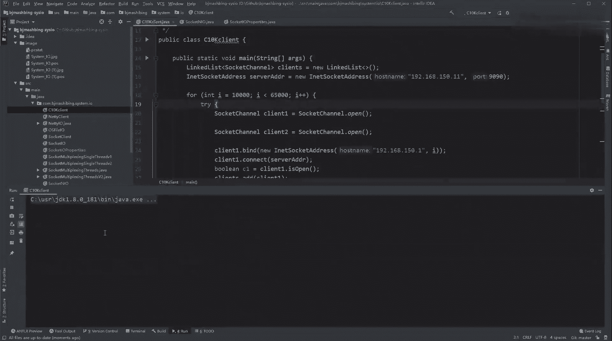

# 系列 3：P192：【IO／NIO】答疑 - 马士兵_马小雨 - BV1zh411H79h

来处理一下咱们的小伙伴的答疑的问题啊。我现看不兰的，能再说一下一个县城怎么就在不阻塞的情况下管理read或者right。在传统IO我有点忘了，我不知道我说清楚了没。

嗯，在这儿。看，我再给你对比一下传统的IO代码。传统的IO代码，我们就用的DDK的IO对不对？没有NL啊，我们也没有设置blocking为 false。所以这时候在主线程当中，注意看。

在当天的主线程当中，我得到了一个这个serv soet啊，会new它，得到一个serv，得到serv。然后注意看呃到下边一个死循环，在主线程当中一个死循环会去accept接收一个后端。

但是在这注意它现在是阻塞的。因为你没有设置，没有配嘛，对不对？这个阻色的阻色是什么意思？也就是他没有飞机。没有负一的返围的可能性，因为他一直。卡着不动。刚才我给你演示了，调到底层API的时候。

系统标用的时候呃accept。比如说根据64逗号就没有返回值，就一直在那卡着。什么时候一个客户端帮都连到那台服务器上了，他才会有返回值，得到那个客户端的文件面服务。这个叫木啥嘞？木来到这一步。听懂了吧？

哎，这会阻塞。那这时候假设阻塞，有一层能连接之后，得到一个客户端。那这时候你去想啊，如果这个客户端不抛出线程，你在下边就直接想这个客户端去read的读取数据，假设我写备代码。

如果就直接在这想这个plan这read的读数据了。那这时候其实这个客户端这个连接，你也没有设置设置这个非阻塞，那么它就一定会进入一个状态叫阻塞。因为对方你的客户端没有发来数据嘛，你在这读的时候。

他也没有负一，就这个组字的话就没有负一返为值，就是我没有读到东西。那这个也没有也不没有没有非没人的概念。那读的时候就在那阻塞，阻塞的话，代表着整个这个循环就被堵住了。

那这时候如果你想把这个图端读却在这阻塞，别人没有发，但是恰恰又来了一个客户端，想让你接收一下这个外循环回得来嘛？木兰回的来嘛，代码是不是执行不动？这一个县城是不是不可以在阻塞读的时候还能记住别人。

不能干两件事儿，是不是回不来，所以这这个怎么办？就把这阻塞这个事扔到哪去，扔到一个县城里边去新的县城里边去做。所要搞一个新县程，抛出去在新县那里边去读。对吧这个BO木兰听懂听懂了，你就敲一波一，对吧？

都其他人你应该能都都都都能听懂了吧。哎，那么这是他的弊端，也抛出很多的线程。那为什么要抛出线城，根根在哪，是不是根在组侧上？最大的根源数据在阻塞，因为阻塞，所以抛线程。这句话记住了。BIO因为阻塞。

所以抛现程才能满足一个服务端接收更多的客户端去处理。那这时候那么抛出很多线程成本就比较高，那怎么办？你再来看NL的代码，在NL当中完完全全就一个县程，全局就这一个显主主方案。

因为你没有看到任何news的过程。对吧那么在一个情市是怎么去做的？我还是要得到一个server so。只不过我对serv circuit做了一个什么呀？

做了一个confige blocking force阻塞吗？foralse不阻塞。设置了一个非组塞啊，这个就重点，重点是搜搜的listen的时候，因为你设置了非组塞，所以在exccept的时候。

它就有可能返回负一，因为别人没有连，那这个横点可以跳过，接着往下走。木兰这个能看同学能看懂来说说12一木兰。我是针对木兰，其实也给讲未来所有在这个点上迷用的人一块来听的。木兰应该能听懂的话。

其他都没问题了。木兰能听懂吧？木兰。啊，你要你要积极的和我互动啊。Yeah。搁这听不懂。😀H。为什么听不懂？首先刚才他主塞你能听不懂？到这听不懂？我给你再给你说一遍。

就是因为我上面掉了sof的一个confige blocklocking为 force。啊，blocking为 false就是不阻塞，不阻的什么意思？调方法，这个方法是调到内核去了。标内核了。

那么这时候乘以一。没有Q端链接。没有可能离你进来，那么返围值是多少？有没有返为主？有没有反回值？在变化的时候。一直卡着。我们刚才那个那个那个那个话术是不是一直卡着，这个摸完应该能应该能听懂。

就是掉那except掉内核了。哎，第一个场景没有扩端链接进来的时候，其实有防位值吗？在BL时候一直卡着，对不对？但是。但是在NL的时候，因为你上面设置设置了老铁没cos了，不能阻侧。

那NL的时候没有可能来，它就不卡它。不卡着，但是有没有可存来怎么办？我都给你我得给你返回呀。😡，返于-一，这是在OS那ja当中就是那。也就是这条代码就不会不不会被阻塞。木兰听懂了吗？听懂就是2121。

对吧嗯。那这方不不能往下走，但是这时候有可能性了呀，是不是有可能性了？那另外一种可能就是来了，对不位？如果来了。如果来了扣端。我这是基础课，所以我讲的讲成这样。如果是来了客户端的话。

那这时候其实accept。返回的。是。这个客户端叫FD比如说5啊java当中就是一个可研的一个对象。因为OB价把它包装了一下嘛。对不对？啊包装了一下，那就返回这plan，也就是返回的clan。

有可能是那，有可能是具体的一个ob贝亚的一个can。所以代码直接到这儿的时候，是不是会做一个分支的判断，ifcl等等的或者是不等的，就是具体的某一个对象。对吧木兰到这儿能听懂学来说出那个来来刷一。

就因为你上边是不组做了，那就有两种情况。嗯，那代码是不是起码说代码可以往下走？飞度多的时候，兄弟们嗯嗯俺不老平。不要就很为值。那走这之，如果c等等的话，那就直接打印。我我这用打印了。

其实你可以不用处理这个这个这个场景，你就直接判断if不等于那的时候把它加进去是不是可以了。我只不过让你们知道说每秒一循环哎，即便没有人来，但是我每秒这事发生了因为每秒会打印一次。

所以你不要把它作为这个性能消耗去去思访它，你可以不处理它。那就是每每一一秒钟接收一次客户端，每一秒钟接收一次客户端。那即即便只要你接收到了客户端，他有这个对象有这个实际的客户端到了。

那这时候confi blocking再给客户端连接为foalse，这是重点，而且你们一定要记住一个事，就是在s的领域当中。算了中有两个东西，一个是服务端的。Li生烧。

这就是在我前面的课程一定强调的leason software的是消费的，然后连接。烧饼。他说 cK b。他也是曹废我。到这步能这个能听同学，邵波一木兰能能听懂吗？哎那哎你lea似的s就是s的。

你连这个s也是s。所以我lea似的s要成这个fe有色，我我要解决到这exect不就是。俩有啥区别？listen呢就是只是这个这个接收，就是数据包来了之后往我身上拽。然后呢。

我我去except连接的是啊这个连接的数据就是连接是在list森之后得到的serv啊，那这个事面就是有数据的传递了。使用的set这个例子so就是。往往这里扔。我去放电。我去登过ACCCDT。得到。

连接的sing，就它有一个因果关系啊，它有一个因果关系。listens是别人跟我这次握手啊，就把我这扔扔完之后，我accept，然后得到了一个连接的sing，就是得到了后边的这个sing。

得到后面这个al这个连接se。等当得到后面连al之后，我本来要从那个连接se里面去读写数据的。也就是说accept得到的客户端，得到之后，我未来是要在这个客户端当中要去根据这个客户端去在下面编历的时候。

我从这这个客户端里边拿到客户端，从身上去读东西，就是这个一个应用关系。接着来走，如果ser soet accept非阻塞了，我们得到客户端有两种情况啊，如果说客户端已经建立连接了。

得到它我要对socket这个连接set也要做一个非阻塞。那么这个face组的目的是为了后边我读取的时候读取行为不堵塞。卡吗？应该不卡吧。不管了，哎，咱们就接接接着晚接着往下聊啊。

如果你对连接的客户端也是非主色的话，然后这里边我只不过在我这个单线程里边，因为你未来可能会有很多人连进来。我在一个死循环里边，我既要解决头部的连接，有没有看有没有人连进来。

我要做另外一件事情是便利所有人去读取数据。所以我准备了一个link listcls。然后呢在这连接成功之后就是excend客户端成功之后，我要把它艾特到的clans里边。

while要循环的第一件事情是接收客户端。每循环的时候接收口端。第二件事情就是。电力已经连接进来了。能不能读写。好吧，就是就就就是一个循环在一个线城里边的一每一次循环里面做两件事情，一个人接收。

看看能不能接受不组册。然后便利所有人读取不组册。这就是所谓的不阻塞，可以让一个线程的所有代码不阻塞住。对吧木兰现在能。能敲一吧，你就敲一，不能敲，你敲二。行了吧呃。

我相信未来所有人都这个这这块知是不是不是很很那个体系的时候，来到这儿应该基本都都能明白吧，那就收。

嗯，我这个事儿聊明白了。那么好。郑总来了，刚才我们是用BL的时候，用这个CHK去压了一下。那这时候我们用。找到随时可有的代码，用NL来压一下，我还是把我的服务器跑起来了。你看这次我在跑的时候。扔表。

VIscket NIO点java。我做一件事情，我把那个打印叠点那事儿给他注注释掉，我就不打印标点。因为我要快速看他有没有多少多少个连接进来。跟着思路走要做一件事试。现在对各种速路走。

我要让sockNO点java编译，然后把它跑起来。其实不用追踪了不用追踪了，就直接。叫socked哎，木兰，你是女孩吗？我也不知道啊。把这服务一旦跑起来之后，它是不是单线程非组色。

然后那我如果单线成非组色，我能用C10K去压的话，我这11万个连接是以什么速度被接收被处理的？对吧哎老这个这个需求能听出来，稍微一跟着我思路走啊。好加机跑起来了。哎呀，这个no no no no。

我忘了编译了，忘了编译了，重新编译一下dava Cset重新编译一下。dava得到一个新版的源代码，然后再javas NL。那抛进来。有点小激动。跑起来，其实这时虽然不打那闹闹着点点。

但是其实它也是在一个循环，在每一秒except下，每一秒except上每一秒accept下。然后这时候注意看啊，好我的扣端连接找你。是不是梁静，哎，他是你说这个速度是不是好慢，为什么好慢？他为什么好慢？

😡，是不是我循环当中有一个一秒1秒1次一秒一次那么一个一秒，是不是？我可以把这个再去掉，说C。把这个客户端给它停掉。很聪明啊很聪明。把1一秒的事儿再给它丢掉。但是这个时候就有点恶心了。有点。

首先先重新编编译下，加le C，然后s。等高了。因为这样的话，等于我这边如果不连的话，它就是一个玩命的一个。一个空状的过程，但是其实也会有一个性用标的切换的过程。sockingNIL。

能能理解我什么意思吧？我把一秒注射那个去掉了，现在就是单线程就用一个线程接收并发这个那边一个线程来疯狂的去建连接连接这个事，都是线性的，没有没有用多机的并发这种这种就是多客户端这种压测。

是单单客户端10万11万连接的这个压测。因为你那边也是一个线程里边去建立。所以这个不要太追求那个这个实际这个特特快派一个速度啊。但是先找感觉，早这边已经开始玩玩命的去去等等等待了，也没有那个睡眠。

这边去建立连接。

这个速度是比比刚才快的快很多了。不是服务器的连接上线。像这个如果你不不考虑时间的话，这这个这个这个跑个几这个一两百万两两30百万相港连接都都是可以就连接是连接。你处理处理处理那个事是后后边的事。

请问我现在慢是因为什么？什么请问我呀，我请问现在慢是因为什么？😡，有人说普打印。呃，你要想到他代码当中一个一个循，一个大熊里面做了哪些事儿？这里边会有现成开密的事吗？没有系能开开辟的时候。

会有一个看代码呢，这里面会有一个就是在我NLO代码当中。

每循环一次，你看刚开始这个连接不多的时候，那调查系统的调用有没有接受啊，然后呢便利一下有限的cl的数量。但是当你的客户端连接数变多的时候，这个便利的时间是很长的。因为每次都要调一次系统调用锐。

都一次用台那个再切换。随着这越来越多，那这时候其实调的越来越多。而且这到最后报了一个错，这个错什么？

哎，终于看到这个错了，我一直让他跑跑到，现在就是为了让你看这个东西。

先不管他就是前面为什么慢，是因为我每一个一个线制里面你说一个一个线城里边既要负责接收，又要在接收的穿插之间，就是每接收那个动作之间要穿插的便利我所有客端的数据。

读取的事看有没有读到。这是不是货影响的速度对不对？呃，这是一个点，这个点能听明同学来说个一。然后另外一个知识点，另外一点就是出现了一个东西的tooo many open files。啊。

超出了我open files文件名服的数量。啊，超出了文件标述，这个怎去设置SS这个UOlim。然后杠A这有一个设置啊，我的open files是1024。啊，1024，那这为什么是2044。

这为什么是2044？是1024，这为什么是2044？喂，为什么？我我打开的文字面书不是一这个限制的是1024个吗？那这好好像对这个不了解，我先先讲一下open files，然后为1024是什么意思？

他说的是我的。一个进程可以打开多少个。文件描述符啊文件描述符。这串建多少个文件描服跟县城没有关系啊，不是说多少个县制是多少个文件描符，每一个连接可以对应上是一个文描符。但是这道为什么是1万这个2044。

不是应该到这个。这个2044这应该是一个什么概念？因为2044他还是成对的，对不对？还是成对的，应该就是40。4088了4000多。0家4000多是他4倍了，这是因为啥？

其实我们那会儿应该看一眼LSOF的时候应该看一眼。我们要去掉。比如说四盒。Yeah。来看我的规模第一台。Yeah。Yeah。我是处理器的数，有两个物理CPU每个处理器有6个核心，一共总12个核。

看他们那边好，什么要看他们那面。我先给你调吧，有 limit。那怎么又又撞态了，又liming。然后杠临时调啊SH软硬的N就是文件标识符杠N，就是杠N然后杠S杠H就是软设置硬是同样设置。

把进程的这个可以打开这个文件标符的数量给它标上去，比如标成一个。50万走回车。那这时候呢用limit杠N。就是可以接收50万或者杠A。open files这个值接就打上去了。客户单金一直活着啊。

客户端金是一直活着，我没有断开过没有断开过。就是到这步啊，我先把这个open fast打到50万，然后再去跑我这个测试。跑起来，然后这边再拿我这边的代码去往上去压。

我任为又跑了。PCP no delay。No support。哦，这这这这个我应该跑到随时K这个随时K。

这边是不是开始开始创建起来了，创建起来之后，然后我们从另外一端，刚才始说想看我那边二幅啊呃GPS。稍然是3004LSOF然后杠T3004高。文件描符的数量，你看是不是1348这个文件描符。

是note01的。是不是很多东金要服？对吧然后有一的有100的，一的100都进来了，这是文件面符用ice是不是也可以看。然后这边的话，你等着往上标，也不也也它肯定不会出错。

因为文件符这个上线已经给突破了。用m state到NATP，然后去看一眼。连接的是连接的关系都是连接本机的150。1999990。然后但是有一的某一个C段号，100的，我给你断个号。

是不是都都都第一个链接都有了，关键看前面。哦。比人说到6万的是会报吗，你还没有get到地点嘛？你看服务端，你看啊这边服务服务端有消耗顿号，服务端是不是就是占用了1个9090，这边是客户机的。

就是这个windows里边的150。1的M消耗了客户端的1个10190，消耗了1个1100的10681，服务端只消耗了1个90，没有没有消耗更多的顿号。对吧。Yeah。啊，没错。

客户端系统又开始跑也也有点消耗。这个因为windows上你要开辟那么多连接，也开始受这个这这个受不住了。

H。Yeah。内核是如如何那核是怎么实现非阻塞？啊。怎么实现非堵色的？你把前面记组那块想想明白一件事情，就是其实呃网卡上面别人来了东西，会有这个中断，中断会把来的东西放到那个那个缓冲区里边。然后呢。

你的这个调用，其实就有想要问问缓冲区里面的东西，就相应文件面符有没有有没有事件，有没有有没有东西到达，有没有这个可以读的数据。然后这时候其实对应的缓冲区如果为空。如果连接里面没有没有人件连接的话。

那这时候你要么在那等着，要么直接返回-一嘛，注意听啊，我现在这个模型是一个程一个进程和另外我现在是一个一个windows上的一个进程，是一个一个java进程，玩命的在windows上调资源，开开辟连接。

这是一个客户端，是一个客户端想建立更多的连接数，而不是说有真正的这么多客户端，每个户端就建立一个连接，模拟互联网的一个并发。

这是一个真实并牌，这不是一个真实并牌。我只是说它能够建立这么多。那么一个进程可以把这个这么多建建这这么多连接建立起来的话，那这时候其实你考虑的只是说。把这每一个连接放到互联网的每一台机器里边。

一台机器就创建一个连接那个速度快卖。而且他们是不是可以同时在多台机子里边并行发过了同网卡网卡涌进来。现在你现在你的这个windows和linux是2块网卡里边的一根网线。

然后由windows上边线性的往里去施加这个先三次握手，成功之后，我再建立第二个三次握手，而不是说并行的三次握手。因为我们并不有在windows上使用多线程。

这如果我先先准备了这个55万个这个这个县程，每个县城发两个连接，这个这个速度肯定是要超过现在这个速度的。

对吧。好吧，先找感觉这个不管怎么样，这是比刚才BLO的这个你现在收是不已经突破上来了，对不对？我们就不在这等时间，再等到说他具已把11万个连接建起来了。

