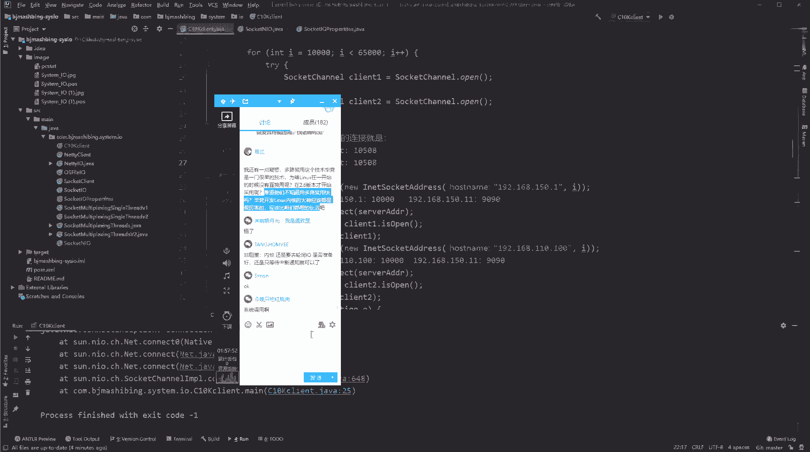
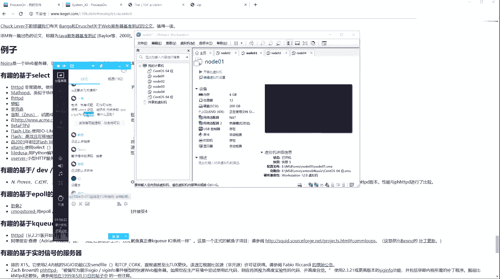
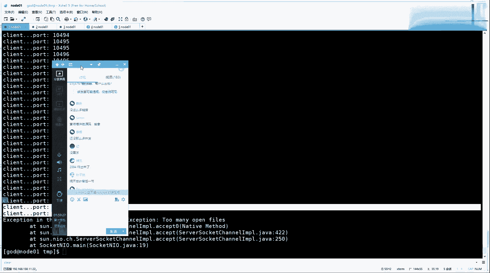
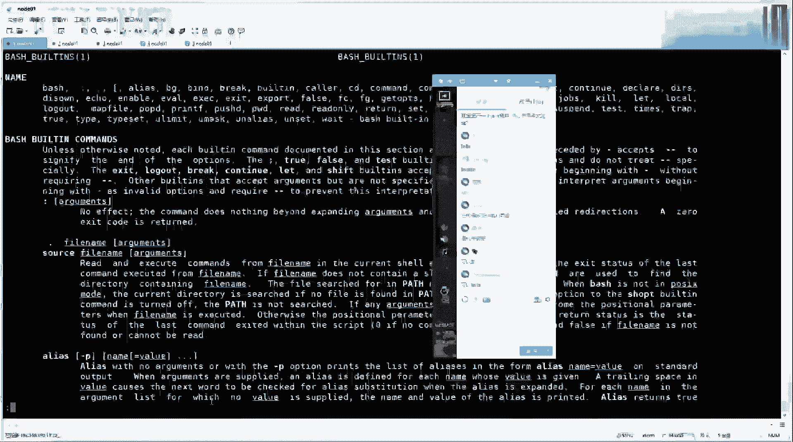
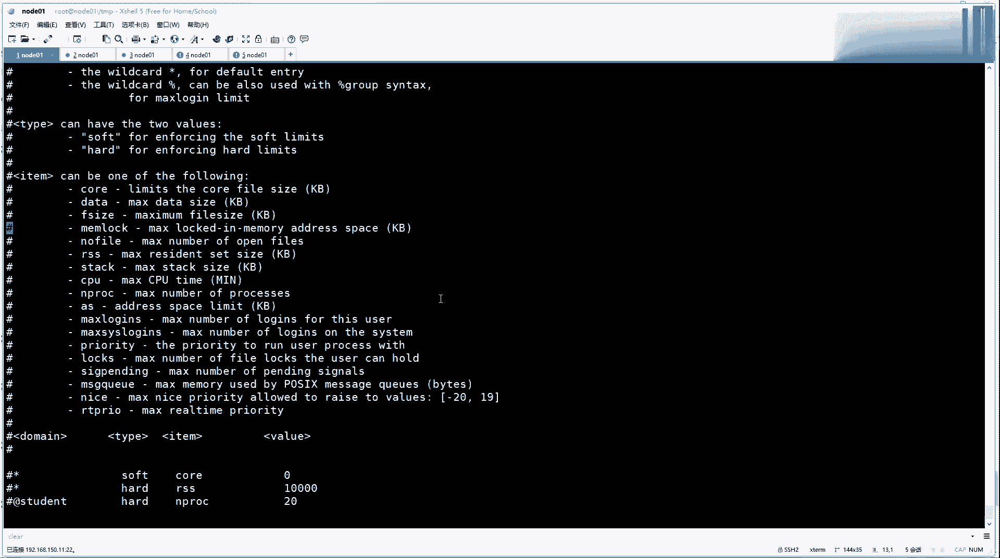

# 系列 3：P195：【IO／NIO】答疑 - 马士兵_马小雨 - BV1zh411H79h

哎，你们的小问号这么多呢？都是都是非本专业的吗？还还有一个疑惑，多路复用这个技术毕竟是一门很早的技术。为啥lining在一开始的时候没有直接用viero版本开始才开始采用了。

难道他们不知道用多路复用这块吗？毕竟开发linux内核的大神应该是很厉害的，应该比咱们想的都长远吧。啊。

我勒个去，我像知道你会问这个问题。所以看C10K这篇文章。他们的时这个多路分析这个时间就你你想2。6这个内核的版本应该是2000年还是几一年的时候才出现。你看1999年的时候。

最繁忙的FGP网站Y千兆网卡同时处理1万个客户端，从时一开始，你家FP多Y，就你去读啊，它的时间线是推到很早很早的。我们就直接看sck多了复音器吧。这块没有具体写它的时间，时间的时间轴出现啊，在这儿。

呃，破破的这个是在2000年的时候才被提出的。那2000年之前，他封的U软件能能能能能能能去开发出这接入连接，对不对？就2000年的时候，大家才想这个事儿，2000年之前没想，因为啥？

200年之前上的人还不多。这个注意看啊，fi max啊注意看啊，这有一个问题，区便那核参数PCFSF max这个你可以看一眼这个那个参数啊。首先我们来看一个值，跟着我思路走啊，我们的虚拟机内存是多大？

14G，然后默认情况下，fial max应该是在40万左右的一个文件面服务，是40万左右的一个文件面服务。

我们可以看一下。退出页什么root，然后cat PLOC，然后sFSbell max。385915。这个是另内核，根据物理内存。在内核级别估算出的，我4G内就是一G内存，一般是对应10万个金10。

然后这是OS kernel级的啊可以开辟的文件标符的数量。听同学来说个一。好吧，这事儿可以交给木兰同学，你把我这节课下去做再看一遍，把问题写个笔记出来。你就当咱们班的IO客的这个课代表，好吧。

我再给你启记这个事儿，我有点懒，我我就说了，我有点懒。这是 kernelel级别的啊这是 kernelel级别的。然后还有一个东西叫做you limit。这个有limit是什么意思？

是user limit。

应该是这意思吧。嗯，不是，应该是去去。没意事。怎么怎么怎么怎么找到他那个名字来着？hel。我忘了是不是是user了，反正这个unit的设置的是这个。用户进程啊就级别不一样的啊。

fell max是整个内核可以创文字mail服。因limit是你可以控制不同用户，它的进程可以申请的文件mail上线。看。没问题了吧。50了。嘿50了。嗯。大哥别加装啊。

后边这个是个是个是个是个大东西这个。这个加下去的话，今天得得得干到11点半12点。Sure。是这样，你可以VIETC，然后有一个lining，我想在哪个上是有一个s。ECC目录是哪个配置文件来着？

你是你。See you。Yeah。Yeah。这个是配配这个配置。有limit那个那个嗯配置文件突然突然突然突然卡壳想不起来了。哦，对对对，where it is secret。Secretty。

然后会有一个。啊，这么意思叫com。那这里边可以做，刚才我那个是普通的配置，其实你看看这个文件就知道应该怎么去配置，这里面可以配什么东西啊，往下走。嗯，你看配置的时候，你可以配置它的软设置和硬设置。

然后再往上的话，这你看这是我对ES如果你要配ES的话，你ES要试试它的这个。这个number啊number open files，这就是杠恩，然后还有process这个线成的数量。

这两个是你要做EM集群搭建的时候，这个是要配置。啊，你要可以打开文件面符调大一点，然后可以请的限程数调大一点。明码还是艾O克。然后上面你可以调控中有很多有内存限制open files。

然后打开了最大的这个线程数。有的时候你的ja这jajava破这个创建线能创创建不出来了，为啥这这还有一个限制？对吧这个这个处如果不打开的话，你连现你的普通用户连现城用现城的事弄弄不出那么多来。

要不要？