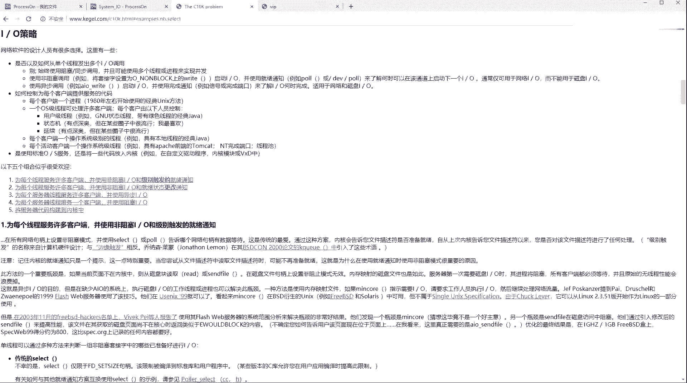
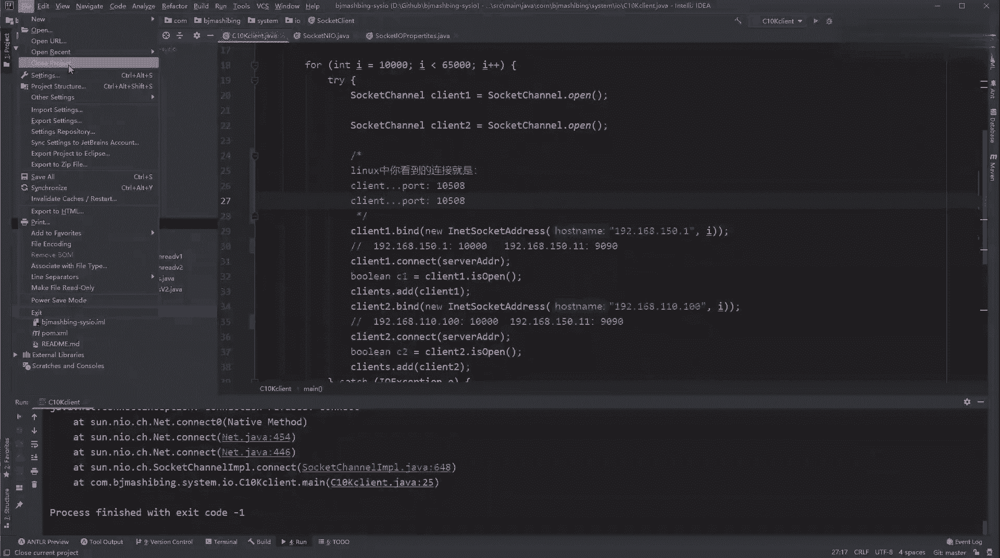
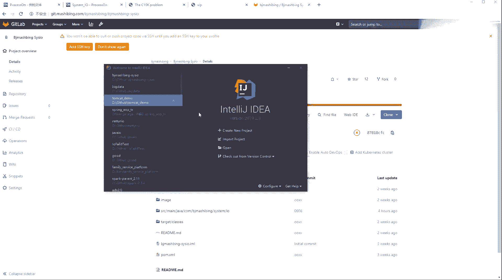
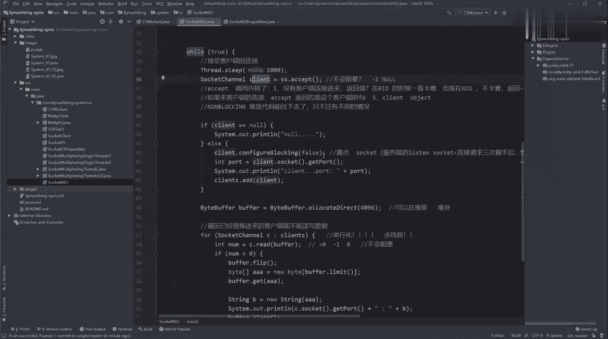

# 系列 3：P196：【IO／NIO】GitHub移库 - 马士兵_马小雨 - BV1zh411H79h

咱们的代码迁移了。啊，咱们代码迁移了，知道吧，咱们自己有一个自己的那个get啊，然后呢，我的代码也先同步一下，因为我写了好多的注释，对不对？

然后你就在你这样啊，你在我接下来就是用idea可以同直接同步，你你可以不用装那个de desktop，就是在ss里边，然后呢搜。Beat赖。然后不不不是在这个ppls里边，然后去搜。不。Yeah。

然后把d这个product给它inst，然后重启一下你来列。明白吧？就把getab装一下，装完之后呢，你就get lab，你装上giab就可以了。装上gt lab之后呢。

然后你可以把你的项目这个这个close掉。Cl protect dad。

然后呢，在这儿，然后选择get，然后把咱们那个。然后像products里边，想想是在哪来着。To over her death。然后找到。哎，我在IO呢。啊，在这儿，比如马兵CLO，然后克隆。

复制一下地址。然后到这粘贴。然后找一个地儿给他克隆，克隆完了之后啊，你打开你下面打开了，然后你的me要配好，然后呢alto自动导入就构建好了。构建好了之后啊，你看我是老师端，我能提交。

我会先去在我的有一个在这get里边，我commit啊，提交我的所有的修改。

我去提交，你们未来就是等着吃就可以了。然后我把它commit一下。commit，然后呢我还可以对着它，然后找get，然后呢找repostory，然后给他push往上推这个推啊。

这个推就推到咱们的get lab上去了。啊，然后你们未来就是直接在这个右键上面在get reposory里边，然后给它破ll就可以了。能白吧？这样的话。

你就不需要再再再找这个d一top考过来复制器的过程。反正这个idea一定要记住它叫什么呀？集成工具，它能集成很多东西。🤧Yeah。能看一下所有的NLO吗你的代码吗？有个疑问，比如前一秒。

如果有一群刚来的下午，有一批毒的，有一批血的，还有一群没来的在路上。想法挺好啊，一个线程扔那里exapp就搞定，是这样的，你看。呃，看NO这代码，我知道你什么意思。

这种LO的一般不推荐你们直接写LOLO是B端的。因为你在一个循环，如果它的内核里边接收了10个客户端，你accept只能把10个客户端排在第一个接接收到，那9个没有接收，就是等于10个到达接收了一个。

然后把历史的便利，看看有没有读。翻头来接收第二个。所以NL的代码写起来的话，这个这里边是不太推荐的，因为它毕竟还是属于一种。现性代码这法。这是它的弊端，所以才会有多多复剂，才会有才会有这个实践。

这个后边的se炮或者是epo这个这个过程。

