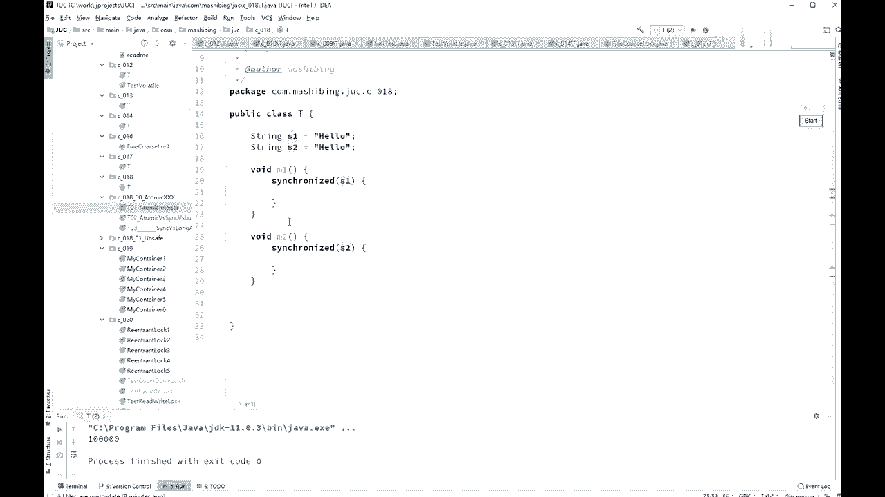
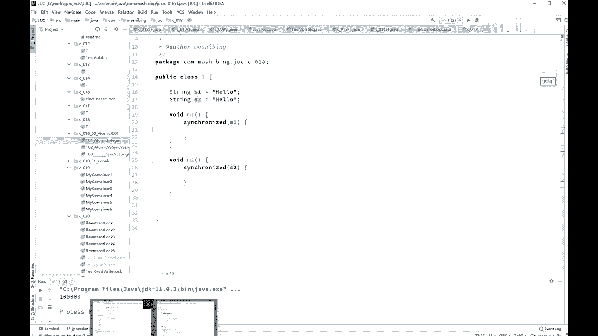

# 系列 3：P29：【多线程与高并发】day1课程简单回顾 - 马士兵_马小雨 - BV1zh411H79h

为止呢syra已经和volt。

那我就讲完了好吧，嗯稍微简单的再回顾一下啊，synchronize的线程同步走的是对象，不是代码，在呃所方法的时候说的是this锁，steady方法是锁的是class锁定方法，非锁定方法是对同时执行的。

这个也需要你了解那个大d c l double，check lock的时候的一个很重要的一点，所升级等偏向左到自旋锁到重量级，所我们讲volt它是能保证现实间的可见性，同时禁止指令重排序，线程可见性。

在cpu的级别呢，是用缓存一致性协议来保证的呃，自行车指令重排序呢，cpu的指令重排序是你是你是你cpu不级别的，指令重排序是你禁止不了的，你那个那是人家的内部的运行的过程，提高效率的呃。

但是在虚拟机级别加高了条之后呢，那么这个指令重排序语言上，语言级别来说就可以禁止，如果严格来讲，还还要去深究它的更细的内部的话呢，它是加了读屏障和写屏障，这个是cpu的一个原语叫lofence。

这是cpu的原语，cpu级别只是支持的，还有一个呢叫store fans，多变量写凭证，一个就是说前面一条指令，后面一条指令，那么lot of fans呢是你前面那个毒的指令。

必须得给我执行完才能执行后面的指令，这两条这两条指令之间是不能重排序的，写正好是写写方面的啊，读写屏障的问题啊，这个我不知道什么时候，整个的业界要求我们会深入到这一点，这也也也很简单不难啊。

load sense原理，由这两个来一块实现了stance原因之类，还有一个是什么来着，就是说也是一个fans，他是load和store两个都都包括的，是要lofans吗，带你们去上网查一下。

就是加读写，读写读写屏障一块儿的一条指令嗯，两个都有了。