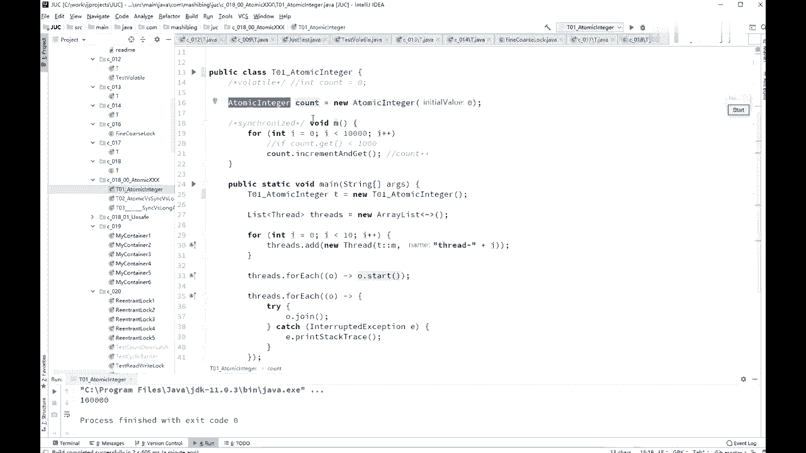
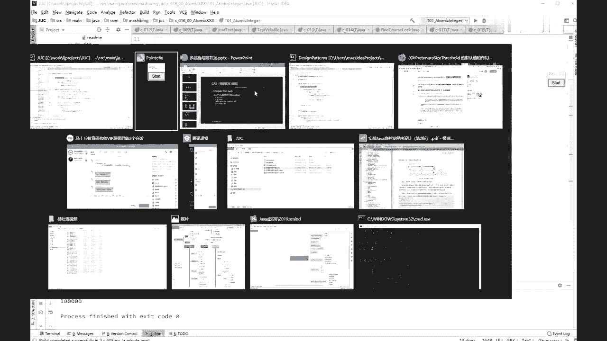
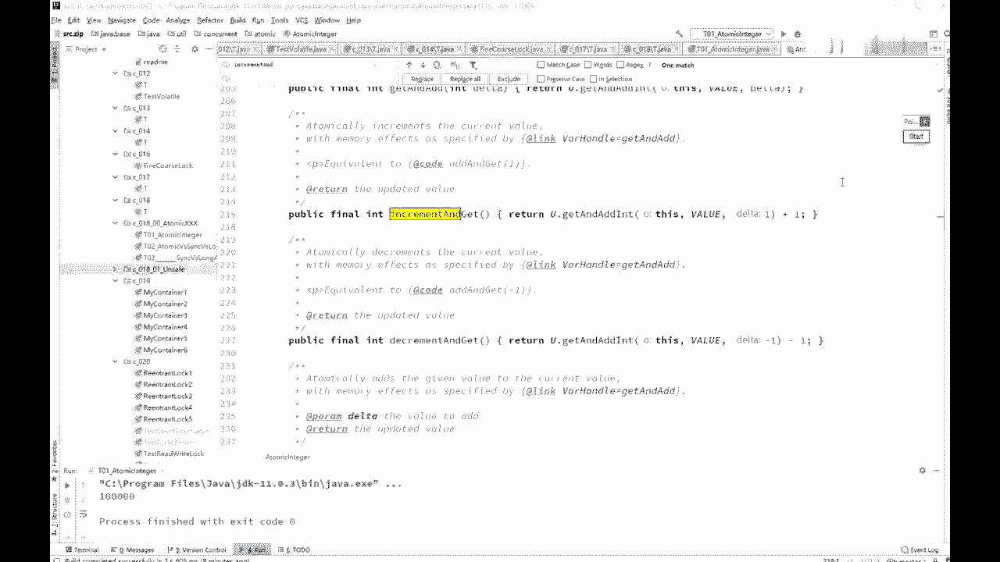

# 系列 3：P30：【多线程与高并发】CAS(1) - 马士兵_马小雨 - BV1zh411H79h

嗯好了，我们继续，下面我们来聊这个cs，这也是我考面面试的重灾区，好吧，我们聊cs呢，这叫这号称是叫无所有化，自旋其实就是自旋啊，无所优化，它叫什么名字，无所谓理解他是干什么的，什么意思就行。

概念这个东西呢是人为了描述问题，解决问题而定义出来的，所以怎么定义嗯，这事不是很重要，重点在解决问题上哦，哦看这里，我们通过atomically atomic原子的，由于某一些特别常见的操作呀。

你老是来回的枷锁，总之需要加速，加速情况下特别多，所以干脆呢，java呢就提供了一些个，这些常见的操作的这么一个类，这个类的内部就自动带了锁，当然这个锁的实现并不是，synchronize的重量级锁。

而是cs，我无所号称无所c a s的操作来实现的好，什么意思呢，这些个类是什么类呢，我们举个举几个简单的例子啊，这个，被抄几个开头的呃，也是在这个这个这uc的这个包里啊。

concurrent atomic这个包，凡是atomic开头的，都是用cas这种操作来保证线程安全的，这样一些个类，最常见的这类呢就是他也成为一个image，it trainteger的意思。

里边包了一个int类型，这个int类型的自增count加加，我们刚才分析过它不是线程安全的，但是呢这个是线程安全的，还有呢拿职等等是线程安全的，由于我们在实际开发的工作之中呢，经常性的会有那种需求。

就是一个值所有的建筑共同访问他，他在往上递增，这种需求特别多，所以专门gdp里面提供了这样的一些个类，a terenger，我们先来看这个a term energy，它到底是怎么使用的，好吧。

看这里我们上一个小小程序啊，上一个小程序是count加加，我们加synchronized加锁，这次呢我们可以不用加锁，用什么来做呢，用it atomic energy原子的integer的操作。

itominteger count等于另一个atomic energy，初始值呢是设为零，m方法原来是要加synchrono，现在不需要加了，i等于零，a小于10000a加加count点。

increase increment and get increment and get increment自增，and get get的意思是拿到这个值，自增了一下，并且拿到这个值。

当然这个返回之后没有用，所以我没有定义这个返回值在哪里，ok这个叫做zincrement g，相当于ctrl加加，不过呢这个ctrl加加是线程安全的，不像原来那个看了佳佳是线程不安全的。

所以这次你起多少个县城来跑的时候，最后的职能已经是10万，送你10万啊，不考了，好多次都是好，关于atterm engineer的用法，有没有同学有疑问的，atomic energy就这么用，很简单。

没问题，我们学校给老师扣一啊，用会呢就这么用，来我们来分析分析，它内部的一个实验是什么实现啊，来聊原理，主要聊聊原理啊，有这个用法上的东西啊，你你你看看a i z都都能用是吧。

我们主要来聊原理好，这个原理是什么原理呢。

这个原理呢它叫做cs操作，看这里啊，it turan energy点进去，那么你也increment and get so incream，and get啊，调用了get and at it。

当然这个的话呢嗯也是一个compare and set，操作操作，内部掉掉掉就会跑到哪个哪个类去啊，当前的这个类呢叫unsafe这个类啊，unsafe不安全的，也就是说economic energy。

它内部是调用了unsafe，这个类里面的方法，好这个类里面的方法呢，你会看到这个方法叫compare and set，compare and set就是cs啊。

compare and set persuade，compare and set，来说一下字面的意思，compare比较并且设定比较，并且设定的意思是什么呢，我呢原来想改变某一个值，原来是零。

我想把它变成一，但是我其中呢我想做到线程安全，我怎么做呢，我只能加锁，加synchized，不然先生就不安全好，现在呢我可以用另外一个操作来替代，这把锁，用什么操作，能用c a s操作cs操作。

你可以想象它就是一个方法，这个方法有三个参数，第一个参数是要改的那个值，这就是那只原来是零，expected，希望当前的这个值会是几，要设定的新值好，当前这个线程想改这个值的时候。

我希望你这个值啊就是零，你不能是个一，你是个一的话，就说明我这只不对，然后想把你变成一，这句话说的是什么意思呢，你看看啊，原来这个值变成三了吧，比如我这现在想改一个值的时候。

我一定期望你这个值现在是三啊，你是三我才改，假如你在这个我改的这个过程中，你变成四了一个，那你这个跟我这个期望值就对不上了，你给我的期望值对不上了，说明什么，说明有另外一个线程改了这个值了。

那我这个cs哎干脆就重新再试一下，再试的时候，我希望你这个值是四，为什么，因为你现在值不就是四吗，我希望你这个人是四，假如我在改的这个过程之中呢，没有其他的线程改了个值，那么它就是4号。

这个时候我给你设成新纸变成五，所以这是cs操作，在本质上就是这么一个意思，如果说你这个值是我期望的那个值，这个v的这个值是我期望那个值，那我就不给你设成新值，不是我期望的值，说明在我这个执行的过程之中。

有别的县城访问了，并且更改了这个值了，好这个时候我就可以干嘛呢，哎再试一遍，或者干脆就失败了，我就不试了，这个是cs操作，那有同学可能马上就会说啊，我一我想你们一定能想到说，你当你判断这个值是不是。

你希望那个值的过程之中，在这个时候有另外一个线程给改了，怎么办，你这个线程来了，判断了一下，是不是我期望那只你发现我是期望的，是我期望那只还没有进行设新值，设定的时候，另外一个线程把这个值设成别的职了。

这怎么办，我不，好听，我说cs是cpu的原与支持，也就是说cs的操作是cpu指令级别上的支持，中间不能被打断，啊各位同学问的是那个期望值是什么意思，就是你当前这个县城，认为你原来应该有的那个值。

期望的值怎么来呃，举个最简单的例子，你比如说我某一个某一个什么吧，补一个链表吧，好链表的长度现在是三，我想往链表后面插一个新的新的节点，假如说这个是多线程，往往往后插我我我是不是往后插的时候。

我期望这个这个节点，或者说整个的这个size是三，如果是三，确实是三的时候才往后插，对不对吗，如果不是三的话，我一定不会不会往后插，所以期望的这个值呢，就是根据你实际当中的你的业务逻辑。

他的一个嗯你的你的有逻辑上的，这我来解释一下啊，这个直来啊，increment and get，我们拿a tomic integer来举例子吧，这个atomic engineer。

希望的这个值你是get一下，你首先呢拿int int int的类型来说，比如说它原来是一，你首先get一下，你拿你已经拿到这个值了，get一下，拿到这个值之后是一，然后是一，之后呢，你你怕的是什么呢。

怕的是在后面进行ca操作的时候，这个一会被别的给变成，所以在你cs时候，你期望这个值依然是一，我这么说，你是不是能理解了，期望值是对，是给定的，嗯我再说一遍啊，呃理解了是吧，好理解了。

我就我就我就我就不再多说了啊，就你原来这个值你拿到一个值了，这个值是几呢，这个值是一，你本来本来想把它变成二，但是在你变成二的过程之中好，你就把这个一这个期望值设给他，如果他目前还是以还是一。

就是说明什么，说明没有别的线程来吗，那这个时候呢你就把它变成二。

