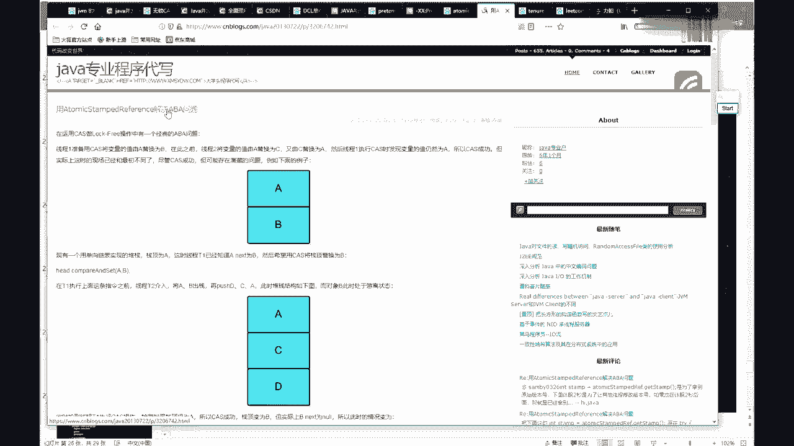
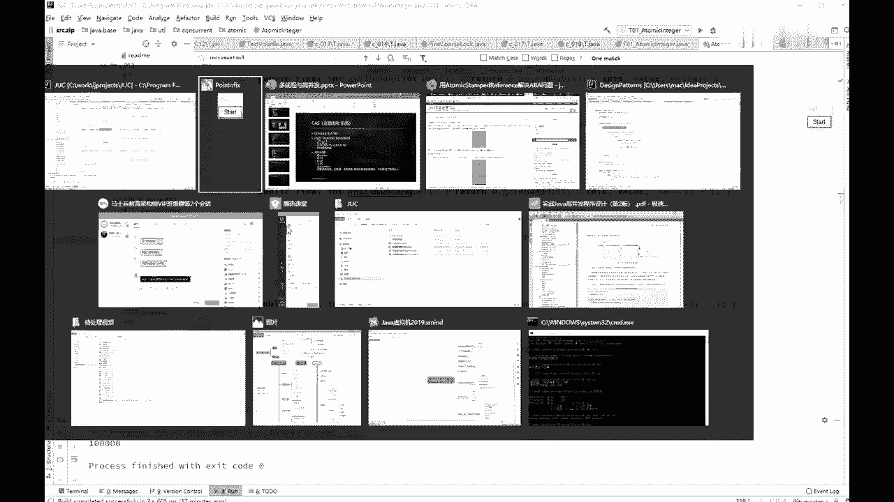
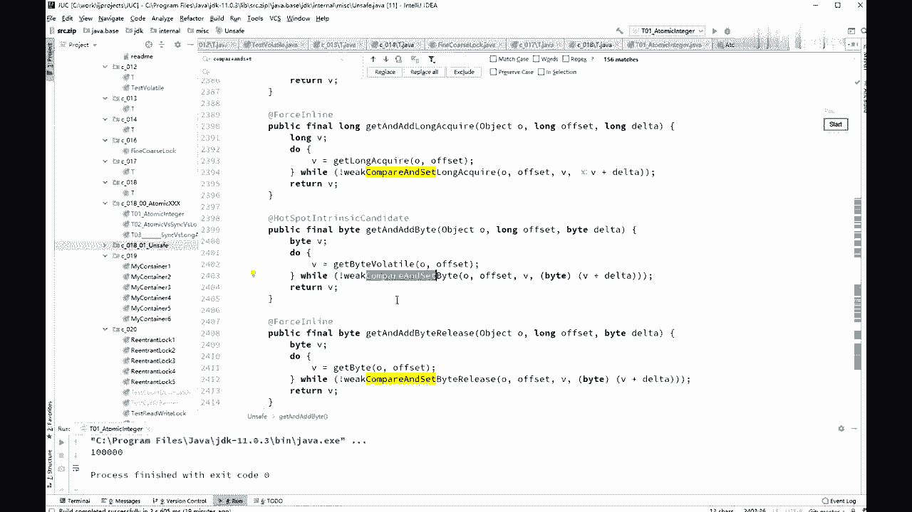
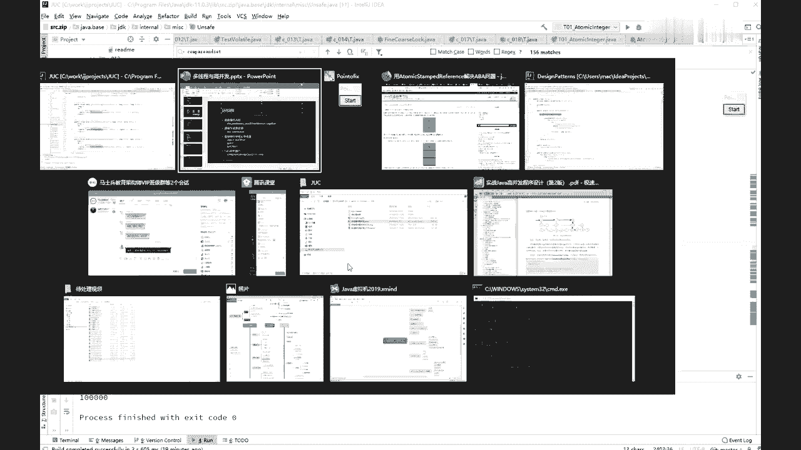
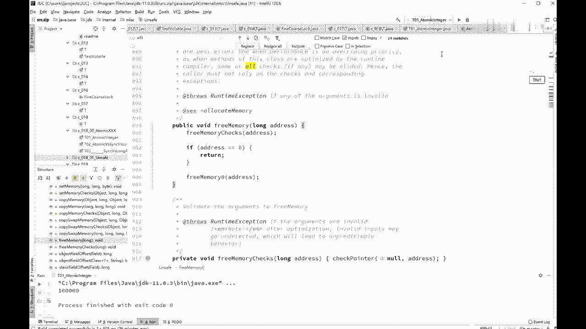

# 系列 3：P31：【多线程与高并发】CAS(2) - 马士兵_马小雨 - BV1zh411H79h

那么说明没有别的线程来吗，那这个时候呢就把它变成二，但这里面呢我们还要稍微说一下什么呢，我们还需要说一下的，就是这个a aba问题，这a b a问你呢，嗯一般面试呢也就简单问一下，就是问你了。

不了解这个a aba问题该怎么解决，这a b的问题是什么意思呢，这个问题a b a问题是这样的啊，假如说你有一个值是吧，我拿到一个值，这里面值是一，我拿到一之后想把它变成二，然后我拿到这个一之后。

我用cs操作把这个一期望值是一吗，变成准备变成二，cs操作，把这个对象object object这个对象好从一变成二，或者它里面的一个属性，从一变成2k在做这个操作的时候，注意在这个过程之中。

由于没有人，我们没有一个线程改过，我肯定是可以变成的，但是如果有一个线程做了什么更改呢，这个县城里先把这个一变成了二，后来又把这个二又又变回一，不然我说清楚没有，就这个县城里啊，先把这个一变成了二。

又把这个二变变回成一，同学们，你们想一下，这就会中间，实际上它经过了这个值得一个更改的过程，它会变成了1142，又变化了一个一，但是不影响我这个cs下面这个层，所以这个这个就是a b a的问题。

就是原来这个a变成了b，后来不好意思，他又变回a了，所以如果你使用cs操作的话，它实际上会有这个问题，就是aba问题，那么这个问题怎么解决，如果你非常关心这个问题，像这种int类型的无所谓嘛。

反正你期望值最后变成二就完了，这种的没有关系的，你就不用去管这个问题，如果你确实想管这个问题该怎么办，需要加版本号，就这个一啊，目前我做任何一个值的修改，修改完了之后，版本号加一，你后面在检查的时候。

简直连版本号一块检查，加version aba问题，第一个a版本是一点，那就叫一吧，第二个就是b就变成二点了，第三个a就变成三点了，所以你你后面做cs的时候，你需要再加一个版本号的比较就行了。

在cs的时候，我除了原来这个值之外呢，我还要检查这个version跟原来那个version相不相同，atomic类里面有，atomic类里面有带版本号的类啊，这个问的实在是少。

就没有专门给大家讲这个问题，atomic这个类里面是有版本号的，这个类的，大家搜一下他，atomic stamp rappers，感兴趣，你去自己找一下，目前还没有人嗯，起码面试的时候遇到过好吧。

用这个来解决啊，叫atomic stamped reference。

解决aba问题，step的意思就是加一个托嘛，加一时间戳类比有什么问题啊，我明白你意思了，就算产生了a b a会不会有什么问题，是这意思吧，在int类型上不会有问题，如果是个in的类型。

就是个一或者long类型，基础数据类型没问题，如果这里是一个object，指向的是个演员，是一个对象，那这个对象呢改完了之后，后来又指回到原来了，然后呃，它的中间这个对象，又会对这个对象有有有有链接。

这个解释一下啊，认真听咱们说a b a这个问题呢，如果是这个数据类型一变成了二维，变回了一只，剩要经过多少次改变，最后的结果无所谓，但是啊如果有这么一种情况，这是那个object，它指向一个对象。

指向了这个对象，这个蓝这个这个这个这个这个黄色的对象，然后这个黄色对象呢，又指向了这个蓝色的对象，好在中间的这个过程呢，有另外一个线程来了，他把这个o呢指向这个蓝色对象之后呢，又把里边的值做了一些改变。

然后这个哦又指回来到这个黄色对象，然后呢再回到下面这个问题的时候，你会发现这个黄色对象指向的别的对象，发生了改变，所以这个黄色的呢，你后面的逻辑还更会不会跟原来一样，这句话这个问题就不好说了啊。

不知道说清楚没有，如果是引用就会有问题，如果不是引用啊，一般问题不大啊啊，有点绕，哈哈哈，哎我说的我确实刚才讲的，是不是有点儿有点儿稍微绕了啊，来我再我再说一遍啊，这是那个原来的那个引用是吧。

然后他指向某个对象，指向这个对象，好指向这个对象之后呢，注意啊，我们本来是要把这个引用呢通过cs操作呀，变成别的一个引用，但是呢在中间呢来了个现场，这个线能做了一件什么事儿呢，这个线程呢是把这个o。

嗯做了一些个各种各样的操作，然后这里面的其中的某个其中的某一个，其中的某一个某一个引用，指向了别的地儿的值给改了，总而言之就是这这里边值也改了吧，然后改完之后呢，实际上这个这个这个这个o呢。

又又还是还是原来这个对象嗯，所以呢你在执行的这个过程之中，有可能你指向这个对象，里边发生了一些逻辑改变，那么在这种情况下是有可能会产生问题的，啊，呃我可能讲那段确实有点复杂了，这是我的问题，sorry。

呃呃，说最简单的就是里边这些在，在你在你在你一个引用，在被别的线程有可能改变里边的值，改完了之后呢，从，内存地址上，你这个o呢确实还是原来那个纸，但是呢其实从逻辑上，这个o指向这个对象。

已经是变成了另外一个对象了，已经是变成另外一个对象了，所以当你对这个对象进行一些判断，然后再做出其他改编的时候，就有可能会产生那种业务逻辑上的问题，唉当时这个例子举得比我好啊，哈哈哈哈。

毛石你这个例子举的举的比我好啊，你跟你的前女友复合之后是吧，他已经他实际上已经经历了别的n个男人，老师啊，你这个适合做老师很好，我这讲半天还不如你一句话，有生活啊，你这跟前女友复合几次了，哈哈，很好啊。

这个模式嗯思路也比较敏捷，来接下来，aba问题，好a b问题呢，如果基础类型无所谓好吧，那么如果是引用类型，你的女朋友跟你复合，有点尖锐了，别的女人o，就你你他不再是你原来那个女朋友了啊。

k老师看来这个生活经历经验很丰富啊，好这就是a b a问题，大概能理解了吧，ok呃所以啊这里面的这些个操作呢，由于原来需要加锁，现在不需要加锁了对吧，现在就不在学校加锁了，你从零往上加一。

你只要判断他原来还是不是零就行了，那如果是零的话。

你就直接往上加，这不需要加锁了，那么他是怎么做到的呢，其实它内部能使用的是这个unsafe，这个类，unsafe这个类呃，关于这个类呢大家要了解就行了，这个类里面的方法非常非常的多。

其他的你不能直接使用，这个类，不能直接使用的原因，还和class loader是有关系的，这个特别好玩，好我们简单了解这个类啊，就是所有的atomic操作肋骨下面都是compared。

compare and set这样的操作，那么compare and set是在哪个里面完成的，调用的好，就是unsafe这个类，compare and set，这里好像进行了修改，新的玩玩，fall。

match case words哦，我的天他又进行了修改了，现在叫wk compare set，可能是用了那个那个弱指针了啊，这个新版本的我还没有读过，这11点那个版本的，这不去管他了吧。

compare and set。

比较和设置，那么底层的那个是什么呢，是通过这波的原理知识来实现的，但是unsafe，这个类是比较好玩的一个类啊，这个类呢如果你能了解的话，那么面试的时候问到你肯定会加分，这是肯定的。

compare and set match case words，确实没有啊，他现在都改成weak comparisons and set，应该是这个很牛，看这里啊，这个这个unsafe这个类呢。

呃正好给我们讲的单例又可以配上，但你看啊这个unsafe这个类，首先它的构造方法看到了吗，各位朋友是什么，private unsafe，你能虐他吗，用不了，对不对，呃根本用不了他，那么拗不了他怎么办。

你想用这个on c时候怎么用啊，那你可以看到它里面有一个单例，静态的new unsafe，这不就是我们那个单例模式吗，private static final unsafe。

the unsafe等于new unsafe，所以什么时候你能用这个unsafe的话，只能调用它这个静态方法叫get on safe，它会返回一个int类型，它会返回这个unsafe类型的值。

这就是典型的单位能看懂我的意思吧，是挺实点，奇怪啊，这个新的版本和原来的确实不太一样了，啊我这ppt还是原来的版本的，这个我要更新了，sorry，这是1。7版本的时候啊，他这个是可以直接操作内存。

直接生成类的实力，直接操纵类的实力和变量，那么现在呢应该是，他不再用这个compared set了，跟我们实际compared set相关的是这些操作。

compare and and and and and set，compare and set，当然这个新版本叫w，通过点名字，你应该知道他应该是用的那个弱指针软弱，软弱虚用的是弱指针。

如果指针呢因这个它的好处啊，应该是在于垃圾回收的时候，回收的效率比较高，weak compare and set好了，你的那个版本没准是那什么的，put in改动很大啊，可对jdk 8里面还是对。

你查一下你们自己的jdk的版本，我这版本有点新啊，我的版本是11点呃，你的那个版本如果是1。8的话，那应该还是compare and swap，这个改动确实有点大，嗯这不去不去，我们不去详细探讨他了啊。

而且11点里头呢比较好玩的是，这个get on safe是你，你实际上是可以直接用的，不像原来你必须得能够通过反射，才能拿来用，1。8的版本，你们自己打开看这个刚才get on safe，你是拿不着的。

只能谁来用，只能那个jdk的作者，他们最根上的球类才能使用，而11点你是可以直接用的，unsafe你可以直接用，比较好玩儿，unsafe是干嘛的呢，其实其实unsafe呢。

就是直接操纵java虚拟机里面的那些内存，比如说你要分配一个新的对象，你是直接把这个对象的内存，看着看着扔在这儿了，而不是new啊，这跟new没有任何关系，那么如果你想操作某个对象里面的某个值。

某个对象里面某个属性，如果这个这个内存的开头是零的话，那么通过一个偏移量16，就直接咔嚓就定位到这个内存o，所以on on save，这个类，就是直接让我们具备了c加加写的程序的，这样的一种能力。

所有的atomic开头的类，内部都是通过unsafe类里面的，compare and swap，compare and set这一类的原子性操作，cs操作来实现的，当你读一下呢，它的写法呢也不难啊。

都非常简单的一个一个写法啊，有些没有了，居然啊嗯你看啊，你看这个比较好玩，你看这个就知道了，这个方法是什么字，allocate memory，呃，来同学们给我翻译一下英文，alex memory。

分配内存是吧，相当于c语言里面的什么c，这这这这不能在这敲c，c语言里面有一个方法叫什么，memory allocation是吧，对啊，这个词memory allocation。

我已经敲在咱们的讨论区了，这是alea allocate memory，相当于直接你在里面分配关内存，这块内存多长，所以你用unsafe是可以直接实现，原来c和c加加实现的这种能力，然后拿到它之后呢。

返回一个指针，这个指针呢一个long类型的指针，当然如果你有alex memory。

你你想想看你一定有什么呀，free嘛，free memory，如果你学过c和c加加，不知道有多少同学学过，所以unsafe这个类基本上就等同于c，c加加的指针，如果是c语言分配内存，用的是。

memory allocation，释放内存呢，free来有同学告诉我，c加加是什么样的，分配内存用什么。

