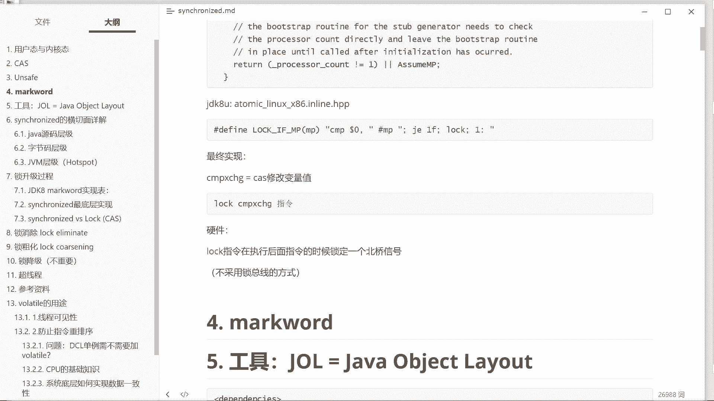
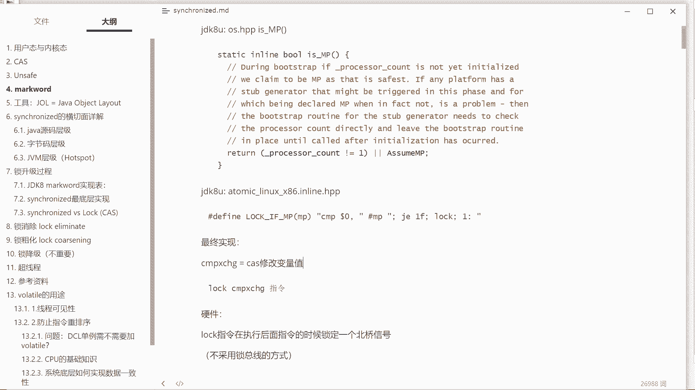
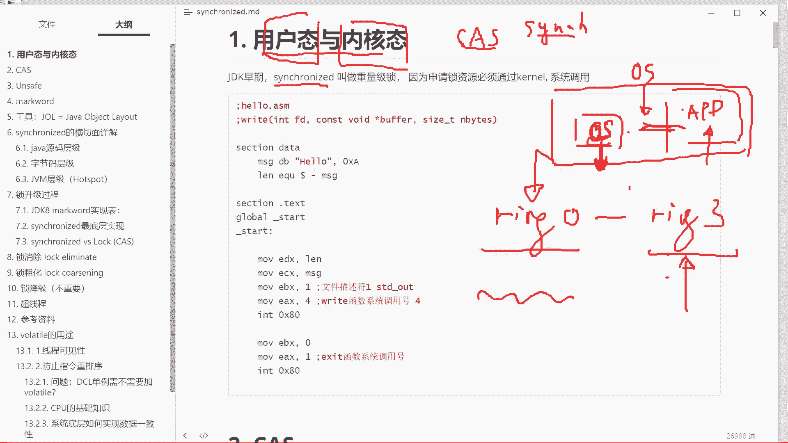

# 系列 3：P4：【多线程】用户态与内核态 - 马士兵_马小雨 - BV1zh411H79h

好下面我们补第二个内容，文补用户态和内核态。

为什么要补这个这个事儿呢，这要补上，这要补就有点太多了，大致大致补一下，补用户带和内核带，什么意思，就是jdk的早期啊，我们我们今天的核心千万别忘了啊，今天我们核心是要讲synchronized的。

刚才只是拿cs开个way好，现在要讲清synchronized它的所升级过程，大家要了解用户态和内核态，这是什么意思，首先简单说作为操作系统来说，他能够做的一些操作是不允许普通程序做的，听懂了吗。

比如说我能够把硬盘给干掉好，我是不允许你普通程序干掉硬盘的，普通程序想干掉硬盘怎么办，必须通过操作系统申请，所以我们说为了保障操作系统的健壮性，现在的操作系统基本上都会把一些指令分成级别。

有些指令我可以直接访问，有些指令就是所有的指令我操作系统内核都可以直接访问，但是有些指令你作为用户空间的这样的一个进程，你是不能够去调用的，你要想调用，你得通过我来，你想访问网卡的内容。

想访问直接内存的内容，想访问显卡的内容，不好意思，你都得通过我操作系统来，那么这个呢就在逻辑上呢，把呃整个的这块内存的空间，或者叫内存的执行过程，或者叫程序的执行过程分成了两种状态，第一种呢叫内核态。

第二种叫用户态，内核态是执行在内核内核空间的这块呢，它能够访问所有的指令，而用户态的程序呢只能访问用户能够访问的指令呃，这种设计方式，操作系统在经过了一系列的升级采集的这种方式。

这种方式现在目前在硬件上是支持的，像英特尔的cpu，它本身就支持四种级别的分布，从ring 0级一直到ring 3级，linux内核工作在闰零级，它能够访问所有指令。

linux的用户空间的程序工作在ring 3级，某些直接的指令是不能访问的，这是大概的一个用户态和内核的概念啊。

来能够跟得上的，给老师扣个一，好我们继续，这个时候大家好好想一下，在jdk啊，最最开始的时候，synchronized也叫做重量级锁，重量级锁的概念是什么概念呢，重量级锁的概念就是注意对于操作系统来说。

这是我们操作系统，对操作系统内核来说，你jvm也仅仅是工作在我的用户台，好锁这个资源是要通过操作系统才能去申请到的，才能去申请到我这把锁这个lock。

ok所以原来的synchronized的叫做重量级锁，synchront一上锁上的什么锁呀，一上就是重量级jdk早期的时候1。1。01。1。2，他所谓的上中了。

你所的意思就是我jvm现在要对某一个资源加锁了，你要对这个资源加锁的时候，你得向操作系统申请一把锁，向操作系统申请，通过操作系统老大通过一个从用户态到内核态的一个调用系统，调用著名的0x80 。

阿里p9 问的问题，0x80 的执行过程，听懂了吗，好这个过程今天我来不及给你细讲再说，从这个m往os操申请的时候，是要经过一个中断的调用，那么也就是说我申请了这把锁之后，要把这锁返回去呢。

还需要从内核态返回到用户态，所以它叫重量级锁的原因就在于他申请这把锁的时候，都需要经过操作系统，老大都需要经过用户态到内核态的一个转换，现在synchront做了一些优化，这个优化呢就是在上锁的时候。

在某些状态之下，它是不需要向操作系统老大去申请，只需要在用户空间就可以解决问题，哈哈哈，今天我们要讲的就主要是这个升级过程，好了，刚刚讲完这小段能跟上的。

