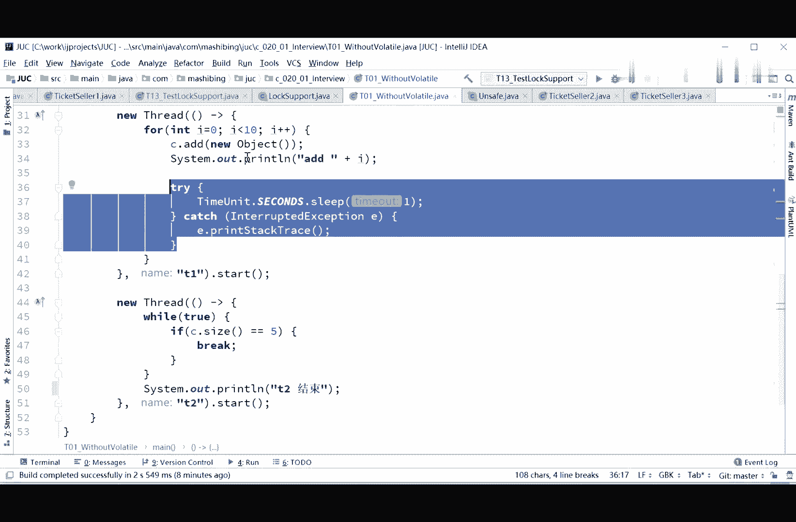
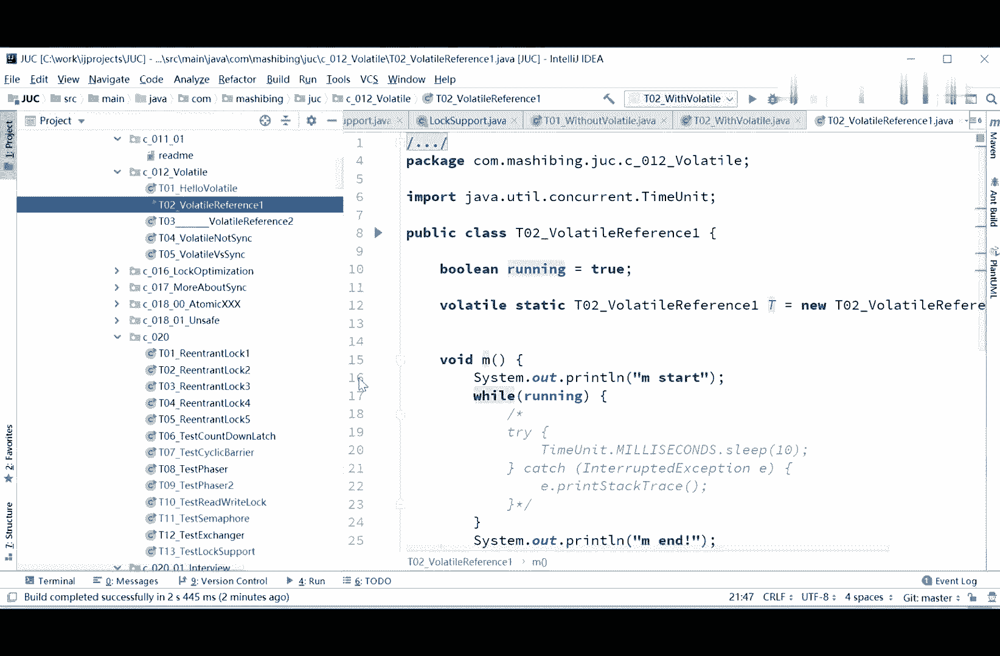

# 系列 3：P44：【多线程与高并发】面试题一(1)_volatile - 马士兵_马小雨 - BV1zh411H79h

好我们聊了这个log ort之后呢，我们再来看一道面试题，就是我们刚才这道这道面试题啊，曾经的一道面试题呃，实际上一个容器提供两个方法，at和size写两个线程，线程一到十添加到元素之中啊。

线程二呢实现，元素的个数，当个数到五个的时候写成二，给出提示运结束嗯，这道题呢是还是两个线程之间互相通信的问题。

这是我在公开课上讲过几次，那个1a2 b3 c4 d的那个问题啊，没有听过也没有关系，我后面还会讲，实际上这两个呢是呃线程两个线程之间通信的问题，提供两个方法啊，at和si，然后两个线程之间通信。

第一个线程完成到某个位置的时候，要通知第二个线程好，呃时间关系我就不在现在的时间让大家去思考了啊，这样我直接来讲，我们先来看第一种写法，第一种写法呢我添加了两个这个这个这个两两个方法，两方非常简单。

然后写了一个t01 without volt，我用一个内部的list等于new一个array list，用这个来做我们的内部的这个容器，然后我写了一个a的方法添加，我直接调用了list的at方法。

非常简单，然后呃size方法到底加了多少个了，就直接调用了list的size方法。

一个a一个size没了啊，就这就这么两个，所以这两个方法就完成了。

在两个方法完成的基础之上，我们说写两个线程，第一个呢是从一到十往里头加元素，第二个监监控着啊，什么时候呢，他到第五个了，数到第五个的时候，你这个就马上爆出来说，哎哥们儿，你到第五个了，一边加一边监测。

一边加一边监测好看，这里大家呢你先读一下这个小程序，看看在这种方式下呢，他能不能够得到想要的结果，这种方式什么方式，你看这里，我首先扭了一下我这个容器，嗯，就不多说了，然后呢我起了一个新的线程。

这个第一个线程，第一个线程完成什么功能了吗，i等于零，a小于十，i加加，往里头加object加一个a wallet，打印ai加了第几个了。

启动了，第二线程我就在这监测的嘛，所谓的监测不就是说我跟那盯着吗，well to跟着不停地盯着，什么时候它的size等于五的时候，让他break，好同学们，你们分析一下第一这个能不能完成第二这个类呢。

呃就这种写法有没有什么问题，给大家30秒钟吧，a realist不是线程安全的吧，journe，你想一想看是不是健康安全的，哈哈哈，不是啊，我先告诉你结论，a realized不是线程安全的。

好看这里啊，我们来分析一下这个第一个能不能实现，能不能实现这件事，我们跑一下就知道跑一下，先，零一正常应该是加到五，诶你会发现是不行的，发现是不行的是吧，这是不可以的啊，而且程序停停住了不动了。

那么这是为什么，第一个它是不行的，我们看到了第一个这个小程序本身是有问题的，你们分析一下会有什么问题啊，同学们，从同步的角度去分析，这个小程序写上去的话，会不会有什么样的问题，来同学们直接给我敲。

你们仔细分析一下，我要求的是你当加加到第五个元素的时候，你这里判断的是c的size等于5k同学们，那我想问你他有没有可能cx等于4=6的时候啊，有很有可能就变成呃他就做做了一个错呃，错误的输出。

为什么你们想一想，因为a release本身啊，它这个size你加进去之后，你分析一下啊，呃一个object加到这个a release之后啊，加去之后它这个size呢是加完了之后size更新一下，加加。

这是肯定的，他这个肯定是这样实现的，那好如果当你的元素加进去之后，还没有size，还没有加加的时候，好，第二个线程来读了，这个时候他读到这个size的值就和你实际当中加入元素的值就不一致了。

好同学们能理解这个意思吧，所以这件事本身是不对的啊，所以这里头有两个毛病，这个程序第一个呢是你没有加同步，第二个为什么它会停止不了，停止不了的原因很简单，因为你在这while true的时候呢。

这个size等于我永远没有检测到，永远没有检测到的原因是什么，永远没有检测到的原因是你还记得吗，县城之间不可见的问题，是因为你的这个c的size里边的这个size的值线程之间呢，你第一个线程变了的话。

第二个线程之间，第二个线程并不会马上看见，那怎么解决这个问题呢，怎么解决这个问题啊，非常的奇怪这件事啊，你你认真看好，我讲到现在有没有同学理解不了的，能理解同学给老师扣一，有问题你直接提啊。

因为我后面要讲的问题呢比较怪异，然后我自己现在也没有答案，在这个基础之上，大家了解了之后啊，你认真听，那同学们可能会会想说，老师这件事还不简单吗，那正常的情况下，你给他加一个volatile。

县城之间就可见了嘛，对不对，我相信很多同学是是这样的想法好，所以我在第二个程序里头呢，其实和第一个程序完全一样，和第一个程序完全一样，只是呢把这个类似前面加了volati，其他都没有变，没有做任何变化。

我们再跑车线，ok t2 结束789嗯，结束了，ok没问题，这事儿呢就这么奇怪的解决了，当然我再说一遍，其实如果说你要想把同步这件事要做好的话，你得把i的方法加上什么呀，synchronized。

把size方法加上，synchronized，整个list得谁加上synchronized啊，呃这样这样这样说不对啊，sorry你得你得用用什么容器呢，用同步容器，后面我们讲到同步容器的时候再说。

就是你的这个size加对象和size的更新必须得是同步的，什么意思，听我说这个小程序还是有点小bug的，这个bug就是我刚才说的，当你添加一个对象过去的时候，你的size还没有更新的时候。

如果有第二个线程来读，会读到不一致的问题，你都加到五个了，但是你的size还没有更新到五，这里他读的时候呢就只能读到四，因为我们读的是size的值，所以你要想写的比较完善的话呢，应该是这样来写的啊。

重新写一下，嗯collections are synchronized the list，new link list，或者是另一个a realist，这个随意得是这样来写，我们先来看看我这写的没问题。

确认一下啊，这样就呃就真真正正的实现了呃，第一个呢你是保持可见，第二个呢你是那个保持啊，他们之间的同步同步不会出问题，ok当然这个是后面我要讲的同步容器，这里头是有必要用synchrise的啊。

咱们你你们好好分析一下好吧，有问题呢，一会再探讨好，咱们回到刚才这个问题，回到刚才这个问题啊，你看我写了这个volatile之后呢，他就莫名其妙的解决了，可是这件事本身是很奇怪的啊，我是想了半天的。

也没有想到他呃，这问题呢到底出在哪儿啊，这个java呢就实现啊，偶然偶然性对，不睡就不行是吧啊，睡了一嗯对，有可能是这样的问题啊，这首歌大家好，你记住了，这里是有问题的啊，认真听尤拉特呢，我前面讲过。

这个vt我们修饰的内容呢是要这块内容产生了变化之后，你what属于一个int类型的值啊，i等于五把这个值改改变了之后啊，另外一个现成的你才能够看得到这个值，但是我们这里moletely修饰的是什么。

实际上是修饰的是个引用，我们现在改的内容是什么，是在引用里面的这个值啊，引用里面这个纸是改了这部分内容，但是这个引用的值本身没有变，所以严格来讲你改的这个值你加了这个vlotl之后，应该也不起任何作用。

可是非常奇怪的点就在于这里，就是那个你在这加了blet tel之后啊，然后上一个程序里不加好，他就不行，现在加了blet跳他就行了，挺奇怪的，非常奇怪。

张扬说不奇怪，因为睡了一没错啊，你说的非常对啊。

把这睡了一去掉，可能就不会有这问题了，但是即便是睡了一两个程序完全不一样，加了voluntel嗯，他就睡了一之后，他只我们只能说就是睡了一的期间，他保证给你写回去了，只能是这么来解释啊。

来我们把这个睡衣给去掉了，只能是这么来解释，所以你有时候睡衣和不睡衣这件事是呃很很重要的，好吧，当然我们把这个不睡衣去掉之后，把睡衣去掉之后，你就会发现了，ok还是有问题，这里还是有问题啊。

所以你看这是这么写的，是还是实现不了的，c等于3=5 break，没办法啊，这是实现不了啊，那我们原本说我加这个行不行啊，这样写行不行，跑一下，你看到还是不行，绝对不行啊，反正总而言之呢。

关键是在于睡衣这个地方如果不睡衣的话就肯定不行，我要处大于等于五，你大于等于五，这件事就不对了，老夏同学，我们是在精确等于五的时候让他观察到，可是你大于等于五，你等于6=7。

等于八的时候再观察到就没有意义了，所以现在这么写不行，这个方法呢呃大家能理解了吧，对sx你问的很对啊，我这个事儿呢就只能解释为就是time unit。

睡觉的期间。

他就会去就这里的这里这里去读的时候。

他就能够去读一下里边的内容啊，我不说了嘛，就这件事我想了半天也没想太明白，他内部到底是是怎么实现这个机制啊。

我只能说hobt实现它应该是这样的，在另外一个县城睡觉的期间。

那么呃这个这个这个别的线程呢，另外一个线程睡觉的期间。

它会在这个期间把内容给写回去，这怎么解释，嗯不太好解释好吧，我跟大家说这个问题了啊，总而言之，总而言之啊得出的结论我网上也查了很多的资料，大家伙儿得出的最后的结论就是这样的。

volatile这件事如果你没有把握就不要用，这是第一，这是第一，除了面试的时候，在你真正开始写程序的volatile这件事没有把握就不要用，第一件呢volatile尽量的修饰简单的纸，越简单越好。

你不要去修饰引用值，引用值呢从前面我给大家讲的时候，就已经咱们那个程序我不知道大家还记不记得在程序里头啊。

就给大家讲了，你volatile呢只是关注的是什么内容呢，那个引用的内容引用指向那个对象里边的内容改变了。

它是观察不到的，好吧，val修饰的是一个引用对象，这个引用对象指向的是另外弄出来一个对象，如果这个对象里面的值，它的成员变量值改变了，你是观察不到的，记着一点结论啊。

所以这两种写法呢其实都是实现不了的。

那有同学说就没有办法了吗，当然可以啊，不可能没有办法，我们可以用wait note翻吗，你等于五的时候我就直接给你wait了，不让你不让你动了，不就完了嘛。

