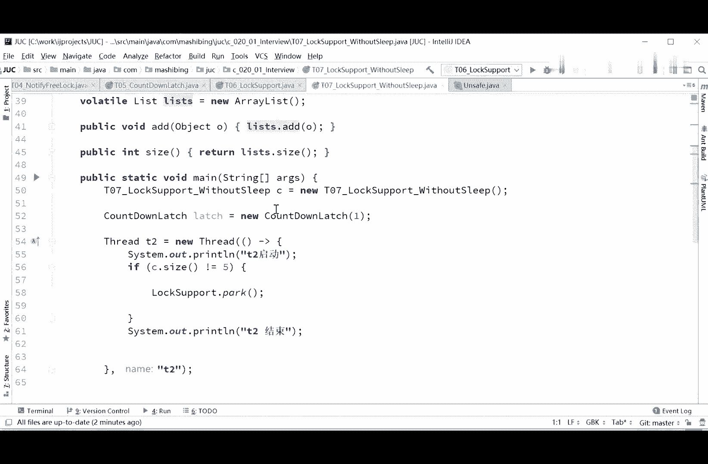
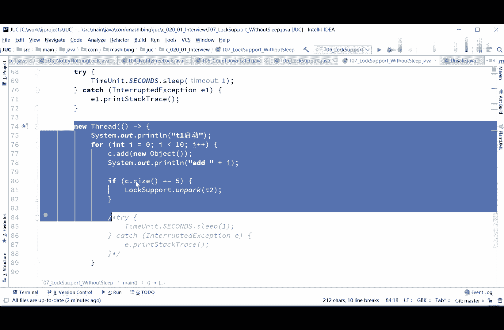
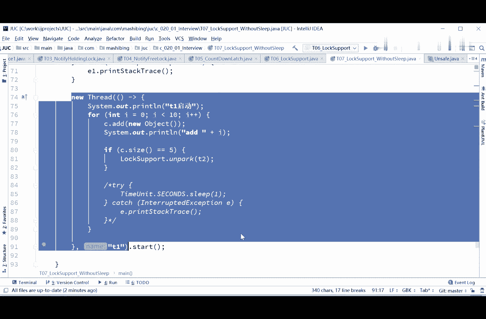
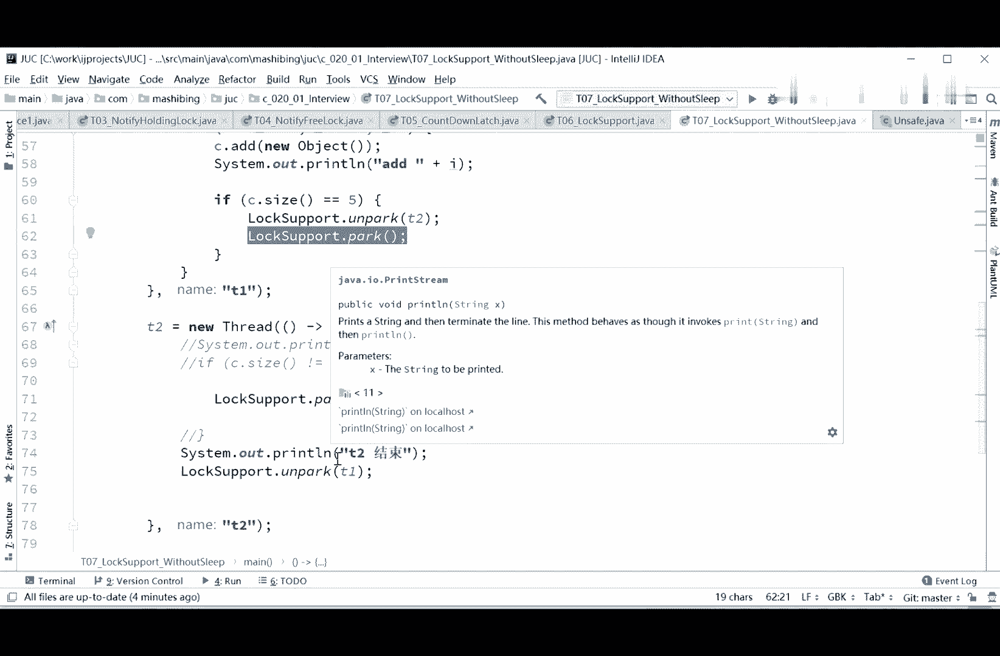

# 系列 3：P46：【多线程与高并发】面试题一(3)_CountDownLatch - 马士兵_马小雨 - BV1zh411H79h

什么特别的废话，这次呢我们再用countdown lash，我们来试试，coundown lash，就学过了门栓吗，所以这件事也很简单，t2 上来之后先等着，如果不等于五，let await。

等着就行了，然后t一启动等于五的时候，let。come down搞定啊，就这么简单，当然这个lege的话是一从一降到零，就继续执行了，这句话可以吗，同学们分析一下来。

count down lash这个写法可以不可以告诉我一下，门栓这个，必须得先把前三节看完，所以你应该是有印象的，门栓是什么，就拴在这儿嘛，上面这里写了个一，什么时候这个一变成零了。

您这程序从这儿往下继续，好想想看这这个小程序，第一可以不可以，第二有没有什么问题，等一下我们先看，可以不可以，门窗会不会被击穿啊，你看它是可以的啊，这肯定是没问题的，嗯结束了，这个很正常是吧。

哎我加到这儿的时候，我把你打开门门栓，打开门栓之后，哥们儿你是不是就继续了吗对吧，你继续的话，你等于t2 结束了，这个很正常，没问题，同学们分析一下这个小程序会不会有问题，仔细看。

想想看会出会出现什么什么什么结果，跑一下，诶这个打印是打印在a m6 之后了，诶这是为什么呢，诶这是为什么，同学们分析一下啊，呵呵打印太快了，该加锁，对对你们说的非常对啊，其实都很简单。

就是t一这个线程呢，诶在这儿打到五的时候，确实把t2 这个门栓给他打开了，是打开了，可是t一马上蹭蹭蹭继续往下运行，可是呢现在呢t一是继续往下跑，很可能跑到六，跑到七，跑到八的时候。

t2 这个线程才打印出来对吧，所以严格来讲呢，这种门栓写的方式这么写是有问题的，那么大家分析一下，你们想想看，如果如果我非得用门栓的时候，然后还要求等于五的时候，必须让t2 先打印出来，你们该怎么做。

两只门栓啊，转的非常快，没错说的非常对，用两只门栓就对了，t一等于五的时候来个门栓给拴住await，然后t2 上来是先先先拴住的对吧，先把自己给拴住，然后提到有鼓的时候，背先把这个栓打开。

对这个栓什么时候打开呢，t2 完了之后把这个栓打开，所以come down lash，用两个就可以了啊，两只没栓没问题，这写法留都留的作业吧，不难你自己写好吧啊这个很这个很难吗，这个写法聊做作业好不好。

你们自己写，和两对notifine是一个道理，是的哎大家伙学了比较麻烦的方法，之后来我们来看看比较简单的方法好吧，来看比较简单方法啊，这个方法呢就贼简单贼简单了，一讲你就知道第二个线程上来，二话不说。

c size不等于五吗，把自己park阻塞主，然后，第一个线程什么时候再等于五了，on p解散，看懂这意思了吧，这样写可以不可以呢，走你lock support用起来是最简单的，但是到底行不行呢。

好睡一秒的时候没问题对吧，但是我们把这睡一秒给去掉，走你，对这个门栓是一样的，ok搞定不行了，到4t2 就结束了对吧，啊set size等于五pk嗯，诶这个是对的结果，诶这个好奇怪。

这个为什么永远运行都是对的啊，这次不对了，终于不对了，吓我一跳，我以为这个永远都是对的，t2 结束到最后，这其实和门栓刚才的问题是一样的，那么大家想一下。

如果我非得用lox support这件事该怎么做，分析一下，同学们两个唉又得两个了，没错，又得两个，为什么又得两个呢，你们呃呃分析一下啊，就是说我的第一个县城到等于五的时候，我得在这里写什么。

写locks support the park，把自己park住，必须等第二个线程，在第二个线程打印完之后，再让他on park，start，ok，我突然想了一下这个小问题，要写起来还是有点复杂的。

lock park，你必须得保证t2 线之行啊，这个这个事非常重要，就是说必须保证t2 先执行上来先park，然后在结束了之后呃，大家写一下这个问题吧，这个问题还是有必要给大家写一下啊。

我们我们我们写一下啊，我们重重新再起一个程序啊，ctrl c ctrl v，零七多线程的问题就是这么的麻烦，lox support without sleep，不睡啊，不睡的版本。

不睡的版本应该怎么写呢。

我我我讲起来比较简单，但突然间我想起来，这个写的话呢也没那么简单呃，第一个呢首先定义t2 ctrl c呃。

第二个呢sorry不是ctrl c and ctrl c。

这个，停车x第一个呢首先是第1t2 啊，第二个呢我们定义t1 thread，t一等于ctrl v new thread，然后这里面没有说名字叫t1 ，然后呢，下面这个睡眠就不要了。

tr start t一点start，如果写的比较完善的话，那得是这样来写的啊，这个t2 结束了之后呢，用luckport第二on park t1 ，先得定义提，t2 t1 ，现在把t一定在前面去啊。

lock support t1 on park t2 ，还得，嗯现在呢它是t201 在前面提到的，你必须得必须得提前定义啊，这些得先声明德瑞t1 ，必须得先声明啊，不然他不认识啊，等于空，等于空。

先声明啊，不然你在这个正在表达式里头，他不认识，可能lamba的should be final，这lamba表达式里面的，必须得是final和那个effective final的，小东西写起来。

好了不废话了，它定义到外就行了啊，lock support on park t一呃，log support on park t2 t2 结束，on park t13 等于五的时候。

lost supported the park，本质上和weight notifine是一样的，我们先跑一下，看看他能不能够运行正常，嗯t2 结束看上去是正常的，但是其实里面还是有小毛病小问题。

现在呢应该是问题不大，你就运行多少次呢，天启动t2 结束啊，就不管怎么样呢，运用多少次呢，应该它都是在这个四后面打印t2 的结果，这应该是没问题的，但是现在呢其实还是有一些小问题，问题出在哪儿呢。

我们一会儿来分析，因为我写的比较快，我担心有同学呢可能没跟上，我们先来读一下这个小程序啊，突然间想起来想给大家写一下这个小程序，看这里，就是说我们在t一添加元素的线程里头呢。

等于五的时候我on park t2 ，为什么，因为t2 的上来就pk了吗，把自己给park了，上来呢就把自己给pass了，所以我上来之后呢，把t2 给打开，让它继续运行。

接下来呢这个呃log sport的park让让自己停阻塞，然后在t2 里面上来之后，把自己先park呃，接下来呢在我打印完结束之后，再把t一给打开，所以t一呢不会说穿透，继续的循环的往下打印了。

所以这个最后的结果呢一定是对的，最后结果一定是对的啊，呃那么，现在的问题是啊，如果这么写的话，会不会有问题，我们来分析一下会不会有问题，你能遇到这儿的时候啊，这么写好应该是对的，这样就没问题了啊。

总之认真思考啊，好好好的好好好好，就得多线程程序，都得仔仔细细的去去判断啊，我刚才认为有问题的原因呢，是因为我觉得有可能提前运行，t2 没来得及park呢，t就先运行完了啊。

其实t2 呢会在这里park的park掉，所以不会不会有问题啊，sorry，这是我的问题啊，所以这个这么写啊，应该就没有什么问题了，结果是对的，那么刚才碎碎念呢他提了一个问题。

他说t2 的if判断是不需要的吧，第二个碎碎念的问题是，这个说if size不等于五，这句话实际上是不用写的，上来之后你只要先把自己pk就可以了，同学们，你们分析一下。

如果这个c的size不等于五不写的话，到底行不行，分析一下，同学们就上来之后，你二话不说把自己park，我认为是有问题的，应该是不行的，这个原因是在什么地方呢，其实原因你想一下啊，嗯上来先park啊。

我考虑一下，上来先park，如果上面等于五的时候，on park，然后把自己park，上来先帕克，怕自己诶，好像是可以的啊，这个碎碎念对碎碎念好像说对上来，二话不说，把自己先pk，应该是可以，呃是的啊。

没错没错啊，这三点说的对，sorry，这个log ort pk直接pk不用判断，应该是可以呃，主要的原因是因为t一呢无论如何，在c。3=5的时候，它自己会爬不掉，所以这件事这件事是最重要的。

这个事是最重要的，呃只要有这句话在的话，那么t2 来说呢，上来之后自己先pop就可以，二话不说，你先停住，什么时候等于五了，什么时候等于五的时候，才会让你继续往下运行，你才会打印t2 结束。

然后再安排个t1 ，没问题啊，说的非常对，谢谢你嗯，确实没有问题啊，这是我们多探讨啊，好多多线程的程序就得多探讨啊，october是t一不怕t，一不怕g就不行了，t一不pk是不可以的，就不行了。

因为你t一不帕克的话呢，嗯你很可能t2 都已经执行到六七的时候，就是t一已经输出到六七，六七个元素的时候。

