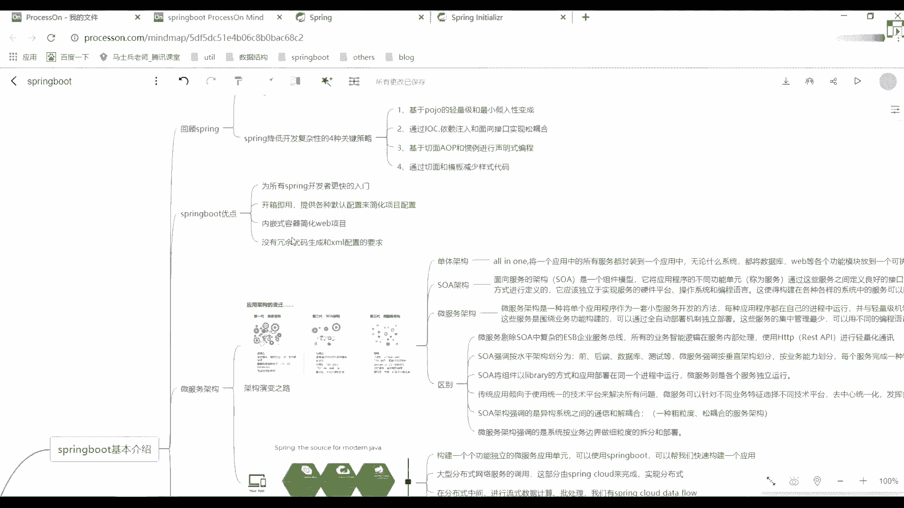

# 系列 3：P54：【Spring】什么是微服务架构？ - 马士兵_马小雨 - BV1zh411H79h

就行了好了呃。

禁止闲聊，我们接着往下看好吧，刚说完spring。

我们今天主要讲什么，讲spring boat这样的东西，我还是那句话，我希望你们去看官网啊。

逗号里面透露出来很多的一些相关信息，都是我们值得思考的，比如说很多人一直问我说，老师spring boot算不算是微服务，啊听到有问题啊，我说spring boot算不算被服务，就算同学扣一。

不算同学扣二，你觉得算吗，不算吧好吧，其实我照我的理解来说，我说一下可以说一下我个人的一个理解啊，在我看来，在我看来，微博是什么东西或者sm是什么东西，它其实就是一个启动器。

就是原来我可能要做各种各样的一些呃配置文件的一个编写的哦，包括说各个浮木块单独起一个，然后现在呢我把它整合到一起了，所以这块他给了一个非常官方的一个描述，你可以看一下叫什么叫spring boot。

是一个什么叫starting point for building of spring base application，这句话什么意思能翻译出来吧，没有六难单词看错了，sprbot是一个什么呢。

叫构建所有spring依托于spring的应用程序，然后呢告诉你说starting point是不是一个启动点，是不是有个启动点，好吧，再来看说sgo设计上来干嘛呢。

get you up and run，as quickly，as possible，什么意思啊，但他这种设计为了什么呢，让你能够尽快的把它搭建起来，并且尽快的把它给运行起来，这是最好的一个方式好吧。

叫within minimal，叫iphone的configuration of three，减少我们对应spring的一个配置，这句话是很明清楚的描述，你描述告诉我们spring bot是啥。

有提到任何跟微服务相关的点吗，有问题到不没有吧，所以你看到很多地方都在说spring spring board归服务呃，这么说其实也没啥毛病，但是可能不太严谨，你还一样看官方里面的一个基本描述。

这里面是最准确的，它里面有什么样的特点啊。

第一个叫干start in seconds，using spring english writer，什么意思，什么东西，这是啥，是不是说让你在进行配置的时候，通过在几秒钟之内就把它完成。

这有一个叫thresuler的一个启动器，我们直接听就可以了吧。

很多人在开发的时候，是不是有这样的东西叫starting spring i o，在里面我可以下载一个对应的一个扎包，建议运行，当然我们现在没人这么干啊，没人这么干，那怎么做，这样可以。

我们通过我们的idea是不是直接就给他进行一个集成，从idea里面直接做就可以了，好吧，s不要找事好吧。

你不来北京了吗，我等着给你打架的好吧，来北京找我好了，这是第一点，第二点是什么呢，叫building anything，什么意思，rest of a i吧，websocket。

web streaming task and more，是不是有很多很多这样的东西对吧，说构建任何事情再来看叫什么呢，叫更简单的一些secret吧，是不是安全。

然后呢叫rich sport for socsgo，搜索非常丰富的一个支持，对于我们的circle和我们的no circle，然后内嵌的运行支持有tomcat，有gt and you t对吧。

developer production toys是有很多开发者的一些高效率工具，比如说叫live reload，按照什么auto restart自动启动。

以及我们这个页面的一个自动加载好或者自自动重载对吧。

再往大家看这个翻译啊，我一直没解释解释对，我也不知道翻译干嘛的好，我也翻译不出来，谁知道各位可以给我说一下，懂我意思吧，再来看它什么呢，叫准备好的一些特点，例如跟踪对吧，杜龄和我们的一些健康检查。

然后说warner in your favorite，i de，可以在各种id里面进行运行，例如例如有什么spring to skills是一个工具的一个东西。

还有idea以及我们的that belt病啊，现在已经没人用了，我之前的时候还用，现在也没有用，所以大家想一下，我们现在开发的时候更专用，什么是我们的idea。

之后我们所有开发者都会在idea里面进行执行，好吧，其实在一级教授课的时候，因为老师已经讲过我们对应的一个spring boot了，好吧，讲过我们对应的一个应用这块大家应该都听过，为啥不说一个例子。

这块是它集成好spring的一个工具吧，也就是一个例子吧，但它集成oe spring是不是好吧，那现在你们在公司没用什么用，该第二吧，还用软件用的比较多，一点，所以我们上课的时候也会用我们的电。

不会用其他东西了，如果你觉得不习惯的话，你可以把它切换成一个例子啊，这就无所谓啊，反正就是个i d而已，看你自己的公司，lol的加加，你要能够派肩胛给我写好，你也是牛，你也是牛，我也佩服你，我也佩服你。

好吧行了，这是官网的一个基本介绍，这块儿就看这么多。

所以看完这些描述之后，你应该有个感知，ok我现在了解到spring boot到底是用来干嘛的，当然我现在还不会用，还不会用，不会用，没关系好吧。

一会我来教你如何进行一个使用，这边给大家画了一个什么呢，spring boot的一个思维导图呃。

我上课的时候习惯给大家画这些东西，好方便大家做一个整体的一个总结。

那我这儿来看一下吧，第一个叫回顾three，它需要某些spring的一些特点，比如说oware自动注入对，也就是说l o c和a op在我们的three bo面是有应用的。

很多同学可能还没写spring，没关系好吧，你不用管它，你不用管它好吧，这只是对spring的一个基本介绍好吧，基本介绍你再简单看看就行了，好基本简单看就可以了。

看完了说spring是为了解决企业级应用开发的复杂性而创建的，就是为了简化开发，然后spring降低开发复杂性的一个四个光线策略，第一个叫基于泡沫的一个轻量级和最小清属性的一个编程也写错了唉，侵入性。

我先说个字啊，编程第二个什么叫通过l o c，第三个呢叫a o p好吧，通过切面和模板减少样式的一个代码这块我们之后再说讲spring时候。

我会详细讲的，ok再来看spring boot有什么优点啊，说为所有spring开发者更提供更快的一个入门程序，然后他说第第二个叫开箱即用提供各种默认配置来简化项目配置，第三个叫内嵌式容器。

简化外部开发，第四个叫没有冗余代码生成和xm 2的一个配置要求之后，我们会学一种新的配置文件，你们之前可能用xml或者用pti之后呢，我会有一个东西叫什么叫email y m l。

这是我们spring boot里面官网里面给的一个推荐，好过网里面给一个推荐，到时候用钱就知道了，他写写了更简单一点好更简单一点。

然后后面我这也描述了一下我们对你的一个架构演变之路，这是从网上找的一张图片。

能放大吗，好大家看一下这个图片啊，第一个单体架构什么样子好吧，s o a架构以及我们的微服务架构，现在大家见到的更多是我们的微服务架构了，下面有对应的一些特点，这块儿下去之后自己来看好吧。

我们上课不做这样的一个演示，没意义，下课之后我会把这个图发给大家好。

欢迎大家，然后呢后面又对应的一个介绍好吧，什么叫单体架构啊，是不是叫all in one吧。

指的是将一个应用而中的所有服务都包含在一个应用程序里面，无论什么系统，都将数据库web能开个功能模块放到一个可执行文件里面，比如说一个外包或者一个炸包好吧，这样来进行一个执行，第二个叫soa架构。

面向服务的一个架构，它是一个什么叫组件模型，它将应用程序的不同功能单元简称为服务，通过这些服务之间定义良好的接口和契约联系起来，接口是采用中立的方式进行定义的，它应该独立于实现服务的什么呢，叫硬件平台。

操作系统和编程语言，这使得构建在各种各样系统中的服务，可以以一种统一的和通用的方式进行交互。

说完了，很多同学家不明白，好吧，你记住了什么叫rpc好，有这个东西知道就行了，rpc叫远程过程调用啊，很多地方都在用它，很多同学如果接触过大数据，应该知道大数据很多的一些呃框架都是以一种集群的方式。

集群的方式运行的，集群里面其余文字就是什么rp c吧，进行一些消息的通信啊，包括一些金刚检查了对吧，消息传输了很多点，都用它好，稍微听一下就可以了，如果你听到那个spring boat呃。

那个spark的话，应该知道周老师讲spark的时候，应该对这个点讲的比较清楚，什么叫r t c，因为在spark的源码里面有一个组件叫什么叫pc e n v吧，只有自己一个环境对吧。

包包里面用了我们的nt有什么point receive and the point，就有很多这样的信息，好吧，你看完之后你知道了，反正不管怎么样，你就是我学所有的技术啊，这些东西都是一样的啊。

都是一样的，ok所以我联系说我感觉sn和微服务区别就是有没有服务治理和福利，服务，数字和治理这一块，我希望还是一样，我希望你们能清楚地认知到什么到底叫微服务，微服务那篇论文你们看过吗。

是关于微服务介绍那篇论文有人看过吗，没有的话，一会儿我带你们看看，我一会带你们看看，一会我们带你看看，我看下大知道了，大家看一下这边的一个文字描述对吧，叫微服务架构，什么东西。

微服务架构是一种将单个应用程序作为一套小型服务开发的方法，每种应用程序都在自己的基层内运行，并与轻量级的机制通常是h p或者资源a p i进行通信，然后这些服务围绕业务功能构建，这个组件非常重要。

叫业务功能可以通过全自动部署机制独立部署，这些服务的集中管理，最少可以用不同的编程语言进行实现，并使用不同的数据存储技术，当然说完之后，很多人还是很懵，没关系，我们来看一个东西。

来看一下它呃，有错，等一下啊。

看这块叫michael service，是不是要微服务。

微博里面有一堆的一个介绍，是告诉你说什么到底叫微服。

刚才说了马天鹰路德好吧，有很多这样的一个介绍吧，下面有很多的一个描述，很多老师我看这个描述完我就疯了好吧。

我可能看不懂这些东西，没关系，这边中国人有个人做了一个翻译。

好翻译文章，我也找到了好看的船长好吧。

我们来看这样告诉你们说微服务到底是个啥宝贝，我到底是啥，大家看说微服务架构做做什么事情，这东西啊，注意了，这篇博客是给我们刚刚那个英文文档完整的一个翻译，如果你谁看英文看的有问题的话。

可以参考这个中文文档来进行看一下，我还是那句话，我建议你们把这套东西好好看，看好翻译插件，那个翻译插件并没有这个文章翻译的好好，我还是希望你们把这个文章能够看一下，懂我意思吧，地址。

可以吧啊这这个这是这个中文的地址啊，给他找一下这个英文地址，上面是中文地址，下面是英文地址，ok把两东西对比着，可以做一个查看啊。

能帮助你理解到底什么叫微服务，因为现在面试啊，你要说你不会spring cloud，或者你不会double面试都不敢出去，懂我意思吧，呃公司里面有些公司可能在用，有些公司可能没再用，就算没再用。

也一定是往这条线上进行呃靠拢的，懂我意思吧，这东西可能是以后的一个趋势，所以这块你必须要做一个学习。

为什么在spring boot这块讲一下微服务这个架构的一个体系，就是为了帮大家把spring boot和微服务给区分开来，不要把私人报考当成一个微服务，反正我是觉得不太合适的。

我不知道你是怎么认知的啊，好这东西每个人理解都不一样，那句话怎么说来着，1万人眼里有1万个哈姆雷特好吧，你这自己去做一个评估就可以了，我们这儿不看这些文字描述了，因为你看完这些文字描述。

你整个人就疯掉了啊，太多了，我们这儿直接来看这张图，你看这个图能不能感受到一些信息，好，能不能赶上一些信息，什么东西啊，这边有个单词啊，你可能是不认识的，你可能是不认识的，没关系，这是这是有解释。

是不是这个词，这是有个翻译叫整体应用架构吧，我就说我发现也无所谓了好吧，他说一个整体应用架构，put all is function into single process。

说他把他所有的一些功能组件方法都已经放到一个单一的process里面，是单一的进程里面，大家看到了这里面做了一个标识，什么标识，这样子的，这样子这样子这样子这样子的，是不是各种各样的一些组件。

你可以把每一个组件，每个组件都当成一个集中的服务或功能模块，好吧，他们统一的都放到一个进程里面，是不是，这是我们刚开始那个整体应用架构，或者说单应用架构是这样的方式，让妈妈他要做一个过渡，怎么过渡呢。

他做了我做的东西都放到一起可能不太合适，然后呢我要把它做一个拆分，怎么拆分呢，看后面这个演变之图，是把每一个小的功能模块或者说功能组件都做了一个独立的拆分，是拆分成我们看到这样子了，是这样子。

搭上了每一小块都是单独的，都是单独的对吧，他也说了，再发什么呢，把刚刚那个each elements of functionally，然后to啊，什么东西是不是拆分好的一个服务里面去，是这样的一个方式。

然后慢慢的又做了一个演变，怎么演变呢，从这张图上往下面一张图演变，大家看到了每一个功能里面是不是跟我们上面这块一样了之后呢，他在外面多套了一个。

就是相当于是多台的一个服务器，好吧，没服务器里面可以部署n多台的一个服务组件，是不是有1234，这样的话大家看到管理起来其实是比较混乱的或者比较杂乱的，然后又做一次过渡点，在后面这个地方这么多的。

就是说每一个服务里面好，每一个服务里面它会有不同的组件，不同的组件，我这块可以进行人为的一个选择，但是我规定好了一个里面是不是只能有四个服务。

这意味着你是不是在选择的时候，可以选择说我往不同的物理服务器里面进行部署，这时候他们是统一工作的，而这里面每一个地方你都可以称之为什么一个对应的微服务。

只不过从这个图上看起来的话，它可以是一个集群形式，所以从这个图里面你能感受到很多的点。

就是这个论文里面，你是不是看到这个点了，往上翻。

这个图啊就从官网里面直接拿过来了，就这个图是一模一样。

是不是一模一样，好吧，这也做了一个最官方的解释，所以你把这个图如果看懂了。

你就知道哦，原来是这么回事，大概是什么样的一个意思，后面对我们的微服务做了一系列的一个解释啊。

会有更多更多的解释下来之后自己看好我们这不太多解释了。

所以我希望你能认识到fboot不是为服务，不要把他再说错了。

这东西啊不是那么合适，懂我意思吧，ok我就这样给你们扭转一下这个观点。

仅此而已好了，这文章地址我已经发出来了，发完之后下载之后自己好好看看好吧。

下课之后就看，把这块好好做一个理解，或者做一个了解。

这很重要，懂我意思吧，放弃了，方便下一个图，这个图也是一个页面的一个图。

下周可以自己看好了，那这东西啊。