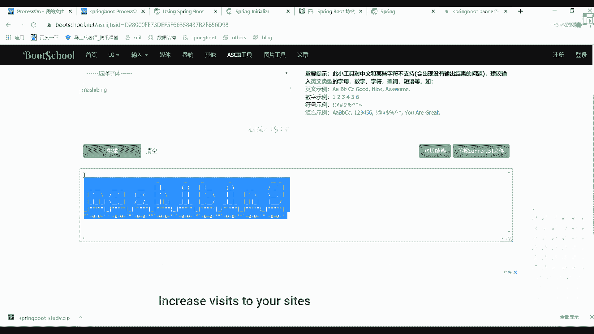

# 系列 3：P57：【Spring】Springboot配置文件及区别 - 马士兵_马小雨 - BV1zh411H79h

好了多余废话，咱们不再多说了，再多说了，咱们就聊这么多吧，下面呢我们开始正式讲课程来，还在同学扣波一，呃大家记住一点，还是那句话，呃，因为咱们机构啊说实话成立时间并不是特别长。

所以可能有很多点可能给大家做的不是特别到位，所以如果你对哪个点有疑惑啊，或者说那个资料找不全这些东西你及时联系班主任，班主任老师会写到我们这边给大家补上的啊，这大家不用担心啊，该有的都会有的，ok。

呃我们后援会做的越来越好，但是希望大家如果有哪些地方找不到，不要着急好吧，就是联系班主任或联系老师都行。

来我们下面接着讲我们的three boot，刚刚呢我们是不是创建了一个项目，当然这个项目在进行创建的时候，然后解压之后运行的，在公司里面啊，在公司里面一般没人这么干，太low了，我也说过了。

在我们的idea里面，它本身自动集成了我们这样的东西，所以怎么做非常简单，我们把当前项目给cos掉，我们看一下在idea里面。

idea里面怎么进行一个创建，来干掉，创建一个新的项目，注意在这里面你直接选择这个spring in ler，好初始化一个东西，写完之后选择上这个默认的一个网址，点next上面写的时候也一样。

大家看到了，跟我们刚刚那个东西几乎一模一样，把萨利干掉掉啊，别东西就没有了，然后点next的，这样可以选择我们需要的组件，假如说你需要外表选外表，把第一个给选上，假如你需要先跳y者工具。

比如说one box，再比如说那个热部署，你根源上可以了啊，这直接勾，不需要进行任何的一个搜索好吧，那再来看next，然后这可以选择我们对应项目的一个目录吧，这个目录我给他改一下。

我给你们单独成立了一个目录啊，这有一个spring bo，六就完。

好判断了，十点钟我们准时下课，下课之后，你们该去宾馆去宾馆，该去旅店去旅店好吧，该干自己事干自己事儿好吧，不浪费大家时间啊，2123看到了，把这些gmv这些项目都给删掉，我没有网盘，我有时候看他难受。

我就把他删掉，你们不想删也没关系，不想删也没关系，ok好了，下面创建的时候呢跟我们刚刚是一模一样的，大家看到这个目录的结构，目录的结构跟我们刚刚看到一模一样，所以这块你直接拿来用就行了。

好非常简单的一个东西，非常简单的东西啊，好了，下面呢我们再接着往下讲。

对应的知识点讲什么呢，刚刚我们简单部署了一个web上面的一个项目，外上面的一个项目讲完之后再说了，有两种部署的一个方式，一个是three start spring io来试一下，第三个。

这有一个小玩具啊，什么叫动态生成我们队的一个banner，这东西是一个小工具。

我们这儿可以做一个基本的演示，就这块你看了之后，你每次启动的时候，这会输出一个什么呢，叫spring book这样一个东西，如果你想改变的话，也非常简单，官网里面告诉我们了，我们这应该怎么做。

二三是不是这样的东西，你看他难受没关系。

你可以做一个更改，这是在哪儿啊，很简单，我们找一下官网里面的东西，还是从官网里面找，返回返回找一个user spring bot，这个东西叫banner，我们找一下banner哪儿去了，没有啊。

找到了啊，这儿这儿这儿这儿有啊，我们找一下这个b，诶怎么没有了，他那不是有资金在哪，这是自己在哪，点开之后，这个出来告诉你说你要仔细变，说可以通过在plus里面加一个半导找txt的文件。

然后呢或者说把这个位置指向我们对应的一个文件。

你就可以进行一个更改了，非常简单的一个方式，我们来简单做一下啊，打开resource，这里面创建一个file叫banner。txt学民歌是吧，刚才说出学民歌这块该怎么做呢，非常简单，这儿给大家两个网站。

这样网站你都可以直接用来进行一个商场，sn book里面这个叫人报了班纳直接写，这可以写什么呢，这是不是有这个东西划开电源线下生成，是不是对应这样这样这样一个图标。

你把这个图标直接粘过来看c张张我们这个文件里面来。

装完之后，我们再重新启动，看到了吗，是不是能看到对应效果了，接下来之后你可以做自己定制化的一个慢点一个小玩具而已，如果不需要，就算一般啊，没人搞这东西，反正我觉得这东西如果是初学者的话，可能觉得挺好玩。

你可以试试啊，你可以试试这东西啊，没没没没多大价值。

这是一个网站而已，把这网站给大家，你从百度饼直接揍起来这个网站，然后除此之外，除了这个网站之外，还有另外一个网站，这东西这玩意里面也能进行一个搜索，比如说叫什么士兵，是不是有点东西啊。

你生成完之后拿过来之后直接改就行了啊，也是一样的，明白了吧，佛祖保佑永无bug可以改啊，你可以自己去改，我们这不浪费时间了，你知道有这样东西就行了是吧，能做一个对应的一个修改哇，非常简单一个小工具啊。

你把它用一下就行了，所以给大家简简单说一下，看完之后往下看看，这个东西叫私人bot配置文件好吧，终于到我们的配置文件了，配置文件这块其实非常简单，刚刚我们开启了一个外部项目，你可以直接进行一个运行。

进行一个额部署方面的东西。

我说了，打开我们的泡沫文件，破文件下面呢有一个东西是一in，你通过plin点开我们的maven project，在里面有一个lecircle，这有一个东西叫package，你这生判断之后。

大家看一下这个效果，比如最终你们如果写完spring boot程序之后，你可以放到我们对应的一个服务器运行，运行的时候用我们java的运行就可以了，这样可以把target是不是这样，pro是不是这个。

然后呢，seventy。

他直接扎a杠，扎，回车看看吧。

他可以直接运行的，这不能报错了，这种错说这个808是不是已经被占用了。

因为我这是已经启动掉了，这是已经启动好一个了啊，停掉，一样的，随时开启了一个8080端口，把运行之后能出来，我们对应效果就这个东西，所以呢你可以在我们的idea里面运行。

也可以放到我们对应的一个服务器运行，运行方式变得非常的简单了，还是我们对应的视频网站也好，下去之后知道怎么部署就行了，非常简单，一个小点，藏獒藏獒返看一下我们对应的一个配置文件。

之前啊，我们见过各种各样的一个配置文件。

在我们当前这个resource resources这个资源目录下面，你可以填写我们对应的一个配置文件，这个配置文件我要写成配置文件，其实也非常简单。

刚开始的时候这个东西叫什么叫obligation properties，这个properties你在写的时候，它有自己的一个固定格式吧，什么格式叫k等于value，是不是必须这么写。

这样写本身也没啥问题，但是在此人bot里面好吧，他给我们推荐另外一种比较好的一个方式，叫y m r或y m a r好吧，有两种这样的一个配置文件来简化我们配置。

很多同学说老师我在用那个压码文件进行配置的时候，发现他有很多坑啊，发现有很多坑这个坑啊，只不过说你对这个当前配置文件不太熟悉的原因，如果你对这个文件足够熟悉的话，这块是没有问题的好吧。

而且写起来是比较简单的，懂我意思吗。

那我现在怎么做这件事情，来看下这怎么写啊，还要说了，配置文件连他这有一个对应的文档吗，我把这个文档地址拿过来，我怕怕自己找不到，转过来，转过来再告诉你说优点y a m2 。

说使用我们这样的一个亚马尔的一个配的配置文件了，这告诉你们环境里面有第一位，有production，这个开发环境，有生产环境，你这都可以进行相关的一个配置，如果你不用这种方式的话会怎么办。

用我们的property这样的方式，properties的话就是我们的k等于y等，而在我们用样貌的时候，现在是不是冒号冒号冒号是不是k冒号为这样的方式啊，只不过前面如果你有很多重复的好吧。

如果你有很多重复的一些数据的话，这是不是不用重复写了，有这个东西用vironment再看看是不是写一遍，所以呢这块推荐大家使这东西好使用这样的方式，你就还用property，也没关系啊，也没关系的。

这块反正都一样啊，都一样啊，配置文件吧只是为了加载我们某些的一个属性，你只要把这些属性应用对了，这块是不会有什么问题的，懂我意思吧，这也说了两种方式，一个叫k等于v，一个叫k冒号，然后空格value好。

这块注意了，一定要加我们的空格，公章怎么写啊，来先写一个最基本的一个配置，写什么叫server，是一个炮塔，回车看看这是不是直接等于号，比如说8080，你这样在运行的时候把它关掉，谁影响你。

这是会指定端口号，这是我们的properties这样的一个文件来运行，是不是也是8080，如果不指定，默认是8080啊，你这可以改叫8081，再重新运行，你这样看到这个对应信息更改啊，8081吧。

好这是其中一种配置文件的方式，与此同时，我可以在这下面再建另外一个配置文件，fail叫什么application，这样y a m2 是不是这样方式，这应该怎么写，叫server依然有提示回车。

他看到了吧，8082看到了server冒号，然后加上我们的port冒号，加上8082，那就是大家想一下，如果我两个配置文件都在的话，我会用哪个可以的在吗，可以吧，来运行看看效果，多少看这个值8081吧。

好吧，那怎么办，把这个文件干掉删掉，别掉删，我随便删啊，这项目里面东西随便改无所谓啊，我看看多少8082了吧，主要这是不是改过来了，所以此时你在写的时候好吧，谢谢大家，反正我个人啊。

我个人喜欢用这个键帽，好像英文歌词又不喜欢那个pperties，这无所谓啊，这无所谓，你这样写的时候，你就用它好，特殊点，不管你用property自由啊，用我们的爱ml文件也好。

这块都有相关的一个提示吧，比如说three dimv c点是不是可以加很多相关的事情，表达方面是对应对应格式，这么说，data source，是不是可以配置我们对应一个sos源。

这就是内部password等等东西都有，把都有好吧，这一定要注意了，所以这块儿属性写的时候，它会有对应的一个提示，但这块要注意啊，你在写具体值的时候，如果把中间这个空格给删掉，把空位删掉。

这块是不能识别的，所以建议大家把这个空格一定要加，一定要加个空格，大家看到了，前面的字体是不是也你是不是也改变了啊，这是变成那个橙色的了，懂我意思吧，怎么配这两个数据源这个东西啊，咱们讲数据源。

然后咱们咱咱们再说好，再来设计不大好，再来设计设计不大，ok就这样一个方式加一个boss上睫毛在boss上干嘛，这只是一个简单的一个配置文件，好简单的一个配置文件，就大家知道这个东西怎么配就行了。

只不过在我们当前这个配置文件里面好吧。

它会有多种多样的一个属性吧，你根据我们的属性去加就行了，然后这边给你列出来了，说我在使用这样的方式的时候好吧，它有什么样的对应的一个区别，好两种配置文件的一个区别，这给大家写出来了。

好配置属性的一个数据，啥意思呢，这有个东西叫configuration properties，是不是提到我们的注解了这个东西叫at the value，是干嘛的啊，这干嘛呢，好是不是有功能。

有什么素材绑定s p e r，然后呢js 233复杂类型的一个村庄，是从网上抄的一个图，网上抄了一个图，这图里面标注说哪个配置文件支持哪些相关的一个信息啊，哪些配置文件支持哪相关信息，这块怎么验证啊。

其实也非常简单，我们这儿可以来写一下，写什么，刚刚的配置文件是我们直接加载的。

什么是我们spring boot里面默认的一个配置，与此同时好运，同时我这其实可以定义自己的一些配置，比如说这个person冒号，快写一个name，冒号张三好吧，这括号12，然后呢再写一个size。

冒号冒号再写一个南，ok再写一个，还有啥呀，多少次冒号再写一个，知道这些boss了还是类型，政策类型都都都都用到了，还有一个list的吧，比如说写一个叫那好，再写一个book，看到了。

如果你现在想想写一个例子怎么办，我写一个类似的，这怎么写啊，写的方式也非常简单好吧，回车后面加一个杠，加一个叫杠m m m o v i e杠，这写一个go可以吧，是不是这样的方式好吧。

你把这些东西定义好，当你定义好之后，我该怎么写了，定义一个，卡斯哎对了，配置这写一个叫nt，里面就有一个psl软件p嗯呢定义好之后，里面可以写到private string name。

然后呢private integer这样写一个让他private，然后再往写private li，nice，相对我们对应的一个c有属性，当你这块定义完之后，还有怎么写，一样的。

把他的一个4s的方法生成一下，ok同样的生成一下我们对应的一个构造方法，下面再生成一个，副词缀就搞定了，好吧，这对于这样一类，现在我想做一件事情，什么事情，我想把我当前这个类的属性都加载过来。

你告诉我怎么做，就说我现在这些属性是不是没有值，没有值的话，我想在这个类里面把这些属性值都给付过去，我怎么付，你们知道吗，怎么写at value，对不对，怎么写，再写一个小写at。

value l u e这样写吧，后面呢写上我们对应属性值是这样写吗，该写一个person，点name这样写吗，好这样写也太麻烦了，这样太麻烦了，你是不是每个属性都要加，如果有100个属性怎么办。

好刚刚同学说了，安于此生，上面加一个叫艾，reciproperties加它，然后后面加一个前缀叫perfect，好吧，后来等于什么，刚刚是不是写了一个6p，大家看一下，我知道是不是信号它了。

我这是信号它了，当我写完这个属性之后，我现在不要测一下了，我怎么测开了啊，怎么测，他现在就能把它注注注入进来了吗，就能把这些水就拿过来了吗，你知道做些测试，对不对。

这不是测试类测试里面我要定义一个东西叫person，person，上写一个艾特奥特曼了，这里面写一个属性写啥，写一个叫s o u t person，不错的，裤子上都歪了，不能到位了吗，没啊。

这少写东西上写啥艾特，p o i n t o o n component，写错了吗，c o m啊，这对吧，写完之后这有问题吗，没了吧，那这块的话我是不是可以加一个对应的一个测试了，好运行一下。

看看这边打印的一个属性值，往下翻，看见了吗，这写name等于张三，a等于10 12，sx等于男less等于book movie girls，是不是把对应的一些属性都加载进来了。

也就是说这样的一个属性配置文件好吧，我除了可以加载我们spring配置属性之外，我自己的属性是不是也可以往里面定义，是不是在这样的方式啊，这个文件是不是比较好，好，你是直接往里面加一个对应属性了。

这东西啊你们之前应该是接触过的，或者说应该是了解过的东西了，这东西啊比较简单，关键点在于什么呢，在于说我刚刚加了个啥呀，第一个把它变成一个组件，它能进坦白报了。

第二个呢叫configuration proper，第四之后我如果带你们看源码的话，大家注意了，我要看到n多个什么什么purple list的相关属性啊，如果这样可以做一个搜索诶，怎么出不来data。

source，我看怎么重重写了，看这是不是一个东西啊，data source proplease，对不对，你会看到一堆的properties这样的配置文件好吧。

这个配置文件就是用来加载我们对应的这个m2 里面的，一个配置属性的，通过这些属性我能够直接把相关的一些信息再进来，所以大家发现了，其实最关键点在哪，在于我们的注解吧，好那ok问题来了。

注解这块是不是讲一下啊，有多少同学了解一下我们这个注解啊，你们之前说了，海洋老师讲课的时候讲过那个自定义注解好吧，其实注意了，注解是对于我们的gg dk里面自带的，它里面有四个叫圆柱解好。

叫圆柱体的东西好，我不知道你们怎么去理解它，也就是说我们在定义注解的时候，如果你打开任意一个注解，答完之后看到了是一个public，然后叫at interface，写了一个东西好吧。

这四个属性分别表示不同的意思，大家看吧，找到我们最开始的一个主类swimt，你把它分有什么呢，41干嘛呢。

你是做一个分别的一个解释了，之前在基础班的时候，其实我讲过这些注解的相关属性，给大家找一下哦，原来没觉的东西特别难啊。

那可能会可能对这个东西不太了解，你看叫增音注解，真想好说什么叫注解说，annotation是3号五开始引入新特征啊，中文名叫注解就别说了吧，他说他提供了一种安全的类似于注释的一个机制。

用来将任何的信息和元数据与程序元素进行一个关联，为程序的元素加上更直观更明了的一个说明，这说明信息是与程序的业务逻辑无关的，并且供指令的工具和框架进行使用。

也就是说如果你之后自己公司里边可能要封装一些框架，当你自己在封装框架的时候，你一定要自己定义自己的一些注解吧，是这意思，刚才说了，ation是一种修饰符，各个方法。

方法呈现变量参数以及本地变量的一些声明语句中，加注解是附加在代码中的一些原信息，用一些工具在编译运行时进行解析和使用，起到说明和配置的一个作用，注解也不会也不能影响代码的一个实际逻辑吧。

今天体操是一个辅助作用，它有什么意义，好吧，最关键是什么呢，是下面这块我翻说注解的一个作用，第一生成文档，这是常用的好吧，比如说java里面最开始的一个注解，常用的有as fat retur。

你在定义好一个方法之后，你在生成注释的时候里面是不是直接属性，第一个参数，第二个返回值都见过吧，把开源码的时候应该都看过这些相关信息啊，看打开看这块是有return吧，有paren吗。

找你找一些有参数的方法就看到了。

好吧，有parts这些东西，这些东西都是我们刚开始说的，就出解说了跟踪代码的一个依赖性，实现替代配置文件的一个功能，在编译时会进行一些格式检查，如add override放在枪法之前。

如果你这个方法并不是覆盖了超越方法之后，则编译时就能检查出来是不是它对应的一些作用了，这些文字性说明啊，你稍微看就行了，你要注意注解最根本的最本质的原理是什么，是反射好反射这块有人知道吗，都会吧。

没有人不会反射吧，来不会反射，同学给我扣个一，有不会的吗，啊会的会的，扣一不会扣二有不会的吗，没有吧，两大反射这块我补一个额外的知识，补一个额外的知识呃，第一次你们在接触反射的时候在哪。

接触的是在我们的g d b c里面，接触的应该是j d b c，在d c环节的时候，第一步我们要做一件事情，叫什么叫class，然后呢点for name，后面写一个com。

点mysql java是这个时候用的好吧，这时候有一个问题就是为什么啊，为什么，因为你这样写出完这个这个呃，根据这个字符串找到这个对应类之后，你会发现它会生成一个大写c的ex文件。

但你下面用的时候用什么叫driver manager gan，我这边manager是怎么知道这个类的，这里面会延伸出来另外一个机制，不知道有没有听说过叫spi，有人知道吗，有没有听过这东西，spi。

有人听过是吧，ok啊还是有多少同学听过的，就你可以四打我用了，ok什么学的最大好吧，忘了基础课听过，对我基础课讲过，我记得会讲了，基础课讲过这东西了，你说你要讲我讲过这东西了啊，这块如果大家不了解的话。

你可以看一下我基础课里面的一个笔记，你从边上板直接下载啊，jase这有一个o的笔记吗，s spn呢，哎你在这讲了啊，在o口是讲的二胡o上面讲的s p i叫java spi。

这样机制叫service provider，interface provide，应该是face好吧，是jdk内置一种服务，发现服务器提供发现机制，s spi是一种动态替换发现的机制，比如有接口。

小学时动态的给它添加实现，你只需要添加一个实现，这个我们经常遇到就是什么呢，sql的专栏好吧，其他不同的厂商针对同接口不同不同的实现mysql producsol，不同的实现机制提供用户。

而java的spi机制可以为某个接口提供服务实现好吧，所以这块下之后可以看看，我这边带着摘那个jdk源码，大家看的，所以这个文档下载之后，你可以好好了解一下啊，就产生自己实验，确实是这样的。

就为什么你加载过来的看起来是一个msl或是一个oracle的一个driver，为什么drive mage的时候在用时能找到好，这边到里面，我觉得我这个注释写的比较详细了，这时候可以看看。

刚才看到了很多同学对这些都不了解，如果面试问脑子就是个坑啊，所以这块大家如果不了解，那个数据库里面我讲这东西了，我稍微提一下这个东西，这之后可以好好看看，流氓不流氓啊，不管流氓不流氓。

但这些东西是很重要好，因为很多地方其实都用到了s p i，这样的一个实现啊，希望大家能够了解他吧，这个文档大家发现了，可以一会我给你共享出来，这还一样，其实就是查了五次过程，如果这东西你没听到过。

那很明显你是不是要学一下了，懂我意思吧。

所以大家看到了那个基础课里面我讲东西还是比较多的，虽然说是个基础呢，其实呃不那么基础，不那么基础，没听过，图片总是找不到，还一样，你下载过源top图图片之后，你把对应那个仓库下过来。

这些所有的图片我都放到某一个指定目录里面了，你需要把那个路径做一个自己的修改，改成你自己本地路径就可以了，好没有设置统一的网上图片路径，因为有些同学网不太好，就加有网，网，网不是特别好啊。

所以有可能在比较慢，我骗人我骗你啥了，我没讲的东西吗，sp，讲了，您这都不基础哈哈我再讲一遍基础课就没意义了，再讲基础课没意义，所以里面很多深点会大家骂的比较深，所以大家如果有基础课全学同学。

我还是建议把那个课好好听听的好吧，帮我下拉姆表达式了，我都讲的比较多对吧，好听听，ok好了，非法达到此为止，观察看是内置注解，在我们的那个jk里面，它提供一些内置语，比如all right，好吧。

呃dispk，然后呢，super warning这东西你们都见过啊，之前一直在用，但关键是不知道在哪儿呢，在这儿在圆柱解说圆注解的注解作用是干嘛呢，说负责注视其他注释，让呃负责注解其他注解。

jav中定义了四个标准的一个注解，他们被用来提供对其他idotation类型的一个说明，好吧，第一个还是他给的tt表示的是用来描述注解的使用范围，比如说你可以看一下当前这个注解它用在哪个地方，是类上。

马上还是变量上啊，所以刚刚你看到一个相关信息，比如找一个，然后他点完这个往上看，这是一tan告诉你说element type等于type，你点tape里面有什么有type，you failed。

有method，有pm parameter，constructor，local variable，然后呢，annotation type，还有我们的package就告诉你说我可以用在不同的地方对吧。

tape什么意思叫class interface好，in code annotation type of annual decommission，是不是告诉你是这样的一些相关信息啊。

比如说我这儿可以定在类里面接口上面对吧，都可以定义，这是我们太类型，刚刚看到了这个属性，把这个这个注解是不是就放在我们的类上面了，这个随便拨打的c上面，对他也是一个资金注解了，这第一个点。

第二个叫什么叫return retention，这个属性很重要，它表示什么是不同的一个范围，大家说reaction表示需要在什么级别保存该注解信息，描述注解的一个生命周期，有source表示原文件。

有class表示我们的计划文件，还有一个叫wrong time，刚刚你看到了我们刚刚那个主语在哪儿，是叫run time，表示运行时环境还依然要有它，你点开刚刚这个类，你会到有source有class。

有状态有关，是不是三个属性值，所以你在定义自定义注解的时候，你可以自己做一个合理的选择，我应该把这个注解让它在什么时候，在什么阶段进行一个生效，全部由你自己来控制啊，一个是源码阶段，也是卡子文件阶段。

一个是我们的整个环境的一个运行周期，你自己做一个衡量就够了，懂我意思吧，好吧，这块的一个配置再回返，这不用说了吧，得分是什么意思啊，是否在加a d c中展示出来，就这意思好看。

第四个叫inherited，啥意思，是不是说说明此类可以继承父类中的一个该主解，父类子类能不能进行一个基层关系，所以刚刚你通过这个圆柱体的一说明之后，你这样能够发现什么信息，target是我们的看法。

可以在类上接口上面或者资金注解里面，然后呢这边的范围在运行时环境还有文档，是不是生成文档会会进行一个呃，d o c里加了d o c里面会不会有最后一个叫是否有继承，这边有啊，你点开任何一个注解之后。

这都有显示1234啊，这有三个，这这这这这个地方是不是不是不能被继承啊，对吧，再点开，你看这个地方是不是12344属性吧，几乎所有的属性都一样，明白了吗，所以以后如果你需要去自定义注解的时候。

你也可以用这样的一个方式好进行这样的一个编写，这个容易吧，来听同学给老师扣波一，就说你要知道这些属性是干嘛的啊，这人属于干嘛的，我们这儿其实可以做测试，把做什么测试来，我来写一个啊。

给大家做一个测试试试呃，在哪写啊，定一个吧，你们都不知道我们做一个测试啊，知道容易用起来不难，来来看看这里面我定义的时候，这注意写了，要改一下，叫at interface，interface写完了吗。

写完之后，上面写一个at，第一个叫什么来着，第一叫啥就四个吧，他给他吧，是告诉你他好吧，后面写个字之后，你注意你看下它的类型叫element，太好吧，先过来哎，哪去了，lisation 2 v。

然后呢点儿我要写一些东西，比如说写在field上面可以吧，第二个写完之后可以写一个at，啥叫re 21，真是好吧，这一样的，它也有对应的一个类型叫retention purpose。

第二run a run time对吧，第三个叫at dot，问题的是他不继承没关系，你下来之后可以怎么写的，比如说这定义好这个注解，我前面定一个类，class test，这几个parade。

我再加一个叫at，还有微信能加吗，能把再写一个public void，叫呵呵，括号at这是一个my annotation，什么效果，这是报错了，为什么报错，这怎么这怎么写啊。

逗号element type，他报错吗，不错了，这是视频field，是不是加一个master的，你加上mac pro，这还有有错误吗，是不是没错误，这种使用很简单，所以你定义好是什么。

你通过这四个圆重点能定义好我们对应的一些相关属性，用完之后拿完就直接用就行，就这意思，虽然用起来并没有很麻烦，关键是你敢不敢用它，你现在啊很多东西在公司里面可能用的都是别人，怎么说呢，就是现成的。

特别在一些大公司里面用的是别人现成的封装好的框架，拿这些出去之后拿到这些用，因为有一些文档有说明文档，如果你需要自己去开发一些项目的时候，这东西必须要有，我这不是写的简单案例，你说什么都可以不写对吧。

这个自己注意有啥用啊，我是检验是一个案例嘛，简单案例嘛，你看一下这里面写什么东西，你这边是可以定义我们队的一个属性值对吧，是不是可以定义我们对应的一个方法都有吧，好想定一下，你定义下行了。

再比如说你们在写的时候，一般写注解的时候，比如你自行注解后面那是有个括号，这是对应的括号，这个括号里面应该写什么呢，这写一个叫，v v v a l u e，再写一个，还有这个string name。

现在属性吧，这写完之后，大家发现了是报错了，我靠这是什么东西，说变量内容，might not have been in r，没有进行一个初始化操作吧，因为一般情况下我们这是默认值啊，这默认怎么解决。

等于一个，张三是不是写的，当你写出来之后，意味着我每次在使用注解的时候，我这里面有个属性叫name name的话，就可以把它复制叫张三，而一般我们在自定义注解写完之后，这不写一个at呃，叫什么啊。

不是标题，这and my own nation，这可以写个什么数据，比如说括号这写一个name等于，写一个合格，说一下这样一个属性值，有说老师这不对啊，他好像没有这样的一个方法名称。

下面你要提供一个与之对应的一个公共的方法，什么方法，你在不会写的时候怎么办，你看这里面的东西啊，我们找一个方法，这有没有方法看一下，看这，default，这样写一个值吧，张三，代表诶这都没有啊。

这几张4g，看效果吗，它默认情况下，默认情况下是不是我们的一个张三，这个值保障折完之后，我是不是可以改给他改属性，你们在使用注解的时候，是不是也是改里面的属性，这是不是可以直接进行定义了。

就这意思就这意思啊，就这样一个方方式应用，如果大家还有疑问的话，我们抄讲十分钟了就够了啊，如果大家对这块还有疑问的话，怎么办，也非常简单呃，我在基础班的时候讲过这样一段代码。

大家看一下啊，这应该有一个叫拉姆达，annotation，还有antation的一个注解，一个一个代码，在之后可以好好看看，好好看看好吧。

这里面讲的比较清楚，这东西不难啊，你下一周后自己搜下也能截掉，有很多同学不太喜欢写这些东西，写词而已，懂我意思吧，好了，这个字音注解能过吗，能过的同学扣一分，过同学扣二，这很简单啊。

你你下次自己自己自己练一下好吧，我不浪费时间说这些东西的基础班讲过了，如果这块有问题的话，我把那个基础班视频拿出来，还是不知道他写的，那我怎么办，我再给你讲个需求来写一下，没得必要啊，没必要。

我还是那句话，你自己封装封装框架的时候，可能需要用对自己说，不封窗的话就没必要用了，你关键是什么，你要能看懂这些注解是干嘛的，好，现在你能看懂这些注意就行了啊，你能看懂这些注意就行了，这是什么意思。

所以能坐在什么地方，还有别的用处吗，你想想你，你你这定义的注意有什么用，你是不是一spring application这个sprication。

它是不是在他的基础之上又定义了我们的spring boot configuration，你点开它点了之后，它是不是高品质，它是一个注解对方这些属性吗，那意味着我就可以用了，点开competition。

再点开再点开，到那之后是不是到头了，这里面定义什么东西了吗，没定义吧，是不是啥都没写，跟我刚写一样，是空的，懂我意思吧，上来就对你一个解释，告诉你说这周也是用来形成什么样的作用的，比如意义的一个实现。

就这意思啊，我不知道这个自行注意，还能还能还能怎么讲，还能怎么讲好，现在就自己看看，如果是有疑惑的话，我们再聊好吧，本来不在这浪费时间了，主要还是反射，肯定是反射，我刚才说了嘛，本质就是反射。

他们想看简解析器就要看里面的源码了啊，解析就要看演员了，那这东西讲完咱们讲不讲完啊，这样你有时间的话，我专门来专门录一个视频好不好，有时间我专门录一个视频，我们讲一下这个解析器啊，讲一下这个解析器。

我们不浪费时间了好吧，这个这个我没想到一个注解，你们会有这么多问题啊，这真的是。

这应该是他自己定义的注解吧，是不是发出来了，是不是有些属性值，你可以自己进行一些定义。

就这个东西行了，下去之后看几个一案例，看你用长就行了，ok好吧，删掉了啊，别打了行了，这是我们刚刚说的那个自定义注解，这个多写这个多写就好，对，就是多写，你写多了就知道什么意思了。

这个一点难真真真的一点难度都没有，没有啥意义，还是一样，在什么应用场景里面需要怎么用就可以了，好吧，这块你也没了解很深好吧，刚看到我们刚刚加一个什么。

就叫at configuration properties，点就来看一下吧，找到我们这一类啊，这加载这样一个属性，加属性之后，你发现了它定义一些注解，好吧，这里面读一些事情叫values叫什么东西。

然后呢告诉你说string perfect是啥，perfect是啥意思，profit是不是刚才第一列属性的时候，是不是加了一prov个前缀，如果你后面这不写名称的话，我再强调一点，如果你这不写名称。

不写名称，有可能你这边直接写个双引号，如果你直接双引号里面写值的话，它默认读取的是我们这个values，这个方法是这个values的一个方法，懂我意思吧，是value一个方法。

所以他会把这个value里面注入我们对应你需要写的一些属性值，现在也一样，定义的是不是四个对应普通方法有默认值，有数值，ok读完之后就搞定了，它有解析器。

当我读取到相应的一个confusion properties的时候，我要做什么样的一个处理，对应处理之后我要做什么事情，是把我们对应这个配置文件里面的一个相关属性值给加载进来。

加之后加载到我们当前这个属性的变量里面去，就这样的方式解一切，如果有兴趣的话，打下去之后可以自己看一下，好可以自己看一下，同学就发个啥。

这是写的战士也写，也是个应用案例，这都是大家之前应该写项目里面的东西啊。

写项目的东西啊，ok所以这儿注意这个配置就行了，如果这你没有加这样的一个属性配置的话，如果你用的是那个properties配置文件的话，你要怎么办，是不是必须要写一个东西叫at values。

写一下再写一下吧，爱的value写完as value之后，这是不是也是一个注解，我是不是可以点开这个注解，你看到里面有什么是一个value，那上写的时候该怎么写了，公告里面写了一个字符串。

什么类型叫person，点内容吧，咱再写画at，value，再写一个冒号叫person点，然后写一个age为大写，是不是前两个前两题我们来测一下吧，来运行一下，把这个注释注的注注了，周周我来打开。

我们刚刚看到这个测试文件，右击走，报错了吧，报错之后，你往上翻什么东西，他说，integer，string require，integer，写错了吗，没写错吧，这写的没，这没写上吗，找一下啊。

我们这写的是啥，就是12嘛，这不读直接读，读进来了吗，车为啥不行啊，他说不能解决我们的依赖，通过我们的fid的age，这写的是啥哦，这应该加东西啊，等会，这样行吗，忘怎么写了，来看一下。

开开属性值降价了吗，是不是张32都有了吧，这都有了，有了之后后面两只是空，没赋值吗，变成空了，所以大家想一下，如果你的属性比较多的话，你如果用avalue的方式的话，你是不是每个属性都要往这边写算了。

而如果你下面用完这个配置手机之后，你可以直接进行一个完全的一个加载，好，完全的一加载，就这意思啊，这并不是特别难啊，特别特别难，你注意有这样的一个属性值，你知道如何加载就够了。

这是我们这样的一个属性的配置，这样会这样列出来了，说两种配置属性有什么样的一个区别，第一个叫at a confusion properties，说批量注入配置文件中的一个属性。

at the value是一个至今指定，还有一个叫松散绑定，这个松散绑定是什么意思啊。

所以法令也非常好理解，这儿来举一个例子，比如说我在写这样的东西叫name，这写一个叫last详细内容，写他写他之后，我在定义名称的时候改不了，先把注起来，这定一个名称叫，last，老c，我来重新算一下。

把这个属性给放开，一九，怎么报错了，支持吗，那是内容现在结束了，改了吧，我哦没改，get last time sl，大写就通过标出来，要注意了啊，get大写走，那不行啊，last name，写错了。

成功破口吧，哈哈哈，这样改的比较麻烦是吧，这样把他干掉，干掉下面这个c的开发也可，写完之后这样重新生成一下，能抓的都要，下面也是一样的，加一个突刺追，现在没问题了，看着我这时候都进来了。

是不是能把这个值多进来对吧，这是松开绑定的意思，而如果你写一个as value的话，这边是不能够进行识别的。

是他们之间的一个区别来演示这样的情况，再来看看什么叫sp l是一个表达式的一个知识，现在不支持的，而jsr 33是一个数据校验，就是说我这加入之后建立规则，比如说邮箱的验证。

对邮箱是否也符合我们对应一个规则。

那这块你可以加这样的一个属性值，比如说写邮箱，我给他写邮箱之后，你上面可以加一个属性值，或者加一下试试，大家可以看看at有没有看这块了吧，我将按一秒之后，这个格式必须要符合你的一mail模式。

如果不符合的话，这就会报一个错误，来试一下吧，再验证一下属性不对应啊，你可以看下对面效果就行了，这回报有错，我没报错吗，啊少了一个东西，但是我再加一个a email之后，这些属性是没起作用，没起作用。

为什么起作用，为什么起作用啊，啊为什么起作用，对这儿少了一个对应的一个组件at，呃valley，这不行，所以大家看到了啊，这些组件啊几乎用的时候都是配对来进行一个使用的，是来进行使用的，不错吧，往下翻。

这应该有一个中文提示吧，哎你这种提示呢，看过了哈，看着他说这是不是一个合法的，变成一位地址吧，是不是告诉你该有提示吧，所以就说这里面可以用一个这个自己的交易规则，原来是我们在前端这块。

如果你js写的比较好的话，js是不是可以作为验证，只不过他把它截成到后端里面了，写了一个框架啊，写了一个那个注解，通过我们的注解来进行这样验证，就这样的方式啊，你知道就行了，你知道就行了，有这样的方式。

你知道就行了，这东西都是很小的一些细节点，对于一些初学者，这可能比较重要，所以你在工作中这些东西也也用的不多，因为一般教练的时候，我们都会放到前端，前端后端这块我们其实很少做验证。

但你要知道他提供这样一个规则方式做一个什么呢。

叫复杂类型的一个封装，一个是支持。

