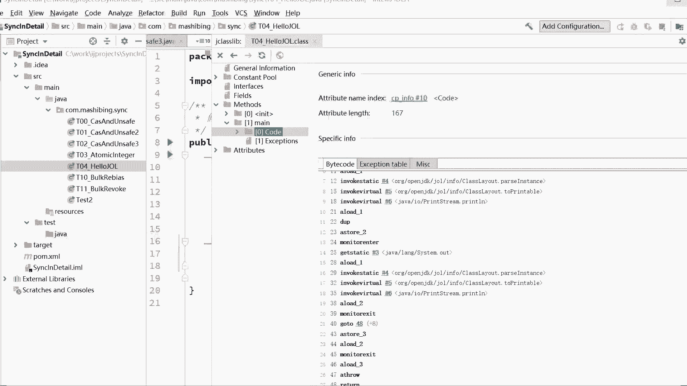

# 系列 3：P6：【多线程】锁升级过程 - 马士兵_马小雨 - BV1zh411H79h

好了，同学们，这张表呢你最好把它稍微的理解一下，这张表主要是在理解，不需要你背过，ok，好像到现在为止呢，我们终于可以开始讲我们的srt升级的过程了。

我的妈呀，铺垫的太多了，你们还能弄回来吗，来我们讲我们的sonnet这个升级的过程好，大家注意啊，嗯这个所谓的所升级呢，我刚才说过啊，最开始的时候呢，这个新款net全是重量级锁。

后来呢java对single net做了一系列的优化，这个优化的过程主要是在没有必要的时候，我没有完全没有必要向操作系统申请重量级锁，所以重量级锁是我最终的一个概念。

那么这个所升级的过程到底是什么样子的呢，是通过什么来标志的呢，大家听我说锁升级过程就是通过mark word上面后面这几位来标志的，仔细看这个锁目前有好几种状态，我们先来看锁的图。

好看这个图所升级的一个最主要的一个流程图就在这儿，当我们new出一个普通对象来的时候，它有可能是两种状态，两种状态的意思是new出来这种对象类型的对象，他的mark word是一种形式。

new出来这种类型的对象，他的mark word是一种形式，我们目前刚刚new出来的对象，new一个object，像这种对象就叫普通对象，还有一种情况我们直接扭会扭出来，匿名偏向对象。

这个我们一会儿再说，我们先来看一条主线，这条主线呢所升级的主线是这么来升级的，当我们首先new new一个普通对象出来，一旦我上，一旦我给这个对象加上synchronized这个关键字的时候。

它会升级为偏向锁，它会首先呢把这个锁呢做成偏向锁，做完偏向锁之后，如果竞争一旦激烈，它会变成轻量级锁，轻量级锁也是我们俗称的自旋锁，写一下吧，也是我们俗称的自旋锁，也有特别恶心的叫法叫吴所。

所以有的人会跟我抬杠，上次有一个学生问老师，无所到底是不是一把锁，对于你这种学回字到底有四种写法，六种写法，八种写法的孔乙级学生，我是没脾气的啊，随便你怎么认为你认为他是锁就是锁，不是锁，就不是锁好吗。

概念这东西是人类发明出来，互相之间交流沟通用的，理解什么意思就行了，不要学的这么死板啊，轻量级锁也叫自旋锁，也叫无所，这个词尽量别用好，在竞争再加剧，会变成重量级锁。

也就是我们最开始的向操作系统老大申请的那把锁，这个锁叫重量级锁，好，这是一条主线，我们先把这条主线讲通，new出来的普通对象，普通对象加锁加secret，关键字偏向锁，偏向锁，轻度竞争轻量级锁。

轻量级锁再竞争重量级所，这是一个最主要的升级过程，而且到现在为止还可以跟得上的，来给老师扣个一，好了，来我们继续。

我们来讲清楚这个过程好，首先来说怎么区分这个锁的状态，怎么区分锁的状态，这么来区分呢，在mark word里面优先看最低的两位，最低两位，最低两位是是你比如说最简单的最低两位，如果是零零。

那代表的是轻量级所最低两位，如果是一零，代表的是重量级所最低两位，如果是一一，说明这个对象正在被回收，gc回收的过程，最低两位如果是零一，它包含两种有可能的状态，第一种呢是无所谓。

也就是我们刚刚尿出来的，第二种是偏向锁，叫biased lock，那好那这两种状态又该怎么区分，所以在这种状态的前提之下，他必须得再加一位叫偏向，所谓来指明这是一把偏向锁还是无所无所派。

就是刚刚溜出来那个普通状态，如果是普通状态，001，如果是偏向锁状态，101不需要你背过，你大致理解这个过程就好了，那好可以继续了吗，继续的话，扣一，好了，下面我们来聊这个所升级的过程。

聊之前我们先来看看刚才列出来的普通对象，它到底是个什么状态啊，来大家看这里来同学们，你们看看你们看它是什么状态啊，刚开始的时候是new出来，001是什么，是什么，是什么意思来着，还有印象吗。

061是无所，就是普通的new出来的对象，对不对，无所派的一个对象啊，刚刚扭出来的，而下面这个零零呢诶零零代表的什么，零零代表的是看看轻量级锁，所以呢刚开始你看到一加速，他就直接给你加成轻量级了。

所以当我们看这个图的时候，跟你说。

当我看这个图的时候。

你会发现这个普通对象呢也是直接有可能啊，直接就上升到轻量级锁的，这是为什么呢，这是因为偏向锁没有启动，一会儿我们启动的时候再说好吧，启动的时候再说啊，先不管它来。

所以通过这你能看得出来这个锁信息呢就是记录在了我们mc的里面，好我们下面一点一点来讲，每一把锁到底是什么意思，每一种类型的锁到底是什么意思，我讲到这儿又要重复我一个以前经常重复的观点。

同学们学东西一定要先学脉络，不要先不要使劲的去抠细节，有同学说他现在就给我抠，我看到他刚才说了，说老师这块不是最低端的那边吗，为什么放在最前面，如果这个你不了解，去了解什么叫little ending。

就是小端和大端这个概念啊，这是计算机的最基础的概念，不过没关系，你知道这两位就行了啊，或者这三位，那么还有人说一些其他其他的细节，你先不要扣那些细节，最重要的是要了解什么呢，是要了解这张图。

这张图目前为止是最重要的。

什么叫脉络好，这个就叫脉络好吧，这就叫脉络啊，那，我们先来了解基本的概念好吧，我们先把这个大块的东西先了解清楚，然后再了解里面的细节，学东西要这么选啊，千万千万不要有一种有一种讲法，会有一种学习方法。

他是怎么他是怎么干的呢，讲义普通对象，然后呢好多好多好多好多好多好多好多好多细节，然后讲到你们学校好多好多好多好了，谢谢好，讲完了之后，突然间发现我已经忘了我现在在干什么，每次我都重复一遍。

不识庐山真面目，只缘你在庐山那棵松树底下研究蚂蚁窝，所以你永远也得不到一个全局的概念，永远也得不到一个系统化的知识，就在于这，所以先掌握脉络，什么叫脉络，ok我们先来了解到底什么叫偏向锁，什么叫轻量级。

什么叫重量级，好大家认真听，首先第一点先说第一点，这两把锁偏向锁，轻量级锁，这两把锁叫做用户空间锁，用户态的锁，这是什么意思，我不需要像操作系统跟不需要跟曹旭东老大打交道，少了一个打报告的过程。

好在这个时候你你你你稍微想想，我少一打报告的过程是不是就少很多呀，好很多呀，我就没那么重，所以这叫轻量级好吧，就这两个的都比较轻，这里面最轻的叫偏向锁啊，然后是轻量级锁，好这个里面呢我们一点点来讲。

就偏向左自旋锁都是用户空间来完成的，重量级锁是需要向内核申请，我们来聊到底什么叫偏向左。

我们现在聊什么叫偏向左设计，偏向左有一个最基本的它的一个前提，这个前提你好好听，认真听，千万别走神，我想问大家一个问题，大家知道在我们的，jdk的类里面有一个类叫string buffer。

我觉得大多数人应该都听说过这个类啊，string buffer，那关于这个string buffer，它里面的方法有没有同学知道他加不加synchronized，它是不是同步的，有没有。

stream buffer对，全都是假的，那我就想问你了，平时你们用这个string buffer的时候，你们真的会在多线程底下用吗，其实很多人写代码就直接拿来用了，也许大多数的你的代码运行的时间。

我跟你讲，其实就是一个线程在这用打多数时间就一个线程在用这个4g buff，但是呢里边又掉了synchronized的，那如果一个线程来访问srt方法，都要向操作系统申请一把锁的话。

这个效率是不是就很低啊，所以偏向锁是一个什么概念呢，偏向索的概念是这样的，在做了很多很多调查之后，发现代码在大多数的时间的情况下访问synchronize的时候，只有一个线程。

那干脆我为什么要让他进行锁的竞争，或者要向操作系统申请所没这个必要啊，哪个县城先来，我就偏向他就可以了，这是基本的理论上的逻辑，就是多数的synchronized的代码段在实际运行的时候只有一个线程。

多数时间，所以在这种情况下，我没有必要设计竞争机制，还不知道我说清楚没有，啊能跟上同学老师扣一，那既然这样的话，大哥我真的没有必要给你设计竞争机制，我干脆让你干一件事就可以了，好比如说啊。

比如说我们的谁来了大灰狼啊，有一个有一个小伙伴，我看大灰狼扣了个一大灰狼同学，他要进去噗噗噗干点事，但干这个事的过程，这就相当于我们的critical section。

也就是我们的那个sonnet的代码段，在这个过程中他要上锁的，他要给这把锁加ser来的，他怎么加呀，刚才我们说了，大多数情况下，其实只有他一个人，哥们儿，你有必要上锁吗，有必要像操作系统。

有必要向我们的厕所所长去申请一把巨大盖的锁来给他，给他给他锁上吗，没有这个必要，大灰狼就干一件事就行了，他在往这个，锁上面贴贴上他的名字，上书四个大字，大灰狼，ok ok这个就叫偏向所。

好偏向锁的意思就是我用非常非常轻量级的东西，我不需要通过锁竞争，我第一次第一个线程来的时候，我就直接把我自己的线程名字，当然专业名词叫线程i d，把我现成id啪贴到门上，所谓的贴到门上。

就是写到mark word里面，因此我们的偏向所来看这张图。

因此我们偏向左只是把当前线程的指针仍在自己的mark word里面就ok了，好了，这个叫偏向锁啊，不知道我说清楚没有，我们再来回再再复习一遍。

所谓的偏向左是没有必要设计锁竞争机制的，第一个访问这把锁的线程，直接把自己的线程id往上一贴就可以了，没必要继续好吧，嗯来可以继续，同学有点扣一，这叫偏向锁，是线程i d还要写成指针啊。

在java里面叫线程id，在c加加的时间里头就写成指针，无所谓，总而言总而言之就是当前现成的标志贴上去就行了啊，大灰狼的名字往上一贴，这个坑我的了，先把坑占一下啊，拉屎不拉屎，先把坑占了。

占着茅坑拉不拉再说，没有竞争对，正是因为上偏向所的时候没有竞争哎，所以呢这把偏向锁呢你可以随便上，而且他效率非常高，那偏向锁概念我们是不是就了解到这儿好吧，那好当我们了解了偏向所概念之后。

下面呢我们来看到底什么叫自旋锁啊，我看好多同学在那问还是cod去哪了，apple card到底什么意思啊，我跟你说了，别着急，先跟着老师的思路走，我先把脉络给你讲清楚，咱们再来谈细节好吗，好大家听我说。

作为下一步的锁，就是竞争一旦稍有加剧之后，他会把这把锁偏向锁给撤销，竞争来了，比方说上面写着大灰狼，大灰狼啊，上书四个大字，大灰狼，后来臭鱼来了，臭鱼说，哥们儿，你不能说把名往上一贴，这坑就变你的了。

我也想用，怎么办呢，好这时候你们两个竞争，这时候呢就是相当于有人来竞争所竞争所的话，那站在hosp角度，站在这个m角度，我就不能够说把你一个人的名贴在这了，这事我怎么做呢，我把你的名字扯下来。

这个叫偏向所撤销，先把偏向锁撤销，撤销掉之后，你们俩竞争，那你们俩怎么竞争啊，你们俩竞争的方式就是自旋的竞争，自旋所竞争好，下面我们说这个自旋锁竞争的过程，你们认真听认真听，刚才我说了，这是大灰狼县城。

大家知道每个县城都有自己的县城站，这是大灰狼县城站，这是臭鱼，这位同学的县城站，这俩哥们开始竞争这把锁怎么竞争，每个人在自己的县城站内部生成一个叫做l r的东西，目前面试最深也就问到这儿了。

所以你记住他的名字就行了，l r的意思叫lock record，叫索记录，lock record，好大灰狼生成大灰狼的lock record，臭鱼生成臭鱼的lock record。

然后这俩哥们儿就用争抢的方式，什么样的方式自旋，用自旋的方式想方设法把这个lock record的指针贴到门上，所以这里头呢最终有人竞争所竞争成功之后会有一个指针，一个poetry。

这个指针指向哪个县城的lock record就表示哪个县城持有这把锁，另外一个线程咋办呢，c a s继续竞争啥意思，什么叫cs继续竞争啊，在旁边转圈看看哥们儿，你释放锁了吗，你释放锁了吗，你释放锁了吗。

你释放锁了吗，他就在旁边转圈，他并不去操作系统，去申请内外重量级，所它就在用户空间转圈转圈转圈好，什么时候，你臭鱼用完了，我进去继续用，好这个过程不知道我说清楚没有，我知道你们会有疑问。

那不是很耗内存吗，他转多少圈才会不才会升级重量级锁呀，别急我不跟你说了吗，别急莫急，先学梗概，先学脉络啊，来稍微回顾一下什么叫做自旋锁，自旋锁的概念就是两个县城来竞争，这把锁，首先撤销原来的偏向锁。

或者你原来没有偏向锁，就像刚才那样普通对象，那我们两个直接抢就行了，抢的过程是这哥俩谁能够把自己的lock record的指针贴上去，谁贴成功了，谁赢好，你爹臭鱼贴成功了，说明臭鱼持有这把自旋锁。

那另外一个人怎么办，自选等待，所以这个就是自旋锁的由来，一个人在那儿拉屎，所有人在旁边转圈儿，本来这地儿我想给你做个动画的，后来一想算了，太恶心啊，不给你做了啊，ok好了，能get到同学老师扣一啊。

那好那到现在为止，我觉得你们应该听明白到底什么叫偏向锁，什么叫自旋锁了，那接下来我们来看这张图。

看，所谓的轻量级锁，自旋锁的无所，它是指向县城战之中的lock record的指针，好吧，所以一旦有人持有的话，62位里边就是一个指针，那好那下面我们继续聊什么叫重量级锁，重量级锁的概念。

这个时候就是这样的，看这里，看这里啊。

好什么叫重量级锁，重量级锁的概念呢就是我已经不再是呃用户空间了，我这把锁呢必须得向操作系统去申请，想当系统申请的时候，在macd里面记录什么东西呢，实际上记录的是一个叫object pointer啊。

叫object monitor，那么这个东西呢就是jvm空间写了一个c c加加对象，而这个c加加对象呢，它内部去访问的时候是需要通过操作系统这样的，经过操作系统之后拿到操作系统对应的那把锁啊。

到这种情况下你才能够呃相当于申请完这把锁之后，你才能继续持有，才能给他锁定，锁定完之后才能继续干活，好大体的一个过程我就说清楚了。

当然如果你要想理解的更透彻，恐怕你得去看pop ject monitor的源码，我一会简单给大家解释一下好吧。

简单解释一下hosport的这个层级的源码啊好吧。

所以大体的一个流程呢，就这个流程我不知道大家是不是大概的过程，我再说一遍，先学梗概，这个大概的过程是不清楚了，首先留一个对象出来，然后呢偏向锁一旦打开的时候，实际上给他上偏向左精度竞争。

两人过来开始抢轻量级锁，轻量级锁完成之后，如果竞争比较激烈，叫重量级锁，那么这个过程如果你想深入理解的话。

大家听我说，看housework源码的哪部分，hob源码里面的interpreter run time跟cp，最后你根根根一定会跟到这里，为什么会跟到这里，好，interpreter run time。

点a。c p p，这句话的意思是是是嗯，你你大家知道jvm是解释对java的class文件是解释执行，那么解释执行的过程之中，他到底是怎么做的，得通过它来读才能知道啊。

嗯我呢把这个代码呢已经给大家更到笔记里了，所以你如果想去仔细研究一下的话。

没有关系啊，你看老师的代码就都给你都给你更更更进来了啊，好interpreter run time要看哪个方法呢，叫monitor enter方法好，那么讲到现在为止。

在这儿呢我想给大家讲一点class文件的这种字解码。

这个呢非常简单，你认真听就行了啊，这个目前还没有人，没有任何人说理解不了了，注意看，在这儿呢我给它加了一个synchronized的o，然后我已经跑了一遍了。

我呢去观察一下它的字节码，这个字节码那叫view show by code，当然我用了一个插件，这个插件叫show by code with class library，就无所谓。

我们来看这个方法它生成的字节码code，你会如果你仔细去读，你会发现呢在这个生成字节码里面有一个字节码，这是jvm的汇编，有一个字节码，这个字节码是什么呢，它叫做monitor enter。

好大家听我说，那么也就是说当我们在源码层级，java的源码层级点java文件里，如果我们写了synchronized，它编译为class文件之后，它实际上是这个源码源码呢叫monitor enter。

什么时候会monitor enter，synchronized，大括号开始，monitor enter所开始了，什么时候所谓退出呢，monitor exit大概要结束。

还会有一个monitor exit的，这到底是为什么呢，产生任何异常的时候，monitor exit，所以对于single单来说，它叫做自动上锁，自动释放锁，什么时候自动释放成这段代码。

执行完自动就释放了，如果发生异常，自动释放，好这一段能跟上的，来给老师扣一，没问题吧，那所以你要想跟到我们。

这个跟我们hobo内部实现的时候，你要看的是monitor enter啊，那个那个代码monitor enter，如果你通过这个monitor enter的话，你能够大概读出它的梗概来。

同学们我们看一个大概就可以了啊，大家注意看啊，这个monitor angel它里面是怎么实现的呢，insert，大家看这里，if you biased locking，来翻译一下，如果使用了偏向锁。

也就是偏向锁，如果打开，我一会儿告诉你偏向锁怎么打开，怎么关闭，如果使用了偏向锁，我们调用的是哪个方法，叫fast enter，叫快速的进入所，就快速的竞争所啊，快速拿到这把锁。

else呢叫slow enter，你看他的名字，你就会知道偏向左比较快，其他方面呢要慢一些，slow intro，偏向索为什么快，刚才我解释过了，他不需要锁竞争的过程吗，当然快了。

所以fast enter slow enter呃，那这个如果你跟到fast enter里面啊。

我给你不给你一看了，因为我就给你摘出来了啊。

如果你跟到fast enter里面，你会发现啊，这个fast enter是怎么实现的呢，它会在一个safe point这个点，当然这点我要给你讲一讲，半天忽略好吧，在safe point的时候。

它进行一个revoke和revise撤销，并且定偏向所，如果偏向锁成功了，那就偏向所成功，如果不成功，他依然会进入到slow enter，所以它会有一个锁升级过程。

而这个slow enter又是怎么实现的呢，slow enter是首先进入进入自选，看到了吗，compare and pointer，进入自选，也就是升级为自旋锁，如果自旋锁不成。

下面这个过程叫inflate，叫锁膨胀好，这个膨胀过程就进入了我们的最终的重量级锁，如果大家伙想去读这个重量级锁代码在哪里。

synchronizer，synchronizer，在这个类里面啊，你自己去找就行了好吧，那么在这个类里面呢，他就开始调用linux内核一些实现方法了，这个时候就惊动了我们操心的内核了，然后就不大。

因为大多数人呢不是特别熟c加加啊，所以在这儿呢我就不一一的解释c加加代码了好吧。

