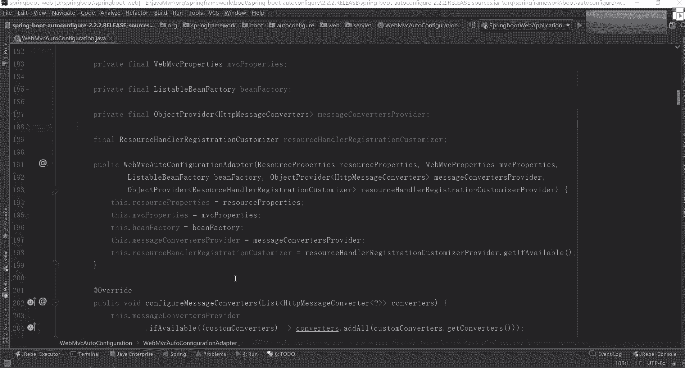
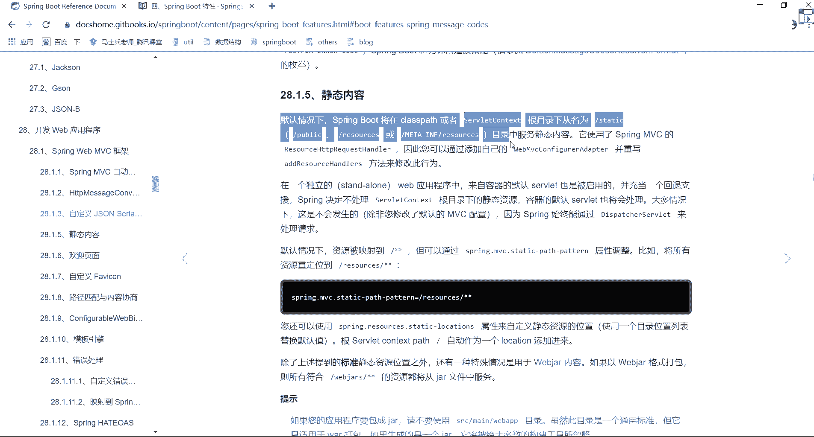
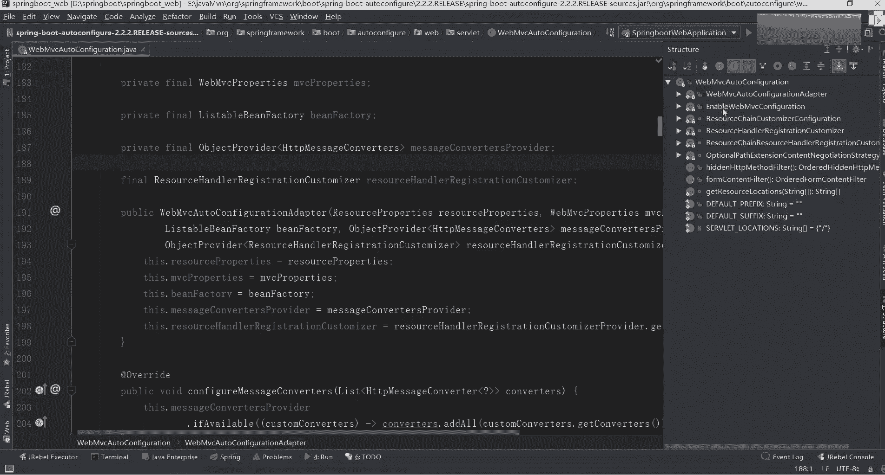
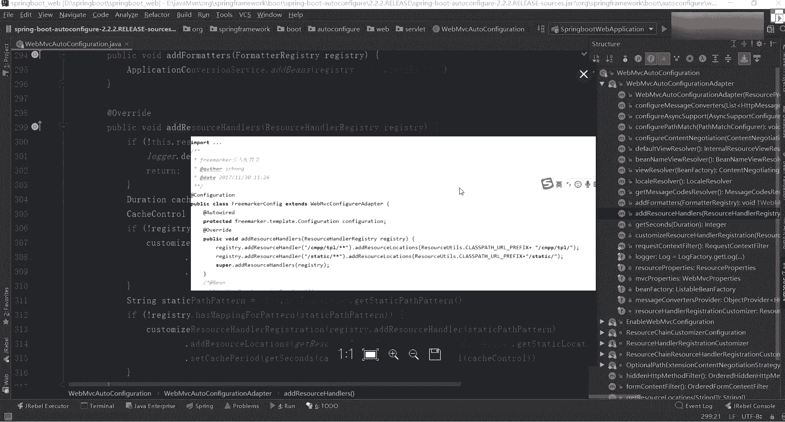

# 系列 3：P61：【Spring】课间答疑 - 马士兵_马小雨 - BV1zh411H79h

ok propd 4吧是你怎么找到那个pd 4的，折子戏出了一个非常关键的点叫properties，也就是说呃休息时间是吧，我说一下啊，你要想知道这个spring boot一个自己的一个呃配置的话。

这里面有两个文件，一个叫什么呢，往下看你往上翻，你往上翻，这里面包含了两个properties，一个我刚看到哪去了没了，有有个deer在这看两个文件，一个叫web mvc properties。

一个叫resource properties，好吧，就这块东西这里面就做了一个基本标识，它也是一样的，两个类嘛，好吧，通过这两类也能看到，但是你要知道从哪找进来的，这很重要。

有很多同学说老师我不会看原码，为什么不会看，你不知道从哪入手，你找到对应的配置之后，你知道从哪从哪进去了，好吧，你先自己找一会儿来带你找好吧，晚上还有这个有的，今天时间啊，我尽量把那个基础东西讲完。

然后从下节课开始，从不从下周的课开始，我们就直接干源码了，好带你们看里面的源码，你要知道这些东西好吧，一般的配置都是resource，找到了终于等人，哈真找到了，没有spring源码就能把源码都不难。

别人写好，你看别人写的代码而已，有什么难的，就那个顺序，朋友圈他写的项目比较大，但是比较多，我们找起来比较麻烦了，没有什么玩意啊，炸包里面配置包包的意思吗，一会儿我来讲这个过程啊，一会我来讲这个过程。

就是他为什么找这个类，它是怎么找进来的，做什么事情，一会来看这东西啊，看源码的时候看到都是各种注释，然后只需要添加不同的注解注释就可以神奇的工作了，不知道看什么时候解析这些注释的，你注意点啊。

你在看框架的时候，千万不要就是一行代码，一行代码去抠，因为你现在不是说我要写一个spring boot出来，这不是这不是意义，关键是说你要告诉别人说他到底是怎么完成这样一个装配工作的，只要这样就行了。

自己想出来比较难跟思路才能显示的，所以你要捋出来大概大致的一个思路，其实我跟你们说，你们其实不会看，不会看官网，如果看官网的话，你们都能找到对应的东西，我刚刚让你们看那个静静静态的东西。

你往那边找啊，我们可以找一个叫静态页面，这话说了，我刚刚那句话是从官网里面粘出来的啊，从官网里面粘出来的，粘完之后他说了，往里面找个东西，找一个东西看这。

他说你可以使用mvc叫resource a tp，resource request h，因此你可以通过添加自己的叫web mvc configuration adaptor。

并重写add resource hand，所以你看到官网也是给你解释了，从哪找，我刚刚是不是已经打开我们的web mvc这东西了。

当你打开这configuration之后，你可以打开我们整体的一个目录结构，找一个叫外版vc adapter哪去了，这样你点开之后找一个东西叫add resource handler。

是找这块了，这块里面是不是就对应了一个提示，对我为什么给你们强调说，你们一定要去看官网，看官网，因为官网里面真的有很多对应的一个东西，高管都给你指指出来了，只不过很多同学选择性忽略这东西啊，一七老师。

我们现在刚要用spring boot前后端分离怎么弄好，sbot打成炸前台不方便放，不方便开发，什么叫不方便开发呀，现在如果你要做前后端分离的话，最好的架构应该是spring boot加mae哦。

加v e，你加我v o e之后，相当于你前一秒都已经写好了，直接打包之后直接能运行了呀，就你的页面可以放到你的tempt里面，template里面，你返回之后，只要请求道具对应的正能数据就可以了，连条。

你后端后端这块你提供好对应的一个接口，提供好对应的一个接口，留好接口之后，前端只需要调用我们后台接口的一个服务，返回对那个真实数据就可以了，而且你如果用，而且你one spot之后。

它有一个sim leaf的一个模板模板引擎，一会儿我们会讲用到模板引擎的时候，可以用模板引擎直接进行加载的，这些东西很方便啊，并不难，这东西啊你不要自己瞎琢磨啊，你上完一搜。

随便bot前后端分离一堆的案例，告诉你怎么做，学会学习就够了，事实证明面上百度边上是最快捷的，理论来说没问题，但是你要知道现在的帖子啊都是抄过来抄过去有很多的坑，像我给你们整理的笔记。

里面都是之前我自己都演示过的，或者自己都调过错的，2%没问题的东西，我再发给你们，你要具备一个最基本的排错能力啊，这能力要有，2017年写的代码，你还能找到，对你这个不就是看他写的这个东西。

他自己不就继承了这样一个类集成这样类之后，他是不是可以映射我们对应的一个目录，就可以映射我们对应目录了。

现在上班吗，为什么17年那会还在还留着，这么快找到了，印象深刻。