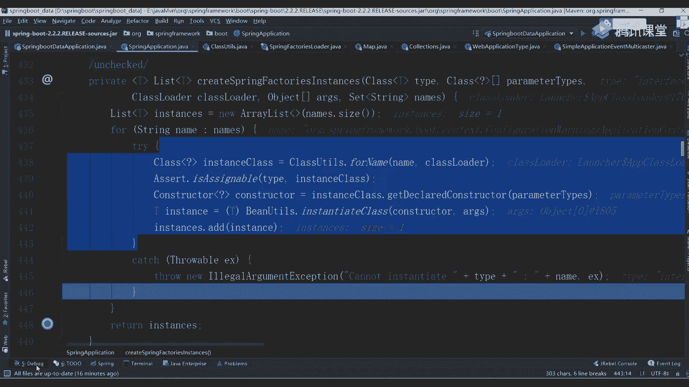
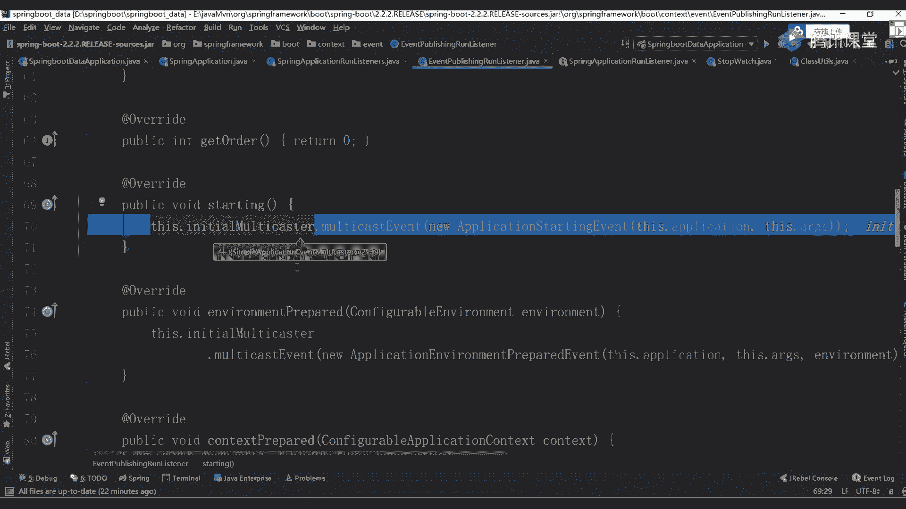
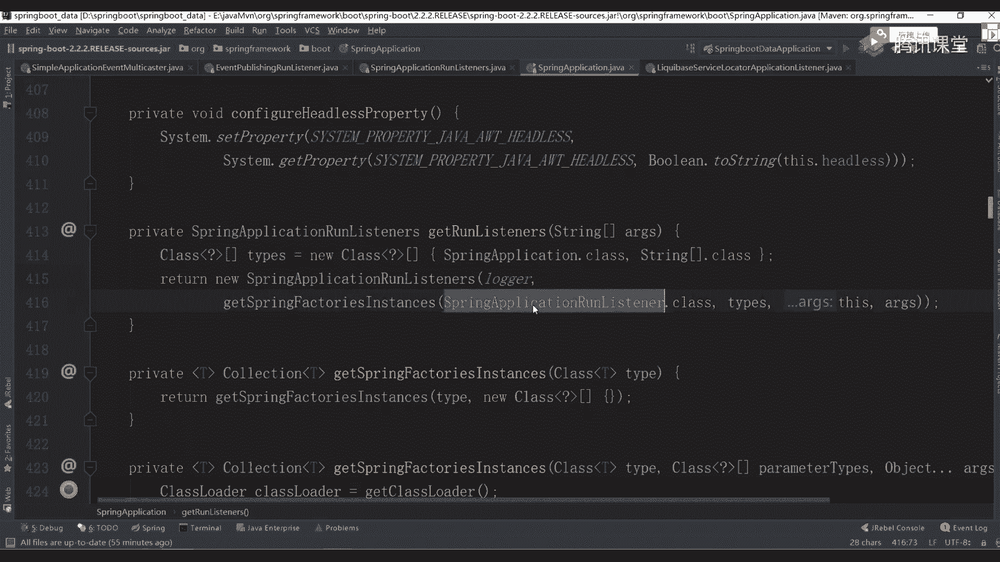
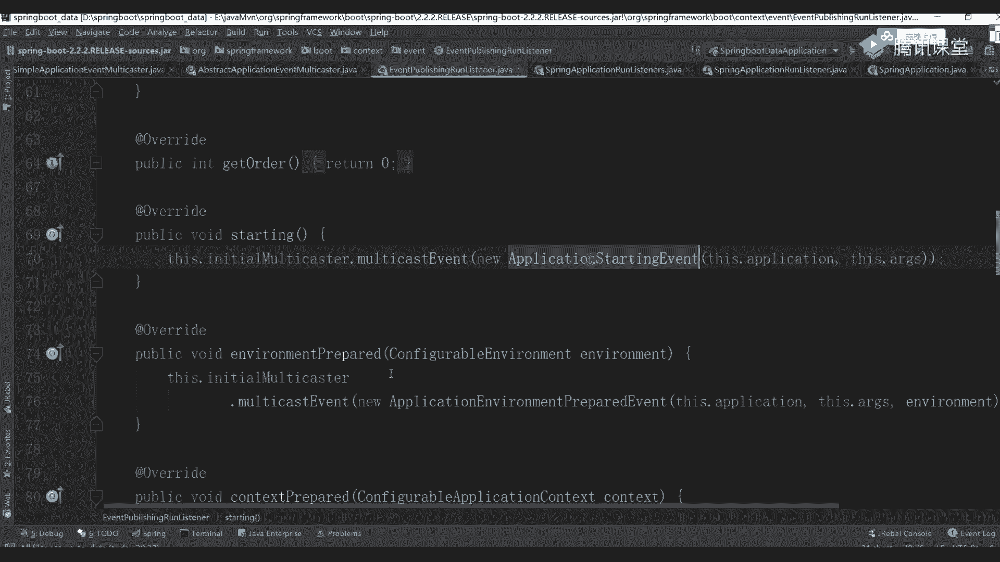

# 系列 3：P63：【Spring】Springboot启动源码解析一 - 马士兵_马小雨 - BV1zh411H79h

你要听话，我只说这一次错过就找不到我这样的天使，我就是喜欢你，想要跟你在一起。

从此以后我要握紧你的心，爱你真的很犀利，第一眼看到你立刻拿下了，我的心，眼里都是你，就算再多风景照片永远都是你无懈可击的魅力，轻易就让人入迷，什么道理都没关系，不妨碍我爱你，我想要牵着你去看繁星点点。

在浪漫的夜空下撩拨你心弦，伴着你到永远，让愿望都实现，能随时随地躺你怀里相偎相依。

people sit on that can fi，and i love it，when we rise side by side，cause you know。

we got that can fight，people save up that can fi，and i love it，how we don't even try，because we know。

we can't take it fi，the things i do couldn't do without you，place everywhere，when you need me there。

when you need me there，one piece could do whenever，i love with you。

cause we know we got that can fight，yeah，we know we got it，don't bring no，we are making e。

and i love it，how we don't get to try，cause，we know we got that good bye，yeah，we know we got。

this people say，we got that goodbye，i was singing，cause i can't stay inside。

cause we know we got that goodbye，things i'll do what do without you，oh thanks，everywhere。

when you need me there，when you need me there，one come into whenever，i went with you。

cause we know we got to get back，yeah，we know we got，because we know we got taken by。

and i love it that，we don't give them，a try as，we know we got it，b，yeah，we know we got that。

one piece clointo，whenever，i'm a review，cause，we know，we got that kf，can i love you。

how we don't even try cause we do，we take it by，yeah，we know we got it。

when you hold the line when every one of them escaping，i'm giving in tell me in this house of mine。

and now i never come out of runconcos，tell me where this style line will have a sting，well。

i save one more thing will put the sound of mine，stands strong，that's the price，you pay leave。

behind your heart，cast away，just another product of today，rather be the hunter than the prey。

and the finding on the air race of cause，you're rumentor a beating hear。

so you could be so cold to make it in wye girl，let you road lip in your life。

go go you gotta be so cold，yeah，you're left to roll，will somebody。

let me see the living in the doctor，i'm living through the glass，find the wrong within the past。

that's the price you pay，maybe i'm your heart gets away，just in that brother today。

rather be the hunter than the pre，and you're standing on the outfits of。

cause you are mentila beating on the rot be so cold to make it into，deep in your life，gogo gotta be。

so cold，yeah，you're left your roll，i'll tell you a story before it feels itself the lei on my reasons。

and say that i need help we all got expectations，but no one listen to me，so i played in this song。

they tell me think with my head，not that thing in my chest，they got their hands。

and my neck this time，but you're the one that，i want if this real is around then。

they don't know what this feeling is like，and i say，yeah，yeah，yeah，yeah，yeah，yeah，yeah，yeah。

then sit in my hands，i'll tell you all my secrets，and you tell what with your friends。

hold on to your opinion，and stand for what you say in the end，it's my decision，so with my foreina。

they tell me think with my head，not that thing in my chest，they got their hands，and my name is time。

but you're the one that，i want if this，real is around then，they don't know what this feeling is like。

yeah，yeah，yeah，yeah，yeah，yeah，yeah，yeah，yeah，yeah，yeah，yeah，yeah，好了同学们，咱们开始准备上课了好吧，能听到我声音的同学来扣个一。

这节课咱们开始讲那个bot源码的，讲bot源码人有点少啊，咋回事，你把我赶这周赶到哪个房间了，哈哈哈，这要是有自己单独的房间好吧，雅间ok好了，今天呢我们开始讲对应的一个源码课程，呃，讲源码的时候啊。

我刚刚说过了，内容容易引起极度不适，很多同学啊不管自己看也好，还是听源码课也好，听，都非常头疼，好听的非常头疼呃原因非常简单，大家可能很多基础知识呃不具备好不具备，所以可能呢呃看的时候非常非常难受。

非常难受o没事啊，该去听大数据听听听听大数据，你选择你感兴趣就可以了，这无所谓好，只要你听课就好了行吧，呃咱们现在开始讲一下spring boot的一个源码课程，呃之前啊你们应该听过很多源码课了。

问一个问题，大家觉得我应该以什么样的一个方式来看源码啊，这样的话效率更效率更好啊，高级感到底应该怎么做，官网官网上看源码就就就看不到啥了，好吧，先流程ok好奇来给大家说一下，其实如果你作为一个初学者。

或者说你作为一个只是应用一个应用者的话，好吧，你其实对swibox这块东西可能不太了解，但我们知道它是什么，是不是另一边定义了一堆启动器，所以第一件事先入手的时候，你应该知道了一些基本的配置，先想一下。

每次当我们想运行一个three bot程序的时候，都是通过这样一个幂函数来启动的，保持作战方式来进行启动的，这个启动方式大家看到了非常非常之简单，是感觉跟什么都什么都没写一样，那我们怎么做还是一样。

在后续看的时候，跟着源码进去进行一个debug，你要看一下每句话的一个代码好吧，这到底传到什么样一个参数进去，一定要顶bug，不敌bug之后，到后面就懵了，我看我也懵懂，我意思吧，大家看到了。

我们刚开始都是一个spring application，点wrong的一个方法，所以你先点到这方法里面，这打一个断点，我这边打了，你这直接打个断点。

然后我们一步往里边跟老师让我们写一个spring boot吗，不带你们写没意义啊，没意义啊，第八启动呃，太太说第一次上课，老师自我介绍一下呗，我姓连，大连大连有啥自我介绍的官网都有好吧。

游戏循环去官网看一下好了，我们刚刚已经打了一个最基本断点了，现在来右击debug开始进行启动，大家看到了这块会卡住，返回卡住，同时从第一行已经跳到我们这里面的一个run方法了，加上方法之后。

里面又是一个run的方法，还是一样，一次一次往里面点，点到里面去之后，这大家发现了有什么东西叫new spring application，好吧，他这是不是创建了一个对象，刚刚我们在主函数里面写的时候。

我并没有创建对象嘛，是不是直接以这样一个参数来进行写的，是不是调用它静态方法，但此时你注意了，除了这样写之外，其实很多地方你可以这样来写，它叫three boat啊，不对。

spring vacation sa等于另外一个spring application，它是可以创建我们对象的，创建对象之后sa第二叫set binder model。

你通过这个参数对象也可以进行一个直接调用，好听说这里面你可以设置自己的一个参数，那这块我们在后面源码的时候，你能看到具体的一个环节和具体的一个过程过程，只是稍微有点心，稍微了解一下就可以了。

进去之后跳到我们的three application这个源码里面去往上翻，我强烈大家建议大家一件事干什么事儿，每次在看源码的时候，先把它的一个最基本的注释给看了啊，最基本一个注释看了他说了。

这个class干嘛呢，叫can be used to brua，引导好吧，并且启动一个spring的应用程序，对于一个java主函数，是不是通过一个单指玩数，我能启动一个程序了，对人家说了。

bad bot class will perform the following step to bottoshop，your application是啥意思，说，他可能会经过下面的几个步骤来引导你。

启动当前你自己的一个应用程序，下面分了三个步骤，第一个叫什么叫创建一个什么东西叫instance吧，是不是一个实例对象对吧，哪个谁对象叫application contest。

又看到当前这个上下文对象了吧，你不要跟我说，老师这上下文怎么解释，你们从学sl的开始就已经开始接触我们的上下文对象了啊，它就表示你可以把它理解为一个容器吧，可以把理解为声器。

都会有一个上下文会放到里面去，这是第一点，第二点什么呢，叫register a说他要注册一个什么叫common online property，source，是命令行的一个属性参数吧对吧。

然后呢做一个school command line arguments at spring property，就是你可以启动的时候指定一个命令行参数，比如说我们写的叫杠杠server port。

是不是指定端口号，是这样的方式，第三种方式叫，重新刷新我们对应的一个context上下文环境吧，loading all single，beans，single变身啥意思啊。

是不是加载所有的单例的beans，这不用说了吧，然后再往下看，叫trigger定病死，是不是触发所有的病死好，所以注意这里面告诉你了，我大概就通过这几个步骤，然后现在告诉你说有几种启动方式。

第一种应该怎么做，是不是写了一个主要程序，第二种后面告诉你说了，你可以这样自己一个设置，先创建对象，再进行设置，两种方式都是可以的，然后下面有一堆的解释，前一周看一下就行了，我们这儿不再挨个读了算了。

我就我就给一个建议，每次在写的时候一定要去看这个注释，这注释里面虽然比较少，虽然比较少，但是呃描述事情描述的还是比较清楚的，一定要去看好吧，看完之后我们再重新看吧，看到刚刚那个run方法。

这刚刚那个上面那个解释看懂了吧，应该稍微看懂点吧，ok来往下看绕方法，然后放完之后先看他new了一个对象，new对象的时候一定要做一件事情干嘛，是不是点进去再点进去，是不是有一个主函数了，那一样的。

我们刚刚因为已经选择debug这样的一个方式了，所以你可以一步一步往后点诶，到哪去了，到这儿了，等会儿啊，我把这些断点给干掉，来干掉，重启一下，好了到这一行，然后呢往里边点点f7 对吧。

再进到f7 里面再进去加到这儿之后，看到了他就到它的一个主函数里面了，在当前这个构造方法里面，各个方案里面做什么事，第一个叫this resource loader干嘛的，不知道第二个是不是一个断言。

第三个prime source，然后viation type type，然后set什么叫初始化的一个方法，然后set什么叫listener，最后有一个mean obs，大家发现了里面一共做了这几件事。

这几件事很重要，你必须要提前把它进行一个出装好，同时在当前类的上面还定义了很多的一些参数值吧，这30当你在创建对象的时候，一定会进行一个创建吧，比如说上面有什么用哈，希set这是不是一定会执行的对吧。

要不要执行，怎么判断也是一样的，你挨个往上动啊，走f8 是到这行了，开始创建走走走，是不是把这些前面的一些成员变量值都给你附上值对吧，复完之后跳到这一行，第一步叫这操作，load等于空空就空着，不管它。

第二步是个断言，也不管第三步，这一步很关键的是干嘛的，叫primary source了，这东西怎么翻译啊啊主要资源吧，是不是主要资源后面给了一个值。

说arise at least primary source，是谁，是我们刚刚传递过来的，就是我们刚刚写好的那个主类，明白了吗，主类你刚刚在外面写个啥，是不是three bot dation。

所以当前这个主类就是这里面的东西直接拿过来，你给他看一下零是不是有一个name叫spring boat，诶，那叫spring boot data vacation，是不是刚刚好的那个启动类。

等着看这个吧，看完之后，这第一步骤先把它赋给一个集合对象，第二步干嘛呢，叫web app application type，第二deduce from class class，这个是干嘛的，注意了。

在方法里面这东西很关键。

你先听我说，你不用在意，说也不错的笔记，我这儿给大家写好一个文档，大家看一下这个文档里面怎么做的，能写注释的地方，我几乎都把它写注释了，懂我意思吧，所以你现在先跟着我的思路去走，他是怎么做的。

做什么事情，ok所以这个文档一会儿下课之后，我会发现大家你现在说自己看啊，这个东西我们不不管它了，我们还是一样，这个文档写的比较多，内容大家看这进度条很多的啊，能帮你们占的地方我都帮你们占了。

所以现在跟着我的思路去走。

不要去做笔记，没有意义好吧，这干嘛了，刚刚同学说了，叫解析web类型是m v z还是web flux，就是说我们用的是最基本的点进去看一下吧，一个是third啊。

或者是我们的显式布局或者srt或者是none，它这有三个对应的参数，你可以往里边点，同时也可以怎么做返回直接跳到我们当前这个方法里面去，进去就完之后，这是不是该判断了这一个pet啥意思好。

后面还有什么inspire preparent is present，什么意思，这要做一个解析，这前面都是我们对应的一个常量值，其实这里面你注意了有个东西叫什么叫dispatch。

hl是有这样一个常量值，其实它表示是某一个类的完全性的名，从报名到类名吧，是整体这样的过程，然后这里面也是做一个判断，判断了之后，如果符合里面对应条件的时候，把它设置为什么叫ra reactive。

是不是响应式的东西，如果它不符合的话，是不是跳到下面这个地方，这回是nt一个类型，如果这两个都不满足的话，最终会返回一个东西啊，sir这块就一个e什么意义来设置我们当前这个应用程序它是什么类型。

有三个默认的值，第一个是srt，第二个是响应式的，第三个就是我们的好，我们这走完之后，你可以往下看，跳哪跳哪去了，是不是该一个便利了这参数值啊，下一次一看我们这边都不做判断了啊。

接下来之后是不是直接返回最后一个，所以这返回的值就是我们对应的一个service，听白我意思吗，所以这块大家记住了，永远记住这个web app是tt等于so late，因为之后我们在环境在上下文的时候。

会有很多地方都用到这样的一个参数值，好这是第一个步骤啊，这关键这个点比较重要，这是第一块，这块做完之后该看第二块了，到这目前为止能听懂同学来扣个一，能听懂吗，你知道的东西在在在在在干嘛了。

就是参数设置好吧，我现在没跟你说，那个架子没有意义，你现在说架子也不了解，你就想下，如果你是初学者看源码的时候，我应该怎么一步往那边跟，上面其实就是一些参数值的判断。

因为我现在要创建一个spring application的一个对象了，这样一个对象，所以此时我要调查构造方法，在构造方法里面我做了一些参数值的赋值，然后这样做了一个当前应用程序类型的一个判断。

做完之后下面有个什么东西叫set sunder，然后呢这个东西叫get spring factory instance，很多同学在公司里面用spring，你对这个方法是不是应该很熟悉了。

这什么东西干嘛呢，叫获取spring的工厂实力对吧，这个获取工厂实力是干嘛的呀，啊是干嘛的，后面再传了一个类叫application application，然后呢。

contents later是不是相当于是我们当前上下文的一个初始化的一个类，这个类注意不要小瞧它，它的作用非常非常之大，我们可以干嘛呢，先跳到这里面点mc进去，进到里面去之后往下看。

叫get three factory instance，是不是料理方法里面再往里面走，昨天我第一步先获取一个类加载器卡，sog，这没问题吧，现在完之后，第二步往下走，是不是创建一个集合，这个集合干嘛的。

不知道，但后面一句注释叫usernames and insure unique to protect against the dk，是不是去除的一个操作，所以这里面又是什么，是一个set，然后往后看啊。

或者说这一段都是做资源加载的前置校验，可以这样理解吗，呃不太准确，它更多是为了加载资源，没有校验的东西，就是加加加加载资源，往下看啊，这里面传一个参数叫spring factory loader。

这load fighter names这块也一样，往里面点，这个太不用我说了吧，是不是刚刚都是传过来的一个参数，什么参数叫application context的need relier吧，这就传过来了。

就刚刚写好，那卡斯对象刚写完那个那个那个类对象，点完之后，你往里边依次往里边走，走到这儿之后，这儿有一个名称，这个名称也很简单，看到了吧，看这吧，翻译能不能什么a contest，你是letter吧。

这其实你看不出来啥，它为什么要定义这样一个类啊，我知道很多同学之前写的，其实你自己可能看过一些帖子，那个帖子里面说了，每次当你在进行加载资源的时候，哪个文件呢叫spring。

然后第二factory factories，有人见过这东西吗，应该都见过吧，是不是这样的东西，它是个啥，它可以理解为类似于是一个propertise，一个配置文件，在当前这个配置文件里面。

定义了很多外部或者内部的一些资源来供我们进行下载，那这东西我应该如何进行查看啊，也非常简单，第一行点到这块儿，再往里边点点聊，到这儿有个什么东西，是不是叫spring factory。

你看一下里面定义的啥，叫o r g spring framework，bot e n v property soft road里面是不是定义两个类的一个完全性的名。

然后有个spring application run，listen listener是监听器，再往下看，exception report叫异常报告器，再往下看，这东西熟不熟，说了吧。

是不是跟我们刚刚你所看到的那个application contest，你说letter是一样的东西啊，是不一样的东西，那里面一样吧，所以它会去读取当前我们这个文件，把文件里面相当于前面是k。

而后面这几行是我们的value值，他会把这些value值给你取出来，这东西也不是我瞎说的，老师李同学老师，你怎么知道他会去里面找这东西啊，这个spring factor，这个文件只在两个账号里面有。

第一个就是spring bot好吧，第二个在哪呢，在auto configure，它有一个同名文件，其他里面是没有的，好其他也没有的，你这便点开一个第三个有吗，你再点有吗，没有了吧，是不是没有。

所以这里面我需要把这两个文件里面的东西给你加载进来，好大家看到了里面都是什么，就是一些类好吧，你看到这个东西之后，有没有一个条件反射，它要干嘛，我要去读取当前配置文件，读完之后。

我根据我们的k值是能取出来一个value的，而我的value取完之后一定是一个字符串，对不对，那我根据这个字符串，我要生成类的话，ok同学说了，反射，其实这里面后面我们会看到有很多反射应用地方。

他把这些对象都进行一个实例化，怎么是这话是有东西叫class pass，对不对，那个class叫for name，for name，完了之后是不是有东西叫instance，这些实例化就搞定了好。

但你要知道它是哪，从哪儿来的，应该怎么进行一个最基本的读取，这块也不是我瞎说的，我们可以来进行一个验证，我关掉了啊，两个文件没啥用，关完之后往这边走看，第一个方法，往这边点，点击之后再走。

是不是在哪儿下载，这完了之后上面告诉你了，说这是一个什么东西，是个map结构，把你自己调大一点吧，看不清楚吗，调大一点放着，现在好了吗，现在好点了吧，没关系啊，大爷我们大点无所谓啊。

来往里边看做什么事情，我刚刚说了，这里得到了一个名称是什么，叫application spring application contest吧，建完之后通过调这个方法，这个方法之后往下看。

这儿先创建一个map结构，创建完当前map结构之后，把放大创建完3000map结构之后干嘛了，先判断一下这个结果是否不等于空，如果不等于空话，直接返回等于空话不做了，第二步干嘛呢，叫n有这个东西是啥。

一个枚举类，是不是一个枚举类，这东西大家应该都认识，然后中国叫class loader的，get resource，从哪get resource resource啊，点进去看到参数了吗。

是不是m e t a杠i n f spring patteries，他会去我们当前的class pass这个路径下面，查找当前具备相关文件的一个名称，找到这个文件名称之后，会把里面的东西给你取出来。

好给你获取出来干嘛，下面也是一样，get system resource，是不是通过两个资源路径把这东西给读下来，读完之后没完，然后呢，这个我告诉你说了，要你另外的一个map结构是我们的result了。

念完之后开始挨个进行便利，因为我们当前依赖的环境里面有两个spring的文件好吧，spring factor文件吧，所以这时候它是一个集合，要进行一个迭代，迭代完了之后，挨个把里面的值都取出来好吧。

注意啊，根据什么取，是把里面所有的k等于v这样的方式的值全部都拿回来。

刚我给他站出来了，这天粘出来点往下看。

我把那两个文件的东西全部都站出来了，好吧，上面这块就是我们的k值。

后面就是value，把这些k和value的值全部都获取出来，好这块就是获取的一个操作，获取完了之后没完，他要干嘛呢，叫catch。put什么什么东西啥意思，因为你后续的时候啊需要不停的去加载那些。

比如说间冰器类，比如说初始化类，我每次我都去文件里面进行读取的话，这个效率可能会比较低，所以在这一步的时候，我做一件事情，我提前把所有的配置文件都读取进来，然后放到我们的缓存里面，但我需要哪个类的时候。

我直接去缓存里面读就行了，而不需要从文件里面再进行读取了，懂我意思吧，所以这就是这个步骤的一个操作，最终会把我们的rett给反应回去，然后呢就是一个map结构，听明白了吧，这个过程应该能听明白。

完了之后大家看到了，是到这步了，这不是完成了，完成之后，第二步叫get a default，获取或者是呃获取或者是那个什么一个默认值吧，叫factory type name，借着这个名字叫什么。

叫application context的，然后已经是leather吧，把这名字给记住，这是不是有这是不是有好，所以我们可以往里面走一下，f7 进到这里面，然后往下走，一直走走走，这不是一循环结构。

我也这么打的，打到你啊，直接跳，直接跳过去啊，走它会进行n次循环，大家看到了里面有多少个。

是不是有13个，我们对应的一个结构极了，是13个吗，是不是13个很好判断。

怎么判断，你打开刚刚我们站出来这个spring文件，你搜一下里面有多少个k，你送完之后你会发现里面应该我没记错的话，应该是15个k，因为什么，因为里面是连接两个文件，这两个文件里面某些k的值是重复的。

比如说我举个例子，第一个叫obligation contest，usual lander啊，你往下翻，这是不是还有一个，再比如说pication listener，往上翻。

这边还有一个它有一些重复的k的值。

重复k值会把所有的几个value值都放到一起，就这样你看到只有13个，懂意思了吧，然后往下走，回来回来之后该从里面获取了吧，实际上在此处获取我们参数配置的时候，它从哪读的，是从缓存里面读的。

记住了缓存里面读的，我们这进去之后可以看一下吧，这f7 进去呃，退出不是这样，再点进去看，那是不是它是开始从里面叫v等于get什么东西，然后呢ctrl k什么东西。

然后把我们对应的一个值直接返回回就可以了，当你这返回回去之后，因为你刚刚匹配过来是啥，是哪个东西，叫application context nether吧。

所以这时候我们可以做一件事，什么事，你数一下当前的配置里面几个是几个类啊，123455个吧，你往下翻121共几个。

是不是七个，是不是应该七个，那意味着我当前这个集合类里面，它返回粒子集合就应该是七个，这没毛病吧，所以下面我们这边走，走到那之后往下走一步，再往上看，看这size多少是七吗。

你把这个弹出框调大一点，是不是七个对应类，你可以给我们刚刚这边做一个验证，做一个匹配，放哪儿，放这儿吧，看后缀就行了，看后两个，第一个叫sharing metadata，什么东西。

然后呢肯定是到什么东西，后两个一样吗，一样吧，那意味着我是不是从当前配置文件里面把这个值给取出来了。

而且刚刚好跟我们的数据是一样的，所以刚刚完成什么操作，玩什么操作，是不是就完成了，我们整体从里面获取我们数据文件的一个操作，但其实刚刚把刚刚这块注意了，只是把那个东西给取出来了。

取出来例子集合现在有进行任何实例化操作吗，听我的问题啊，有进行任何实例化操作吗，怎么怎么没说话，没有吧，你没看到吗，是不是没看到，没看到，你往下撸，这是什么东西。

叫create spring factory instance，这儿告诉你说我要开始创建目前对象的一个实例了，它是不是也返回一个集合，集合是一个实例的一个集合，等到上面集合不一样的，上面只有name。

下面是跟我们的集合了，所以你依然往里面点进之后get到这一步，这是要做什么事情啊，你看一下这里面是不是我说的反射啊，第一步先把我们这个内部放到里面去，先创建一个空的集合t t类型。

因为类型嘛你的类型都不一样，所以他写了一个t占位符，然后开始循环遍历，我们当前内学完之后，第一步叫class you too，什么点for name吧，你点进去看一下，往下走，找一下哪儿去了。

看看是不是全部都是for name，是不是告诉你说这name start with什么东西啊，这有for name，我之前用过的东西吧，class for内容直接进行一个反射的一个操作。

获取完之后只是什么，找到我们当前这个大写函数对象，然后呢获取它什么该构造器了吧，就是告诉你说明它的一个构造器是啥，有了构造器之后，我再进行什么，是不是实例化类好吧，所以当你这实力完之后。

这已经变成一个instance了，此时把instance再放到我们刚刚定义好那个例子集合里面，请大家想一下，当我这个步骤如果我已经完成了，我做什么事就相当于我实例化的，实例化好，七个已经存在的对象。

是这意思吧，你得把它走一下啊，我们变下试试吧，第一个先取出来一个值，class等于什么东西，是不是取出第一个取完之后再下下下下下来看这instance有一个知道吗，是不是已经有一个结果了。

因为你现在完成一次了吗，下面也一样七次，所以要循环七次循环，我们这不看了，我一样的把它直接跳过去了。

走调这这这一行等下有点慢啊，你咋这么慢吗，怎么这么慢，所以这块大家注意了，当你看完之后，你会发现他完成了七个类的一个实例化，断点无效，不是吧，好了停了停了重来没事，重来也行，来往下走看。

这是不是到这个实例化了，这赛季多少，是不是七个，是不是七个，这已经知道我们对应七个的一个值了，所以此时我可以把我这个值直接返回去，当前返回去之后，你这已经发现了，是不是已经有了七个对应的值。

你往下拉一下，这样instance他变成现在都是我们什么实际的对象了吧，这是不是都是我们对象了，所以这已经得到这个实体化对象了。

当然这些对象是干嘛的，你现在还不知道，我也不知道，你看一下这电影什么东西。

就是一堆初始化的一些值吧，往下翻往上翻，看上面这个地方什么叫configuration，warning，application compass，you leter配置警告的一个初始化，一个初始化的东西。

现在呢the contest id是什么东西，我想看下面还有什么叫dedication，i will是什么东西，而socket是什么东西，然后server port是什么东西。

是有很多这方面的一些值啊，我知道很多同学对这些值很懵，我不知道这个类是干嘛的，没关系没关系，我刚刚我说了，我在这个文件里面给你们写了一些麻烦啊，赵醒来后来看，刚刚说了，这里面是什么。

是一些contest的一些初始化设置，第一个叫报告，spring容器的一些常见错误配置是第一个它的作用，第二个叫使用啊，配置那个three上下文的一些id的一个值，然后指定初始化器进行初始化的一些规则。

设置到什么的环境里面去写东西，我都给大家写好了，所以你现在先不要管这几个类是干嘛的。

因为运行的时候我不知道懂我意思吧，来到目前为止，能听懂的同学扣个一，你懂吗，好没问题，扎完了之后来再接着往下跟，跟什么东西，到这儿之后再做一个操作，叫annotation wolder compare。

不知道干嘛的，没关系，这有shot shot，什么意思，排序吗，我只要进行一个排序操作，排出去，排完序之后把当前这个结果直接返回去，你不要管老师排序干嘛的，我也不知道好，我也没看下这个排序干嘛的。

但是最反正最终得到一个结果，不过我现在已经把它拍回去了，并且能把我当前这个实例对象都返回回去了，这样做完之后注意了，只是里面东西，一会我们来画图，一会我们来画图好，先看这里面做做做，做什么东西。

一会儿来画图啊，别慌啊，会会给你画图啊，别慌，这做完之后再往上看，是不是刚刚只是掉里面的方法，加完之后该叫外面了吧，是不是该设置到我们当前这个初始化器里面去了，所以往里边依次进行一个点，哎哟快求你了。

写错了，来往下看这边做什么事是吧，你刚刚处理好那些类的对象，直接放到一个集合里面去搞定了，这里面其实没做啥啊，其实没做啥，非常简单，就直接放到我们这边去啊，这是刚刚写好那个那个步骤来再来看。

回过来做这些事情，你放下面这个代码的时候，你看到了跟上面是不是一样，也是get spring factory instance，然后呢，obligation listener，这两个是一模一样。

你看到listener之后是不是一样的，去我们配置文件里面要找我们的listener了几个。

12345678 90 十个吧，你再往下找，这不是有一个一共是11个我们数码器啊，所以你往下走也是一样的，点进去就这就到这了，往回翻多少个是11个吗，是不是一个意味着我把这个监听器也给创建好了。

然后再定到我们的listener里面，直接创造一个集合好吧，这是我们这个操作做完之后，上面的东西都做完了，就完成一些参数设置，做完之后再到这叫this mean application class。

是干嘛的，是不是找一下我们当前应用程序的一个主类啊，或者一个主函数，对不对，主函数它用这个方法叫什么，deduce medication conclass，这干嘛的一个方法，你可以点到方法里面去。

这里面打印的什么呢，叫new wrong time exception，然后呢点get stack trace，你看到这个方法熟不熟说吧，你之前写代码的时候，当你看到异常信息的时候。

都是通过叫一点price tag dress获取到跟踪信息，所以此时在这里面，我们也能获取到我们整体这一类的一个异常对战信息，好就说你这个代码是一步一步怎么走的，因为我要找到你的主函数吗。

取得一个集合之后，你也发现了这有什么叫if me，点什么东西，是不是找到我们的幂函数，未来之后叫class there for name，又开始跟踪我们当前这一类来进行当前类的一个初始化操作。

当前列的一个什么反射操作，获取一个大写c的一个对象，好来点击试一下吧，过完之后你把它看互相有什么是不mean obligation，contest a obligation class吧。

做完之后往后翻是啥，是我们自己写好的com吗，是不是点three boat dvk是吗是吧，是不是看到这个步骤了，所以这块你应该能看到很多的一个相关信息，相关信息，那这个东西来我们画一下图。

来看一下刚刚那个步骤讲了这个代码。

我们做点什么事情啊，说三三，先报，请检流程图，来往这看吧，他进去之后，第一步骤我干嘛呢，是当前这咋回事，叫启动当前应用程序怎么启动呢，是不是找到我们对应的一个幂函数，想让你帮我啥。

是叫spring data application，第二啊，不对啊，叫spring，好厉害，第二run方法吧，这叫弱方法，调查方法之后，最终你会看到一件事，往后走，这里面做的什么东西。

是不是new了一个spring application，有对象吗，是不是先救它，是先救它，你要对象之后，你要知道在当前对象里面，我一共做了几件事情了，做这件事情，想想做这件事情，我们这写一下。

第一步叫一，配置什么叫resource loder，当然这个值啊，刚开始时候是空的，刚开始时候是空的，这没关系，你就先写，这是第一步，第二步叫判断什么呢，当前应用程序的类型，这个类型有三种。

分别是server lt，reactive，然后呢还有now，证明问题吗，这是第二个步骤，第三个步骤在干嘛，哎三在干嘛，是不是初始化，或者说获取初始化器的实力对象，第四步获取监听器的实例对象。

第五步找到当前累的呃，当前应用程序的主类开始执行，想一想，这是我们刚刚那个构造函数里面做的这几件事吗。

这没法用啊，所以能看懂吗，我刚刚就带你们看这点东西啊，这东西还没开始看的，我说一下再说一下，第一个是他吧，第二个第三个，第四个就是一共这么多步骤，你把它记住就行了啊，这没必要记啊，你把它理解到就行了。

当你做完这件事之后，这块到目前为止能听懂，同学来扣个一，能听懂吗，你先按照这个流程去做，先按流程去做，这样这样他当你检查之后，到第二步了，该干嘛了，我对象创建好之后，这个步骤会执行一个run方法。

这种方法，这种方法表示什么意思，启动，怎么老乱了启动，因为大家想一下，每次当你在运行，为啥从long time的异常堆栈信息里面找到主类啊。

来这里看一下，知道吧，是不是这方法里面我要打断点试试啊，我找一下走，漏的走走走七个，进到里面去往下走，这是一个什么叫new装time excel什么，这儿有一个叫get stries。

你往下看这个rise干嘛的，你看一下01234567，对不对，你看一下后面它都跟那什么，跟你当前类里面所在的那个代码里面多多少行了，在多行279行，你找一下270 95，这一行你往上翻就274。

270在哪，你往上找是不是刚刚你调过来的方法，你调过来之后，你往上翻253，你往上找是不是刚刚是从这行调过来的，你往下翻一步一步找到就找到最后一行，是不是有东西随便背的，第11行，11号找一下。

是我们当前一类主函数吗，是不是找他了，这个直直直接找到了，就找到主函数时候，意味着我们现在可以开始执行了，就这样步骤好，所以你刚刚看的程序里面，它会一步一步往里面接着往下走吧，挨个匹配。

如果是mean的话，如果是的话，他就可以直接返回去看，那他知道这三天类了，然后把当前类进行一个实例化操作，因为我们并没有创建这个几个对象啊，所以这直接进行一个class，然后返回去就行了，就这样步骤啊。

搜查很难理解吗，好吧，异常战斗，这样就是这样的啊，这有啥可看的对吧好了，这做完之后来往下看，是不是这个对象创建好了，传建好之后，我这样是不是会掉一个装方法，当然后面要传一个参数。

你们在写设计程序的时候有写过这个参数吧，这都写什么，比如说叫杠杠，然后加一个叫server。port等于8081，是不是可以指定端口号以及其他的一些参数配置，是不是都可以用杠杠的方式进行写。

到现在我们这程序里面什么参数没写没写没写没关系，点f7 进到我们当前这个run函数里面去。

这里面这才是我们整个应用程序启动的一个过程，这个过程给大家说一下，是非常非常之麻烦的，好里面涉及到很多的一些点，这些点我要挨个来说，你好好听，这才是我们的核心，第一个参数，这是空，不用管它了。

以后我们都直接忽略，我们30要做事，第一步干嘛呢，叫start stop，watch是什么东西啊，我很难不知道他干嘛的，但是你想一下，你作为一个应用不应用程序，你每次启动完之后，你看的都是什么。

先打印一个banner，打印了我们对应的一个binder之后，然后呢我要打印一些异常信息，我会正常的信息，打开日信息之后会给你一个时间吗时间，所以这个stop watch就是用来计算我们当前时间的。

你点进去你会发现非常简单，这个this往里边点，这是他出现好对象了，好就给了一个this，这是个什么空格字符串，地址是空字符串，完了之后，这个东西叫翻译下走，这东西start吧。

点击start这边点进去，你看都是什么，叫this countess name，不等于空，它的空字符串，空字符串并不是空，和大家不一样的，如果空的话，不是空的话，计算一下，告诉你说当前任务的名称是啥。

你说开始的时间是什么时间，这叫system dna动态统计好我们当前应用程序的一个时间也搞定了，是不是这样一个值，这条计算什么，计算你当前整个应用程序，你在启动的时候，它所浪费的一个时间啊。

浪费的时间或者说所耗费的时间，这样大家注意一下就行了，好注意一下就行了，就是一个时间的东西，别的到没啥啊，它为什么计算时间不用我说了吧，看一下你启动不用花多长时间嘛对吧，记完之后往下看。

这这两步骤很简单啊，不多说了，再往下看，第三个是干嘛的，configuration，application，contest，contest等于啥干嘛的。

就设置的是我们当前这个three ring程序的一个什么沙环境，当然是现在的沙文环境，依然是等于空的空，什么都没有做设置，把任何事都没有做准备，不用管它。

然后我们来看第二个什么叫大家都叫exception reporter，是个异常报告信息啊，所有人都知道你在启动你的spring程序的时候，有可能会成功，有可能会失败，而失败的时候要把这些信息给汇总回来。

启动过程中你报的一个错误会放到里面去，说建一个创建一个集合，当然现在只是new了一个race，你不用管它，如果你起了不报错的话，这对象没有用了啊，没有用了，意思就是这部再来看第三步。

什么叫configure headless properties，这东西也很没用啊，几乎一点用都没有，他干嘛的，它的作用也非常非常简单，你往这边点一下试试啊，走做点什么事儿叫system。

set properties，然后呢这给了一个参数值，叫java。a w t。headless，然后呢做完之后再来看第三个叫system的get properties，也是这样的一个值。

我现在要设置这样的一个参数值，把当前这样的参数值设置，为什么设置为tru windows环境里面是不需要的，因为大家知道环境的时候，你有对应的键盘吗，有对应的屏幕吗，有这些东西吗。

是没有这样的一些外部设备，是不是有这样的外部设备也老师有啊，我自己可以连啊，你连是通过远程进行访问的，懂吗，你在你服务器上装过显示器吗，涛同学，你不去装我显示器啊，没有吧。

所以这里面只是说我在会因为他用的什么用的是awt，应该很熟了，现在可能没人学了，但这个大家应该很熟，java里面用做那个图形化一些东西，所以这块做这样一个参数的一个设置，物理就告诉你说你服务器里面啊。

如果没有那种呃鼠标了，屏幕的这样一些外部设备的时候，我可以进行一些图像的绘制。

就这意思好，所以这块我给大家做解释了，大家给他看一下吧，我找一下啊，23找一下，看这设置系统属性上就占二点awp，还有类似的值，默认为tru可以运行iis服务器时进行简单的图像处理啊。

都用于什么叫缺少显示器，然后呢键盘和鼠标时的一个系统配置，很多监控器如j抗so需要的话，把这个值设置为true就完事儿了，他对我们当前这个应用程序其实没有多大影响。

它就是只设了一个系统参数而已，稍微记一下就行了，好过一下可以可以了，ok这过招不用说了吧，不用说了吧，到这儿为止来能听懂同学扣个一，是不是现在就是一个前置准备环节，我们再来画一下图吧。

想要做一件什么事，装技能之后这样把它做一下，第一步叫设置或者是记录，一，我这个键盘咋回事，设置启动时的启动时的时间值，时间，指定用不着，做完它之后，第二个想一下刚刚第二做什么，做什么事。

是设置一下我们当前这个contest对象，我说创建，这怎么射啊，好麻烦，这个突然是这样的，设置叫contest，应用。

下文啊这都比较简单，这是第二个步骤，好这是第二个步骤，然后第三个步骤干嘛的。

是设置一下我们的异常报告器，啧啧啧哎我操，这是一场报告，七，第四个步骤。

这刚刚是上面这第四步，是不是要再往下看。

完了是设置一个第四，把封掉了，设置，java第a w t点他的例子系统参数化为true m可以切换，没有啊，好不管它了，这是我们前面这四步要做的事情，对不对，这四步做的事情都比较简单。

都是从这儿挨个练下来的，然后画一下第二步，ok这是四部，前四步做起来还是比较简单的好吧。

或者说他几乎没设置啥，是从下面这步骤开始就比较麻烦了好吧，这步骤相当相当麻烦，我们看一下之后也非常容易看到说什么呢，叫spring application run listener。

listener等于get wrong listener，看完之后感觉没什么感受，干嘛呢，是获取我们的wrong listener这样东西类似的是什么是什么，是什么玩意儿啊，这东西该怎么判断啊。

怎么判断怎么做这个东西吧，先想一下它有什么样的一个意义啊，其实你非常简单，我们可以做一些什么事情，你可以看一下，刚刚你看到前面这个类，它是干嘛的，点进去叫a collections of。

什么叫three application wrong listener，这就是一个运行时的一个监听器，点到这个监听器里面告诉你一个解释，说listener什么呢，for the method。

是不是告诉你说我要监听我们当前这个spring vacation这样一定程序对吧，然后说了这个spring application run listener是一个什么呢，叫加载。

什么叫three factory road来进行加载，并且应该被声明为一个什么呢，叫公共的构造方法，允许接收一个什么呢，实力，并且有一些什么词缀类型的一个参数，你说它就是用来干嘛的进行监听的。

只不过前面加了个s之后，它变成一个对应的集合了，是变成一个集合了，一个集合里面放了什么，放就是单一的一个视频对象好，所以这块很很很很明确，而且这个类里面也明确告诉你了，干嘛呢。

他说这类必须声明介绍一个什么叫sprint的一个实例，有一个string的一个构造参数，把这块稍微记一下啊，稍微听一下，就刚刚点开这里面这个方法我们找一下，可以来看一下哪儿去了啊啊他是个接口是吧。

这样没有是吧，这个接口就往回返往回返后面这几个方法叫什么，叫get listener，run listener吧，点进去，这就告诉你说返回这样的一个集合，这个集合啊其实也比较简单啊，其实比较简单。

但是上面这不简单了，那传参数第一个叫spring application that class，第二个叫spring declass，是我们刚刚说的吧，他接受一个spring vacation的一个类。

一个class对象，同时介绍一个string参数，是前面说的东西，往下看，开始new了，这个new这非常非常麻烦啊，非常非常麻烦，好为什么说它非常非常麻烦，原因非常简单。

有一个new spring education run listener这样一个对象，同时叫get spring factory instance，你是不是又看到这东西了，你看这东西你觉得你熟不熟啊。

这能熟吗，在刚刚我们所看的源码里面，你有没有见过类似这样的东西，你见过吗，有印象没，没有见过吧，哪见过我们在创建当前这个spring implication对象的时候。

你在往里面注入我们的初始化器和我们刚刚那个listener的时候，是不是看过这个东西，它是不是都是同一个方法，所以你告诉我这个步骤是来干嘛的，他干嘛的，对，7+11，就这数字7+11。

七表示我们的初始化器，11个表示我们的监听器对象什么东西，那这又用到它了，那很明显，我又要从我们刚刚那个spring fire文件里面是不是加载某一个类进来了。

怎么加载spring application run listener。

找他了一样，你去我们刚刚配置文件里面，你找一下有这个run什么东西吗，看是不是叫spring obligation，wrong listener，这里面它是我们的k吗，它返回的value值等于什么。

等于叫event publishing，然后呢wrong listener，什么叫事件发布的一个运行时监听器。

但很明显我们这儿拿过来之后，我所得到的一个对象有对象，是不是刚刚说好了，对象叫什么叫event。

就是值publishing，wrong listener是得到它。

得到它之后，这又干嘛了，是不是该new我们当前这样一个对象了，所以此时你点进去画面做成这，首先把log敷一个blog，第二个是把我们的listener给放过来，这看完之后又懵了。

我listener是啥是啥类似是不是你刚刚传递一个对象，直接给它传进来，传完之后它又构建了一个什么叫three obligation，wrong listener的一个对象，他来做这件事情的。

大家想一下刚刚这个方法里面我到底做了一件什么样的事，情，什么样的事情想一下，就告诉你说我创建了一个spring application，装类似的一个对象，那个对象叫什么叫ev，然后呢叫啥来着。

啥啥啥技术啊。

找一下是叫pation wrong listener，是不是在当前这个这个对这个这个这个监听器了，这个监听器它有什么样的一个用处啊，那同样用处啊，注意了，这个电电器的用处其实非常非常重要。

好非常非常重要。

为什么这么说，我们可以依次来往这边走一走一下试试啊，第八到哪了。

这哪儿啊，这还在哪儿呢，是到这一步了，到这了吧，刚刚是不是获取到这个对象，这个时候它获取完之后，它有且仅有我们这样一个值，然后再点点我们的这块这边走完之后往下翻看，它返回的值是多少。

只找一下我的listener listeners，连续一个值是一个结果值，叫event power，是装listener，是这个步骤里面要做就做这样的事，我就说我把刚刚那个监视器已经放到里面去了。

这样放完之后没完，因为你放进去没啥意义，它就是一个对象，问题是我要把当前这个对象进行一个starting了，starting，朋友们就知道老师我很明确它就是用来干嘛的，用来进行一个启动的吧。

是不是你启动的，那他要如果进行一个启动的话，我应该怎么找他呀，点一下我们的starting往这边走啊。

f7 大家知道大家看到了，这是个什么操作，这个叫for for循环吧，这样循环我们刚刚写好那个类似listener吧，这个listener是谁啊，你看上面这上面这个类是哪一类。

叫three application wrong listeners说了，这里面有两个对象，一个叫three application run listener，还有个listener s是不是加了个s。

这是一个集合，public是wrong listener，所以这今天开始进行一个循环操作，往上走一循环，取消第一个值，event publish，wrong list，是不是取取完之后，这又有啥东西。

又开始进行一个整体的启动过程了，是不是要启动了，这启动怎么启动一样，点进去把二了到这一步之后，和那个懵了，老师这是个啥，我压根儿完全看不懂这样一套东西，这儿如果看不懂的话，我来问一个问题。

在我们的spring里面，不是fbo，在spring不死，在spring里面有没有一个事件监听机制，有人知道吗，没听过这东西，对事件发布机也行，事件发布机制在spring里面有听过吗，对吧。

他是什么样一个套路，或者说它底层到底用了什么样的一个方式，什么东西是不是就用了一个最基本的设计模式，教程设计模式叫观察者模式吧，有人知道的东西吗，观察者模式有人听过吗，你们应该听过这东西啊，来知道扣一。

不知道扣二，前置通知这些东西吗，同学啊，你如果之前了解过spring或看过spring的一些源码的话，应该是知道这个东西的里面就可以过上这个模式，大家对观察者模式不太熟的话，回调对，就是回调就回调。

大家如果对这块不太熟的话，下去之后把马老师之前讲那个设计模式这个东西好好看一下，这个还不太舒服的话怎么办。

我要给大家推荐一本书啊，之前我在做基础班的时候，就给给大家发一本书，叫设计模式，这本书啊叫设计模式之禅，但是比呃外面书要好很多，为什么每一个设计模式里面都给你举了一个例子，然后里面有代码。

有类图这样的方式来进，给你进行解释的，告诉你那块东西干嘛的，反正我觉得这本书啊还挺好玩的，为什么，因为里面举的例子特别好，他这个观察模式是干嘛的，说了一个韩非，然后还说了一个韩非子，说了一个李四。

是说几个人通过这样方式怎么一步步进行迭代，迭代完之后达到什么效果，有代码的一个最基本实现，看到了吧，下来之后呃，我一会儿把这个书共享出来，你们可以给大家好好看看，好好好看一下这个东西啊。

呃设计模式其实说白了我们平常写代码的时候可能用的比较少一，但是你在看源码的时候，你会发现很多源码里面都用到了无视力模式，你如果汇率设计模式的话，你的理解会非常怎么说，非常轻松，我意思吧。

如果你不是这模式，可能看起来稍微有点难受，headfirst怎么样，那本书挺好的，那一系列书都挺好的，那个书就是里面有配图了，有什么东西我觉得还还差不多，单方设计模式没必要，你就看我这本书啊。

给这个这个书也不也不多，363页里面就有一些设计模式，主要代码占了很多的一个，每个里面都是一个小小故事，策略模式，刘备要娶回家，能回娶老婆了，走之前给赵云三个锦囊妙计，说是什么东西上的。

告诉你三个问题是啥，代理模式是什么东西，代理模式，举一个说西门庆找潘金莲，潘金莲不好意思拿出来咋办，找王婆做代理，然后呢，首先程序上是这样的，一个是我没跟艾滋文字man happy韦斯曼。

这里面都是一个小故事，就通过这个小故事能非常轻松，非常简单的告诉你说这设计模式有什么意义，单例模式，多例模式每个地方都一样的，再比如说工厂模式告诉你说女娲补天，你懂历史干嘛，谁让你懂历史的。

你去看看里面人物就举举这个例子啊，怎么做的，是创建实际对象，女娲造人怎么造人，第一次考，你这字熟了吗，第一针丢一半的是没烤熟，第二次过头了，变成黑人，第三次，然后呢，正正好黄主任是不是这样一个案例。

所以下一句话把这个东西好好看一下，然后我觉得这这时候还挺好的啊，基本上每个地方都是一些案例，每个小案例，然后直接拿出去看一下，好晚上躲被窝偷偷看可以，你要有这个兴趣，你就偷偷看吧，行吧。

呃一会儿我把这个书给大家共享出来，一，下周把这个设计模式好看看，呃如果有时间的话，最好还是把马老师那个视频再翻翻好，再翻一翻吧，好了。

我们刚刚讲这块了啊，刚讲哪了，是不是讲到这块了，我上传到我们get up，上传get up，所以你要把世界模式的东西好好看一下，一定要看，不管你现在工作多少年，如果你想看源码的话，这块一定要一定要看。

我都忘了，原因就在于你这些案例基记不牢，如果你把潘金莲这东西看了之后，你一定不会忘的行吧，我们刚刚看完这块是不是要进行一个监听器的一个启动了，这块我们稍微休息一下好吧，生成回来之后。

我们再接着讲整体这个启动过程啊，整体启动过程嗯，再睡一下啊，嗯，看到现在感觉怎么样蒙吗，首先由于涉黄被封，先丢群里瞅瞅行事情。

你们瞅一下吧，我再一步一步带你看啊，但现在就是带你看的时候就会有一种感受，什么感受呢，我每一个步骤好像能看懂，但是我整体串不起来啊，我是故意这么讲的，我是住故意这么讲的呃原因非常简单。

大家可以看到我在这个pos 2上其实给大家之前画了一张图，整体这个流程图其实我是有画的，每个里面做什么事情，我是有画这张图的，为什么没给你们先看这样一个东西，为什么先看，因为这东西只有你看了原版之后。

你才能把它给画出来啊，你才能把它给画出来，觉得作为一个初学者，你在刚开始学的时候，你一定没有这样的能力，没有这样强烈，所以你先捋源码，等我把这套流程捋完之后，我们再回过头来画这个图的时候。

你就感觉哦原来这么回事，然后你再去看一遍源码，你就知道这东西是这么搞的，你就清晰了，懂了吗，你上来的时候，我在看野马的时候，我刚才啥都不知道，这不可能，所以我在给你讲什么，讲我在看原版的时候是怎么看的。

我是什么样一个方式，我希望你们把这个方式给学会了这个东西，或者比如你要看其他页码的时候，也是这样的套路，懂我意思吧，唉，你室内不是不允许抽烟吗，我们办公室允许啊，不允许抽烟的话，我跟周老师就别活了。

这日子没法过了，就，我跟香叶，你选哪个，那肯定选老婆呀，你疯了，现在娶个媳妇多难啊，对不对，那就别抽了，媳妇不管我抽烟，我媳妇不管我的，周老师头发长出来了，你开玩笑吧，还是少抽少抽点吧。

你们开始欠我这个绳儿了是吗，哈哈，媳妇怀孕之前戒了半年烟，后来就就又又又又又又抽了，这权限管理数据，权限管理系统数据库怎么设计好啊，现在是这样的，如果你要做权限管理的话，最low的一种方式。

r b c3 张表角色什么之类的，好复杂一点的话，可以上three siri，或者用一下sho，你这个现在不是什么难点啊，大学生的话，你要想在学校做项目时候，用那个权限管理的话。

就设一个东西r b a c，有东西r b a c你可以搜一下，现在生产环境里面没人那么用好吧，我的毕业设计企业课题，之前那个在一架构仪器的时候，明哥做那个五指化曝光系统的时候，里面就有r b a c啊。

你看一下那个视频之前讲过的，三个一般适合做权限这块东西，框架是不是也是这样设计数据库表，这不一定啊，这不一定啊，这要根据你公司业务来决定了，框架我知道，但是自己设计数据库不会就这样创建。

首先你有一张用户表，然后建一张第三张表，里面存两个字段，一个是用户id，一个是角色id，只要操作这个关联表就行了，其他表情设计是最low的一种方式，叫r b a c。

这东西你要想要杀手或者用spring city的话，就可能稍微复杂一点，就像token这样东西，这你有问题的话，下回我们再聊吧，三个叹号好吧。

看同学扣波一，我们接着往下讲啊，高铁还是比较多的啊，要让人家比较多啊，刚刚我们看到这部了，这不是干嘛呢，是不是要进行一个监听器的一个启动，哪个监听器大家还记得吗，监听器是不是是不是有一个东西。

有个东西叫什么叫event，叫publish relish，然后呢叫run在哪儿吧，我们刚刚传过来，是不是这样一个东西好传这样一个参数啊，你记住就行了，先把这个参数记住，当你传过来这样一个参数之后。

然后呢看这个东西叫什么，叫this点你手什么东西，然后点什么东西，我都看过，我是干嘛的，但是你发现你可以往里面进行一个点击，这里面创建一个什么对象啊。

叫new application starting event，又看到第二个东西叫stan event，是不是老师说开启事件或者开始事件之前干嘛的，我还不知道，我还不知道之前干嘛的，但是我先记住了。

他先创建好了这样的一个对象，你可以把这个对象点进去看一下，他这是最基本的一个构造方法，一次性把八点是不是就设置一个参数标挑去都没有了，所以其实没有什么核心的一个含量，就告诉你说我创建好这样一个对象了。

创建对象关键是什么，在这个方法里面，你可以调这个方法点进去看一下，这里面又开始指往里面掉，处理一个什么叫result type，好处理的一个类型啊，或者处理类型，这不管它啊，这波并不重要。

点进去你可以往这边走，不到下面的方法里面去了，到下面方案里面去之后，这儿有一个tab类型是我刚刚通过这个参数来进行一个最基本设置的，设置完之后，这儿有个东西叫tap tap。

下面之后这是不是有参数告诉你类型是什么类型，第一个叫application starting，问的是你刚刚创建好的对象吧，好对象。

然后event告诉你了哪些event叫obligation staring event，后面告诉你说source是谁，是不是还是我们的一个spring application对吧，先告诉你。

其实现在要记两个对象了啊，第一个同学们说了，你问他party形状类似哪，第二个叫application starting event，就是有监听器，还要有坚定我们的监听器的事件。

这已经有个事件叫obliation starting，疑问说完之后，你往下走好吧，这样就是什么叫cut，是不是执行器，执行器，我们现在好像没做任何事情，你可以往这边看一下，有东西吗，等于空。

所以它现在返回来之后，这个值就等于空了，等于空之后没没事，往这看叫get a lication listener，这种你见过吗，有没有见过这个get不ation listen a，有没有见过这样的东西。

没，那老师我没见过呀，没见过吗，你想一下，刚刚在我们那个spring，这不是那个ation这里面的时候，你有没有见过类似这样的东西，记住行，134好吧，这134行你可以往上翻一下，我找一下他写了一个页。

看到这个类似的叫get wrong listener吧，是不是有listeners，刚刚134行，是不是也获取到我们刚刚在类类似于这样的一件间隙的东西，没想死了，哪去了，好在这134号诶，哪去了。

找不到了，看到说这块是不是也这个get什么呢，listener吧，只不过这就换成什么了，换成get application listener吧，是不是在这里面，这个时候问题来了。

他回的时候一定是一个什么是一个listener的一个集合，要不然的话，要不然的话它不会因为我们对应一个循环的那问题来了，这个集合获取完之后，它应该是个啥玩意儿啊，一这是个什么东西。

这块儿我又应该怎么做一个最基本的判断啊，能够判断能够放大吗，这么也非常非常简单啊，非常简单，关键就是说你要看一下当前这样的一个方法里面做什么事，往里面做什么事，可以外边点一下试试，f7 点进去之。

你发现了这是什么东西，叫event。get s是获取到我们的一些s资源，source是谁，往后看是啥，是不是还是application starting event，还是当年的event，这没有关系。

没关系，往下走点击看一下吧，点击看一下吧，是不是告诉你就是piction，这没啥变化啊，来往下走，告诉你说有当前这样一个对象了，对象完了之后叫source，太好啊，它代表是不是还是我们那个类型。

这都没变化，这种东西来了叫listener catch key，catch k等于什么呢，你有一个listener，catch key是不是一个缓存的一个监听器的一个k的一个值，这个值是用来干嘛的呀。

他干嘛的，我们刚刚其实在很多地方已经建成见到我们的listen listener吧，刚刚有一个11个listener，然后呢除了11个之外，我在里面我又放了一些其他东西，比如说第一个叫event。

刚才看到了里面有个事件叫coration starting event，是这是我们就像这样一个一条路线吧，来在application，在three application这个对象里面有11个监听器。

同时我在进行运行的时候，我又创建了一个什么叫你问他publish，然后run lisa对吧，在这里面又建立了一个事件叫spring，那不叫application starting event，这是事件。

那是鉴定器，所以现在我现在一共多少个监听器了，一共有12个11，加上刚外面的一个，一共有12个监听器，同时有一个事件叫spring啊，starting问他把这个名称先给我记住好先给我记住，一定要记住啊。

因为不记的话，你后面跟着跟着可能就更乱了啊，肯定更乱了，懂我意思吧，那干嘛之后我们下面再要做什么事情啊，其实就是下面这段要处理的一个核心代码，什么黑心代码。

这样创建了一个listener catch k集合，扭出来一个集合，这个集合啊不是不是不叫集合，又出来一个对象啊，当然这个对象有了之后，我现在干嘛了，叫this点什么什么东西点get该get了。

你要想get一定要干嘛，是从某一个地方开始取这个东西是啥呀，就是叫做cho catch什么，你有carry的阿信麦好，是一哈希麦好吧，我看了它是一个集合，那意味着它是不是相当于是一个缓存。

我要从我们当前这个集合里面来获取到我们高的数据，但是这个集合里面数据是从什么时候来进行创建的呀，或者说我什么时候往里面放我们具体值的，这怎么看，很好看啊，你点个debug，找我们刚刚这个对象。

this叫retrieve cash，看里面现在东西吗，这什么东西没有吗，因为我们在执行过程中，你从来没有执行到任何一个步骤，给他负这个值嘛，刚开一定空吧，既然是空，我可以挨个往下走，好挨个往下走走。

大家之后能取到这个值吗，肯定所以等于空，等于空之后这样判断了，如果不等于空，我是不是直接给吞回去了，那我等于空，我还能理他吗，不懂了吧，所以下面要做一些判断什么呢，this。

b class loader等于空，然后呢catch thief什么东西，然后呢什么source type，什么什么意思，csf什么东西，是就是一个逻辑判断好，我们这上面等于空。

下面这块做判断的时候一定要能进去吧，是这是一定要等于处的，等于出完之后是一个single net的东西，干嘛的，不知道，但我知道有什么东西啊，这什么什么东西，这是一个什么互斥锁吧，因为互是一个锁。

这个单词应该见过啊，应该见过，为什么这样加锁，我们先不管好，先管他为什么加锁，往下走，走到这儿了，这个叫this the retrieve catch，点get key，我还是那句话，这里面有东西吗。

往下走，这时候你看到了这个reserve，这个值多少啊，翻啊，是不是还有孔子值，那意味着我现在还没取出来，没取出来没关系，再往下挨个走，走了之后，你有一个listener什么东西。

是不是开始就用这样一个集合了，当我用我这样啊，你有这样的对象啊，当我new了这样一个对象之后，没完，你只是说我把当前这个对象给我创建出来了，但是当前对象里面我到底要放啥呀，还不知道啊，你不知道放啥。

没关系，这个参数你看看在哪用了，是下这张用了，像用怎么用的，叫做trip application listener，什么东西，是不是看从里面开始加载我们队的一个数据了，所以你往这边走。

走了之后点fc进去，进去了，往下走，listener等于什么东西好吧，创建一个集合，集合完之后有listener，listener，这不就是snt的，往下看，listener等于什么。

等于new link的哈，希set没有病吗，没问题，这就是新的集合，这个集合完了之后，你往后看叫this。default retriever，这是谁，你妈找一下this default里面有东西吗。

第二application listeners，往你们看这东西熟不熟，啊你看这些东西是啥，123456711345678 90 11，11等于收不收手吧，11是在哪呢。

是我们在刚刚那个lication pp，这里面我是往里面注过11个这样的一个一个监听器，是我刚开创建对象的时候，第一步手下来的，所以此时是不是意味着，我把我这11对象放到我们当前这个类型里面去了。

类似的病死呢，是不是就是把这些病对象也放到里面去了，这没问题吧，是不是这点问题完之后，我开始接着往下进行一个查找，走走走好，走完之后你往下翻，这是不是开始进行便利了，list等于谁。

是相当于是我们的11个监听器对象，然后便利的时候，这又做了一个最基本的判断逻辑，什么逻辑说if叫event，就说我是否支持这样的东西，一个第一个已经取出来了，叫cod foundary。

什么v c a p什么东西是1000题，我不知道嘛的，没关系，往下走，这开始进行一个支持的吧，你可以点到这个sport里面看一下这边干嘛干嘛的，它是不是要进行判断了是吧。

listener一次是of等于它，然后类似等于返回它要返回它，所以此时我们最先或者说最应该要看的是一个什么东西啊，要不要看一下当前这个类里面的一个最基本的继承关系，我能看一下吗，能看吗，好吧。

这基层关系我该怎么看，你告诉我你找谁，我们刚刚我定义好那个类，刚我定义好，是不是这东西是不是这一类啊，对然后呢，这个时候你右击这有一个受，看到这往上继承什么叫order的。

然后有个叫ation run listener，这不是他一个继承关系，能看明白吧，这种传过的一个事件嘛对吧，传过这个事件之后，你再往回返来到这儿，到这儿之后。

每次是要把我们当前这个listener对象给你传出来，是不是传成型之后，我就要做一个最基本判断，所以第一个传唤是啥，叫cloud fd，我们找一下c l o u d这样一个这样一个这个诶。

等一下我看这边有个东西，foundary什么东西，processor对吧，你可以点到我们当前这个类里面，在这儿这块完了之后，你又可以看一下我们当前这个类的一个集成关系关系，有了吗，有了吗。

往上看这个类它继承于谁，首先继承一个order，是个排序的东西，不用管，然后继承谁叫post processor，这不用管，往这儿看，这儿有啥，叫application listener了。

是不是你终于看到一个listener这样一个东西了，它是不是也是继承于它上面定义一个接口嘛，所以此时当我来回跳的时候，我会做一个最基本的判断，也就是说这里面要支持一下点穴这个东西。

看判断一下我刚刚传过这个listener，它是否是归属于这样一个对象了，如果你是的话，怎么样直接把这三个返回，如果你不是的话，我是不是要创建一个新的这样的对象，然后把它给放进去，这是要做一个判断。

判断完了之后把我们当前这个值给返回去吧，所以这块值做了一个最近逻逻逻辑判断，这看出了特别的啊低头啊，这个怎么怎么就决定是否是给定的监视器，然后呢支持给定的事件，比如说我要判断一下那11个监听器里面。

因为我那个什么事件还记得吗，叫啊，starting，然后呢疑问吧，还记得事件不，这个事件还记得吗，来借同学扣一还记得吗，啊对吧，那我现在干嘛，我是不是验证了一下，我现在这个是这这11个监听器。

里面有哪些监听器是符合这样的一个规则的，或者说能监听这样一个事件吧，所以此时就是做这样一个最最基本的判断对吧，你还三三，咱这块儿人家走第一个运行，这是什么，不知往回翻走。

第二个进来之后去判断支持什么也不支持，第二次，第三次不支持，第四次，看这支持呢，这进来个什么东西叫logging application listener，是当前这个listener。

那看一下这个listener，obligation为什么，我们这儿可以看一下，这儿有一个判断叫event instant，application starting，event。

是不会看一下我当前这个事件它到底归属于什么样的一个类型，如果你是这类型，我是支持的，大家看application event，pre eva，vitation，prepare event。

然后还有什么叫contents close event，大家看到了，这里面是有很多事件的一个类型，我来说最判断了，所以刚刚你通过你的验证之后，你能发现那时第一个监视器里面，在我们当前这个步骤的时候。

它不一定都满足我们所有的需要，所以相当我要把我的11个监听器在这儿做一次过滤吧，我过滤掉能监听event starting，不能application starting问的这样事件的过滤器。

这么把它留下来，这句话能听明白吗，这句话能听吗，同学来给老师扣个一，还是去要登录搜索，你现在如果不跟着我搜索，一会儿自己看的时候更懵，比一下思路，刚刚我们开始时有11个监听器。

这十个监听器因为我开启了一个事件啊，因为你要监听你的事件嘛，对不对，那个事件并不是说我所有监控器里面都能满足的，所以此时我要把这些监听器做一次过滤验证了一下。

说说你到底是否符合我对应的一个这个事件事件鉴定嘛，所以就在这做一个判断，如果它不等于空之后，是不是叫pk listener往里面加东西了，是刚才加了，然后往下走，我们就到哪都加进来了吧。

加完之后把奥利加a是不是加进来，这是第一个往下走，这完了之后能进来吗，进不来，首先两个了，不要走三个吧，哈哈大家看到了，我刚刚当我执行完刚刚上面的步骤之后，我一共走了几步。

也就是说只有四个能对我们这个starting疑问的事件做一个监听，其他监听器是不符合规则的，我是不是相当于这个地方我提前做了一次过滤的一个操作，明白了吗，啊啊就是这个步骤你要做的一个事情。

当你做完之后往上翻到哪去了，是，跑哪儿啊，天呐刚才这个判断的是刚才这个地方破循环，循环完了之后，这要判断一下说当前类似的pin是不是不等于不等于空的，这个没执行，直接跳过去了，跳完之后往下走到这步了吧。

这帮我判断一下，你担心这个对象是否是等于空的，然后呢判断一下它的pk变色是否等于空的，所以这样做完之后，你可以看一下我们当前这个对象还啊，那没没有变啊，找一下我们的哪去了，他，是经过我们的验证。

我发现了里面剩几个是不是有，而且仅剩了四个，我们对应的一个监听器，把它测监听器是不是要留下来，11个过滤完之后，但是这11取的时候，我是不是都是从我们的缓存里面取的，因为我说过了你的那些计算器啊。

你不一定什么时候用好，不一定什么时候用，但是呢我要把这些事件的东西给你判断下来，或者留下来，所以这留了四个对应东西，没问题吧，他往这往这儿走走，清空掉，然后把它所有东西加加进来。

把这个or listeners给它返回去，返回去之后一共是不是只有四个，所以当你完成这个步骤之后，你发现了你的listener只有几个，找一下listeners，看他也累啊，有listeners吗。

走了有钱人过来吗，对象listener，不管他了，大家看到了，这里面listener是不是有只有四个在40返回来的，然后完了之后往下走就travel catch等于点put。

想一下这东西是我们刚刚上面创建好的一个空的一个集合，是不是对象往上走哪去了，那怎么没有了，把这东西放进去了，放哪儿了，是不是shower里面去了，不放我们的开支k里面去了吧。

是不是我们开着k把它给我们的直接放进去，放完之后把这个listeners直接给他返回去，所以当你返回完了之后，你想一下这个集合在便利的时候变了几次，是不是只需要遍历四次就可以了，是变成四次。

变成四次之后，关键是下面干嘛的，因为刚刚sq的执行器是等于空的，下面监听器完了之后，我已经可以监听我们的世界了，所以此时我看一下他应该怎么进行执行吧，你不能说我定义好电器之后，定义好时间之后。

我还放着没用，不可能，既然是我一定要发生我们对应的一个作用的，所以此时开始进行一个便利操作，取出其中的四条，然后走第一个等于空，所以第一个不走不走的话走。

第二个叫invoke listener emote，干嘛呢，是不是进行一个执行操作，所以点f7 进去，error handler，不管它是等于空的，然后呢不能一空的话往下走。

叫do invoke listener，往下走，是不是这块在这之后再进去，接着这个listener on application event，知道这一步了，到这步之后，每一个监听器里面它都有方法的。

它都有什么呢，一个对应方法的实现，所以我们可以干嘛呢，再往里边进行一个点击f7 进去，写完之后，第一个哪个类叫logging application，listeners，listeners，接上去之后。

是不是第一个叫什么applications that event吧，是不是支持他差之后往下走，进到延续这点，login system等于login system加get，然后呢。

this log system。before in life，你告诉我这样不是干嘛的，他看不懂，但你猜一下这两句话，他们干嘛干嘛的，你告诉我，完善我们当前的一个日志系统，明白了吗。

你想每次我在操作的时候，我正常情况下启动一个spring boot项目的时候，刚开始先打印我们的班长班，打印完之后，我一定会输出一些正常的日志信息，但整个步骤里面那是不是一定要进行一个日志系统初始化。

而这个系统的一个初始化是不是就在这个步骤里面完成的，由我们当前这个监听器来完成我们对应的操作，就说我刚开始我要打印哪些正常日志信息，把认证信息给我打出来，大家看这个event。

get spring application是获得对象，然后再get soder或者专业类对象，那不用管它，点完之后，这时候有个get方法，点到get方法里面去。

这get这个system promise，就loin system congress，点get name，就是告诉你说我要获取到当前这样的一个类了，好这样的一个参数好吧，往后点我点开看看吧。

f7 这是获取到刚才那个preciation，get source，就是我们的spring，就是我们那个spring vacation啊，你可以看一下啊，get vacation啊。

就就就就这样一个只能看到我这，我找一下是不是spring vacation，有了这个spring vacation之后，是该卡拉搜索获取我们的类加载器，不用管它，那在哪走，走点过去了啊，不好意思啊。

这点过去，然后就说我不管它了，反正你知道这混到一个什么，混到一个日志系统吧，日志系统吧，注意了，这儿有一句话说detect什么的，and return the log system。

we use support love band java logging，啥意思啊啊啥意思啊，是不是他可以支持我们logo back。

同时也支持我们java的一个log的方式来判断这有个这有个操作好吧，所以说这应该支持什么样的一个方式，它默认情况下支持是什么。

是logo back这样的一个方式就是以logo back来记录我们当前的一个日志，感觉跳过去我们看了好，你记住就行了，就是我们初始化我们的日志系统触发完成之后。

这样进行一个叫before in nether吧，是执行这个方法，点击之后拆开获取我们康泰的内容，然后呢就进行支持支持，然后呢设置一些过滤器的参数值，这些东西你别管它了，所以当看到了。

当我初始化一个间隙之后，我是不是要做这样一件事吧，走吧，是不是第一步做完了，做完之后往回返往回返到哪了啊，嗯没有啊，到哪步了，我看一下转回来转回来，刚刚是不是执行完第一个，直完第一个之后。

我刚刚取的什么叫logging，什么东西好吧，该第二个第二个往下走，第二个第二个什么叫back ground，什么东西，是不是又是一个这样这样一个东西，点完之后也是一样的，我们可以看一下我们单元参数。

点进去是不是就到这儿了，他之后点f7 进来之后，你往下走，走到这一步，然后呢电去叫哪点啊，lication疑问他，然后再往里边进行一个点击走，是不是这样吧，这件事情了。

大家看到了同样的方法名称都叫什么on application event，但是它完成的事件是不一样的，这都什么事，看下参数叫spring background，什么什么一个闹啊，什么这什么东西不管它。

然后再判断这样做一个验证了，先判断它是否是这样一个true或者false的一个类型，然后呢，然后问他distance是否等于这样一个值，如果是的话，下面是该做下面的事情了，走走走到这儿吧。

到这完之后往下走，这是不是开启了一个所有的线程，看下我的装潢吧，a start，是，我看不到了，我直接直接自己自己点了，这看没关系啊，我们找一下这个方法走，点完之后，这是不是叫叫run safely。

叫conversion service in internether，vation，nemessage，converter in sulator，jackson，insula chaser。

你告诉我这四个东西干嘛的，懂了吗，三发生什么事儿，对各种的初始化，比如说第一个叫转化服务的一个初始化，验证我的初始化消息转化了一个初始化json格式的一个初始化，以及我们字符集的初始化是不是到。

所以说你所有这些事件其实都是在我们间隙里完成的，只不过说你什么时候去启动你的间隙，什么时候开始进行执行的，是不是就这样一个操作，你是不是已经看到两个监视器，它大概做什么样的事，是不是搞明白了。

已经两个了吧，对不对，第一个叫什么叫logging obligation listener，他告诉你说我默认使用什么的日志系统，它的东西叫什么叫log background，然后呢，这是干嘛的。

是完成一些初始化的一些东西，并进行弱化状况好吧，里面是不是有什么转化器了，验验验证器了，jason啊，似乎极了，是不是各种转换方式在这块儿，你通过这个代码你能看到的好，完成对这些基本功能啊，lg系统对。

到这了，到这了，往下往下走啊，我不看这了，是不是到这了，是不是该循环了，系统可以做很多事情，是的，刚刚我们说过的这四个，所以你只需要判断这四个要干什么事就行了，往下走到第三个了。

叫deviation是什么东西，往下走就到这儿吧，进去往下走走，别进去叫这是什么东西，然后点进去得了吧，说event instance是这个事件吗，不是吧，不是做不了。

到这儿看一下它那个值是不是等于空啊，等于这空调，这不管了，返回去大家发现了刚刚那个监听器，他做什么事了吗，是不是什么事情都没做，什么事情可以做好，没事没关系，往下走，第四个叫lip base。

什么service，是什么东西，往家走到这儿点进去走走点进去，这样吧，走走能跳进去吗，是不是加不进去，那意味着当前类型也不匹配，所以此时你就过去了，大家刚刚我们验证完之后，你发现了，虽然我们只有四个啊。

今天但这四个编辑器里面其实只有两个做事的，其他两个什么时候没做，第一个做事是logo就完成系统，第二个叫by ground，是完成我们的某些转化器了对吧，验证生气了，然后我们字符集的一些测试器了。

他做一些事情，这更完之后是不是搞定了，懂我意思吧啊也就是说你刚刚初始化的时候，很多老师那11个监器干嘛的，我不知道，但是我已经用了其中四个了，并且这四个监视器里面某些东西已经完成了一些初始化功能。

这总体的因为我们当年这个培训所提供的一些服务所提供支持的啊，方老师数字化许多service的一些服务支持系统就这样了，往这儿大家注意了好吧，做完之后往回反走，是不是这地方执行完了，早往回返。

大家看一下刚刚那个步骤做完了吗，做完了是不是做完了，刚刚那个步骤就已经做完了，所以一共就完成这么多事情，这样大家要注意了，好来捋一下这儿做什么事情啊，这做了什么事情，想一下做什么事。

很多人可能已经更懵了，来现在还清楚的同学扣一，不清楚同学扣二，二哈这么多二是吧，那么大块才starting，所以我说这个里面做事，后面还有很多呢，后面写多少呢。

我现在总结一下后面那块大概做了什么样一个事情好，做什么样的事情来往下看，这个建议是一个对象，这是怎么调一下这个语言首选项，嗯，已经有了，这这，啊好了，刚刚啊，再初始化是一个对象啊，是一个对象，好了好了。

来看屏幕，当我们在第一步的时候，我知道出谁的对象好吧，刚刚上面那投稿不说了，都非常简单，然后这一步的时候。

第五个步骤，第一个步骤，你还一样回到我们站这儿，你想要做什么事，我说的东西，get wrong listeners，点进去填写之后，这创建了一个什么叫lication run listener。

其实就是说我创建了这样一个对象。

有的说法创建监听器对象是不是这样，一直好这样值它指向或者说从文件中读取到。

转过来又到谁了，是不是叫一问呢，pc谁知在哪。

这样一个对象好吧，拿过来当前这个对象之后，是不是意味着我已经完成当前对这样一个构造方法了，然后点了一个什么呢，叫return返回去，返回去之后你再回想，这是不是意味着我当时已经混到这样对象了。

然后开始干嘛呢，进行一个启动，当我在启动的时候，这儿我要说一件事，其实刚刚我们忽略了一个步骤，你们也没人提问啊，正常情况下，如果你跟着我走的话，你会有一个疑问，老师我刚刚在那个啊没到那儿了。

没到哪没到哪了，好，没到那个发布pl event的，没到那个地方，当我刚刚在做这件事情的时候，我是从11个里面获取了四个，对不对，你告诉我我这11个是归属于谁的。

归属于我们的spring application的，没问题吧，但是你刚刚在进行实际操作的时候，你什么时候看到他往里面赋值了呀，你点starting，点完之后点这个starting，点三点之后点它点它之。

大家看啊，这是这样的对象，然后从里面进行一个实际操作，搜完之后点进去，点到这儿之后，这是进行一个循环便利的一个过程，而是进行循环面对过程，但此时在这个方法里面，我就开始取对应值了。

你看一下当前这个类是我们的spring application吗，是spring吗，不是啊，是不是，那不是意味着什么，意味着一定在某一个环节里面，我做了这样一件事。

或者说把我们这里面原来对象给他复制过来的，是不是大家过来这个set的，对，确实是这样东西，什么叫set，你想一下什么set的，其实过程非常非常简单啊，非常简单，我这需要大家注意一件事，刚刚有一个步骤。

我们是直接跳过去的，哪个步骤跳过去了，往回返，吕吕吕吕系了好吧，点这点之后，我刚刚是通过什么叫get spring factor instance，我说这一步骤大都见过了啊。

见过之后我们知道了就完成一个实例化操作啊，完了哪个东西实际化操作呀，你点进去，点完之后，这个der是不是获取到我们刚刚那个叫什么，就问他publishing了是吧，但是你别忘了一个操作怎么操作。

这除了获取到我们当前这个名字之外，如果我刚刚读过来的话啊，你会发现从这取的话，只能取出一个参数，取完一个参数之后，我是要把当成一个参数进行实例化，你点这个的时候。

这里面有个什么不叫instance class，而且有个东西叫什么叫get declare constructor是要设置，那意味着是不是要完成整体的一个创建对象操作，但是我们刚刚看的时候。

我带你看这个步骤了吗，没有吧，所以首先你应该看什么东西叫疑问他，然后publishing，然后呢，run listener，public run类型呢是不是类点进来之后你要找什么。

找一下我们当前这个方法的构造方法，找到方法，在这个方法里面第一个叫this。application等于application是吧，lication给到它了，这第一步骤吧，你想想啊，刚怎么做的。

然后反啊说操作是不是这个步骤来操作操作的，是不是进行一个实际化，不好吧，实际画完了之后，我们知道我们刚刚那一类问他哪去了，到了之后我们找一下它当前这个方法的构造方法。

到了之后把ation给到他是第一步骤，之后第二步叫什么，叫对不对，第三步往这儿看，这儿做一件事情很关键，叫this点你手什么东西，然后呢你一个什么东西，这时候发现你用了一个基本操作。

这个你基本操作什么时候干，干一件什么事情啊，是不是给他一个新对象，你刚刚掉的时候是不是都是通过this点什么东西才掉的，刚掉的时候，所以大家想一下里面是不是也是指向的对象，所以这里面我会干嘛。

看一下这个里面它所支持的哪些对应的一个对象，你看到了有东西吗，没有吧，不管它好就掉二个创建对象，然后往里边走走，什么叫listener，application，get listeners，applic。

点get listeners，这个东西你熟不熟，apeaction，谁是不是就是我们的spring vacation 11个，然后从里面是不是获取到我们当前这个listeners把里面加过来。

再把之后一个循环循环的时候，往我们当前这个对象里面是不是加东西了，点它点它，这是一个锁东西，做完之后看这个操作叫this。default retriever，而不是listen。

那第二是不是先remove人，mo完之后，这是不是有个a的，这是所以大家想一下在哪做的，是不是在我们创建当前对象的时候，我已经把我application那里面的11个构造器。

是不是给到了我们的default retriever，这里面选加入雷神里面去，所以刚刚你在查找的时候，从11个里面找的时候，你是不是才能从里面取出四个来，如果你没有这个操作。

你告诉我这11个平时能给到他连上了吗，听到同学扣一太复杂了，不要这样想这件事情嗯，你在看源码的时候，你知道最忌讳的是啥吗，语文也就是可能会在判断的时候，就是我咋说呢，就看这东西的时候，我是怎么看的。

其实我刚开始点的时候，我第一次看到这点点东西的时候，我也没往里面点，没往里面点，当我点到最后的时候，就从11个里面开始获取那四个东西的时候，我懵了，我说他们哪来11个多少这个减震器啊，从哪开始抓进来的。

哪给他赋值的，这时候往后我发现哦，你要进行实例化进行进行实这句话，那我现在是不是要看一下这个实例化里面这个各个方案里面，你做什么事儿，我一看到我妈在做的事情哦。

原来在构造方法里面把application里面的11个11个监视器给他了，然后我从这11个里面是取出了四个出来，明白了，所以你要想这个流程明白吗，你到底想这件事情，如果你不想的话，你就跟着源码。

像我一样跟着源码啪过一遍，一点用都没有，好做这些事情，懂我意思吧，好发现了，这是不是完成了我们刚刚那个复制操作，所以这里面其实很重要啊，其实很重要啊，一定要记住了，来我们来写一下吧。

转起来写一下，这是干嘛呢，咋写没法写了，这叫创建啊，那对象并且好吧，创建，创建出记得吗。

刚刚那一类是创建出这样一个对象。

啊然后呢当我创建完成这个类之后，的11个，你给到是当前对象，好啧啧，方便我们从中，出啥东西，这符合监听事件，一个监听器，理清楚了一定要记住了啊，这样的一个步骤就选出，选出了四个，就那么一点啊。

我再说一件事儿，这块儿可能跟大家那个基本的一个知识是就是说呃还是spring这块吧，大家可能稍微有点有点问题，好像算是有点问题啊，我来给大家说一下，这有什么问题啊，就是我在新画一坨啊，一堆监听器。

随便画了一天监听器，你们应该知道是干嘛的好吧，你想一下这块，如果你不知道吗，你应该想一件事什么事，我们当时在讲那个server lt的时候。

server还记得cc里面是不是可以配一个东西叫过滤器来过滤我们的请求，同时是不是可以配置我们的监听器对吧，之前我在讲three项目的时候，我还专门给你们讲一个什么是一个server，一个监听器啊。

讲那个案例还记得吗，你估计都忘了找一下哪去了，看着文档啊，在这块的时候，我给你们讲的东西叫监听器去了，这我们来统计什么的，统计当前这个网站在线人数还记得吧，是不是监听器统计，listener有了之后。

它可以干嘛，是不是可以监听我们的，而cp 3 service request是有这样的一些对象的一些监控，或者我们这些与对象一个监控这块的的时候，那意味着你要想实现这样的监控功能。

必须要实现里面的方法了，而这些方法是意味着都是某一个具体的监听事件，听到了吗，这里有点写下，这是监听器放上来吧，的监听器，运行的过程中，监听某些事件和各种，到监听器的事件是不一样的，能看懂来这句话。

看懂同学来扣个一啊，这句话能看懂的话，你想一下刚刚我们那个类里面，我是不是就完成了一件事，我是不是完成了11个监听器放到我们的，就完成它的一个实例化操作，但这实际经济一定是满足我们所有的需求吗。

或者说这个事件是满足我所有需求吗，不是吧，他是不是是满足我所有需求的。

所以此时你想一下我这做了一件什么事情，来往回搞啊，刚那句话你先记住了，刚那句话你先记记住了啊，记住完之后反反反不对不，这里面还是还是从从从这开始看啊，第二点它点它之后。

你会发现这里面首先我创建这样一个呃这这这东西吧，这没问题吧，好没问题吧，之后往里面找找一个东西叫扭这个对象，诶，不在这儿，别在这儿啊，别别别别别晃了，加个listener点它，这里面传闻是什么东西啊。

比如说刚刚我在含氧含这个图里面。

所有这些都运行过程中建立某些事件的，好吧，呃在不太舒服啊，小点吧，我靠这个这个输入法真的是，对象创建的时候，让他创建第一个监听器吧，但是这样，监听器，是不同的，换句话说，监听的事件，是不同的啊，刚开始。

气的时候，火车开始启动监听器的时候，要，判断，人类或者当前先是否能监听，如果可以正常启动，如果不可以，抛弃，帮我写这段文字放大点儿啊，文字文字文字描述缩减，在运行过程中都建议每个事件这个问题了好吧。

每个电机事件不一样的，然后最后我刚开始是不是创建十个电击器，但是十个监视器完成任务肯定不一样好吧，但是我们刚刚在进行starting的时候。

也就是说我在刚刚完成启动事情的时候，你发现了这里面我new了一个新的事件叫application starting，疑问他是骗事件，那此时你想要我要第一件，这些中学都要做什么事儿。

我要看一下我那11个监听器里面有几个可以监听当前事件，如果能监听，把你留下来，如果我监听不了，我就把你抛弃抛弃，是不是这意思，所以下面你在做这个方法的时候，调到一个方法的时候慢慢走，我要做一个过滤。

什么过滤网上看叫get a re吧，这边怎么过滤的，点进去，这不是应该做一个判断了，我刚刚给你给你们判那个判断条件了吧，哪去了，找一下啊，没有了，照相retriever cat k没在这。

single net get rever rever，呃找一下我们event吧，看问咋用啊，问他这块就这样会有一个这条件的一个判断，好条件判断，然后从里面要进行一个整体的筛选。

筛选的时候是通过这个地方来进行筛选的，这里面是不是有条件判断呃，这块儿吧是不是都叫sport，这是个sport点那个sport这里面是不是我要判断一下，说我当前这个经济是否是属于我们当前类。

如果属于的话，我可以把你留下来，如果不属于的话，把你移走，这是不是一整体的条件条件判断，是不是这意思啊，好吧，刚这个点同学总结来说。

就是从11个监听器里面把可以监听application that event事件监听监听器拿出来，拿来之后并启动，就这意思啊，就这意思，所以刚刚大家应该已经发现了好吧，我们刚刚创建的时候。

剩下完这其中四个之后，然后我把这四要分别进行一个整体的启动过程，而启动的时候虽然有四个在启动的时候，大家发现了，是不是只有两个有用。

一个是我们的loga log有用好第二个第二个是我们的白白开广告的应用，而其他两个里面什么事情都没有做，是不是就过去了啊，所以大家想一下，就相当于我现在毕竟还是run了一个初始阶段。

初始阶段现在什么事还没做呢，只是说我要把前提之后需要用某些服务提前给你准备，好好准备好，只有准备好这些服务之后，我后面用的时候我才能够顺利调用，就这样过程听懂了吧，一个步骤啊，呃如果没听懂没关系。

下去之后你再好好自己再捋一下啊，自己捋一下，刚刚我们刚看的是不是刚刚看到我们的listen starting，是不是在刚看这地方啊，看懂了吧，好这个条注意哦，一定要注意了，来这块儿现在没问题的。

同学会稍微清晰一点，同学给我扣个六好，扣个一也行，扣一吧，行不行啊，这句话你下去之后一定要自己去点一下debug，自己去跟一下，一定要去跟，一定让你跟，因为你不跟的话，你光听我说，我觉得怎么说呢。

我会的，看你会不会这还两说着啊，这就是很多同学为什么看源码的时候，他他他接不上，你知道吗，我不知道你们看源码有这种感受啊，我前面看了一节，后面看一节，我突然发现两个月合不起来，但是你突刚刚的讲解之后。

你有没有感觉我前期做的一些准备工作都是有用的，并且某个新节点虽然发现突然发现就像什么呢，有一段桥中间有一段缺失，我在往回找的时候，我能把缺失的东西给你找回来，有这种感觉吗，啊这样很重要啊，这很重要。

一定要做这件事情啊，还给你干干什么，还是看源码的方法，这原版方法学的时候啊，一定就是很很很很很关键，因为我现在批判我给你讲明白了，你要看spring ca的源码的时候怎么看，在等老师给你讲，你也会讲。

但是最主要还是什么，你要有这样的一个自学能力，懂我意思吧，啊这一定要注意注意了啊，喊得我嗓子疼了，这练多少年，不用练多少年，你不要把它想的太难，不要把想想想想太难啊，就是那个整理的速。

就你在看原版的时候，你要知道你在干嘛，这很重要这很重要，懂我意思吧，啊我一上来之后，我并没有给你看这样一个图。

为什么没看见，为什么不重要，因为你在刚开始第一次看源码的时候，第一次看源码的时候，你根本没有这样一个感觉，就是我能看到这个图去看吗，不可能，你一定是从刚开这处理方法开始，我一步一步的往下走。

走哪步的时候做什么事情我要知道了，知道完了之后你才能判断出来懂我意思吧，所以我现在你们直接看那个图，原因在这原因在这ok一啊，别懵别懵，慢慢捋呃，我相信你听完我讲这个源码课之后。

你应该会给你一种我我我我所希望的吧，我希望是给你一种启发，什么启发就看源码的一个启发啊，我也没有跟你说来，那么今天就讲自动装配的源码没意义，你刚才找的时候找自动装配原码，你根本找不到啊，我资料一定共享。

你放心，资料肯定共享，这这这这这没问题，但是你重要什么，这才是最重要的，行吧好了废话不多说了，这个点啊就过去了。

同时看原版的勇气一定要去看，你不看真帮得了你，真的我给你灌输东西没有意义，好吧，这就过了啊，我们到哪儿了，是不是到前期这块儿了，来这一块啊，我们总结一下，总结一下这块做什么事儿，到这一步完成之后。

我从11个监视器里面，我取出来四个监视器，完成了我们日志系统的一个功能，并且完成了一些转化器好吧，正气以及我们的呃那个字符集，它的一些基本基本设施服务，知道这就完事儿了啊，这块呢注意了啊。

就到这块儿完事儿了，完事儿完了之后，我们下面来再接着往下看，做什么事，到第二部叫application arguments，application arguments词的是什么东西，是干嘛的。

你一还是很懵啊，不是叫应用程序的一个参数吧，是不是意味着我要开始解决我们的参数了，但一般我们写代码的时候，其实很少去看我们对应参数，但有没有有没有写的，有吧，就比如说不是环境变量啊，环境变量。

就比如说你们之前写代码的时候，我不知道没有这样启动过java，杠杠一个，就比如说hello，像这种，我们这写一个杠杠死人bot程序啊，杠杠service，杠杠server，点port，等于8081。

比如这样写过吧，是不是写过这东西，是不是意味着我在运行的时候，命令行里面带着我们对应参数了，的话那就意味着啊，那就意味着此时这个2x就不能等于空了啊，这时候把ax封装到某一个对象里面去了。

我对象里面去了，点一下看叫assert no，no，是不是就断言对吧，第一个this的source等于new source，这个new source干嘛的，不知道，点进去看一下一个最基本的一个静态类吧。

是不是new source好吧，往里面传递我们这样一个参数，并且把我们的ux给再加进去，加完之后点数类是不是有一个叫simple command line。

arguments pressure depressure，看这代码了吗，好，我刚才不是说了，在命令行启动的时候，你是可以加我们对应参数的，这怎么做判断的。

就告诉你说我要你一个简单的命令行的一个参数解析器对吧，你去看一下吧，做什么事儿有多方吗，看一下有没有多少方法，没有吧，没有什么，他自身本身自带一个无参的，能创建我们班对象，当你创建完当前对象之后。

第二步干嘛了，是不是该pressure，返回是不是这个por 8字传进去吧，点它点它之后怎么传的，叫common的，等于什么，new一个对象用完之后开始遍历我们这样一个数组电脑就说了，叫x点单的位置。

杠杠你传是不是以杠杠的方式来传递的，为什么，这是不是原版里面告诉你了，是不是就是传递的，传完之后没完，你看里面的参数解析啊，叫option text，等于x加substring，是不是开始结串了。

结什么串，从第二个字符开始截，然后后面东西留下来，是不是这样方式对吧，之后取一个名称，取一个值，然后呢用本号做一个分割，内部就是前面的value，就是后面的，对不对，你把这些参数都解析完成了，解完成了。

干嘛是要把它放到我们某一个对象里面去，哪个对象叫common the line arguments，是不是里面你通过这儿，你是不是看到这个具体解决过程了，server点炮的点里面吗，是的。

所有的命令行参数都会在这里面进行解析，他如果不在里面解析的话，你怎么你怎么传递过去啊，懂了这是验证出来了，就好比你们写为什么是杠杠，你就没人有疑问吧，为什么写一个杠不行，为什么要写两个杠。

当然这是指定指定好的，大家想一下，你如果你写的一个普通的java java代码，hello word，就写hello word，你传参数的时候是空格分割，你没有指定刚刚但建议的时候都指定成杠或者杠杠。

k等于v的方式，你想一下你在写my sql的时候，mysql更优，root，然后呢呃123456是不是这样写，它一定有一个解析过程的，而这个解析过程你是能看到的，懂我意思吧，你要设计一个应用程序。

让别人用，你不指定这个参数方式，你怎么做啊，详细在哪儿啊，不带你们看了，不带你们看了好吧，你下载之后自己来看一下，杠d是一个比较特殊的一个参数，指定方式好，杠低是比较特殊的，啊这块大家就是说一下啊。

呃一个application就是simple的应用程序之后，你在运行的时候，你是不是可以选择杠杠service啊，不是server port这样一个方式，他会做一个匹配，把把这个k和y6 拿出来。

拿完之后还没完，拿完之后还没完，为什么我要说一件事，你这几十分之后，这只是得到这样一个对象，这个对象里面放啥，你看那看着放上什么东西换啥map。

而不是2x类似的none of和x是不是有我们这样两个集合，那意味着你解决完之后，其实对象里面也是一个对应的一个集合对象，通过集合对象之后，你把它给拿过来，往回返往回返往回返。

反之是不是得到这样一个类型，是得到这样一类，在这个当前类里面点选，这类里面是不是有很多印象一些这样的一个参数参数值了，有了这样的一个参数值之后，后面是干嘛的啊。

后面是一定要对我们当前这个参数值做一个引用的，什么时候引用，往后面看看下面一行代码干嘛啦，叫application arguments，到这了吧，这哪来刚写设置好的一个参数对吧。

然后干嘛呢叫prepare，environment，又蒙了，完了这干嘛呢，叫prepare，为什么呢，叫准备我们的环境，这个环境指的是啥啊，什么叫啊，这个怎么解释，你想一下，其实你猜能猜到，你知道吗。

为什么说能猜猜到，你想一下所谓的环境应该需要的某一些参数和某些依赖一个支持啊，而本身这里面又传来一个arguments的一个对象，你想一下arguments里面不就指定我们参数格式吗，是不是这意思好吧。

application的外貌对，就是这样的东西，所以此时你要判断了这里面我到底做了什么样的一个事情，怎么办呢，往下走，这这不在里面看了，直接跨过去了啊，点进去，然后到f7 到里面之后，你就懵了。

我的天哪里面这么多东西啊，东西别慌，东西多别慌，你一步往里面看什么东西，create and confect，the environment叫创建或者配置，我们的环境，环境是啥，不知道好。

但这些有什么什么什么操作叫get a create，有关是一个方法，你可以点到当前的方法里面去点进去，点完之后做，等一下我往里边点f7 走进这判断了吧，说this vironment不等于空。

之前做top的时候，你有做过任何跟环境相关东西吗，从来没有，那没有的话，只能肯定等于空了，不能一空，直接返回，等于空的话，往下走到这儿了吧，到了之后你看这个参数值，你熟不熟，叫z。

web application type，熟不熟，我在讲那个创建sprm的一流对象的时候，里面是不是有这样的参数，我说了，是不是三个，第一个，要不然只是弄，要不然只是red reactable。

要不然那只是so late吧，我说这东西很重要啊，后面很多地方都会对它进行一个引用，是不是就关联上前面是不是关联上了，我们那个制度是不是so late，这样的话。

我这做一个case switch case嘛，然后走到这能进来吧，返回一个什么东西，叫返回一个starting serenvironment，告诉你了，我要创建好一个最基本的叫标准环境这种东西吧。

什么叫标准环境啊啊这怎么解释，解释很懵，很多人不是老师，我不知道干嘛的，不知道没关系啊，不知道没关系，然后这个时候我们可以往里边进行一个最基本的查看，好最基本查看怎么看啊，点一下当前对象是不是有对象了。

用的时候你发现了它没有指向我们这的构造方法，没指向构造方法意味着什么，它是我算完了之后，你右击看一下这个目录的一个最基本结构，最下面是我们的标准server的一个环境，上面它的父类是谁。

负类是一个stand environment的一个值，叫标准环境吗，再往下看还有什么呢，有抽象环境好吧，再往看看这关键点来了，看这些值，看这些值，你看这些值，你再往上面看这些值有没有，这干嘛呢。

这些东西看名字啊，这名字起得非常好啊，你看名字这干嘛的，解析你看到这个configuration保留东西了吗，这东西不是随便乱加的好吧，不是说我想加就加了不对，这不严谨好吧，写的时候一定是有具体含义的。

但是有些单词我们不认识没关系，但我通过这我判断出来了哦，原来这是一个配置的一个东西，既然配置的话，他最开始的负累谁，这叫spenvironment，是stment好吧，既然四大版本之后。

那ok我们也可以做这件事，往上翻，是不是有个abstract好吧，在里面，这时候我们可以来做一个最基本的事实啊，最基本查看啊，来返回返怎么看返回来诶，是这点开之后是不是该点它点它，点它之后再点它。

到这一步之后，它是一个抽象的类，对不对，是不是抽象类，抽象类也没关系，抽象类也没关系，在里面你想一下你每次是不是要new了，是不是new了，你在new的时候，或者在进行一个实例化的时候，它会怎么做。

你们找一下当前类里面有我们对应的构造方法吗，有吧，父类里面是不是规划方法叫abstract environment，但它本身是一个抽象类，是不是要那大家想一下，你再点到这方法里面去点，有东西吗。

有东西吗，没有是空的话，意味着我的子类里面必须要对它进行一个实现，对不对，是不是此类实现，所以那时候你点一下子类，我们叫什么来着，哪个叫词，and server lenvironment。

这样的东西是不是他给他给他给他之后，你往这儿看，这儿好东西来了，宝贵的东西来看什么东西了，第一步骤叫property source是啥，点进去是不是就是一个这个参数值好，我还不知道干嘛的。

点一下看看这类吧，可能有有有解释说the default movement of the interface，然后呢，allow什么东西，source吧，是我们的属性的一些资源，是不是写属性资源好。

不管了，先不看他了，不会反到最后还要加加什么东西，第一个叫at last，at last new，一个什么东西，你一个什么东西，这两个是干嘛的呀，不知道什么，你看这些参数点。

它叫三config init parts，第一个参数值先记着，第二个参数值，test一个sconfig，如果你还对thy的有印象的话，这样东西很重要吧，是不是servlet里面那个时候两个最宝贵的对象。

你应该还记得是不是这东西好之后来再往回，反正是不是g n d i的这个电源有没有，如果有的话，也把它给加进去是吧，然后把它调调出super的一个方式，一个一个一个参数的值啊，好质量高。

加我们对应的一个参数值就搞定了，你知道了，我指定了两个最基本的一个参数，这没问题吧好吧，但是你看一下这是不是还有个具体对象了啊，这个具体对象你可以点一下，把name和source给它给复制回去。

这块其实没啥可看的，没啥可看的，你这样稍微注意下就行了，其实啊你可以看一个东西好看些什么东西，你看一下当前这个类的一个具体继承关系，我们来看一下吧，so是不是他呃好像它实现了一个子类收音这么多吗。

之类啊，那不对啊，你想看什么，看它这里面的一个最基本的寄生关系，好这些关系不继承关系啊，看不了不看了，他继承了，看这像一个resource，一个值，它是一个什么抽象类吧。

超类里面意味着它里面必然有很多子接口，再看一下它的digm，算了不看了，找不到找到算找到不带你看了，就在里面要求我们各种各样的一些呃系统的一个值啊，系统一个值，这边你是能够进行一个最近查的。

就是说来解析我们对应的一个配置文件，好解决我们对应配置文件好了，这刚刚下一步往回返返返返返回来，虽然刚刚只是new了最基本的一个环境，但其实在new这个最基本环境的时候。

我是不是意味着我可以读取一些系统的一些参数了啊，那个参数是什么来着，in a server context，initial parrain。

a server config initial parable，把两个值你先给我记住啊，先给我记住，ok当你你记完他之后，记完他之后，我会现在往回返啊，走啊走，是不是到第一步了。

这是不是意味着我当前环境是不是已经有了，好吧，有环境之后，我们看一下当前的环境里面的东西，看到没，default 03，刚好看到什么写，第一个叫sconfig，so context insupms。

除了这俩，刚才我就找这个，还有一个system properties，还有一个叫system environment，就这些参数值你应该是都能找到了哦，刚才我没点出来，好没点出来。

但你要知道这里面是有对应对应东西的，有对的东西之后，你我可以读取这里面的某些配置参数了啊，这第一步你要记住了啊，先把它给我记住，设计完之后来我们现在再往下挖，挨个看该干嘛了。

第二步叫config environment是干嘛的，来刚刚第一步创建环境，批判同学来找我扣波一，读取我们sd里面的一些配置参数，以及我们的系统里面一些配置参数了啊，这第一步第二步，第一步判断来判之后。

第二步是不它配置我们的环境了，什么配置点进去点，这里面又做了很多事儿，做事做什么事儿，完了看第一个叫我爱的conversion service，这个东西什么时候见过见过吗，有没有什么时候见过。

我刚刚在看一个东西的时候，诶，哪去了，看一下啊，看一下什么东西叫b，在里面点这里面的一个方法的时候，看这块是不是同学叫commercial service，commercial service。

看到了吗，还记得刚刚是不是大家看过这东西了啊，你要借他，你要借他，你看我你别忘了好吧，看到你别忘了留他之后看一下当前这个值到底是否是true还是false，这不是告诉你这个值当前值是true好吧。

既然true的话，我点一下，点一下这个数值走，点完之后到底走进去，进去之后说converter service等于application converter service。

点get share instance，往下走一set是把我们这个服务给设置到当前这个环境里面去，是不是这个设置操作，这个操作非常非常简单了，就完成一个最基本的设置操作，这块你也想点击一下。

你看一下该si d把里面的东西给获取出来啊，这也带上，没啥可看的，没啥可看的，他说了return啊，什么叫shared，然后呢。

default application instance是返回一做共享的the polication的一个实例，是不是这意思说lazy building it one need。

它被使用的时候是蓝加奶的高价东西，也就是说所有的我们当前应用应用程序里面，它设参数的用的都是同一个vation啊，这块被蒙了，懂我意思吧，面试还没问呢，直接被现实淘汰了，你把这些东西记住你。

你你好歹留个印象，对不对，你好歹留个印象，留印象之后你就可以聊很多事了，懂我意思吧，当然了，还是要熟悉还是要熟悉啊，来再来看他做完之后是不是获取到我们当前这个对象，往回看，不要看他做完之后。

刚刚那个service给它设置到我们的环境里面去，给他们去试试吧，走是不是叫property，点set conversation service吧，这时候你来看一下this，啊这里面有什么东西。

你点一下看看啊，是不是只有四个参数，刚刚我们读到的一个叫sweet，然后呢config呃，usual parts，scan，contest，usual pm system。

然后呢system environment是这个参数值，当你执行完刚刚这个代码之后，大家看到了是刚才你说property resource。set。

是不是又加了一个叫conversion service这样一个服务，大家给我们建议去了吧，往那看对象里面是有值的，对象里面就是加上这样一个参数值，你可以看一下，我们可以看一下。

点开这个converters来看看操作了吗，什么东西扎完了number转什么东西，然后呢叫string number，string number，什么一堆东西是有一堆这个集合，这边都是啥。

是不是都是我们对应全部的一个转化器，这样的速度是不是conquer，还有这是哪来的，就刚刚上面这个步骤里面，我把它给加进来了，就不能服务嘛，服务完了之后把它给这下再加起来价值。

让我把它设置给我们的环境变量，就这意思好吧，就是完成了，就刚刚你指创建好我们对应一个实例初始化了，但是你的应用程序想要执行的话，它是需要一个环境依赖的，而我们这个环境依赖。

环境依赖就在于在这儿给大家是吃进去了，但这波我大给他说一下呃，我在用的版本，但是2。2。2是比较新的版本，如果在老版本的时候，他不是在那完成的，老板也是没有，这句话不是在完成的。

所以每个版本的这个源码变还是有一些变化的，所以你要看一下具体的东西，懂我意思了吧，嗯好了对，往下看再往下看啊，第三步干嘛呢，叫config property source，这不是干嘛的。

很明显是我们的properties一些资源，对不对啊，那这块我应该怎么进行一个最基本查看，environment。get property resource，这样在进行get的时候。

你想一下我怎么get的，是不是从vironment那边拿东西，我这里面有东西吗，有吧是不是已经有四个对应的默认配置文件了，有外面的是不是有四个，刚是不是已经说过了，好，先把它给拿过来。

拿完之后这样做一个基本的判断，拿走是吧，default default，谁点进去有值吗，没准是空，它不等于空，就发现操作是不是等于空等于空，不管它往下走到第二这点。

at command line properties and x点，认识大于零是干嘛的，想一下是不是行，对应的一个参数，你是如何玩家的加载的，此时我们有参数吗，没参数吧，那没参数的话，我怎么办啊。

是不是跳我就想回去了，所以此时想下这干嘛的，是不是就用来设置我们具体的一个参数就搞定了啊，这具体的一个步骤啊，把它再加进去就行了，返回这个步骤，完了把这步骤完了，这步骤这步骤能听。

是不是就配置我们的property那个property source对吧，什么叫confile profile，是不是该我们的有这样的一个文件了，那一样的，你也可以把它给点进去。

点进之后边有个set profile，等于你一个hit slink的hit s今天可能发现了临时表示什么呢，我要创建当前的一个集合类的，把它当成一个集合类，当我创建完当前这个集合类之后，哇。

我还干嘛啊啊还干嘛，这怎么做，是不是有值吗，是就是空的集合空集合吧，你不用管它往下走，走到这步，profiles。at all，然后呢叫environment。get active profit。

这个属性收不收什么，这个属于熟吗，熟吧，是不是叫spring profile，点active是不是有dv环境，这个环境是不是读取配置文件，大家看一下是不是就转一个这样点进去。

是不是t我判断一下这个属性值，点进去是这个属性值吗，是不是，这是不是可以做一个最基本判断，判断一下你用的是哪个环境里面的一个配置参数吧，是把它转过来了对吧。

整完之后来再进来看还有什么东西叫外面的set it profile，你刚刚已经属性值给你加进来了，加完之后你是要设置成这样一个属性值，把这prof然后进行一个转换。

转换完之后把它设到我们当前这个环境里面去，环境里面去，最后一个就ok了啊，一个就ok了，往上走一下，这这不看有头判断走，这说完上完之后返回返回大家看一下。

刚刚第一个配置一个property source，第二个看到一个配置profile吧，所以这就是我们这个配置这个步骤要做的一个事情，要做一个事情，明白了吗，好到这儿为止来还能听懂，同学给我扣波一。

注意一件事，现在这个地方只是为了读取我们的property source和我们对应的一个呃，profile文件，你你们刚刚提那个亚马尔和泡泡里的文件，我们现在看到了吗，看到了吗，还没呢，还没呢。

就说他什么时候加载我们的app，什么加载我们的profile文件，还没开始呢，还没到那个步骤呢，啊，你要接着大家看才能看到具体的一个相关信息和具体相关信息，还往下看吗，听见了吗，对下面才几个文件还看吗。

别呀你你干嘛呢，休息休息，这样什么来，我现在带你们快速的溜一遍，快速溜一遍，录完之后，我们下节课上完之后，我们再接着讲，我们再接着讲好，重新再过一遍，我现在在想什么，你们先看一下，就是你们想看什么呢。

那个fm application that properties，那个文件到底是在什么时候进行加载的，你要看到那东西，你心里就舒服了，懂我意思吧，来来看啊，到哪一步，这个东西。

convation properties，resource，点attach，是不是加attach了，t干嘛的，贴上去的意思好吧，这样点进去，这里面就做了一些except。

是不是configuration，这里面就加另外的一个参数值，叫convation properties，好，你要不用管它，这步骤不重要，拿走点完之后你可以看我们的environment。

看到刚刚你看到的时候，这是不是还是四个，现在变成五个了，多了什么东西就多了一个configuration properties好，加上一个自己的一个配置文件，加这东西加完之后。

这这个步骤不重要不重要好吧，大家看这个步骤，这步骤就好玩了，是不是又看到什么东西了，又看到四分二四了吧，好鉴定器又是我们所熟悉的东西，非常喜欢这玩意儿，对不对，喜欢的话慢i一样往里边点，它点进去走走。

点下去之后说spring application wrong，listener，listener等于什么叫this。listener，你告诉我这个this。listener是谁，哎给点回应好不好试一下。

是不是叫event publishrun listener，是不是还是他错了，整个这整个过程里面的还是它，那它就往里边走，取出来它吧，是不是把它取出来，然后点进去走到那之后，你看到这个方法了吗。

是不是z点什么东西，点什么东西，此时你这个监听事件换了没，刚刚叫什么，刚刚叫application，然后呢，starting event，现在呢叫application environment。

prepared event，看到吗，事件是不是换了，那你告诉我事件换了之后，我下一步骤该干嘛了，一下有哪些对应的一个监听器吧，是不是南京天气啊，这个监听器才是非常非常关非常非常重要。

非常非常关关键一件事啊，来点看吧，点一下走到这了吧，这样一个对象，然后往下走走，不管他走到那之后，是不是就该执行这个方法了，点进去到这步点进去，然后呢，这是不是这个方法过去，点进去就到这儿了吧。

到这儿之后往下走，往下走，得到这步了吗，是不是开始说干还要pk，是listener，是不是又开始在里面找了，找到了点进去往下走走走，说跟刚刚那个重复的过程是一模一样的，是不是一模一样啊，走走走走。

这块到这了，到这之后来再点进去，是不是又到这块儿进行一个便利了，里面都是初始11个值啊，开始值是不是11个，从11个里面又要开始取值了吧，来我们暑假起多少个进去一个吧，叫什么of slication。

问第一个进去了，记住了吧，第三个，第四个，第五个，第六个，七个，七个吧，进不来，新改完了之后，是不是把它给加进去，再返回回来，所以此时这里面一共有几这个东西是不是拥有七个集合，有七个集合的话。

大家想一下，我是不是又该从这七个里面进行挨个的一个便利，看一下这些便利的时候在干什么事儿，是在干什么事儿对吧，来看一下干什么事儿好吧，挨个取走，第一个叫config fail。

然后呢application listener，你一看这东西你应该很熟，或者说很欣慰，为什么结尾，这个单词吧，哪个单词叫config fi，配置文件，对不对，这明确是不是已经告诉你了。

我这就是一个配置文件，既然是配置文件的话，那ok我们该往这边走了吧，点进去走到这儿了吧，emoke点进去往下走走，点进去是不是就类似now complication event。

又开始往里边进行一个点击了吧，点进去呃，点进去看这叫application，然后呢，environment prepared，让他往里面走，点进去到这了吧，listener poa叫post。

post processor，等于load processor了，是不是该到这里面去了，对不对，这之后怎么办，一样的，我可以是不是看一下这个当前这个方法，来看一下这个方法。

连续叫spring factloader，叫log factory，叫environment popost processor，看他了吧，干嘛呢，不知道不知道，来找我们参数叫event哪去了。

啥名来着，event pol，pol，pol or。

找一下，一二是不是有对应的四个对应的一个对象，是不是把这四个对象给取出来，结果就搞定了，好吧，那这样不看了啊，往这边过往回返这at的是不是把它给加进来，是不是有四个，四个完之后往下走。

是不是该循环我们这四个循环之后往这边走点进去，然后这次不管它不啊，再点也不是，这方法点叫source name，等于stard event，第二种东西给他，大家知道这是疑问，它e r v吧。

是我们刚刚设置好一个参数，测试完了之后，event叫get post，get，是从里面把那些参数值都给取出来，修改之后这进行一个整体的替换替换，听完之后啊，返回返回返回，这是不是有情怀，一共有四个嘛。

挨个进行一个循环好吧，你把它循环完之后，你就能看到对应的值啊，这块我们往里面看了，我这说一下大家关心的东西，关心什么，老师我想看到我们的ym这个文件我应该从哪开始进行查看。

查看的时候也非常非常简单非常简单，你只需要找具体的一个属性值就行了啊，哪个属性值啊啊内存值，看一个对应的一个呃一个类图，一个类图，刚看是哪个，第一个就environment processor。

那哪去了，我去找一下是不是他是不是就有这样一对吧，点这类之后来点进去，点完之后我们可以看一下当前这个类的一个类图，它上面是谁，叫functional in the face吧。

呃不是不是想这类图怎么今天都找不到了，找不到今天这类图，再看一下，在这个processor里面，我来找一个东西，加州这儿有一个，这属性值叫system envpa，property，source。

environment，post processor，这类啊，非常非常长长啊，非常长长，没关系，往常没关系，然后呢往里边进行一个点击查看这儿有值不值这个值啊，不是这只啊，呃想找东西没在这儿，没在这。

刚刚那个是不是找另外一个东西，找他找这东西找东西啊，叫哪类人的，看一下，fail啊，config file应该读这个类啊，config file confile，fail之后，我可以点到这个当前类里边。

得到这类之后，我们可以往里边看当前这个方法i的这个什么东西，random value property source，这个random value property source熟不熟熟，你想一下。

你想一下，你在进行处理的时候，你的java文件里面我找一下我们的压码，这里面你之前他写的时候，你是不是可写很多东西，写什么给他写一个啊，冒号这写个东西写什么呢，哎错了，8号那第二嗯嗯怎么没有啊，啊。

我记错了没有吧，大家想一下，我们刚才写的时候，这里面是不是可以生成一个随机数的一个直按技能吗，是不是写成一个随机数就random是什么东西，你是不可以直接取了，你取出来啊，等一下我再试一下，可以起来的。

我应该不我应该不会记错啊，叫aaa冒号，后面写一个dol，是run，那么点浪，这么点valley，那点int，为什么这可以用这边的对象是原因在哪，就在刚刚我们看到这个属性值。

它是通过这个属性往里边加我们对应的一个方法的，看那int long，然后int long u u i d，通过这些前缀匹配，我能够去识别识别我们对这个random这个函数了。

懂我意思吧啊这是我要说的东西啊，就这样加一个让他们累，这是第一个，这样加完之后没完又new了个什么东西，new了一个东西叫loader ler，是什么意思，太累了，好没关系，点它点logo，点了之后。

你往下看，又看到一些非常熟悉的东西。

打开environment，envionment，不用管它好吧，property sp hold solar，不用管它，往下看，找一个东西叫漏的factory，熟不熟。

loader在load theories什么，好像有几分熟悉，对不对，如果他比较熟的话，你想一下又有东西叫properties source lower，又看他了吧，之后找我们这个文件里面找一下。

往上翻，这个东西叫property source logo，看见了吗，你看完这个类之后，你应该知道它读取过的这两个文件，一个叫properties，propertisource，一个叫压门。

然后properties sler是他俩，这这这两类你看完两类之后。

是不是又可以进行一个加载了，点一下啊，点点点里面去啊，再开始取我们的ftp选的tag之后，往里边开始找，是不是叫loading fname，从里面取一个值吧，选完之后再返回是一个例子值。

这个例子只取的时候一定是取两个对应的文件。

那两个文件第一个叫properties，把拿过来没走。

是不是真的假，看到是不是叫点properties，是不是cha，这里面是不是对应参数啊，是不是看到这个点后缀的名字了，好这第一个第二个还有啥，把那个名字再站出来啊，看呗走，后缀名是谁。

是不是y m2 和y a m2 ，是不是看这个东西了，是不是，这是因为这样，所以你才能把配置文件给读过，来人说老师那个application在什么地方，是另外一个名称，他这只是补的后缀，把只补到后缀。

懂我意思吧啊所以这块就找到文件吧，就是说你把这个文件给读进来之后，我才能够解析我们对应的一个配置参数，如果读到这个文件参数解题不到了，懂我意思吧，好这大家注意了，ok好了，目前为止来还能听到同学扣个一。

都听懵了吧，呵呵，这块我下节课我会接着讲，下节课我会接着讲的，不用担心啊，不用担心他们问老师，ba是什么时候加载的banner，它加载过程再往回找找一下，什么东西啊啊班长这个特特特别特殊的东西往外倒。

找到了找到我们这儿搜一下吧，走，这个还没在这，这是我们班的读取的地方，而在你的环境准备好之后，你的配置参数读取好之后，你这样才会执行，这样才会执行，我直接可以做一个验证好吧，我给大家验证一下，我找一下。

我把这单线圈直接打，直接直接打过来了，到这里不找，啊这都意味着我喊你准备好了，然后呢你往下走看故事台，现在控制台还是空的，对不对，当你执行完下载步骤之后走，看到了吗。

这才会打印我们这个spring这个banner这个文件啊，这步骤才能完成我们具体的一个操作的地方，这东西啊我们下节课再说，现在说这个不说了啊，这些不说了啊，来这个。

读出来的环境配置信息还和配置文件内容结合用吗，是的，因为注意啊，读出来那些文件，你想要读出来的都是啥，他这里面大家大家注意啊，你读的话啥，然后contest，然后加一个confi。

这样呢就所谓的configure pintro pm，还有什么东西叫system，然后呢呃还有一个什么叫sm e n v，那些属性跟我们配置文件并不冲突啊，并不冲突，这没有什么冲突的地方，懂我意思吧。

有种东西叫configuration properties，拥有五个，拥有五个，你说那五个正在一个配置文件，没没没没还没还没关联少，等你把环境准备好之后，你开始读取数据了之后，才会把里面的参数给读过来。

现在还没开始读呢，还没开始读呢，懂我意思吧，现在没开始读呢，我们讲了这样复杂的一个过程，相信恒坤已经听懵了是吧，呃课啊，我觉得就是不管谁讲都会蒙，什么时候讲，refresh，refresh预言真好。

refresh不太讲，refresh算是我们的spring boot里面的东西，它更多的应该换算谁算是我们spring里面的东西，spring的东西，因为你往里面看reflash点进去，点完之后点进去。

这是谁，obligation context里面的reflash啊，这spring里面他做了n多个步骤，我要把这些步骤给你说完了，我的天呐，我就又得用了好几个小时，又得好几个小时。

等一下这这东西谁说我不太懂的话，里面可以好好回去看一下，好好看一下，懂我意思吧好吧，这里面参数相差五件，java杠炸叉叉叉叉叉叉叉叉是啥东西，你再说了，你说配置参数吗，有个command line。

command line对象可以读取的参数吗，是这意思吗，那里面有东西啊，来来来，你你账号到站的时候也是找到我们的面函数，找到我们面函数之后，也是按照我的顺序一行一行往里面走。

只不过它会解析后面的一个杠杠杠叉，杠杠o杠杠o的这个欧叉叉的东西，当你解决完之后，它有个命令行的东西可以直接解析，看都都都梦了，回头我把代码点一点好吧，自己去点一点，自己去捋一捋，你就知道了，没意思吧。

来我们总结一下，今天今天晚上这节约八课，我讲点啥，这个注解的作用呢，我现在会不聊，为什么，我给大家说一件事儿，你聊到注解的时候，你可以点它，是不是点它加了之后，其实这里面你最主要要看是什么。

第一个东西叫spring bo configuration，第二叫enable auto configuration，第三个叫confion。

这里面最重要是谁是enable auto configuration，这是在自动装配里面讲的，我们还没到自动装配内部还没到这个步骤，现在只是完成了一个初始化的一个基本功能，还没到那步骤，所以别慌。

纯真年代别慌，后面的时候我会单独把这个做装备再给大家重新讲一下啊，我我写好了，就这个一定会讲。

他，我笔记笔记笔记都写了啊，应该怎么做，比如说怎么怎么找过来了，我都说书都写好了，好后面一定会讲的。

别慌，还没到那一步，你先把整体这个启动换的过程，先把启动过程先搞明白了，这才是比较重要的，先把它搞明白再说别的好吧，来想一下今天晚上我们讲点啥，其实其实讲的东西不是特别难好。

不是特别难好吧，讲中下来我们写一下第一步，我告诉你先要调一个装方法，对不对，然后在里面我们会创建一个sprplication的一个对象，对吧，spring spring。

我不在这儿写了。

这会儿吧想想刚刚我们调一个b函数，调并函数之后，这个落后啊，然后创建一个对象叫对象之后，我们会有一个状方向的一个启动，在启动的时候我们设置启动时间，记录启动时间，然后设置应用上下模式空的。

然后设置一下报告计也是一个集合空的，先给大家做，我们设置这样一个headlist的一个参数没啥用好吧，然后呢读取我们对应的一个是创建好我们对应一个监听对象了对吧，在电梯对象这个地方好吧。

但这样的话一共有11个，我会挨个进行一个整体的过滤过程好吧，过滤完之后，我们要获取到一些对应的一个参数值，是这些步骤，这样做完之后，你想一下还做啥了，等下我们找一下东西啊。

方法对不对，是不是比较简单好吧，这步骤是干嘛的，完成一些初始化功能上，做完之后该干嘛了，该设置我们的命令行参数，然后准备我们的环境，就是给大家写一下，我这儿画到这边吧，第六个叫装配，嗯，ok传送完之后。

第七步，我的新应用程序，环境，我们做了很多的一些事情，这环境这块我下一节课来了之后，我会重新说了，所以你们要做的事情非常简单，把从这儿开始，然后按照不知道第六个步骤之前东西你要看懂。

好在之后你就挨个点一下试试，看一下能不能把这块东西给点明白，懂了吗，好，你回去之后好好点一下，自己点点试，你看一下这些参数到底干嘛的，你多看几遍，你就知道什么意思了，懂了吗，好了。

这就是咱们那个第一节的一个源码课，呃，源码课确实是比较麻烦，确实比较累的，这东西谁都有共识，像你们自己看的时候可能更懵更懵，但是啊我觉得怎么说呢，呃这东西我再给你们讲这些事情，下去之后一定要自己去点好。

一定要自己去看，呃你把其实这个东西啊，就是我怎么说呢，我刚刚给你带你们看那个步骤，就是我当时第一次看的时候，我的步骤，我的过程一点瑕疵都没有，我刚看就是你发现了中间漏很多东西，我都回过头来再接着找我。

带你们也是一样的，回过头来接着找，你不可能一口来看，看全了，一会就看全了，其实编码这一块其实没有什么小白不小白啊，你找个讲的一个东西的原码给看完了啊，你就有自己的思路了，你就知道哦，原来是这么回事哦。

原来是这么回事，懂意思吗，记住什么情况，今天看了两眼，看了几页之后，感觉卧槽看上去就疯了，没什么成就感，不看了啊，看见不看了，你永远坚持不下去，你就咬着牙啊，咬着牙把一个东西看完啊。

你看完你再看源码的时候，看其他方向码的时候，你就不慌了，你就不慌了，如果你不看你，你没办法，好吧对，就是你想一下啊，你现在我现在带着你讲，你都听得很懵，如果让你自己去看的话，你会怎么样懂我意思吧。

呃源码啃只能啃，然后就是什么呃，自己自己在画的时候，自己在点源码的时候可以就看一下迪吧里面的内容好吧，同时呢做一下相应的一些小笔记，比如说你之前掉哪一类，不用很认真的话，拿篇废纸写上去就行了，好不会乱。

保证你的顺序不会乱，这就够了，就那个热量会掉的时候，你可能看的很懵懂，我意思吧，怎么说呢，就跟你在上班一样，你你接受别人的一个项目，你问他有什么捷径，有捷径吗，没有的，你只能硬看啊，直接真难带啊。

没有啊，就是呃之前没跟大家讲过源码课啊，你想一下之前黄师傅讲过源码课，然后周老师讲过源码课，我还没讲，源码课是第一次给大家讲呃，就是你反应不过来，或者说你你理解不了，我觉得这是很正常的事情。

所以你发现刚跟你讲的就很多东西我会重复很多遍，呃，不要怕不怕有疑问，也不怕大家不会，你慢慢听，等你把这个东西坚持下来之后，你就会感觉哦原来这么回事，懂我意思吧哈你下去之后补一个东西，补一个什么东西。

就是spring里面的事件发布机制，你把这个东西下了，你现在在看的时候就会很容易很多，就会容易很多，我尽量真的是呃，因为我能达到一个最最最最牛的一个一个方式来给你们讲的东西。

或者最简单的一种方式给你们讲了啊，所以如果还听不懂，你就多听两遍，多跟着多看看好吧，如果是咱们私下里跟人交再交流行吗，就不多说了，不说了啊，呃今天咱们就聊这么多，然后周周日的时候咱们再接着聊，呃。

准备不准啊，我这边呃该写的笔记，该写的东西我都给你准备好了，一会我们共享出来，刚刚写东西比较全，你下去之后把这块东西好好自己再捋一下，自己再看看啊，有些注释啊，可能写的呃不太不太不太不太详细。

但是我觉得你自己可以进行补充好吧，周六看懂吗，不上周日，咱们周日两节，周日两节，周日下午和周日晚上，因为周日周二的时候还没上课嘛，啊咱们周末的时候这个黑板补起来，给他补补上来行吗，同学们。

晚上回去好好捋一下啊，对这么两周末两节，啊这话不是没上课吗，所以要给他补吧，不补的话，这这笔记放在上面，你们一会儿直接从根往上，你是来劝退的，我这还叫劝退啊，我的天啊，行下次休息了，妹妹，我忘不了。

好吧。

