# 系列 3：P65：【Spring】Springboot启动源码解析三 - 马士兵_马小雨 - BV1zh411H79h

我也见过空心一点点，是真的自己把空心的歌，那曾经有短暂停留，后来飘走的云，黑夜我丢了，我丢风和日丽，春暖花季，但却万里无云，就当我把我的人写感情都给你搬走了，夜里我不解风情，并记住你的给你。

开始让我变得狰狞，也开始变得曾经变成风吹风吹风景呀，要喜洋洋决定把爱变死不休，你能不能慢点走，家乡最难的没得多余的钟离，没法的因素倒影，你带着我的感觉是亲爱的巴黎输赢。

我风雨满天都是来回到曾经碎裂的大地，记录这场爱失败的正义，那我想上学，我多嫌弃你的人会下到哪里，那段听到没，暴雨还是控制不住自己想逃离，嘿嘿，我想找到那曾经又团暂停留，后来飘走的云，黑夜。

我有那么一风和日丽，春暖花季，但却万里，嘿，我想要到达，那曾经都很真情，留后来飘走的黑夜，我丢了，我自风和日丽。

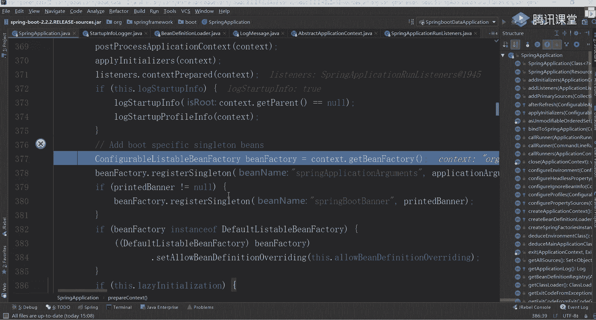

春暖花季满却万里无，还，那曾经有短暂停留，后来。

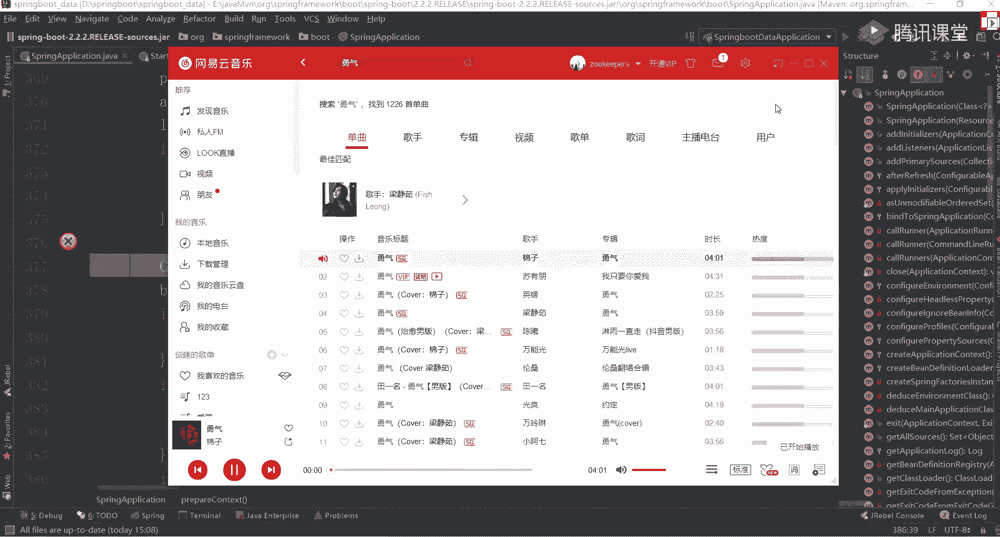

我爱你，无畏人海的拥挤，用尽余生的勇气，只为能靠近你，哪怕1cm，爱上你，是我落下的险棋，不惧岁月的更替，往后的朝夕，无论风雨，是你就足矣，看了太多情人分分合合，爱情是很脆弱，像温室里的话多，你这么说。

我其实很忐忑，若我没有许过承诺，你还爱我吗，听夜空的流星陨落的声音，只愿望让你听，我爱你，无畏人海的拥挤，用尽余生的勇气，只为能靠近你，哪怕1cm，爱上你，是我落下的险棋，不惧岁月的更替，往后的朝夕。

不论风雨，是你就足矣，等你，你这么说，我其实很忐忑，若我没有许雨过承诺，你还爱我吗，听夜空的流星，听我的声音，这愿望让你听，我爱你，无畏人海的拥挤，用尽余生的勇气，只为能靠近你，哪怕1cm，爱上你。

是我落下的险棋，不惧岁月的更替，往后的朝夕，无论风雨是你就足，我爱你，无畏人海的拥挤，用尽余生的勇气，只为能靠近你，哪怕1cm，爱上你，是我落下的险棋，不惧岁月的更替，无论风雨是你就足矣。

it's a degrees like villing down once the brother，we just wanna be free，it，don't feel like the star。

i've been to the radio with that scaas，the moonlight close，no，we don't give a fu，we got a chance。

dragon，i could we gonna do it，because we want to taste pass spine now，we playing by your one，chasi。

see what a cusing iswake you，da new pocket don to the most school with the kings are the same all the lights are pretty with bad boys like d。

we in the club，detta，we just have the blessed the future，so bright we looking at the past。

and we just stin the moment，because it's all of degrees，libili was the bra。

we're just said to be free it，don't feel like this s。

slap into the radio with that so calling the moonlight，close no，we don't give a。

so we gotta change a thing on the mo，hey yall，you look，so good when the songs up。

but i love father should we do when the sun down playing around are you here。

is that sounds turning up the music，when we got a little too，loud turn around a smile。

when she got a pretty，wait，so she writers saw me，dry，i need me some peter light，we gonna take it。

so headed，why she on the phone said，she wants some more keep it on the low low。

i get my feet up on a dead，deep gling，we just have a blast and future，so bright。

we looking at the past here，we just stall in the mind，好了，同学们，咱们开始讲课了啊，呃今天是第三节源码课哇，这节课是第三节，这是第三节呃。

之前如果没听的话，听起来的话可能会稍微有点难受，因为这源码这东西都是连起来讲的，稍微有点难受啊，你可以尝试着去听一下这个东西啊，呃刚刚跟那边那个陈老师沟通了一下，然后源码课呢咱们就看你们的反馈啊。

都不是特别好，大家可能需要很多个消化时间，所以这边计划是下周二，下周四咱们再上两节，保证了五节课的一个源码，基本上面试的时候应该够用了，后面像确认一下源码课，后面会拉补起来啊，大家放心好吧。

呃你们还是一样，把我这几天讲这原版课能够呃掌握了啊，就已经面试，反正几句我觉得应该没问题了，之前听过也难受难受，什么阿联圆满对工作有用吗，给大家说一下源码这东西啊，说实话对工作有用吗。

稍微有一点就是说你在用一些框架的时候，当然是小公司，大公司里面可能有自己封装的框架呃，有时候可能会遇到一些bug，你解决不了，解决不了，然后呢你最好还是有可能需要看一些源码。

有可能需要看一下源码这方面的东西呃，但是常规来说影响不是特别大，但是现在在面试的时候，他为了考验你对应的一个技术深度，往往在面试的时候问源码好，这是很尴尬的一个点是没办法，所以源码这东西还是要学的。

而且源码学完之后，不是说我工作用不到就可以不学了，不是这样的，我不是为了应付面试，我需要源码，就是思想层面的竞技的提高会有很大的一个帮助作用，所以这块我还是希望大家能够把源码能够系统的学一下。

如果你把spring my dis，spring vc，my bt，那个spring boot，这些原本都看完了，你之后其实完全有能力说我自己开发一个开源框架出来，这玩意有可能有有可能的。

关键是你想不想这样做，小连连外部快开始了，什么叫外部快开始了，所以啊源码课我还是希望那个能多看一下，都看完了，感觉成仙了，那不至于好吧，看过原版的人很多啊，不至于都成仙了，呃没没大家想的那么难。

ok只不过源码一直被大家被大家当成一个非常难的东西，所以很少有人去完完全全看一下，他其实看完之后感觉也就那么回事，没有特别难行了，多余的，废话不多说，我们下面来接着讲我们的源码课程呃，下午的时候呢。

然后我们大概讲到哪个地方了，还记得吗，我们是不是开始准备我们对一个呃application contest，是不是这意思啊，我们这现在主要是干嘛的，叫prepare contest。

往我们的上下文环境里面，下文环境里面注入一些属性值，或者做一些参数值，主要这样的一个工作，我们看到这个地方，就是说他已经开始打印我们对应的一个启动日志了，好吧，之前我也给你们看对应的一个控制台了。

这东西我没关，打印了两行对应的一个日志信息，人事情怎么打印的，从哪打印的，输出什么信息，人家信息从哪从哪从哪看出来的，我都带你们看下面看了最下面我们接着往下走，其实下面这一块才是我们整体的一个核心点啊。

和金典上面东西不是说不重要也重要，但是在面试的时候，其实一旦聊到spring bo的spring bot，问更多的人是什么，是自动装配的原理，好这块可问的比较多。

而自动装配就是在我们后面某一个地方实现的，讲到那我再说好吧，我们接下来往下看吧，这块我上下午转向这块啊，这是什么东西，说at a boat specific singleton beans。

添加一个单一的实例对象，或者单一的一个是并并对象，仅此而已，他拿过来一个东西叫get in factory，这是我们的呃，并的工厂类，拿过来之后呢，我们可以往下走。

第二个叫bba regular simon，是不是注册一个单例对象了，注册谁啊，叫spring application arguments，大家还记得这个参数吗，记得吧，这个参数在哪见到过。

在我们之前那个run方法里面，大家是不是见过这个东西，让我们先找一下，找一下我的run方法，在这块儿我是不是弄了一个东西哪儿去了，叫application arguments吧。

是不是指的是我们命令行里面输入进去的一些参数值，是不是在这儿好吧，所以你看完之后，你会发现这终于把它给输进去了，嗯哪嗯哪去了，就这是不是把它给注册进去了，spaction arguments。

就把这个对象放进去，完事了，别东西不用管它，而再往下看，三玩家是什么，if print banner不等于空，我们现在等于空吗，下午是不是已经打印出来我们对应ban的一个对象了，所以这直接往下走。

不等于空，所以马上走，告诉说我把这个banner的一个打印对象也放到我们当前这个bin factor里面，大家还记得这东西吗，我下午带你们开箱的时候，大概看了一下那样的一个目录结构。

我不知道大家还记得没往后翻看哪个对象哪去了，呃，找一下啊，看不到看不到，我们一起来看一下吧，之前下午的时候我带你们见过这个对象，我们之前看了一个类叫什么，annotation。

i know tension confithweb，thority contest吧，是不是给大家看这样一类，在当前这个类里面，我带你们看一下它整体的一个类图，也就是说它整体的一个继承关系。

应该还记得吧，放大一点儿来，我们来看吧，这块是不是看了最下面那个类，然后我带你们依次看了整体的一个继承关系，到这块的时候，这块的时候我是说这里面帮我们完成了很多特殊的工作。

在这个abstract contest里面，我们可以再搜一下呃，找一下那个类啊，找寄生关系，走点它，点开它，点我们的strat，在这个里面我们可以找对应的一个构造方法，找一下，是这样吗。

不是这不是这样的话，就是在哪儿啊，我找一下在这里面吗，看这这是不是new了一个对象，叫this been factory，等于什么呢，等于你一个default libban factory。

看到对象了吗，这是不是已经帮我完成整体的一个创建工作了，所以刚刚我们在我们的spring application这个类里面，你是不是能看到对应的一个代码的实现了，这东西哪来的，是不是这个bfy。

所以你要判断一下当前pfc是否归属于这样的一个工厂类，如果归属于的话，是不是该接着往下走了，把走吧，然后大家走之后，往往后然后往里面写。

这个我们学校set allow being definition override，是告诉你说我是否允许一个纯写，这里面就是一个参数值，默认是什么false吧，这是一个false值。

就这直接把它给注进来，就是不允许你进行一个重新工作，直接步骤完成一个事情能看得懂吧，所以我说了，你在看什么动源码的时候，如果你对spring源码有一个清楚认知的话，你看起来可能会舒服一点。

如果spring源码之前没怎么看过，现在看起来可能有点难受，有点难受，但没关系，你先把这些关键的类给记住了之后，再看的时候也会轻松很多，这边我说下午有课有啊，呃大家注意啊，那个群你们不要去屏蔽他。

当然有些同学可能会在里面，我们吹一下水，或者说扯一下别的这些东西，最好把群打开，因为经常会发一些群公告，呃，上周二的时候，因为我们做活动做活动，所以呢那个夏洛克没拿上，所以今天下午我们补了一下课。

基本上啊咱们所有课程保证每周三节，你们最起码有的听，我最起码有c现在上课前几分钟才通知婴儿之前通知的吧，很早之前就发过群公告，你可以翻一下，每周我看看公告，对看一下公告啊，每周三节基本上是这样的啊。

保证你们最起码这一周有的学也没事干，多不好啊，是不是这意思啊，所以之前就算有，如果我们个人有一些特殊情况，可能会比如有什么想法，上不上课了之后，也会再抽时间给大家补补回来，是不会的，大家放心啊。

这个是大家发现啊，ok啊这块我就不再解释了，我们先往下看啊，接着往下看啊，多留意一下这个群，周五的时候可以问下班主老师，这周末会补什么课，行吧，好了不多聊了，来再往下看，但判断完之后再往下做一件事。

你要this。lazy slide吧，是不是否会进行一个烂加载，这块没做任何设置的话，会直接跳过去啊，这个不用管它了，再来看叫source。get or sources。

这个get sources是干嘛的，是获取一下我当前所有存在的一些资源值，对我们可以点到这个方法里面看一下再完成什么事，首先创建一个哈希set不用说了吧，另一个哈希set完成判断是否对值等于空。

然后呢往里边添加一下，再判断一下这个source值是不等于空，往里面添加，最后把它变成一个集合，所以当这个操作完成之后，你会发现了里面是不是只有一个source的一个对象，对象是谁啊，一样点开看一下。

找一下我们的source谁是我们之前定义好那个primary source的，在进行spring application这个类实例化的时候，我们是做了这样一件事，把当前这一类给它给加载进来。

就这样判断一下这个值，这个值如果等于空的话，那后面就没法加载，没有加载这个必要了，在这儿要把这个值对象拿过来，拿过来之后再往下走，是什么呢，是我们漏的这个方法，这个方法我希望所有人能够重点关注一下。

为什么，因为在这个方法的里面，其实就在我们漏方法里面讲了，来看一下这个方法吧，你把这个点你能做一件事情，不要他点进去，看这儿做了一个什么样的一个判断，你看能不能认识第一个logo的意思。

debug enable是否允许debug，不管他好吧，第二个说创建一个bean definition loader，是不是相当于一个类的一个加那个注册器或者加载器，这东西好，这块其实你不用管它。

你直接跳过就行，想看的话，把里面看一下，里面的一个代码实现是不是就了一个bin，在分析上loader一个对象，别的东西没闪了，别的东西没啥了，看完之后，这已经漏的都像有了，再往下接着走。

找这是不是最后挨个的一个判断，判断完之后，这还有一个load。load的方法，你点开这个load方法，这是一个循环，因为我们的主类有且仅有一个就是我们的spring data application。

所以这里面也只有一个值，再点我们的load跳到下面了吧，跳下来之后，你看这段代码你能不能做一个亲子认知，这块是干嘛的，他说了，如果你当前的source资源是一个类的话，我会加载类的漏的。

如果我是一个resource配置文件的话，会加载配置文件的一个l的方法，如果你是一个字符串的话，会使用字符串方法，这是不是帮我们做了一个判断，你想一下你每次启动的时候。

是不是需要在spring boot的主程序里面添加一个叫什么，还记得吗，只要看一下这里是什么spring boot vacation吗，是不是有这样的一个注解值对吧，这个值会直接加进来。

我们这儿很明显看到它属于什么class吧，是属于某一个类对吧，再往下走，属于类吗，属于吧，然后点到我们这个logo方案里面去，在这个漏方案里面，它提供了几种加载文件的方式，第一种叫gala。

我不知道读对不对啊，反正你知道这种方式行了，这个方式你们之前有没有见过，会有印象吗，有没有见过这东西，在spring boss原版里面，我带你们看的时候，有没有见过这个东西，没有很多同学一点印象都没有。

我给大家说一下啊，之前讲的每一句话不能说都有用，但大部分是有用的，我不会白带你看一些乱七八糟东西，好吧，我会带你看一些有用的东西，什么东西，你点开一个类叫spring publication。

我们看一下当前这个类，在这个类的最上面往上翻，往上翻，乱七八糟是吧，呵呵呵，他错了，这个类是用来干嘛的好吧，是引导我们当前这个程序来进行一个启动，在启动的时候告诉你说你要进行如下几个步骤。

我找一下哪去了，没有了吗，没有啊，但是你们看过这东西，我记得看不懂啊，使劲跟了，再找一下他这个ps，看看以下这些步骤吧，他说创建一个这样的实力，register，他register slebean。

这儿怎么没有了，没有了吧，不可能这ho o没看到了吗，就说我们在我们在读取对应配置的时候再告诉你了，你会有几种方式，第一种是什么方式是不加这样一个antreader的东西。

第二个时候你可以使用一个插板文件好吧，或者使用一个什么呢，叫grava的一个脚本，是动态一个脚本对吧，但所以我说过了，你看源码的时候，不要只看这些东西，最好有注释的地方，把注释也稍微看一下。

这里面其实都有一个提示，通过这其实我们也可以验证回来要发生什么事，我们现在有吗，没有吧，没有的话，那这个东西按道理说是应该跳过去的，对不对，就跳过去来往下跳跳，跳在一块吧，这事没执行，你没配吗。

所以脚本压根不会执行，是不是跟我刚开始定义那段或者他写的注释比配上了吧，就这块一定要做一个前后前后关联，你发现了啊，我在讲个代码的时候，我一提到前面的东西听过吗，没听过，一找肯定能找到，把肯定要找到。

所以这块大家注意了呃，讲spring boot启动的时候，先把spring ioc讲一遍，我不讲这些东西，因为之前那个spring源码已经讲过了，所以就没讲啊，所以就没讲嗯。

这个你们回去翻spring源码好吧，来往来看，现在这一步之后，这有一个非常非常关键的方法，叫is component，is component不认识，但component认识了之前。

我们想要把某一个类变成一个呃，spring contest里面的一个对象的话，是不是要加一个标签叫component对吧，你可以看一下当前里面这个方法他做了一件什么事情。

你可以看一下叫merge annotations，点from type，然后这有一个四是storage，什么type，什么东西不认识不认识后的is part叫onent class。

这个come on的class是个什么玩意儿是啥，是不是我们定义好的那个注解，所以它会扫描当前你的注解，这个组件到底是否存在，存在的话才能把当前对象注入进来，如果不存在的话，你是不是入不进来。

就这数我传过来tab是谁，是不是告诉你是spring boot data ti这类，你找他之后没满没完，是不是验证一下，知道了，spring obligation，c tm刀就跳出来了。

跳了跳出来我们没关系，二三你看这一类这一类的上面啊，不是这类啊，是我们自己的类啊，不是这类，你看这类这类上面有这个组件吗，没有没关系，你往里边点，点击之后，你发现上面也没有cm的组件，你再往里边点。

这是不是也没有好吧，你再往里边点，你点到这个configuration的时候，你往这儿看这儿有没有一个component的东西，有了吗，有了吧，它里面是不是存在着一个继承关系，这都看明白了。

这样如果看明白了，你再回过头来看一下，刚刚我们指定好这个参数叫测试什么搜索的一个策略吧，这个策略里面它是一个枚举类，好在大家媒体里面有什么有direct直接的，他们的第二个叫什么东西。

他说found or directory decare，the notation，as well，as any叫super class annotation，所以它会有一个竞争关系。

所以当前这个注解它也会被扫描到，所以此时你告诉我，刚刚我们定义好这个主程序类能不能进行一个配对象，一个注入，懂了吗，懂了吧，那这个值判的国家之一是处的吧，你往下走是不是也能触。

触完了之后直接把那些方法返回return tru了之后，这是干嘛了，只是告诉你说当前启动类我能够用了，但对象并没有进行一个注册功能，所以到下面这之后我才开始整体的一个register的一个注册，往哪走。

就在b然后reacer往那边走，走完之后下面有一堆的逻辑判断，这里面更麻烦啊，这样更麻烦那个东西我们看我，我想带你们看一下，简单看一下啊，我们不详细看了，这块儿，你看一下上面的名称干嘛的。

叫注册一个b从给定的一class里面好吧，devt emt data from class，从他指定好的，你们类里面的一个注解里面把它的一些原数据给分解出来，这个方法你就不用往下看，我们往下走走走走。

就是这些数据处理啊，不用管它走道往下走走走走，这块儿这儿有个非常关键话，叫什么叫ban definition reer，you too，点register什么是不是叫being definition。

是不是还是我们这hola holder，你往这边走的话，你能看到一个东西是叫get definition的一个get be name，获取个名称吧，来看名称是谁。

是不是spring boot data application，有有名称吗，还有对应的一个类对象，这有了名称之后，我把这个名称和当前对应，这个类都加进去，我才能把它给注册成功，这才是完成注册成功。

这个功能除此之外，除了这点之外，还有什么东西叫definition holder，点get allax，你是不是也可以给我们当前这个病对象来设置一些别名，这个别名同样也会完成整体的一个注册功能。

所以刚刚那个步骤到底完成了一件什么事，你告诉我往往一反往下翻，往下翻往下翻，没有了高低落的完成后完成干嘛了，注册变吧，你说清楚注册是谁，注册的是谁。

注意是我们当前这个spring bolication里面那个主要的那个启动应用程序，启动类要把这个程序启动好，是不是也在我们的contest里面完成的，听完了吧好吧。

这个时候你整个的逻辑线有没有理清楚一点，来听明白的同学扣个一，所以啊你把它一层一层往里面找，你会找到你自己认识的东西，当你找到自己认识的东西，告诉我哦，原来是这么回事，心里很舒服了吧，是不是这意思。

往这儿一定要注意了，ok这个操作完成了之后，当然我这个东西先讲这么多之后啊，还有很多其他的一些组件，我们到时候再聊啊，一会再收他，一会再说，他这样完成之后又到哪了，叫listeners。

第二contest loader，又看到这个方法了，每次看到listen的测试走，应该有一个条件反射，我之前见过n多次这东西了，之前最起码见过三次，是不是还是用来注册我们对应的一个监听器，触发某些事件。

只不过每次的事件是不是都不一样对吧，来往这边点一下，看这是不是又开始循环了，这个类似，那是谁，只有一个吧，叫event publish run listener。

整个我说过整个启动环节里面有且仅有的一个对应监听器的一类，填完之后把这边走，然后呢叫contest loader，点进去，点完之后，这时候又开始叫get listeners了。

application listeners开始获取我们当前这个监听器往哪走，判断一下它是否是这样一个类型，如果是的话，做做做下面那个判断，如果不是的话，就不做下面判断吧，往这边走这个循环，把循环走完。

两打断点吧，这其实就是过程里面就是一个筛选的过程啊，就是一个筛选的过程，这块你可以不用管它，就判断一个类型是不是这个obligation where的这个application confist river。

有人见过吗，在spring时候见过没见过同学回去看spring源码，老师之前也讲过这个东西，它是一个扩展接口吧，是不是一个非常重要的可扩展接口，你看到这些偶尔的时候都是扩展接口，好回头自己看。

回头自己看，我们只说了最终答案之后，是不是又进到这个方案里面去了，此时他这个疑问的事件变成啥了，叫application prepared的疑问啊，之前是不是见过三个event了，还记得吗。

该交哪些事件，不记得，没关系，回去看原版的时候，把这个事件给我记下来，给我记下来，这样记下来之后，我知道了当前是第四个事件，有了第四个事件之后，我要干什么事儿，是不是还是要过滤我们计算器哪些东西匹配。

我们对这些规则来往这走，哎呀好吧，直接跳过去了，找兄弟打打的呀，兄弟打兄弟打兄弟麻烦，有多少行，94行，然后删掉删掉重新启动啊，什么启动啊，刚刚直接跳过去了，不好意思，好到这儿了。

这是一个news 16的对象，你不管它不管它，再点知道了吧，再点，然后呢，这样往里边走点，它是不是又到这张方程的方法里面去了，怎么做的，往里面挨个进行处理，先获取到我们所有的这个listeners。

往这边走，这边是不是依次就是一个基本的判断，二哥走了走了走走走，这块是不是要进行返回了，点进去往下走走走走，走到这块是不是要进行一个判断了，叫sport event。

判断一下我当前到底是否支持我们当前这个environment这东西吧，来开始循环走走加进去判断是多少级判断，大家看看是不是有n个条件的一个逻辑判断，当你把当前这个逻辑判断弄完之后，是一共有11个。

最终会剩下几个符合我们对应需求的，来看看这个吧，一共几个五个吧，怎么做条件判断呢，这个具体规则你下来之后自己看自己看，我之前在给大家看过很多次了，我们这我不带大家看了，你知道还剩下五个吧。

有了五个之后往回翻转回来，知道吧，是不是从这五个里面挨个取出来，第一个the cloud funny是什么东西，一看到是一个云平台，我们这儿没有支持往这边走，invoke走走走。

点进去是不是只带一个日志变动，没有吗，没有吧，没有不用管它了啊，这相当于这个事件是什么都没做好，没做完之后再老板第二个叫config file application是什么东西。

你看到这个config fail之后，你是不是有点熟悉了，他干嘛的，是不是还是一样加载我们队的一个配置文件的，是配置文件的，所以你往里边走一下试试啊，往下走点进去点进去点进去再说。

一般一次次of o这个东西匹配吗，不匹配吧，好再往下走，这时匹配匹马再往那边点点进去，这是干嘛呢，叫this love to switch to，告诉你说这个log东西。

你看log先不管是不是就是日志的一个输出，这个输出再来看at post processor，这里面是不是开始往里面添加我们的post processor，对吧，加什么东西点进去，这返回一个具体的一个值。

connect，不管它填进去，知道吧，叫contest点，at being factory post process。

你有一个什么对象叫property source ordering post processor，此时你看到当前对象之后，我应该知道这件事了，知道什么事。

我把我当前的这个contest里面注册了一个什么叫并factory post processor，而这些并不是说不在干嘛，会对我们之后所有要存储的这些资源进行一个什么操作，叫orderly吗。

是不是oor排序吗，好完成一个基本的排序功能，所以这块就它一个基本功能完成之后，往回返往回返往回返往回返，烦烦是不是，当然了，再按下一个是什么叫logan application干嘛的。

这时候我们要看一下这个logo啊，我们之前用过很多次了，完成初始化系统，初始化认知系统，战时又用到了点，点进去点进去连续，这要判断了吧，判断哪个走走，这是不是能进来连续走，这边也说了，当前配对象。

叫spring boot login system，是不是有这样的一个认知系统走，是不是进来了，我进来之后往里面注册一个什么，就是把它注册到我们的bin fire里面，也是一个实例对象的。

这个都是一样的，只是完成初始化，完成了复制操作，但是你并没有构建整个对象出来，而此时是不是开始构建对象了，我们的不是，并且是不是把我们的contest里面是不是该进入进入了都有拿走走走啊。

这是一个logo，是日志组的东西，不管它了好吧，也是往里面注册对象，知道就行了好了，这做完了，做完之后往回返没有了吧，这是日志这东西要做的操作，再往下看叫bat ground的什么东西。

之前我们看到的所有bound几乎都没做什么事，什么都没做吧，那这是不是也一样呢，点进去点进去点进去走走，看这两个是不是都跳过去了，不太满足条件吗，跳过去不管它是再往回翻，在这最后一个叫dk什么东西好吧。

这个东西之前是不是也没做，是不是也没啥用处，没用处也是一样的，点进去看一下走走走，我判断判断都不符合规则吧，往回返好了，做完了，做完之后里面还有吗，没了吧，我说过了，一共只有五个，所以这个做完之后。

这工作就算是完成了，还是我们监听我们对应的一个事件吧，这里面就是监听是什么事件，第一个给我们的property source进行一个排序的功能。

第二个来把我们的日志系统的一个b对象注册到我们的content里面去，下坡多都没做了，对就完成最基本这样一个功能往回返吧，反反这还有吗，没了吧，就一个对象吧，走当然是完成了，到达完成之后。

我们整个prepare compass这个操作就算是结束了，好来回顾一下在这里面我们到底做了哪些最基本的一个工作呀，啊做哪些基本工作，想一下能想到吗，这个paper contest里面回顾一下。

第一我刚刚是不是只是创建好了一个实例化的一个contest对象，但是里面并没有进行参数值的一个复制，参数值一个创建，所以现在我要往里面复制某些具体的参数，复制这些具体参数值的时候。

你注意一定要看它对应的一个父子之间的一个依赖关系，因为它是根据我们的依赖关系里面添加了很多其他的一些属性，如果你不看的话，你会感觉到很懵，我就感到很懵，然后做完之后也是一样的，这里面还做什么事了。

再想到有什么事了，这就是设置一下对应的一个环境值好吧，设置一个post processor啊，做一些post processor的创建工作，这工作把这做完之后，别的东西有没有别的东西没有了。

所以这个环节准备也不是特别难，也特别难，这块一样的下去之后自己跟一下源码，看一看里面到底做了什么样的一个事情，但你要知道它最基本功能是干嘛的，是不是准备我们的上下文环境好，这块认识到就行了。

人造完之后来再接着往下走，这块来能听懂的同学能跟上，同学扣个一能跟上吗，记住我说那句话，你在旅的时候自己别乱了，之前看到过的东西跟现在看的东西，你要放一块做对比，放下做对比，这对比什么意思。

别之前看过啥都忘了，一点印象都没有，这不对，这样的话你看看他什么时候你都一脸懵，发展完了之后get到这个东西叫reflash contest，这步骤，这个步骤是一个非常非常麻烦的一个基本操作。

看里面都什么事儿吧，你往这边点，点完之后叫free flash contest对吧，再往里边点往下走，点点完之后是不是super好，再往下点，像这块了吧，这是完成了一个最基本的一个初始化工作。

他在哪个类里面，abstract application，然后呢contest吧，还记得这个类吗，记得吧，当时我为什么要带你看这样的一个关系图，那个annotation呢就没了。

bo pei t a t i n。

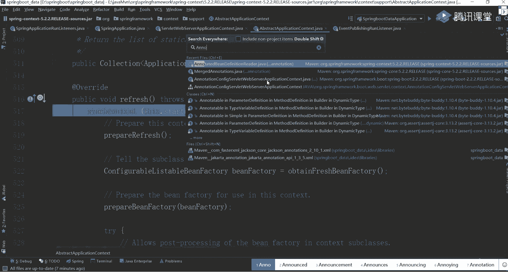

这类里面我带你们看了一个整体的类图，在类图集中关系里面是不是有个东西叫abstract obligation contest，是不是在这儿，你刚看到这个类，这一样吗。

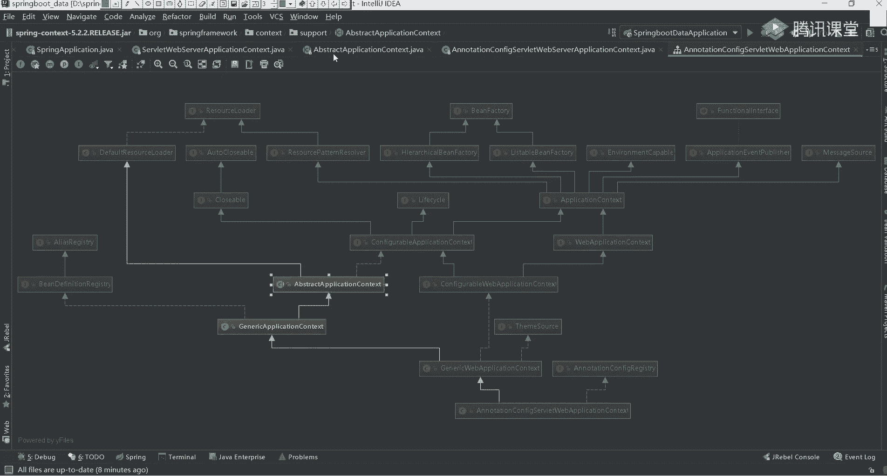

是不是一模一样，看的就是这一类，在这个类里面有一个reflash的一个操作啊，reflash作，而reflash其实这块东西属于谁，属于spring里面的东西，而不属于我们的spring boot。

spring是要进行reflash的操作，还记得吗，这个spring里面reflash操作，知道同学来扣个一，知道同学扣二，知道吧，这也不知道啊，当时当时讲原版的话，应该跟你说这东西这么多，不知道的。

这这这没法带大家看啊，这个没法大家看看的话太多了，王师傅说过是吧，自己没看过是吧，你其实没关系，没看我们我们粗略的看一下，粗略的看一下，粗略看一下好吧，看见没完成什么功能，然后来看第一个叫cper。

this contest foreflesh，啥意思，你看注释，你讲过什么源，什么源码吗，没有没讲过没讲过没讲过啊，讲spring bot源码没加过sp源码，外面看进来之后再做一件事情。

prepare reflash是准备我们进行上下文环境的一个刷新工作，来往里面看，我们看一下他做了什么事，我们这边点一下，点一下看，知道了好吧，点进去。

然后他告诉你说this scanner叫clear tch，这个scanner还记得是干嘛的吗，有没有同学记得这个词，刚那是啥，我们当时在创建这个annotation config server。

web server，application tnt的时候，是不是定一个实例化对象，小老师，反正初始化工作是不是扫描一下上下这个东西，我之前讲过这个东西了，好吧，你要骂的话怎么办，还是一样。

看这个类里面找一下构造方法，这边有个sca sa里面是不是指定好了，干嘛的，叫ca new呃，不是这这找一个方法，看这个方法他是干嘛的，他说了，定义了一个ban好吧，能够sky scanner。

我们当前那个什么，我们这个路径里面的所有的一些组件进行一个扫描工作，就这个就这个这个类来完成的，这第一步是完成这样的操作，往回返啊，把它这个缓存给清空掉。

清掉之后一样也是掉到负类里面的prepareflash，做什么事，第一个switch多unity记录一下当前的一个时间，把close给关掉，把xt 5给设置成开启，让它定型认知的一个输出吧。

这块不用管它好吧，再来看叫it property source是干嘛的，init初始化吧，pissource professor s熟吗，是不是看过很多psse的东西了。

就完成了我们这些provisource的一个初始化功能也是一样的，判断一下当前的环境是啥，然后呢如果是他的话，进行一个初始化工作里面是不是依次往里面点，还记得吗，还记得同学扣个一几个。

还有没有一点印象啊，没印象啊，是不是一共有具体的四个，刚开始是四个吧，刚开始不是四个，四个了之后我是不是加了一个东西叫什么叫configuration呃，叫什么礼貌的configuration。

还记得吧对吧，后面加一个什么，加一个runner吧，对不对，后来又加了一个什么，是不是加了一个，然后点一记得吗，看一下property source 17个吗，看这convation propose。

然后呢server的两个，server system的两个，然后加上我们的random，加上我们的obligation，改羊毛这几个对吧，记住记住记住一定要记得一定要记得，别忘了你还没讲完就忘了他叫。

所以我说了啊，你们你们为什么看源码的时候看不下来，原因在这儿，很多同学看完我前面讲的源码了，我看完自己之前看的东西了，看完就忘这东西，我感觉跟新东西一样不对，一定要产生一个前后关联。

前后关联连续初始化工作，你遇到什么东西，get a proper s干嘛的，就是一个初始化啊，就是一个初始化这块我不往这边看了，再看就没头了，不往这边看了，你知道它完成一个什么事儿就行了啊。

这完成什么事就是一个初始化工作吧，发完之后，这是什么东西，叫get environment where when it required properties，这是干嘛的，你怎么做到，看了不忘。

看多了就看的不忘了，哈哈哈哈哈，怎么做到的，你要有点印象啊，有点印象，具体类别我也记不住，但大概大致东西我会记得好吧，我来看看这个函数干嘛的，叫获取环境，并且进行一个验证必备的一些属性值吧。

是不是就是验证操作，你把这个点它有一个具体时间内看哪个看吧，往里面进行一个验证就行了，我们这不往里面看了，就是干嘛，这边就是一个环境验证验证的一个东西，好吧，就是验证东西啊。

验证完了之后来再往下看在干嘛，是不是，this radification listeners等于空等级，功率值没负过值吗，等级空进来之后，把刚刚那个p里面类似的是不是给他复过去，创建一个集合。

上下集合之后往下走，找this early等于什么，new一个list是不是把它给放进去就行了，创建一个新的对象，仅此而已啊，别动西没有了，然后返回啊，然后返回就是刚刚那个初始化的工作。

是不是准备了一些基本的环境，就是配置文件，你去操作啊。

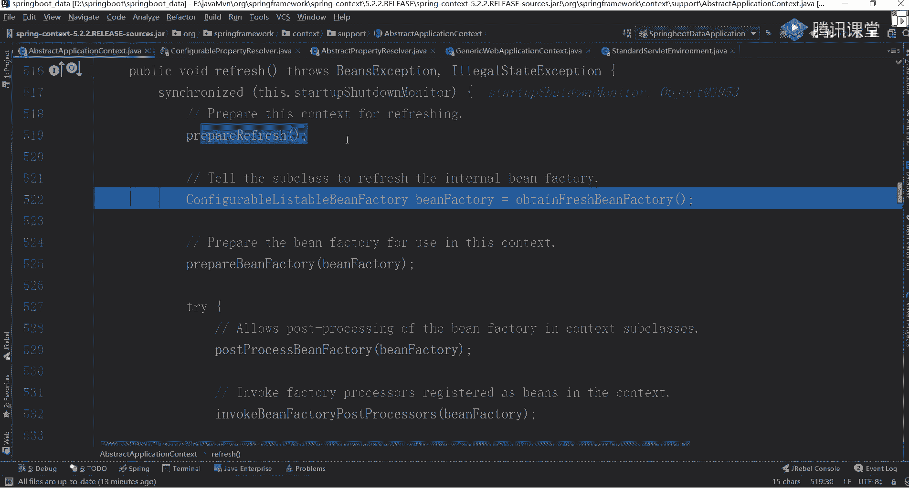

这只注意就行了，这块如果你实在不知道的话，没关系，我说我之前给你写过笔记啊，我进来了，reflash，这看完了，刷新上下文环境，初始化上下文环境好吧，对系统的环境变量后，系统属性进行准备和校验。

现在这句话看明白了吗，你看完原片之后，你再看这句话是不是会好很多，大家知道哦，里面比方说这样一些功能，这样一些功能，这样先先记着先记着先记记完之后来往下看。

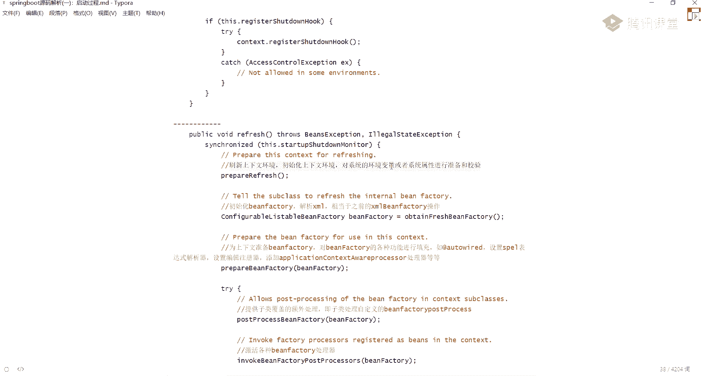

这个操作叫tsub subclass to reflect，the internal being factory是干嘛的，什么叫internal bin factory，也因他的病，我告诉大家。

你如果去实际的那里面找的话，你压根找不到这些东西，但是在我们debug这个环境里面，它确实存在着一些这样的值，找一下我给你找一下，找一下你就知道了，being factory in it。

being fpx，在这吧，看这这是一些值，叫o r g spring contest，什么internal confire，什么东西，internet什么东西，什么东西，是不是很多这样的值。

虽然不知道这个是干嘛的，没关系，我们搜一下，看能把这只给搜到，叫internet i n，t e r t e r，然后呢叫n a l config，哎g u r a还用搜吗，没有吧，注意了。

这些类值你是不存在的，是不存在的，刚才干嘛，他只是指定了具体的一个路径，路径之后，或者一个完全性的名，根据完全性的名，它其实起的是一个名称，这个名称我们能找到具体的一个实例类，相当于把那个类换了个名字。

而名字起的这样一个名称，仅此而已，这东西啊我后面呃讲自动装配的时候，我会带你们看一个，看那些东西的时候，你就知道怎么回事了啊，先留个印象，然后点进去看一下吧，做什么事。

注意flash bin factory往这边点咋判断，for这是false是吧，进不去，然后呢叫set serii d是创建一个虚拟化的一个id值，往这边走，返回一个id，不须先搞定这东西就没有了。

然后呢return一个get in factory返回当前并factory对象叫default liable decenter是吧，还是当前这个值，这是没变化的，当时下午讲课的时候。

为什么给你强调这个类别，在这后面你在很多地方都能看到这东西，能看这个东西，就这个对象再往下走，叫奎特定范，不是告诉你说我获取到了一个并派人，现在呢是不是要进行一些准备工作了，好吧，来往里面看这个类是谁。

是不是还是default lizable，being factory啊，还是当成是对象，好吧，你玩个点进去就完成了一些出场动作。

set being class logo that being expression reserver，是不是表达式的一些操作操作，再来看at poverty editor，register，往下走。

at being什么东西，ignore什么什么东西，是不是忽略，告诉你说我忽略这些依赖的一些接口忽略，然后再往下走，就是往里面注册一些处理的一些器，处理器，一些依赖关系，慢慢走。

正常走是不是稍微判断一下，大概那个类似是哪个类型，走走都是一些判断，所以说大家看到了，我就是把我们当前这个bean fighter里面好，be fter里面给它做一些参数的设置。

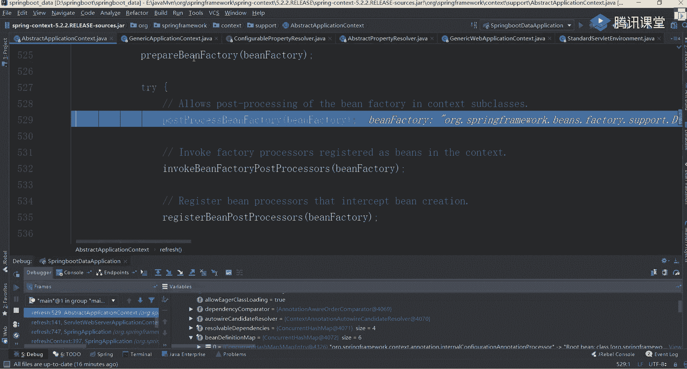

是不是这意思，我注意下行了，刚刚我这边也写了，对been factory各种功能进行填充，not wear specific，这个这个s p e l表达式是编辑支出注册器添加带着五二的pos pos点。

这样一个处理器等东西属性值啊，没必要挨个看你大概理解什么意思就行了。

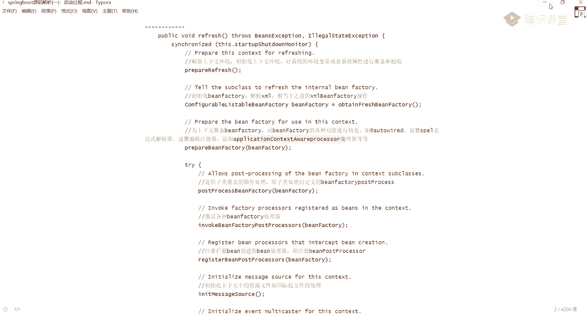

大概什么意思，再来看叫post processor，being factory，就是一个跟ftory allow post processing of the big fatory in contact supply supper plus。

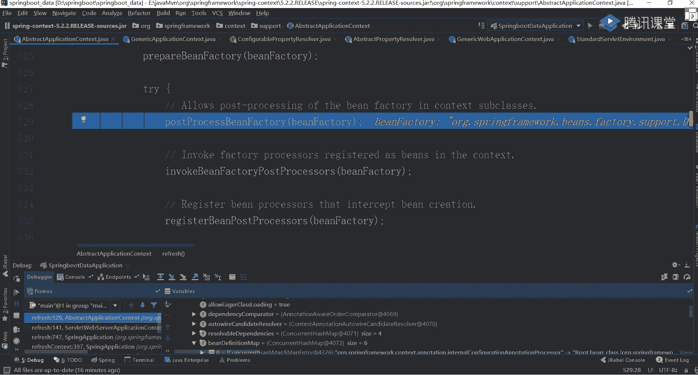

还是为此类添加一些具体的功能，写了吧。

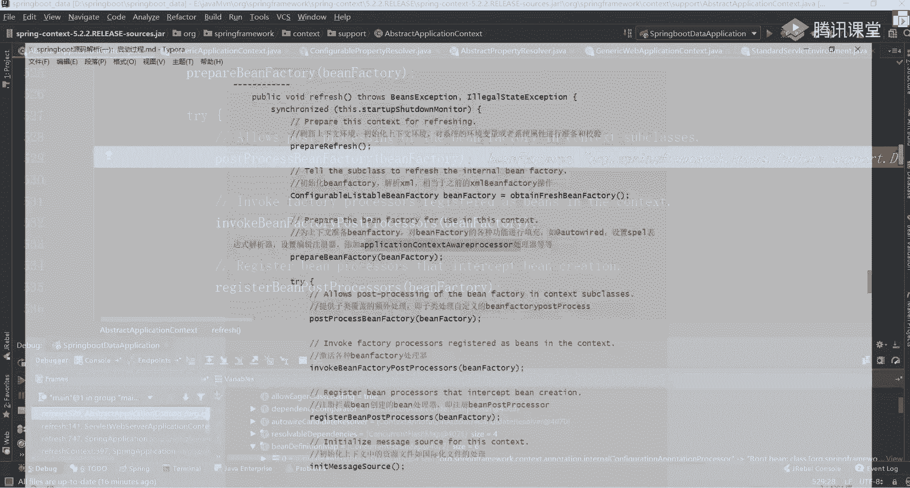

提供子类覆盖的结构外处理及此类处理自定义的the factory personal processor，就这个功能啊。

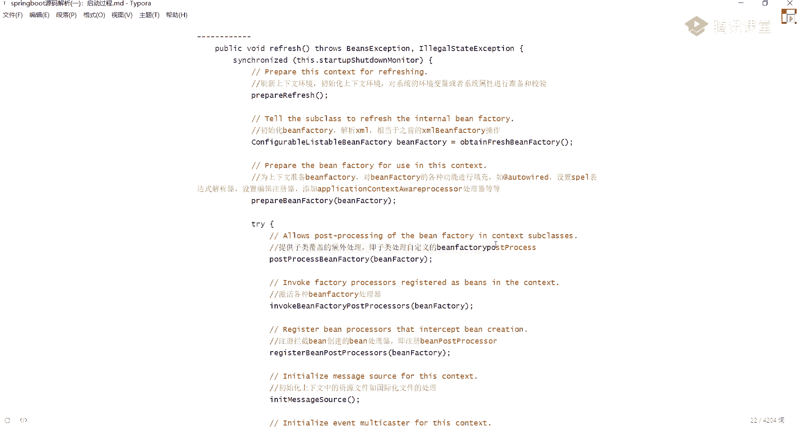

再往下看，这东西叫invoke，being factory post processor，invoke是什么意思，表示执行处理的一个环节吧，好而我们注意了，我们后面再看的时候，很多字装备的类。

它在完成这个初始化这个对象工作的时候，其实就在这个步骤里面完成的这块，我希望大家把这个方法给我记住，现在我不带你们看，有时候讲自动装配的时候，我会带你们详细把这个流程再看一下，你就知道原来是这么回事啊。

其实就是一个解析配置的环节啊，解析配置的环节，再来看这干嘛的，叫register，然后呢being processor that interrupt，being creation。

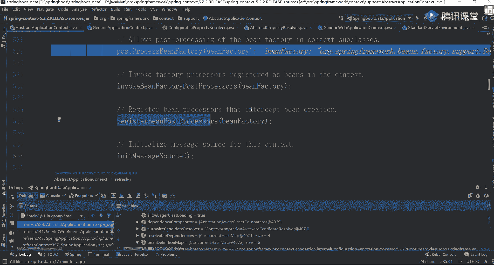

这句话翻译过怎么翻译，看不懂没关系，我这写了刚刚写叫注册拦截并创建的并处理器，好吧，及注册b post processor，再往下初始商家文环境的资源文件，如国际化的一个处理。

再来看初始化上下文环境广播事件，再来看为了子类扩展，初始化其他的一些病，那就要为所有在所有的病中查找listener b，然后呢注册的广播器中，最后完成是初始化剩余的非懒惰性的一些病。

及初始化非延时下载的并对象，最后一个完成刷新过程过程，这个步骤啊里面东西很很很复杂。

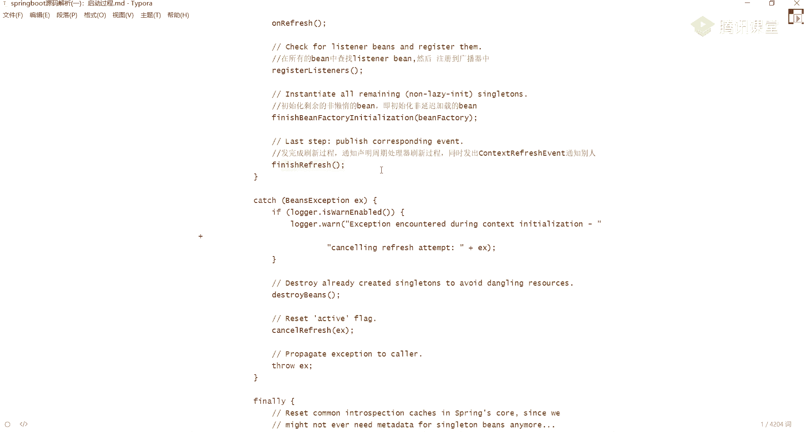

在你们挨个往里边看，但你要知道这个方法里面起了一个至关重要的作用，而我们之后再看的时候，这些auto comparable。

那个叫auto configuration的一些病对象都是通过这个方法注册进来的，什么时候注册的，一会这个方法我会带你们进去好好看看，进去好好看看，这其他方法我就跳过就不看了啊，谁如果不清楚的话。

你上网搜一下，一搜spring contest，一搜搜出spring contest，然后加一个reflash，一堆解释啊，里面有很多页码来解释，下一周自己看行吧，哇这块不担心牌子看了，这太浪费时间了。

咱毕竟不是讲spring东西啊，你看了这些过程可能要花一点时间，他不是说立马就往下走了，是不是需要到执行时间啊，所以这块比较关键，这个步骤往下走，走走走走走，回来走。

走完之后叫register shudha，shutdown hook吧，这干嘛的，一个关闭结束的一个钩子吧，这钩子非常简单，判断一下这个值是否等于空，现在是不是执行完了，执行完之后读close。

执行close方法，好东西啊，很简单，好往回翻吧，这执行完之后，这就完成了，一会我们再详细一会再详细看看东西，boss还没学全，我是不是可以撤了呃现在撤的话之后也一样，看不懂这个东西啊。

不在于说你spring boot会不会用，跟你会不会用半毛钱关系都没有，关键是你要对整个体系结构有一个认知，这时候你再看就好，就舒服很多了，明白意思吧，硬着头皮去听，这是一个很好的方式。

因为你现在听起来可能不知道我在说什么，是当你把某些基础知识的一个储备，如果具备上来了，你再回过头来看我说这句话的时候，你知道哦，原来老师想表达这个意思，听明白了吗，它是需要一些基础知识知识的。

特别是原版里面的东西，我相信啊，咱们班现在听的人有80多个吧，你告诉我有几个人能完完全全跟下来，其实比较难，其实比较难，所以希望大家能够认真去跟一下，认真去跟一下我，我觉得很少有人能把它跟下来啊。

多听两遍，然后多搜一些基础知识，你慢慢就知道了，一说实话我不可能说我在讲一个存储源码，我把前面很多系统知识再从头给你讲一遍，可能你那个力量没听过，ok记下来，下课之后搜资料，搜完资料之后回过头再看。

懂我意思吧，慢慢去补充，慢慢去扩充，这样的话你就理解是什么意思了，如果你现在，如果你现在一次都没听过，你第一次听的时候，你依然还是会有一种感受是吗，我这种又是全新的懂我意思吧，多听几遍。

你会发现还是不懂，哈哈哈，不可能好吧，多听几遍不可能不懂的，不懂不懂啊，27真可怜，可怜啥呀，跟大家说一下sn bot原码本来是没打算讲的，是因为在那个9年前就12月份的时候。

很多学生他说老师我在面试的时候问到spp的源码了，你来给我说一下这东西吧，我来讲一下吧，我们先把这个规划的课程里面懂我意思吧，来只讲所谓木头源码，有画十个图吗，一会我就画一个整体框架图，我之前尝试画过。

但是这里面比较恶心，比较恶心，为什么叫恶心，比如说spring application这个类，你往下翻一下就有上千行，这是来回进行调转的一个过程，所以你画完视图之后。

这线勾的真的是真的是那个什么就是乱七八糟的，你看到视图，你画你画你画不清楚，你懂我意思吧，你看看我之前画过，真的是给你画过，我想过各种方式把东西给你画出来，但是真的是透不透，你知道吗，好吧。

你先你先你你先听你先听好吧，你先听完感一类的对，就是这个类来回调，调过来之后又回过来了，调完之后又回过来了，你会发现这个东西很乱，太乱了，没法画，这没法画啊，还是要搞清楚类图对，这是为什么。

我在讲原版的时候，带你们看了很多类似原因，它有一个继承关系，啊没事没事呃，我也没指望你们一定能听懂啊，一边听懂，我感觉就是也不太现实，就慢慢听就行了。

ok刚刚是完成了我们这个contest的一个刷新功能，刷新功能刷新完了之后，下面还有什么问题叫after reflash，是啥意思啊，什么意思，什么叫after reflash，就说你刷新完了之后。

他又完成一件事，但是你往里边走的时候，你会发现这里面什么都没做好啊，这个功能是干嘛的，是为了我们不是在发现啊，是为了完成我们具体的一些扩展功能的好，他说了。

called after the contest has been refreshed，当你刷新完成之后，我会做一些后期处理，它里面什么都没写，如果你需要填充一些基本功能的时候。

你可以把这个代码里面补充东西，这东西听白了吧，好吧嗯，我再往下看，这执行完成之后，其实我们基本的核心环节已经都做完了，同学们做完了，做完之后好吧，该干完了。

最后的一个具体的一个过程或者最后一个步骤叫stop，watch加stop，我说了吧，刚开始还记得吗，我们是不是记录了一个启动时间，对写作时间完了之后，这一定要去关掉好吧，点进去点点。

是不是会记住一个拖动，拖动一个值，写完之后把它记录下来啊，把这个值返回回去，返回去之后，这是一个this log star和for，这个值讲完之后，new一个具体的对象，这个对象里面是干嘛的。

你说过了吧，返回返回返回走logo，get什么，对这个对象，然后再往里走，obligation in for什么get message叫start in什么东西，看这边m running for。

是不是刚才这个时间把它给加进来，然后把这个数据给反应过去，就让你看一下我们的控制台吧，答案走走哪去了，是完成了，告诉你了吧，说start spring position in这个东西用多长时间。

1393秒，因为我刚重启了，如果没重启的话，这个时间可能会更长，可能会更长，就是记录一下你大家启动用多长时间，因为我们debug了一步不是看的，所以这个时间会稍微长一点，启动完了。

保持这个logo start off，这个这个工作战斗完之后来再接着往下看，叫listeners，点start就到这了，又熟悉了，这干嘛的，是还是我们对应监控器它所要做的一些基本工作了啊，完了点一下吧。

看下这东西走，这也是一个吧，叫event publishing，然后呢run listeners慢慢走，点进去事件叫application started in event吧。

是不是刚现在要开始运行我们的application了，开始运行了，等下试试走走，不管他点进去，点进去往那边走，还有一个事件啊，他之后往这边走，是不是到一到又遇到这里面了，也是挨个进行一个执行。

是返回一个对象，不管它再点，在这之后也是获取到我们这listeners一共有多少个点，一下我直接往那边跳了啊，直接往直接往后跳，直接跳往下跳，大哥一下吧，等一下看是，是reliance。

这个retx等于几啊，看一下有值吗，太快了，没看到，我想算了，没关系，来个慢慢点一下走，第一个叫background，想一下之前做什么事了吧，没做吧，那现在你想一下。

是不是按道理来说也应该是什么都不做好，走走判断的不合适吧，所以这些东西过滤掉了，第二个之后也是一样的，delegation，它是不是也是一般情况下什么都不做，管他了，管他了，再来看第三个a去了。

跳哪去了，找不着了，诶，怎么没有了，点错了啊，咱这里面是完成了一些最基本的一些呃处理的功能操作，我再往回点一下试试，我们村运行一下啊，点太快了，把它给干掉，这300多号下载来存运行一下，咱们看一下。

带你们看一下进去，然后呢进去，延续延续，这方法里面去了，这儿可以获取到我们这个listeners，往里边点走走走，这里面会有一个整体的验证过程啊，走走走走走是完了，在这个方法里面。

方法里面是不是有这个应用的东西，叫support验证这个规则是否合适，是不是直接进行一个跳转返回就行了对吧，挨个往里边进行判断，直接完，返回啊，太麻烦了，ok等一下等一下，这不是这还没到啊，太麻烦了。

哪去了，这我跟孟老师到哪了，这啊到这儿那三条等于几个，是不是因为有两个好，你会看到这个listeners一共就两个，所以到时候我们在循环的时候只循环两个就行，一个白给的一个delegation。

两个里面你也会神奇地发现一件事儿啊，这是循环了循环之后，第一个白光的之前什么都没做好，这也是一模一样的，你把它点一下试试走走走，两个衣服是不是干完了，干完之后来再往下走，是不是带给你这些东西再往哪走。

emoke emoke e连续判断都不合格吧，他执行完之后，大家想一下，是相当于最后一个电器，我几乎跟什么事都没做一样，这意思啊，所以他直接就进行一个最基本的反应工作了，大家注意了。

这个东西是新版本里面，他好像什么都没干，如果你看的是比较老的版本的话，好吧，他的版本这个过去的值是不一样的，个数是不一样的，这做完之后在干嘛，叫靠runners是干嘛的，看到runners。

你应该是比较舒服的，rn是不是正儿八经正式开始进行运行了，是怎么运行，点进去看一下，这创建一下这个release，然后往里边开始添加我们这样的一个值，走rnice，有东西吗，没有吧，这个值没有吗。

不存在，所以只要进进进不去，第二个呢可online是不是也没有进行排序，没啥可排的吧，基本上就是个空的一个值，那这个时候开始判断我们这装死，当前rn是一个空对象，这里面会进来吗，所以直接跳过去了。

把直接跳过去了，再往下看，当你跳过去之后，跳过去之后是到下面这个地方了，叫listen listeners drunning，我们开启了很多个的一个监听器，然后呢让这些监听器是不是开始运行起来。

运行时也一样的，点进去挨个去运行，running连续是不是又是一个叫application ready event，是问他对吧，这时候告诉你说我已经准备好了，这是第几个，第五个了吧，第五个疑问的事件了。

走走走，这不是开始循环，正好不看了啊，这该类似哪几个呀，进有几个，这样看不到是吧，我看下全都能看到吧，看看没关系，我们看一下第一个是什么呢。

叫spring application adm x being register，这是第一个东西，它会进行一些具体的实际操作，然后把yc里面执行，然后点进去是判断一下这类类型是吧。

read完之后这样点进去，然后呢往里面进行一个判断，说是否等于这个值，如果是的话，状态告诉你说是可以的，不等于处了，你等于出了之后，是不是这个值可以进行一个返回工作了，告诉你说我已经准备好了。

准备好之后，王一凡，这还有吗，那个白光的不用看它了吧，什么都不做，对不对，不看他了，走第三大家给点也是一样的，不管他还吗，没了吧，所以这步是干嘛的，告诉你说我现在已经准备好可以进行一个启动工作了。

好这个ready，这个这样这样这样一个操作，一个操作，点完走回来是不是直接把我们这个contest给进行一个返回，意味着contest已经准备好了，准备好之后往下走。

你说你一个spring run就行了吧，走回看回到第一行了吧，祝我们刚开始看完这个代码，这完了之后就ok了，是不是一个意思了，这事儿你能看到一个完整的一个环境，就告诉你说我已经都启动完成了。

中间你会发现一个神奇的事情，我们好像少看很多东西，什么东西，第一个这句话我们见过，第二个，i t for我们，i t u feel我们见过，但是像这个tom cat的东西对吧。

答应他们以及我们看这些服务好吧，这东西你有见过吗，是不是没见过，我好像都没有怎么见过啊，然后到最后一句话的时候，我才见过，中间是不是省略了很多的工作，这个工作什么时候做的，我跳过了。

他们看这块儿我没带你们看下边的时候，它会注册很多对应的一个冰对象，在里面会完成，我们很多自动装配的一个功能是在里面完成的，所以刚刚那个环节就完成了，我们整体这样一个启动步骤，把启动步骤。

所以这块希望大家能了解到，来到目前为止，我们差不多花了五个小时的时间，把这个runner运行的时候就搞定了，就就就就完成这个基本的一个操作了是吧，大家想一下这个wrong。

你看起来好像说老师我一启动一个程序，然后右击运行很舒服啊，跟什么设置都没做一样，其实里面涉及到n多个步骤，一共花了一秒多的时间，但你大家看的时候，里面完成了n多个对象，n多参数等各种值的一些装配工作。

很多准备工作肯定是很麻烦的，老师这块你要注意一下啊，其实这里面还涉及到另外一个东西，另外东西什么呢，就自动装备的一些核心啊，自动装配的一个核心，但没关系，一会儿我再带大家看啊，刚刚那个启动过程啊。

稍微有点感觉，同学来扣个一，我大概知道他做什么事，同学来扣个一，看懂了，看的话来下面的时间我们休息十分钟，十分钟回来之后啊，十分钟回来之后，我来带你们画一下整个启动过程，我到底做了什么样的一个事儿啊。

它里面完成什么样的功能，我们一起来画一下，这个图是整体的一个部署的一个图，好之后，我们再接着聊，ok要录几遍，肯定要看的，不看不行，就等这个了，嗯，最后一节不是不是不是不是第三节。

我计划周二周四周二周四再讲两节，计划之后再再再讲两节，从下周就开始，你们开始讲网约车，讲网约车好吧，就记住各种listener，contest，property source。

来回prepare reflesh，其实就是这样的过程，准备好，然后添加属性之类的东西好吧，完成课程怎么试的，二期比一期讲的要多，二期的计划是12节课，12节课，听不懂不至于吧，不用不用不用不用。

第二期就好了，二期在一期阶段基础上做了一个扩展，做了一个扩展，他这也没有啊，没有白皮书，白皮书可以给大家看一下，打宝宝不要呃，不需要停，都是十分的，不用打我，不是往外撤吗，不讲了吧，让我歇会儿吧。

讲完这个课，我大概要去那个基础班讲4s m了，讲s m9 ，再等我一下，我给你找一下那个那个白皮书，大家可以看一下。

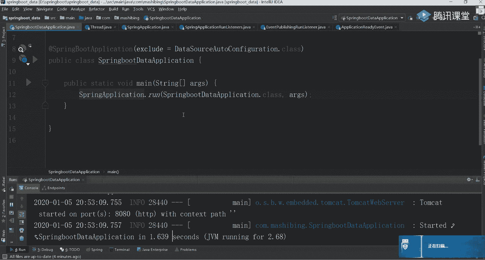

考了一份啊。

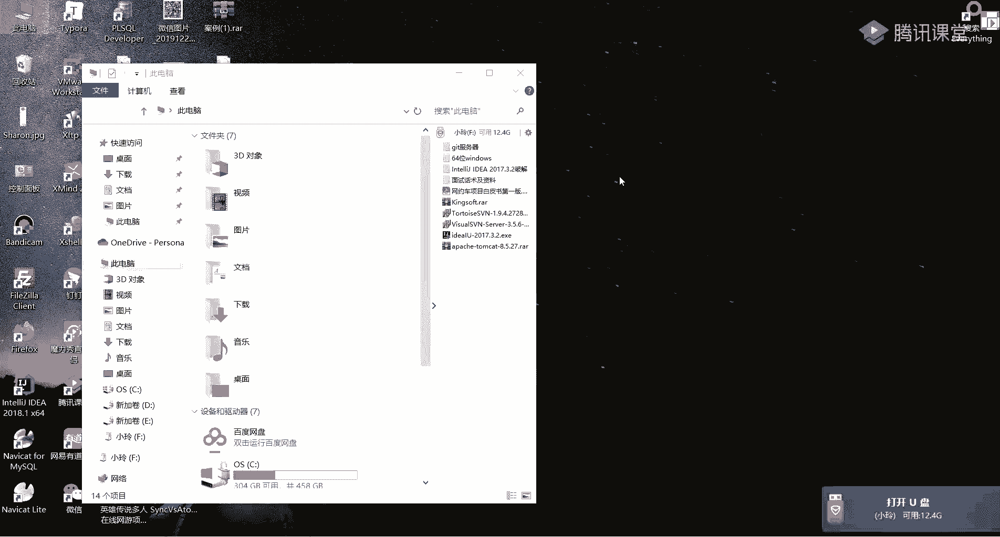

嗯，大家可以看一下吧，这个网约车二期中还要讲解的一些知识点好吧，架构的一个设计，后面有课程大概讲什么东西。

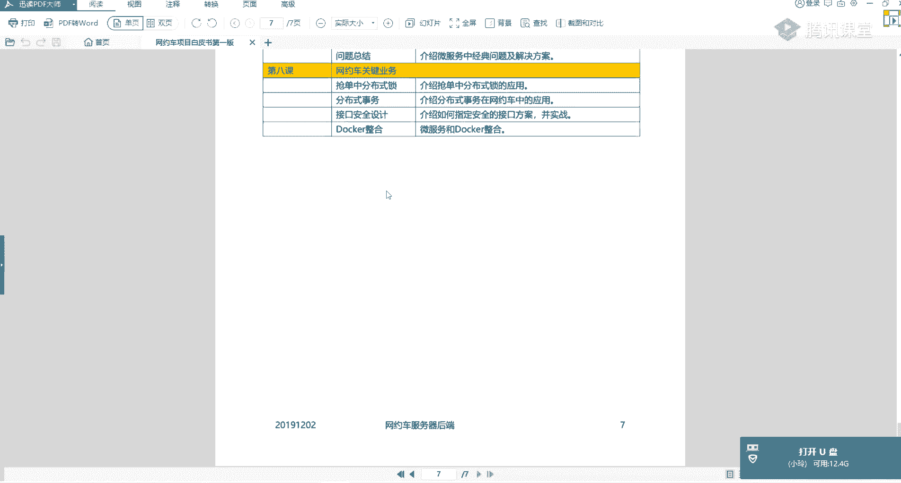

考过一期的，考错了，考一期的那二级也一样，在一期的基础之上做了一些扩充扩充，所以大家如果想先找工作的话，这个这个这个项目，这个项目是可以用到你的简历里面去的啊，要简历延续的。

大家下课之后可以找那个班长老师，回一会我给大家分享一下我们这个课程的白皮书啊，下课就来分享啊，比较匆忙，所以搞错了，ok反正你知道你下一步要学啥就行了好吧，你为啥不能骂，可以可以啊。

可是这个源码你看了几遍，不知道谁家数遍数，看懂为止吧，常老师讲，只是一个入门级的东西啊，markdown软件的名字，t y p o r a，对就这个刚听到打火机的声音，重根烟放松一下好吧，抽烟了。

声音很大吗，这你都听不着，下楼买烟了没有，我们办公室一般都存着好几条，我的天呐，我就疯了啊，哎不抽烟啥感觉，不抽烟感觉要死了，太大好吧，感觉这个世界都不好了，这些代码特情调，不至于啊。

回家之后一般都是去楼道抽烟，快完了吧，好像是快完了，vo应该就没了吧，家里有孩子不能成，是这样的，一节课，二级网约车进化12节课有可能会更多，有可能会更多，多出很多阵容来啊，办公室抽烟怕是要卷铺盖了。

马老师比较好，允许我们在办公室抽烟，哈哈哈哈，支付吗，这个细节玩不了，一会儿我把那个白皮书分享出去，你们可以看一下，可以看一下，好吧，下课之后吧，做一个分享没发出去，来还在同学扣个一。

我们开始要画这个图了啊，聊啥，会更新的那个会更新的，肯定肯定肯定会的，肯定会啊，就放心啊，抽烟六六和七老师不说嘛，我跟周老师有自己的一个单独办公室，所以在办公室抽烟没事，外面闻不到，讲个tivity吗。

就讲了一个工作流，也没啥讲过吧，很简单的东西了，我就提一下这个工作流，我们没啥不会还用开发吗，现在网上一搜一堆，你去讲的是哪个课程，后端工程师这门课，后端工程师这门课就基础班，基础班的课程，啧。

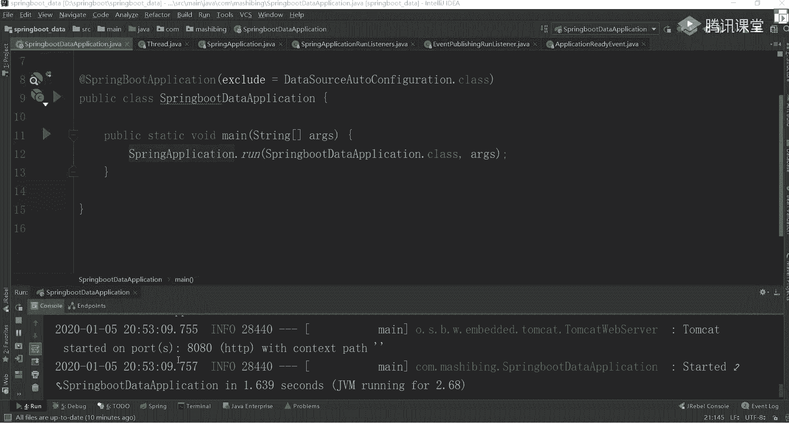

这是二套。

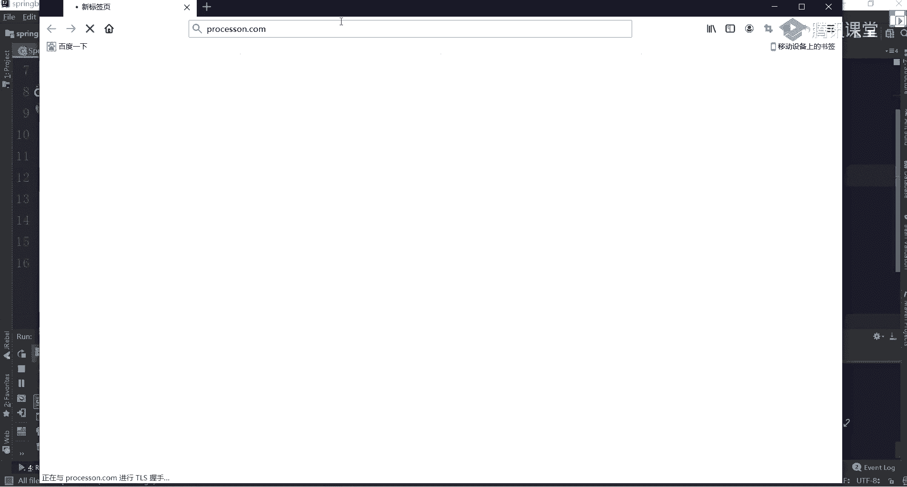

啊打这个浏览器打开错了。

来我先来画一下整体这个图啊，开了，就是这个课就是这个你讲项目讲的那个，到时候那个什么叫啥，何家园服务平台，我讲回家音服务平台，以为我讲讲算法心态，别捣乱，算法讲不了四法，往后推吧，云服务平台啊。

到时候会讲的这样画一个图，我们现在带大家从头画，大家从头画好吧，我们不在之前的基础上做啊。

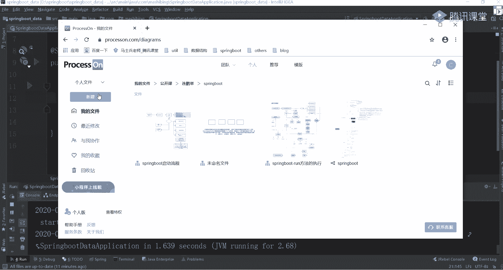

我们从头画，那个有啥问题，一会儿一会儿我们再聊一会，我们再聊好吧，先把流程梳理清楚，有啥问题，我们讲完图之后，大家再聊这事，下面呢我们来画一下整体这个boss在启动的时候还做了哪些事情啊，首先第一点啊。

首先第一点你要知道了，我们刚开始在启动运行的时候，这边会陷入一个什么呢，叫spring application，所以的类是不是这个在这个类里面进行一个启动过程的，这类非常非常关键啊。

之后我们看到了几乎所有代码里面都在这里面去，是不是都在这儿，大家看，那之后，首先第一步骤，我们虽然在这个主方法里面，我们自己没有创建对象。

但你要知道这里面其实涉及到一个什么叫new spring obligation，过程吧，这个过程就是完成了一个这个对象，一个基本创建这个东西其实并不是特别麻烦啊，比如说麻烦。

但你要知道在整体这个初始化里面，他做了什么样的一个事情，要写一下，不这样写，这样写一下初始化，是分出来n多块，是分成n多块吧，啊哪些块啊，大家想一下，第一步骤最关键的啊。

是不是有东西叫resource logo，我想跟我去回忆好不好，跟我回东西啊，叫resuler东西，其实刚开始是不是一个空的一个值，所以这东西写不写无所谓，然后写不写无所谓啊，就这一点，第二点做什么事。

是不是判断当前应用程序的是不是有这样一个类型的值，第一个叫n，第二个叫server lt，好吧，第三个叫active，就是reactive t i v e，这块稍微注意一下好，这是第一点。

然后呢这是第一步你要做的一个最基本的事情，这样做完之后，还有第二个工作要完成什么事儿，是不是加载，所有的初始化，初始化啊，八从而加载的是从我们的spring。factor里面进行一个直接加加加载啊。

保持第二步你要做的事情，然后第三步该干嘛了啊，是不是该加载所有，自然听起，有中文翻译过来，不太准确好吧，大家凑合听到这块，这做完之后还有第四步操作干嘛呢，是不是找到程序，然后运行的，主类执行的好。

有一个程序的一个主类main函数，它通过一个对战的方式依次进行向上的一个插槽工作，是这块东西，这这个步骤你要完成的事情还记得吧，这东西应该是留有一个最基本印象的啊，最基本印象啊，这块，ok这是第一步。

当你把这个对象初始化完成好了之后，下面第二步是不是该执行一个最基本的弱方法了，这写下开始执行rock啊啊说实话这些过程其实比较简单，但你要知道在里面其实做了n多个最基本的一个布置操作吧。

这里面大家想一下我做了什么样的一个事情，什么样的事情还是一样挨个优化吧，第一步开启一个什么，开启17吧，这个计时器啊，我给大家写一下，记得吗，来我们看看源码吧。

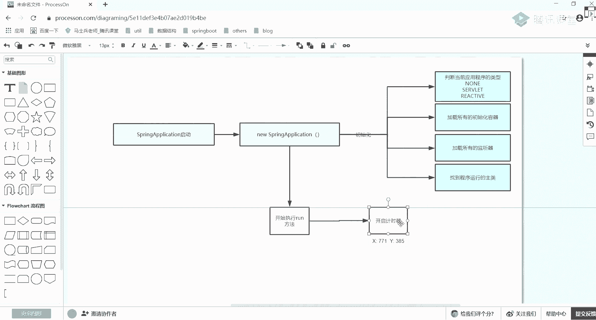

还要看一下源码，不看的话，大家可能跟不上，看一下，第一个是stop watch，开启这样的计时器，我把每一行代码给大家粘过来。

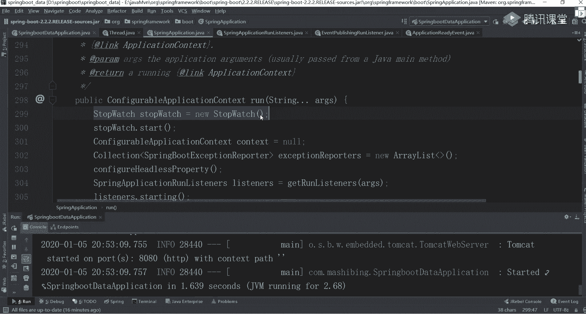

这个步骤你要做一个最基本的工作，保持第一步骤。

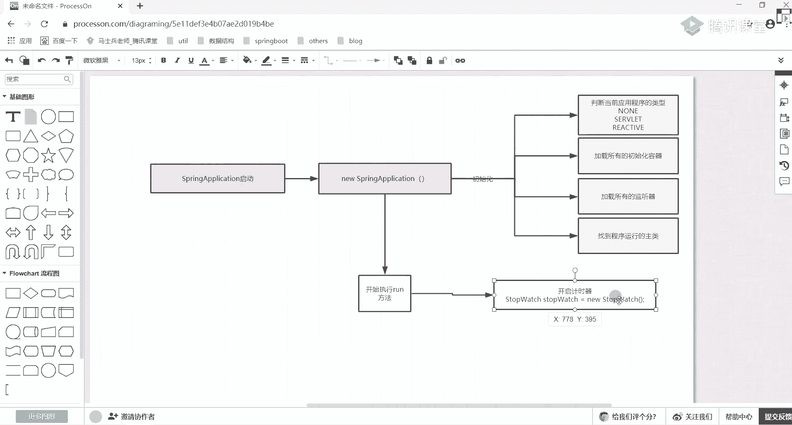

第一步做完之后，第二步还有什么事儿，除了这东西对吧，下面是不是定义一个对象对象，接不管第三个是配置一个headless的一个属性文件，这是第二步嗯。

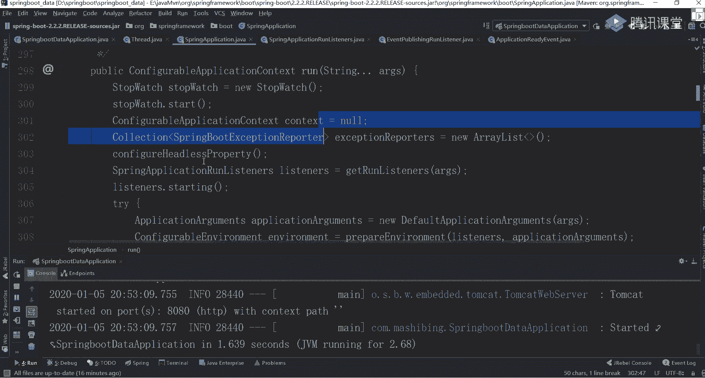

配置系统属性，java。awt点开的例子，展开属性值，这是第二步骤，我这样写一下step或者一，拿不过来了算了，这样写一下小二这第一步骤啊，这这样步骤他俩合到一块了，怎么拿不出来呀，这可以吧。

这是一至二好两个步骤就搞明白了，这是前两个步骤，它做了一个比较简单的一个事情，然后他做完之后，第三步骤该干嘛了，注册我们对你一些类似的东西的，这个大家应该还记得吧，我要画一下第三步骤，注册。

l i s t0 listen是不是注册了很多对应一个listener。

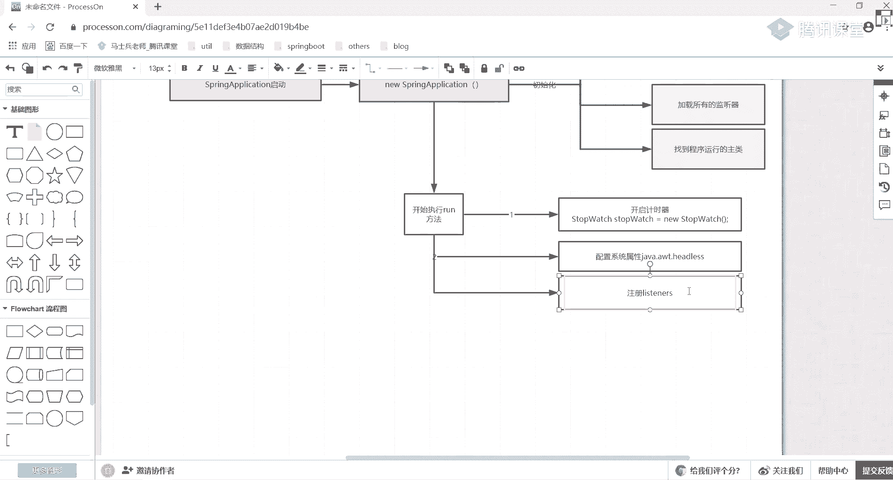

就在这块儿，是不是啊，当然这个listener里面肯定还涉及到一个什么。

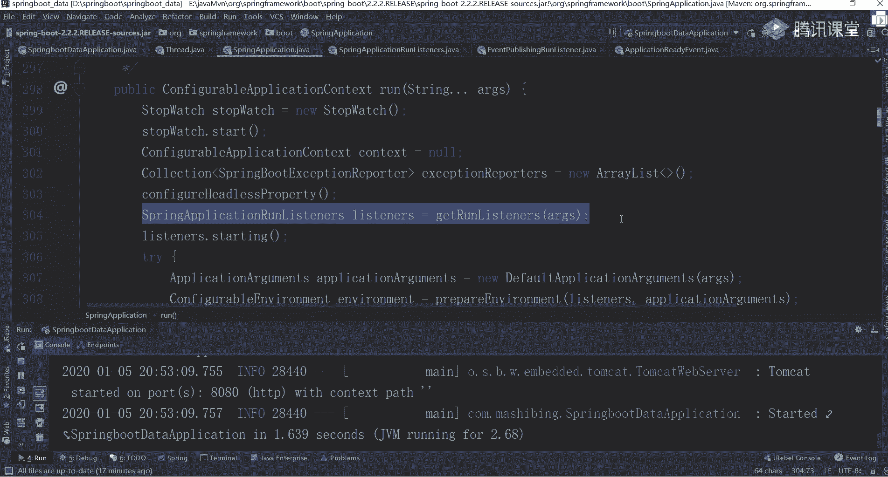

是不是启动的一个过程，我都拿过来，然后做完它之后，方法是点点挨个的一个匹配工作进行一个启动，是不是这个步骤，当这个步骤也做完了之后，也做完了之后，在干嘛在干嘛，想一下是不是该起，这是写一下三，第三步骤。

振动完之后再往下看。

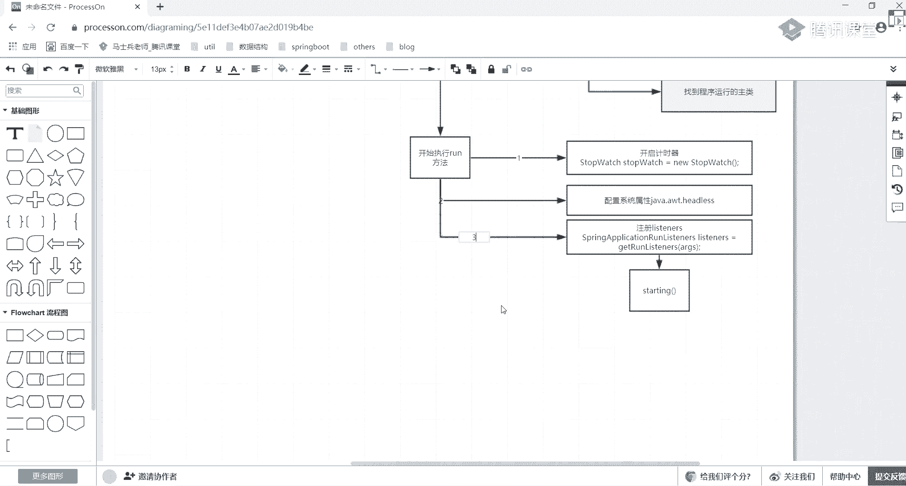

是不是该启动，它刚写了42点，启动了，该准备什么了，是准备我们对应的一个命令行的一个基本参数了，好第四步骤。

这边放这边好，第四步加载，命令行的参数值完成，大家看，同时我是不是构建出来一个新的对象，相当于是新的对象把它过来啊，这四个步骤这个事情，但这个事情完成之后，注意了，这其实做的事情也算是比较多吧，好吧。

你要想看的话，点到这个方法里面。

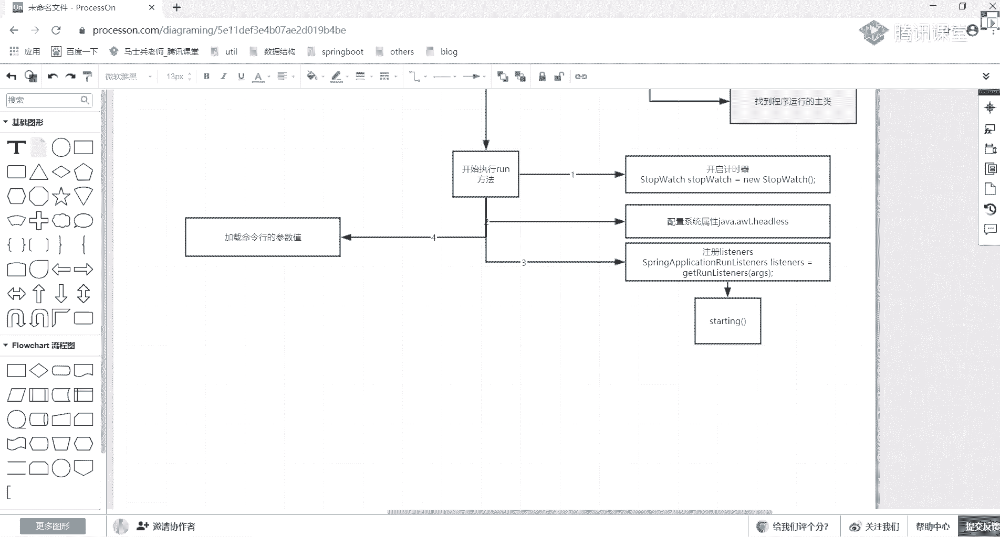

你可以看一下创建对象，然后往里边进行挨个进行一个添加的一个操作，这个东西new new resource，然后读取到他对着一个值应该不是点过了。

用了一个什么叫simple command line arguments processor，然后进行一个直接的一个解析，剪完之后是不是杠杠开头了，这东西啊，之前我都带你们给他看过了。

所以这块我们不再详细说了，大天说了，但是你要知道他做了些什么事啊，这里面必须要知道他做完之后，第五个步骤。

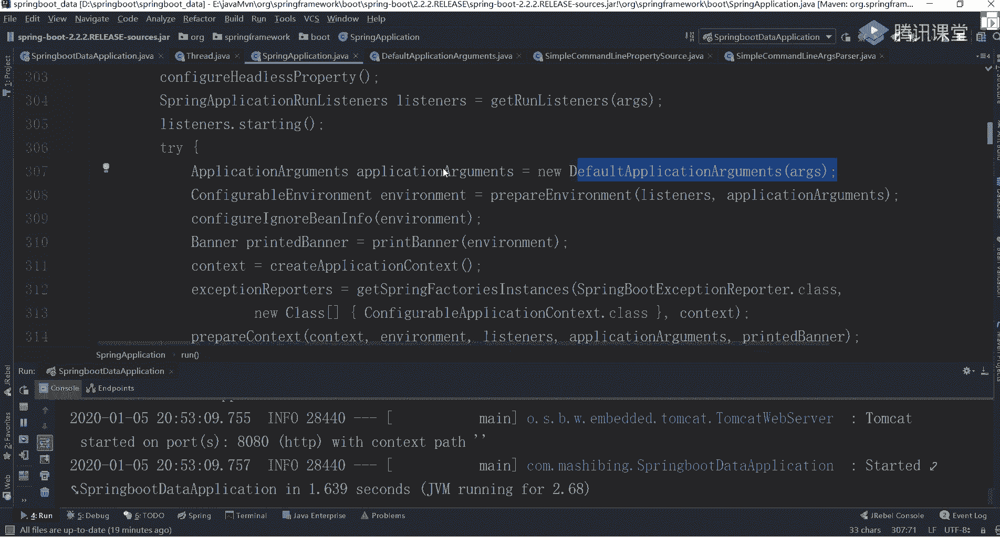

啊，干嘛是不是准备，应用程序的啊，呃环境是不是要准备我们当前应用程序的一个基本环境了。

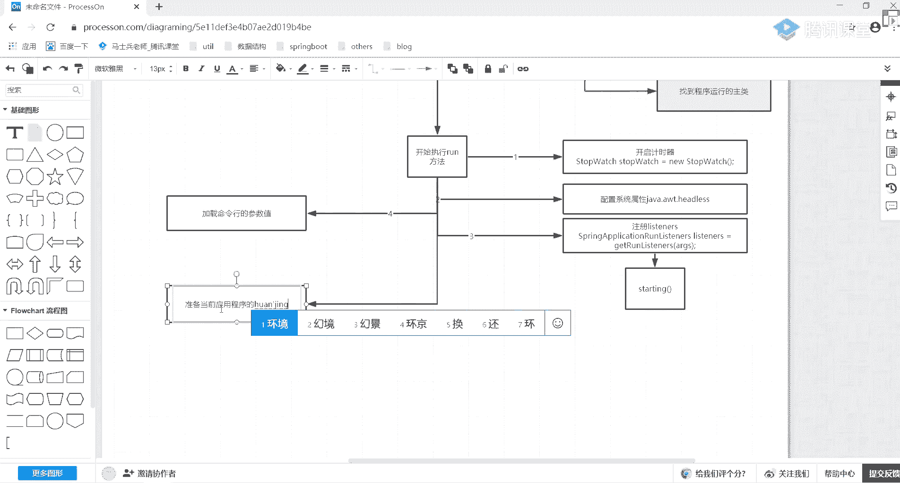

这是该这个环境啊，这个环境里面其实也非常简单，你来做些什么事情，是不是就往里边加了一些配置，是创建一个对象，然后再加一些基本的配置，启动我们对应监听器对吧，把对象给返回去对吧，那行啊，准备把代码粘一下。

这个值。

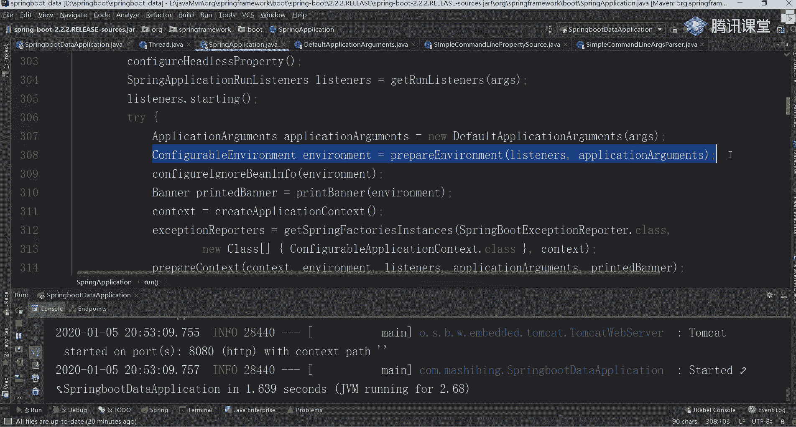

代码，除非我当前环境，这是第五个，步骤五，当你当前这个环境准备好了之后，你告诉我下面你要做啥。

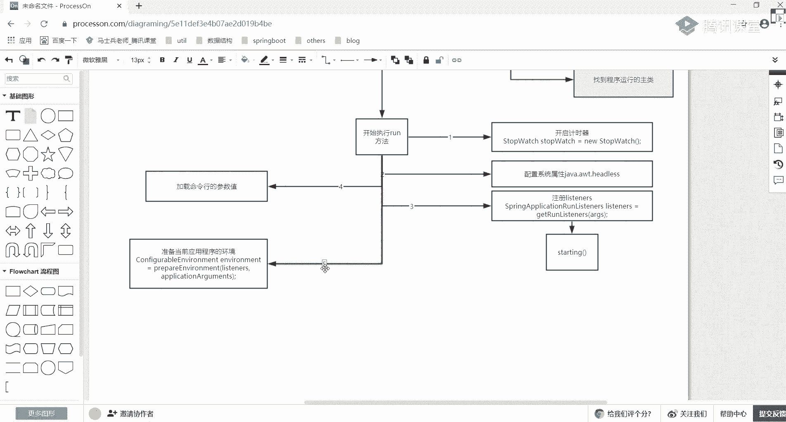

配好之后，我在这边设置另外一个属性，就忽略某些病，不让他加入到我们的当前环境里面去吧。

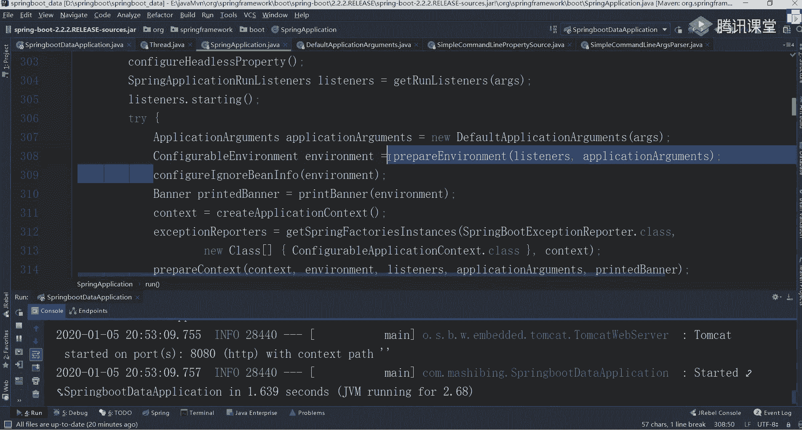

第六步，那，就麻烦设置系统属性，然后呢保证某些，不会添加到环境，要准备的保安静，对，啧，这个步骤做一下，第六个步骤要做一个事情，这都能看懂吧。

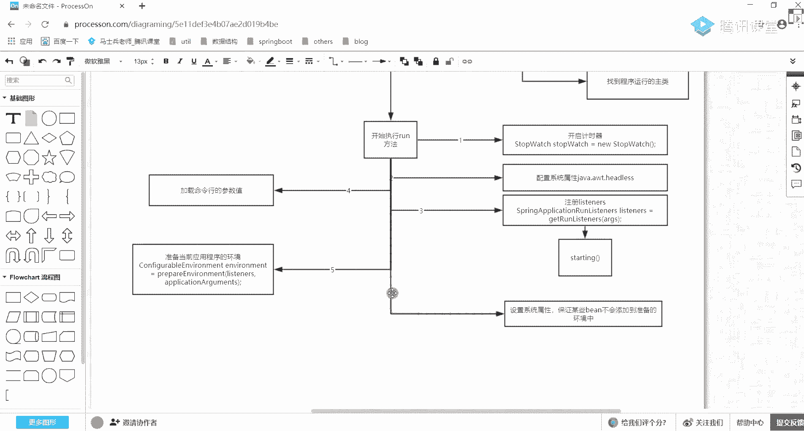

知道这个整体步骤应该记得第六步骤，然后这做完之后，第七步干嘛。

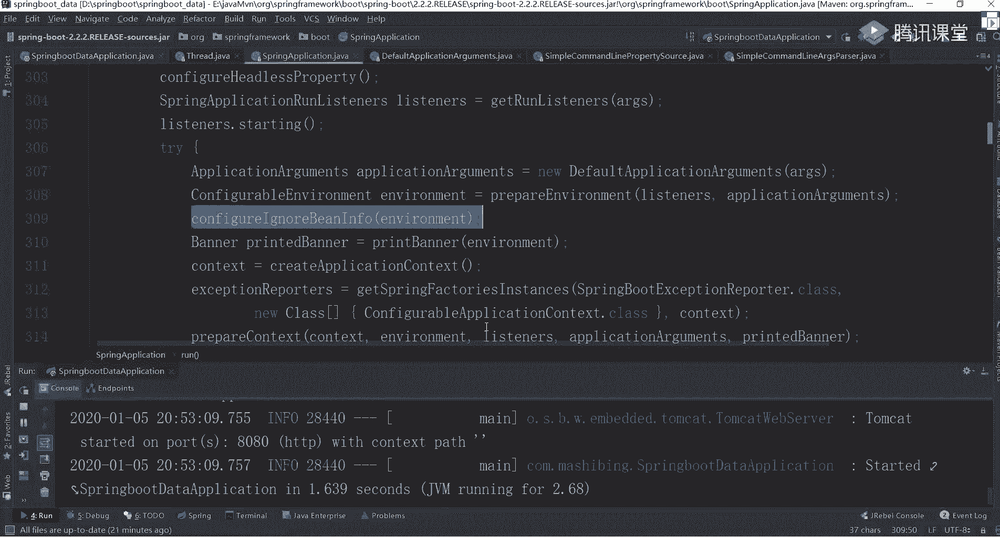

是不是准备我们的一个打印图案，打印版的图案，下饭吗，只要直接换了bba的打印，这是我第七个步骤，哎，放弃了好吧，你知道这个步骤就行了好吧，这是第七个步骤，进入这个之后，我们再往下看他要干嘛。

是不是开始给我们准备上下文的一个最基本环境了，是准备下文最基本的环境，准备，交替这些啊，上下对打击的环境对象，好吧，这块你应该记住了，记住那个最多的那个类名称，非常非常长的一个类啊，这块记住ok。

第八步骤，这做完之后再拿走干嘛了，他还原准备好之后，我是不是该收收集我们对应这些异常报告器了，拿过来，这写一个，是一查报告七对象，我把代码都补全啊，刚才有张有没沾有把代码补全，这两参数值一样的。

把它拿过来。

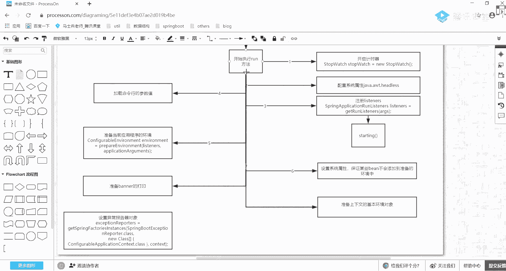

这图这图完之后一样的在干嘛，是不是准备我们当前这个环境。

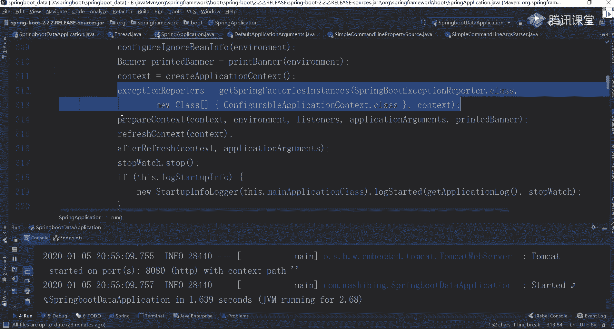

当前上下的，拿过来让大家看干嘛呢，是不是要重新刷新我们这个环境，上下和缓解，标注一下叫关键操作，这关键步骤你这一定要把它给注意住了，不一定要把记记住了啊，这是我们关键的一个操作，就比较大。

背完之后还有什么，是不是开始最后的一个刷新，来凑合着看，哎上下文对象准备好，之后，好好做默认，都不错啊，方便，好把那个匕首步骤记住了啊，还有很多东西没没没往里面加，一会我往里面添添添添加东西好吧。

还没加东西呢，这只是把这个大致轮廓先给大家梳理一下，大家理一下这样的一个环境。

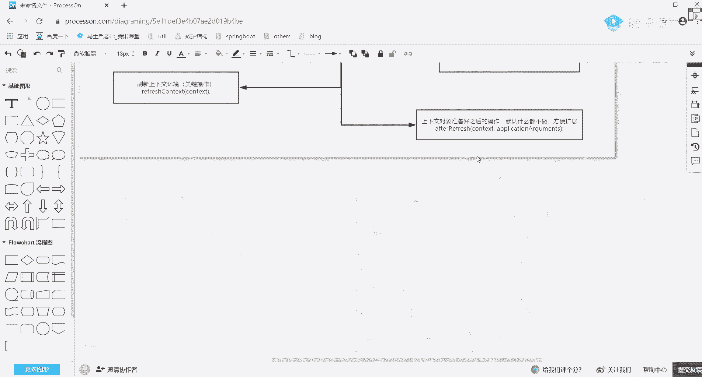

这牌子怎么来，之后是不是计时结束好吧。

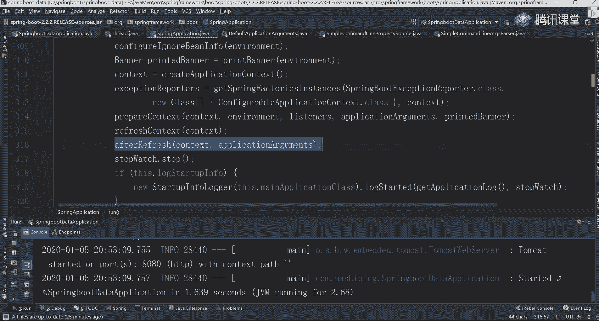

计时结束，结束并打印呃，启动去把运行的时长啊，这个步骤，我们这样一个基本的步骤图，下面就有个listener start。

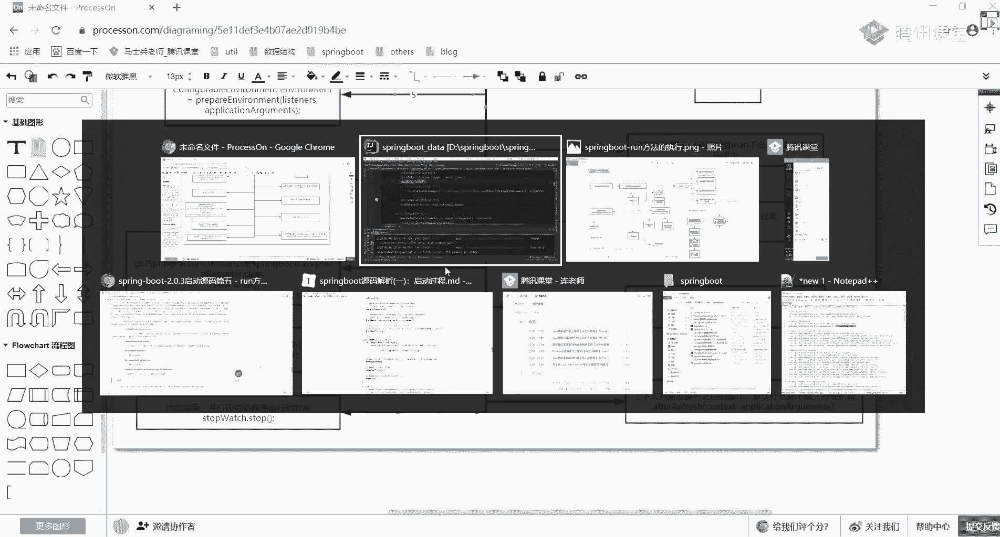

这面我说了什么都没做，前面toonist也是什么都没做，这样东西跟没做都一模一样好怎么样，最后还有个什么呢，叫listen那点rning，让这些启动器是不是都启动起来。

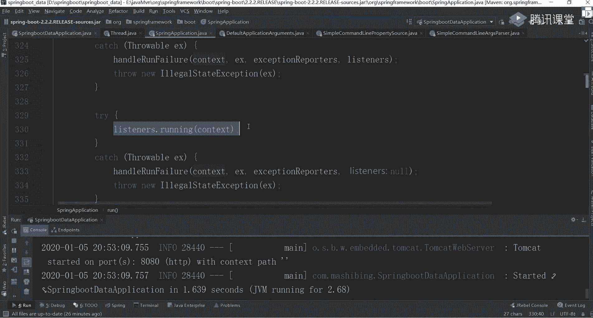

监听器，找一下监听器，所有的监听去对象，所以你把这些基本的步骤都记住好吧，这是2+2 d8 不，说过了吧，把这块，绝了啊，这个东西给小光，然后大家看这个地方，第十步，哎呀我，拖把没事就拖吧好吧。

快被整疯了，没事快快完了t我记得我自己的想笑啊，小龙好了，签完下东西，一会儿我给你们分享完之后，我把这东西给你们补全好，在这先先写这么多，写这么多这块之后，就是我们整体这块的一个基本步骤。

看起来好像是已经比较清晰了啊，已经比较清晰了，但是但是我说了，我要往里边加东西，加什么东西呢，首先最基本的东西你要知道是吧，这就什么东西，你想一下我们本身。

我们本身从spring the property of spring fighter文件里面，是不是加载了很多对象的一个值，是加在属性值，这些属性值你拿过来之后，其实它是通过一个什么统一的一个方法。

是不是读取过来的，所以在后面这块我希望大家做这样一件事，页面我把它放大一点啊，啊我往右边加点东西啊，加点料加什么料，也就是说你之前在进行数据读取的时候，你到底是怎么读的啊，到底怎么读的。

想一下最开始读都是从哪读，是不是通过这东西，我要从模拟rfs文件里面是加加加加加这个内容了，就这块拖移过来，这写一下叫根据叫传入的类型类名，或者就是我们的k，呃得到，的工厂集合的实力啊。

先把这个实例名或读过来，当你把它读过来之后，把读过之后，第二步骤在干嘛，下载叫spring，点factory a e s文件文件中的内容，是不是这个文件里面内容了，我们之前所有的那些类别。

几乎都是直接从这个类别里面给加载过来的，加载过来的，战斗完之后，第二步骤在干嘛，文件名是不是给人取到啊，起到之后来获取，装工厂啊累的什么全路径，根据反射，具体是。

对实体对象是不是拿过来拿谁对象之后再往下看，的生成，的对象之后，再返回给调用者注意了，对不对，但注意了，其实它并不是独，里面都加加颜色，加这条吧，你想一下像这块的基本操作，哪个地方用到了。

第一个这块用到看吗，第二个这块能看了吗，是的都是通过什么，还记得方法名称吗，这写一下叫get spring federate，唉es，然后呢，cs是通过当前这样的一个方法把这个值给出去。

到了这最起码两个地方都是一模一样的啊，都是一模一样的，这块大家注意了啊，这东西都一模一样的，除此之外想一下还有哪个地方用到了我们当前这个值，我在进行这个类的一个初始化器的时候，他听到了吗，是好了。

还有意思，是等于方法了，来再来看还有什么东西，我们之前在写那个异常报告气的时候呢，这画，来换一下方向，大方向要把那个图片上画，拿过来，啊，找上挪一下，然后呢想一下刚刚那一张报告器里面。

我在获取具体类的属性值的时候，是不是也是调的是这样的一个方法啊，啊所以这块你要知道啊，所有东西都在里面存储，这块是比较清晰了，来这听他同学来扣个一笔记，会非常跟他玩，会不会这些东西啊全部上传的啊。

全部会上传的缩小一点，肯定会啊，我不上传，那我费劲画个图干嘛，转化完之后，别的东西还有吗，想一下别的还有啥，不要就是为我们具体的一个细节了是吧，涉及到细节里面的内容了，细节这块我们再接着往下画。

每一个步骤里面其实都有具体的一个细节操作对吧，这这里面完成了哪些事情，我应该做哪些东西，我们这儿来补充一下，光画这东西没意义，好吧，又要说了，你这东西你自己也能画，按照代码就是前后往下去往下捋就行了。

关键是你要知道几个最核心的一个步骤，装填步骤之后，你要知道我如何进行一些实际操作，这才是最核心的，懂我意思吧，一会下课之后，我会把这个图再美化一下了，这个图画太丑，和我这个是审美观啊。

有对象他提bug了，大家看这画完之后，我们再做什么事，你还是一样想一下刚刚我们那个群体步骤里面我可以做什么事，第一个开启计时器，其实开启计时器的东西并不是特别麻烦，好并不明白这里面你就是一个东西。

我想一下怎么链接过去，怎么练怎么怎怎么练，呃，这儿写啥，我想想，这样没法这样没办法往里面画了画了，我这写吧，角设置，当前任务的id和的时间，然后呢方便后续的时候某些，进行某些什么呃，进行叫计时。

真的注意了，我一会儿把这东西再美化一下，太丑了，这个，在哪点，这是我们整体的第一个步骤吧，它完成了什么样的一个事情，这块注意就行了，这逻辑来好吧，这是第一块，它是比较简单的好吧，其实里面没有什么核心。

没有什么核心代码啊，非常简单，基本操作，ok这做完之后来第二步干嘛了，是不是加载我们对应命令诶，哪去了，这是第一步，第二步呢，这第二波，啊，它发生什么事，是不是就设置了一个系统的一个属性值对吧。

这个属性值意义不大，这个忽略，反而没人去问他，好吧，你大概知道是什么样的一个意思就搞定了，别东西不用在乎好，然后再往下看第三块步骤来告诉我第三步骤干嘛，注册了一个类似的一个对象对吧。

说起来很容易的东西并不是特别难，但是跑这儿了，来来看这里面我声明了一个对应的一个listener对象，但是这个listen呢你要知道它是怎么来的，什么东西叫event，然后呢publish。

roll listener，那这个东西这写一下会贯穿，不来写不来写不来写不小一块儿，获取一个叫event publish，listen now，对对象好吧，此对象，整个，应用程序启动的过程，每次在进行。

操作的时候都会从中获取具体的监听器，啊啊啊，这是我们要做的一个事情，我要做的一个事情好吧，你先装出了事件发生器，对事件发生器这块就行了啊，调一下，这个解释就行了，就是解释。

然后最终的时候这样会有一个starting，是不是starting，这个这也比较关键，因为每次在进行starting这个操作的时候，其实它整体的一个处理机制是不是也是一模一样的，是一模一样的。

你告诉我这个三他做什么事情。

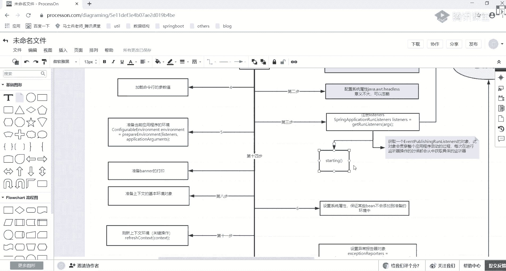

我们让黑老师点一下看看啊，12点，找一下就在这块把这儿有第一个这对象。

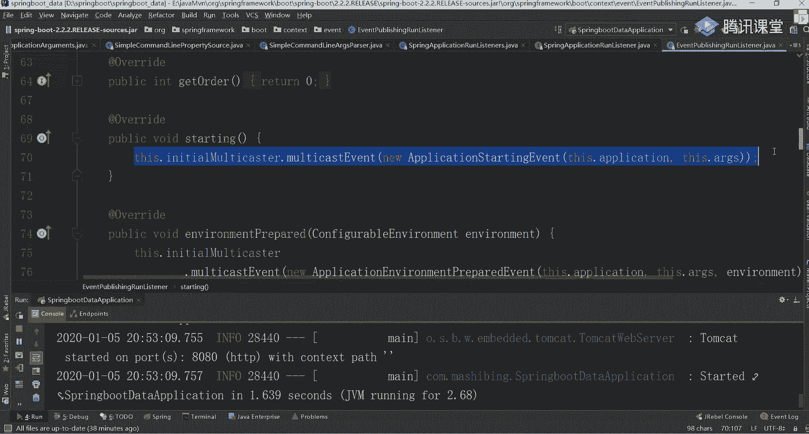

找一个方法，找这个方法，再画一下，想到这怎么画对每次都重复这东西，我画了个外边了，监听器在实际发生，呃做操作的时候都会，叫lisi体验124点星，把每次啊都会执行这点新的方法。

这点星可以是starting，也可以是running，也可以是各种各样的一些触发事件吧，是这样的东西再进行进行技术啊，它会调用这样的东西，当你调用当前这个方法之后，它最终会出到哪，触发这个地方嗯。

当你有了当前代码之后，有当前代码之后会干嘛，比如说会发布不同类型的一个事件，会匹配，啧啧啧，类型的事件，从干嘛呢，从哪儿，从所有的监听器中把和条件的监听器给过滤掉。

啊这这个方法里面它要做的一个最基本的工作。

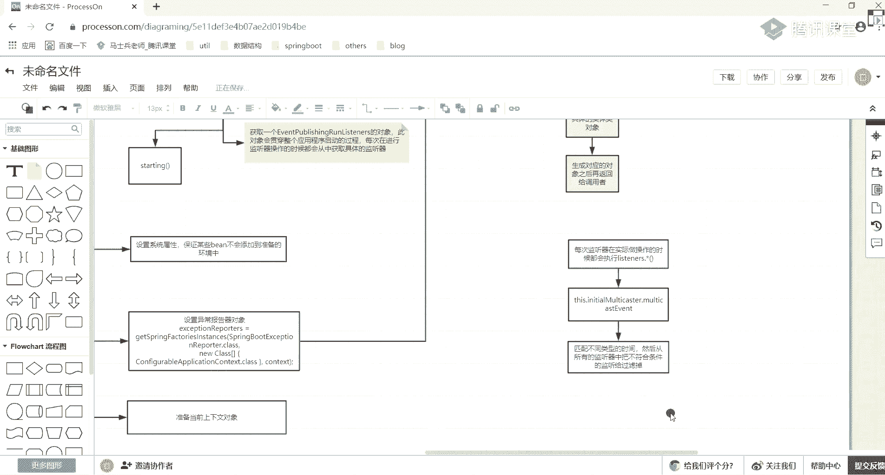

做完它之后来往这边看走，点我我点一下试试，点一下试试，点完之后中间有一个核心处理逻辑。

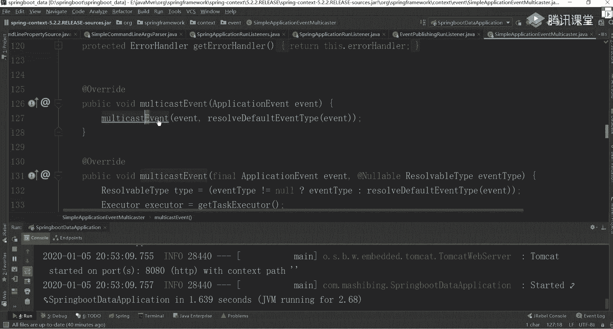

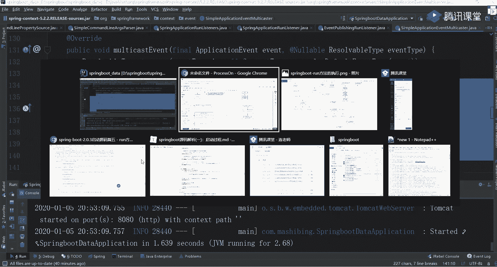

条件的监听器，一次投入会循环具体的自己的处理，通过什么来处理呢，就刚刚后面我发了个代码，这个invoke后面东西有点不太不给你们画了，这个emo，剩下核心点你们下去之后自己画。

你知道有这样一套处理机制就可以了，是不是比如说安装一些日志化，一些初始功能对吧等等等等，相关一些操作这块稍微注意一下，行了好了，就这样东西现在看到了，这是我们整体这个监听器，你在做的时候。

我要做的一些事情啊，是ok就这块数据环节，这记住就行了，来这边讲一点，能听明白，同学扣个一，这时候没问题，之后你发现了这个starting，是不是也会掉到我们这个地方算开掉吧，执行叫starting。

这个步骤好了，一会儿我们都往这练啊，这个线可能会比较乱一点，但是你凑合着看，我改一下乱，我们这儿可以打成这样的需求，好吧，就这样好了，看完了之后，我们来再接着往下看。

这启动的时候是不是在做一些最基本的初始化工作了对吧，初始化工作14，都是能把我搞疯了，我的天哪算了，不管他了，不管他了啊，来再来看这个第三步，我们完成了，完成完了之后，我们来看第四步干嘛的。

第四步做事情也非常非常之简单，他其实就做了一件事儿，是不是就是说我要初始化我们对应命令行的一个参数，你最终再往里边点的过程中，你会看到一个具体的实例对象，叫simple common the line。

是一个解析一个东西，这样会完成我们整个参数的一个解析工作，把这个颜色上上，换个色就这样，会掉到哪儿呢。

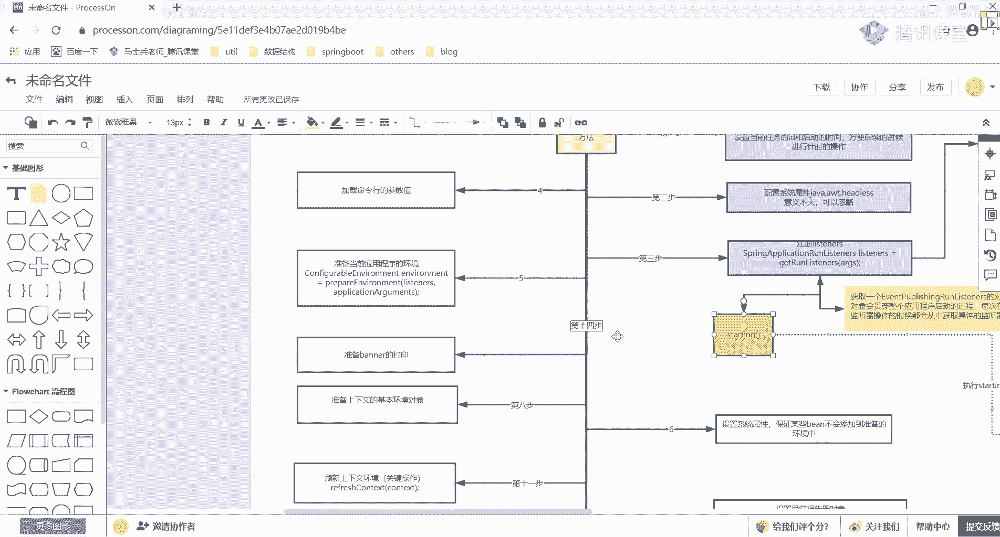

找一下烦烦烦，往回翻一，熟练好吧，走他走他走他。

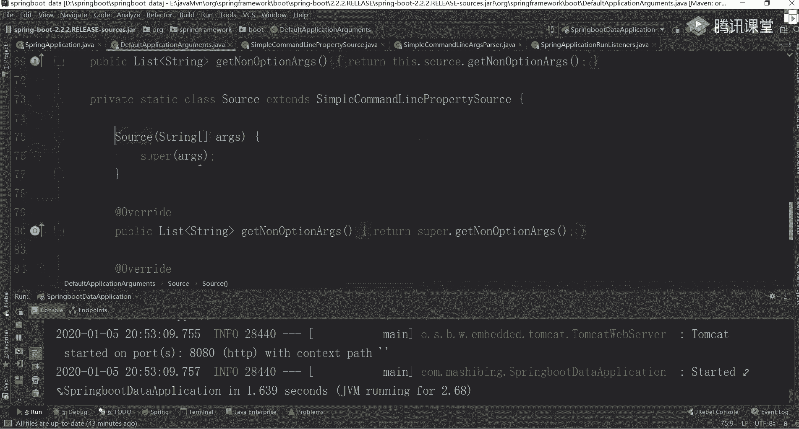

七在命令行中，什么叫杠杠，然后呢k等于value，输入的属性是，嗯。

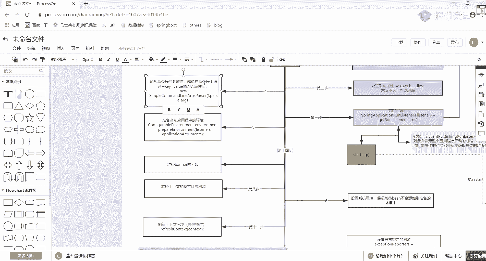

哪个对象还记得吗，保卫反。

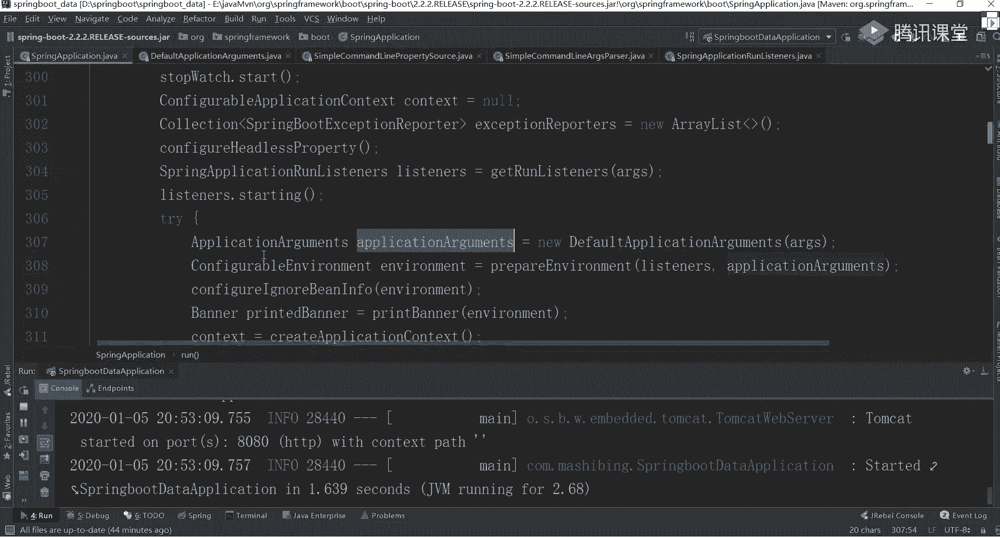

别瞎说啊，把这块儿我该到了啊，他表示什么意思，一定要知道，ok这块三个全打第四步吧，这么难吗，不打完了之后来往下看，第五步骤来改编之第四步，啧，我做什么事情。

是不是就要创建我们当前这个应用程序满足的一个呃，准备好一个对应的一个环境了，在环境这你也要知道一件事，什么事呢，往后延伸诶，摸上去了，我想到这儿啊，这里面什么叫准备环境的一个初始化工作吧。

在这个环境初始化工作里面。

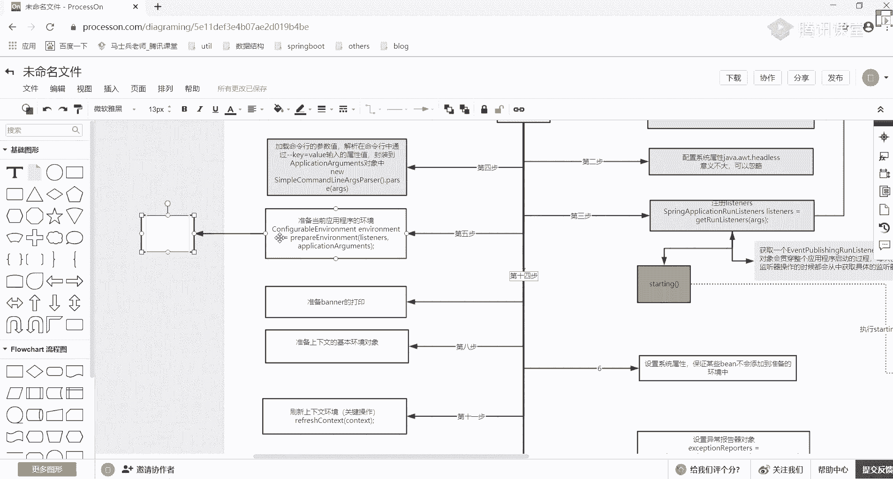

其实分了最基本的几个步骤，我把这个步骤来写一下，第一个叫获取或创建一个环境。

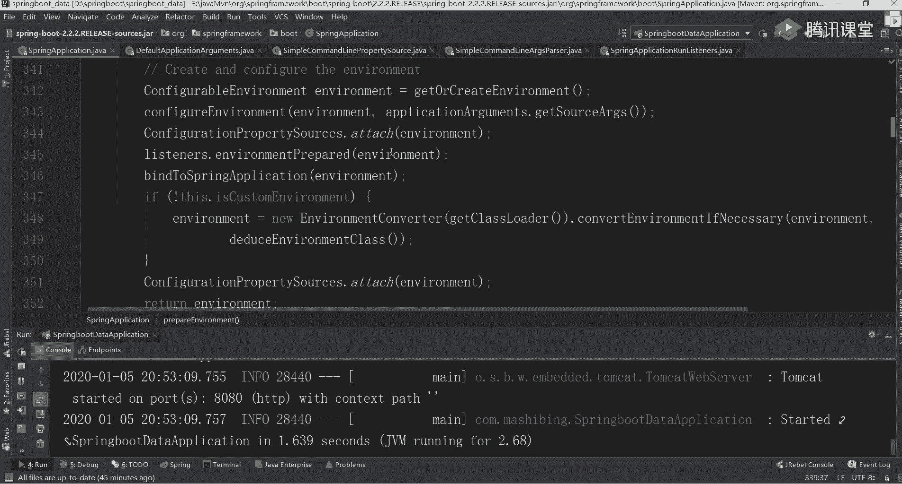

跌不着，或者创建，环境好，当然我们都知道，当你换创建这个环境的时候，他需要依托于谁，想想等一下我一边改大一点，变化吗，有变化，这些东西都往外挪一下啊，整体上第一个步骤，这注意了，你是根据什么，根据。

只要根据当前应用程序的类型来做判断的，想一下这个步骤啊，这个步骤可以跟我们哪块东西给关联起来，还记得吗，我在完成当前这个程序初始化的时候，这是个初始化，在说话，是不是有有有一个类型的判断。

所以这块其实可以勾一条线过来到这个地方啊，这能看懂吗，啧好吧，根据我们这样一个参数类型来进行一个整体的判断，因为这会返回说你具体是什么样的一个类型，我看这没问题，这现在看明白了。

这第一个你先进行一个创建步骤，创建完成之后，第二步是干嘛。

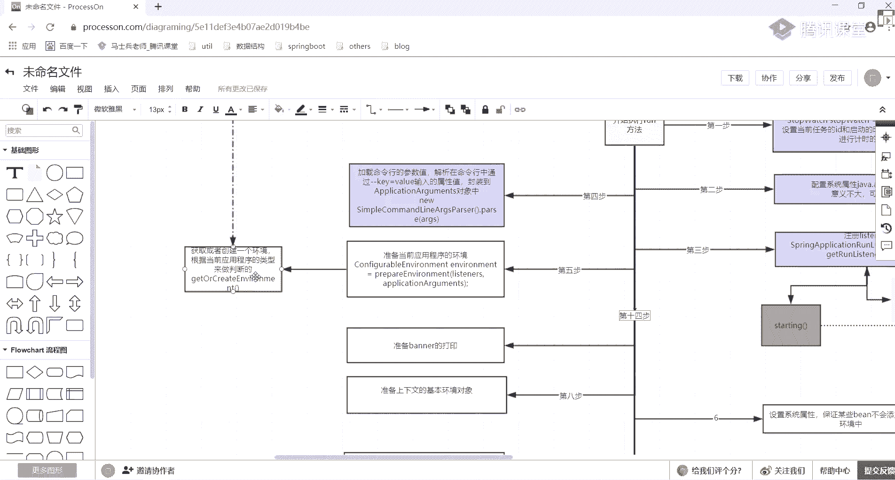

进行一个相关参数的一个配置吧。

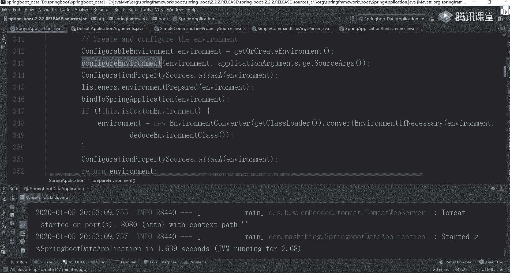

当前环境进行，就这个属性，当然配置什么东西，我这不说了，你下来之后自己可以进行一个查看这这个细节啊，这块不懂啊啊这就不够，地盘不够啊，先放上面。

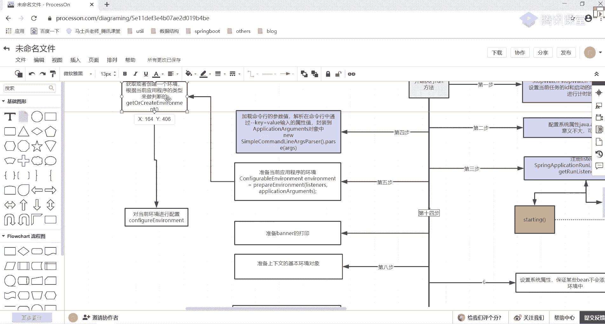

第三步骤在干嘛，这个太不用管它了吧，是不是就是配一个什么叫default properties的一个东西好，或就是旁边你自己的东西，ok这是又到这儿了。

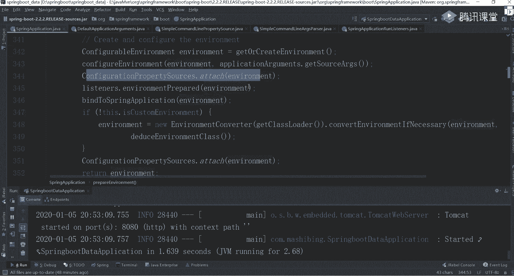

listen了，listener这一块了，这个listener这一块它创建一个什么东西，叫environment prepared，是相当于是一个全新的一个整体事件，这个全新事件最终会用到谁。

是不是还是看到我们下面这个地方来我这画一下，把图拿过来啊，我说了啊，这个有可能会有一些交叉下来，看的时候自己免免啊，凑合去看一下，我把这个线给大家打过来，画一条线，把这个环节。

这些东西啊都是有整体的一个关联的，不是说我想怎么做就怎么做，不是不是这样的，明白了吧，这样一个环节来这块能看懂吧，好了是这样的东西好了。

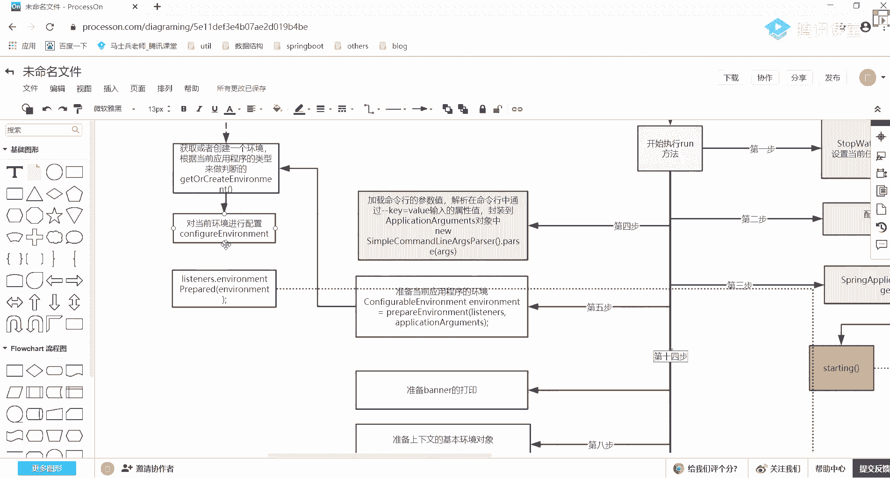

这个完成，棒哥给我说，这东西没啥用啊，我们这就像目前看起来还没啥用。

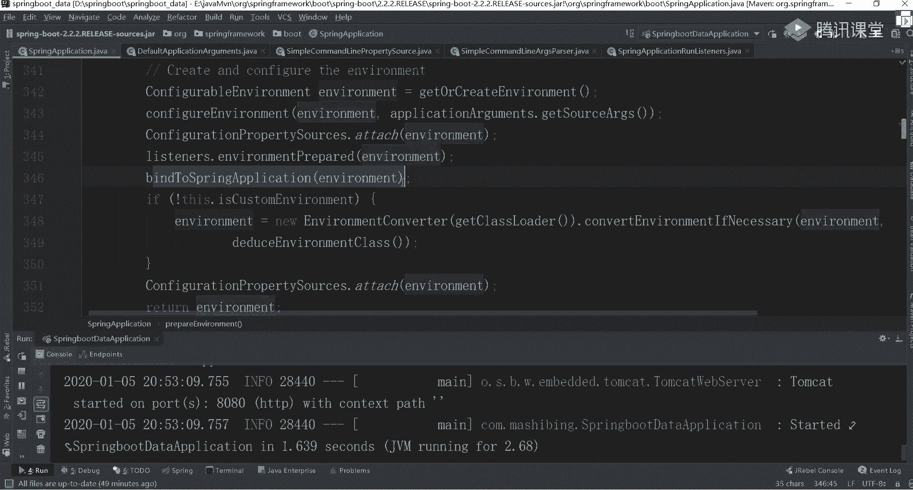

然后最终把我们就要返回去，这个处理的一个环节来这样的制度，同学扣个一，还在线吗，这些关键步骤可以做一个详细的做一做呃，大概罗列一下啊，好了，这个完成之后来再来看第六步骤，第六部哪去了，就这样吧。

第六步做什么事，是不是设置我们对应的一些系统使属性，这就是系统属性，所以这块其实没啥看的，是a系统属性，你们平常用的时候可能也几乎没怎么用过，这句话你注意就行了，再说哪个系统属性啊。

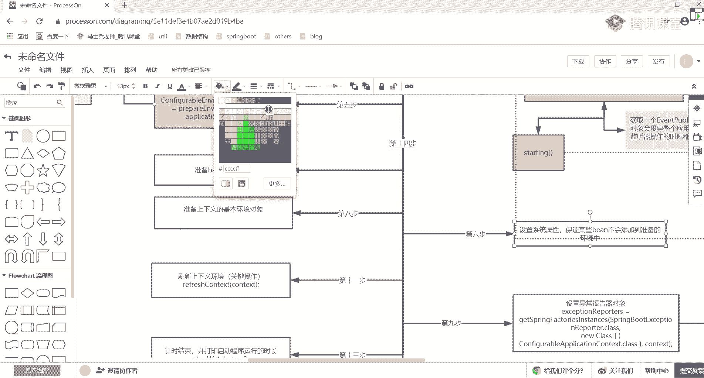

把系统属性给大家说一下哪个系统属性啊，我找一下劣质。

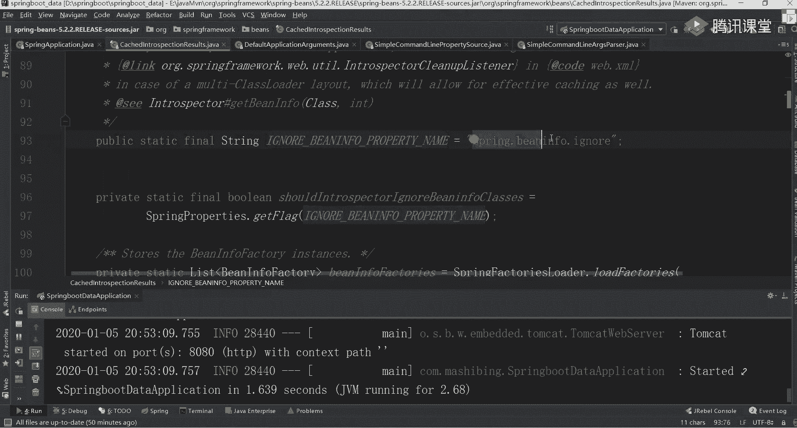

来来好吧，这是我们的第六步骤，让大家看，这是我们的第七步骤，嗯，是干嘛的，是不是准备我们banner的一个打印了，这个banner打印ban打印其实也非常非常简单，就是说它是按照几种方式进行打印的呀。

是不是两种方式的一个选择，那我先把这个干嘛给他粘过来啊，不到打印没关系。

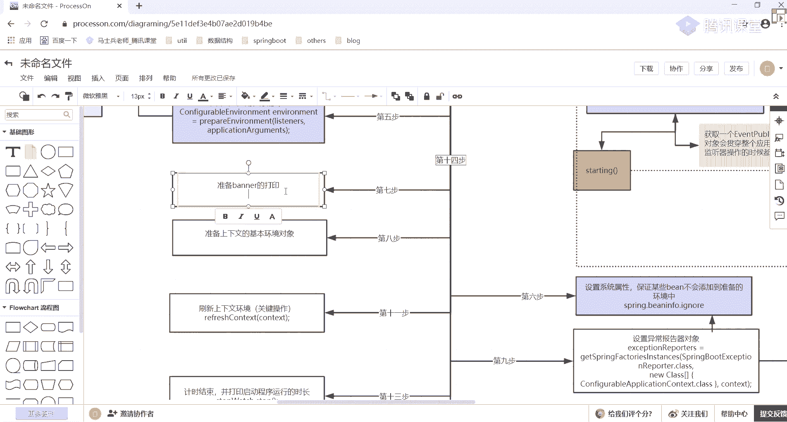

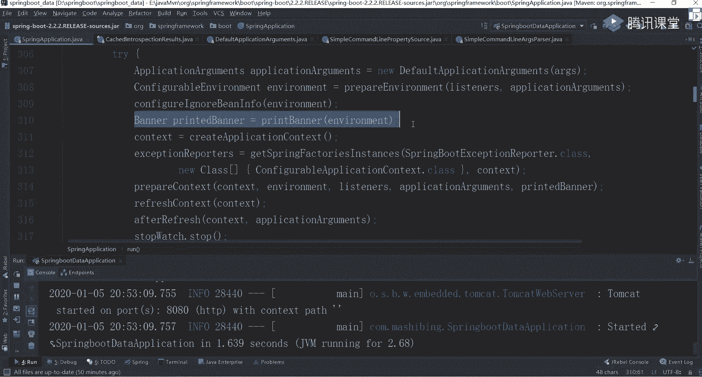

怎么打印的，画一下，先判断，有图片吧，只支持，支持什么叫jpg，然后呢gf，然后呢png图片，这是第二步骤，第一步骤，这如果没有的话，如果没有的话，第二步在干嘛，叫banner。txt文件，内容对吧。

如果这也没有的话，第三步，打印的循环打印输出，是啊logo吧，默认的banner，就经历了这三个选项，那我来第一个，第三个，就是买东西，ok这样看懂吧，说了对对对，就这些东西啊，很多东西啊。

能但是我思路往里面写东西，说明你还记得当时咱们讲课讲了点啥，还有点印象好吧，这是我们的第七步，第八步就到这了吧，第八步做什么事啊，是不是说了叫准备上下文的一个基本对象，别别别，当然基本环境都讲了。

上下文，没有，啊这这个步骤要做的一个事情是第八步骤。

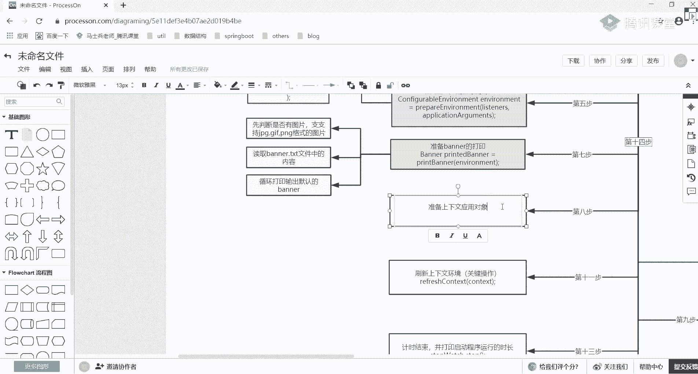

第八周回来之后也一样。

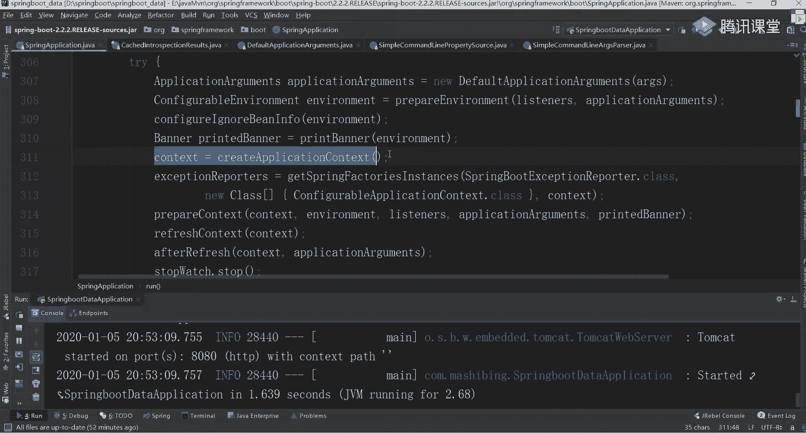

二位，在创建的时候它也是一样吧，根据什么来创建的。

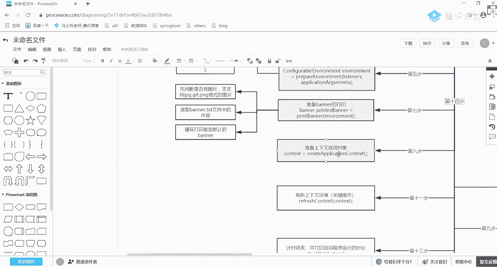

还记得吗，是不是还是根据我们对应一个一obligation，它的一个类型来进行创建的哦。

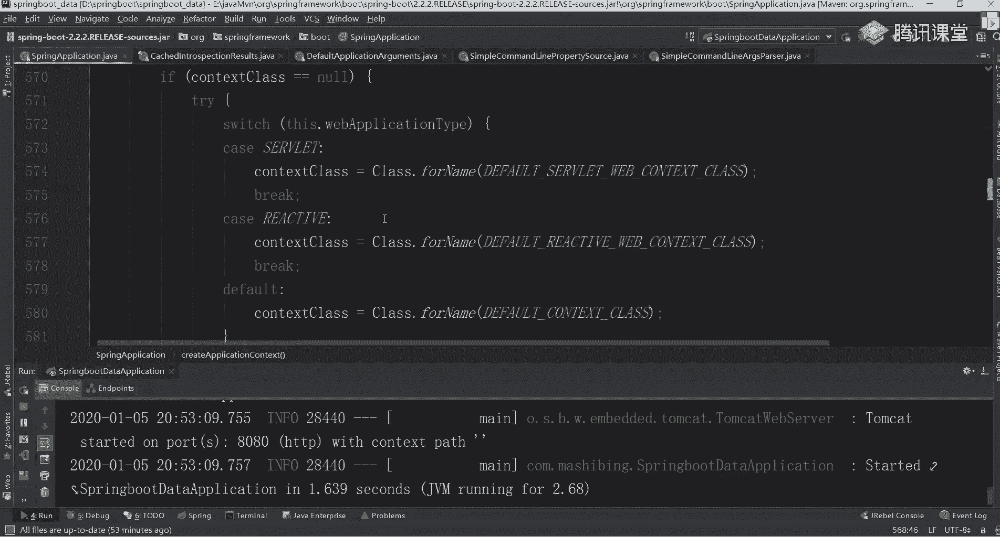

这里要注意了，这里写一下，不过，当前应用程序的类型来判断创建，格式的上下文对象啊，这块呢大家注意就行了，这块我还要再给大家写一个最呃写一个小提示吧，30写小提示，在看到上下呃，再看到。

上下文的对象之后一定要，地图啧啧啧，好在父子关系的内容，对很多初始化的操作啊，容易忽略，说是啥吧，大家想一下，如果你是一个application这样类型的一个参考值的话，最终会创建一个啥来着。

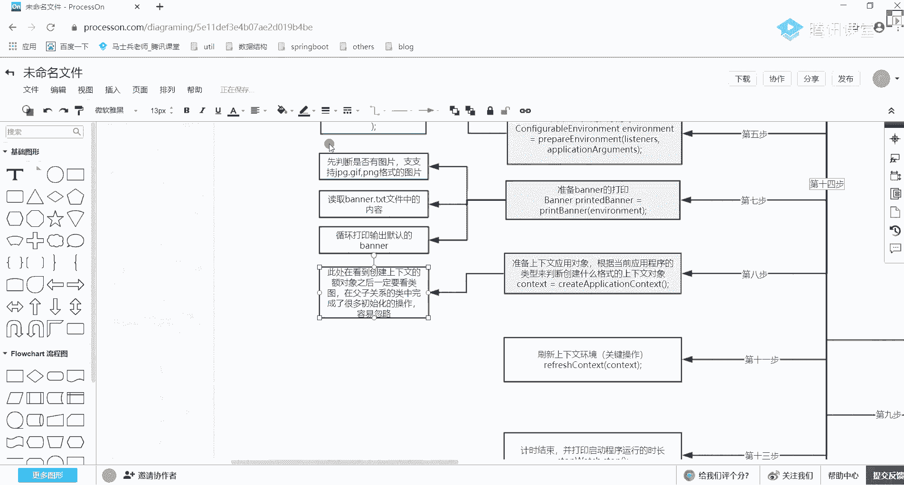

还记得吗，搜一下叫ano，是不是东西创建它吧，当你创建它的时候，它最终哪去了。

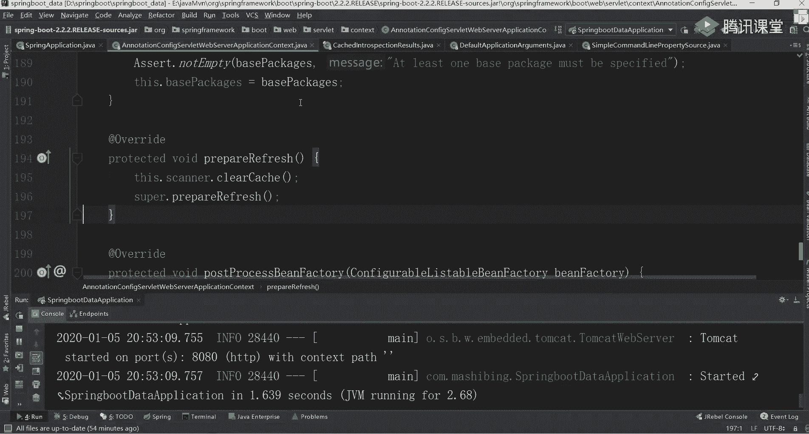

它的一个最基本的构造方法是创建了一个reader和scout，一个对象，有它之后，你看一下它的类图，我当时就在你们看了，我看不是他，这图链图里面有一次有很多层次的一个继承关系，比如说它复类是他父类。

是它这些基层关系里面，每个里面是不是都完成很多的事情，这东西啊在你们看那个呃死轮研发，这时候应该有有有有机会看到啊，跟spring里面差不多，所以这块你不忽略了，不要忽略了之后在哪呢。

在这个generate写下这个类，啊这儿有个非常关键的类啊。

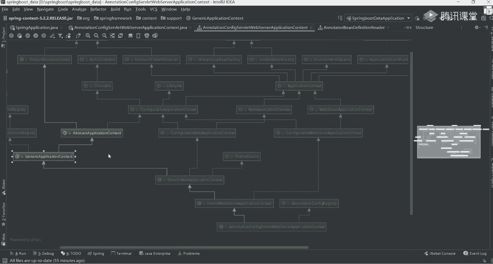

我们再找一下来，想给你们看一下好，里面它是不是也有一个对应的构造方法，还记得吗，什么叫defaullable factory吧，把它拿过来，我们找一下刚刚那个类。

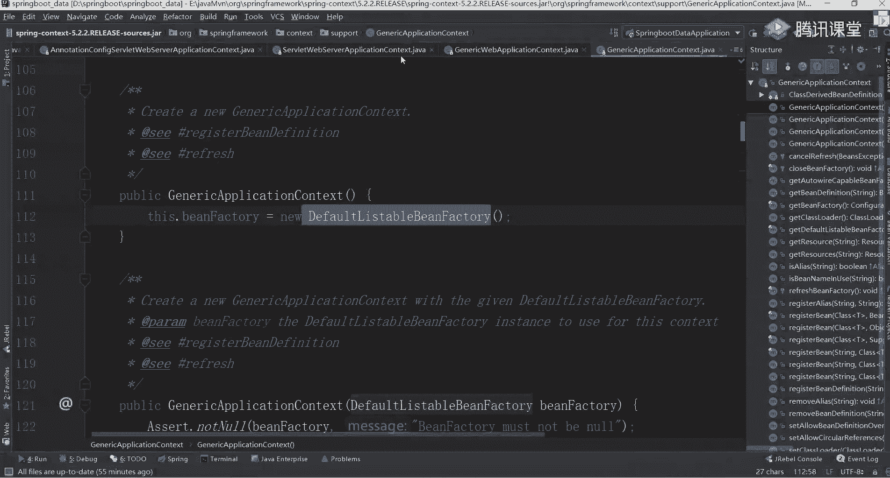

有这类之后。

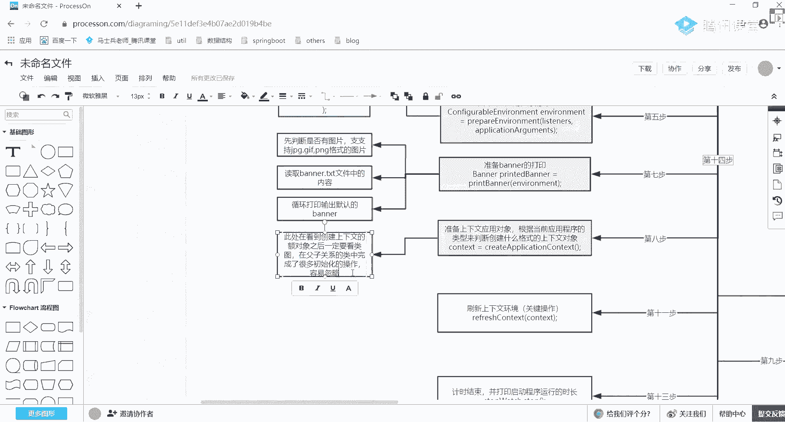

第二个，注意这类。

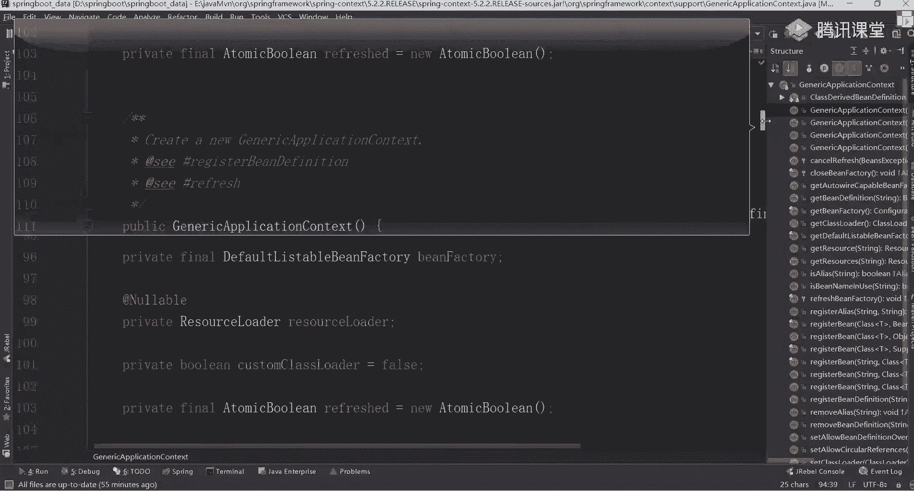

因为高我们再看原版的大a应该已经发现了，像刚刚说的那个类，在后面的时候有很多地方其实都用到了，好一定把两个给我记住了，它的层次关系是怎么找的，一层一层，你是怎么发现它的，一定要知道一个核心，来有印象。

同学扣个一，有没有印象，都有都有这块东西啊，一定要记着他好吧好，帮你们做做做做这个细化了，这里面东西太多了啊，这块完之后我们还要做一个最基本的关联点关联啊。

根据我们当前这个应用程序的一个类型值来做一个基本判断的，好，这块大家注意了啊，两个地方都用到了我们这样一个类型判断，来三把阿凡，他什么东西该第六期，1956819波是设置什么异常报告对象吧。

这对象没啥可看的，就是报告我们对应程序启动过程中，它所涉及到一些异常情况，这块还是比较简单的，还是比较简单的，大家看第十步是这样吧，我准备当前上下文的一个环境对象，这块东西可能稍微麻烦一点啊。

稍微麻烦一点，我们依然一样往里边画对应的一个细节，想想在准备我们这个上下文环境的时候。

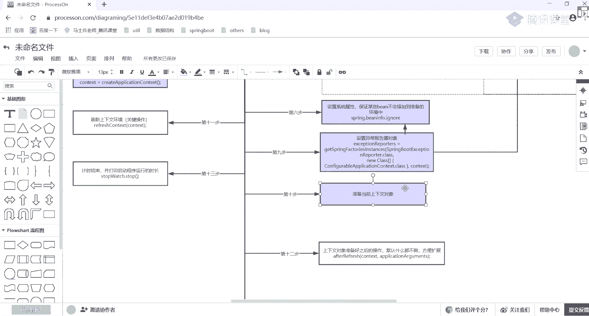

你需要考虑什么事儿，contact的是它给它写完之后，里面做了n多的一个事情嘛，对吧，你想想这里面事情是干嘛用的，我们只说几个比较关键的东西，这个表关键特点，第一个是不是设置我们环境，这不用说了吧。

这没啥可重要的好吧，第三个叫post processor呃，叫application这块儿他做点什么事情还记得吗，判断一下你当前类到底归属于什么类型，然后呢往里边加载一下，注册一个实例对象吧，这也没啥。

这也没啥好吧，大家看第三个这东西。

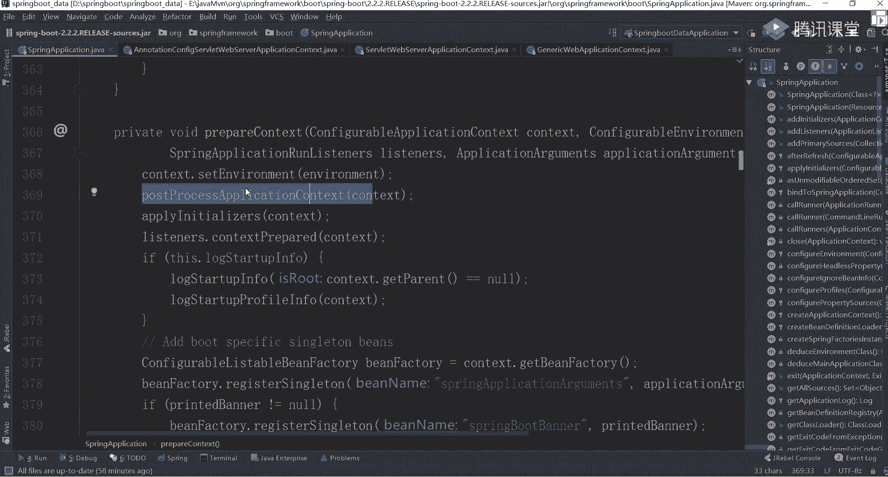

看着啊，剩下的东西你下一周自己自己往前往里边补充啊，初始化器进行执行啊，进行执行，而在这个执行的环节里面点进去。

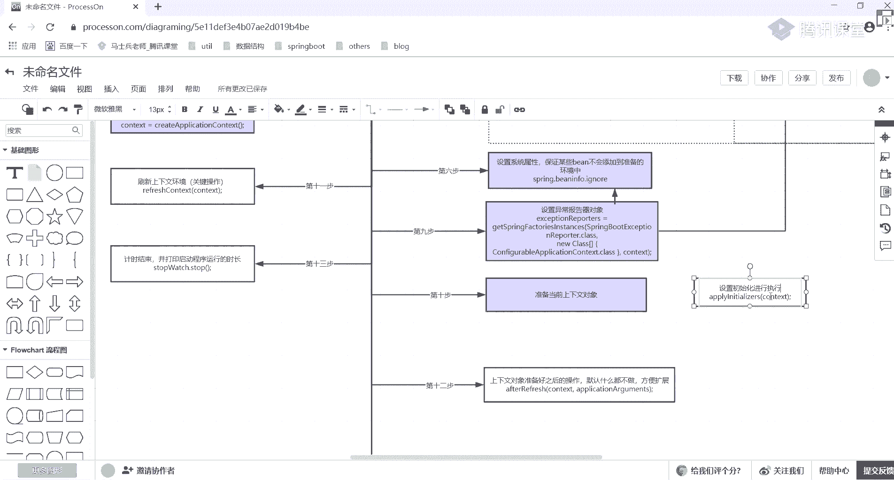

在里面是不是到了什么叫letter，诶不对，这里面是不是也是一循环过程，每次进来之后是不是都有一个循环，循环完之后，一个初始化器都做一个相应的执行，大于执行完之后能获取到对应的一个初始化的一个操作。

说的好吧。

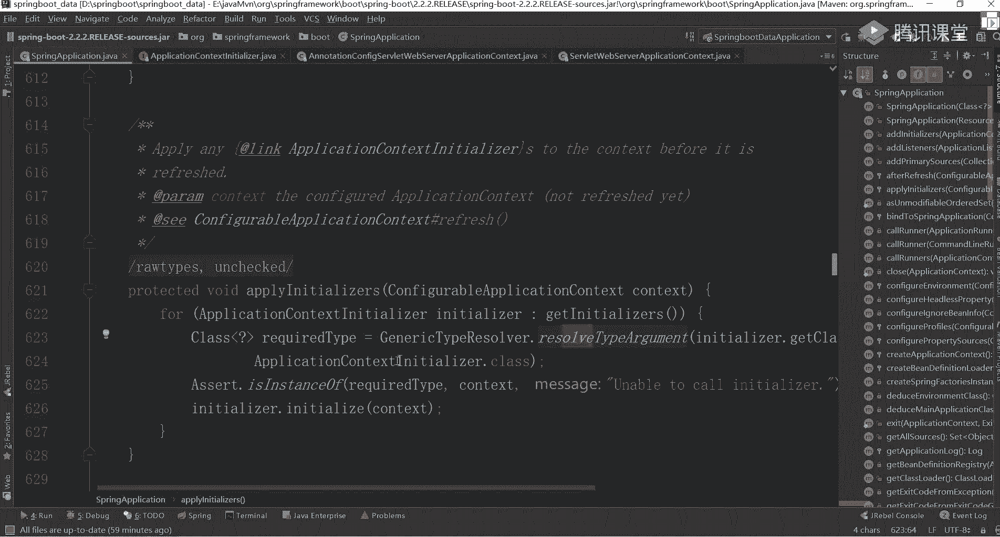

这也一样，把这个细节步骤注注注意就行了，这里面还要强调一件事，我说了后面可能会呃，可能会用到它什么东西呢，执行，然后呢像，in factory，注入了三个叫post，co 2的对象啊。

后续再自动装配的时候会用到味道，啊有有没有点印象了，这块东西什么叫mate，叫catch，mate date，什么东西哦，还有一个config file，什么东西，应该还记得吧。

我当时都都都都讲过这些东西啊，在干嘛，是不是又到我们的listener了，这是不是又匹配上了，这个同学要指向什么地方，让他打一个虚线，他是不是也要调用这样整体的过程，这一模一样的，这一模一样的。

那再往下看看下面还有啥认知的输出，不管它注册单体，并不管它对，还有这东西，嗯，哎呃加载很多资源配置是自动装配，然后呢再死环节，是不是这意思啊，好吧，就这样的一个步骤，这块，下面还有最后一句话。

是不是又是listeners的什么东西拿过来，对应监听器它完成了一个基本操作了，那这块的话也一样，也要指向这个环节啊，啧是不是这个东西啊，这块儿大家还记得吗，来到目前为止，还能听懂同学扣个一，我来带你。

我来帮你梳理一块东西啊，后来把它点个点个四，走，然后上下之间对，是这样的东西啊，破坏了还要自己点一下，肯定要自己点的，你不点的话肯定肯定不行啊，准备上下文对象，这不来再往回返看一下我们的第11步骤。

这干嘛呢，刷新吧，这刷新这个东西我说了是一个关键性的一个操作，好吧，呃重点spring的时候好会讲到之前看没没没看的同学，下来之后自己来搜一下，我们这儿不再浪费时间给你们画这个细节，细细节东西来大家看。

第12步骤，很多就多了台，啊这是不是可以了啊，这块好多了好了，这样写完之后，第12步干嘛了，就方便做一些扩展交易，就是刷新之后要做的一个基本事情对吧，这个东西没啥可默认就是空的嘛。

你之后如果要做扩展的话，可以把这块内容做一个整体的补充，然后第13步骤是不是进程结束，我要往里面打印一些很多新的东西了对吧，最后还有最后一步是运行所有的一个监视器的一个对象啊，然后呢啧啧，大启动执行。

这块儿喝完之后打。

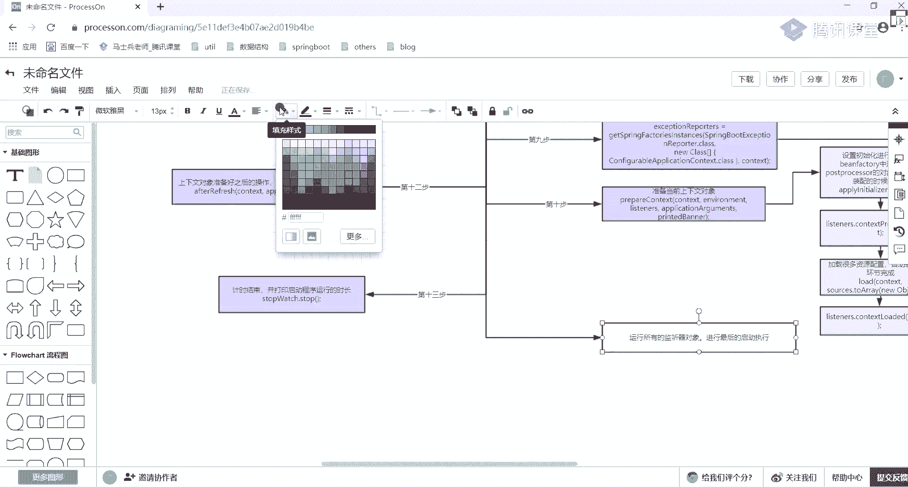

还有别的玩，我拿过来，coroners虽然少了一个步骤，叫listener star，但是我们做备的listen star。

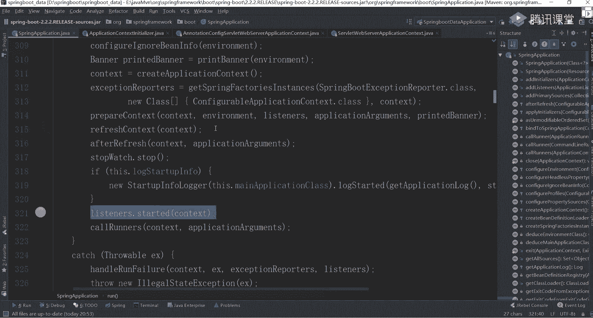

诶这里的步骤，三步骤了这吧，我要被这个东西，我要被这个搞死了，啧啧啧，耦合到一块儿了啊，12步骤是after reflash。

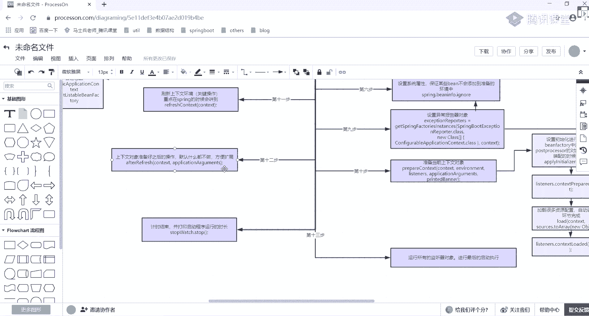

然stole watch上面有这个这个这个东西啊，我start把它拿过来。

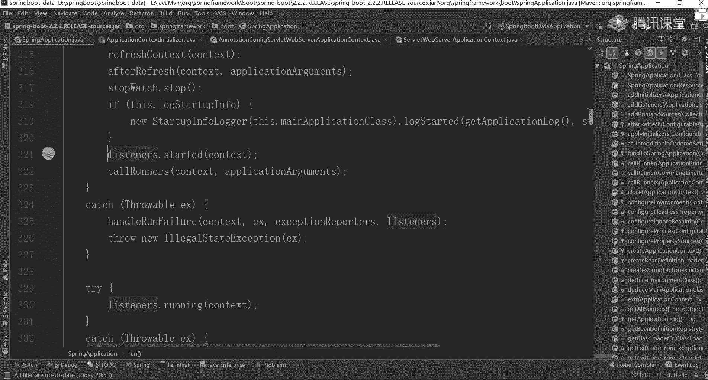

给少写一个步骤，啧啧，再点下线，有种，来，来来14过来吧，从这儿可以吧，哇这这个步骤，那下面我们再多加一个。

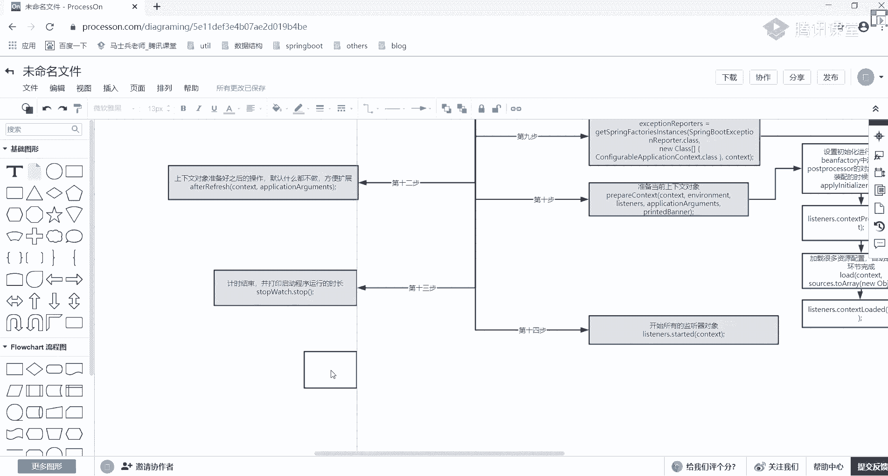

是不是最后一个这东西吧。

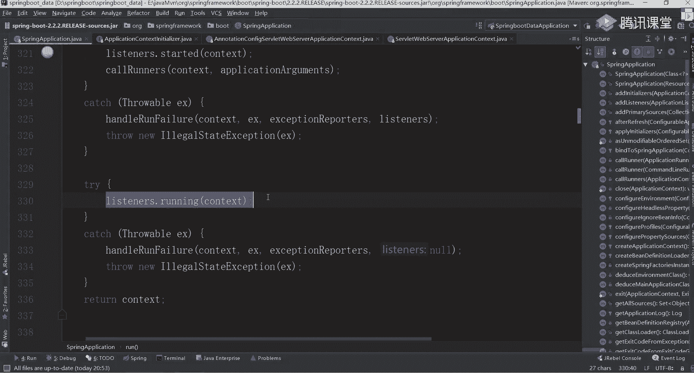

我带你们看这里面的一个核心代码，其实里面几乎什么事都没做一样啊，跟什么事情没做一样，把它来装方法，哎，15步，就搞定了吧是吧，就是我们的一个整体的running这样的一个环节是running的话。

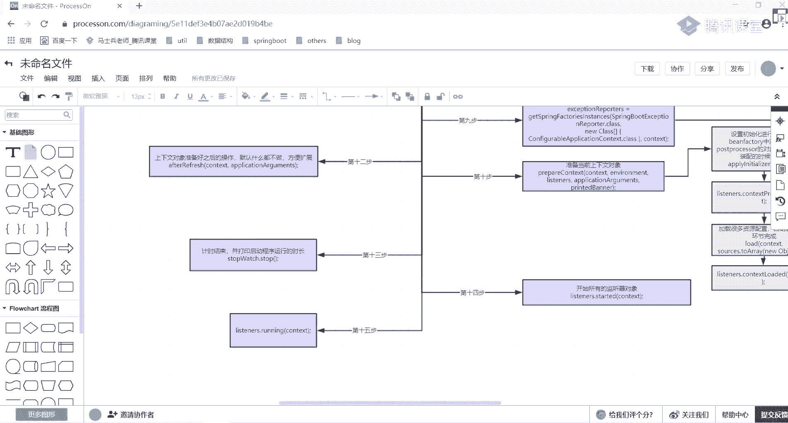

点进去看一下是不是也listener running，我们这儿再点一条线吧。

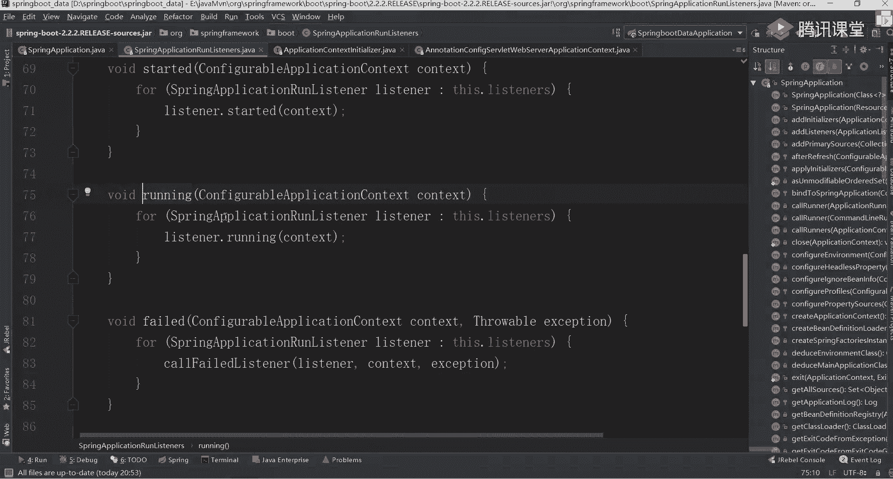

把这个线再点过来，ok这一样的这条线是一条虚线，所以你看过来之后，最左边那个13步，如果这个顺序有问题啊，现在就自己做一个调整的好吧，画乱了啊，来我们刚刚图画这么多，是他能写的一些核心的环节。

我都帮你们写好了，看完这个图之后，有没有感觉稍微清晰那么一丢丢啊，有吗，这句话大家我把那个pos文件也发，大家也发现大家，所以上去之后按照这样的一个顺序去依次点一下啊，依次点一下啊。

看一下整体的一个处理环节到底做什么事儿，每个东西还可以往里边细点，往里面补充什么东西，所以最好啊，呃你画一个比较深的一个像思维导图也行，画这个图也行啊，这块可以做这个图，我给大家说一下，其实之前我说了。

我画过，但画的东西不是这样的东西呃，之前画过一个类似的，大家看就这样的图，这句话写的就比较简略了，我写就比较简略了，懂我意思吧，要简略啊，里面都是一些核心应用呃，写的比较简略啊，不是特别细节。

刚刚给他画的东西是比较详细的，来再写一下boss 2。2。2，过程分析题的过程流程，我会把那个pos文件和那个图片文件都翻，大家在之后一定要自己点那关于的一个启动类这块东西，我们就不再浪费时间了。

下周一定要点分，现在开始我们开始讲一下自动装配相关的东西，先讲自动装配的时候说过了，最终啊最终啊还是要回到我们这个启动过程里面，因为在启动过程的时候，其实它已经帮我们完成了自动装配这样一个过程了啊。

只不过大家可能没看到之后，我们会点到细节的源码里面，看一下它到底是怎么做的，之前你们应该看过一些自动装配东西是吧，我来我说一下你们之前怎么看的，很多人是这样告诉大家的。

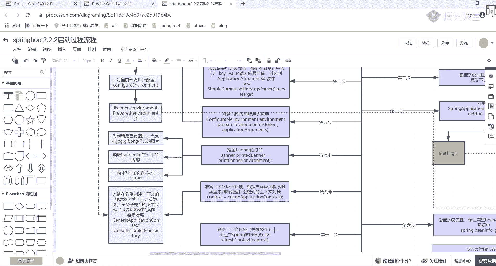

你在看这个自动装配的时候，找到当前主类，然后呢在当前主页里面等一下点，然后这有个东西叫enable auto confia，auto confi。

点进去这个东西叫out of confusion part letter，所以你可以点一下这个类，在搬运类里面完成了很多对应初始化的一些工作，做完之后就搞定了，这不对好吧，你应该知道什么东西。

你应该知道当前这个类是什么时候，将来的，为什么能加在当前这个注释类，它是什么时候找到它的这个类，你要所以之后我你看的时候还会深入到原版里面，我们找这个类到底什么时候完成了，并对象一个注册。

以及它如何进行加载的，听懂我意思吧，保持这个环，我们到时候还要再走一次，还要再走一次呃，有一部分要走一次，大部分就不重不重走了，听白意思吗，你从网上看那些自动转换原理，我不是说的不对啊。

呃他讲的东西比较怎么说呢，没到那个没没没没到那个点到那个点才对，你要告诉他这个整体的一个处理流程行吧，好了多，那咱们就不多说了啊，我们画这几个过程给大家捋了一下，大家捋了一下。

然后后续我们再讲一下自动装配什么的这些东西呃，尽量给大家讲的最最清楚一点，当然我说了，按照我的计划，其实什么源码我看可能还有还有好几节课，是这一次我们讲自动装配，讲一下这个自定义的，咱们就结束了啊。

别东西就在大家说了啊，不太大说了呃，才能有兴趣的同学，我们之后再详细聊后续课程时回答补好吧，那还有啥问题吗，没问题的话，下课了下课了啊，我也休息了，今天上了四个小时，挺累的，大家休息了啊。

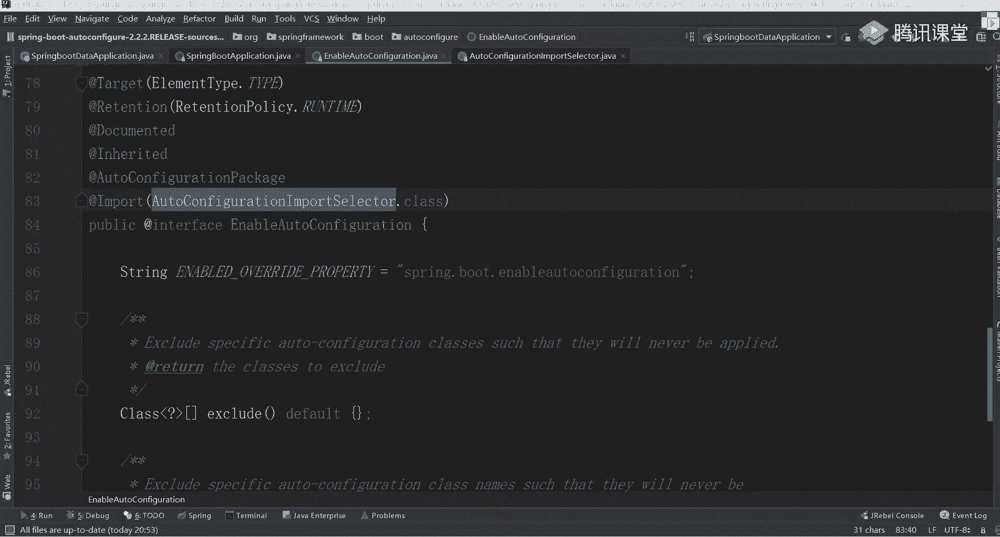