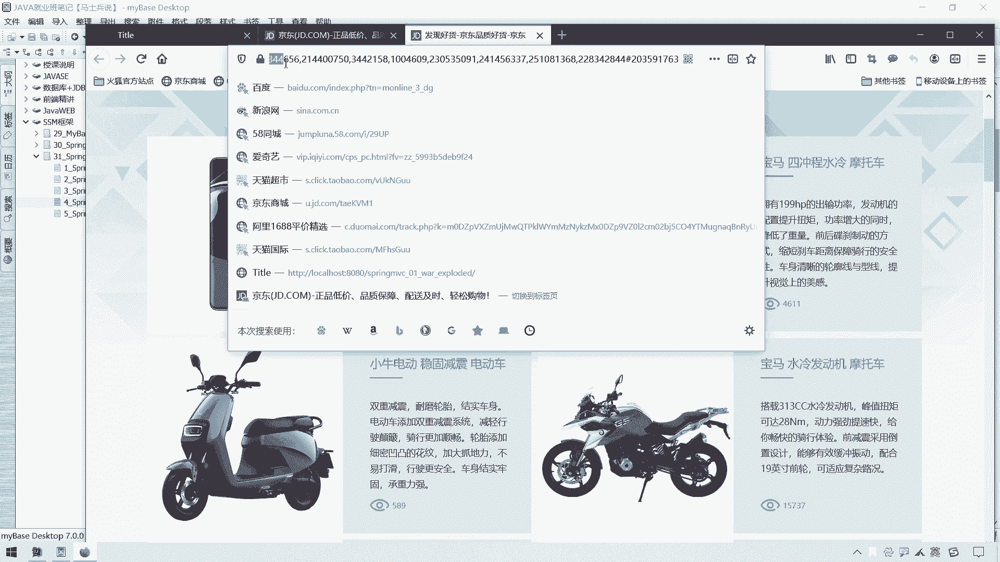
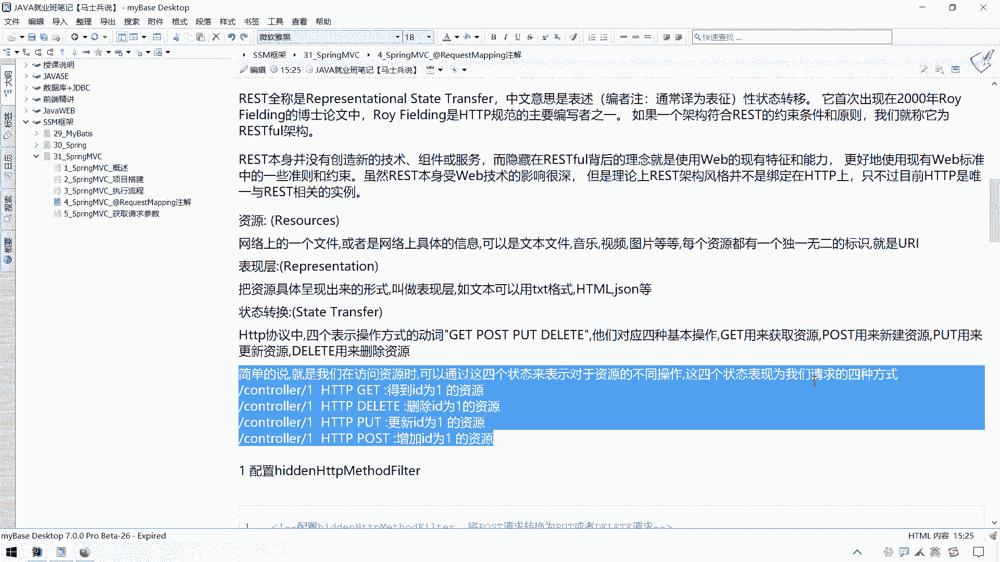

# 系列 3：P76：【Spring】SpringMVC_@PathVariable注解 - 马士兵_马小雨 - BV1zh411H79h

呃接下来呢我们给大家介绍一下这个pass variable这样的一个注解，和一个rest风格的一个支持，呃那我们先说一下这个pass的呃variable这个注解它有什么作用哈。

嗯那么我们正常在请求我们当前项目里面的资源呢，这个u i l或者ui是这么写的，前面呢我就略过了哈，我写这个ui它可能是我们当前这个呃context path，就是我们当前这个上下文路径。

然后后面跟上我具体的作为名，例如它是呃，假设是我们这个嗯叫做嗯a a a诶，点do哎，或者是我们在请求某些资源的时候，来ctrl c拿过来是吧，可能是某个aaa啊。

这个点jsp啊啊或者是a a a a a。html啦，或者是访问我项目里边的这个cs啦，嗯或者是这个js啦等等一系列资源呃，那么这块写成一个css，这块写成一个gs，那么我们如果说在请求的路径中有。

如果要是带上参数的话，该怎么写得这么写，那怎么写啊，那么请求我们这个呃这个control层，然后带上一个参数，用问号作为分隔符写啊，带上应该叫做i d等于一个十，然后呢user，然后再来一个and符呃。

user name啊，等于一个假设叫做r o o t啊，那么这个是带参数的这样的一个写法呃，那么我们说这种写法呢，它是不是叫做restful风格支持的这个呃支持的这样的一个写法呢。

并不是呃其实呢我们如果要是在页面上通过这种写法呢，大致上都可以推断出来就是我们访问的资源是什么，而且甚至呢有的时候带上参数的这些东西其实都是暴露出来的，呃我们可以干嘛呢，我们这种风格其实不是特别的好。

呃相信大家我们在互联网上在访问某些资源的时候呢，并不是所有资源都是什么什么点js p，也不是像是戴上这种点拓展名的这种资源的，可以给大家举个例子哈，呃我们找京东吧，京东上面有很多这种东西。

京东那看吧，嗯随便找一件产品，摩托车来吧。

摩托车像这种东西，我们看一下，你看这个就是符合我们通常那种啊叫提交方式的，一个一个呃一个u i l呃。

这个好像符合restful风格知识还不是特别好找，我们搜一下手机。

那手机呃点一下这个吧。

嗯这个也是呃非restful风格支持的。

哎这还真不是特别好弄的，这种呢就得挨个去世，我找一找哈，这种啊这种啊这种也是点什么。

是html这块真的得发现一下试一试。

我们公司官网试一下呃，在我们公司官网这块呢有这样一个界面。

就是go ob的一个界面，go ob的一个界面，你会发现这块呢我并没有写什么go b。html啊。

或者什么点jsp啊，或者什么东西，我只写了一个勾b。

然后一回车之后呃，你会发现他就做了一个页面跳转，那像这种风格呢，我们说它就是一个呃restful风格的一个支持，那也就是说我们的ur l这一块呢其实可以怎么写呢。

我们假设要是想提交请求某个资源，或者带上某个参数的话呢，我们可以写成这个样子，r e s t r e s t restful啊，风格支持的这个ul其实可以这么写来ctrl c ctrl拿过来。

假设你还是请求这个a点度，当然这个点do是我们自己定义的哈，我们可以不起来，我们直接写成a也行，那后面参数可以怎么办呢，可以这么带来一个斜线，然后来一个十斜线，然后再来一个r o o t这么写也可以。

如果是访问某些页面资源的话，那假设我想请求我这个呃呃请求某个页面，请求某个页面，我直接可以把这个页面名唉放在这一块儿啊，就是不带这个什么什么点拓展名了，这么写也可以。

那么这种就是我们所说的restful风格知识，那你可能会说这块如果说我要不带什么点的话，不带什么点html的话。

那能被识别吗，可以被识别，我们可以在这个control中啊找一个ctrl，然后呢在这里面获取什么，获取ui中所对应的一些路径，然后拿回来之后呢，以这种方式啊，这个请求转发到某个位置也是可以的啊。

那好那么接下来呢我们就来测试一下这个什么呢。

就是这种写法哎我们用这种写法去传递数据的时候啊，或者是呃在我们这个处理单元上，后台ctrl上处理单元上如何获取我们请求的路径中的上面这些数据，当然这只是传递数据的一种方式哈。

那你说如果要是用post的方式的话，那可能就是参数就不往这儿放了啊，或者是呃就是放到呃呃或者是用其他方式，我参数包装放也可以，那能不能够提交数据的，也是能够提交数据的话，我们先测试一下。

看看当我们的u i l写成这种格式的时候，它怎么对应到我们后面的这个control层，动到某个数据单元哈，然后呢怎么解析出这个路径中的这些东西拿出来当成数据来使用啊。

那这个该怎么玩儿的哈，我们在这再来一个control吧，假设这个叫做my control 2吧，叫my control 2，也不叫my control 2了，叫什么呀。

叫做呃p a r e p a t h park cler，唉我们拿这个看出来演示吧，诶诶怎么跑到外面来了，呃，在这个part control里面呢。

我们还是要给它加上一个at controler的一个呃这个注解，然后呢我们在这块添加一个处理单元，来一个叫做public public string。

然后呢来一个叫做呃test test p a t h path，variable vr a嗯，v r i a b l e variable，a b l e variable的一个这个注解的一个方法。

那么在这块呢直接return什么，还return这个这个success s u c c e s s，我们还是往这个success这个页面上跳呃，加上一个什么，加上一个at request map。

加上一个add request making之后啊，那么我们如何在页面上请求这样的资源的时候。

请求这样的写法的时候，能够对应到我们这个啊这个request map呢我们可以这么写哈。

首先第一个我们可以写成一个叫做呃test，叫做test一啊，test一或者是直接写也行，test test past variable，然后呢我们直接在后面再写什么呢，因为我们在这个写完路径之后。

我们可能在我们浏览器上，我们可能在写路径的时候呢，要在这个路径后面再加上一个十，再加上一个username，那我们后面这块应该怎么写呢，对吧，就会出现这样一个问题了，我们在这希望获取个id。

然后在这希望获取它的一个叫做user name，嗯，或许他username，那如果说我们直接这么写的话呢。

跟这个是不匹配的，为什么跟这个是不匹配的，为什么不匹配的。

嗯，还拿过来哈，如果我们在这块这个定义这个路径是这么写的话呢，要求你在这个pass viable后面不能写这个十，必须得写成i d这个值，然后呢在这个use sername这块必须写成什么。

必须写成use sername啊，不能写成root，这个东西并不会把这个东西当成参数给你解析，那如果想当成参数给你解析的话，我们该怎么办呢，在这块用一对大括号给你扣上啊，你的大括号把它俩给扣上，诶。

那扩上之后呢，那么我们这个请求运输路径只要是以这个test pass variable开始的，然后后面只要跟上两段的话呢，诶就会跟他匹配上，匹配上之后呢。

我们可以在这个处理单元里面获取我们在请求映射路径中，这块所放的值和这块所放的值，那真的可以吗，我们可以试一下哈，我们先试一试，看看能不能请求到这个啊，ctrl之中。

然后我们在这输出一句什么输出一句这个吧，test pass verbal 1，哎，我们试一试看看行不行哈，呃那么这个该怎么准备呢，我们可以在index里面还用form表达了吗，这个可以不用放表达。

那我们可以直接干嘛呢，可以直接在请求应试路径这块直接后面拼就可以了啊，就没有这个没有这个用form表的那个必要了。

我们先试试看看这种方式行不行哈，呃我们在这儿呢需要啊，因为增加增加文件了，我们在这刷新一下项目，看看行不行哈，那么我们在这里请求这个叫做test variable，这样的一个什么这样的一个这个呃累啊。

这样的一个这个ctrl，然后一回车你会发现找不到找不到，为什么找到，因为他后面还要求你有两段呢是吧，哎再写成一个什么，再写成一个十，再写成一个user name，写成一个root，那看看能不能找得到哈。

诶这回就找得到了，成功的找到了我们这个呃，找到了我们这个test variable variable啊，这样的一个呃这个处理单元。

但是呢你可能是我们之前说过，就是我在这里面是能够成功地将这个十和root解析一下，解析完之后呢，在我们这个处理单元里面是可以获取我们在路径上在这块填的值和，在这块填的值，那怎么解析呢。

我们可以在这个括号里面添加两个参数，一个是string的一个id，然后再来一个逗号，再来一个string的一个user name，那么用这两个参数来接收什么呀，来接收这块这个值啊，和这块这个值。

那这两个参数往这一放，能够成功地接收到这块的两个值吗，我们来可以试一试啊，我们输出一下啊，输下这个id冒号，加上这个id诶，然后再来一个呃这个这个username，username诶。

加上这个诶username，user，看一看能不能够成功的将这个id映射到他身上，将这个username映射到他身上，我们可以测试一下哈，哦上面等他日日打印完毕，日打印完毕的话呢。

我们说明这个重新部署已经ok了，部署ok之后呢，我们在这再来来刷一下，说完之后呢能够成功访问到，但是你会发现这个id和use name是一个now，也就是说如果我们这么写的话呢。

并没有将这块这个id成功的映射给这个变量，也没有将它这这一段的这个ul，那内容呢映射给这个变量，那怎么才能映射上去呢，我们需要在这块加上这样一个注解，叫做at pass啊。

pa t h variable的一个注解，然后在这个注解里面指定什么呀，指定它这个y轴属性等于什么，等于这个叫做i d，我们现在呢这个注解是加在谁身上呢，是加在这个参数身上了。

pass variable的意思就是这个pass就是路径的意思，variable就是变量的意思，就说白了就是把路径里边的某个值拿出来放到某个变量上，就这个意思或者放到参数上。

然后这个value值是可以省略，不写的也不行，那么这个意思就是我们要把这个路径里面id这一部分解析出来，放那a放到这个string id上去，那我要想把这个eos name解析出来，放这个上去。

可不可以也可以再来一个at p a t h pass verable，然后呢指定这个名字为什么指定为这个username，注意哈注意这个名字啊，要跟我们路径里面的这一段匹配啊。

这个名字自然而然也要跟这一段匹配，有意思，就是把我们路径里面这两段的值拿出来，分别复制给这个变量和这个变量，而我们下面此时这个名字和他非得一致吗，他俩是可以不一致的啊。

然后这个名字参数名一定是跟他一致吗，他俩也可以是不一致的，那么我们先试试加上这个at pass river之后啊，能不能够从路径中直接解析出这个值，诶怎么搞，搞到笔记这一块了，打开我们这个浏览器。

然后在一块再来来一刷新，我们看看后台诶，这个十和root就已经拿到了啊，那么这就是在我们的ul上的这个呃这个体现的htp协议上呃，这个ul上体现的一个呃这个restful风格的一个支持。

通过这种方式可以传递参数了，那你说假设我想控制页面跳转，那你可以直接把什么呀，你直接可以在后面呃，假设我想跳的那个页面的时候，我这块只写什么。

只写这个s u c c s u c c e s s这个size可不可以，可以，你把这个success在后台这块接收一下，接收完之后呢，再把这个值再把这个变量值直接作为返回结果return。

那不就是你对应的一个路径了吗，那这样的话你就会感觉哦在这块只要传一个名字，不需要打这个html jsp就可以直接进一个页面跳转也是可以完成的，当然这个呢是是后话了哈，但是通过这样一段代码的。

我们至少还测试出来了，我们是可以取出什么呢，通过这种restful风格知识的url是可以取出呃，那么我们ul上的一些呃某一段的一些数据的，这是ok的，这是没问题的，嗯，再加一点小疑问吧。

一个什么小疑问呢，这块我如果写成一个integer，可不可以，i n t e这一行integer可不可以，这是个什么意思呢，就是正常ul里面的东西啊，就算这块是什么，这块就是一个数字。

也会当成一个字符串来进行处理，那我这块写成一个integer类型，那我们这个pass variable会不会给我们做一个转换呢，那我们可以测试一下，看一看它能不能够转换，看一看它这个强大之处。

好重新部署完毕，然后我们在这儿再来啊，再来来刷新一下，看一看后台，你看它仍然是可以解析出来的，也就是说它无形之中呢也是给我们可以，可以给我们做一些数据类型的一个转换的。

那么这个爱的possible还是挺强大的一个呃这样的一个注解的，那么在这块呢给大家介绍一下，我们这个ul中这种restful风格的一个支持。

呃那么接下来呢我们可能就要说一下这个restful风格支持，这个rest rest到底是一个什么东西啊，什么叫做restful风格支持，然后在这块再讲一下我们这个http协议中啊。

这个请求的四种什么四种这个请求方式啊。

然后这四个状态分别是什么意思哈。