# 系列 3：P78：【Spring】SpringMVC_参数注入引入 - 马士兵_马小雨 - BV1zh411H79h

嗯接下来我们讲这个四bm mc中的非常非常重要的一个知识，叫做获取请求参数，或者叫做呃这个参数输入都是一个意思哈，呃是一个什么含义呢，就是呃我们要获取请求的数据了，参数了，就这个东西。

那spring mvc呢已经对我们这个请求方请获取这个参数的方式，进行了一个非常好的一个封装，可以极大地简化我们获取参数的方式，那么接下来呢我们给大家演示一下哈，先给大家简单演示一下这种解耦合方式。

参数注入，以及后面呢我们主要使用的这种sol和解耦合方式的这种啊，这个参数输入啊，那么这个不光是推荐，而这个是什么呀，这个是必须熟练的，后面的我们主要就是讲这个东西，但是我们要先理解一下这个东西啊。

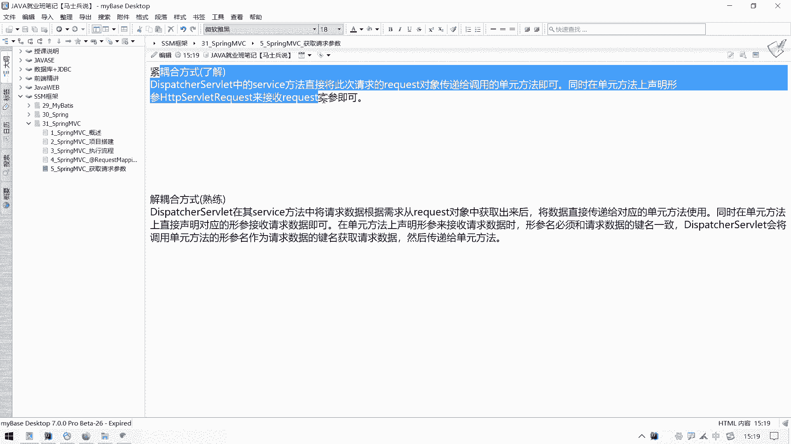

这是什么情况呃，那么我们在我们这个项目里面呢，我们准备什么呢，准备随便准备一个control吧，用来接收参数，那我们这块可以来一个叫做呃叫做test test，dt test b data，ctrl。

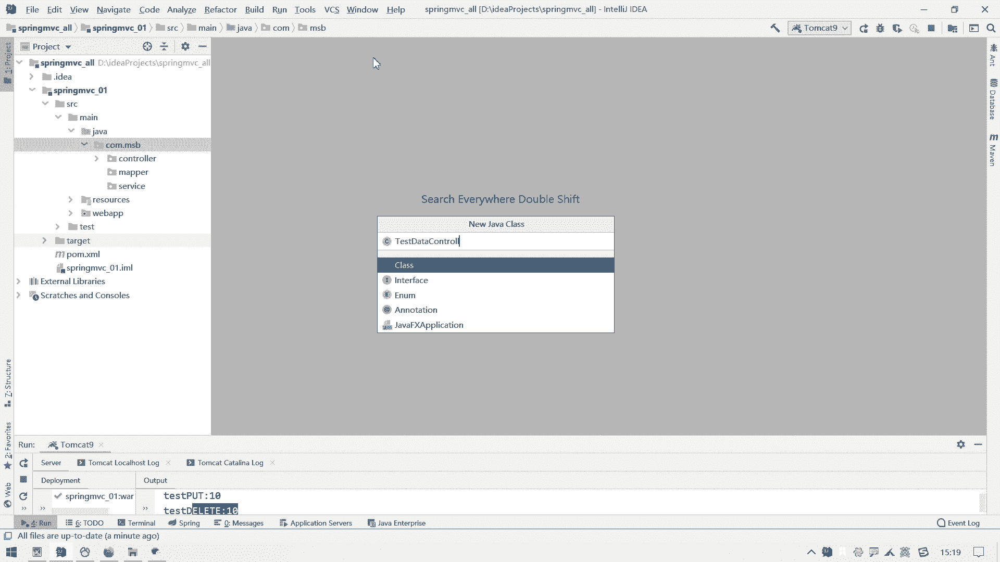

啊test det了哈，然后在这里面呢我们用来接收参数，先来个啊这种什么这种紧耦合方式，就是呕度比较高的方式啊，紧耦合方式哎这个参数主解耦合方式的参数注入呢。

其实啊跟我们这个之前呢在使用ctrl的时候呢是一样的啊，那么什么意思呢，就是呃就是使用什么使用使用这种传统的传统这个http soviet，request对象，那获取，然后呢另一种方式呢就是什么。

另一种方式呃，就是我们的一个叫做松耦合方式，那松或者是解耦合，解开解耦合方式参数，这比较熟悉的参数注入，同意一下a啊，那好那么使用解耦合方式参数数的话呢，它是什么意思，就是不使用什么呢。

不使用这个http server light request对象来获取参数了啊，就开始参数了，哎通过什么，通过这个我们的一些呃这个spring mvc框架中的这个呃处理器适配器啦，呃处理器适配器。

然后呢框架中的这个这个代码功能来自动自动转换参数，转换参数带，然后呢这个它是如何自动转换的，针对于不同参数它的处理方式，以及呢这个它的一个接收效果，我们后面可以慢慢给大家研究哈。

那么我们先给这个传统方式来跟大家说一下，为什么它叫紧耦合方式呢，我们到这我们知道这个http s request它是哪个包里呢，是这个java x javx这个so light这个包里面的呃。

我们可以呃看一下，就是在我们当前项目里面的导入了这个依赖，这个依赖在spring mvc啊，这个零一里面呢有一个叫做呃java x呃，这个so light一篇，那么它是什么。

它就是其实嗯就是我们这个htp sol request对象的来源就是来自于这个包，而我们知道这个j s p a p i和这个so ea i呢，呃在我们这个tom cat里面其实就已经包含了。

它是在运行的时候才取消的，在我们当前项目里面编码的时候呢，是只是编码的时候需要而已，在运行的时候呢，这两个扎包直接由tom cat或者是服务器来给我们提供啊。

呃那么第一种解耦合方式呢就是要通过这个htb so request对象，这个时候呢我们在项目中spring mvc仍然是要导入什么，仍然是要依赖或者是导入这个so light扎包的。

那么也就是说我们的这个supremvc，跟我们这个so let炸包之间的耦合度比较高，你需要导入它才可以，这就是我们所说的一个解耦合方式，而下面这个松耦合方式就是不用这个htt so request。

在我们编码的时候呢，压根我们就见不到这个h tt so request这个对象，这个雷和对象，那么直接就是变成什么呢，直接就是获取参数了。

那这样的话呢我们super m v c跟这个javx so let api这个jb呢，他们之间就没有什么耦合度，这就是我们的一个叫做解耦合方式参数初步。

同时呢解耦合方式参数注入呢在写法上其实也更加简单啊，那我们就来写一个写一个来一个呃，public嗯，反复类型为string，string，起名叫做get data dt get pl来，这是获取参数一。

然后呢在这里面呢呃我们要是想获取这个参数的话呢，在这个参数列表里面，我们仍然可以添加这个http soul request对象的。

那同时呢我们也可以添加什么http so light response对象的a r e s p，也就是说在我们这个呃spring mvc这个这个ctrl层的一个处理单元里面。

我们是可以使用传统的这种http slide request对象，和传统的这个http response对象，然后用它去处理请求，用它去呃这个技术响应，那处理响应也是ok的，是没问题的。

那么我们可能暂时用不上这个对象是吧，直接测试一下这个请求参数，那假设我想在这获取这个请求中的这个呃这个use name和password，我该怎么办呢。

就直接这个ie q对象去点get这个perimeter，然后写上这个呃这个user name诶，变成这样子，username，然后再来一个iq点，get perimeter。

再写上一个p s w d password是吧，接受一下这两个参数啊，然后呢我们在这输出一下吧，那把这两个参数给拼到我们这个字符串里面来展示一下就可以了，然后再来一个password啊。

然后return return这一块呢我们想跳一面吗，如果说不想跳一面的话呢，我们还是可以参照参照我们之前这个呃这个control里面诶，怎么写出来了，这个ctrl这个test rest v里面。

我们把这个ctrl改的改成rest control，这样的话呢我们返回这个东西就当成文字，直接想一个浏览器了，这个rise control这个注解哈，我们在后面那个在那个阿贾克斯在一部那一块啊。

杰森杰森格式字符串一块的，我们会讲一下，暂时你知道加上他之后，当前这里面所有的处理单元都是直接返回啊，这种这种这种东西直接当成文字了，不是当成路径了哈，这个大家先别着急啊。

那我这块测试我们暂时引用这个吧，at rest control吧，呃我们这块直接返回什么，返回一个叫做随便返回一个文字吧，叫做gpr嘛，get pl。

你这叫做这个s u c c e s s叫做成成功的获取参数了，再给他来一个请求路径，叫做request mapping，请求就是入侵这块呢，我们给他来一个叫做斜线test。

就是这样想叫做get data get pero，那就是获取参数通过什么呢，by啊，by这个r e q e s request，通过requests随想来直接获取我们这个参数。

那我们试一试写一个再需要来一个页面，然后请求一下我们这个ctrl j ctrl怎么放这儿了，我把它拖到这个ctrl里面来啊，要不然可能我们这个spring mvc这个注解嗯。

spring mvc的这个boss描，他扫的是我们这个control，你要放到那个位置，可能扫不到了是吧，还是给它放到这来吧，这个带不带点度，这都无所谓哈，那我们接下来写一个风表达吧。

在这块来一个什么来一个叫做呃data page啊，这是一个数据页，然后就是这种form表单，我们随便搞一个吧，来ctrl c拿过来放到我们这个data配置之中，随便搞一个放表单，呃，至于是盖的方式。

还提这个什么方式都无所谓了，这个应该是直接写成一个叫做而已，这个br e q e s把request通过request方式请求，然后这个请求应试路径这块直接写成我们这个叫做呃。

get pm by request这个斜线不要加了，加斜线就要加上下文路径是吧，呃至于请求方式，get post这都无所谓，只要把参数带过去就可以了，而且这种参数带回去。

跟我们当前这个请求方式是不是restful风格知识的无关，无所谓，你是rise风格支持的也行，不是rest f风格支持的也行，无所谓的，那那么我们就用普通的方式来提交点呗是吧，准备两个参数。

一个是来一个in，来一个input，type等于text，然后呢这个value为username诶，不是value为username，是这个name username对。

然后再准备一个pass word，然后name也为这个pass word这个名字一样了，可能有冲突，但是应该也没事啊，我们测试一下看看行不行哈，那么这个form表单准备好了之后。

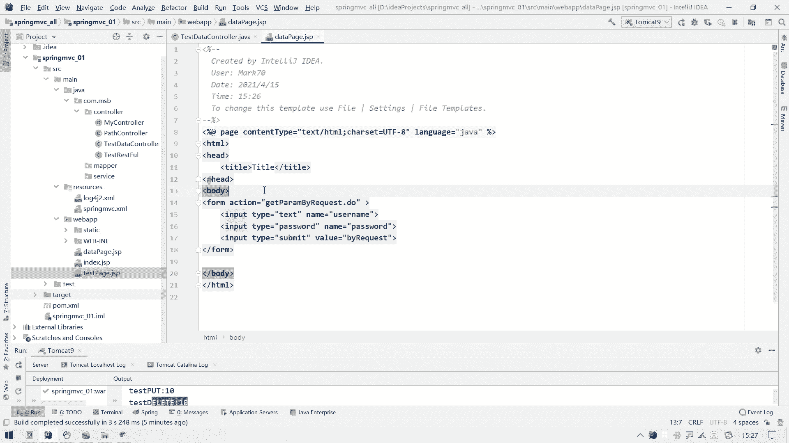

那么接下来呢我们重新更新啊，重新刷新部署一下项目，然后在这呢我们呃访问我们这个叫做data page，点js p回去数据就过来了哈。

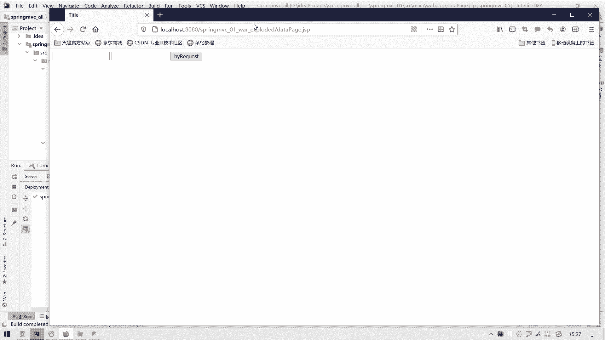

把这个日志呢先给它清掉，省得有干扰是吧，来一个you name为张三，密码是123456，然后来一个by request，哎，看不保存，get parrorequest success。

然后you name和password都已经过来了，然后大家在测试的时候先不要着急用中文哈，如果用中文的话呢，呃中文的话可能会有这个乱码问题，再来一个123456，然后再来一个by request诶。

中文既然暂时没有没有哦，应该是get方式，是get方式，应该默认就没有了啊，top g理好了呃，但是你用中的话还是可能会出现乱码乱码问题，咱们后面再说，现在先不管它。

那么这个是一个通过传统的request对象来获取数据，那我们就搞定了这个传统request对象的话，那你就就就我们之前怎么在soviet里面获取数据，你就在这块怎么用就可以了。

呃那我们说用这种方式好不好呢，不太好，为啥不太好呢，它比较繁琐，比较麻烦，可能现在参数比较少，那你通过调了两个方法获取就ok了就可以了，但是如果说后面参数比较多，而且参数结构比较复杂的时候呢。

我们通过这种方式呢会给自己增加很多的代码量，而且呢它和我们这个斯维特耦合度啊，他们这种关联性太强了，不建议，那么我们还可以怎么这个呃注入参数呢。

来把这个给他ctrl c复制一下下面这个get pm 2吧，然后在get pad 2里面呢，我们就不用这个request对象去获取参数了，哎这些都不要了都不要了啊。

你要获取的参数无非不就是一个eos name和password嘛，对不对，那好那我直接才会写两个变量，string string也user name，再来一个string password，好。

直接这么写就可以了啊，那我们的spring mvc在处理这个呃，在处理在调用这个呃这个这个control层的一个处理单元的时候呢，它会有我们这个处理器适配器自动的将什么自动将。

它会检测你这个参数的什么参数列表里面这些参数名，然后这些参数名呢它自动到这个request对象里面去给你自动解析出来，解析完之后呢，在调用这个get的pm方法之前，把参数给你注入到这个参数列表之中。

就不用像我们现在在写这么多了，你直接把参数名往这一放就可以了，然后这个请求应试路径这块呢，大家需要注意一下，对，就是那凭什么要把我们这个呃这个form表单我再来一个吧。

来给他ctrl c ctrl v呃，再来一个来一个好人标签吧，来个hr好人标签，来一个闪光剑吧，哈这个叫做这个是解耦合方式，就是no request，嗯就是没有request对象来进行一个处理它。

然后请求方式这块是叫做get pyon by arg name，就是通过什么通过这个ug是参数的意思啊，通过参数媒来获取你提到提交的参数名，不是use name和password吗，对不对。

那好那我这块呢也是一个usname和password，他根据这个名字相同的参数名就自动给你放到这个参数列表上了，我们在这个ctrl的一个处理单元中直接可以使用它就ok了。

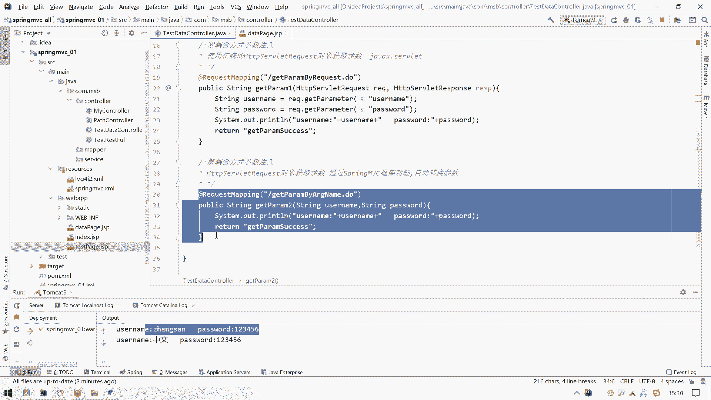

这都能够达到这个效果吗，我们重新部署一下啊，看一看能不能能不能达到这个效果哈，在这儿来进行一个刷新，刷新完之后呢，反正随便写成一个张三，然后再来一个123456，然后来一个no request走嗯。

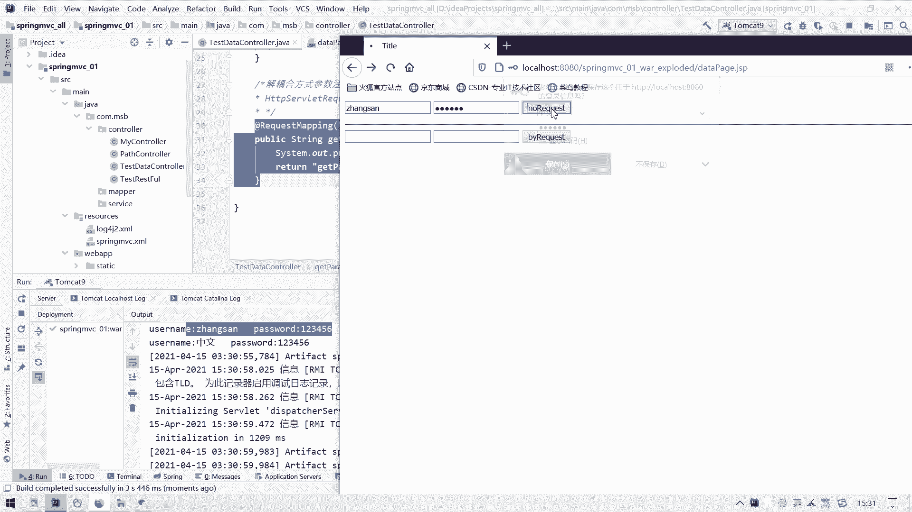

不保存也成功了，看看后台有没有成功接收诶，也成功接收了。

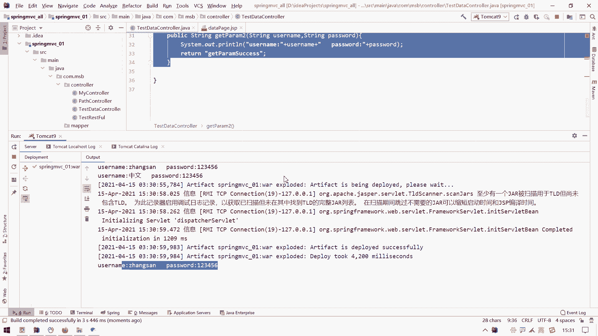

那么这个就是我们spring mc中非常重要的一个知识，就是解耦合方式注入参数，这里面可以直接用这种形式来接受参数了，那如果直接用这种形式来接受参数的话，那它一定要注意哪一个事情。

一定要注意哪一个是这这个这个这个有一个注意项，注意项就是这个参数名就是我们这个处理单元，处理单元的这个呃参数列表中的这个参数名，必须和这个请求请求中的这个参数名一致啊，参数名一致哎，如果不一致的话。

那就不好使了，我们可以试一试哈，假设我们前面这个t叫这个数据这个password哈，呃它不叫password，这块叫做p w d，如果叫做p w d的话呢，那么我们这个在呃处理器是处理器。

是这个适配器在调用的时候呢，因为这个参数名跟我们这个参数列表这块就不一致了，那我们这个password可能就没有值了啊。

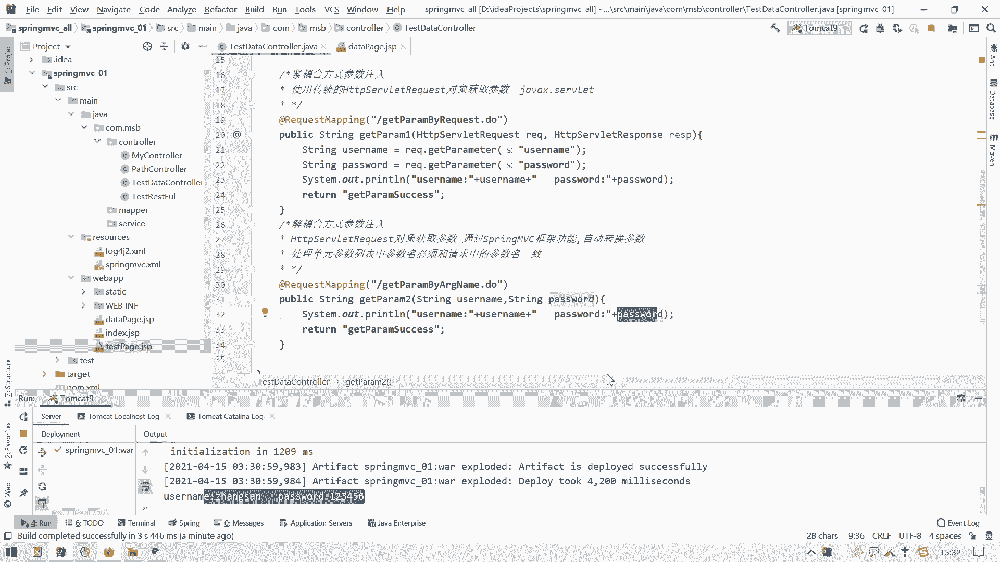

那真的是这样吗，呃我们回到这儿来试一试哈，这个修改的是一个js p，我们直接刷新就可以了，在这写一个张三，然后后面写成一个123456，然后一点no request一提交，看看后台。

你会发现这个password它就是一个now，说明这个password并没有给我们成功的解析啊，那假设这个时候我就就想用这个不同的名字，就想把这个p w d来给它映射到这个pass word上去。

那这个该怎么办呢，我们这块可以用一个注解叫做at，一个叫做呃，这叫做呃。

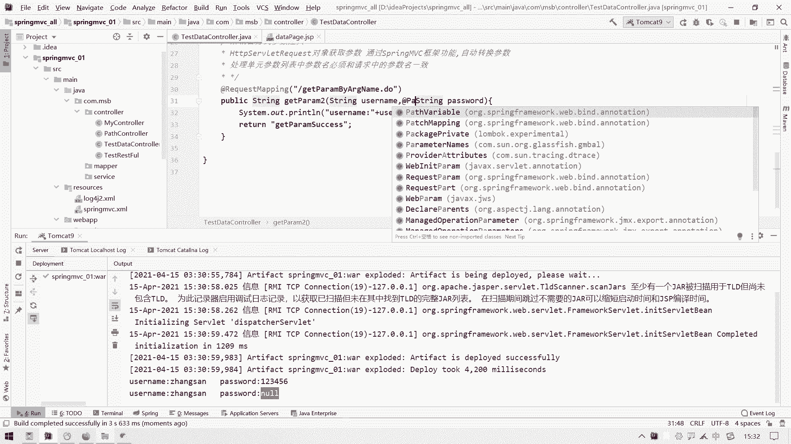

这个做的这叫做at request a r e q u e s t，request a q u e s t request paro的一个注解，然后在这个注解名录里面写个什么，里面写着一个p w d。

呃，意思就是我这个参数啊，在解析的时候呢啊解析的是我们请求中的哪个参数名呢，是通过这个名字来找到的，如果说请求中有个参数名为p wd，那就把p wd这个参数值呢给我们复制到这个string啊。

这个password上去，那么这个时候呢就做了一个这个名字转换的处理，看一看这种情况可不可以哈，呃我们再次呢在这块儿来，说一下处理完之后呢，我们再回到这儿来呃，还是在这儿来一个123456。

然后一点test no request eba，看看这回有没有a就有了就过来了，那么这个就是一个at request parrom这个注解它的作用，顺便在这块跟大家说一下哈，嗯那么然后再来往下看。

在这种结耦合方式注入这块呢，还有一个什么好处呢，就是假设哈我们这个password这一块在我们实际的使用中，它并不是一个string类型，假设它是一个int类型，那如果是一个类型的话。

它能不能给我们自动转化呢，而我们得到这个form表单这块在提交数据的时候，就算你放的是数字123456，那么它也是以这个字符串文字的形式去提交的，那这个时候如果文字形式提高的话呢。

但是我们参数列表这块它是一个int类型，它会不会帮助我们做一个简单的自动转换呢。

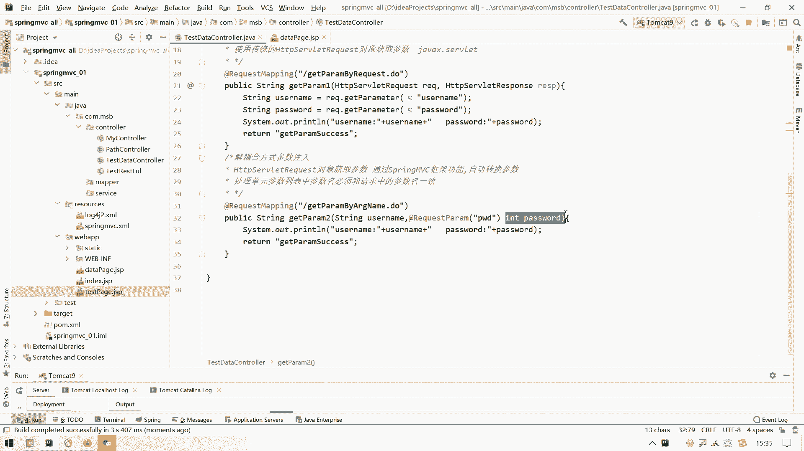

我们可以试一试哈，呃这个呃这个应该重新部署一下项目了，之后呢我们在这儿再来得刷新，它刷不出来都行啊，这个gsp这块没啥变化，张三然后来一个123456，再来一个no requests。

看一看后台这块呢它也是成功的，能给我们转换成int，但是转化他也没有给我们报错，对吧，哎呃那么那如果说我前端这块装的这个数据哈，假设放的是这个东西，放的不是这个123456。

假设放的是a b c d e f g，你这个玩意儿是没有办法解析成数字的，那这个时候我再来一请，求我们看一看后台直接就报错了。

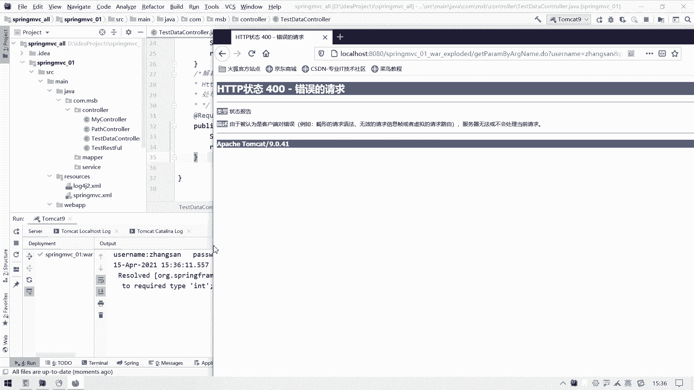

什么意思呀，就是呃他报了一个number format exception，就是这个string这个东西是没有办法可以转成一个int类型的，这个其实就是什么，其实就是处理器适配器呢。

在检索这个参数的数据类型的时候呢，给我们直接用什么，直接用那个integer类pass来给我们解析的，然后呢发现这款解析不了，他也就报了这个异常了，就做number for my exception。

那就算这个转换不了，那那我们在填写参数的时候呢，在这块儿注意一下也就可以了，至少我们在这块呢这个也演示出来了，就是我们这个spring mvc关于参数注入的情感支出，第一个就是它简写了。

你要什么参数直接在那写，就可以了，第二个就是呢它可以进行一定的这个数据，一定范围之内的一个数据转换，当然这个数据类型转换这块我们后面还会再讲一下，因为这个还涉及到一些日期类型。

那么这个日期类型在使用的时候呢，可能啊这个要稍稍复杂一点，它转化起来可能会稍稍麻烦一点吧，然后那么这个是我们这个spring mc中比较重要的一个参数，注入这一块就已经搞定了。

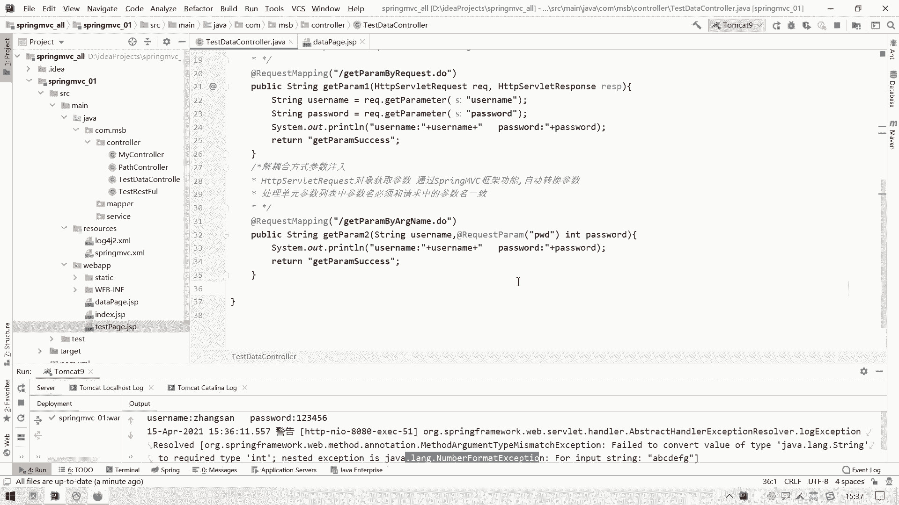

搞定之后，接下来我们学什么，学的就是这种结耦合方式，各种各样的参数它如何注入进来啊。

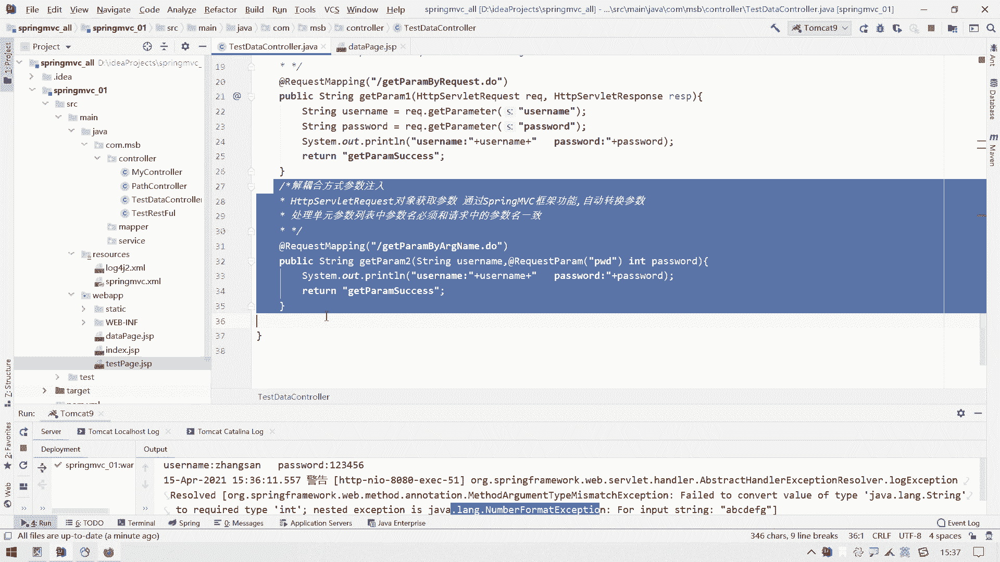

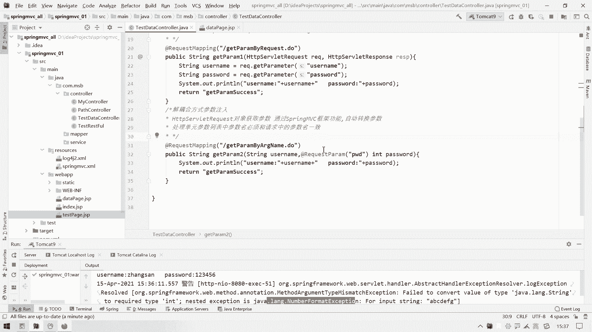