# 系列 3：P81：【Spring】SpringMVC_注入List类型参数 - 马士兵_马小雨 - BV1zh411H79h

日期类型转换这一块呢我们给大家介绍到这里，应该就是足够我们使用了哈，那么接下来我们说一下第三项，就是我们一个集合接收参数的一个问题，那这块呢我们举这个例子。

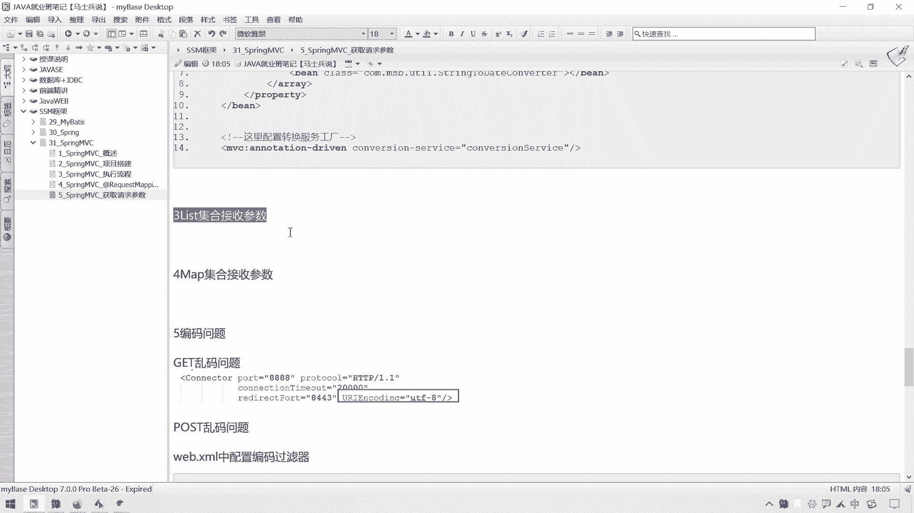

举个什么例子呢，就是呃我们现在现在这个呃这个人这里呢有一个这个转换工厂。

这个暂时不要了吧，这个演示一下就可以了，这个也不配置了，然后我们这个呃date类型转换这块呢，我们还是用什么呢，还是用这个，这就不要了嗯，还是在这个p o g o上呢，这样可能简单一点啊。

那接下来我们举这个例子，举个什么例子，就是这不有个人吗，假设人养了两个人类，人养了多个宠物，那可能养了一只猫，养了一只狗是吧，还养了一只老鼠是吧，哎那么呃我们该如何接收更多的数据哈。

假设我们在这个页面上嗯。

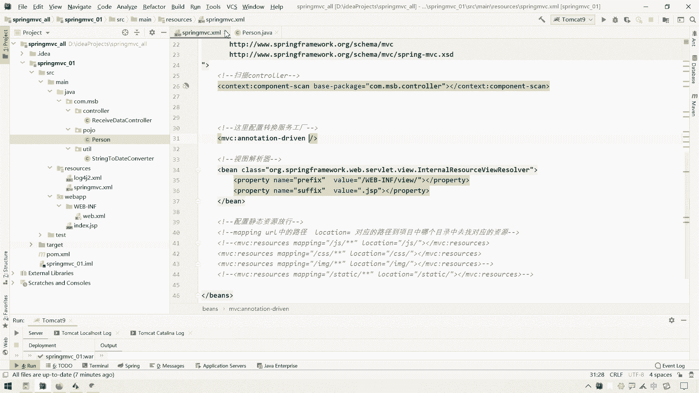

在这个页面上呢再录入一下这个人啊，养了两只宠物啊。

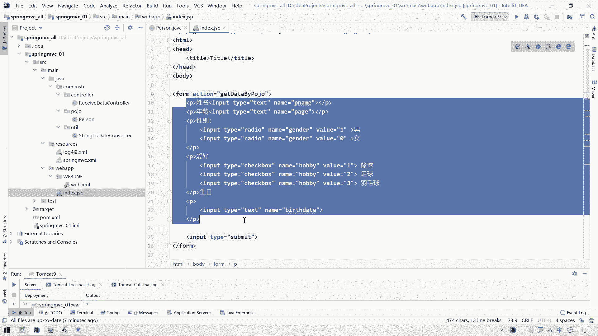

那这宠物呢可能有一只，也可能两只有多支，那我们这块呢可以来个叫做宠物，从，然后呢它有一个宠物一啊，就是第一只宠物，第一只宠物呢我们在这块需要录一个宠物的这个名字和宠物的类型。

我们可以来一个嗯in input诶，怎么写成这个样子，input哎，然后呢type就直接写成text就可以了，然后第一个叫什么name为呃，先不写name先不写。

然后宠物医的这个名字从一嗯这个叫做嗯叫做名字，然后呢呃再给他来一个呃这个类型啊，是猫啊还是狗啊，这些东西再来一个这里一个input input，然后再来一个tape v嗯，这个也是为text呃。

我们先录入一个宠物医，这是第一只宠物哈，就是宠物的名字，然后正好再来一个内部属性，我们可以来一个pet pad，这个叫做tap宠物类型，那如果说我现在后台直接接收一个宠物的话，该怎么办呢。

我们可以在这个ctrl层里面呢再追再追加一个参数。

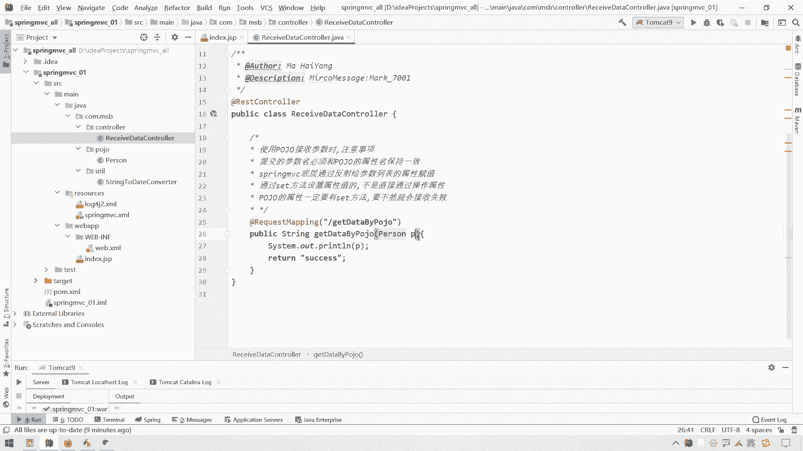

再单独接触他们两个，我可以这样来做，我可以单独的在这个po 9里面再准备一个什么类的。

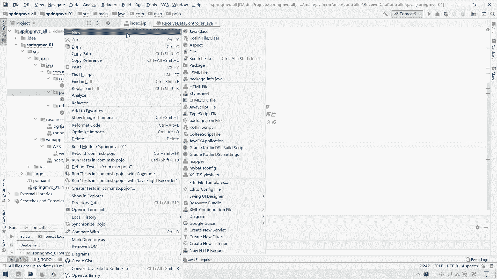

再准备一个pet一个类，然后呢给它加上一个叫做at，art structor at no，structor at data，然后呢接下来在这个让这个pad去实现我们这个序列化接口。

s s e i序列化接口，准备两个属性名，private stream，加一个private street，然后pet type，然后呢我们用这个对象，用这一个pet对象来接受什么。

来接受前面这块可能会去传过来的一个关于宠物的一个信息，pet pet，然后呢我们在这块唉输出一下这个pad，看看能不能够接收过来哈，同样的，那么这两个参数的名字跟什么呢。

跟参数列表里面这个对象它的参数名字保持一致了。

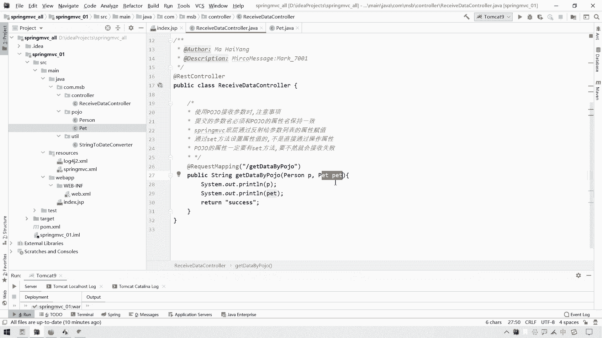

那一致的话就会把这个数据呢封的到这个pad对象身上去，我们看一看能不能够封装进来哈。

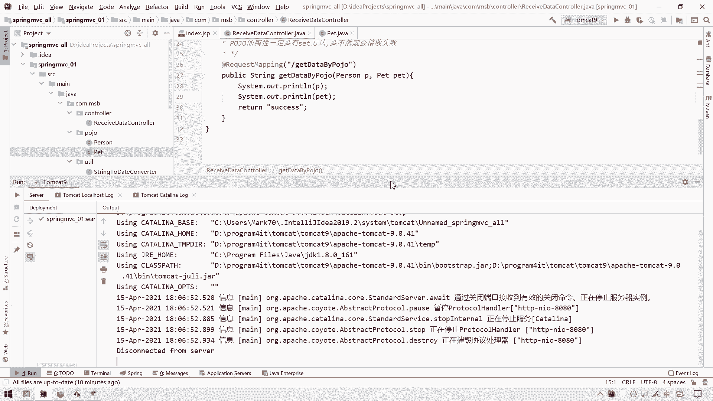

那之后呢我们回退一下。

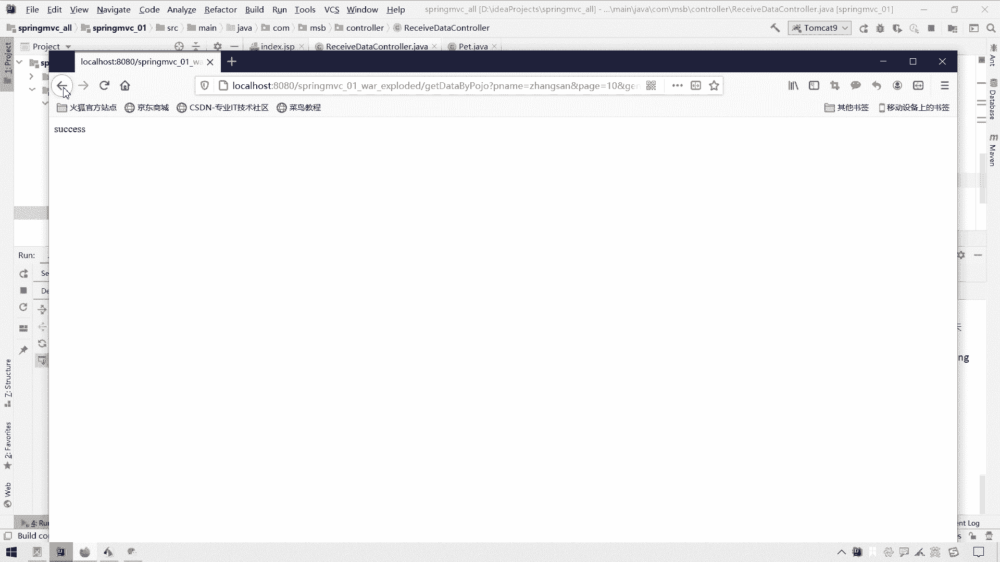

然后重新刷新一下这页面哈，来看一看姓名啊，这就写张3年龄十岁呃，性别随便给他一个把爱好，生日1993杠杠一杠一杠一杠四也行呃，第一只虫姓名叫做呃tom，然后类型的是一个cat。

那是一个汤姆猫，然后一点提交查询，看看后台呃，它确实能够吸收到这一个pet了。

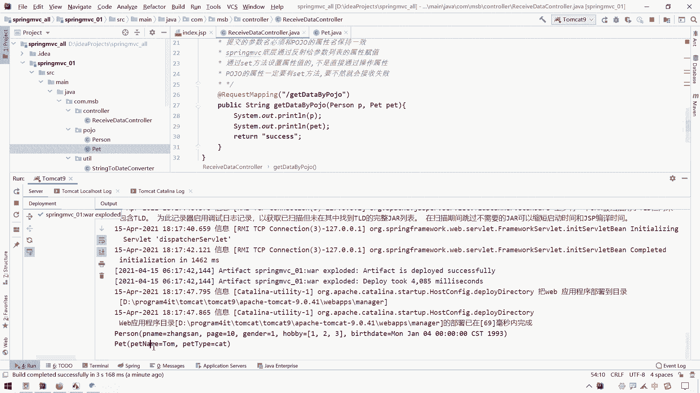

那好那假设这个时候呢人不只有一只宠物，它又来了一只宠物。

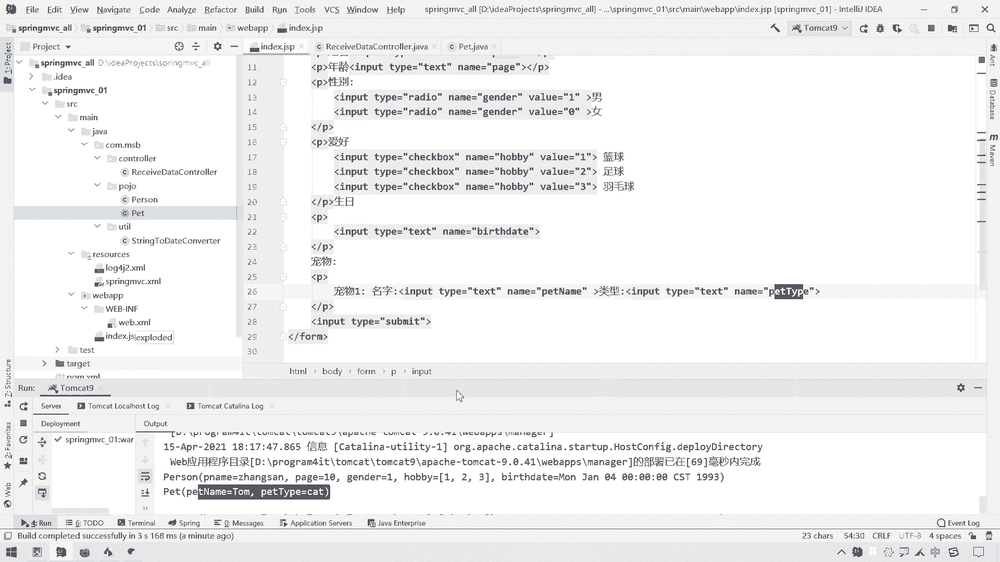

再养只宠物，那怎么办呢，那可能就要在这块录两只宠物的名字，那再来个宠物二诶，也叫做pad type，那这个时候呢我们后台在接收数据的时候呢，这一直pad这一个对象就不行了，我们再给它改成什么。

改成一个list集合来接收类似集合里面组装数据类形式，什么是一个pet cat，让它叫做pet啊，这个path，那这个时候就会出现一个呃很大的一个问题，出现什么很大的问题呢，我们把这个来给他呃。

右击splate article，呃看这哈，就是我们现在这块呢这个参数列表里面呢有两个，这个可能要产生两个pd对象了，在提交参数的时候，它就会提交两次，然后pad type也会提交两次。

那如果这两个东西都提交两次的话呢，我们如何让他指定，这会形成一个对象，往这一放呢，再如何这个东西再形成对象，再往这一个集合里放呢，对吧，那么我们要指定什么呀，我们要指定往这个集合里放。

而且要形成两个什么，形成两个对象，那我们这个name这块该怎么写呢，这么写，首先写成一个p e t s，那就代表我要往这边，我要往这个集合往这个pass这个集合里面去放什么，不能呃。

这个集合里面呢会形成多个pd对象作为元素，那我们在这块可以写一个中括号，写一个零，然后呢打成一个点，意思就是什么意思，然后同样的后面这个也是再来一个p e t s pass诶，中国号，然后写一个0。

2哎，也是一个点哈，就是后面这个呃pad type，我要给它放到这个集合的元素啊，索引为零的这个元素这个对象身上去，那么他们两个他们两个就会封装成一个对象，这一个对象就会放到这个集合中，索引元素为零。

那下面这个也是类似的，就是一个p t s中括号，它的索引就是一了是吧，打个点儿是这块，再来一个p e t s中国号，它也得是个一了，然后再来打一个点就可以了，那么这样的话呢它就会呃在集合中形成两个元素。

这块指的是集合名，这块指的是元素，那个索引往哪个元素上去放，那好，那这个时候我们在这块遍历一下这个pass，看一看能不能够成功的获取这个数据哈，s o u t p e t s，我直接输出这个集合。

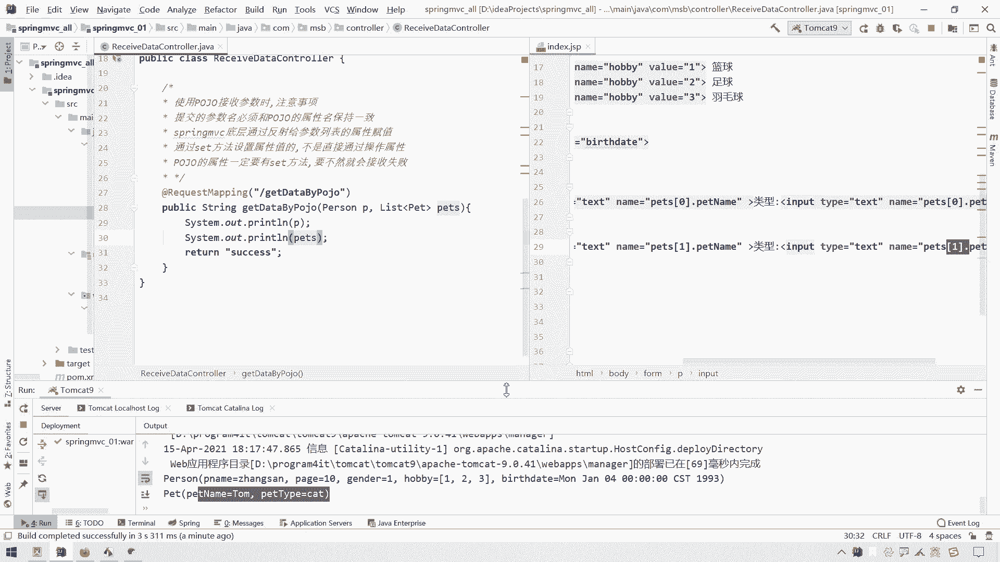

那这个时候呢我们再来重新来部署项目，重新部署完毕，然后呢我们在这块呢得刷新一下这个页面，因为数据多了嘛，我们只放这个宠物名哈，只测一个宠物名字了，一个是tom啊，它是一个猫，再来一个jerry诶。

他是一个m o u s e mouth啊。

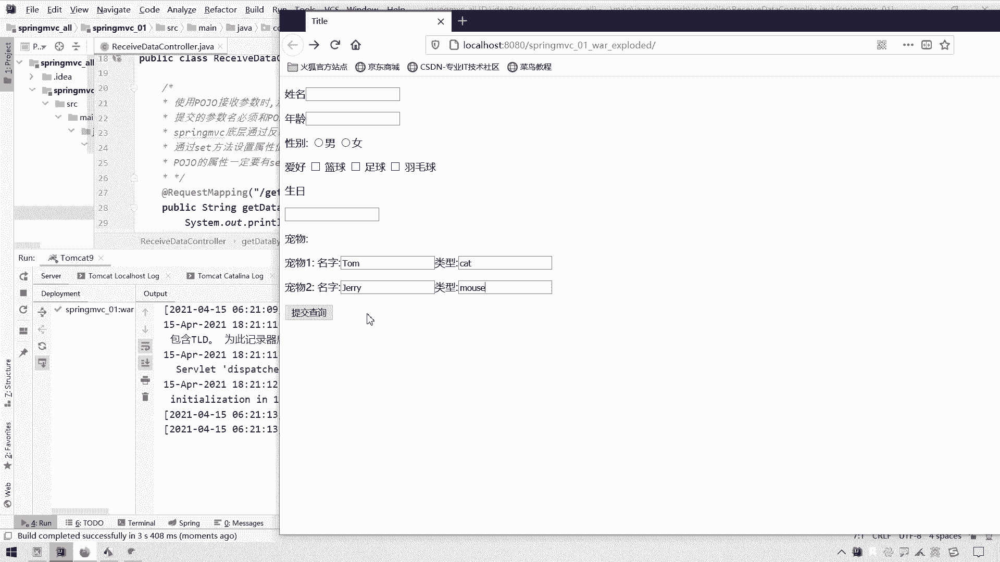

一个老鼠，一个天查询出错了，说有什么错呀，no primary single，public constructor found，什么什么类似，no default construts at。

这应该是一个呃主要的构造方法，你这个类似集合这块呢，应该是我写成一个具体的一个集合吧，叫做relist，a realist啊，好呃，能不能说我这个这个类中哦，arno altera已经写了呀。

嗯然后我们看看这块名字呃，pad type，这个ok没问题，我把这个参数列表呢改一下，改成l list，好像不改也行呢。

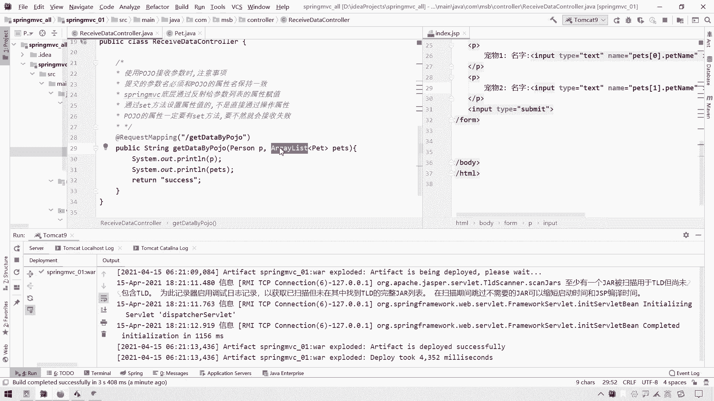

我们看一看这个日志是怎么报的，那应该就是我这个参数列表这块呢，我先用这个俄罗斯试一试吧，看看用类是不是就好使了啊，把这个日先清掉，回到这儿来，回到这儿来嗯，再来提交一下，出来了。

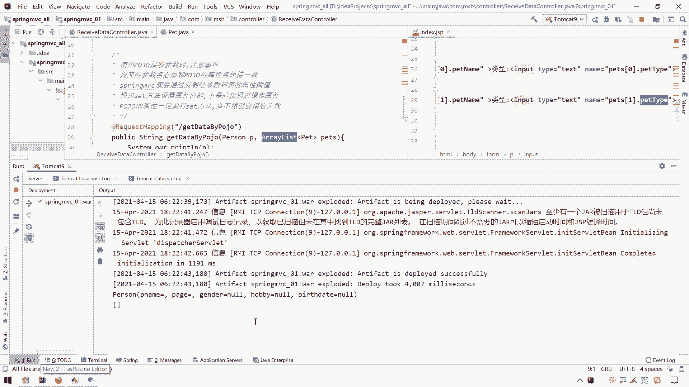

出来之后我们发现一个集合，它是一个呃这个空的，这里面应该是有一点小毛病，我这里调一调。

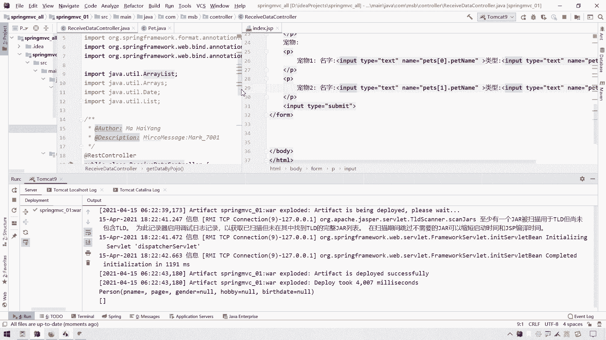

把这个改成release也不行，那再改回list哈，呃跟大家说一下，为什么不好使啊，原因就是呃如果我们直接在这块用这个类似集合来接收啊，这个对象，这个对象呢在理论上似乎行得通。

但是事实上的supremc不允许我们这么做，我们在直接接触类似集合的时候呢，有两种方式可以处理，要么就是我们在后面学到的用一个什么，用一个这个json格式，用这个js把这个前面数据转成json格式。

然后呢传给他呃，要么就是要对这个类似集合再次进行封装，什么叫再次进行封装呢，就是不要直接把它放到这个参数列表里，放哪儿呢，我们可以放在这个person对象，呃，person这个类里面。

然后呢把它作为一个person类的一个属性来处理，这类中添加一个什么，添加一个a private，来一个list集合，然后里面写成一个p e t，然后里面写成一个p t s path，这么写。

这么写的话呢，呃那么呃我们就在参数列表中就不用再写它了，然后就不用在意它了，为什么不用在意他了，是这样的哈，我们前面这个pass是谁的，这个pass必须啊，这这就不能再输出了。

这个path必须是我们p对象的某个属性的名字，哪个属性的名字呢，就是这个属性的名字，由于这个属性是一个类似的集合啊，那么这个类似集合里面放元素的时候呢。

就通过这个哎这种放括号里面放索引的形式来把元素呢啊，给它注入到这个集合里面的呃，把这个数据呢给它注入到集合里面的，所以尾灯的元素索引为一的元素身上去，那么我们试一试这种方式。

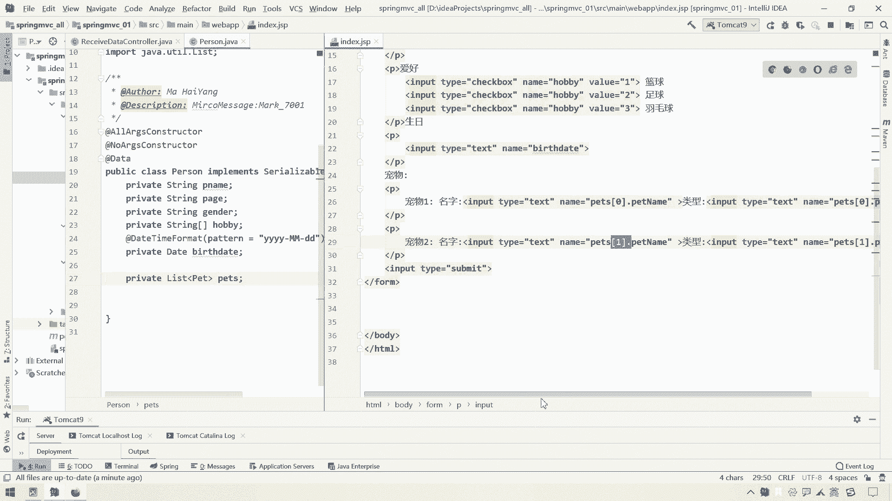

看看能不能成功的接收我们这个呃类似集合啊，来我们试一下呃，在这呢重新部署一下项目，额部署完之后，我们还没有测试呢，我们在这块还得输出一下这个p点，get pts呃，就不要这行吧，这么输出也行啊。

这是单独获得这个pass的类似结合输出一次，这次是整体输出p整体输出p的时候。

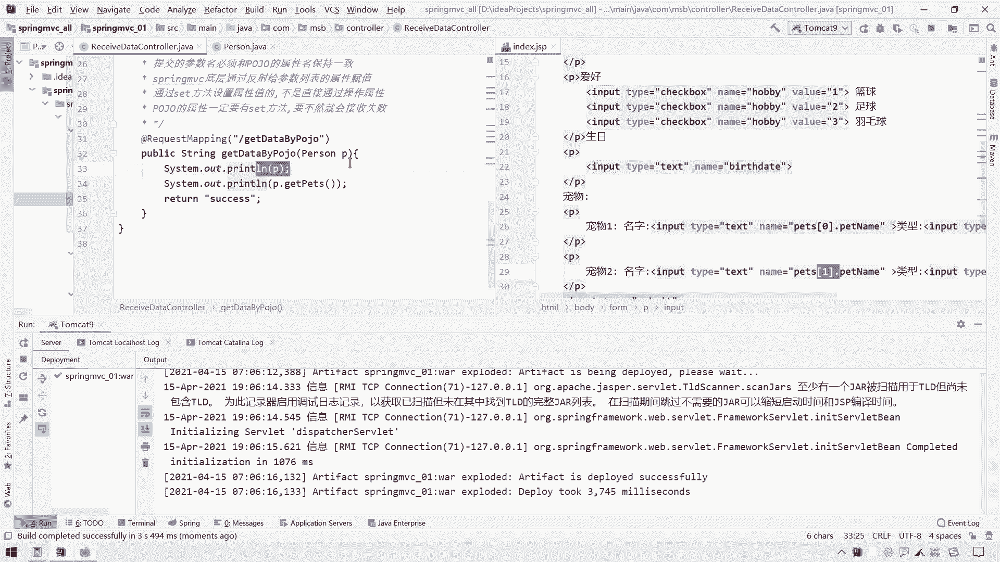

他也会带上这个path这个集合，我们看一看此时能不能够啊，说到这个啊类似集合啊。

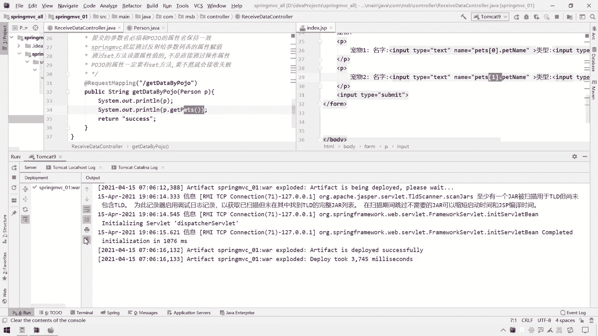

再重新部署一下吧，然后等它重新布署完毕之后呢，我们提交一下这个phone表单，提交一下。

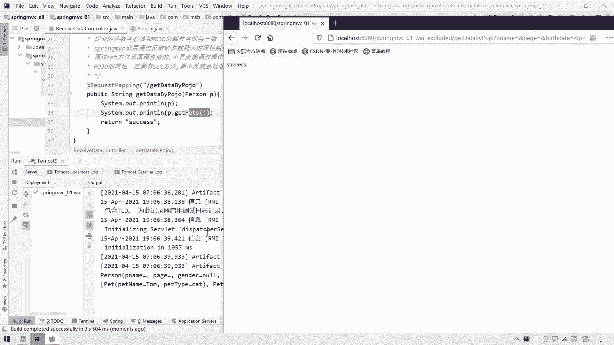

提交之后我们看一看哎这回就可以了啊，你看这个类似这个person中就有这两个pet对象了，单独获取两个pd的相应输出，就是这样的，你说前面这些信息怎么没有啊，因为前面这些我们也没有在这块放纸诶对吧。

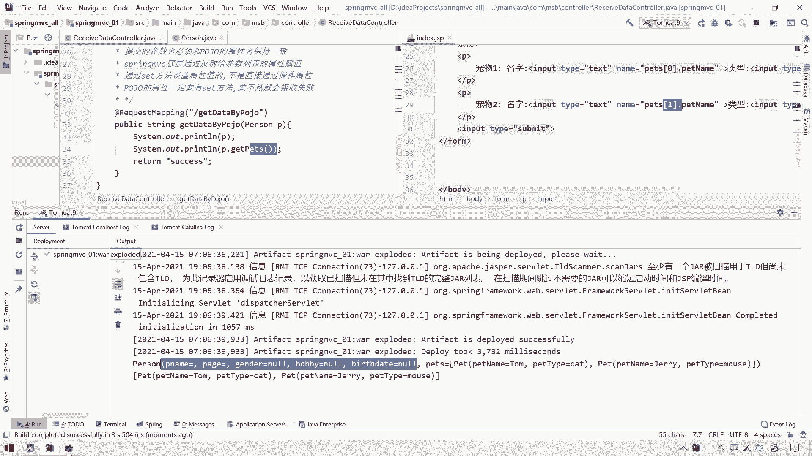

那么这个就是用呃一个呃这个control来接收啊，类似集合的一个这个数据哈。

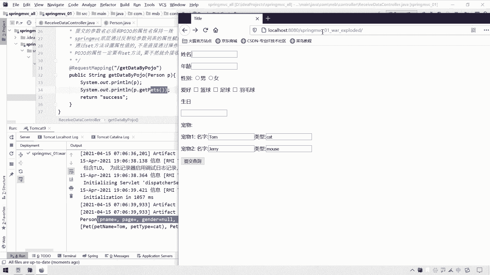