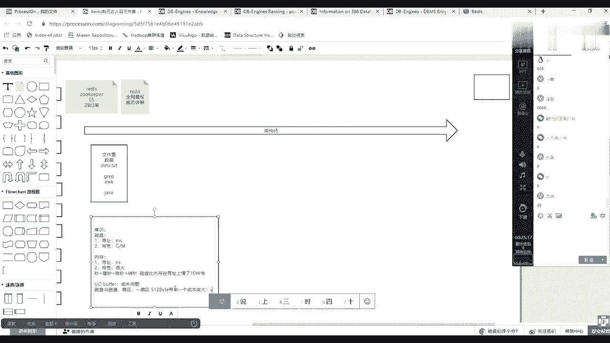

# 系列 3：P83：【Redis】常识介绍--磁盘、内存、IO - 马士兵_马小雨 - BV1zh411H79h

有一些常识。

常识常识是什么意思，常识不是你该炫耀的知识点，常识你必须要知道的，但是在这呢我们统一来说一下这个常识，就是首先在计算机当中。

数据是存在磁盘，数据在磁盘里的，那么以磁盘的维度，它有两个指标，第一个是寻址，寻址的速度是毫秒级的，然后第二一个是带宽，也就是说单位时间可以有多少个字节流过去，多大的数据量流过去。

然后基本上是g或者照这种级别啊，就是多少g或多少兆，几百兆或者12g这么这样的一个一个带宽速度。

另外一个就是内存，内存它有一个寻址。

它的寻址是纳秒。

10纳秒，那么秒这个时间单位里边儿秒，然后再往下小是啊毫秒，然后再往下小是微秒，微秒，再往下小是纳秒。

这应该都知道。

就是磁盘在磁盘中获取数据的时候，它是黄焖鸡很慢，然后但是在这个数据如果在内存里的话。

找到它，把它放到cpu计算，一定会很快就进了一个一个常识。

磁盘比内存慢了10万倍。

在选址上，慢了10万倍，大家注意啊，是寻址是寻址上。

是寻址上卖了10万倍，后边还会出一个小的知识点，然后内存的带宽。

内存里面数据来走，这个带宽一定会很高，就是它的带宽。

但凡多大我忘了，但是一定会很大很大。

因为内存就直接怼到我们这个cpu去计算啊，他有他直接走的那个数据的这个cpu的全能全能总线。

所以他无论怎么样，内存各种数据。

主要的内存里各种优势是优于我们磁盘的，然后还有一个小常识没有讲过的小常识。

还有一个小常识就是io 8分。

然后bug什么意思，我就用了一个buff，我就用了一个buff，首先其实这是一个成本问题。

什么叫成本问题，磁盘有扇区就知道和扇区迟到迟到。

和扇区。

那么一扇区啊。

一扇区多少字节，是不是512个字节，这应该是基础常识，这都是基础常识，那么这个时候注意有一个成本问题，是什么叫成本问题。

如果我们放了一个硬盘，这个硬件的时候都是最小力度。

以一个扇区，以一个512来找，那么一块硬盘是不是1t2 t是不是会有很多612，那么每一个512在哪呢，我的数据在哪一个512的那个里边放着呢，那么这样你要明白一个点，就是如果容器就是一个区域足够小。

那么它一定带来一个成本。

成本变大，什么成本变大，索引。

也就是你如果用，如果一个t里边都是512这么一个一个一个小格子，小格子，这样小格子的话，那么你上你上层操作系统当中就准备一个索引，这个索引就不是四个字节了，可能得八个字节或者很多个字节。

他一个能表示一个很很大的一个数字，一个区间才能锁定住这么多的512个这个小格子。

所以成本会变大，缩性变大，这个所以造造就了一个东西。

就是在我们格式化磁盘的时候，有一个4k对齐，对不对，是不是会有一个4k对齐，也就是真正使用硬件的时候，并不是按照512个字节为一次读写量，他会把这个变得更大一点，你读一个字节读512。

读1k他给到硬盘了，硬盘都咣当给你返回4k它是如果你看512跟4k就差了很大，它俩大小就不一样了，那么一个硬盘512很多小点点，4k可能有人会变少，那么这时候其实索引的体量大小就就就就会随着变化。

所以一般磁盘都是4k为这个默认我们格式化4k操作系统，操作系统吗，无论你。

读多少都是最少4k从磁盘的都是队长。

从从村拿这个这个这个事儿，这个知识点。