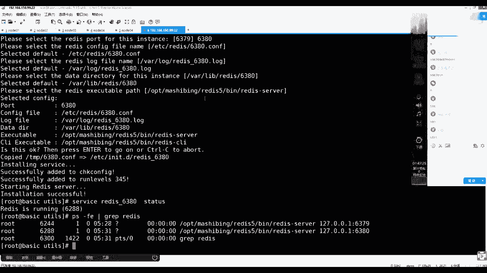
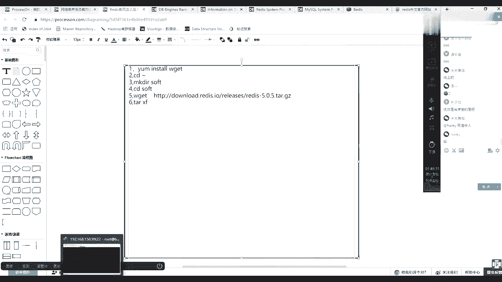
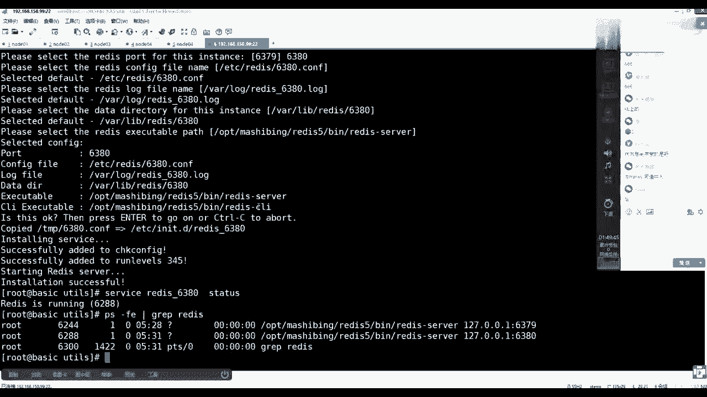
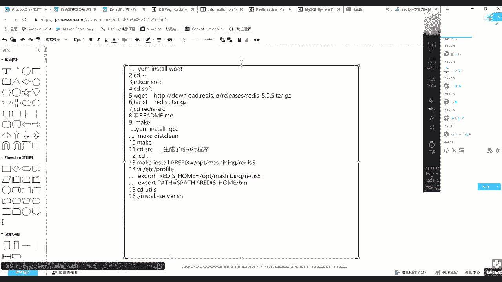
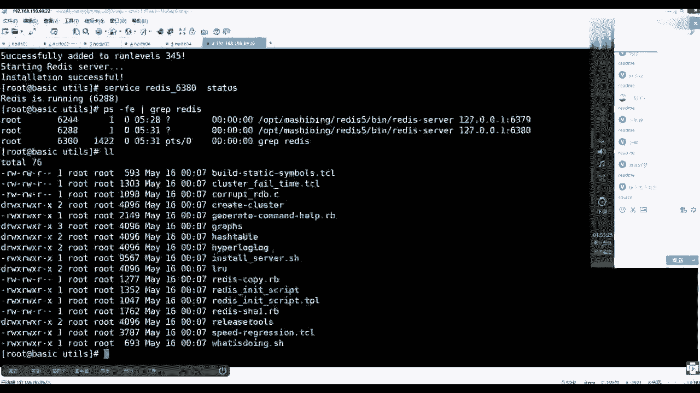
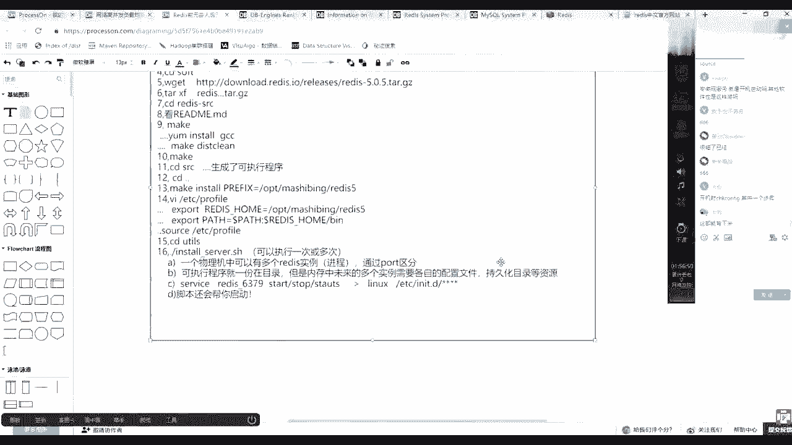
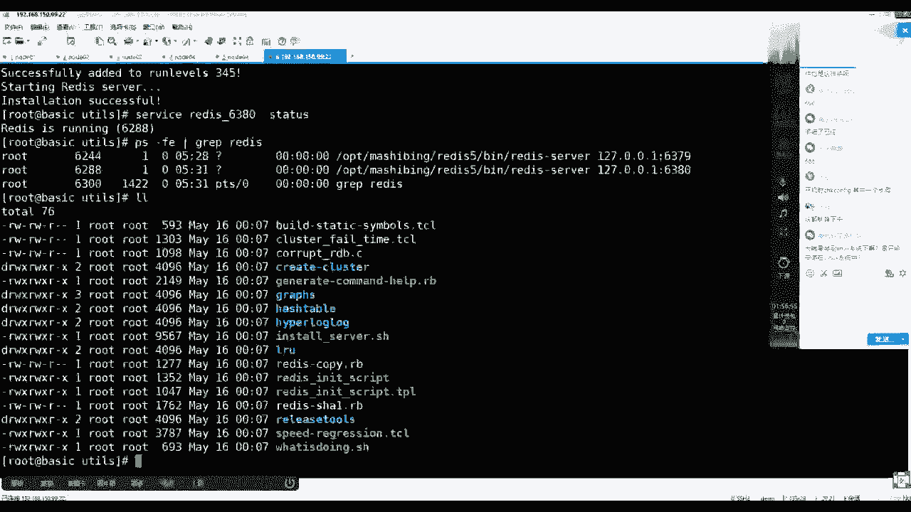
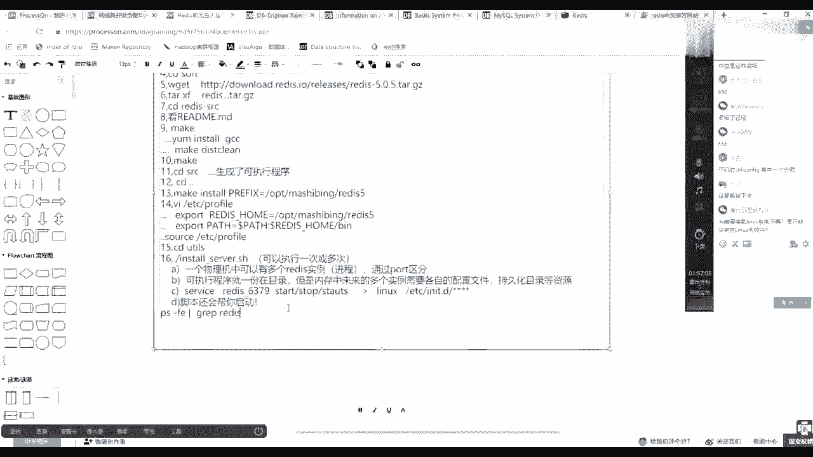
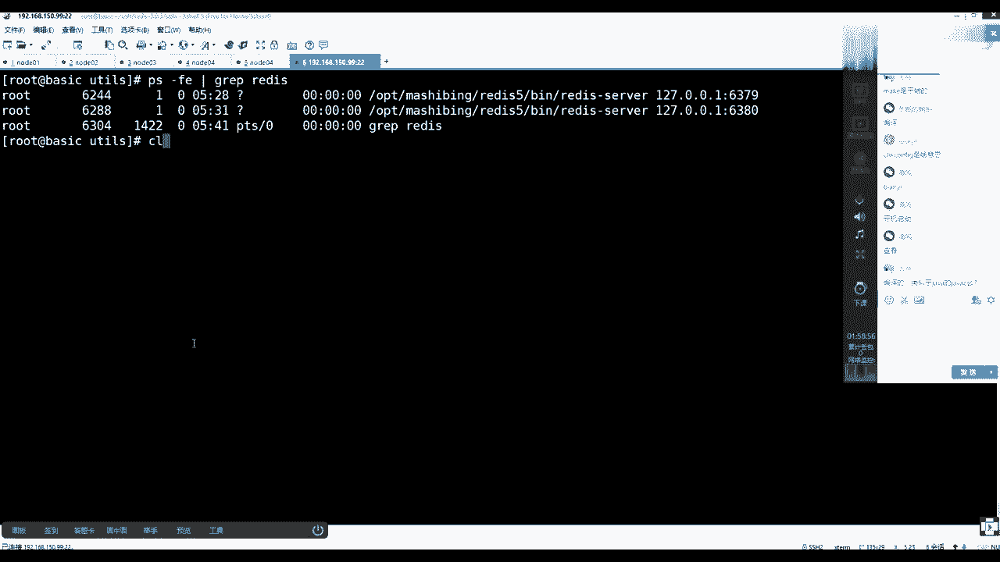

# 系列 3：P88：【Redis】redis安装实操总结 - 马士兵_马小雨 - BV1zh411H79h

好了，讲一遍写一遍，做遍笔记，回来趁热打铁，别忘了静静地回忆一遍，安装的流程和步骤是什么，把它背一遍，这样记得更清楚一些，关关说跟其他讲的是不一样，你看过谁的呀，第一步要什么，要准备一件什么事情。

我给你写完整吧，是不是在你心目当中要em install w get这个命令，优秀有一个版本也是我讲的，懂了吧，当然后面的版本不知道谁讲的了，来先不讨论这个事，咱们接着来啊，接着来，第一步是要装wg。

有这个命令之后，你可以下载这个源源码，对不对啊，然后cd到你的家目录，然后呢第三步make dr创建一个salt目录，然后第四步cd到salt目录下，进去之后第五部是w get。

然后那个地址是来自于上面那个地址，我写啊，你得跟着跟着一块回忆好吧，我给你放大点，这个字应该有人看不清楚，这样清楚一点吧，再大一点，咳咳咳，第六步有了它之后。

然后tx f有人说你为什么不加v，别人是不是写了好长啊，带一个中线的位置，中间带不带无所谓，是不是还带着v，然后这时候有一个小常识，就是你要明白啊，我们你在公司当中拿的是客户端。

这是一个插上windows一个东西。

你带着v它抵押的过程，所有细节会通过网线回想到你的客户端，会对你台服务器造来造造成一些io的影响，对不对，所以其实你越搞得深的人，其实更期望什么呀，io上规避一下就可以了，所以我把那v我不我不看了。

反正要么成功，要么失败，直接就是xl 4轨的解压这个文件就可以了，没错，倒数gb o，然后把它解压完之后，然后你要c到源码目录，我就用别名了，你c了他那个源码模式之后，然后第八步很重要，看什么。

任何的源码中都看什么，没错，你只要把这个学会了，未来你装啥都不怕，你现在可以，今天晚上可以回去之后再装一遍index，你读一遍他的read me之后，你再来，你再来看看它是一个什么流程，对不对。

看完之后，然后呢你肯定跟着他的流程走执行，make直接max的时候一定缺失一个什么东西，你要安装install一个gcc，然后肯定是还得去需要什么呀，make，清楚一下，会有这么三步缺失，这么几个缺失。

就是你可能像mac了，mac已经产生一些变异的东西了，垃圾了，然后报错了，然后你补全报告你缺了缺了cc，然后你就安装这cc，但那些垃圾已经产生了，然后你如果在这种mac main会报错。

所以说要先清一下，切完之后，然后第十最终在执行ma，mac执行完之后，你会发现去他的src目录下，然后里边儿就已经生成生成什么了，生成了可执行程序，然后但是我们更期望的是，未来把它变成服务化。

服务化之后，你需要在这个它的源码目录，这是刚才cd了，你再退回来，看完之后再退回来，退回来之后，然后再执行一个make，然后in store，但是给了一个环境变量，给他那个脚本pr等于，然后o p t。

然后是马士兵，然后redis 5 rudy美女随便给这个目录没有，无所谓，他会帮你创建好吧，然后这个时候执行完之后，你去检查那个路就有了，然后这时候多做一件事情。

v i e t c写的profile文件，然后15步啊，这个打开文件之后在里面写什么东西，要export，然后一个rid home，等于你刚才那个o p t马士兵redis 5，没毛病吧，然后再。

在下面再写一个，pd pass等于dollar pass，拼上一个dollar redis home，你主要要的那个闭目录，可是程序那个位置，然后这步做完之后保存15步，当地延迟做完之后。

cd它源码的you tel目录下，然后在这里面16步。

然后触发它当前目录下执行install server。s h，我看见那个中线是中线，是下划线啊，下划线是一个下划线，执行执行的过程当中，有几个东西，有几个知识点，也就是第一个知识点，什么知识点。

一个物理机，一个物理机中可以有，多个redis实力就是进程的意思，我做个ready进程，通过part区分，因为他们要通信嘛，通信的时候肯定需要有，各自有各自的这个动口号，然后第二一个。

然后这个程序可执行程序就一份在目录，就上面这个目录下来放着啊，但是内存，中未来的多个实例，需要各自的配置文件和持久化，持久化目录，等资源就是这个流程当中，你要给出不同的段位号。

它自动的会帮你完成不同目录，不同的配置文件的一个初始，对不对，听理解了吧啊啊，刚才少做一个sce，在这加吧，一个sse s o u r c e，然后a d c的这步你要不做的话，他是发现不了的啊。

然后再到它安装，它能跟着吧，是不是这么一个流程，然后这样完成之后，然后其实最后你会发现他还给你，给你做了一件事情，就是一个最基本的一个常识，这个常识就是service。

后面接的是redis gone 6379，然后start stop或者studi，或者是638063666381，这个东这个东西会变，对不对，然后它的知识常识来自于linux，用的是etc的it。d。

下面会有这个脚本清新星，这样清新星这一个脚本，这个脚本也是通过它来实现，给你部署进去的，而且绑定那个段位号，我就做一个简单的一个笔记了，回去你可以拿着图之后，可以自己在网上写的更细一点，可以吗，同学们。

好吧，当执行完之后，然后下一步他还会帮你启动，脚本还会帮你启动，ok搞定，你可以装这个这个脚本，可以执行一次或多次，对他帮你做了七个confide啊，他帮你做了cheer confide啊。

好了，你只要按照这个做，就一定能把它装成功，看着a边线降成一个将近一点好吧。

ok，那么好方向来说。

现在我已经装完了啊，对验证这个命令你可以再加一下，你可以做这么一件事情，是p杠f e管道grape，redis可以看到是不是会有多个进程，p和e grape，然后rise是不是两个今天就跑起来了。

为啥要装到linux系统下，是只能安装在linux系统中的，不是windows也可以装，问那能装，但是我们基本上服务都是跑在linux的，我不make直接安装这cc，然后去make是不是就不用清除了。

如果你直接安装gcc，就不需要做那个清除，因为你没有mac就不会产生这个垃圾，对不对，脚本是自动做了开机启动吗，是啊，你看上面直接脚本之后，我看到你看读啊，你一定要注意细节，好多。

我带过这么多年的学生了，其实大家都有一个通病，就是你在盯着执行命令之后，你就一闭眼，我看不见看不见看不见，但是人家真的说了，人家说了啥了，拷贝这个东西过去了，然后安装服务，安装服务。

其实就是在向那个e d c。d模下，拷贝那个脚本，然后并执行了什么呀，这个config，然后它运行器是345的级别，就是命令行和图形界面都会默认开机启动，然后并且还把服务给你start起来了。

就等于执行了service rex 6379 start，然后比如告诉你诶成功了，所以这时候你直接看这些提示，都能知道他在干什么，make是干啥呢，make是一个编译工具，make是编译工具。

make加上make file文件，make缺失的mac文件，他是不知道应该先编辑什么，后边什么的，make file文件是你的源码的厂商，给你提供出来的，妹妹只是个工具。

就跟你那个java c这个命令一样，但是编译啥你后面得给出参数的，对不对，或者n t编译这样的一种工具的。

哼没错，就是类似于加了新的命令，好吧，你这么理解就可以了，但是他不是只面向一类语言的。