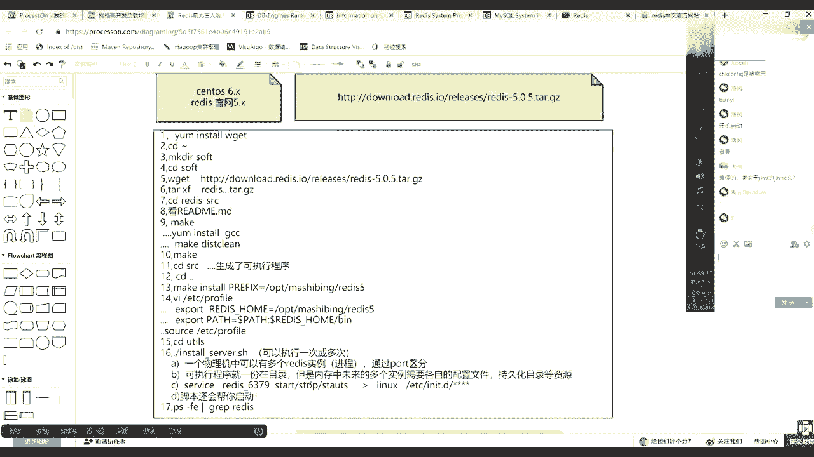
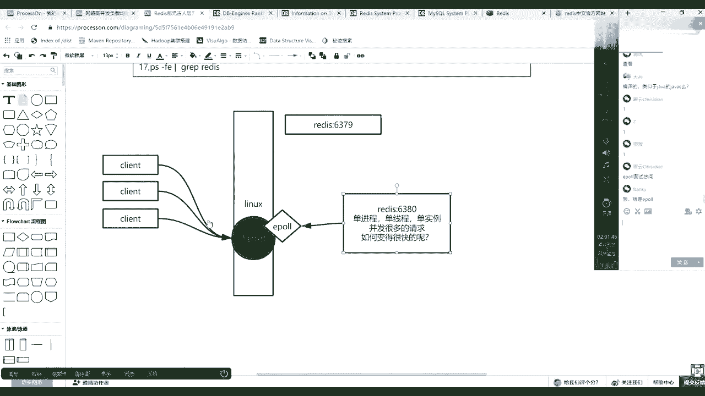
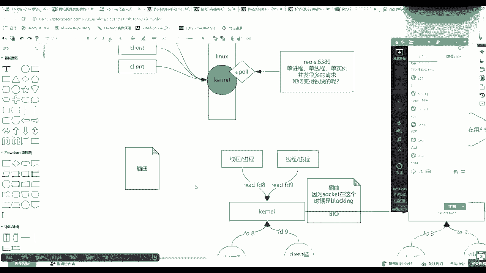
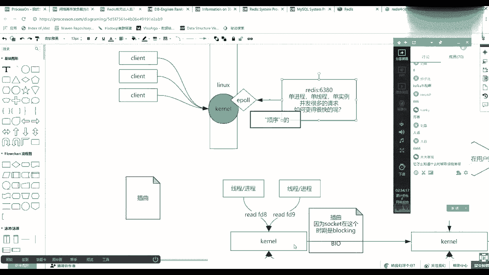
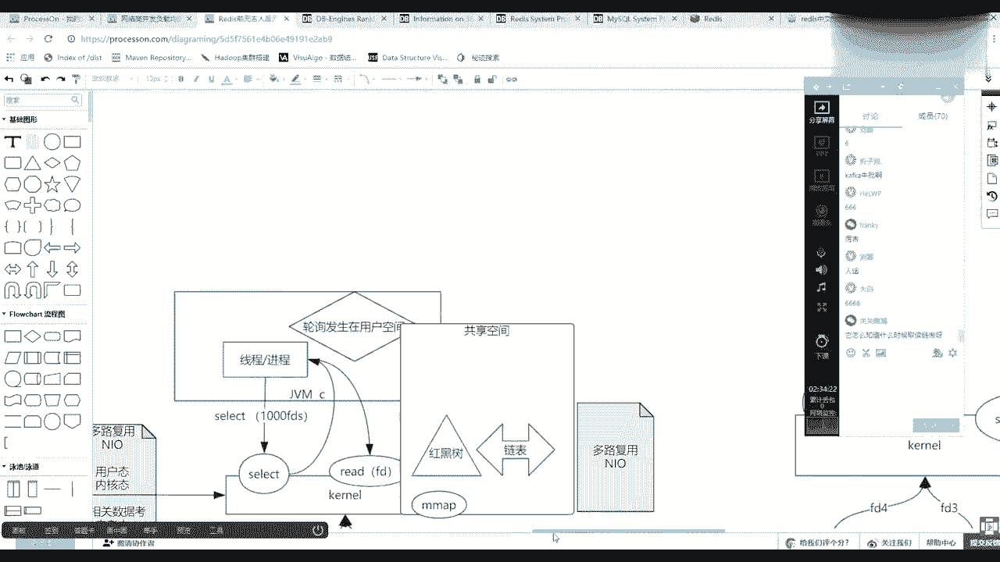
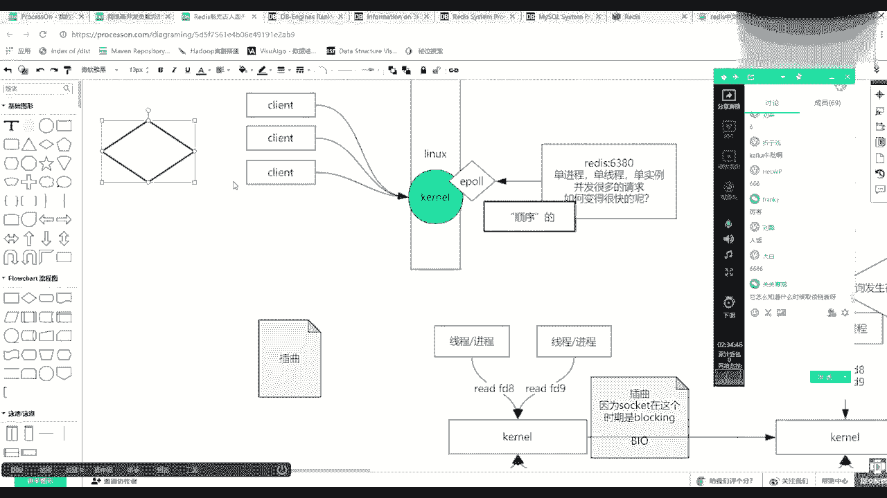
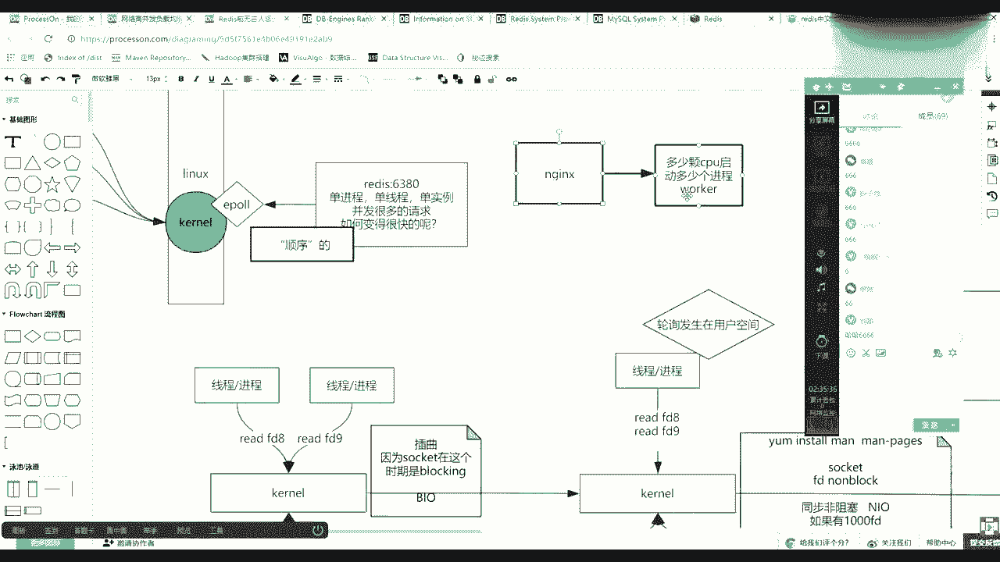
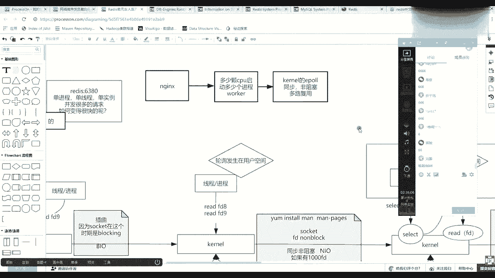

# 系列 3：P90：【Redis】redis原理 - 马士兵_马小雨 - BV1zh411H79h

画一张图开始引出这个这个这个这个思维逻辑了。

有些基本之王带领的，比如说我如果有一个物理机linux，如果有一个物理操作系统linux，其实这里面是可以有一个release实例，比如他用的就是6379这个灯笼，6379这个灯笼号。

然后呢在这个基金当中，我是不是还可以有一个6380的问，这上面那个支点就是一个计算机当中可以有多个进程，多个redis进程，然后这是一个上面知识点，另外一点我告诉你，redis是单进程单实例的。

把它放大一点，redis是单线程单单线程单实力的单，这里冲不是冲，但处理就这样，类似这样的一个一个名词，但是这时候这是我告诉你的，就是release他自个儿它并不是一个多线程，因为我们去炸了。

它肯定是多线程，对不对，那么re它不是多线程，是单线程的，这个时候又根据刚才的描述，那么并发到来的时候，并发并发一定是很多的请求，很多的请求，那么很多球他在单线单体能单线程的时候，它是如何变得很快的。

如何变得很快的呢，是不是这么一个概念，对不对，那么这时候要注意了，操作系统是不是会有一个内核的概念kl，操作总是有内核的概念的，那么注意你的所有的客户端的连接啊，如果有一个客户端。

你的连接并发一个客户端，可能带来一个链接或者若干个连接，然后所有的连接是先到达哪先到达你的内核，tcp握手，对不对，你所有的连接是新的内核，然后会有很多的所谓的socket。

然后这时候其实redis进程和内核之间使用的是一破，这样的一种多路复用的概念，非阻塞的多路复用的这么一个概念，这个一炮是内核提供一种一种性调用，也就是说其实它是可以由一个进行一个线程。

谁有数据我就处理谁。

且它可以满足一个现象，什么现象，它为什么要讲它redis为什么快。

redis是单进程，是不是用了它一炮了，怕吗不怕，然后所有的客户端发来的数据，因为你内存是不是快了，io是不是慢的内存在这等了好多年，数据中，a慢慢慢就过了一个，然后这时候因为有一炮放到这个map区。

然后他就直接可以拿到符东来，我助理，然后这时候其实间接在它里边完成了一个什么事情，因为使用的易爆，使用的单进程，他直接有一个这个所有的数据到达来的时候是有顺序的，但是这个顺序是加引号的。

这个数据的真正的一事务数据是由你这边的负载来做的，但是这里边顺序强调什么呀，我会一笔一笔的处理，挨个挨个的处理，因为它是单顶层，它不是多进程，不是多线程，它并不是说这里面他到了太燥了。

然后我一个线程处理它，一个线程处理它两个同时进行，那么这样的话有可能两个人都对某一个k一个一个删除，一个创建就撞车了，你得加锁，但是这时候因为我是单进程的，所以你俩一个删一个。

一个删除一个创建或者一个修改，你们俩一定是虽然你可能一块到达，有可能一块到达，但是进了网卡之后，一定还是对挨个儿来的，因为我肯定是便利的，你一套里边那个文件描符。

那个链表我肯定是按着顺序取的。

无非就是先取到谁了，那么这时候其实是由你前端前面再往前的业务能去控制，如果你想保证事物的话，对于同一个k的增量改查，你要负载，让让让一个线程一个链接去发出来，而不能负载的多个跟你使用卡卡一样。

卡卡其实我可以客户端打很多数据，打到一个tp的很多分区里，但是如果创建删除同一个同一个资源呢，我要达到一个topp的一个分区里，而不能再做其他分区的这种这种并行。

这块跟哪个知识其实也很像，跟你n dex知识也可以挂钩，n dex，n ex他要求怎么怎么启动n x n x要满足什么呀，多少颗cpu启动多少个进程，就是worker进程。

w o r k worker进程，一个worker竞争是不是就就可以把它的数据压到cpu的123就缓存了，然后你有多少个cpu，有多少个nx进程，每个每个work进程它使用的是什么呀。

多路复用io，这电源是不是也看到ex介绍i使用了linux 1 pro，现在这是什么意思了吧，其实更主要的是什么呀，一破一破不照不要紧，是同步非阻塞，然后机制下这种什么呀，多路复用。

只有windows才有a i o linux。

