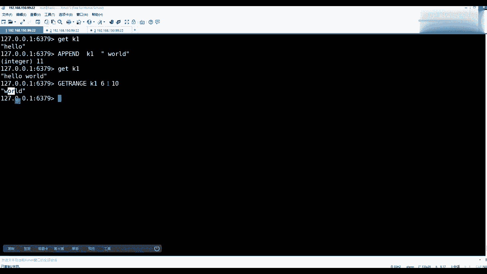
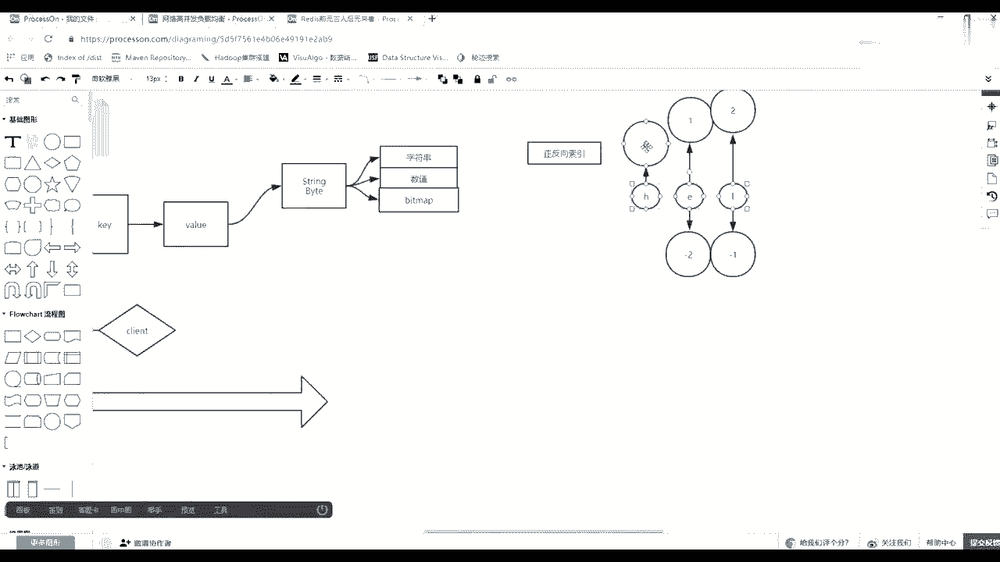
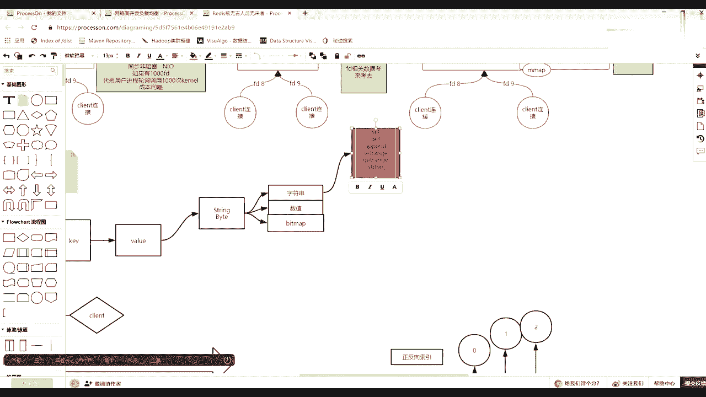

# 系列 3：P93：【Redis】redis中value类型--字符串 - 马士兵_马小雨 - BV1zh411H79h

站在字符串的角度，现在开始讲这个外道，站在这个字符串的角度，如果面向字符串的时候，你想一想面向字符串都有哪些操作，面向字符串你可以有操作。

最简单的可以设置，比如set一个k啊，注意这个k并没有类型的区分，只有value才有k，你是要随便给一个k的名字，比如说k1 ，然后y里边比如刚刚给一个hello回车。

然后可以get的k一是它最基本的一个面向字符串的一个，就是这个字符串类型可以设置，可以取出，然后还可以什么help，关于set这个这个at string的时候。

或者是你直接看那个set在set的时候不应该加这个这个这个这个暗缝，他sd的时候可以看出这个sd命令后边除了可以接k接外表，还有相应的可以追的参数，那么前边这个是可以接一个过期时间。

后面以毫秒到后面秒了，这个先不用管，后排有两个，一个是n x，一个是x x n n x x什么意思，就是我在设置的时候，比如设置一个k1 ，然后我想给它变成它那个哈喽，我现在变成圈圈叉叉。

然后后面接一个nx，那么回车，然后就可以返回一个new，然后这时候你get k一依然是holo，那么nx什么意思，是不存在的时候才去设置，这是k一如在这里边没有出现过。

那么你这个size才能把它设置上去，但是一旦k有这个k了，视察无所谓，你再想给它变成吞噬差是不允许的，就是不存在的时候才才让你设置，那么这个时候像什么，它的使用场景是什么场景，比如说分布式锁的时候。

分布式锁没错，那么一一堆人拿了一个re来这个做一个参考，说这堆人都想都想删除一个删一个文件，那这堆人谁谁去删呢，谁操过这个文件呢，一堆人拿了很多链接，对一个单线程的redis发起set k1 。

然后nx那么谁成功了，谁就拿到锁了，剩下的人都返回失败，因为别的人抢了他前面创建了一个k了，懂这个意思吧，然后xx是什么意思，比如说我算一个k2 ，然后给它赋一个值，hello。

然后xx回车也是六gk 2，然后发现没有值，等于上面没有设置成功，x是什么意思，只有存在的时候才可以操作，就是指指它只能更新，只能更新，nx是只能只能新建s只能只能更新，能理解什么意思吗。

就是他们两个最基本的这么一个选项，那么求个单条的get set还有多比的，比如说m3 ，然后m3 去之后，你看他现在很五点之后很人性化，你给出命令之后，他会给你一个灰色的动态提示。

比如我可以设置一个k3 a k4 ，b可是两个，然后这个时候你盖的k3 就是a盖的k4 就是b然后同样的有m set，就有m盖，我可以把k3 k42 个k都给出，分别给你取出好吧。

这就是面向字串这个k的类型的最基本的操作，然后包括这个类型，如果string的时候想想还有什么操作，比如说a pen，我们可以拿死猪这个类型来看一眼，上面会第一个就是append，可以追加，可以追加。

然后big lab这个未读先不用管，然后数值的操作也不用管，然后下边还有get range取你这个k对那个value里边的某一部分截取，然后还有干set取出来，然后放到这个这个取回老的值，设置新的值。

还有哪个概率讲过了，还有，还有一个东西，三个认证可以把一个周串二，这个覆盖到你原有这个k的value的某一个位置，偏移量的一个位置，好吧，我们先统一的演示一下，比如说gk 1，现在里面hello。

我可以用append对我的一个k一追加一个这个word回车，那么gk 1，那么你取出来的就是一个hello world，等于把单子word追加上去了，能理解同学们，然后除了一个append。

还有比如说像这个字符当中，我要取出其中word，把这个watch是怎么取，那么它会有一个get，在这乱整，这时候注意看你要给出k k是谁，肯定k一找到这个value，找到value之后。

它有一个staff和and这么一个概念，那么start at什么意思，你要给出从哪取到哪结束，对不对，那么要数一数最简单的123456空格也是一个，然后第七个七的话其实就是什么呀，从k17 就是六。

因为我们乘以二是从零下标，从零开始的，然后我们取到哪了，然后就是678 90，你发现这个过程现在看是不是网络上取出来了，但是这一过程是不是好麻烦。

你不去数对不对，那么在这儿说一下，它化为一系列的相似的知识，就是正反向索引，正反向索引什么，什么叫正反向缩减，如果你有一系列的元素，如果你有一系列元素，比如像刚才hello，我就简单写一下h。

那么简单写，如果你的这个字符号是h e l的话，然后它有一个正向索引，第一个就是零，第二个就是一，然后以此类推，它会自自动的这个递增，然后就是二还有一个反向的，最后一个就是零这个-1。

然后前边那个就是一个，也就是面向元素，它有正向索引和逆向索引。

所以这个时候如果我们要取的话，这对的话，如果想取出这个or的话，你后边完全可以写一个-1，你只要找到他从那边起了，我就知道最后那么给个-1可以了，如果编的认知如果是从零开始到-1呢。

就是取正向作用的零开始到它-1这个位置，所有的元素，这是真正空降缩引这个东西，同学们，然后再来看k1 ，除了grange，然后还有一个set range，所以人工也是给出k1 。

然后这时候注意给出一个all set outside的话，比如说刚才给一个从这个word变成这个马士兵，怎么怎么去给，那么outset是从六，这是第七个位置开始，后面给出一个歪的那个y轴多长度。

所谓超过长度，它整个会整个整个整个覆盖覆盖进去，会或者做一个扩充，比如给个马士兵回车，那么在gk 1，那么就是从刚才那个位置，从你偏向那个位置，然后把它覆盖进去，这是这是面向字符串最基本的操作。

这个都没问题的，同学们好吧，我没有字串，还有什么操作，你在编程的时候，面向一个字串的类型，spring类型，你还有什么操作是让我想查看它的长度，对不对啊，后边也给你分分。

这个也给你这边他的服务器也给你封好了，就是t r l后面可以借我们的k一回车会告诉你有15个，为什么有15个呀，你get了k10 个字符，是不是一共15个字符，对不对，那么这个取出的长度就取出的长度了。

ok当这个都听懂的时候。

当这个听的时候，注意以上面向周串很简单，常有的操作，这个放的有点占地儿，面向字符串常有的操作，回去我在这儿给你标出来，你自己去补笔记，自己去补，我不给你写完整的笔记，因为太low了，好吧。

这边我就简单跟你说，肯定有set，然后get，然后还会有append，然后还有会有set range，get french等等，一系列的这名字上该有的操作还要取它的长度，取得长度ok。

