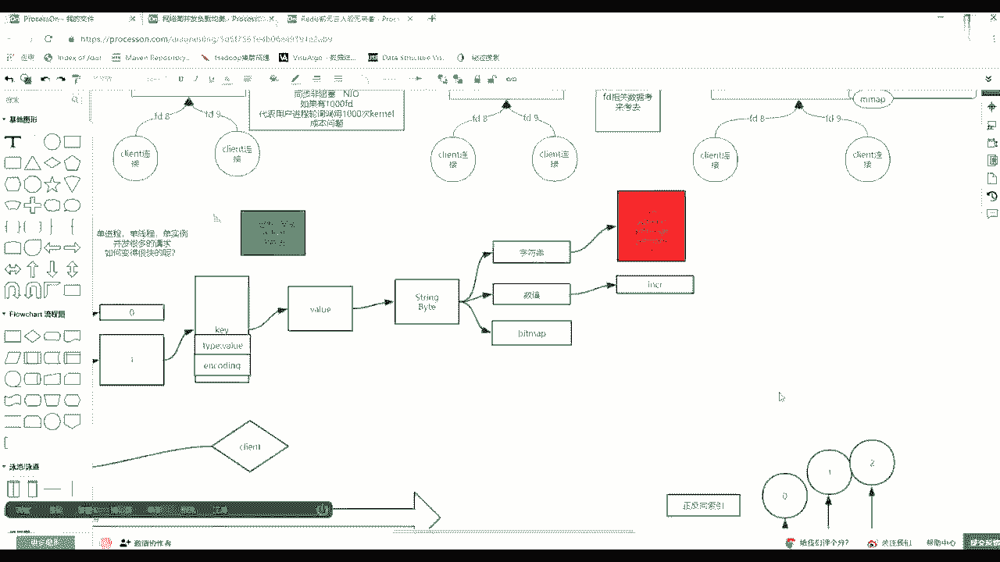
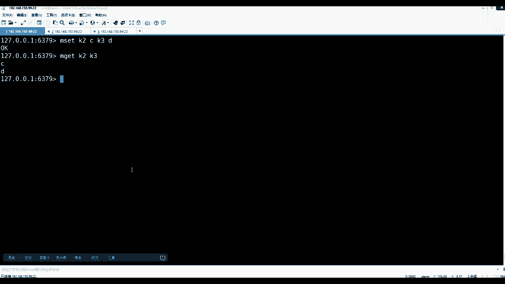

# 系列 3：P96：【Redis】redis中value类型问题解决 - 马士兵_马小雨 - BV1zh411H79h

你可以试吗，比如说ms k2 k，3d i will get k2 k3 ，那么谁是谁，是触发原则的呀，什么叫原则，你如果就一比的话，谈不上原则，因为它单线程的肯定是原子，那么一定是在多m的情况下。

然后且出现nx时候，那么这个时候肯定是原子的大脸猫，理解了吧，你回想关关机，就你回想你在写ni o的java java是不是他的这个模型选的是epod呗。

你在修的时候是不是也是需要他那个selector，你虽然看他那个战dd k里面的select or，但其实它底层如果发现内核里边有sla，就用slap，没有slag，如果有一po使用一炮。

没有ap就看有没有slap，所以其实是jdk对着操作系统做了一层屏蔽，它给用户暴露的是一个select，是不是道理，但是它底层根据内核优先使用e破，所以那时候你会发现注册完之后，是不是自个儿。

你每次还得循环要这个数据，对不对，等于它底层循环是循环这个位置，其实说白了还是你用户自个儿那边有一个线程得去循环类，或者给你返回了，你就拿出这个图，拿出做的k每个k的拿出通道，然后开始读写，处理完之后。

然后再去wait，它就掉一下就掉下，区别区别怎么会没有区别。

它俩区别多大呀，它俩区别多大了，一个selly，一个e le，这俩区别，你select你用无敌调select吗，这不是炸到的一个select啊，就是内核里边就是操作用c linux c的时候。

如果掉slap的话，你要给他1000个文件名符，但是这个时候如果是一泡的话，你只需要掉一次wait等着就可以了，之前的时候有一个就放一个，有一个放一个，有一个放通过c t，有一个放进一个，放进一个来。

然后后边你只需要轮询调位置等一个事件就可以了，有几个吧，wait 11组特意取消，然后开始开始读那几个处理，处理那几个i o，前面那个是我每次循环的时候都都得压你1000个文件标符告诉你，你啊你我注册。

然后你告诉我有这个1000里面有有有能读的了，有几个，然后我还得把这1000个就过一遍，找出那些k来找这些文件，不是那个那个可以读了，然后再便利他们吊锐的方法。

这边是我来一个压一个来一个等于这1000多，如果select循环了十次，循环了十次select的话，1000要压十次，1000个文章被压十次，那么在一炮的时候有1000个的话。

如果我就是每个每个socket只压一个状态的话，就都压毒，都压血的话，那么其实每个只会压一次c条，只会一次1000个就会就压一压1000个就可以了，不需要再有几点循环十次，这位循环十次也不需要压那么多。

肯定有诅咒的，可以调，你可以调成非阻塞的，但是这个时候这个这个点不重要，重要的重要的是哪一块的变化，就是前面成本比较高，压1000 1000+1000得压一次之后，就为了等链表上有了。

我就取出来那几个文件名符挨个调，或者用多个线程，每个线程发一个，然后这几个线程同时对不同的那个那个那个那个文件文去读，对不对，然后你这个线程又可以再去阻塞这个对链表，这种叫同步的模式，什么叫艺术。

什么叫a i o，什么叫a o，也就是说把这个底层还是这种同步的上层，我可以基于事件驱动，那其实不叫不叫a l，就是就是尾尾l就是感觉我这个用户写在哪的时候，我把一个锐的方法里边要传这个某一个文件标符。

就是某一个socket一个对象，然后呢再接上一个我回调的那个对那个对象的方法，因为面向接口嘛，然后我发出去之后扔给一个县城，那个县城里底层其实还是要走这个位置，只不过你不需要自己的那个线程去处理了。

那个县城，只要拿到之后，然后毁掉你这个方法，但是这时候其实你跟自个儿就脱裤子放屁一样，所以nike就根本没有使用这个这个所谓的为他直接用的是，还直接用这个这个n l o一破这种方式。

因为真正基于事件驱动的ai o在linux当中是很难实现的，光最早先的时候ibm想实现ao，然后后来oracle想实现ao，结果那俩人玩到最后都退出了。

而且最至关重要的你要明白v的这个生态和windows生态不一样，windows是自个儿一家超算另类的生态，然后他是有一个人占主要地位，就是林纳斯这个林克的内核的缔造者。

这个缔造者其实它是有代码洁癖洁癖这么一个问题的，林纳斯他的代码那个有有代码洁癖，他就要求如果想在linux当中开辟的话，这个a o除了是一部之外，它有all in o o l的意思。

就是所有就是统一所有的i o，无论你sk这种的会堵塞的，还是那种所谓的磁盘文件的i o所o都必须使用统一的接口，且这个接口一定是内核系统调用机的，且必须是速度最快的，要超过这种。

但是这个所有的条件压出来之后，这个代码gp上来的话，他就一直在否定所有人给出的l o这个框架，结果呢其实nike也测试了目前这代c当中实现的a o的速度，跟n i u的速度就是一炮。

这种方式的速度基本差不多，因为现在的实现的模式，tfc的代码当中也底层掉的，其实还是e poo，因为它不像windows内存空间访问那么随意，因为linux它更倾向于服务器级别，它是要求安全的。

快这个诚信问了一个问题，就是说哎这么多客户端网来发东西的时候，那么你这边只有一个线程，那么是不是就会处理处理一个的时候，别人都排队等着，的确是一定要注意，刚才说为什么强调一个顺序，但是排队进来的。

但是这时候你就明白了，之前给你讲那个那个那个最近的常识的时候，内存寻址是纳秒，你这个salt其实对于那个网卡，它的寻址是毫秒，也就是说差了将近小10万倍，你除非有10万个连接，我有10万个链接。

大家疯狂的同一时刻到达，那么这时候可能会造成秒级的响应，没错的确15万，你看他那背上能看出来了，这就是小学算法吧，是不是学算法，因为它的选址之间那段级别嘛，而且是技战术移动就在内存里边，也没有磁带。

我还说我就单一个建成，然后呢，等于哪个文件名符，有了之后，我直接就从掉一个位置，把你的这个链接里面拿出来之后，然后8k加一，然后交易之后我手里知道你下一个下一个文件名是谁，因为共享内存嘛。

我就直接注的另外一个文件没有符，又把你从那个命拿出来，你可能是减一就减一，所以那时候其实你看所有的通信的距离，跳这个折板都是很少的，所以说近似于可以达到十十十那个，而且151000秒钟。

15万是为了单机都没有走网卡，我对这个这个还是强调一点，就是它是单机压测的，就是这个计算机当中不需要走网卡，计算机有一个客户端，然后呢有一个redis他俩走的内核都直接回来，这么请求完全纯内存的话。

15万是没问题的，但是如果走了网卡的话，就会降到10万以下，六七万七八万，我脱粉这个问题的确的确点到这个点上了，很好奇内存是啥结构的，不是单道吗，硬盘是扇区，是磁道，内存就是一个线性地址空间。

内存就是一个线性的一个地址空间，其实你就想这么一个事情，如果我给你100个格子，格子长得一一模一样，从格子标号从0~100，然后但是我会给你不同重量的大米，黄豆红米，然后不同东西，然后你怎么往里去放呢。

重量不一样代表体积不一样，所以那时候他们需要的格子是不一样的，对不对，然后这时候还不能把他们混在一起放，那么一定会有浪费，对不对，所以说其实在内存身体这种小格子上面又多了一个叫这个内存页。

然后呢如果100格的从零到十这里边放大米，而且大米的权重比较高，大米是可以去访问别的那些格子，那么这个大米就是内核，剩下那个从从这个11~100这一个小盒里边放红豆，放小米也放，放黑豆。

他们就用工业的程序，这些动物还不都混起来，所以各自有各自的物理空间，这个这个这个这个这个这个范围，但是这个时候其实每个程序它都是靠什么讯地址，讯地址通过cpu的这个m v管理都映射。

单线程是不是规避了线程切换的时候用户太向内核态切换的过程，所以选择单进程，单线程不是不不不完全是不完全是用户这个多个用户进程切换，的确是有性能的损耗，但是这个损耗站在数据一致性面前，对着锁豪算不了啥。

是不是分开了就跟你写java程序一样，你到底是写一个线程，然后用n l o都复用，让每个人的操作都是原子的，还是说我要在引入多线程无用所，让多多多多多多服用进来，数据道理。

所以这时候你就看把两个东西摆在一起的时候，就是做歌手的一个过程，举手的一个过程，这就跟讲集群一样，集群里面为什么是主从集群，主从集群的主就是单单单个嘛，他说一就一说二，就是他不需要和别人协商。

所以主要是主入口，它的性能必须高，才能才能最快，那多线程只不过是并行了磁盘io时间，如果没有网络或磁带o，完全没必要多线程，这个脑子有点大，我这个脑子乱，不管你问啥，我再读一遍。

那多线程只不过是并行了磁盘io的时间，如果没有网络或磁盘io，完全没必要多线程，那么在这注意一点啊，是redis就是在面向网络很多i o的时候都是复用的时候。

如release用单线单线程单进程就可以处理，对不对，然后我们再想另外一个存储数据的就是mysql，mysql是不是处理也是存数据的，但是mysql的数据不是放在内存，它是放在磁盘，对不对。

那么my circle就它更倾向于使用的是那种bo mysql更倾向于使用bo，就是一个连接一个线程，一个链接一个线程，它反而不倾向于使用一破，它需要更多的线程，一个链接来一个县城，为什么。

因为你你去想，如果买sql它要连接进来的很多，进了个10万百万条链接的话，这个请求如果每个请求都要触发磁盘io的话，在磁盘i o这个带宽上就会阻塞住，所以说你好似让很多人进来了，但大家要等很久。

所以请问你前面用e破反而没有意义，还不如直接用bo更省事一点，索引会有预加载，然后索引的叶子是在你的磁盘当中的主干，可以预见到内存的，而且mysql也可以开启缓存，就是比如你发了一个sl。

随便修from a这张表，这个思考你发过一次，他查完了数据，如果你开启了缓存，这个数据缓存在内存里面，主要不它不大，如果你下一条sql长得一模一样，它其实mysql是先预判断你这个sql我是不是刚查过。

查过的话，直接从缓存里返回，后面什么sl的语法书啊等等就不做了，就省了一大块的东西，但是好像听上去开局的缓存可以逼近ready的性能，但是毕竟你mysql肯定是数据大过内存的。

那这可能就四个g买四个数据库，可以一个一个t两个t所以这个时候其实开机缓存，如果表的行比较多的时候，它会降低mysql的性能，反而降低了一个性能了，因为多多一次判断的一个过程和缓存。

这个这个内存内存压这个空间被占用的过程，还不如直接把缓存关掉，所以说呢这个要的是你这个server它会做一个整个sol字符串的，你前后两次sl cav r条件都是都是男前面一个难，后面有难。

你这俩肯定还是一样，那么这个上一次好像都可以用，你这个如果4号万一每次执行结果不一样呢，这个什么意思，那你就说这个数据被改过的了，所以这还是这还有一个问题，所以这个它会蹲不判断。

所以这个你开启了mysql的缓存，虽然想模拟release，充分利用内存，但是反而是不好，的确是这个意思，你像n这就跟你讲n这个时候n dx是不是就是他你有多少个物理核心，他就开启多少个进程，对不对。

是不是道理，而且除了开启相应的这个进程数，还有一个亲密度加一个亲密度，比如我这台电系统有四颗核心，我起了一个release，我会把这个rise亲密到第三颗核心上，然后把所有其他的事情。

其他的那些进程可以让他们在别的这个核心上去跑，那么等于因为你cpu是实验片的，等于更多的时间片，这个3号4号核心就一直在处理外离子，尽量减少他去处理别的进程。

那么这样的话它缓存123级缓存也不会清来清去，所以这是rex才能达到最快的这个所谓的秒级10万或8万，这样的一个速度，就是你让这个进程一直内核调度时候一直跑在哪个核心上。

