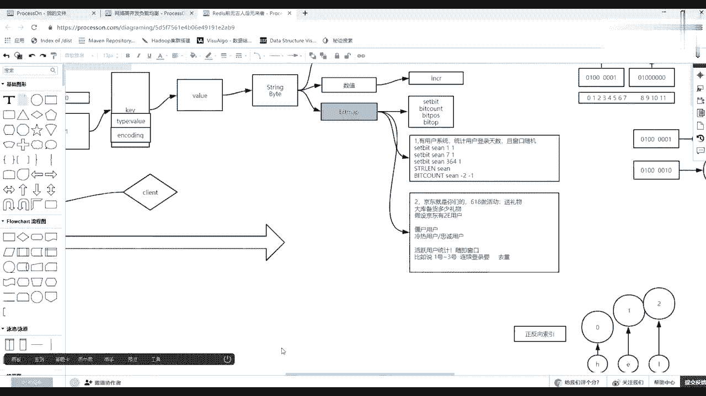
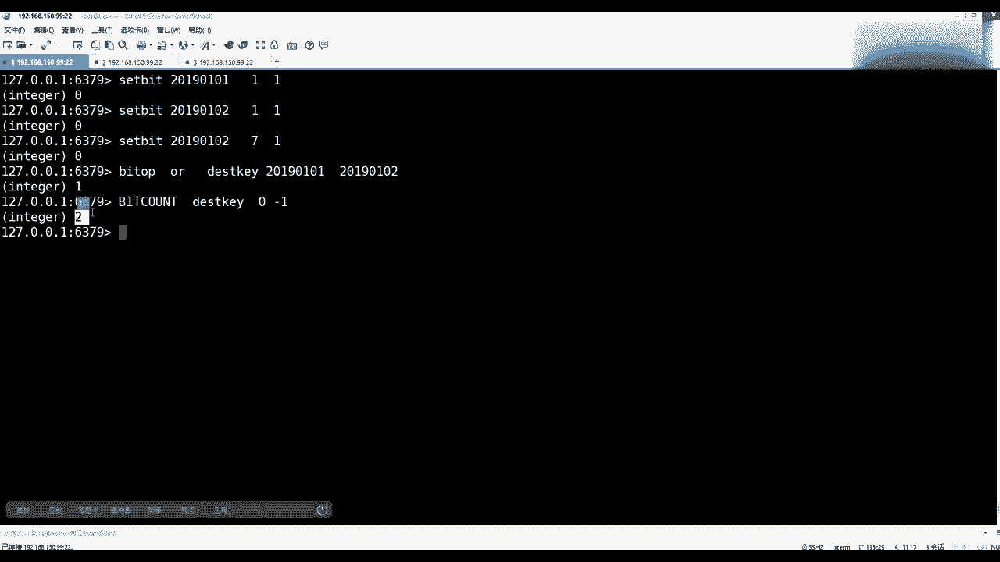
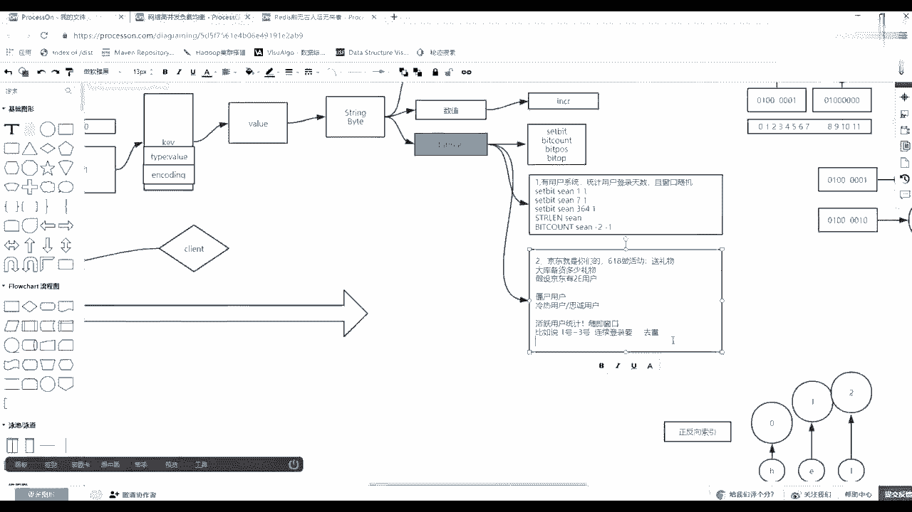
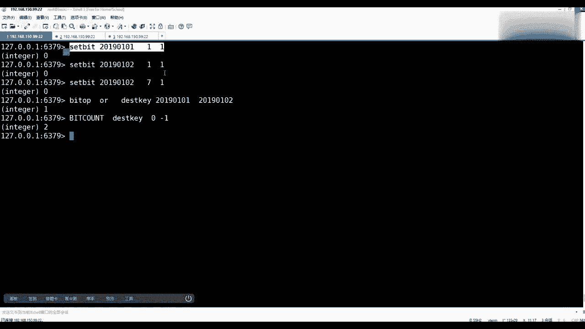
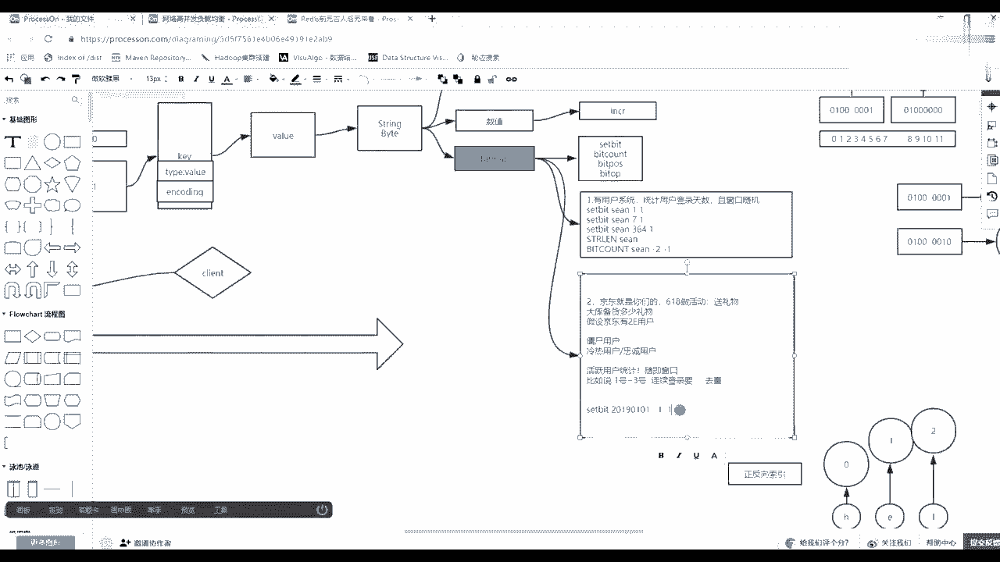
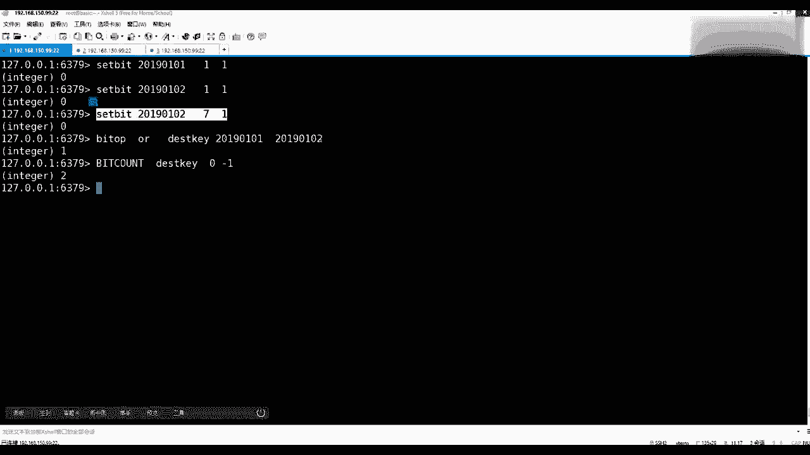
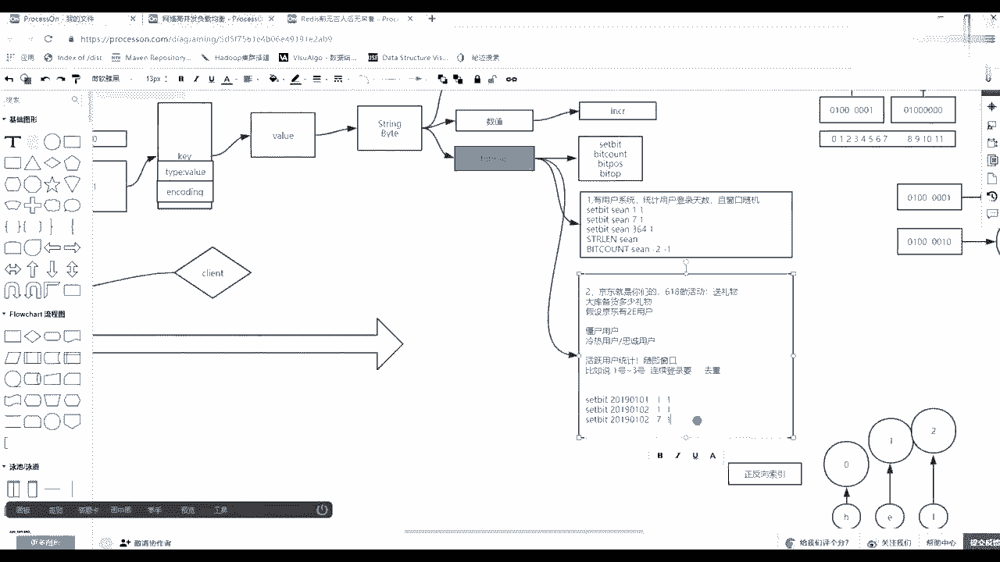
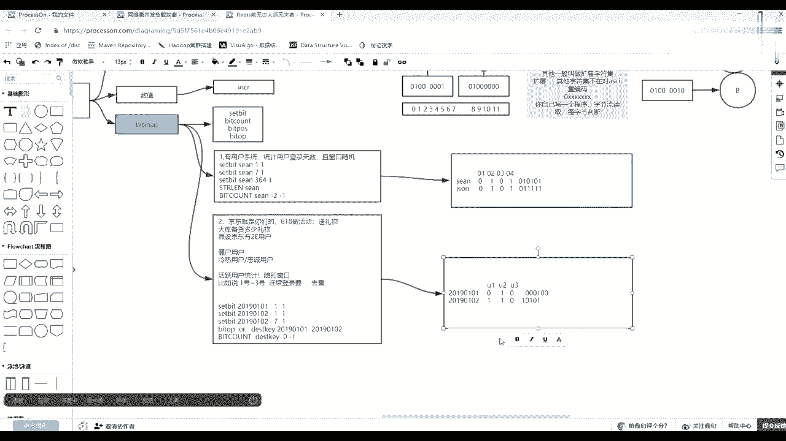

# 系列 3：P99：【Redis】redis中value类型--bitmap例二 - 马士兵_马小雨 - BV1zh411H79h

不只是主要节省空间，二进制位的操作，在计算机系统当中，cpu速算速度是最快的，你想想如果把它换成观影数据库的话，他肯定读磁盘，第一个产生磁盘o，第二一个读到磁盘之后。

然后他还需要做这个这个读回来的数据的这种编码解码，然后再参与一些计算，而且绝对不是不会是二这种位的计算，好吧，这句话丢失数据，这个后边说，先把这个知识点弄明白了，没错，布隆过滤器也可以。

以其实也用的这个未读这个概念，然后第二个知识点好吧，不是统计这个用户啊，等你们登录啊，换一个维度把这个其实刚才那个二针中位是不是一个矩阵，把矩阵拧一下，旋转一下，权限也是。

比如说我们这个你说的权限权限也是零一数据权限权限，我们是不是就是这个r w x用的是不是scar，这车位就是124，然后就是从0~7这么一个范围啊，收看我第二个需求。

第二个需求就是假如京东这家公司就是你们的，听说京东就是你们的啊，你们就是就是就是那个强子啊，奶茶妹也是你的啊，然后有这么一个有这么一个事情，比如说618做活动，你六八这个这个618这边做活动。

这个活动内容是什么，凡事啊这个这个登录消费之后，这个用户都都要给他们，只要去找你登录，就会送你一份礼物，送礼物，不知道就六八那天会给用户送礼物，那么现在区区是啥大库。

是不是它会有库存度的大库被备货多少礼物，然后假设假设京东有2亿用户，京东一共有2亿用户，6868这天登录就送礼物，登录就送礼物，但是一个人只能送一件，库存中要背多少的礼物，你的老板就这么一个需求下来了。

啥也不说了，背多少，看看你是不是符符合做这个这个这个这个老板背多少啊，有人说背2亿，对不对，那么这时候其实做电商应该有一个最基本的一个常识，就是用户里边分为什么呀，僵尸用户，冷热用户或者叫忠诚用户。

没有什么意思，同学们，是不是你就比如qq号，你们1年有几个qq号，每个人是只有一个吗，尤其是早几年养宠物的时候，怎么那十几个一块在那挂着，对不对，你拿腾讯来说，我这有有有10亿的qq号。

代表就有10亿个人吗，是不是可能是几亿，对不对，所以这时候怎么去做，一般都说一家公司只有销售才能给公司带来利润的，问说你们开发的，你们臭开发的就是花钱的买服务器，然后各种这个这个这个消耗消耗钱的。

但是这时候其实如果你有一套方案可以告诉刘强东说，过往1年或同比去年的这个时间范围内，或者过去一个月春以内，我我们的网站只有1亿的活跃用户，或者只有100万的活跃用户，经常登录，其实根本不是2亿的。

经常登录的用户，你是否能把这个数据拿出来再涨出来一点，比如占了20%，占了30%，你算算，如果一件礼物十块钱，1亿跟2亿就是10亿和20亿啊，中间差值是差十个亿，你你就可以转身问销售。

你能给公司立刻创收十个亿吗，我随便动动手指就可以减少10亿的成本，能get到什么点，所以这时候其实最终的目标压压到哪儿了呀，活跃用户吗，这是经常要做的一个统计活用统计，是吧。

那么要想做图用户统计怎么统计啊，是不是有可能是618有81891 81 81，是不是也是一个随机窗口，也就是你必须你的数据能够支撑未来随意的给出一个窗口。

我就可以算出这个窗口里边到底活用户的具体数量是多少，对不对，那么活跃用户的统计它的本质是什么呀，先把这个需求从题目问题才能知道标准的设计，活跃用户的统计是是一个什么概念，活跃用户的统计是一个什么概念。

比如说，这个1号到3号，假设1号到3号，你要统计活跃用户，是不是1号里边儿有多少人，2号里边有多少人，3号位多人，而且一个人如果连续登录，是要驱虫，也就是说你1~1号到3号位三分范围内。

只要这个人如果登陆了一次，还是都有三次，就算他出现了，是不是道理，那么怎么去设计啊，是不是有一个驱虫的一个过程，怎么去设计用数据库，我就不给你出个解释了，一种很慢。

对不对，那么就拿re来说，怎么去做，怎么来做我然后这时候把你刚才那个位图旋转一下，刚刚为图的二命之位是不是代表的是第一天，第二天，第三天，第四天，第五天，对不对，那么给他选这个这个k是不是用户。

然后历史需要给它做一个旋转，比如说sd 2019年0101这一天这一天的时候，注意后面有多，后边是不是可以，这是p了，这是k那么1月1号这一天这一天是不是有很多登录，每个人是不是会有用户id。

你只需要让所有用户的id映射到你的二支之位上，0号二这支位代表的是谁，1号二支之位代表的谁是不是可以了，比如说咱们约定数啊，我是第二个用户，就是第二个二进制位，然后你们的连老师使用的是第七个二进制位。

那么第一天的时候可能我登录了，我登录是什么意思，是不是下流为一，然后打一对不对，这都没看过，也就是一日七为k，然后呢，这一天里边只有我登录了，然后第二天的时候。

这个2号这一天我是不是有可能登录2号的时候，我连续登录了，然后且2号那天谁呀，袁老师也登录了，轮流上这个过程也就是第一天里边只有我登录，第二天里边我和连老师都登陆了，看见了吧，那么这时候就拿这两个来说。

如果我想算一算1号2号里边的活跃用户数是几个呀，是几个活人无数，是不是就我们俩人应该组中二才对，对不对，那么怎么你怎么变beat operation，目标k就是这个d s t t这是目标k谁参与。

是不是我们的20190101这个key和20190102，然后他们要做一个计算，什么计算，是不是有，是做逻辑语呢还是做逻辑或是不做或预算，最后一项的话，我重复的是不是有1v一了。

是不是变成一个一到目标k里去了，连老师呢是不是有1v1 ，是不是就进到目标k去了，能看懂这个效果吧，就后算之后得到一个结果，key jk这个d4 k里面是不是放了我那个位置，就一个一。

因为就会算我作为两个我的位置虽然有两笔记录，但是不是他不会加上二，他只会按二六位还是一，对不对，零二和那个位置退一，是不是其他位置都是零，所以整个这个p里面206位里面就只有两个位置有一。

然后你只需要做一件事情，是beat count disc key，然后因为我这里面只有这么点数据，我就可以从零到-1这个字节的区间之内回来，俩人忽悠5v2 ，考redis基本上会考这道题。

如果你学了release，如果去面试的话。

基本上会这么问。

这里面是不是用了beat origin为操作。

也用到了beaccount。

那么刚才你问老师教的压制位的命，有这些命令有啥有啥用，现在是不是用上了，零到-1说的是什么呀，那20位参与什么统计，对不对，跟上面那个统计是不是一样，最终是你要拿着，因为没办法。

他是按字节这个范围来提取二分之位，然后做了个统计的，其实说白了，这两个有可能是要深思熟虑一些，深思熟虑一些，这个是不是t的天为key用户，i d为v v用的这几种形式，好吧，要么就是20190101。

然后这里面比如说01123456，然后100，然后2019010诶，没没没有影响吧，0102，然后11010101，先给他靠左，然后现在你看是不是矩阵旋转了一下，矩阵旋转一下，就在那上面。

就是用户id了，无非就是u1 u2 u3 ，每个用户是不是固定会u一就是0号位u u z2 的话就是1号位，u的三的话就是什么呀，固定的3号位，那么显然这个下面比数据当中，用户一直有在第二天登录。

