# 系列 4：P10：【JVM调优实战】CMS天生的BUG - 马士兵北京中心 - BV1VP411i7E4

一一一一。😀嘿嘿嘿嘿。😊，讲点更难的问题。这个问题。是CMS的天生的bug。叫做解决不了的bug。CMS诞生到现在，从1点4诞生。到到1。91。9被清出去了，1。9以后好像就不支持CMS了，我记得。

我告诉你，从1。4到1。9，这个中间这个过程从诞生到消失。它中间有非常严重的天然的改变不了的问题。听我说。呃，十四是吧，我忘了啊忘了14还1。9了。总而言之呢，CMS已经被踢走，踢出去了，不带你玩了。

原因是什么？原因是从它的算法本身上就有非常严重的解决不了的问题。这个解决方案呢叫increment update，但是它这个解问题非常的隐蔽。就是你采用这的算法依然会产生漏标。大哥。来。

我们来看看这个情形。这时候你一定要理解操作系统原理，一定要理解线程它是互相影响，互相进行，而且操作系统的去跑线程的时候是你执行一会儿，我执行一会儿。我们来看呃观察一下这这个这这这个问题啊。

我们假设有一个垃圾回收现程，这个垃圾回收现程呢正在标记A。😊，这个A呢有两个两个成员变量，一个是一，一个是2两个成员变量，A的两个成圆变量。😊，好，第一个成员变量他已经标完了，还没标完。

第二个成员变量就是他的第一个孩子，他儿子已经标完了，他闺女还没有标。😊，那么这个A是什么颜色的？告诉我。这个A是灰色的，因为他孩子还没有标完嘛。哪能ge到的老师可以。自动垃圾空气空间碎片这都小事。

那都是小事儿啊，这个是大事儿。好，我们继续继续看第一个线程标了一半的时候，第二个县程来了。😊，第二个县城是江子的，你知道吧？第二个线种。呃。这个时候第二线城干了一件什么事呢？

第二线城是呃就是我们的业务线程，我们业务线程把这个一指向了白色对象。😊，然后壁纸相低的引用也消失了。根据我们刚才讲的理论，incrementement update。这个。第二个线程呢会把这个对象。

重新扫描一遍，扫描完他的孩子。扫描完他孩子之后呢，把它标成黑色，对吧？有点复杂。M2。这有点复杂啊，我们重新重新重重新来，有点绕。😊，呃，M1呢正在标记A已经标记完了第一个属性，正在标记第二个。

在这个时候，我们的业务逻辑现成把属性一指向了白色对象。然后我们的垃圾回收现城把它标成灰色。第三个啊，另外一个垃圾回收现城，把它标成灰色。但是你注意啊，把它标成灰色，还没来得及重新扫描这个灰色的时候。

还记得我们第一个县城吗？第一个县城认为。我们的孩子一已经标完了，他正在标记孩子2。当他标记完孩子二的时候，同学们，你们想想看。站在M1的角度，他是不是认为A已经标记完了呀？A标记完了。

他是不是就把它改成黑色了？大哥。但是站在另外一个垃圾回收角度，由于你的衣衣指向白色了，你应该是变成灰色的，你已经变成灰色，可是还没来得及扫描这灰色的时候。好。我原来那个县城又把它变回成了黑色。完蛋。

这个地依然扫描不到。Yeah。好，不知道我说清楚没有。Yeah。有点绕。对，这是CMS解决方案里非常隐蔽的问题。M一没见过你，没错。一定会发生废话，这没有没有一定多线成的很多东西都是偶尔发生。

偶尔不发生。要是一定会发生。我告诉你，这个很简单了，就一定会发生的bug特别特别容易去调试的。就是那种偶尔发生偶尔不发生的bug。啊，你就特别难调试，你很难重现，知道吗？对，本来改对了。

结果呢另外一个线程标记完最后一个之后又给他改错了。所以你猜猜看CMS这玩意儿它是怎么做的呢？看这里。CMS的remark阶段，也就是重新标记那个阶段，也就是初始标记，找到根对象并发标记。

同时和业务线程一块运行一块标记进行修正的这个过程叫remark叫并发，叫叫叫叫重新标记，从头扫描一遍，恭喜你这个STW时间依然非常长。这有天生的改变不了的bug。正是因为这有着天生的缺陷。

CMS从诞生到死亡，没有任何1个JDK的版本，把它作为默认的垃圾回收器。那这三色意义何在？三色。这是扫描算法，三色之中的更正CMI采用的increment updateate这个算法有bug。

并不是三色有bug。标记加锁加锁效率就低了，加锁谁不会都加锁得了啊，22亿多个对象加2亿多个锁，恭喜你。你扫描一次之后呢，你可以睡一年。那很多生产商还都是用CMSU那是因为1。5、1。6、1。7没得选。

1。51。61。7。没得选听懂了吗？大哥。1。51。61。7就没得选。如果你想选并发的，就只有CMS可以选。1。7诞生了G one，但是很不幸的是，G one的1。7它不成熟。豆豆老爹说。

G one的3色SATB更完善，没错，三色标记算法叫标记用的普遍算法，它中间会产生漏标的问题。漏标问题怎么更正？CMS采用的方案，incremental update有bug。

G one采用的方案叫SATB叫snapshotd at the beginning？没bug好用。所以。1。8如果你想用并发的，直接G one，不要玩CMS。重要是因为他是并发DC的开创者嘛。yes。

你理解了CMS后面理解G one的时候会非常方便。另外呢，到现在为止，有很多的面试官。😊，他没有听过我讲的课，所以他认为CMS还是最优的。扯淡，因为他不懂，所以他还会问。

所以他找你问的时候都会问你CMS的问题，那我也没招。你总不能怼他，你说你还好给我去听听马老师的课听，以后别玩CMS了。😡，他回头拿大嘴巴子抽你，因为他是面试官，你得照顾他面子。

而不是你而不是他照顾你面子。嗯ん嗯ん。😊，所以CMS会误删对象吗？不会啊，这不是CMSremark阶段，从头扫描一遍。😊，他为什么会误删头像，删不了，放心吧，就是慢嘛，还是那句话，他本来要解决慢的问题。

但是他依然很慢。😊，最关键CMS还有其他bug啊，我就懒得给你讲了。我YP呢专专专门专门讲了啊。😊，CMS到目前为止是遇到的SW时间最长的。一旦产生SEW，我告诉你，一旦产生SW。短则几个小时。

长则好几天。那初始标记还有意义吗？初始标记怎么会没有？初始标记是初始标记找根儿对象啊，你能想啥呢？啊，你们见面是吧，一见钟情这个阶段还是有意义的啊。😊，安卓虚拟机采用CMSW啊，没得选吗？

安卓虚拟机也可以采用别的呀。安卓虚拟机google进行了优化吧，我不知道他那个优化过程怎么样。还有老年代的问题。没错啊，CMS还有老年代的问题，我懒得给你讲了。那个问题一旦产生之后，一卡。😊。

几个小时到几天。P。现在重新标记一遍，会牙其他表吗？大哥。不是这图，我刚给你看完。有有有有这么难有这么。有这么难难难难难难难能难理解吗？你看看他是不是SW的呀，大哥。你拿大腿想想，它要是不SW。

那与此同时也会同时产生这方面问题，那还有意义吗？他这个注音标记。重中扫描一遍，第二阶段不是没用，都得了第一。重中扫描一遍，第二阶段又有用。为什么？因为它梳理了相关的内容，简化了很多东西。

所以重新标记呢也会比在这儿重新标记要快好多。大腿想累了大腿想累了，拿屁股想，拿屁股想想都应该知道啊。那个两个变量的没听懂，哎，那会没听懂就算了。那会儿得好好琢磨，慢慢琢磨。好妈。

我我还要给大家讲J one呢。😊，今天还要讲这 one吗？我靠，都已经11点多了，娘的。时间过得太快了。明天明天也行啊，明天吧，好不好？😊，Okay。到几点都行啊，无所谓了。通交。

我们12点之前的秒杀通宵，你今儿秒杀就浪费了。觉得老师讲的不错的，愿意跟老师学的来就是了。这钱啊真心不是你们自己交，3月之后接茬你们公司的啊，接盘。对你已经接盘的下一家公司替你交的。老师向你保证这一点。

对我们这个团队来说，最容易做到的就是让你涨薪。比较难做到的是让你进。大厂。大厂相对难。但是我们也送进去很多人，包括大专生。今儿送书嘛？今儿不送。等我存了钱就来晚了。去年我们这个课6000多块钱。

今年已经是1万。1万多了嗨，别犹豫啊，越犹豫越涨价，就我们2000多的课时。而且我们课程内容呢主要太牛逼了。就我懒得跟你讲，我主要怕吓到你。

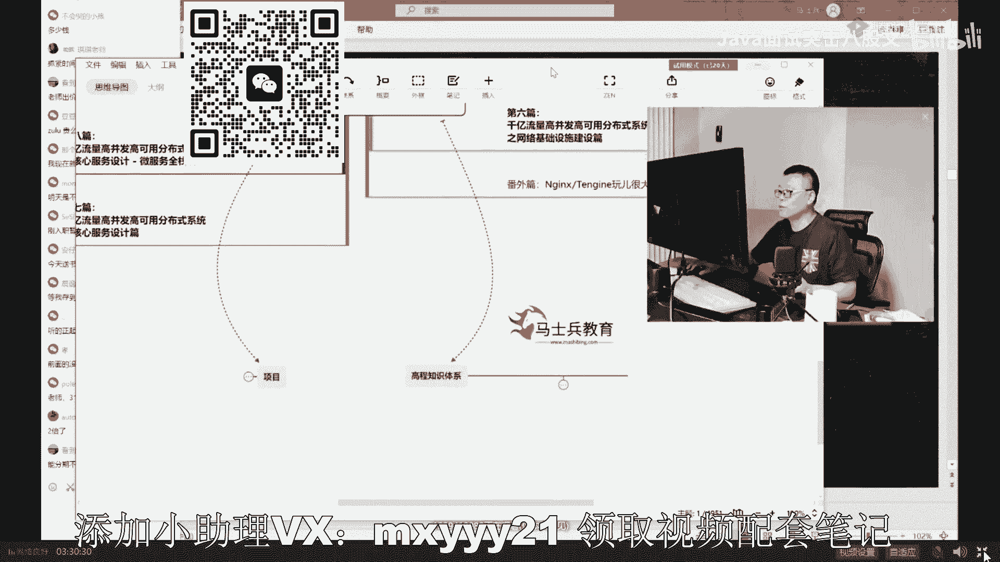

就是有很多人啊抄我们，你知道吗？但是他抄不到核心。

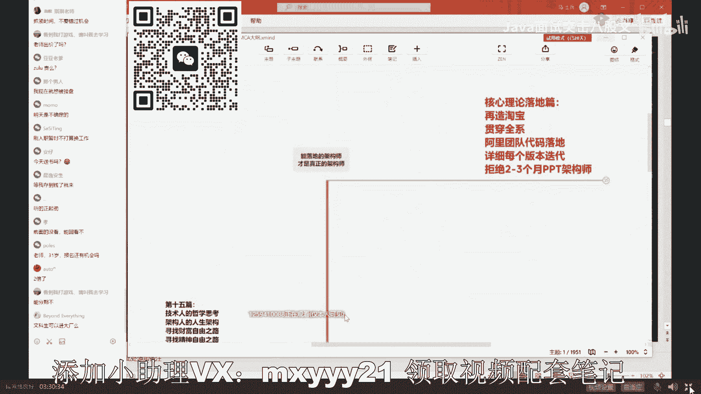

你知道我们核心在哪？我们讲架构师核心在哪儿？不是给你说什么高富质的理论基础技术底层算法啊，你你就自己看一下啊，就这打开之后都是90多的个节点，68个节点，47个节点，我不给你一打开基础设施啊。

eng核心服务的设计，八大项目。嗯，八大项目里边呢，任何一个项目都有我们的技术白皮书。好吧。

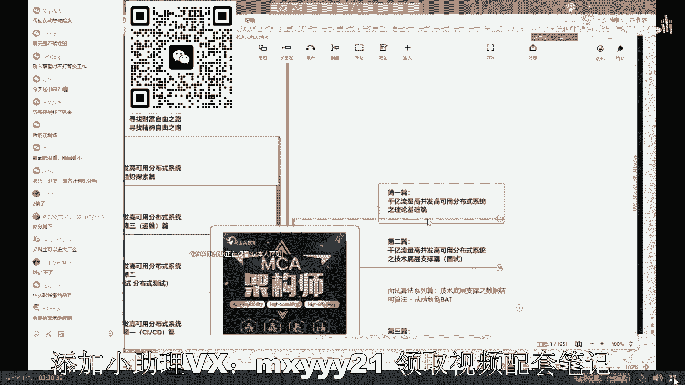

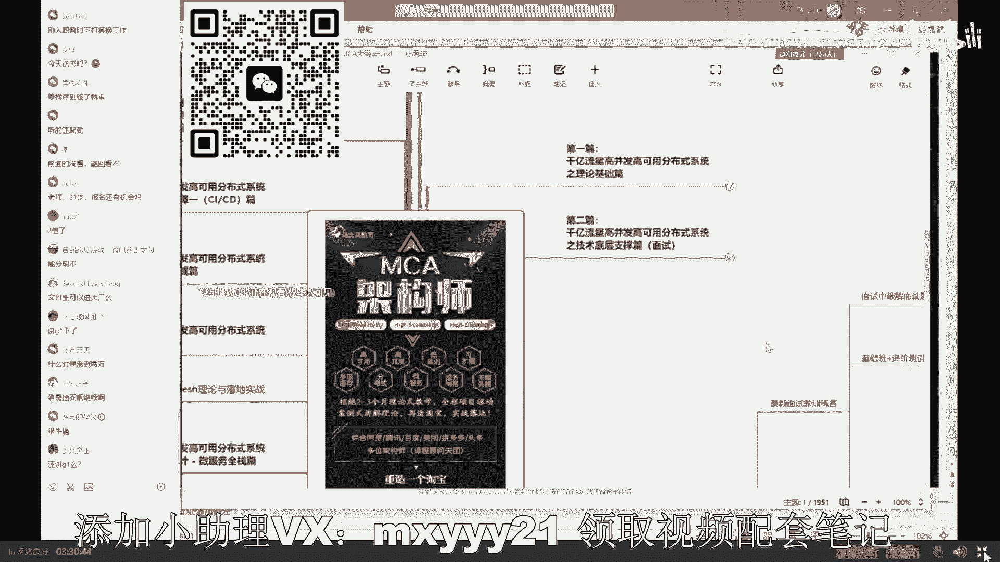

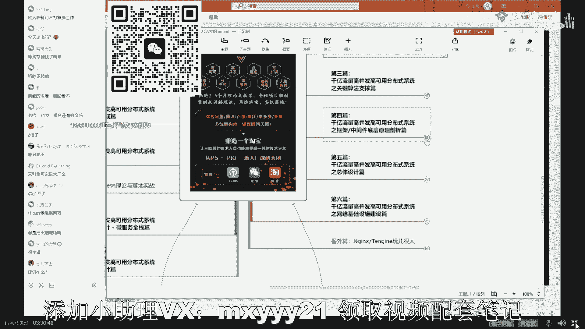

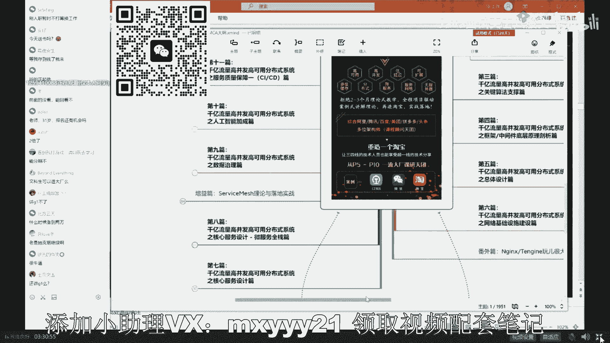

呃。涨新的技术体系啊，就直接就直接就是涨新的技术体系。我我我只是拿了这块出来给大家讲的，这样调优案例化实战指导啊。像其他弄呢都没有。就就就不给大家一一介绍了啊，太多。总而言之，家而总之，你放心。

别人家有的这全有他介绍到天上去，别人家有的这全有别人家没有的，这也有。

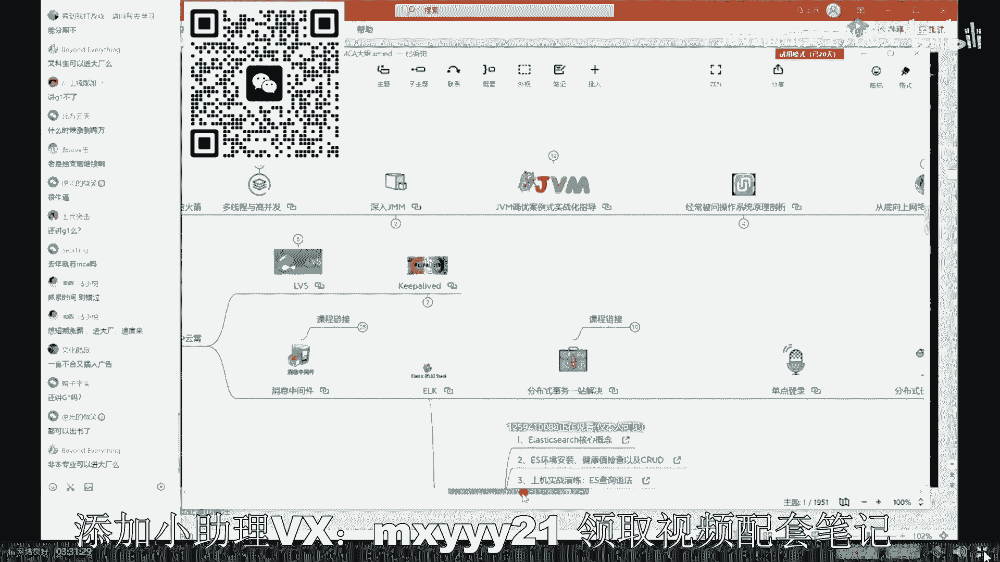

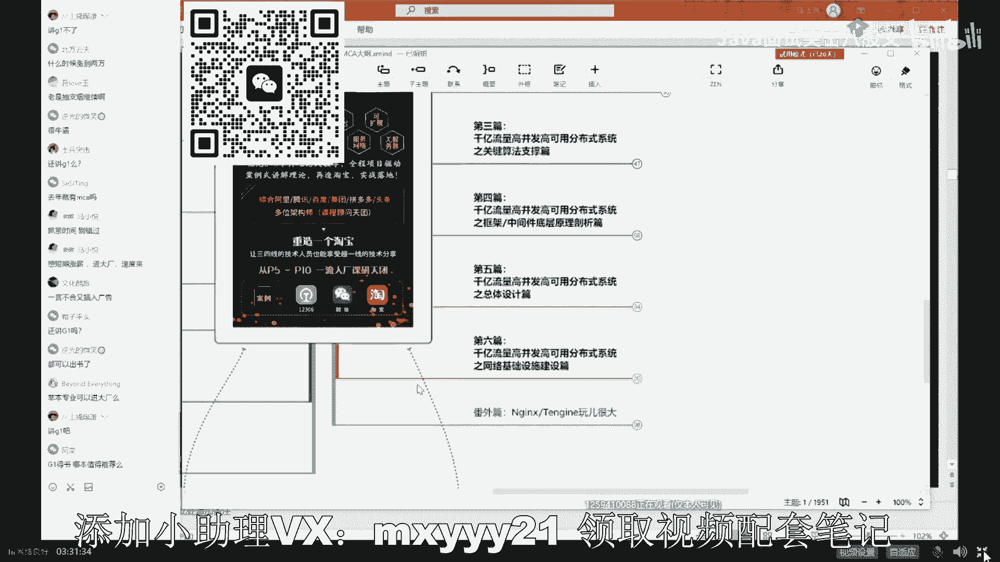

我给你举个最简单的例子，我们要教你一个架构师，你知道怎么教你吗？就像你要搭一个淘宝12306天猫这样的一个架构，怎么教你？

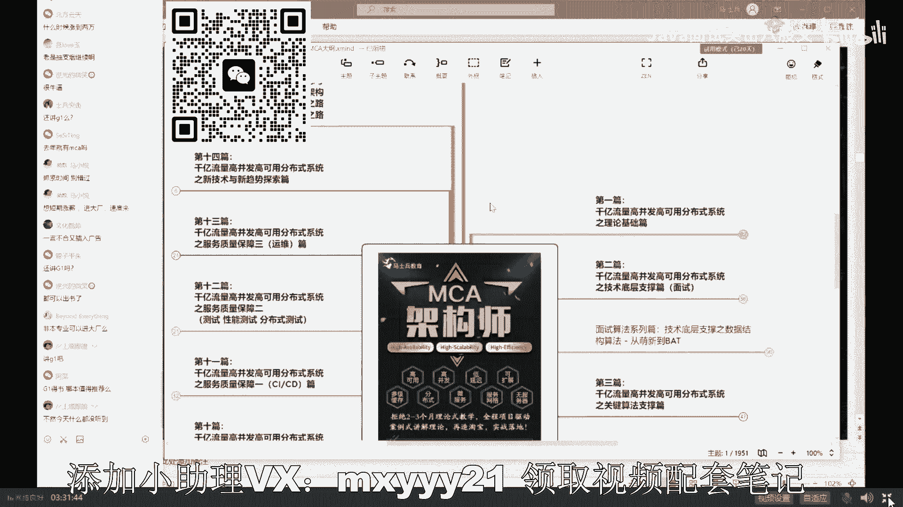

我是直接拿一个项目落地。没有人这么讲，只有我们这么讲。大多数人都是PPT架构师。所谓的PPT架构是啥样啊？

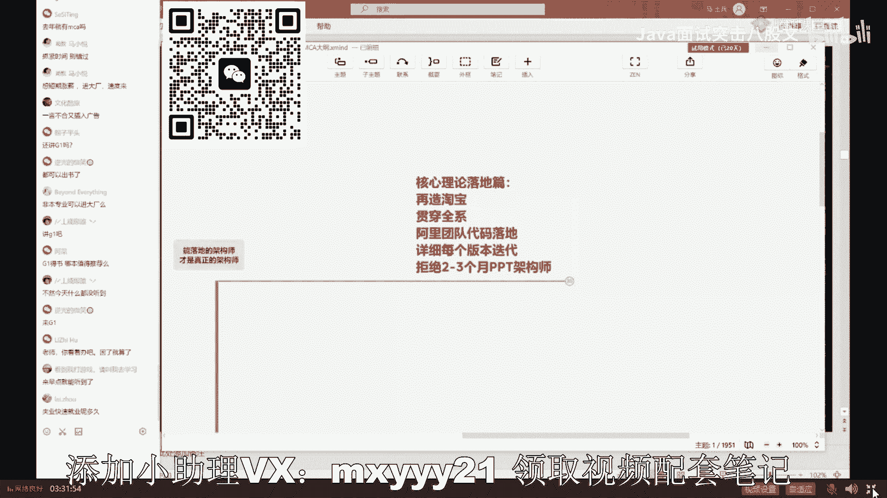

就是给你画一张PPT嘛，让你看上去特别的牛，落得了地吗？落不了。好，我们是亲自在阿里云上买了服务器。这里面画的每一个图都是我们在阿里云上买的一台服务器。

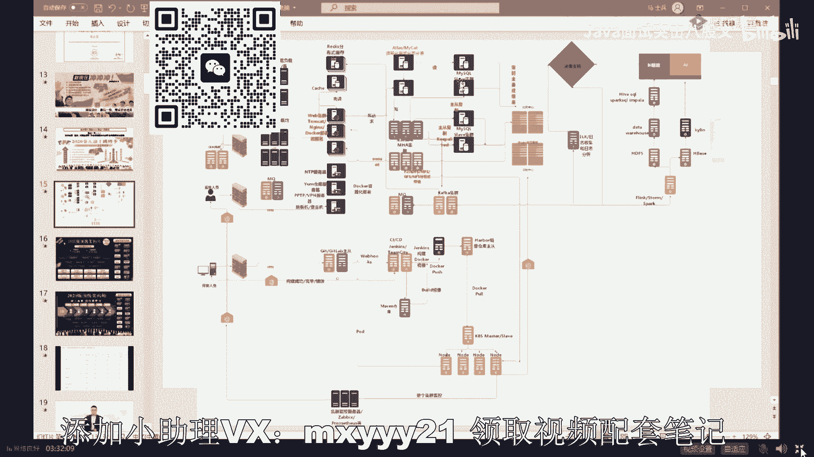

一步一步的教你搭建这几十台服务器，上百个节点，它是怎么一步一步建立起来的？从。分布式ID省中心配置中心索集群事务集群缓存网关注册中心监控MQES分布式tent系狗。大概花了60万。啊，是不惜血本的投入。

好吧。我觉得啊只有这样只有这样，哥们儿，你才能成为真正的架构师。然后你搭好之后，好好在这个项目基础之上给我做压测。我们的设计需求是达到千万级并发，为什么要达到千万级并发？很简单啊。

淘宝我记得当时大概那个交易接口大概双十一的时候大概是60万的并发。怎么才能到千万并发是它的十好几倍呢？其实你只要把架构打好了之后，做到这一点也很容易。当然，淘宝它自己呢做到60万并发其实就够了啊。呃。

做到这点也很容易，架构搭好就可以。就是我教你手把手的带着你把这架构给搭起来。😊，这才是真正的牛逼的架构师，好吧。当然，语言层级。源码层级像源码这一类的内容课程，最新开的班。嗯。

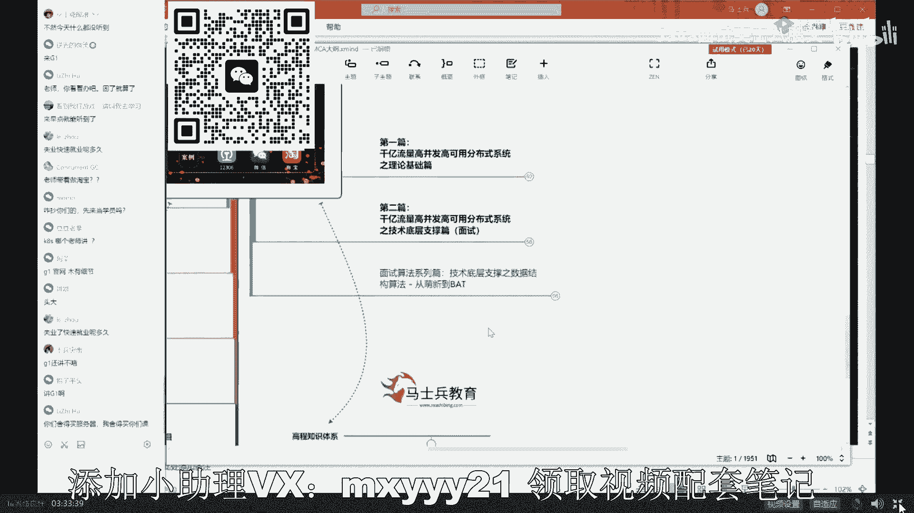

好。

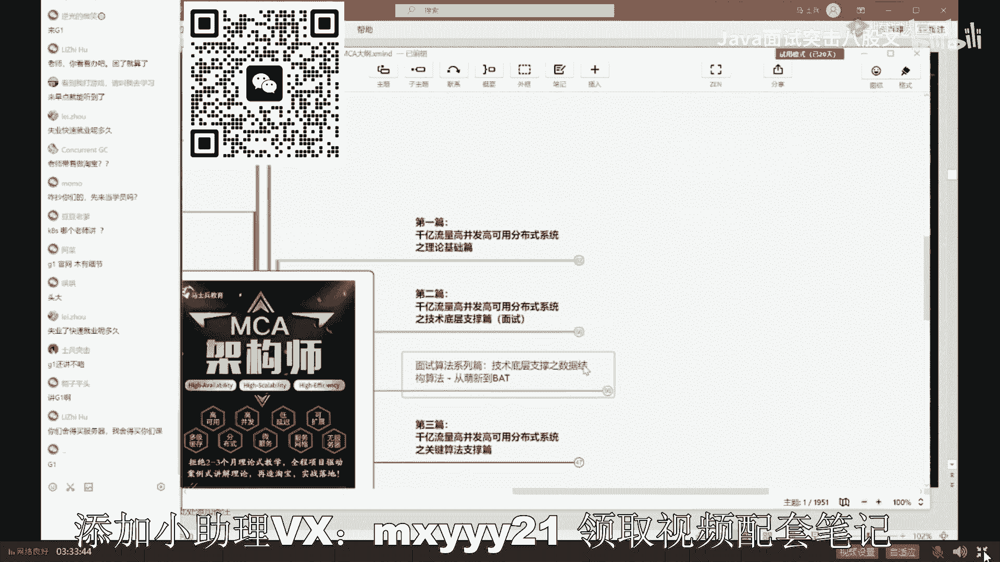

嗯。😊，源码层级这一类的啊，我基本上讲到的模块都会都会给你讲讲到源码机spring呃，什么ncks，什么tmcaspring cloud全系列啊，这个MQELK N。

然后hospot你像没有人没有人给你讲这种源码，知道吗？就是教你怎么样呃编译一个hospot。

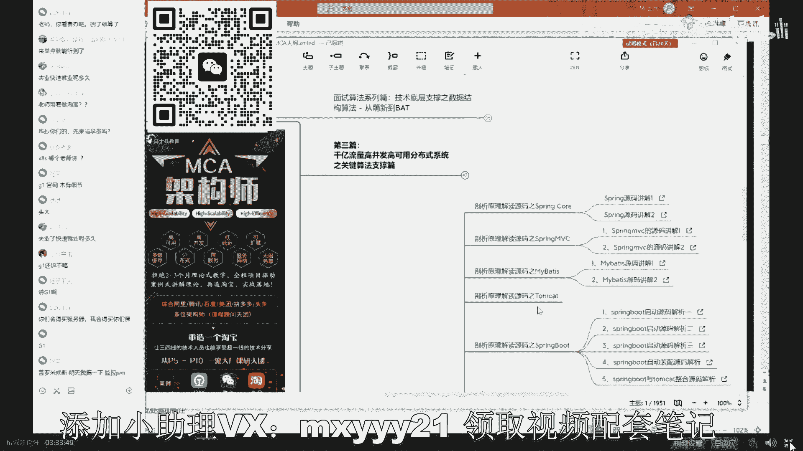

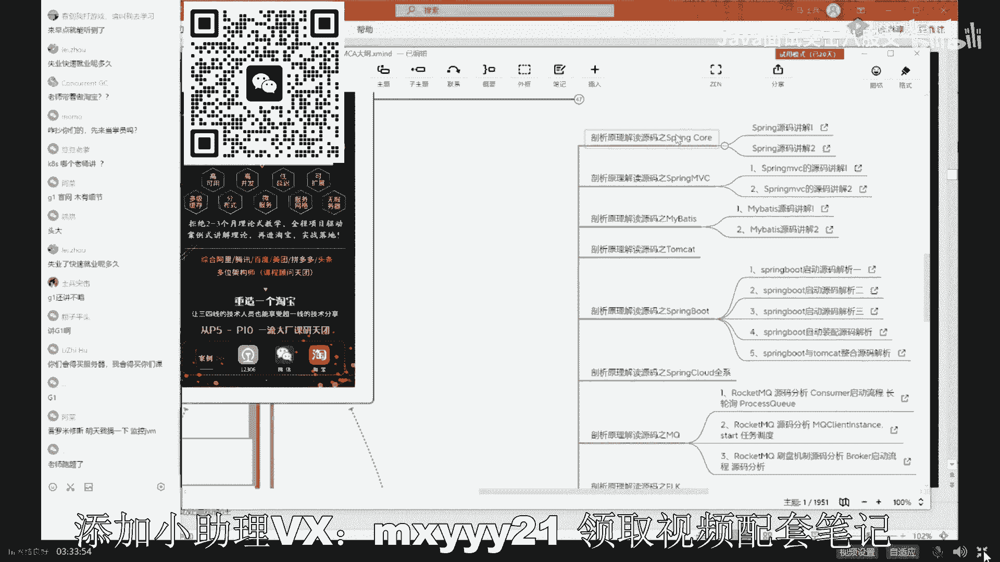

然后呢，怎么怎么怎怎么进行各种各样的性能提升，怎么样进行启动。以及呢我在给你讲垃呃垃圾回收的时候，都会给你带到hopot内部。reislinux内核原码myxico原码polo的原码啊等等等等，好吧。

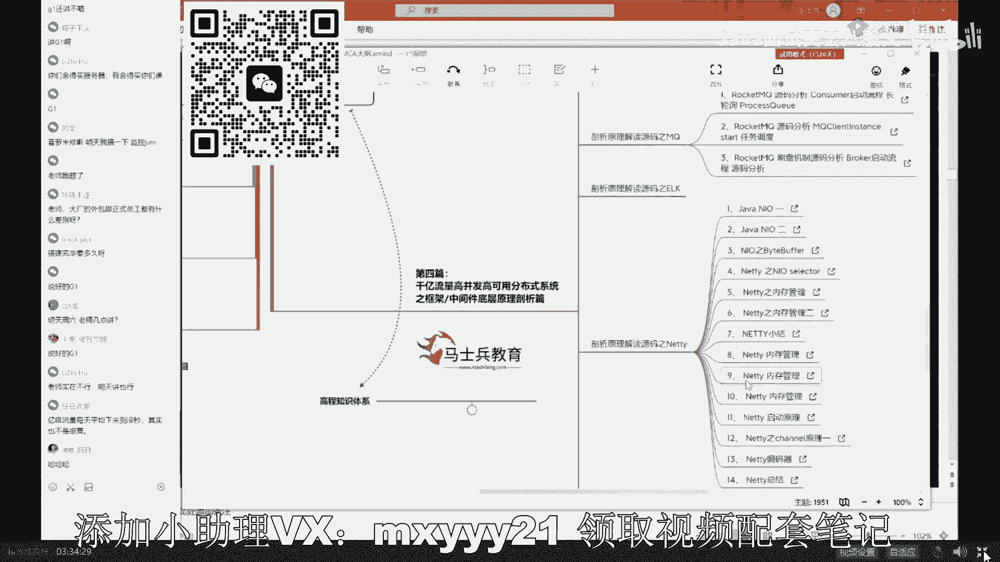

啊，所以你知道我们课不仅是受学生学生欢迎，我们是那个腾讯课堂唯一only one的腾讯课堂only one的最受欢迎课程。O。与此同时呢，其实。

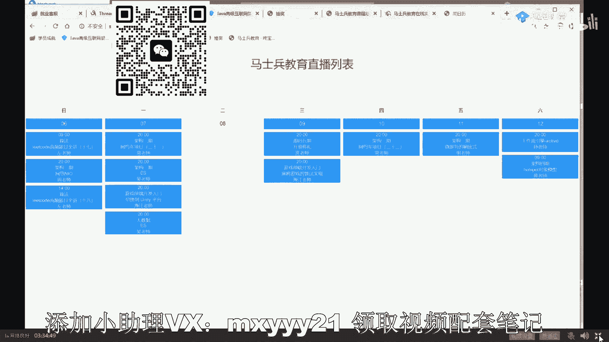

这是我们我们我们学员给我们的一些评论，大家也可以到网上自己去看啊。1297条评论没有一条是差评。名气实力啊，这套课程大而全内容共一个结果讲到十节课。因为我们是保证讲课质量，我们不计我们不计不计成本啊。

就是说讲多长这件事不在乎。不像线下规定3天就得3天，三天讲不完，我给你讲10天，没关系。量大的同时得到了很高的质量。如果不是认真负责的做教也根本做不到。每一位老师都很优秀，这都是废话。

20多位这是来源于一线达成。帮助你舌走很多弯路，犹豫就会白给，果断等于白给。

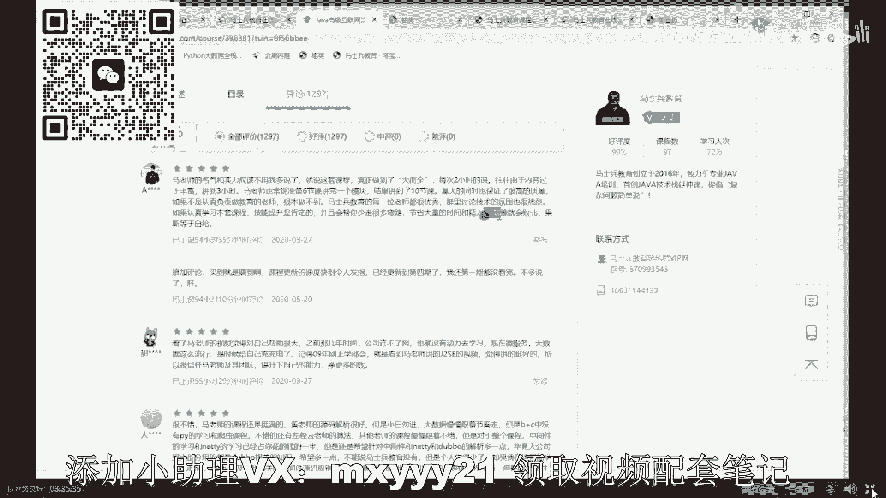

94小时之后又加了个追评，买到就是赚倒课程更新令人发指。好，很不错是吧？嗯，做成员老老师算法课啊等等。业界良心，团队、售后服务都是一流的。

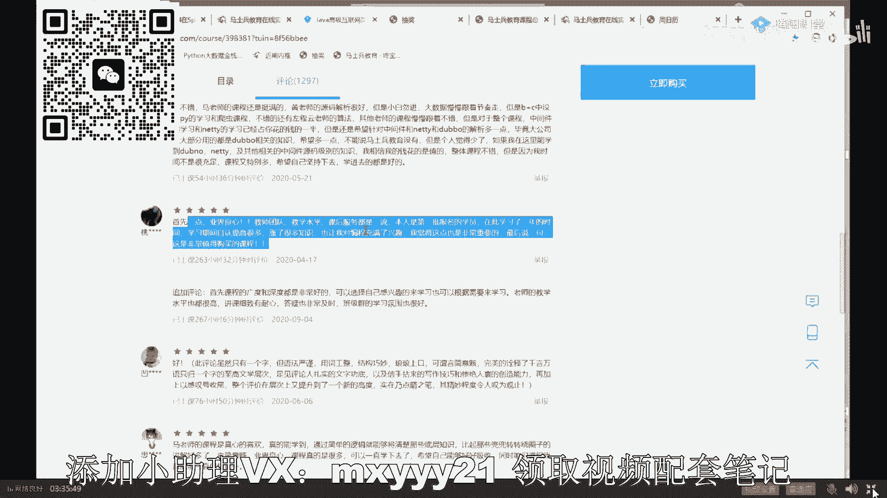

好，真心的机会真的能学到。这次跳槽找到工作之后，特地回来评价，他学了200个小时之后找到的工作吧。只自己们那么热，不论大厂还小厂，都能独当独挡一面。感谢训练营方向是吧？相见恨晚100多个小时。

除了受到学生认可啊，我们为什么说做者最受欢迎？除了受到学生认可。

我觉得我们比较牛叉的呢，还是受到我们用人单位的认可，看到了吧？

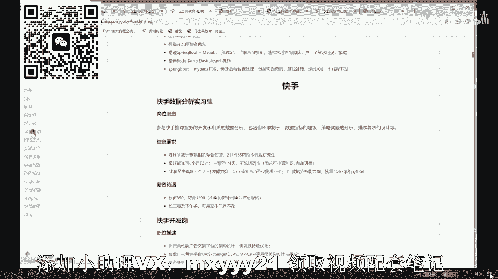

这是我们用人单位的认可。呃，字节跳动的专供我们马老师同事验证使用的。4月4月13的时候主动找到我们说。看到我们课程，就觉得有不错的学员。来就是了啊，小伙伴们水平到了，全中国一线大厂。

任何一个内推机会全都有。呃，最近刚刚给一个应届生推到了基本上中国一线大厂全部推进去了。看看看我看我我看有他的那个聊天记录吗。Yeah。也有人电脑上吗没有同步啊。看到了吗？

这是这是我刚刚啊这两天刚刚刚刚推进去的。刚刚给学生推进去的。这是百度实习也可以接受啊，然后。给推到百度，推到拼多多的反馈，推到字节的反馈。就一线代场这儿的渠道有的是。每个机构都说自己有内推内推渠道。

其实大多数的呀就是给你把简历往那个HR那一扔。咱们这是真正的内推渠道。我直接给你找到用人的那个你的顶头上司。O。好吧。嗯。我大概给你讲了，刚才讲了这个这个这个这么多啊，大概讲了这几个了。

salpoPS重点聊的CMS它的三4标记算法，它的解决方案，它解决方案的毛病。siro old parallel这相对简单。后面三个我简单给你介绍。11点半。抽奖可以吗？可以的话，给老师扣一来。😊。

还能我操。你今天听了三个多小时课了，你们还能听啊，太扭到了。😊，明天讲G万吧，这晚了，明天明天还讲实战呢，大哥明天讲实战。😊，实在比这更好玩儿啊。我们11点半抽奖好吧，我我我大概给大家介绍大体性的大体。

😊，最粗的方式。