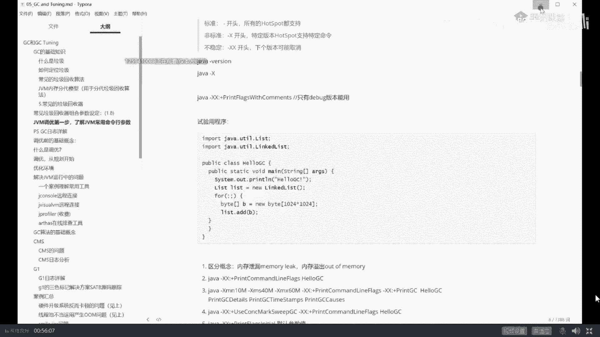
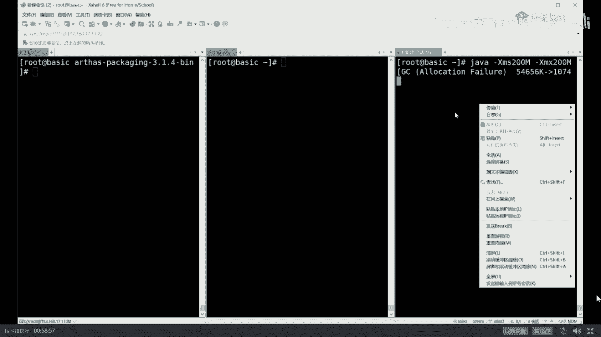
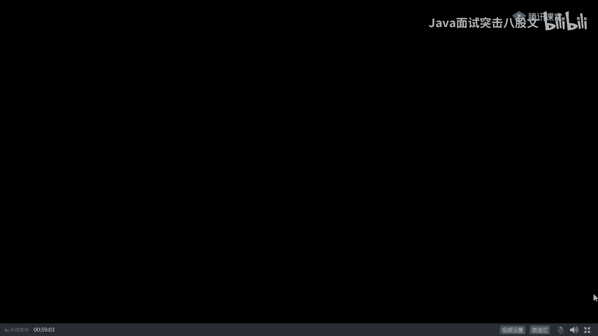
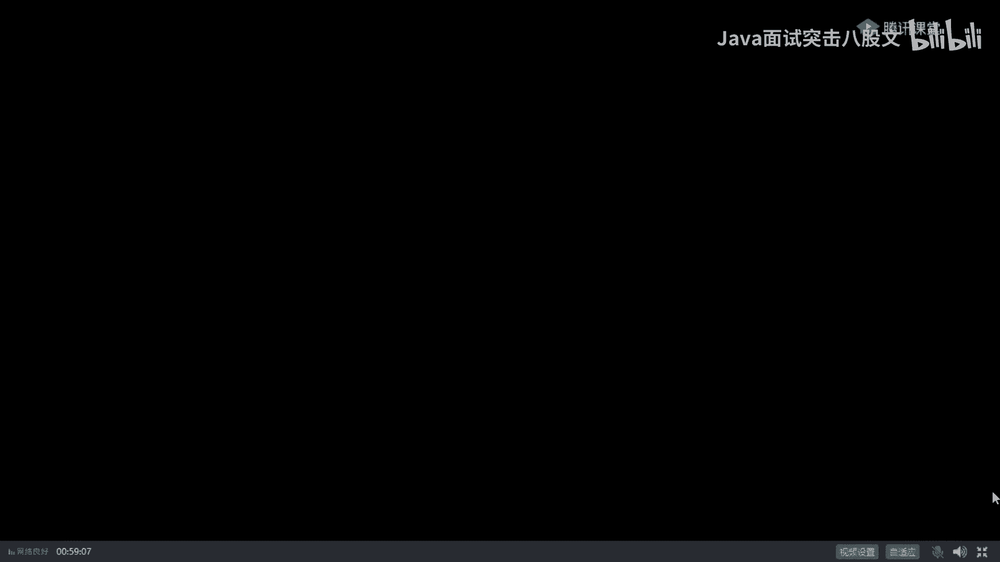
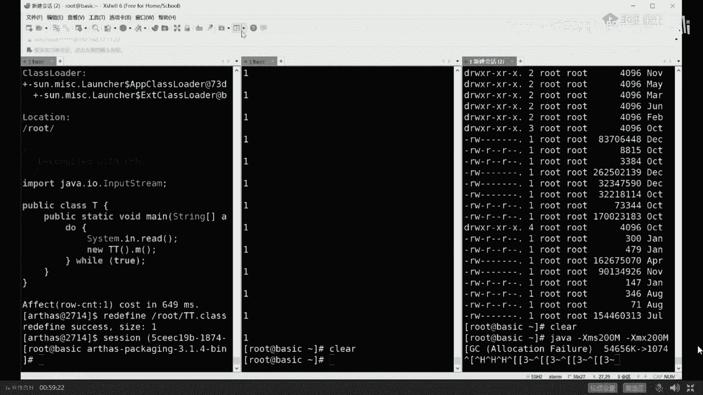
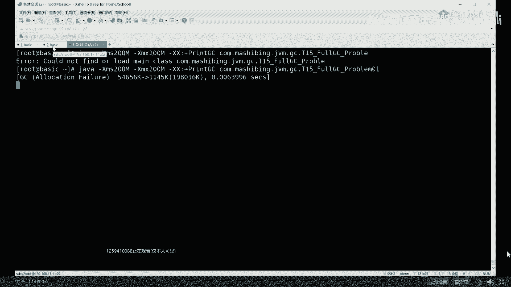

# 系列 4：P13：【JVM调优实战】为什么一个百万级TPS系统会频繁GC？ - 马士兵北京中心 - BV1VP411i7E4

说呢我用一个具体的例子来给大家来讲。大家看这里啊，我们那有一个小程序，这小程序呢业务逻辑上我大致解释一下。这个小程序是这样一个业务逻辑。小程序来源于实际。我们有一个小伙伴在工作之中的一个问题的模拟。

JVM调优这这一类问题比较麻烦的问题在于，我很难跟你模拟真实环境，因为真实的环境很可能一个月才出一次。我跟你这模拟一个月，然后为了出这个问题太累了，所以我只能用模拟的环境。

用最快的速度让它fell over叫快速。for fast是吧？快速的让它展现出来它的bug之所在。所以这个小程序是模拟的，虽然是模拟的实际场景之中，它就这样的，你好好听看是不是大致能理解。好。

这个小程序模拟了一什么场景呢？这个场景是在银行体系。或者是互联网金融体系里头进行风控的这样一个模型。风控。简单说，我要给一个哥们儿放贷款，这哥们儿叫博传玉。对。他们家有祖传的玉石藏在柏书里头。

OK说明这哥们信誉比较高，信用额度比较高，我可以给他贷100万。好，换另外一哥们儿，这哥们儿叫st。好，这哥们儿的名字起的太怪异，他的信誉度很低，我只能给他带1000块钱。啊，这东西怎么算出来的？

是根据每个人过去的一些信用情况。信用卡还还还还款的这种及时性啊，借了多少钱，有没有其他的债务啊，是怎么消除的，以前有没有借贷过等等啊，有没有借贷不还的。好，根据这些算出来的这叫做风险控制模型。

风险控制这个小程序就是模拟了从数据库里面取出每一个人的个人信息来套用一个风险控制模型来计算出来。他到底可以给不给他的贷贷款，或者说他的贷款额度到底给多少？啊，这个背景大家听明白的，给老师扣个一。

你 you know your level。去找找一下那个叔叔，让叔叔把你送出去啊，嗯拜拜嗯嗯。没有。好嘞，我们继续啊，看大家看这里。😊，这个小程序呢每一个人的个人信息呢。

我用了一个开 offer来模拟它，只读了信用卡信息。实际当中比这复杂好多。信用卡呢包括它的呃用信用卡额度，包括他的名字，包括他的年龄啊，包括他的生日等等。然后我们用一个。有一个方法。

它呢每次呢都从数据库里面读出100条数据来，读出100条数据来之后呢，加入到我们的test list里面，加入到我们的任务列表里。我们起了一个线程池。

这线程池呢叫s spread to executor。这你学过的话，你就学过，没学过的话，大致理解就行了。它是。固定时长，固定频率的来执行任务的这样一个线程池。在这个建程池里面有50个线程。

然后每隔100个毫秒执行一次任务。在这个任务里面，以固定的频率拿出每一条数据来。每一条数据拿出来来进行计算。大概就是这么一个模型。哦，这个程序呢你理解也行，不理解也可无所谓。

我现在给你把这个程序运行起来，我直接告诉你这个程序里头有毛病，有bug。我举个例子稍微复杂一些，我不想举那种特别简单的。你比如说拿一个list不断的往里扔。对象，然后一会儿就内存溢出了，这个太简单了。

你要跟面试官说，你说我有实际当中调优经验，面试官肯定会问你啊，你实际当中什么情况下需要调优，那遇见了什么问题呢？你跟人家说说有一成语员，反正不是我写了个list，不断往里扔，从来不往外取，很快OOM了。

你如文肯定拿大嘴巴子抽你，这也太简单了，好意思拿出来说吗？😡，可是即便是这样。确实在实地生产环境之中，真的有人犯这种错误。由于业务逻辑混杂在其中的时候，程序就会显得特别复杂，就有可能会产生错误。

这没招了。

但你尽量不要说这个太low太low了。好，我刚才讲这段能跟上吗？能跟上给老师扣一来。😊，你不要太low啊。three local内存泄露那个太高大上了，我觉得你未必能cover的住。

你做什么写了sloc它怎么产生的内存泄露？这个你未必能cover住。不须。好的，看这里。Yeah。我先把这程序给刨起来。这小程序呢我加了几个参数，看他能不能认识啊。第一个参数呢叫杠XMS。最小堆大小。

第二个呢叫杠XMX叫最大堆大小。printnt GC运行过程之中，把我们垃圾回收器的日志输出打印出来，最后是我们的程序。这里问大家一个问题，为什么我设最小堆和最大堆设成同一个都设200兆。最小跟推蛋。

不一般的情况下不设成一样的吗？为什么？晨晨前面没听着，太遗憾了，没关系，不耽误后面听。不用扩容，没错，防止内存抖动。既然你明确知道我的应用程序会占到200兆内存，直接给它分配200。

不要让它没事涨来涨去啊，涨一点涨一点涨一点，涨到最大之后，如果用不着了，又往回缩，缩完了之后又往回涨，还消耗资源。ok。盖到这点之后，我们教会住。这个。应用程序啊。

我们的java的这个进程就开始跑起来了。下面呢我开始是教大家纯实战的内容。嗯。嗯，排练一下。嗯。好，我们排列它一下啊，这样我们看的会更加清楚一些。呃，我们右最右边这窗口里头是我们呃现在正在运行那个程序。

这个小程序呢时间一长它会出各种各样的问题。目前为止呢还没出问题。目前呢它只是展现出来了，说我产生了一次GC。这次E次GC这是什么意思呢？嗯。又应该是怎么给他放到最大嘞。

Well。

。对。我把这窗口呢还是。垂直排列水平排列合并所有吧。这样我切切一切吧，让大家伙看得更加清楚一些啊。

重新运行一下这小程序。贵州。回州重新运上这小程序啊，这个排成三个窗口，不能把信式信息显示完全，看上去也很别扭。嗯，当们运想起来这个小程序之后呢，你会观察它的小程序呢会产生一些日志输出。

这些日志呢你看大概大概是能看明白，我稍微解释一下。这个输出日志输出的是比较粗的日志，并没有输出很详细的。如果输出很详细的，我需要跟你解释半天。还是那句话，我们先略过一些细节。大家看这里。

它产生了一次GCGC产生的原因叫allocation failure。什么意思啊？分配失败。那意思就是说我有一块内存被占满了。好，这个这个DC叫YDC。在年轻的DC。然后这次回收产生了什么效果呢？

原来我的年轻代占了54兆。接下来回收一次之后。回收成为一兆，说明回收了53兆。哇，这次回收的效果很明显啊。😊，然后我们总的GC的呃总的堆大小是20兆啊，200兆，sorry200兆。嗯，时长是多少？

这块我大概说明白了吧，有没有谁在这块有疑问呢？没问题吧，没问题，给给老师扣一啊。嗯。

。