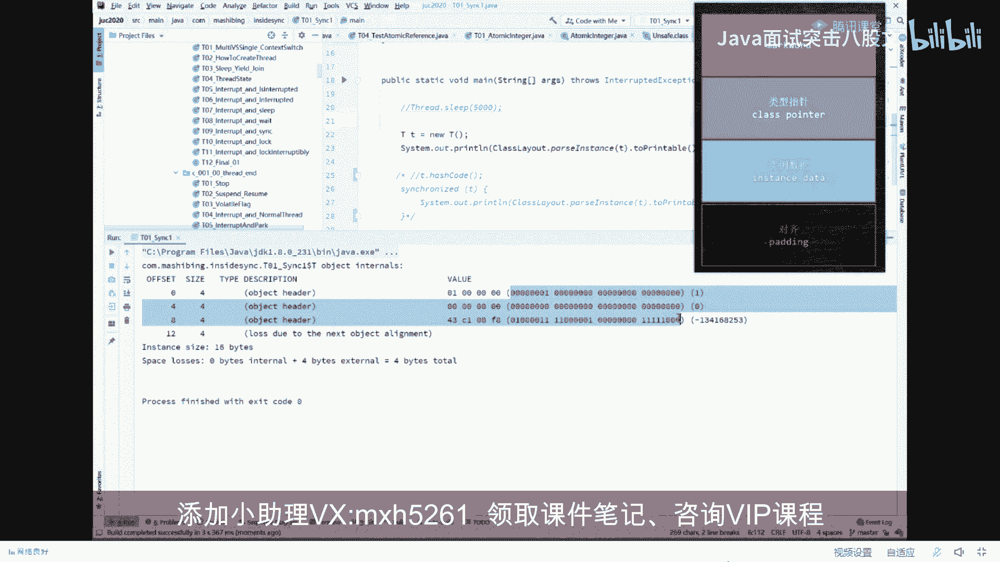
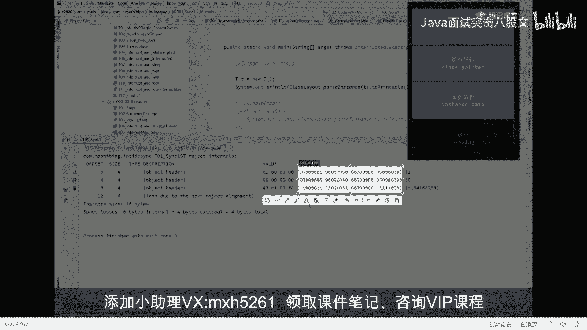
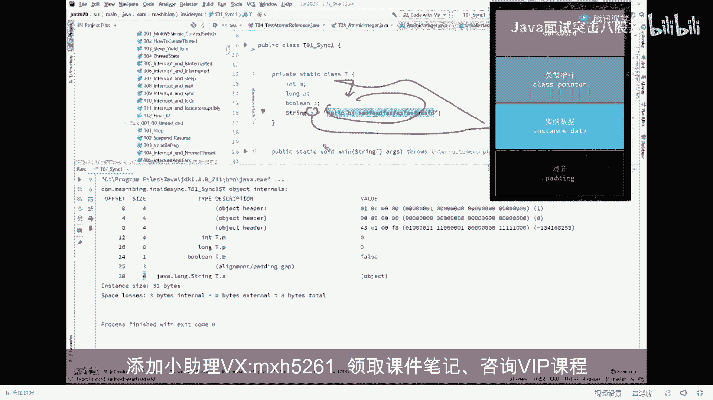
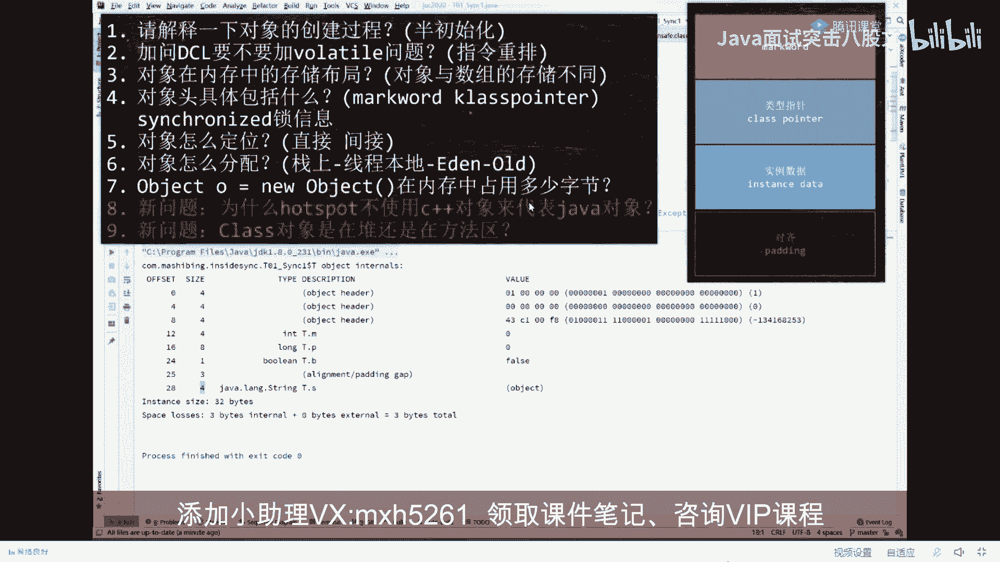

# 系列 4：P18：【JVM大厂面试真题】对象在内存中的存储布局？(对象与数组的存储不同） - 马士兵北京中心 - BV1VP411i7E4

今天呢我们来讲这个呃111个关于职业VM的一系列的问题。这一类问题呢比较难，非常的难。呃，如果你没有听过或者没有接触过，基本你答出来可能性呢很低。看这里。现在的大厂的很多问题，他会他会追着你一问到底。

嗯，还有很多同学说我现在开始问那个原码机的内容了。对，这个很很正常也很正常啊。呃，原码的课呢我们讲的也非常的多了，深入的级别呢会讲到lininux内核的源码。那么软一点的，你像JDK的一些个源码呢。

肯定是要讲到的AQS啦啊等等这些好，不废话。呃，我们来看这个关于JVM的呃原来问到的这个7个问题啊，这7个问题是什么呢？他实际上就围绕着这句话来完成就这么简单的一句话。

这句话大家伙一看呢都能知道是什么意思。但是围绕这句话所诞生的7个问题，你就未必能回答的出来。😊，在这里。他是这么来问，他说第一个请你解释一下对象的创建过程。对象的创建过程是不是就是你扭出这个对象来。

中间执行了有哪些过程？😊，好，第二一个呢叫做DCL要DCL要不要加volatile。这里是关于指令重排序的问题，同时也涉及到多线程的问题啊，同步的问题。那么第三个问题呢。

是在对象在内存之中的存储布局到底长什么样？什么意思？我们扭出这个对象来的时候，它在内存里面到底长什么样？好，第41个对象头呢主要具体包括什么？当你明白对象在内存中存储布局的时候。

你就知道对象里面有一个东西叫对象头，到底包括什么？好，第51个对象该怎么定位，是直接还是间接。第61个呢是对象怎么分配。第七1个呢是在内存中占有多少个字节？呃，后来又他们内部在问问题的时候。

又加了两个更加深入一点的问题啊。第八个问题叫做。为什么hosport不使用C加加对象来代表ja对象？当然这个东西就涉及到一些hospot源码了，会稍微更难一些。

C加加大家都知道hosport是C加加写的。M那为什么不用C加加对象，直接来代表招务对象呢？😊，而是要采用那种OOP class2元模型。我先跟大家说一下hopot里面采用的是这种模型来代代表招就行。

叫OOP class。OOP class2元模型。好，第九个问题第九个问题是。class想到底是在堆啊，还是在方法区？呃，关于这9个问题，有多少同学能够感觉到答不出来的，你给老师扣个2，嗯。

我来认证一下。嗯。好，我今天呢给大家把这些问题讲清楚。由于内容比较多，大家认真听。我预计。哦，不一定是按照顺序来。好，现在开始。看这里我我先把这个题啊这样啊，我先把这题。先来给大家伙。😔，复制一下。

一会儿呢我们边看着题，我们边来回答问题啊，我们先看第一个问题。第一个问题我先回答家回答大家伙这个问题。就是对象在内存中的存储布局到底长什么样？呃，这个呢我就不卖关子了。我们直接呢。来看啊。

就是扭出一个对象来的时候，这个对象在内内存之中的存储布局到底长什么样？注意看一个普通对象扭一个对象。平时我们这个课程里都这么讲说扭一个对象来的时候，这个对象呢是往堆里头这么一扔啊。

画一个方块表示一个对象。但实际上大家都知道一个对象来说，就是一连串的010101。好，这些01里面每一个东西到底代表的什么意思。他问的是这个东西。认真听。作为一个普通对象来讲。可以说它分成四部分。

这四部分呢第一部分叫mark word。第二部分叫类型指针，也叫class pointer。好，第三一部分叫instance data，第四一部分呢叫对齐。为了让大家深刻的认识。这个东西。来，听我说。

我把这部分抓下来。我们来写一个程序来认知它。柯刘林。呃，这程序呢需要用到一个小小的内库，这个内裤的全称叫JOLJOL呢我我在这里就不多做解释了啊。JOL的这个内裤非常的简单，你百度一下。

花5分钟就能了解它怎么用。他的全称叫java。Object layout。Object。lay layout的布局的意思，java对象的布局。通过这样一个内库。

我可会很简单的很直接的了解到一个java的对象在它内部到底是怎么表示的。好，看这里。我先把多余的乱七八糟代码呢给大家伙删掉。全么管他。啊，现在呢我们有一个非常简单的class。

这class叫T什么都没有，就叫T。😊，那好。当我们另有一个T对象出来的时候，它的内存布局到底长什么样，一句话就可以搞定它。😡，怎么把它搞定呢？这样来做。Class layout。

这是我们JOL内库里面用到的一个类class layout out点pass instance静态方法，解析对象解析哪个对象呢？解析T这个对象to print转转成可以打印的字符串类型。

那么呃我们先把这小程序跑一下啊，就是我拗了一个T对象。下面这句话呢对它进行了T对象进行了一个分析输出，就这个意思。很简单。往边看。好了。在这里。对照我们刚才这张图啊啊。队照，我们刚才这张图放在这个位置。

呃，对于刚才这张图来说，这里头的010101，这就是我们念出来那个对象的真正的内容啊这个。

这个就是我们扭出来那个对象里面，在内存里面的0101的布局。当然每8位代表一个字节，每8位代表一个字节。那么大家可以数一下啊，说这个对象呢哎到底是。😊。

呃，占了呃多少个字节呢？如果按01来看的话，就12341行4个三行，一共12个字节。但是呢我们对照我们整个的刚才我们所说的这个对象的布局。第一部分呢叫mark word。

请大家记住mark word呢占8个字节。这里头是八字节。这个。好，第二个呢叫类型指针，类型指针指的是哎，我扭出来这个对象到底是属于哪个类。你可以认为这里有一个指针，它会指向谁？指向T点class。

因为我们拗的是T对象嘛，这不是扭的T吗？扭的T对象。所以呢通过这个指针可以找到这个class这个占多少呢？这个占4个字点。😊，好，第三一部分叫实例数据，实力数据指的什么呢？T这个对象的。他的成员变量。

比方说他内部有一个小M，好这小M扔哪扔在了这里。好，第四一部分叫对齐，对齐什么概念？整个对象的大小不能被八整除，补齐能被八整除。就这个意思。好，我们按这个规律来看，现在的这个输出，看大家是不是能看懂了。

首先我刚才说过啊。😊，mark world占多少个字节？😡，8个字节对吧？从第0个到第四个字节，从第四个到第四个字节啊，往后再数4个，一共8个字节这里。😊，对应的马克尔。好。

下面这四个字节对应的什么东西呢？对应的是class pointer。那有同学说没有实例数据。对，因为T类型它没有成员变量。好，最后叫对齐。因为这里是8个，这里是4个，加起来12个，不能被八整除。

所以最后又补了4个字节，所以一共加起来这个对象的大小是instanceize16个字节。啊，这会儿能跟上的给老师扣个一。因为我觉得比较简单，怕同学们有的认为比较复杂的啊。嗯。可以是吧，good不错。

那有同学说老师，那那那那我要是那个我要往里头装点装点那个成员变量呢，来我问大家一句。如果按照我们刚才的这个说法。我要我要我要往里头装这么一个成员变量，intM来告诉我一下，整个对象到底占多少个字节。

算一下。啊，为什么是十6呢？啊，有时候十6有时候4，有时候24的，我们先再跑一遍。😊，run。好，看这里一共还是16个字节，哎，为什么呢？前面的12个字节不变。

分别是8个字节的mark word加4个字节的class pointer。最后呢我们有一个int类型的变量，in类型。占多少个字节呢？占4个字节是吧？所以最后加起来16个字节，由于已经被能够被八整除了。

所以没有补齐了。😊，一共这么多。好，我再问大家一句。如果我这么写。Long。来告诉我整个对象多少个字间。😊，这看来家能答对吗？long是等8个字节。对。16加824个对吧？这个是没问题的，跑一下。

来看这里24个字节。我怎么没太懂你哪儿没懂啊，我怎觉得讲的算比较简单了。来告诉我这个。😊，这个对象再来一遍。多少个字节呢？不玩类型。好，跑一下看我们看多少个字节。波尔雷型比较有意思啊，我们看他怎么做的。

好，大家看这里啊，这个布尔类型占了多少个字节啊，占了一个字节。😊，所以最后给你补了7个字己。补到8个。所以。四个字节加4个字节，一共8个字节的m word。一共4个字节的class pointer。

一共4个字节的M8个字节的long，一个字节的布尔补齐7个字节，最后加起来32个字节K。而这个呢。16S等于。hello。北京。好，告诉我多少个字典。32。323232嗯。不对吧。

那我长点一共多少个字节？😊，嗯，有没有别的答案？😊，把家看。好，看这里一共是32个字节，这时候你注意看这个布尔类型直接补补到int类型，所以补三个字节。最后这个死ring类型是一个四个字节的对象。

为什么？因为这里。不要认为当我们又出一个T对象来的时候，这个东西是存在T的对象的内部，它是在哪的呀？这个S本身是一个地址，是一个指针，对吧？它是放在这儿的。但是呢这个字符串是通过这个指针指过来的啊。

指到这里嗯。

好了。到现在为止，我觉着给你讲完这个呢，我们再来看呃。

美团问的问。