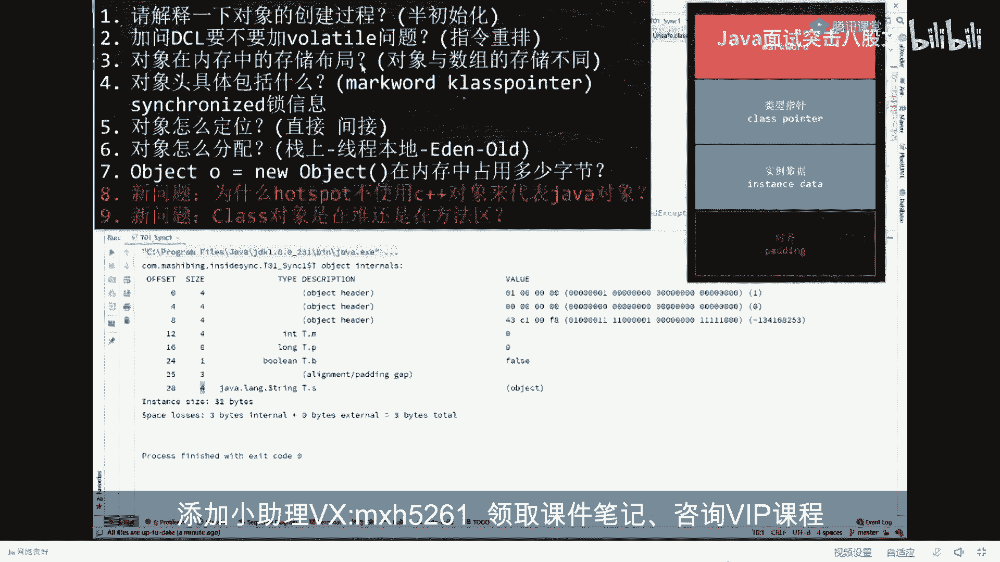
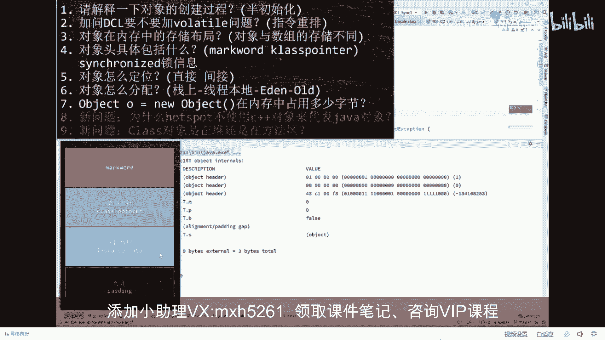
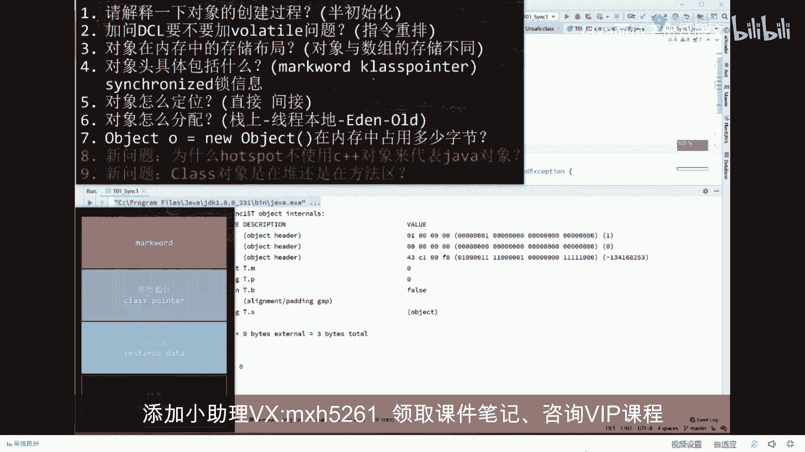
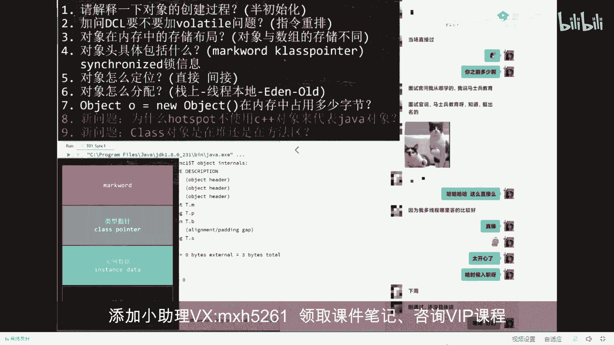
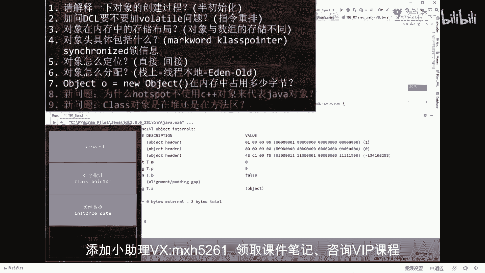

# 系列 4：P19：【JVM大厂面试真题】Object。= new Object( )在内存中占用多少字节？ - 马士兵北京中心 - BV1VP411i7E4

看第七题，第七题能答出来了吗？obero等于6ob内存中占多少个字节？多少个？说出来。16个对嗯。好，然后对象在内存中存储布局到底长什么样？

好，把这个图给我背过就行了。八字节的mark word。没有什么王八的屁股规定，只要是64位的虚拟机，它的mark word永远都是八字节64位。Cl pointer叫类型指针，默认是压缩，它是四字节。

不压缩是八字节实例数据里边你装多少算多少，反正不管你是内补齐还是外补齐，最终都得给我补齐成背8整除。

我知道大家伙还有一些细节的疑问。但是我如果你给你解答这些疑问，我就给你讲不了剩下的问题。你们是要答疑还是要往剩下的讲？我建议我先往下讲，学东西，学框架和脉络，把框架和脉络搞定之后，再去搞这些细节。

不识庐山真面目，只缘身在此山中。如果你研究一座庐山，上来先去研究山顶上某棵树下面的蚂蚁窝。我告诉你，你跟这个庐山的整体脉络就再也没有关系了。你在你的硬盘上存了很多细碎化的芝识片。

但是你从来没有建立起来过知识体系，完蛋。你的学习效率一定会特别特别低。我们呢就是自己不仅是讲求给大家一伙儿讲知识，知识这玩意儿比较简单，同时呢也教大家怎么样学习方法。同时呢给大家做一对一的规划。

所以到现在为止，我直接告诉大家，我们课程在不仅是在学生的认可了，现在是呃业界也开始认可我们的课程。

这是我们最近啊刚刚。8月30，他是去年8月31号报的名，因为他中间好多事，中间没学。球球报个喜，刚面了京东哪个部门？当场直接过面试官问我从哪学的，我说马志民教面试官说啊，马志民教育知道挺出名的OK。

就这么直接，然后多建城里回答的比较好，直接就过了。知道吧。下周刚通过，还没具体啊。

嗯，还是那句话听我的，不要听你的。

你学习了这么长时间，效率为什么低？因为你没听我的。