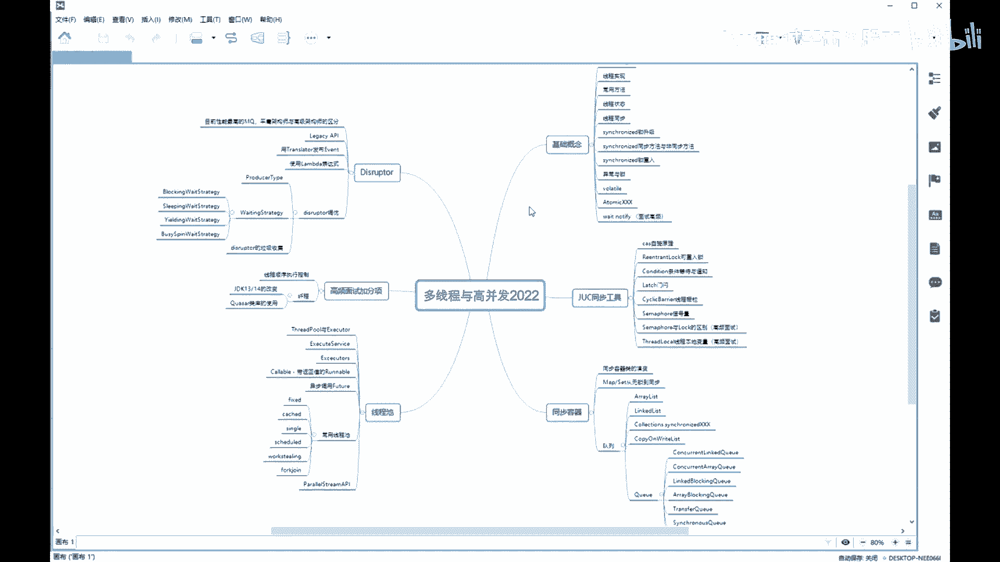
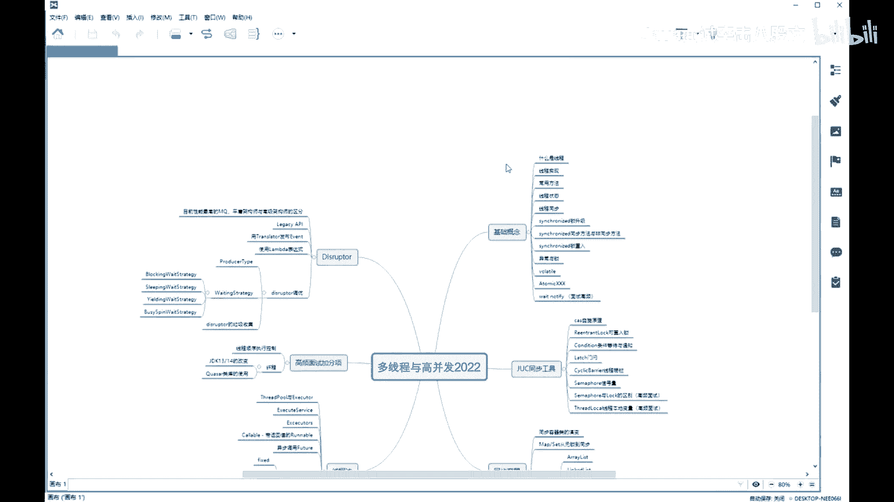
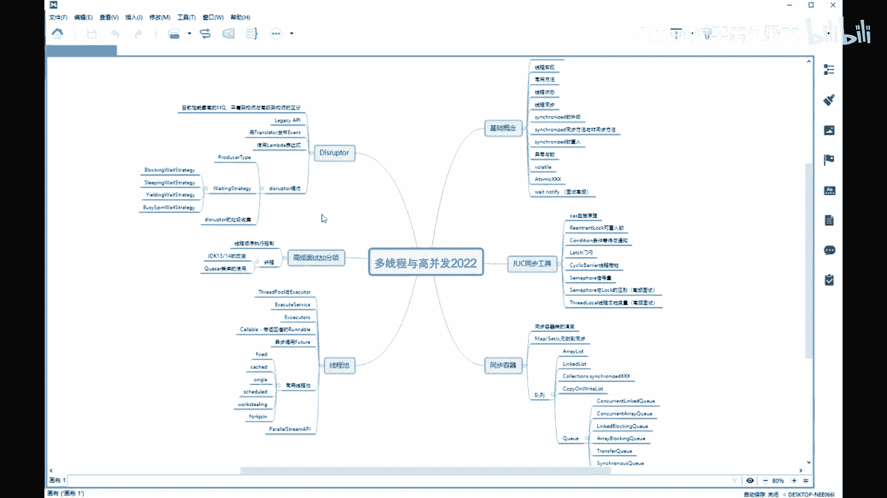
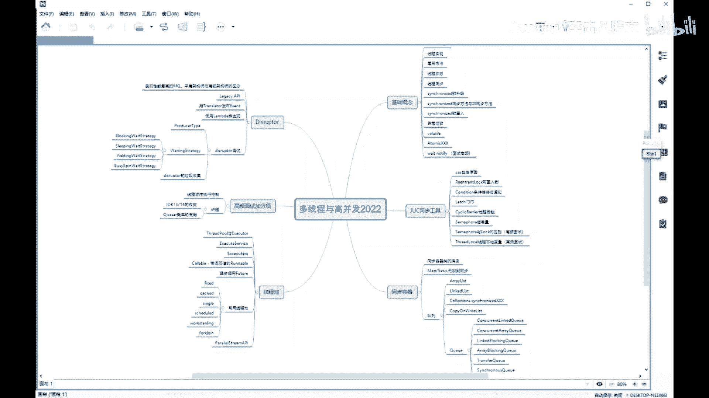
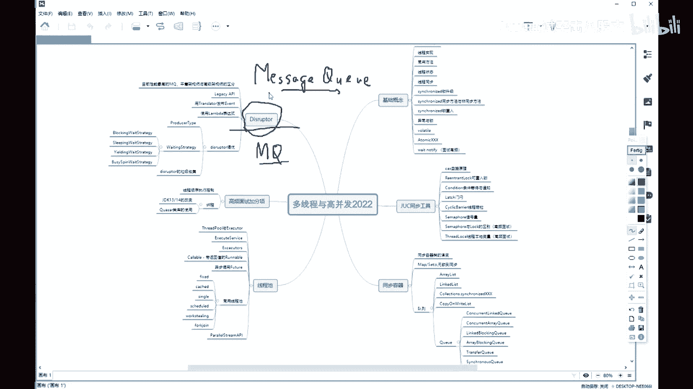
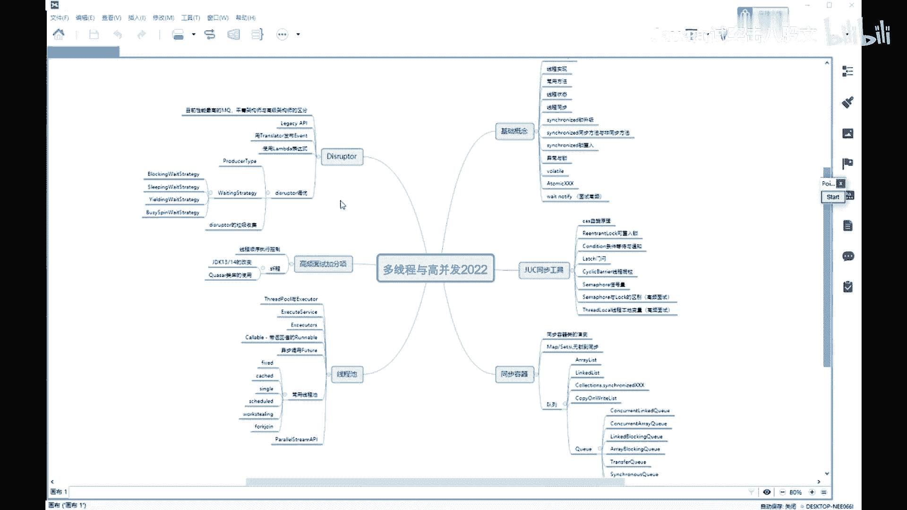

# 系列 4：P28：【多线程与高并发】课程规划 - 马士兵北京中心 - BV1VP411i7E4

He。好，同学们，我们开始上多线程和高并发的第一节课。我首先跟大家交代一下咱的这个版本里头，我给大家讲哪些方面的内容。呃。那么老师呢会给大家讲多线程和高并发啊，这两大块应该说。怎么说呢？就这两大块啊。

是现在面试里头问的越来越多啊，也是你从一个一个相对初级的成序员，然后向比较高级中高级的这方向的迈进的一个必须要踏过的一道坎。呃，我先跟大家简单交代一下，就是后面会讲的哪些方面的内容。无论如何呢。

这些方面内容呢都会给大家讲完。呃，我的预测是4到6个周末啊，这个不一定能够讲完。如果讲不完的话呢，呃咱们再往后就拖一拖。另外呢呃老师讲完这块之后呢，会讲那个JVM呃，原来排的操作系统的课呢。

排的JVM后面会比较合适一些。呃，我后来考虑了一下，因为先讲操作系统其实呢那里面呢也有很多同步的东西。那么同步的这块呢，实际上和多性程和高定方案啊。有些冲突，我们不如先学最直接的。学完这个之后呢。

我们先学在学JVMJVM也是离我们最近的。呃，你要是想去跳槽的时候，马上能用得上的。呃，在这个之后呢，我们再来讲操作系统，其实你理解起来呢会更加相对容易一些。呃，我大概讲六大块，呃第一大块呢基础的概念。

什么是现程开始啊，今天我们基本上就能把基础的概念应该讲差不多。那么第2块呢是JUC的同步工具。第3块呢是同步的容器。第4块线程池。呃，第5块呢是高频的一些面试的东西啊。

呃，包括县城，第6块呢是呃destructure。呃，不知道有多少同学听说过这个框架的这个框架呢，它也是1个MQ框架。

呃，把我的画图软件调出来。这这个。对。嗯嗯。我先他0。Yes。

Yeah。那么这个框架呢也是一个MQ的框架啊。啊。一く。好，这MQ叫什么呢？叫message。Q。叫消息队列是吧？那消息队列呢非常多啊，后面还会有老师给大家讲那个呃actMQ啊，卡夫卡呀。

这些都是消息队列啊，包括radis也可以作为消息队列。好，我给大家讲的这个，如果你能在简历里都体现出来，并且能够跟面试官说清楚，这是1%万%的加分项目。呃，这个呢是叫做destruct。

应该来说是目前大家伙公认的，在单机环境上啊，效率最高的性能最快的这样1个MQ。讲到的时候我们再聊这个问题啊，得需要了解前面的关于病发的这部分的内容。

