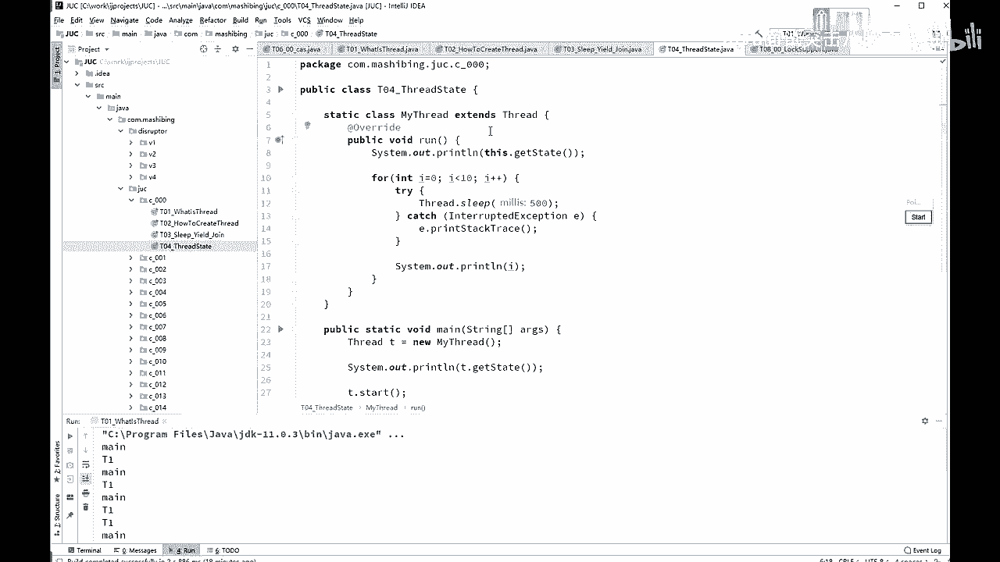
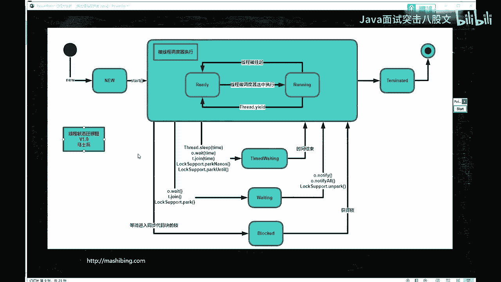
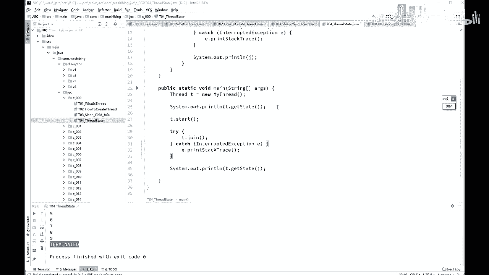

# 系列 4：P32：【多线程与高并发】线程的状态 - 马士兵北京中心 - BV1VP411i7E4

好，我们讲下一个小节呢，叫做thread the state。は。呃，thread state的意思是threread常见的一些个。状态啊这些状态呢有的是你能够用程序测试到的，有的那是不一定能测试到的。

但实际上确实存在的。

那我这个状态呢我画了一张图。图呢在process里面，我我就不专门打开process on了。这是。java里面的现成的状态的一个迁移图。我们来。呃，大概的。来看了一下啊。

这是我们的线程状态的一个清晰图。这个县城呢目前其实有这么几个状态，一共是几个状态呢？1234566个状态是最常见的啊。呃，听我说。这个状态呢叫new。当我们new一个线程，就是它最新创建出来。

还没有调用start呢。new thread完了之后，哎，这个时候呢它是new状态。当你调用star方法之后，它会被现程调度器来执行，也就是操交给操作镜来执行了。那么操作镜来执行的时候呢。

这个整个的状态叫reable。java里是有这么一个这么一个状态的，叫runnable。所以我才会说这是1234566个绿颜色的点啊，这个大的看代表一个。然后来说是666个状态。

但实际上那个redable呢，实际上它内部有两个状态。第一个呢叫ready，就是就绪状态。第二个叫running，确实在运行的状态。所谓的就绪状态指的是什么？

就绪状态就是说嗯我们扔到CPU的等待队列里面去了。在这个等待队列里面等着他排着队。等着让CPU运行呢。就是这个概念。好，这时叫ready真正的扔到CPU上去运行的时候，这个状态呢叫running啊。

这两个呢都叫做reable。所以。thread yield一旦调用的时候，会从running状态跑到ready状态去OK。现场被调度去选中执行的时候，哎，又从ready状态跑到running状态去。

这个意思。当然你如果顺利的执行完了。好，进入terinated的结束状态。大家需要注意的是，你terinated完了之后，还可不可以再调用sstar。回到new状态，再调用sstar的不行。

这是不被允许的。你完了这事儿就结束了，你想stride结束完了之后，再调用那个str start的方法。sorry没有，不不行，不可能。在reable这个状态里头会有其他的一些状态的变迁。

还有什么状态呢？ch waitinging等着waiting，等着还有block的阻塞。那什么叫什么情况下进入阻塞schronized加上同步代码块。进入到那个代码块里头的时候，没有得到那个锁的时候。

我这个代码写了schronized。但是呢我还没有得到那把锁。阻塞状态获得锁的时候，哎，跑到就绪状态去运行。在运行的时候，如果说调用了weightit，调用了join，调用了park。进入微停状态。

调用了notifynotify all或者unpack又回到runable状态。这个runable状态是ready和running的两个两个状态啊。好。

那time的 waiting呢其实就是说过一段时按照时时长来等待。过这时间呢，自己时间结束自己就回去了，就这意思。是那个。Wait， join。

pack nanos以及pack continue这些都是关于时间的等待的这些方法。ok看看这些关于现成状态里面有没有同学有疑问的点。真的说哪些是操作系统管理的，哪些是JVM管理的。

这些全是JVM管理的。因为JVM要管理这些状态的时候，也要通过操作系统。所以呢你你你你说哪个是通哪个是操作系统，哪个是JVM，他俩分不开。JVM是跑在操作系统上一个普通程序。现成什么时候状态会被挂起。

挂起是不是也是一个状态？嗯，对，这是这个就是没有讲操作系统的一个毛病之所在。但然我讲完这个呢操作系统这个可能这部分你也就听明白了。很简单，就是running的时候，你在1个CPU上会跑好多个线程嘛。

然后CPU会隔一段时间执行这个线程一下，隔一段时间执行那个线程一下，这个是CPU内部的一个调度。把这个县城扔出去。从 running那状态扔回去，这就要现成给挂起。CPU控制它，这又叫线程被挂起。

听懂这意思了吧，就这么简单啊，别想那么多。就这CPU路到时间了，我可能隔10个毫秒运行，这个隔10个毫秒运行那个。然后10个毫秒呢，我把这个线程扔出去，那个线扔出去，这个线程就被挂起了。

杀死县城算不算臣责？算啊，你县城都结束了，都已经杀死他了。当然算terinated的了嗯。这个线程和操作系统里面的线程是一一对应的嘛，要看你JVM的实现。JVM的以前的实现是一一对应的。

现在是不是一一对应，不好说，最起码县程和里面的线程1%万%是不是一一对应的。所以这个东西呃其实想想看你也没有什么其他的方式。应该来讲啊。我虽然没有读hosible源码，但是在hose body实现里头。

正常应该就是一对应的。Yeah。明记得操作系统里有贪的问状态，你去查一查操作系统里头看。呃，你这个。看你操系统啊，他也现在这个课程呢也在不断的往前进，理解这个状态是什么意思就行了。

time的 waiting就到时间了。加一个定时器嘛，到时间了就会刺激它。okK回去你可以继续运行了，这意思啊。

Yeah。好。我们来看这个小代码啊，在thres类头写了一个小小的代码，这代码呢。呃。怎么样得到这个现能的状态呢？是通过这个现成的gues data这个方法就可以得到这个现能的状态。

Tam start嗯，你比如说你刚开始new了一个thread，还没有启动的时候。那他什么状态呢？回像我刚才讲的那个那个那个那个图，这时候什么状态，new状态，对不对？st完了之后呢。

是runnable状态啊。然后T点join join肯定它结束了，最后是呃ter的状态。嗯，好一好看。嗯，得等他结束啊，612345678910啊，前面那里。

O那么你自己如果想测试呃waiting和tmed waiting啊block的这些状态的时候。呃，像block那个状态，你很难测试出来。为什么？因为它block你那个。在他中间做输出的时候嗯。啊。

也可以你用另有另外一个另外一个线程，正好在它等待的时候输出，必须得正好在这个线程等待的时候，另外一个线程做输出，这时候可以达到得到这个线程的状态。嗯，那我再说一下啊。

这个现程状态啊不是很重要的一个知识点。呃。问到的人也极少，面试问到的也特别少。我们。作为学术上研究，只能说是这样了解就行了。好吧，当然学术研究有好处。你了解了这个形成状态之后，后面我要讲操系统的时候。

其实呢就跟这这个状态呢是一样的。只不过在操系统层面呢，它叫做进程的状态OK。呃，在linux上呢，现程的实现呢是叫做轻量级的进程。所以它和一个进程的区别并不是特别大，它是一个进程的概念啊。

不过状态呢也也就是这些。

