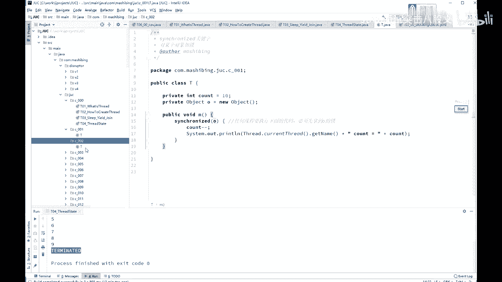
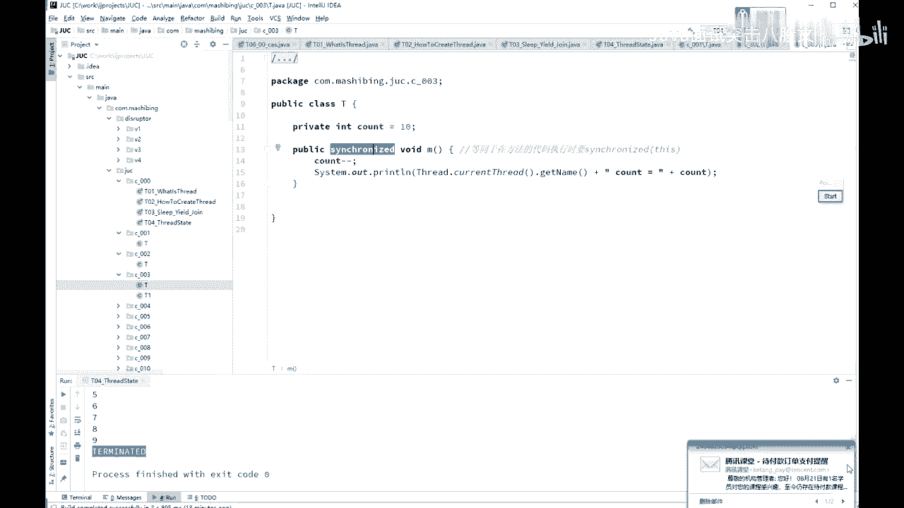
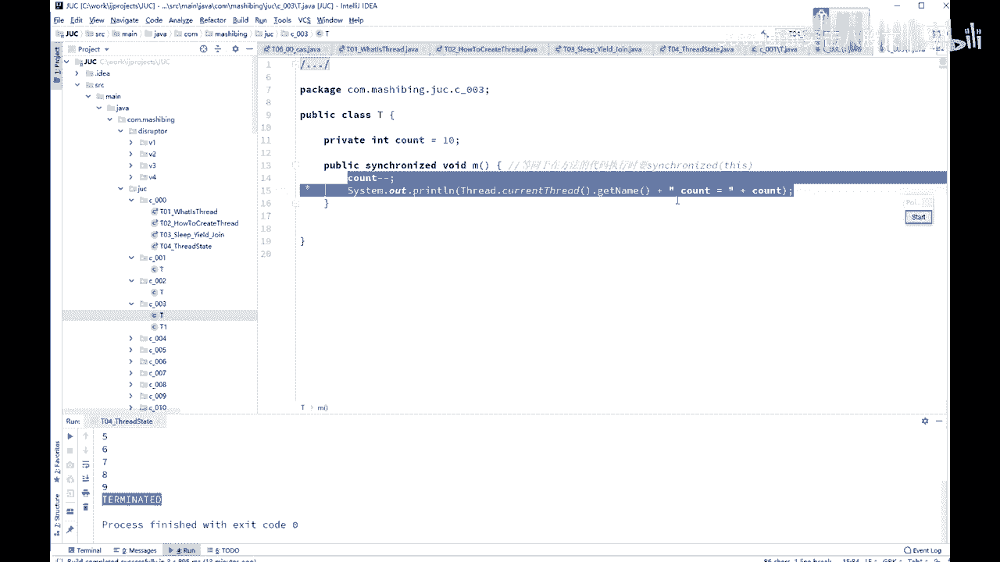
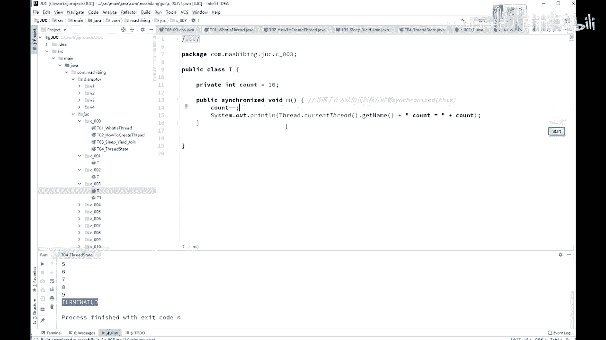
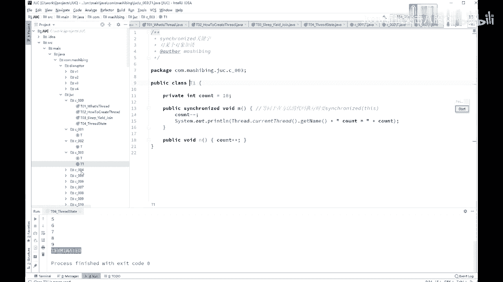
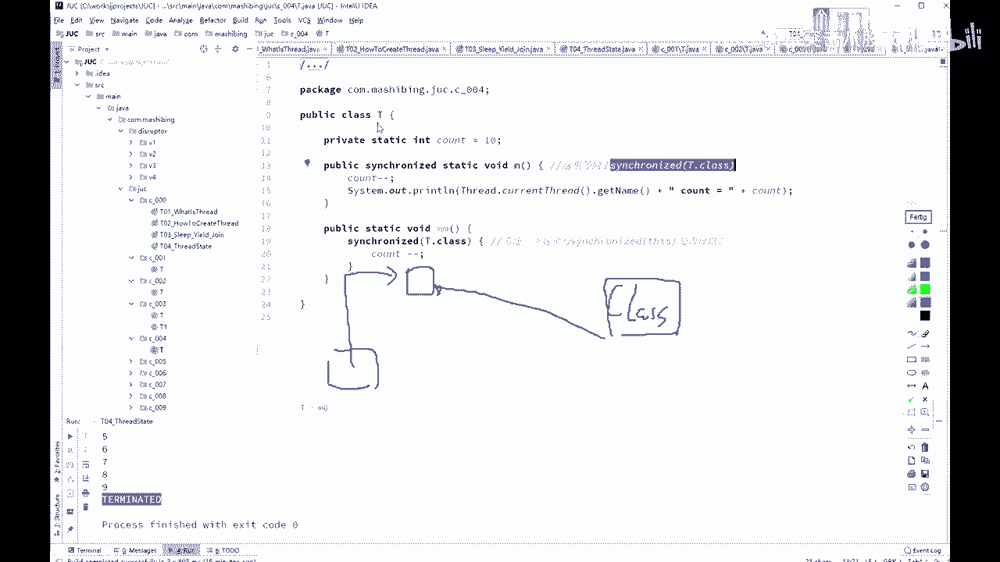
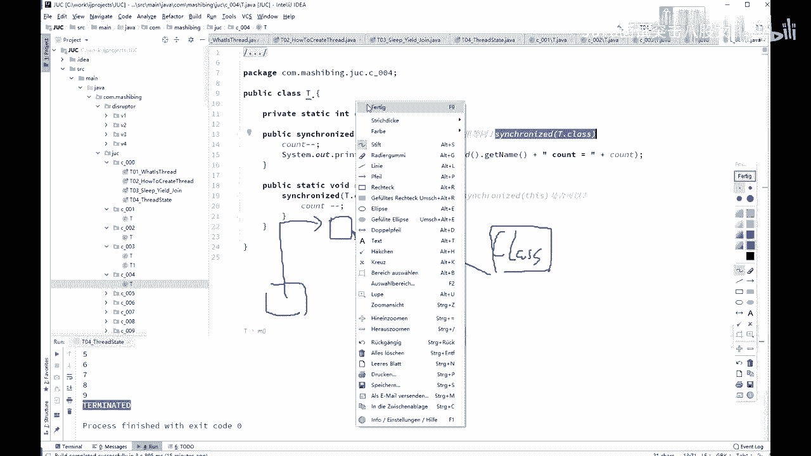
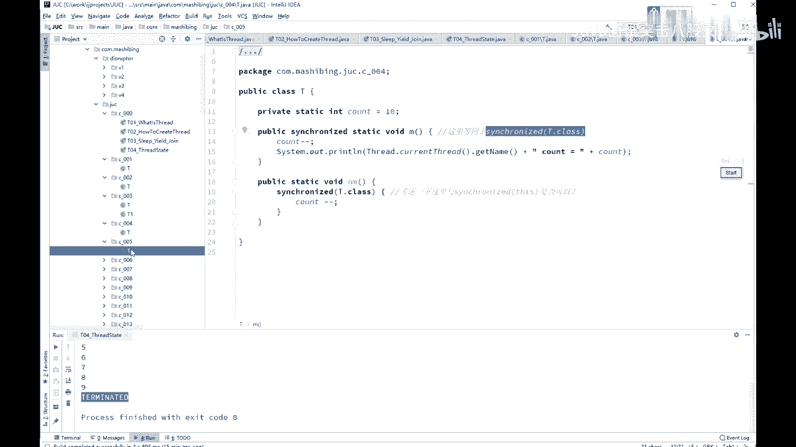
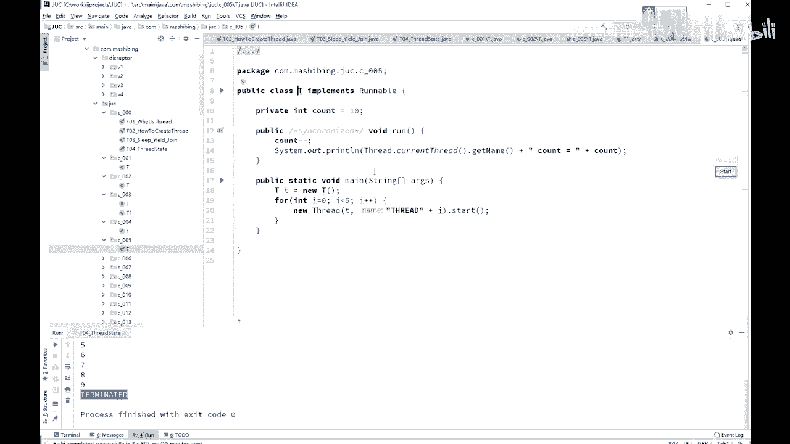

# 系列 4：P34：【多线程与高并发】锁的特性 - 马士兵北京中心 - BV1VP411i7E4

这是所得最基本的概念啊，我们来谈一下schronize的它的一些个特性。呃，如果说你每一次都定义一个锁的对象，就是object的 old的给它扭出来，扭出来一个一个对象。那这次加锁的时候太麻烦。

你每次都得定扭一个新的新的对象出来。所以呢有一个最简单的方式就是schronize this。锁定当前对象。就行了。

那么如果你要是锁定当前对象的话呢，其实你完全可以写成public synchronize的这个方法。好。所以，schronized的方法和schronized this。

schronized方法和 synchronized this在this里面在执行这个le它是等值的。

是一样的啊。

那那么大家知道呢，静态的方法。静态方法ttic方法，它是没有那个类似对象的。因为你不需要你有一个class，扭扭出一个对象来就就能执行这方法。那到时候如果我在它上面加一个static的话。

加一个 synchronized的话，这schronize代表的是什么呢？这里代表的是schronized T点class。说到这个TLclass。大家知道那个每一个class文件呀，漏到内存之后呢。

它会生成一个专门的对象，哪个类的对象呢？class类的对象和load到内存的这段代码相对应。所以呢这里的schronized T点class就是锁的是谁呢？锁的是T这个class的对象。

他也是个对象啊，就是class那个类的对象而已，特殊点。

和其他的没有任何区别。

因为。

嗯。