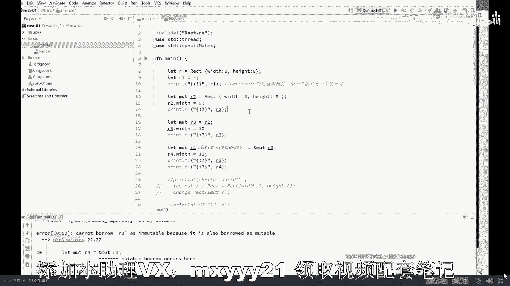

# 系列 4：P4：【JVM调优实战】对比：rust为什么不需要GC - 马士兵北京中心 - BV1VP411i7E4

没有一种语言。运行效率又特别高。Yeah。运行效率。超高。对标的是汇编C加加。不用手工管理内存。Okay。没有DC。OK恭喜你啊，现在他已经诞生了，这个语言叫ras。但是他也有他的毛病。学习曲线。居高。

Okay。这是rest。呃，有同学非常的好奇，说老师这事儿很神奇啊，运行效率特别高，what跟C和CI加差不多。然后呢，你你你只管自己去往内存里头分配就可以了。你不用管回收，没有GCA。😊，哇。

他是怎么做到的呢？😮，ra子没听过是吧？你落你太落伍了啊，你是这行业混的吗？你稍微稍微关注一点最新的技术的发展。大哥。希望大家伙的学习叫做与时俱进。嗯，这词儿呢非常的重要啊。

就是你呢学习上一定要与时俱进。咱们入了这个行业，你要想不学习，就能持续不断往往前发展。不可能的那你是温水煮青蛙把你自己慢慢煮死。😊，好吧。好，大家看这里啊，这个rest呢是比较新的一个语言。

它的特点就在于这儿它运行效率超高和C和CI加差不多。但是它开发效率呢也并不低，原因是什么？原因是你不用手工去管理内存，你只管去分配就行，你不用管回收牛刀吧。好，他主要是怎么做到的呢？你想听吗？

今天其实主要讲JVM的GC的，那顺带的给大家讲一讲，好吧，来。😊，看这里我我我告诉大家一个特别他特别特别牛的一个概念，他特别牛的概念叫什么呢？叫ownership。Yeah。

叫Eership叫所有权所有权的概念。这个所有权概念是什么意思呢？所有权的概念就是这里面的每一个值。

Rust。Okay。呃，就是这里面的这这这这个这个这个这个任何一个值啊，任何一个值都归属于一个变量。就是一个变量代表一个值，一个变量指向一个值，任何一个值都归属于一个变量。

然后有且只有一个，不可能有多个。这句话什么意思？我形象一点解释。我告诉你，在这张图里面，我们会有多个变量好，这叫一个变量O是一个P是一个啊，这里O是一个P是一个好。

有多个变量指向同一个值或者叫同一个对象。在rat里面，这件事情不可能发生。哈哈，听懂了吗？我再说一遍。格浪的GC讲讲格浪DC是接近于。java语言里面的ZBC的一种算法接近于它啊类似。好的。

看这里我再说一遍，重新重复一遍。就是多个变量指向同一个对象，这件事不可能发生，只会发生什么呢？同一时刻只会有一个变量指向这个对象。这就是所有权的概念。叫做。我们这个值的所有者只有一个一夫一妻制。

好不知道大家听清楚没有？😊，那有同学可能就会说了，老师这有什么好处吗？😊，来，你们拿大腿想一想，小伙伴们，假如我在战空间任何一个战争里面的变量。纸箱的这个空间。如果确保是一夫一妻之的话。那我这个。

我们叫她丈夫吧，她的丈夫消失的时候，他的妻子是不是顺带着就殉情了？听懂了吗？再说一遍，她的丈夫死掉的时候，什么时候死掉，还记得吗？他的妻子就跟着殉情。自动就给你回收了，你发现没有？没理解是吧？

听我说还记得占空间里面它的特点是什么？占空间特点是当我这方法结束了，我这占空间就不存在了。我这方法结束了，占空间不存在了。哎，我们假设。如果这个P你已经确定它不存在了，同时是一夫一妻一妻制。

没有任何其他人指向这个对象，你们好好想想看，我这个对象是不是就可以回收了。方法结束，占空间里变量指向的任何空间跟着回收就可以了。听懂了吗？也就是说我不需要GC为什么不需要GC大哥，你你这边你这边消失了。

我给你加几行代码，把这个里面关联的编辑器帮你自动加的啊，关联的内容OK直接就给你干掉了。所以。😔，这是ra的它的一个核心的设计理念。ra的这个特点诞生之后啊。

同时在堆叠加了它的这种对于多线程访问的呃共共共共享变量，必须你得你得需要采用它特定的书写机制才能够写的出来。它会产生了一个特别奇妙的东西，叫做你写不出bug来。好。说一下啊。😊，这是ra的语言。

特别有意思的地方叫做。😊，Yeah。Okay。不知道大不知道大家听清楚没有？😊，你只要程序的语法能够就不会有bug。当然它语法非常的特殊。这讲着讲着怎么讲成ras了？Yeah。嗯。

逻辑bug是任何语言都存在的，任何程序都躲开了。大哥，逻辑bug是啥？你本来让你计算这个程序的一个人的年龄，你给计算成什一计算成为一个人的体重了。啊，本来让张三娶了李四，你非得让他娶王五。

那这种bug我你你这跟语言有半毛钱关系吗？是吧。所以这个语言没关系啊，咱们说语言层面的bug，ra呢消给你消失消了很多。

除了我刚才说的这个ownership之外，除了还有呢就是在多线程的这种写法，多线程写法叫做固定的，你知道吧？你就得这么玩，你不这么玩的话，你根本写不出来。😊。

你想让多个县程去访问同一个值吗？我告诉你，你只有这种写法，你不用这种写法，你根本就写不出来。所以只要你写出来就没bug。就是这么的牛叉。啊，我不知道我大概说清楚没有啊，但是咱们今天还还是得说来啊。

今天并不是讲ras的。

嗯。不感兴趣。对啊不感兴趣算了嗯。反正你们对新的东西也不太感兴趣，你们讲老的吧。🤧。讲这VM啊好了，这是语言的大概的一个发展的历史。你要你要明确啊，现在这个语言呢大概分这么多类。那有同学说老师。

那GS这种东西是什么？其实这这些都是带垃圾回收器的，好吧，就GS这些啊，还有像什么还有还要像其他的啊，这coldline的等等，这不说了，它本身就是运行在这VM上的，所以它肯定是带垃圾回收器的啊。

还要像什么scalecal。😊，啊，就老师给你讲东西呢，我希望讲那个层面太低了。我希望站在更高的角度上来教你认识啊，就整个。1个IT界的一个发展。还有呢整个语言上的一语言层面上的一些东西。

你站在更高的一个角度上啊，建立起来你的知识体系O。ras有啥缺点？ra缺点就是学习曲颜值高嘛，特别高嗯。好同学们。想太多了是吧？嗯，已经9点了，what确实是啊我们来聊聊那个JYM的这C的历史啊。

疲惫了是吧嗯。A了已经疲惫了，不会吧，你你们还活着吗？我们可以继续吗？这还没开始DC呢，没开始也没开始吧。就业怎样？就业不怎么样？因为rest刚刚发展，我们静观其变。

我是喜欢让我们自己的学员都站在业界的最前沿。就是你要抬起头来看看整个行业发展。站在整个业界最前沿，你就能发现更。更加优秀的机会。发生机会的时候，你能扑上去啊，做好准备。

