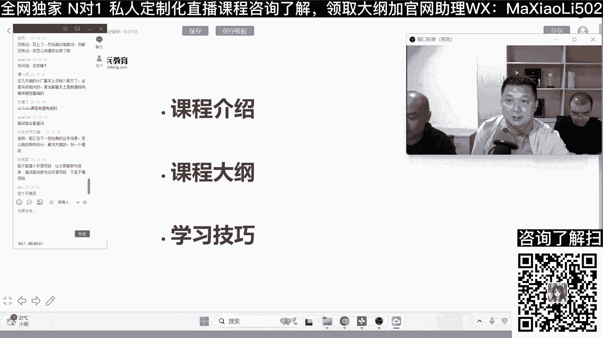

# 系列 5：P1：全网独家私人定制直播教学、N对1辅导模式！ - 马士兵学堂 - BV1E34y1w773

课程大纲给大家看一下啊。

这个课程里面的话呢，我们把它分成大概是十个模块，搜一搜啊，也就是说在这一期里面呢，我们会主要围绕这些知识点，这些第一个的话呢是属于架构基础啊，就是会去讲一些基础内容。

然后第二个的话呢并发编程的一个核心原理，第三个的话呢像比较重要的PV每条U，然后下面的话spring的源码，然后还有包括spring cloud。

阿里巴巴就是微服务的核心，然后底下的话包括MYSQL性能调优。

REDIS实战啊，Rock q，然后三高架构设计以及网络与类型，也就是说这里面是十个模块，十个模块的话会有不同的老师来讲，可能有的老师可能讲两个啊，有的老师可能讲一个啊。

这个的话呢是根据每个老师的一个技术专长，来定的，大概的时间的话，我们是准备坐在3~4个月，就是一个季度，原则上面的话，我们不会超过四个月的时间啊，这个为什么可以做到这一点呢，是因为我们会把这些东西啊。

不是说全讲的，就是不是说把所有的这个面铺开，而是去讲，比如说当今比较核心的点，面试比较关心的点，以及现在市场上面这些项目当中，经常用到这些点，然后我给大家看一下，就是在下，因为我们今天是一个开张仪式。

所以我们的这个时间的话，大概就是只讲一个小时啊，然后后面的那个上课时间，基本上是每天晚上八点到十点，就是会上大概两个小时，然后在这两个小时里面的话呢，我们会为了去加强互动啊，我们在讲课之前。

我们会要求就是老师就是花一些时间备课，然后备课的同时也是在上课之前嘛，可能会把这节课的一些相关的，是一些预习资料啊，或者是你要需要注意的一些点啊，可以去就是提前发放到学员，通过班主任。

然后如果说有些学员跟班主任联系了，我要上中国班，得活的时间是固定的，每天晚上或者是说基本上每天晚上有时间的话，就可以来跟啊，然后同时的话你也可以看一下这个课的话呢，就是讲的内容适不适合你。

我们会在这个讲课之前发一些备注，就是可能上课之前，比如说有可能要上十分的源码，对不对，那可能有一个源码，有一个前置知识，spring的一些使用，spring的一些主体流程，至少能够防空。

OK然后我们再看一下吧，就是作为架构基础的话呢。

呃我就来讲一讲啊，因为大家平时其实作为现在面试啊，嗯基本上不会不得太浅，所以的话呢我们会抓一些常见的数据结构，就像这种帕奇麦克，像这种什么，我们常说的这个哈希麦克里面肯定有红黑树嘛。

所以像这种234树红黑树，然后一些集合SC啊，然后Mac啊，历史啊，这种集合的源码进行讲解啊，然后除此之外的话还会去提一下IO，另外的话呢像里面会讲一些比较常用的，像SYCHONNET这种关键字啊。

这种关键字的话呢，虽然原则上它可能会属于多线程，但是在架构基础里面他可能会讲的，那么就是说偏向于基础一点点啊，这是我们的第一部分，然后第二个部分的话呢，呃这是郑老师为什么会没来呢，郑老师还在注意看。

郑老师嘴上起个泡，所以说亲下说下对郑老师，反正那个住院的话也住了挺久的啊，我每天都打电话给他，然后呢我给他给就是给大家讲一下，因为做并发编程，其实它也是非常重要的一个模块，就是三大特性和原子性，可见性。

有序性啊，这些东西是必讲的，然后除此之外的话呢，会去讲一下cs wt cr各种锁，然后SYCHIZAKAK，然后range Mark还有包括比较核心的一点，像线程池的一些原理啊，另外的话呢。

还可以去讲一个比较经典的数据结构，叫康复的话，先买它的源码解析，所以这个呢应该来说是作为并发编程的一个，大体内容啊，然后第三个部分的话呢是GMGUM的话呢，这个部分是严振涛严老师去讲啊。

但是严老师因为他在我隔壁上课，所以我给大家讲一下，在JVM讲这个课的时候，会更多的体现像JVM的调优实战，就像这种大家可能平时在工作当中，就是问职员们大部分是原理问的什么方法区啊。

站啊堆啊这些东西对不对，然后这个课程呢就是会严老师也跟我说过啊，他备课的时候，更多的会嵌入他以前的那些，在项目当中的一些调优技巧，所以这个如果说同学们在工作当中，想去做这个调优的话。

可以去参与一下这个基本的课程啊，然后第三个部分就是这个上面的顺序啊，再给大家说一下，它不代表严格的上课顺序，因为我们要根据老师的一个排课，然后他的费课，他的计划安排定，所以的话呢这个我先把它列举出来啊。

然后像spring的源码的话，我们知道基本上源码可能是问的最多的，就是面试嘛，面试的话IOC啊，然后DI啊，然后像AOP啊，还有包括分配的事物啊，所以我们会抽一些重点来讲，因为源码课程讲的话。

可以我记得SPM源码别宝石，之前是讲了70个小时了，对不对对，那么我们肯定不会去做70个小时的一个讲解，所以像思科的源码，就会更偏向于面解决这种面试问题。

然后底下的话呢像spring cloud cloud，阿里巴巴这个我们知道像微服务其他附件很多，这个spring cloud阿里巴巴的话，我们会去，就是说在这一期里面我们不把所有的源码都讲。

我们会去讲一下拉克丝，然后ROBBY，然后我们还会讲apple fe，主要围绕这三个东西来进行讲解，然后可能到下一期，比如说可能过完年之后，对不对，我们可能会进入下一期。

下一期的话呢他们主要会讲一些其他的组件，包括像什么C卡，像一些其他的神贴吧这种东西，然后像MYSQL性能调优了，也给大家分享一下啊，就是MYSQL性能调优，其实这里面的话会去补一些常见的视频。

因为我其实我之前给大家讲过，MYSQL的话，它分成底层原理和实战上这两个部分，首先你要去搞定像底层里面的B加数索引，还有像他的一些执行计划，还有他的一个什么MVCC这种机制，然后有了这个之后的话。

你就可以去根据执行计划，然后进行对应的什么成本，基于一些我们的C口的这个条件的一些调优，OK所以呢这是我们的MYSQL的一个线程调优方面啊，要么我感觉我是一直在讲周老师讲一讲，周老师讲一讲，讲一讲。

我说好不好，对这个网络IO和NT这块，然后曾经有讲有一个IO精讲的那个版本，后边要如果再讲这个这个和net的话，就准备偏重于这个，因为前一次那个RBC起了个头，就有一个初级版本，然后呢0~1个代码写法。

然后呢最后重构这个分层，如果后面讲的话，其实我觉得就是咱们这个属于架构师进阶班，这个坑以及墙上那个东西就是特别偏离，特别死之类的，肯定会加特别多，老师都是在原有这个已有的一个模块之上。

向上拔高的一部分内容，无论从见解啊，归纳啊，然后他的一个一个深度或者源码，是思想上的这方面的输出，增强大家的一些话术，因为我刚才看到很多人说，这个课不是在美国抽出一些他以推理，都是这个拔高的一些东西。

就是所有的一些东西我们都会想到一个拔高，老师也是对老师的一个1111次考验，像那个网络IO的一个，你比如说我之前讲过，还有精讲的，有那个版本，然后这个课我就不会说，这东西再给你重复讲一遍，给你混入时长。

所以一定是继续的，把这里面就是把那个应该讲到二二十七，二十六二十四小时，把那个小时里边的东西我做一个总结归纳，然后给你做成一个一个一个思维导图，然后那个知识敲定之后，接下来就是延续这个RPC的完整体系。

因为听过昨天那个因为最近班我也说了，其实像呃分式治理和服务治理，就是这两个治理里面，然后其实他最最重要的还是和那个RPC这块，相关的RPC网络，网络这块连接上出问题啊，或者是对对方的不明确性。

协议上出现的问题，所以在这一侧的话，RP的深度针灸的话是是是很有必要的，对我们这个所有程序员，对于架构上的三方都理解，所以这个课后面肯定这么设计好吧，对周老师没有李老师的嗓子大嗓子这个咳咳。

上岁数上岁数，对他说这个内容有点偏少啊，我给大家解释一下，其实我不是这个，我跟你说啊，这叫大纲，对这个每一个点，然后它背后刚才说你要把它译成是一个拔高的，我刚才说的这个问题就是真的太难了。

同学刚才发了几个疑问，所以说一个一个一个重复的，把之前我们讲过一个录播，然后再给你重新讲一遍，不是这样一个课程，这个标题大，这个课的标题已经看出来，就架构师进阶版是我们一定是讲的是进阶的，提升的对。

有有营养有素质对吧是的，然后重点的话呢就是我们的右手边的曹老师啊，大概讲一下，像这一个就只能听到吧，来来来放近一点，来来来能听到吗，我我站起来站起来可以礼貌礼貌一点，礼貌礼貌一点啊。

那个就是比如这还得蹲着，所以你坐这，你就在这说，那个就是这个三高项目的架构设计课啊，就是呃这是这个我们是安排了，有大概四节课是吧对，然后这四节课呢就是计划把里面的，就是架构设计的重点。

在这里给大家讲清楚，就是从请求进来经过什么节点，然后每个节点该怎么去设计，比如请求进来什么CDNDNSL负载均衡呀，然后缓存呀，消息队列呀，然后后面的数据库，然后中间可能服务之间调用会遇到什么熔断。

降级，限流隔离等等，这些东西呢，都给大家把它就是讲到它最精华的部分，就是让大家嗯知道在实际的企业当中，你只用哪些，因为其实这里面的方案会挺多很多的，就是比如说熔断的方案很多，但是在这里面。

其实一个企业当中基本上只用一种，就可能程序员熟悉这一种，就用这一种，然后我们呢在这里面就会把比较主流的，在呃在这系列课中挑选出来给大家讲啊，就是三高设计课呢主要就这些内容，争取四节课给大家。

把这种主要的设计方案都给大家讲清楚了，你看有同学说给郑老师多拍些歌，郑老师现在都都拍给都拍给他，我们听着的歌，郑老师现在是在做一个痔疮手术，嘴上嘴上起个泡，好好好，OK这个里面的更新它肯定是有的。

因为啊我们的这个课程呢，它其实是基于一板一板的这个优化，然后优化的一个前提，就是要根据现在的市场的一个面试需求，因为我们最近包括我们在座的，包括曹老师也好，周老师也好，每天都要服务比较多的学员。

从我们的服务这些学员，比如说解答问题啊，对不对，然后做这种简历指导啊，或者做这种学习路线的规划，或做这种面试规划或者模拟面试，我们会就是获取一些，比如说包括现在的最新的企业的一些，招聘信息啊。

现在基本上企业招聘的话呢，他会更偏重于你的动手能力啊，就是原来的话可能就是我们常说的面试八股嘛，就是面试的时候，然后问这个原理，问职员们问什么多线程对不对，问锁啊，问一些什么源码之类的。

然后现在卷呢就是说卷的更多的，就是他考验你的动手能力，就是说首先他要验证你以前那个项目，是不是这么干过，就像曹老师说的啊，我做熔断限流对不对，那你说你简历里面你写的熟悉这一块。

那是不是你要把这个你以前公司做这个东西，应该给我讲清楚，这个课里面的计划就是怎么说呢，因为我讲别的项目里面也用到了熔断限流，然后这里面我把那个案例代码都给大家带出来。

到时候大家就是比如说我们讲到熔断限流，然后到时候会告诉大家有什么地方有案例，大家看一眼就会了，这样就我我我刚才看到同学，你像这个叫弹一闪，就问了一个非常有价值的一个问题，前几天变拼多多。

然后问了中间建的高可用方案，这个就符合这个问题，就符合架构进阶班的课程内容，所以就这样吧，咱们今天临时起意啊，这个到时候准备一个一准备一个接口，这个接口你看是定义，我们是准备一个留一个邮箱。

还是留一个什么什么地方，或者一个就让同学能把问题，那就是你这个接口别太复杂了，然后还得经过几手，就最好有一个地方，然后啪啪啪就搬砖了，班主任班主任就是你们找班主任，就像刚才弹一闪，这个问题非常好。

就说哎前几天面皮多，问了中间件的高可用的方案，那这个问题你们就咣咣就发，发的时候呢，我们老师这边，然后所有人扑上去，然后开始梳理这个这个问题会在哪个模块里边，然后这样你们问的多越多。

然后就带大家一块去思考，怎么把这个课可以讲的更有高度讲，讲得更好，而且更贴贴切于十这个时实际这个方面的好吧，所以我们就是咱们之前那个老学员应该知道，就是咱们很多课程都是这种互相打磨着出来的。

只要你咱们同学能积极的反馈对吧，然后我们就一定会把这个这个课程做得更好，因为是更符合你的需求的，对这个说任我行说把面试题收集起来，对面试题的话，我会收集一些比较经典的，对对对，叫技术众筹，叫技术众筹。

我们管这叫技术，不是费用，众筹，是技术众筹，抛出这个问题，或者遇到这种，就是比如面试的时候遇到这种场景啊，对不对，这话可不只不只限于面试的公司里，面试的你在平时蹲厕所的时候，突然想到一个就是坐在马桶上。

突然想到一个事儿，说哎这个这个架构挺有意思啊，说这个怎么做都可以，就是把你这个所有问题抛出来，但但但是啊这个你你们随便随便随便发讲，不讲的是我们的事，这个任我行发了个在职证券，好像也挺容易的。

发一个也可以也可以，这个他也也别，他要他要那种填的形式的在线问卷，如果说他比如抛出问题的话，那肯定就是那种类似于填空题，时间长短，反正就两三天填完，填完再收集一下，比如说收集一下，大家对这个对。

那我记住这件事情，对我记得这件事再推一波这个手，我们再把直播课程再推一波，然后收集过来之后的话，这个就是咱们直播互动的好处，你们多聊多想，咱就好好方法，对不对，对，这个问卷的话，我们是就在对。

反正我们就做一期嘛，就是一个期做一次这个问卷嘛，我不可能天天问，天天问的那个问题，就这样弄，那个咱们网站上，然后单开出一个页面，或者单开出一个链接的，有很多那种共享的VIP，可见他有的是点进去之后。

然后就可以开个第三方的各种问卷，挺好用的，其实在那个问答里面开一列，就提问的时候选一个什么课程，不是最简单，最简单的就是我们可以在这个班的，就是咱们弄一班的班班的，直接就说这个这个线几号到几号之内。

只有VIP学员有权限，然后呢点点我，然后提交你们想听的知识点内容做这么1banner，然后咱们同学在场的，不在场的，有没有看那个视频呢，他找访问咱们网站了，他大概率看到你班长。

然后再加上班主任那边再去推一下这个事，然后我们三五天之内或者三天之内，然后把那个文件这个问卷，然后就就尽量出到更多的学生，把问题收了，我们先做也别一下这个这个收购，收收收收收太多。

毕竟我们要一个能核算一个工作量，比如三天输三天的，拿回来之后，这些问题我们能能处理完，然后能排到后面课里边，这大纲就跟着变了，然后这个事如果发现好的话，我们就比如说每每个月定每个月定一下。

周一号到5号就是收集问题的对吧，咱们这么玩是不是也可以，你觉得可以，同学来敲门，六六啊，可以吗，这么来这么搞，嗯嗯有30万的事，我知道有30秒，30秒对，你看这行，这这这可以这可以对。

就给他弄成一个长期化，对有节奏有节奏的那种，就是希望大家都参与起来对，因为这种直播课程的话，其实就是说如果按照做项目的话，我们是我们还是你们是甲方，你是甲方爸爸，对不对。

然后这刚才是讲的这个三高的架构设计啊，然后我就给大家着重讲一下，比如说今天坐在中间的李老师会给大家讲，所以在这个rock q里面，你也可以看到，我里面更多的是去给大家去讲一些实战相关的。

因为像这种中间件啊，其实面试的时候可能会问到这种，就高考用三高架构嘛，其实除了这种三高架构之外，就是有一些学员他其实有一些痛点，这个痛点就是我可能在这个公司，我压根没有用过它，但是呢我去面试的时候。

我要写上，结果我写上啊，比如说李老师帮你写上了之后，面试官一问结果反正你都答的不顺畅，因为你现在一面试一答的不顺畅啊，是阿八阿八之类的，基本上面试官就会断定你这个没有用过，或者是非常的生疏。

所以这里面的话我会给大家去讲，更多的偏向于实战的，就是你不要看这种实战的话，它其实不是说一定要把这个代码，嗖的一下拿下来，而是说我讲清楚很多的业务场景会怎么去用它，因为像你讲的rock q的话。

其实像rock q卡不卡，那就差不多了，因为MQ的话，这个东西就是说你只要熟精通其中的一种，其实这三种这三种像ruby的，像卡夫卡的话基本上也就差不多熟悉了，除此之外的话呢。

我还要去讲一下像里面的一些原理机制，因为这个消息的存储，消息的确认，然后还有包括他的网络框架啊，所以我会着重去从这几个点，给大家进行一个突破啊，也许大家可能会觉得，中间件这个模块的话还是比较重要。

但是的话呢就是很多小伙伴就是没有发力点，所以这个rock q的实战与原理的话，就更多的会从同学们去面试，或者工作当中的一些发力点来进行出发，然后像这个release的实战与原理啊。

这个release的实战原理的话呢，我列举的点很多，其实这里面呢前面的东西可能会比较浅一点，一些基础运用吗，这里面比较复杂一点的，可能就是b Mac不能过滤器和happy log log啊。

前面的这五种数据类型还是比较通用的，然后底下的话呢，就是涉及到像它的持久化的原理，像他的这种内存淘汰的原理，然后还有包括我们的这个做主从啊，做哨兵啊，做集群啊，以及分布式锁以及缓存一致性的这个方案。

所以在这个课程里面呢，看起来跟我们之前讲的差不多，但是我会把内容适当的拔高，就是拔刀的这个业务场景，也会要和架构设计要挂上一定的关系，就是大家知道就是在你的这个工作当中。

可能就是在你的项目里面会写着release，对不对，但是你要了解这个release你到底用它来干嘛，对不对，有的人我做缓存，那缓存其实有很多的缓存，也可以做e catch的缓存，也可以用MONGODB。

对不对，那你REDIS为什么要用它，然后release这个里面呢，具体的话还会涉及到一些bug，哎我记得周老师之前讲了一个release，早期版本的时候，好像提出了一个，我记得有一个你还记得吗。

一个AOF的一个bug，但是那个bug的话在release7的这个版本已经修复了，我们学员就直接给我们做了一个反馈，这个反馈就是说，诶好前周老师讲的这个release里面的那个演示的bug。

在release7的这个版本里面，他其实已经修复了，就已经没有那么bug了，所以我们讲这些东西的话，尽量的会去讲比较新的版本，因为比较新的版本，你像release啊，就是他新的版本出了多线程嘛。

然后release里面的话它支持了更多的数据类型，所以呢这是我们讲release的一个实战与原理部分啊，同学又反馈了几个问题啊，就是说现在最近面的大厂基本上都没啥罢工了，然后全是实战相关的。

然后算法都基本上是数据结构精讲那些基础的，然后是这样的，弹一闪，今天给的反馈都比较清晰，然后这个而且又有有有细节，这个这种这种方式很好，我想想基于他的说法，也是就是我们既然要做这个文件系统。

然后你们在骑的时候就不要太模棱两可，就比如说那个加一个什么新课，加一个就是两个字，或者一句话，你们稍微说的具体点就是哪方面的，然后呢比如像这个面试官问的相对比较垂直，那这个就是垂直。

可以举个example啊，来个例子，你比如说可能我我因为我遇到了什么什么，他问我哪些问题，这个这个所谓的垂直到底是垂到什么程度了，对吧，然后呢或者你有你对这个这方面有一个什么，想达到什么效果。

老师让老师应该讲到垂直讲到什么程度，你给定一个问题，然后并且给定对这个问题的描述对吧，然后12345，然后这样的话，其实大家平时在公司工作，应该也是这样的一个工作，一个交流方式，就是信息传递的时候。

不能说这个信息是一个模棱两可的，要要稍微精准一些，然后呢减少这个对方对于分辨你信息的时候，这个这个容错或者其他的问题好吧，也就是希望大家能多用点心思，然后呢每个人也不用想太多。

然后呢到最后众人拾柴火焰高，问题一收起来肯定也是很多的对吧，那个牛将军这个同学，我给你回答这个问题啊，开源项目的话，我们其实开源了一个请叫马士兵严选看一看啊。

这个课程的话原来是我们的诶。

我知道他大概说的啥意思，对这个跟那个不是你说的，我知道他是说开源项目都参与嘛，其实那个的话大家可以去参与的。

搜一下吧。

就是其实我们马士兵严选的话，我们现在已经把它拆解的很细了，原来的话呢是一个大的壳，现在的话我们把它拆成了像它的框架，像它的基础基础的一些组件，就是大家知道你说你要去写一个这种。

或者是说站在架构师的角度去封装，一个框架的话，你肯定要去封装像这种什么接口啊，异常啊，然后像这种大家可不要觉得这些东西简单啊，其实你要动手写的话，你可能没有思路，没有头绪，比如说日期时间的管理啊。

然后一些基础的统一组件啊，一些工具类的封装，这个你应该说的就是这些东西，就是你如果说你真的要去参与编写，开源项目的话，他一定要具体到某个点啊，你不能说你参与了开源项目，然后面试官问你参与了哪个。

我参与了架构设计，那设计的哪个，你跟我细一下，你是设计了它的统一的什么接口响应，还是统一的异常处理，对不对，或者是统一的一个组件，所以说这个课的话应该是可以满足你，包括里面一些实用的东西。

你看使用的东西的话，这个地方其实就是对于一些我们常用的注解，开源架构进行修改，嗯啊就是你说的所谓的，在有些部门叫做组件开发部门，他干的活就是说我对这个组件进行增强啊，我们使用一个统一的缓存组件啊。

这个地方你的细节不用管了，拿数据的话，缓缓存帮你有对应的set方法，有对应的get方法去处理就行了，对不对，然后你比如说那个接口做限流，我们统一的限流方式，然后封装的统一。

封装的就是能够满足日常用的这种限流算法，所以这个就是刚才那个刘将军啊，就是你说的问题，我给你进行了当场的答复，好接着继续刚才说到的。

这是release啊，按release的话呢，我们之前是讲过，我记得讲过一把源码嘛，其实包括我后面讲这个release，我也涉及到了这个嘛，藏一下这个吗，对对对，好好好对对对对对对好。

就是刚才的这一个圆嗯，REDIS里面呢为什么讲到他的一些源码呢，就是因为像这种基础的数据结构，我发现在最近的去年到今年，很多面试官他喜欢问一些数据结构的源码啊，他不是问你什么这个地方的整个流程的源码。

因为大家知道release是C语言写的，他不可能问流程，他就问你像string它的底层的源码是怎么实现的，像它的list的hash sz，sat这种五大基础数据类型啊，因为REDIS为什么说非常好用。

或者rise为什么说经典，它主要是它的设计在每一种数据结构底下，他都用了至少两种以上的实现啊，所以以后你就记住这个点，就是你看到的这个string hash list set，在它的底层。

它至少有两种结构啊，这两种结构一般是适用于不同的业务场景，就是有的可能是数据字段比较长，那我可能用这种，有的呢可能比较短，我用另外一种就是站在这个存储啊，站在这个算法的角度来说，它是最优的好。

那么刚才呢我给大家讲的，就是我们整个大纲的这几个部分啊，卡住了还是怎么，他说老老乡民扛不扛不住。

每天都得都得上上个香，对很虔诚的，然后这个部分的话，我们进入第三个部分吧，我们大纲其实也介绍清楚了，就是大纲的这个十个部分啊，形式互动对我们讲究的是互动形式，然后因为我们今天是一个开班仪式。

所以在这个开盘仪式呢，我们会给大家去分享一些，就是老师自己的一些学习技巧，那么在我右手边的这个曹老师可以说一说啊，首先我回答一下这个任务新的问题啊，这个用到我们项目里不用付费吧，自愿的啊，我们不收费啊。

目前是不收费的啊，对对你来了没有，那个下下一个是啥，分享学习技巧是吧，嗯大家可能问到学习上最多的问题，就是这个东西学了很长时间过后之后就忘了，可能比如说学了个JVM调优，过了一个月可能要到面试的时候。

确实是真忘了是吧，你也不仅你忘了，我也忘了，然后这个这个问题怎么办呢，其实就是我就是辅导了这么多学生的面试，然后给他们的建议呢就是一个学了一个知识点，然后呢比如说嗯比如说限流吧，举个例子啊限流。

然后你做好那种在JITTER里做好一个压，就是那个压测的那个thread group，做好一个这个，然后呢写好一段，写好一个测试限流的代码，OK这个把它打包在那个git上打个tag存好了。

你这次看看懂了，你下次再来看的时候，把它就是把这个tag这个代码牵出来，然后再跑一遍，然后简单看一看，你马上就能回顾起来了，然后这里面反正就是写那个代码的时候，写的详细一些。

然后基本上你好踏踏实实学过一遍，最后再来看一眼，基本上就会嗯，还有一个就是那个，经常尝试着给自己买一个东西，讲清楚，像我们做老师啊，有的有的时候其实我们呃看书，或者说看官方网站。

可能这个东西就是我们作为老师，可能觉得我们懂了，其实就是我们觉得自己懂了之后，和给你们讲道讲清楚，其实这中间差别还挺大的，不一定说我觉得我看懂了就能给你讲清楚，其实中间确实比如说表达的时候有时候不流畅。

或者说不是那么有条理，或者说不是那么的全面，讲到可能到后面的时候想起前面某一些点忘了，其实我们我们平时也会在内心去模拟很多这些，所以呢就是能给大家一些建议呢，就是大家平时比如说学了一个点之后。

也尝试着是吧，给自己的女朋友讲清楚，比如说左老师算法讲的那么好，为啥是吧，天天在家给老婆讲算法是吧，你们能你们要这么做到了是吧，也挺牛逼的，好话筒给到林老师啊，我给大家说一下，其实像学习技巧这一块的话。

刚才有同学提了很多这种学习方法论嘛，嗯我给大家举一个比较通俗的例子，就是一般在企业里面，就是你做项目的时候，其实运用的技术啊，它不会像我们大纲全用上，你不可能说一个就是如果全用上的话呢。

那基本上都是大厂的架构，但是在大厂架构里面呢，你如果不是这种大厂架构师，基本上你可能是负责一个模块啊，我可能是负责订单，我可能负责支付，我可能是负责商品，对不对，然后在这里面我强调一点。

就是说你像我们展示了这些东西，它就有点像我们平时所说的，你说24节气，那听到说到什么什么清明，还有什么秋分，对不对，可能你听到一两个词，你能够冒出来，但如果面试官问你，你给我说一说24节气大概有哪些。

我估计90%的人是背不出十个的啊，这个区别点在于哪里呢，就是你这项这项知识的话，如果你经常用或者是经常敲或者是经常做的话，或者哪怕做一下笔记，或者做一下命令，或者敲一下代码的话。

他可以做到一个温故而知新，所以我我给大家的一个学习技巧，就是在于你学这块知识的时候，首先的话要多动手，就是你动手首先要敲出来，你像我讲release开始都是去讲命令，讲五大基础类类型的命令。

为什么要讲这些东西呢，以后你用到的可能是JS，用到的是REDITION或者是release template这种东东，但是其实这些东西你命令熟悉的话，你看它的API接口，你一眼就明白了。

所以以后你在工作当中你把命令敲除了，你会发现你用API的时候很爽，诶，这个地方我要用哈，希对不对，那就是一个对应的对应的一个API就出来了，然后I第一弹对不对，但是如果你命令不熟。

那这个地方他怎么会有两三个参数啊，怎么送啊，对不对，然后这个命令，它这个操作的命令到底有什么区别啊，对不对，所以这是我给大家分享的一个技巧，就是你一定要在几个大的主要技术里面，要多花些心思。

就是你要多投入一些时间，可能老师在给你讲的话，可能是讲把这个命令快速的给你一两节课，敲完了，对不对，然后具体的知识点，这个时候你要去自己在工作当中也好，或者是你工作当中有时间是最好的。

或者是说你学习的时间好多去敲，然后敲完之后的话，其实你去面试的时候，你就压根不慌了，你跟面试官讲的时候，这些东西你没那么容易忘啊，很多人就是说容易忘的一个点，就是我只看就是有一句话叫什么。

甚至叫我收藏收藏我就学会了，我们称之为学费啊，那就叫学废了，OK啊，这是我给大家讲的一个学习的技巧，然后我我我帮大家分享一个。

就是一个比较理性的一个东西，就是学东西，这个大家说学记不住也好，或者这其实都是一个借口，为什么，因为你就没有用心思，就是如果你喜欢一个女孩，尤其你的初恋，我也是哈哈哈哈哈，太多了。

不是就是如果你像你的初恋是会记一辈子，就是你看你用心的程度，然后呢这个你你初恋为什么可以记一辈子，因为你记住了他很多的细节，比如说他哪儿好，哪儿温柔，然后你能说出五六十个来对吧，或者七八十个。

但是比别的女孩子，你就说出来很少注意听，刚才那个就是就是本质，如果你想把东西学好，学东西的过程当中，就一定要关注这个东西的方方面面，也不要这个一平板大屏的逛逛，或者是死记硬背背一些调理的东西。

这是不对的，有任何的一个技术里边的，任何的某每每一句定义，你要去展开它，然后但是这种写法呢，你初听上去就好像说每一个东西我学的很细，很细腻，比如说一个我就像连连连老师讲了一个spring。

他要讲70个小时，然后你听他的课，听70小时，我是不是还得画出来啊，200小时，然后再去钻研它里面每一句话，然后这这就是错误的，我教你一个正确的学习方式，就是第一个是先宽什么，先宽，你先呃不要让自己说。

每一个看课我都要达到老师那个程度，或者学得很很很很好，先快速过课，先打开自己的认知，因为有一些东西就是呃咱们举举举例子啊，把知识分成两类，一类知识很死板，很刻板的，比如说像if else循环哎。

另外一类它就属于我们这个编程，逻辑思维的东西，逻辑思维的东西它就是很很很泛，但是他又有很很有规律的，你必须打开视野，我就举个例子啊，就比如说咱们讲呃MQ啊，或者讲我讲大数据的时候。

讲所有的找凡是涉及到这种通信的RPC的，然后等它都会有自己的这个command，然后就抽象的过程，然后呢都会有命令的这个匹配的，适配的和DDD拍摄的过程，那这个时候其实当我看第一次看的时候。

比如我第一次看到spark啊，我见过这种形式了啊，他以这种形式展现出来了，后边我去讲这个卡不卡诶，又见到他以另外一种形式展示了，但是大差不差，他的逻辑框架已经出现了，然后我再去讲这个诶。

还是我就我就你再去看任何没Q的时候，你就会发现我不是要去看，我是要带着前面那个东西，我去论验证和论证这个东西，所以你只有你的认知，或者你多看课，先看，看完之后，然后就等于一个课程。

比如说全算下来是400个小时，你要先用11。5倍或两倍速度，先给他突突了一遍，突完之后，然后再翻回头去，然后呢再涂了一遍，就是你拖个两三遍，这个课程它比你说每一节课按在这两个小时，我要拿出三四个小时。

研究这两个小时到底讲什么东西，它要更更有效果，再举个例子，你们自身的一个一个感觉，就是这个我听了A老师的，比如说REDIS听完之后啊，然后还还行，我去听了毕老师的REDIS。

我看这毕老师讲师讲的特别的好，我可以跟你说，未必是这个B老师讲的特别的好，是因为你前面先听了一遍，在听毕老师的时候，你在已经有认知的情况下再去接收一遍的时候，你的条件反射就有了，你又共鸣了。

你就知道他这个前后的关系，你你就能适配这个东西了，所以学习啊就是不要只学一遍，而且是那种特别死板，特别细的学，你要尽量的啊这个课都快速过过个两三遍，然后呢第一遍裤子过的时候呢，也不要只过。

然后呢你要随手留个纸和笔，永远记住，昨天我讲课的时候说这事儿了，不要相信自己脑子，你脑子会欺骗你的啊，就是我我我我学会了，我听懂了，我理解了，我记住了，这全都是假的，都是假象，你又在纸上去写写大纲。

写他的这个拓扑，然后你要抓的是这个脉络，第一遍，第二遍的时候，然后再基于这个脉络里边，你要敲重点，然后呢圈这个突然的那种条件反射哦，原来老师刚才那那那那那那课讲了这么一点，我没有get到。

或者原来原来前后前后的课程111，这个后边的东西为前面一铺垫，原来真的是这回事，你只有这么去学，然后东西就很难去，就是绝对的忘记它，让你的复习也会变得非常的快，而且这个才可以满足香港的老巢说的说。

你如何给你的女朋友，给你媳妇，或者给你的朋友同事讲清楚，就是这种费曼学习法，就是你自己这一关要过了，你如果自己在学东西的时候，嗯是一种就是这种这种应付式的学习，就是我就这个这个使劲嘎学。

你很难去给别人讲讲的，因为你没有没有没有这个拳击的概念，你给别人输出的时候，就跟大家说，我要说一个事，但这事我还没想好呢，我要跟你开始说，那这个收起来肯定很复杂，但是这个事儿我自个儿心里想了好多遍了。

我也预言了好多遍了，那这是我在跟别人聊的时候，我一定总分总的我现在跟你说一个事儿，这事儿大概是一个什么事，然后具体会有几个点，然后之后几个点分别是什么东西，就是你最后你要让你的知识灌到你脑子里边。

你能总结归纳的能力，比如我说我跟别人聊release release，大概的跟你说啪啪啪啪有几个点，对不对，他的单机这方面呢，他在自己内部数据结构的，在于它的这个这个性能优化的，在于它的持久化可靠性的。

然后再说的多机这方面在于集群方面的，把你有一个逻辑性条理性给他说出来，但是这个东西你说我随着课程慢慢学的话，你很难去在脑子里建立这种这种感觉，你没有感觉，只有你先快速突了一遍课哦。

老师总共就说这么多东西，我又回去看了一遍，验证了他说的他这个思路，逻辑思路在这，其实有的时候你们学一个课的时候，第一你只学了一遍，你是不知道老师，因为一个课每个老师讲法是不一样的。

就REDIS李老师和我讲讲法绝对不一样，但是我们都会我们自己的逻辑在里边，你听一遍，你是很难最后能悟出了我们的思维逻辑，我们是在偏向于哪个点上去讲这个课，你只有快速爬过一遍，然后知道先先找这个点。

你回去再过一遍的时候，你就特别能感感悟到哦，这个老师可能是偏他的这个里边的架构的，这个老师可能偏源码的那个老师，可能偏它里边这个经验优化的等等，好吧，我们就利大家说这么多。

就是希望大家能在学习的时候能驾驭这件事情。

