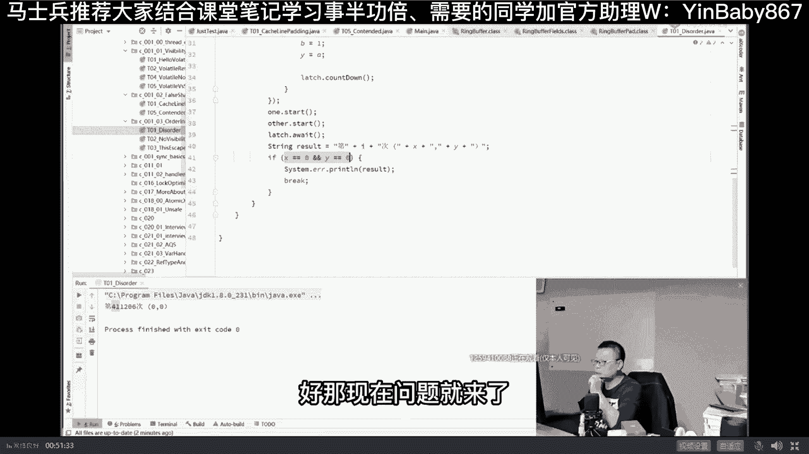

# 系列 5：P10：10、程序真的是按照“顺序”执行的吗？ - 马士兵学堂 - BV1E34y1w773

一般来说呢关111谈到多线程的时候。

一谈到并发编程的时候，我们都会讨论它的常见的三个特性，这三个特性这三个特性呢分别叫做可见性。

有序性以及原子性。

这里面最简单的实际上是可见性。

就是多个线程之间改一个数据之后呢，另外一个线程要及时可见。

这一般来说我们拿过拿volatile修饰一下就可以，第二个呢就是有序性。

有序性稍微复杂一些，原子性是最复杂的，这里面牵扯到各种各样的啊五花八门的。

甚至给你开放了，你可以自己往里填的五光十色的锁lock是吧。

呃今天呢我们聊这个有序性这件事，我们先从一个有意思的地方聊起，就是程序真的是按顺序执行吗，有同学说老师你在这逗我玩呢，那个那难道程序还不是按顺序执行呢，当我们看到两句话的时候，比如说X等于X加加。

这是你的程序的写法，一定是先写的先执行吗，X等于先执行，然后X加加再执行，X变成二，不可能X加加先执行，那样的话，那编译都会没准都报错是吧，所以程序当然是按照顺序执行了，但是未必，比如说像这两句话。

X等于一，Y等于一，你说这哥俩谁先执行，对最后的结果有影响吗，没什么太大影响，所以程序真的是按照顺序执行的吗，来我们来看看小程序就行好，大家看这里啊。

呃这个小程序是非常经典的一个小程序。

这个小程序最早开始的时候是拿C语言写的。

呃，关于这个小程序呢，我简单给大家解释，你认真听。

需要一点点小小的业务逻辑知识，逻辑知识，不能说业务逻辑逻辑知识。

数学的推理相当的简单啊，你看我这里面有四个值。

XY是一对，AB是一对啊，可以说是有四个值两对。

那么在这四个值里面呢，我做了一个循环。

这个循环的不停的循环，每个循环里头我都会起两个线程。

这是第一个thread，这是第二个thread，这两个线程干的事特别简单。

第一个干的事呢就是A等于一，X等于B。

第二件事呢叫B等于一，Y等于A哇，太简单了，不能再简单了。

好我们主要分析的是什么呢，主要分析的是当这两个线程结束的时候。

Let await，然后最后我们两个拆线程都结束的时候。

我们最后的这个X值等于几。

Y值等于几，再说一遍，这是我们第一个线程A等于一。

X等于B，第二个线程B等于一，Y等于A。

由于他们两个是位于不同的线程，所以它们之间有可能交叉执行。

交叉执行之后，我们X等于几，Y等于几。

这是我们需要探究的话题，大家听懂这个问题了吗。

能听懂的，给老师扣个一，嗯嗯嗯搞点反馈啊，Hello，幻雨星辰嗯，都是活人，对不对。

太难了，嗯这是一个证明题。

不是让你从头到尾设计的，你能听懂就行好吧，四种可能啊，胡服你看胡服多牛多牛叉，他居然分析出了四种可能啊，哪那么多可能啊。

我们来分析一下好不好，好大家看这里啊，呃既然是两个线程，我们假设这是第一个线程，这是第一个，这是第二个，这两个线程啊，由于它又会交叉执行，所以说不准是哪条语句先执行哪条语句后执行，正常的情况下。

比如说像这种情况，A等于一，X等于B先执行，然后B等于一，Y等于A后执行，那么这种情况我们分析一下，这时候X等于几呢，X等于零嘛，因为B初始值为零嘛，对不对，所以X等于零，Y等于几呢。

由于A已经设为一了，所以Y等于一，所以这种情况叫X等于零，Y等于一，或者是什么呢，第二个线程先执行B等于一，Y等于A先执行完了第一个线程才执行，A等于一，X等于B那最后的结果就是X等于一，Y等于零。

哎超级简单，那剩下的呢就是各种各样的排列组合了，比如说我第一个线程先执行依据，第二个线程执行依据，第一个线程又执行第二句，第二线程又执行最后一句好，这种情况是X等于一，Y等于一好，第二个线程先执行依据。

第一个又执行，第二个线程又执行第一个右执行，总而言之，这样执行完好，X等于Y等于一，如果说第一个线程执行完一句，第二个线程执行两句，最后第一个线程在执行一句，X等于一，Y等于一，如果发生这种情况。

第二个线程先执行一句，第一个线程两句，第二个线程又回来，X等于Y等于一，Ok，这就是我们分析出来的所有的排列组合的结果，这块你没有跟上，关系也不大，我呢就跟你已经分析完了，反正总而言之就是这三种结果。

哪三种分别是X等于零，Y等于一，X等于一，Y等于一和X等于一，Y等于零，来我们来跑一下，看看他最后的结果到底长啥样，run见证奇迹的时刻好。

这程序由于是个特别长的循环，不停的循环。

什么时候这个循环才会退出呢，只有是发生X等于零，Y等于零的情况。

他才会退出，他会给你打印出来，说第二次的情况下发生了X等于零。

Y等于零，这种情况。

这个需要看，人品的啊。

看运气的，看看石子的人品到底好不好。

如果好的话，我们很快能见到这个结果，如果不好的话，我们今天晚上估计够呛了。

没事，明明周末是吧行你们想得开就行。

不会吧，真不给面子哈哈。

听我说啊，就算是嗯就算是没有发生这种情况，我给你把我以前跑的那个截图，给你揪出来就行了，这是我以前曾经跑过的两个截图，第27万，272次循环的时候发生过零零，这个大概跑了得有半小时。

第11问万次的时候发生过零零嗯，Ok very good bingo。

很给面子啊，说明石子石子同学人品不错。

第41万1206次的时候。

发生了X等于零，Y等于零的情况，我勒个去。

啊我讲到这。

你们还能跟上吗，有问题的直接问，没问题，给老师扣一。

嗯哼哼哼。

很好很好，好那现在问题又来了。

这这这这是为什么呢，这玩意不可能啊。

因为我们分析来分析去，你不是发现了吗，只有三种情况，X等于Y等于X等于Y等于一和X，一等于等于一，Y等于零，不可能啊，没有这种X等于零，Y等于零的情况啊，你看你看鹿鹿晗都来了，鹿晗是我们的VIP是吧。

嗯好大家看这里同学问你，我们来分析一下，只有在什么情况下才会发生X等于零，Y等于零呀，注意看只有在这种情况下，首先执行的是X等于B，再执行Y等于A或者先执行Y等于A，再执行X等于B，然后A等于一。

B等于一，放到后面去执行的时候，他才最后的结果才是X等于零，Y等于零，所以通过这个结果来倒推的话，你会发现，看这里你会发现这两句话换了顺序了。

这句话要换到这句话前面去。

这句话要换到这句话前面去，只有在这种情况下才会发生。

X等于零，Y等于零，好讲到这还能跟上的老师扣个一，那说明什么。

说明我们平时看到的这两句话的执行顺序。

并不是我们想象中的，先执行这个再执行这个NO不一定。

也就是说我们回过头来再来看。

我们最初始最最开始的时候这个问题啊，程序真的是按照顺序执行的吗是吗，现在告诉我是还是不是，当然不是好，那现在问题就来了，为什么会发生这种情形啊，为什么他会乱序执行呢。

