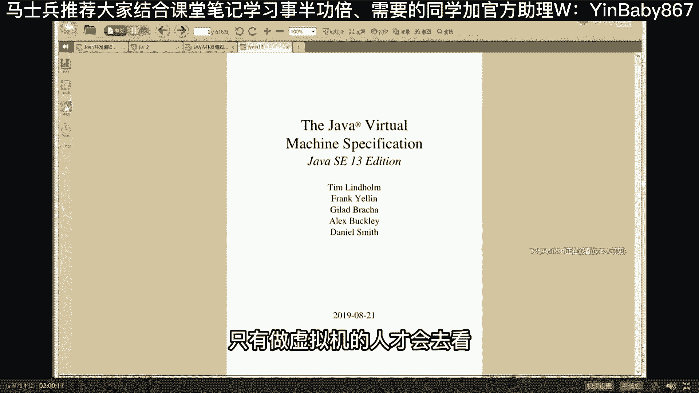
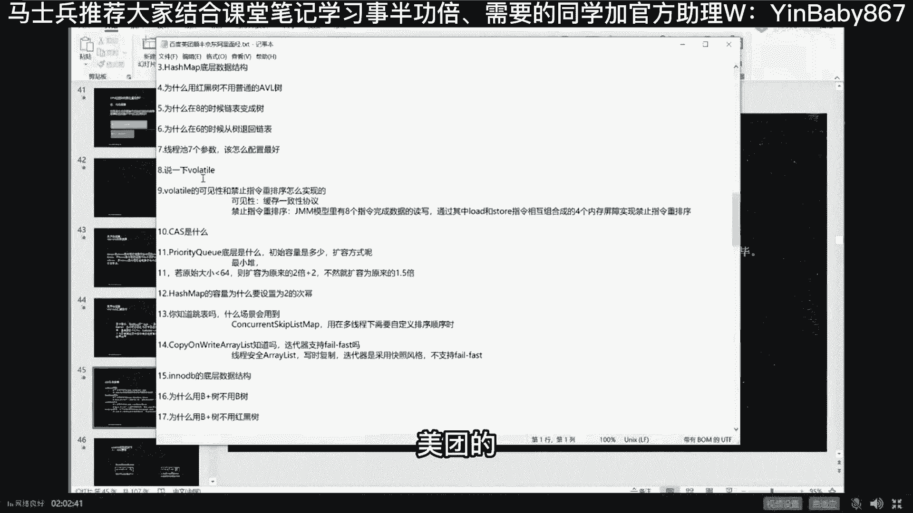

# 系列 5：P14：14、怎么阻止指令之间的重排序？ - 马士兵学堂 - BV1E34y1w773

好下面我们讲的在什么情况下，我们怎么阻止线程之间的这种怎么阻止啊，这种指令之间的重排序拿什么阻止呢，听我说阻止重排序这件事分成两个层面的问题，网上很多文章不分层的讲，你根本就看不懂。

网上很多文章包括讲缓存，讲MESI，讲缓存一致性协议，讲volatile，你看不懂的原因就是因为他们没分层，我们分两个层面讲，第一个层面呢叫做我们忽略java虚拟机。

我们先不考虑java这种语言跟语言没关系的，CPU汇编指令级别禁止两条指令重排序，这件事怎么完成，听我说这件事是这么来完成的，就好比两个人排队，一二排着队去辨别，总是要有一个上锁。

便便完之后解锁另外一个人才能出来，好这哥俩要想换顺序，我不想让他换怎么办，我中间给他隔个板不就行了吗，给他放个屏障不就行了吗，不让你越过去。

啊老师这个文件可以分享给我们吗，不可以太多了。

我们内容非常非常的多，大概160多页吧。

跟老师学VIP不就行了吗，而且你只有只有只有这个文件，也也也也也没有什么的，好吧好，这是第二版啊，就是你现在可能往后看的是第一版，现在我们就是第二版了，每年也在升级的好看，这里我们来说这个有序性问题。

所以第一个叫做内存屏障，再说一遍啊，我现在讲的是一个底层的概念，底层概念指的是CPU级别，汇编级别，两条指令之间，我不想让他换顺序怎么办，中间给它加一条屏障，屏障是什么，是一种特殊指令。

当CPU看到这种指令的时候，他前面的必须先执行完了，再去执行后面的这块能理解吗，这哥俩就换不了顺序了吧，我先上一个执行完，你他已经死了，你不可能死在前面了啊，你不能说那个你死在一个已经死了的人的前面。

好这块能get到的老师扣个一，当然这种指令你就别背了，对这种指令你就别背了啊，像英特尔的话，它就是三三个，第一个叫LFS，FS和FS，它是CPU特的指令，其他的CPU用的可能不是这种指令。

所以你未必能够说呃通用，但是啊这是这是这是底层级别，还有一个层层面是谁呢，是JVM级别，JVM级别是怎么禁止两条重排序的呢，我这VM两个，你看看刚才两个线程对吧，这两个线程如果说不禁止。

我们那两个重排序的话，他有可能也会产生各种各样的毛病，好它是怎么定的重排序的呢，JVMD的重排序是用volt的关键词实现的，有同学说了，what这这这这这听上去很不可思议啊，怎么怎么做的呢，看这里。

这也是那个，美团问的问题，他说你的这个定义的这个对象，前面要不要加volatile，答案是要讲ja volatile，跟不加volatile有什么区别吗，区别就在于。

加了volatile修饰的这个变量不可以重排序，有同学说了，老师你这个问题有bug呀，你这个重排序指的是指令之间的重排序啊，你怎么修饰这个变量，它居然还能重排序，这是啥意思呢，嗯好大家听我说。

这句话的意思呢比较复杂一点，嗯一般面试也没人问啊，你大概理解有这么一件事就行。

这件事情呢是这样子的，好看这里，作为java虚拟机的要求，java虚拟机的规范要求，这个是另外一本书，如果你感兴趣，你去读，不感兴趣，交给老师，老师帮你弄好了，你那个直接站在老师的肩膀上继续前进就可以。

你能省好多的精力和资源啊，java虚拟机的规范。

这个规范啊非常的复杂，只有做虚拟机的人才会去看嗯。

老师没事做过几个虚拟机，所以我要读一读好虚拟机的规范的要求，凡是用volatile修饰的东西，必须去，不能说是凡是用volatile的东西，就是说凡是你只要去实现一个java的机，你必须在原语级别。

在汇编级别给我实现这四种屏障，这四种屏障类似于CPU的那种汇编级别的屏障，特殊的指令，这几种屏障分别叫load，Load store store，load store和store，Load，同学说。

老师这这这这这不是成绕口令了吗，太难理解了，其实非常容易理解，我花30秒给你讲清楚，load叫读，store叫写，如果是load store这样的屏障，这样的屏障，Load store，他的意思是。

前面的这条load指令，不可以和后面的这条store指令换顺序，这哥俩不能换，哦我讲完了应该没超过30秒，剩下三个还用我讲吗，我知道right是写对你知道women是女的。

你就不知道girl也是女的是吧，咋那么轴呢，小学五年级毕业能学懂这个课吗，没问题，只要你肯学，都谁不是从5年级过来的呀，好当然这四个要求呀，再说一遍，是JVM级别的要求，不做虚拟机的人呢。

也不用不用去理他们，到目前为止，好像只有去年有小伙伴进阿里的时候，问过这个问题，其他的好像没问过，大家看看，这是他原来面面阿里面了七次给大家总结的。

七面积的阿里呃。

百度的，美团的volatile好。

这是美团的美团的问题，三轮技术面说一下，volatile完了可怎么实现的，load store组合，四个屏障禁止除外，就问过这个哎。

美团怎么那么变态呢，最近刚刚有两个小伙伴入职美团，再变态也没用，在老师这儿照样吊起来揍，好好听，我说这是JVM级别要求你实现的四条屏障，那么说回volatile这个东西，为什么能实现内存屏障的作用。

因为看这里，因为在JVM的内部，要求volatile修饰的任何一块内存，一个变量对它进行写入的时候，也就是对它进行store的时候，前面要加一个store，store的barrier。

后面要加一个store load barrier，好，这句话是什么意思啊，这句话的意思是说，当我们对这个变量开始写的时候，写入前面的所有的写入必须都给我全写完了，我才能继续写，后面所有的读操作。

必须等我写完完成之后，你才能开始读，好这条叫读操作，对这块内存的读取怎么读啊，等我读完之后别人才能读，等我读完之后，别人才能写，好了，这就是volatile是怎么实现内存屏障作用的，那么分析刚才这个。

我们volatile修饰的那个对象的话，他前面有这个barrier，后面有这个barrier，你还能够说那两条指令还能换顺序吗，想想那两条指令，一个是去读它，一个是去写它对吧，构造方法不是要往里写吗。

是不是往里构造吗，我是不是得等它全都弄完了之后才能往里写啊，我是不是等我写完了，别人才能读啊，还能换顺序吗，换不了，好这就是为什么要加volatile的原因，来听明白的老师扣个一，我听懂了。

当然我讲底层的一般讲的比较底，明白了80%是吧，写了才能读，读了才能写，冲突了咋整，按顺序来啊，马老师，我想听广告了等着。

