# 系列 5：P19：19、JUC乐观锁 - 马士兵学堂 - BV1E34y1w773

那现在问题是，那么能不能够说我们不上悲观所能不能解决，因为悲观锁有没有人跟你抢，你都上锁，没完全没有这个必要，有的时候他说怎么办呢，这时候就会产生乐观锁的概念啊。

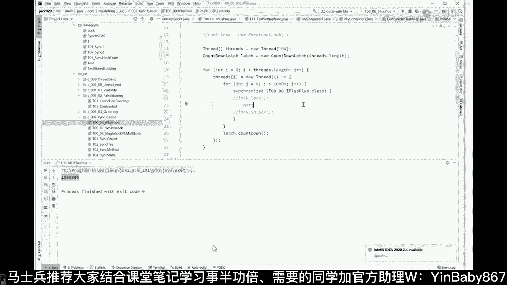

乐观锁这个概念呢，其实我跟你说啊，同学们听我讲这个乐观锁啊，好多好多概念，嗯不错，他们听我说，这乐观锁呢有好多好多的别名，就是大家伙叫着叫着呢，可能叫混了，我先说一个观点，所有的概念都是人类创造出来。

方便沟通使用的，一定记住这一点，什么意思，原始人啊，不认识这玩意儿是吧，嗯后来起了个名叫便便哦，大家伙一沟通的时候，手绳子拿手比划了一说，便便的指的是什么东西，但是这里面你创造了概念，我也创造了概念。

很多概念就容易混淆到一起，如果大家伙把精力都花费在扣概念上，你就成了孔乙己，我下面讲的这几个概念很容易混淆，但是你不用使劲抠，听我讲这个乐观锁啊，有很多人称之为乐观锁，也有很多人称之为叫自旋锁。

还有的人呢把它叫做无锁，这个名称是最讨厌的，为什么他叫吴所，我一会儿讲给你听，是因为呢他原来认为这是一把锁，所以呢这边没有上那把悲观锁，因此呢叫做无锁，叫无悲观锁，这个名字是最讨厌的，以前还有人问我。

老师无锁是不是一把锁，白马是不是一匹马，谁要跟我讨论这样无聊的问题啊，你哪凉快哪呆着去，不要跟我讨论这种问题，我们学东西叫做学以致用，你如果说为了抠概念，跟我这儿抠字眼儿，咱就别聊了，好吧好。

我还告诉你，以前有同学跟我聊，说老师这个无锁跟cs到底有什么区别，其实如果严格意义上讲，CAS是乐观锁，自旋锁，无锁的一种实现方式，但是呢基本上也就这么一种实现方式，所以说呢这几个概念从粗浅的角度讲。

全是一个概念，好讲到这儿可以继续的给老师扣一，不懂才问的，知道还问你干嘛，嗯你说的很对嘞，雨电嗯，所以我提前给你给你毙了吧，这种问题好吗，带节奏的，我一会直接踢出去啊，我直接告诉你们，谁要我带节奏。

我就直接往外一踢，二话不说好，所以我们只要聊清楚cs这个概念之后，大家伙这乐观锁全都一样的，因为每个人都是站在自己的屁股角度考虑问题，不会考虑别人感受，有很多人他认为我水平很高，所以使劲催我老师。

你讲快点，老师你讲多点，有的人呢实际上人家水平真真没到这个位置，我们呢稍微要照顾照顾基础稍差的，对不对，好了我，乐观锁为啥叫自旋锁，别着急啊，你听我讲完，你就理解了为什么叫自旋锁。

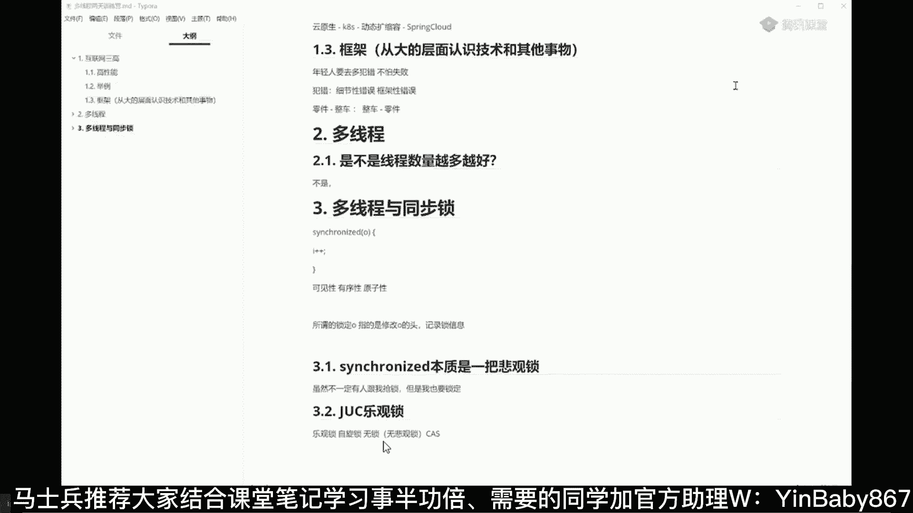

为什么又叫无所，好好听我讲啊，我原来只是就是讲cs的时候。

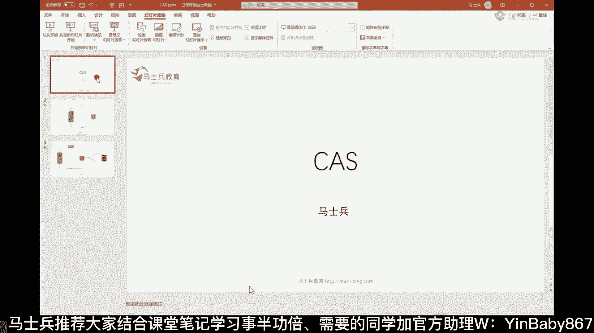

我没有单独的把它拎出来，今天我单独把它拎出来啊，今天上课之前我画的这个图，我们现在聊清楚什么叫cs，聊清楚cs，你聊清楚什么叫乐观锁，乐观锁这玩意呢，什么叫它就叫不上锁，那cs的全称。

我们平时说的全称全称叫compare and swap。

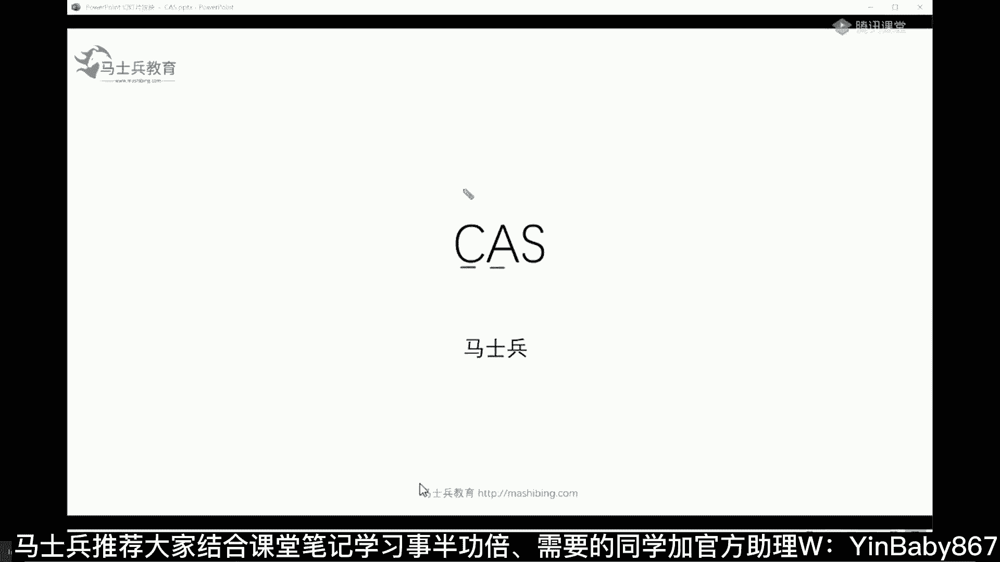

一会我敲吧，给大家敲出来，cs全称叫做什么呢，它有好几个称呼啊，所以我就说有的人呢追概念没没什么意义啊，叫compare and swap，叫比较并交换，或者说叫compare。

and set比较并设置，还有一个叫法叫compare and ex change。

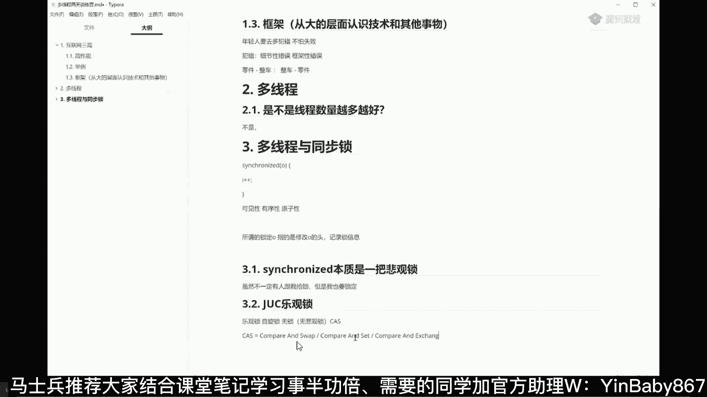

就比较并交换啊，其实本质是一个意思，好听我说这句话是什么意思。

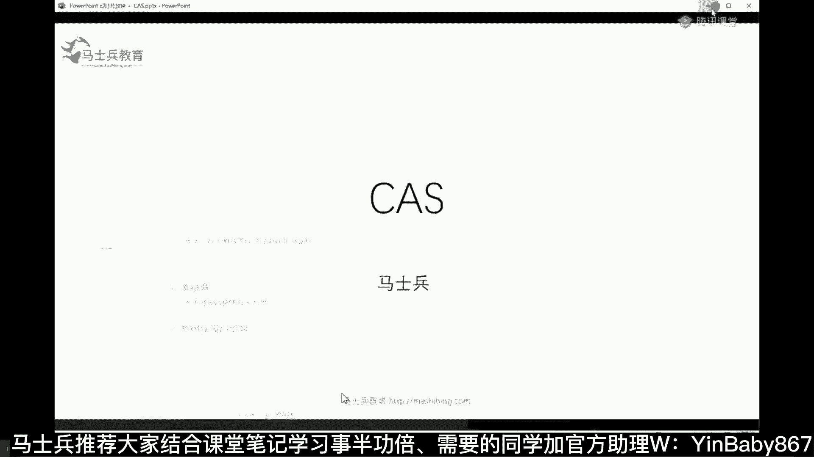

我们就来探讨一下，cs是怎么来保证一个值给它增加上来啊，给他那个加加，拿刚才那举例子啊，加上来之后还能保证数据的一致性，最后的结果还能得到100万，我们来举这么个例子，大家看这里啊。

这是原来那个值那个零，这是原来那个零，如果我有一个线程想对它进行递增的话，我怎么做呢，我不上锁，我首先是读这个零，把这零读过来，对它做加加变成一，然后再把这个一写回到内存里面去，这是整个过程。

这是佳佳的操作的整个过程，先读过来，读到哪儿去呢，读到县城这里，你简单理解读到某个CPU里面去，我刚才说了，每个线程在一个CPU里面运行，我读到这个CPU里面来，我给他做加加操作。

把它变成一再给他写回内存。

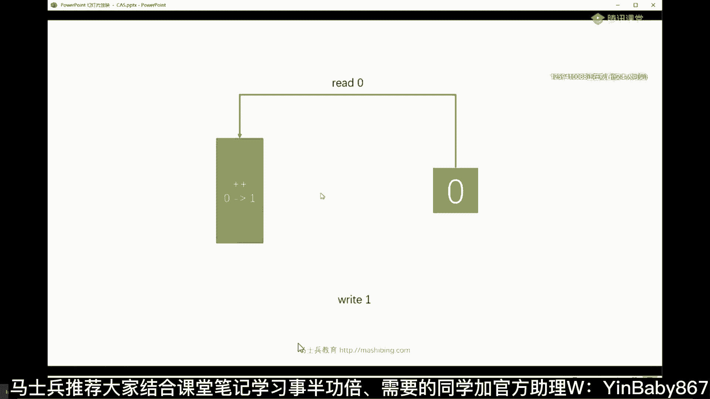

大概就这么一个东西，好同学们听我说。

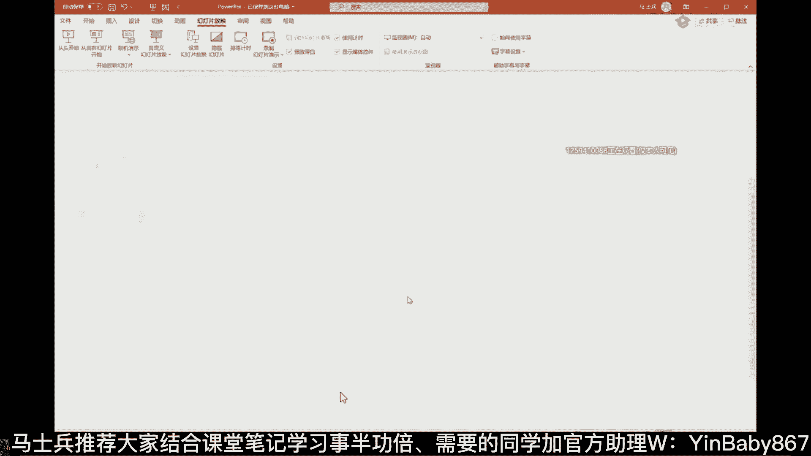

关键的关键就在于往回写的时候，要做一个你写到这里啊，往回写的时候要做什么操作呀，要做一个CAS操作，这里cs指的什么叫compare and swap，这个操作相当于是这样的，我先做一个比较操作。

if看看您老人家这个值是不是依然为零，如果您老人家依然为零，我就把你设成一，大概是这么个意思，我再说一遍嗯。

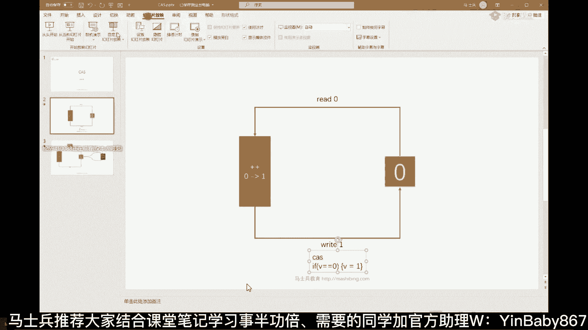

首先读过来做递增，但是你往回写的这个过程之中。

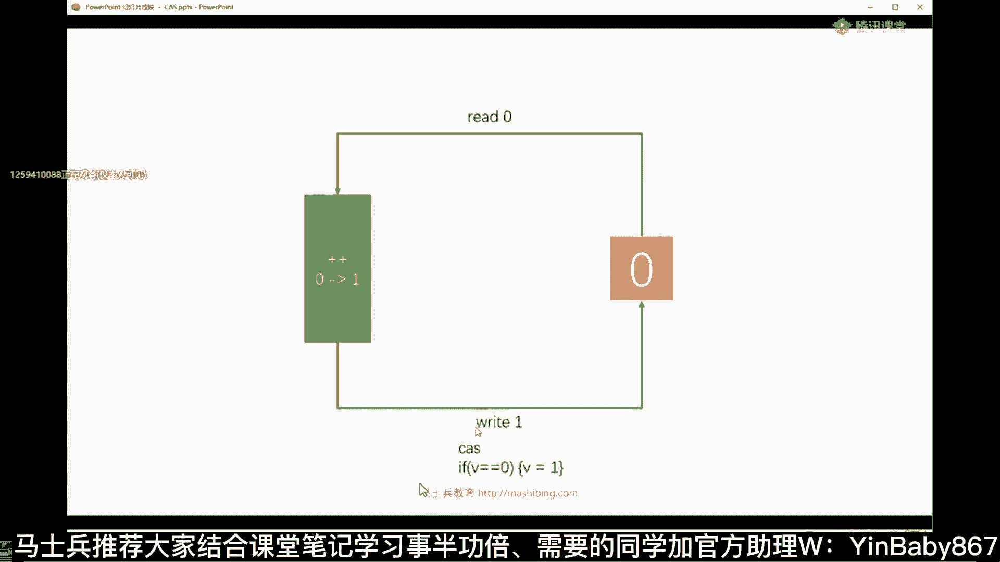

他会做一个操作，它会首先做一个比较，这个比较比较的是什么东东呢，比较的是哥们儿，您这个值被我拿走之后，递增了的这个值是不是依然为零，仍然还是这个零，那如果你仍然还是这个零，我就要把你这个值变变成一。

能听懂吗，这就是cs操作，cs操作指的是当我设定一个值的时候，我首先做一个比较操作，那现在问题就来了，这个东西怎么能保证一致性呢，万一我设定的时候它已经变成一了，变成八了，变成九了，这时候该怎么办呢。

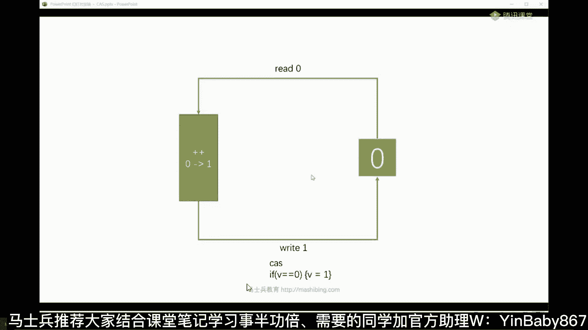

好看这里我这时候模拟两个线程来做这事儿，比如说啊我第一个线程，我把这零读过来，然后我做自增操作，我把它改成一，但是正在我做的过程之中，注意我没上锁，我可没有二话不说上那把悲观锁，我只是把它读过来。

做自增，我还没有来得及把这个零改成一的时候，另外一个线程读了这个零过去，把零改成了一把一给写回来，所以这个时候呢对于第一个线程来讲，这个值已经不再是零了，再看一遍这个过程。

这个过程是我左边这个绿色的线程，他把这只读过来，我正在做自动操作，还没有写回去的过程，有另外一个线程已经把这个零改回成了一，然后那么这个时候根据cs来做操作的话，同学们你们琢磨一下。

会判断这个值是不是依然为零，还记得吗，因为我刚开始读的时候，这个值是零，所以我要判断它是不是依然为零，那如果他依然为零，说明没有被人动过，我直接就把它改成一，对不对啊，VIP都没有看过这动画。

对我下午刚刚做的哈哈下午刚刚做的嗯，因为这个概念还是很重要的一个概念，所以我专门把它拎出来，那这时候怎么办呀，同学们，你们琢磨一下怎么办，他已经被改成一了，已经被改成一了，说明被别人改过了。

被别人改过了，我就重新再读一遍，听懂了吗，我就把这一读过来，我把它改成二，我再做CI操作，我判断哥们，你是不是依然为一。

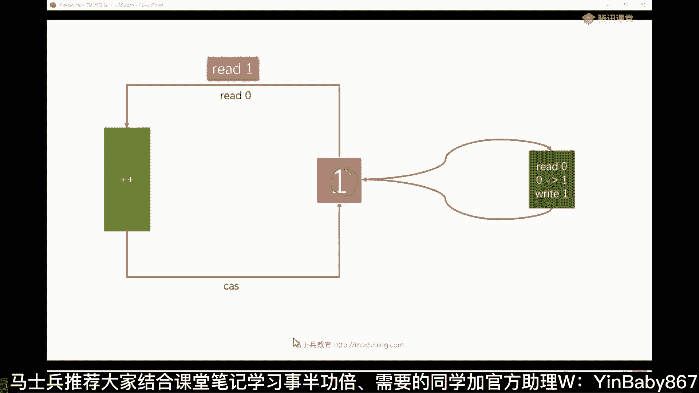

如果你依然为一怎么办，那我就给你改成二，如果你已经不是一被别人改成八了，没关系，我再把八读一遍，读过来之后呢，判断你是不是依然为八是八，改改成九，不是八，没关系，我再读一遍，直到有一次成功为止。

所以你看看他像不像自选，所以为什么叫自旋锁，唉就这意思，为什么叫无锁，因为没有上那把悲观锁，不是上来之后我先锁定某个东西。

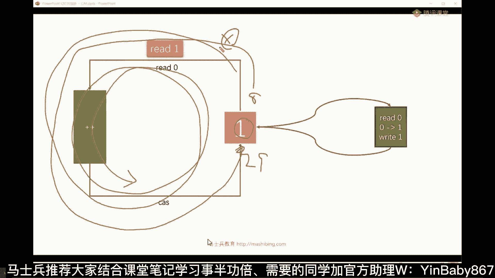

然后那个嗯喂喂喂，这个这个这个这个东西，你可以理解为他拎着裤子在这转圈就行了好吧，为什么轮到我呀，什么轮到我呀，锁开了吗，锁开了就轮到我，我就直接杀进去了啊，所以要自选所LINUX的原地转圈，自选。

还有同学说老师您说了半天，这个JOC里面确实是用到了吗，如果你要读GOC源码去。

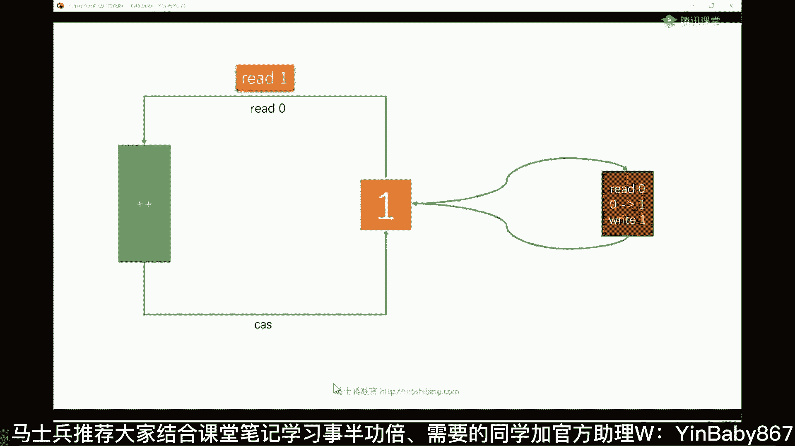

一定它是用到了的，但是DOC源码你读起来比较困难，我快速的给大家管这块，你要听不懂，听不懂就听不懂了，没有关系啊，因为这块内容就就就就就就主要比较多，就JLC等等。

我们拿这个reentry log来举例子，就是听我说reentry log这东西，它本身呢嗯弄了一些个具体的实现啊，Nf，好看这里啊，你看给他上锁的时候。

Lock lock compare and set state，看到了吗，是不是cs操作，就是它嗯嗯所以呢你你你你就你就去看吧，就是所有的这些个JOC新的锁，本质上都是都是用它来实现的。

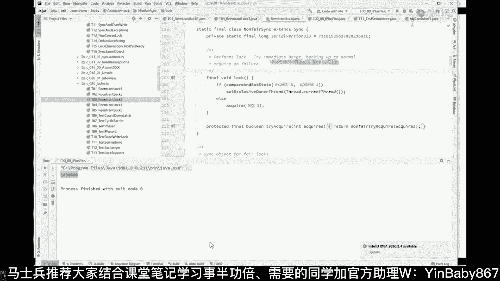

但讲到这儿呢，同学们听我说完还没有，完完全全没有完，你先把cs的概念给我消化掉，再说一遍，再看一遍这个动画你就了解了，就是总而言之，cs是怎么做到数据一致性的，不上锁的情况下做到数据一致性很简单。

因为我要改回去的时候，看看是不是被人改过了，没被人改过，我才改，有有被人改过，我重新来再看一遍，当我读这零过来的时候，如果中间被别人已经把它改成一了，这时候怎么办，没关系，我重新搜一再读一遍。

什么一直改成功了为止，好吧，OKOK这是cs最基本概念来掌握最基本概念的，给老师扣一，下，面我们来聊他的细节，里面细节很多啊，右边的进程不用cs吗，也是啊，我们假设是右边的进程成功了，改了这个值吗。

也是一样的，都是cs，好好听我讲啊，呃就是这玩意呢，这玩意儿有一个致命的问题。

同学们。