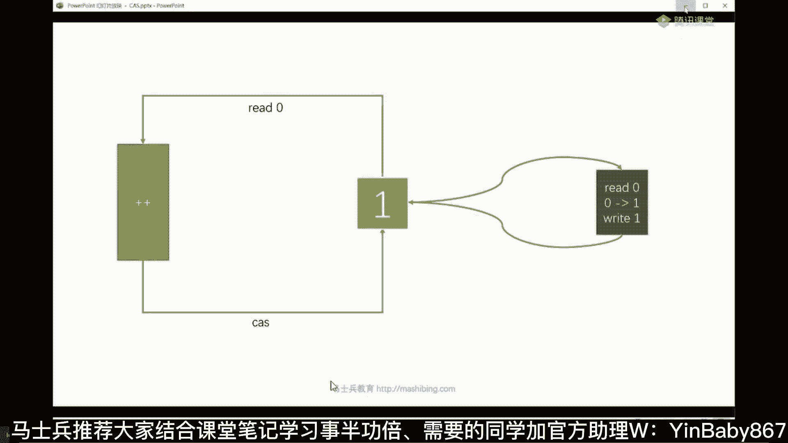
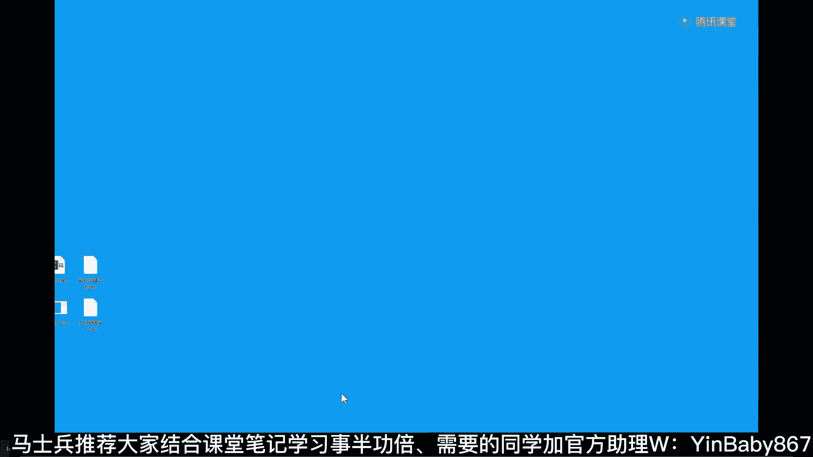
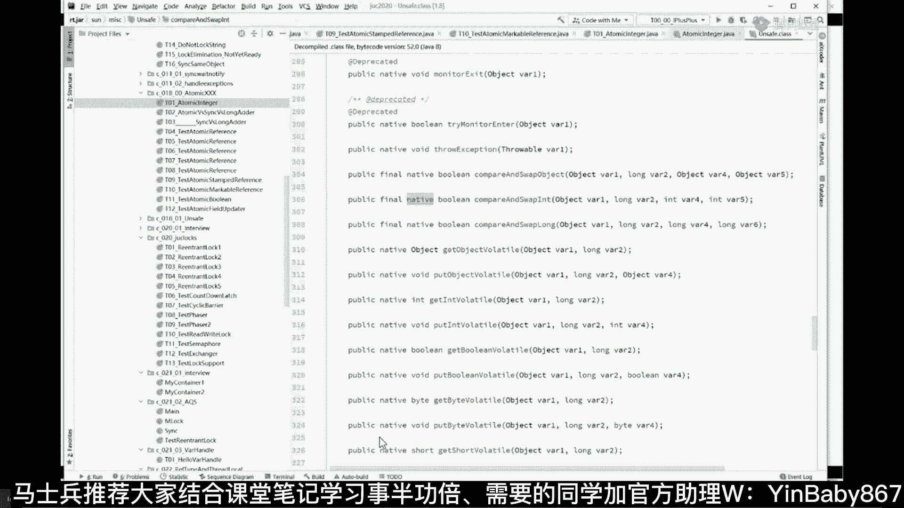
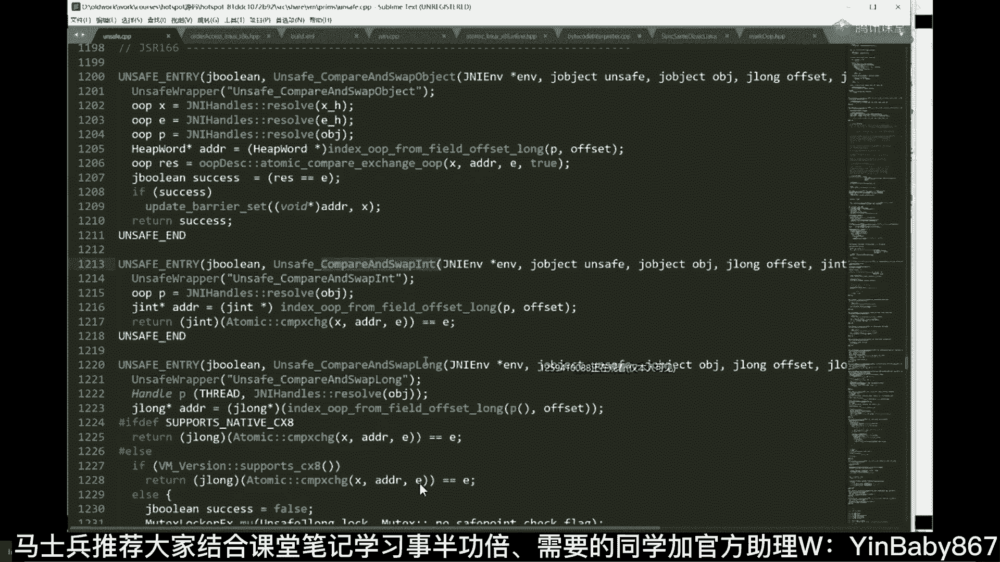
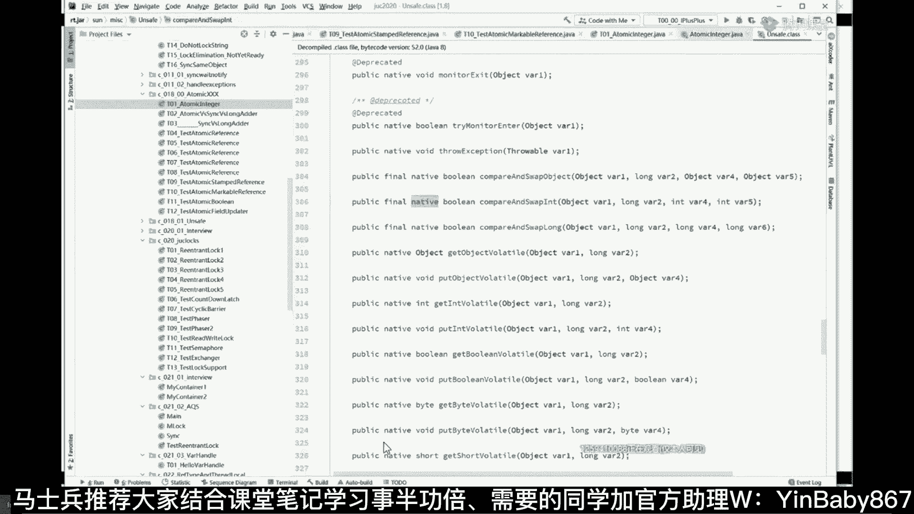
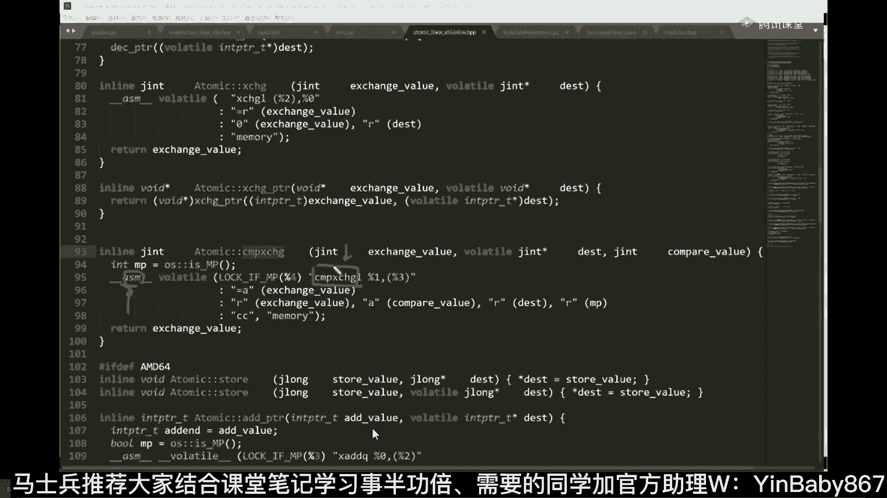
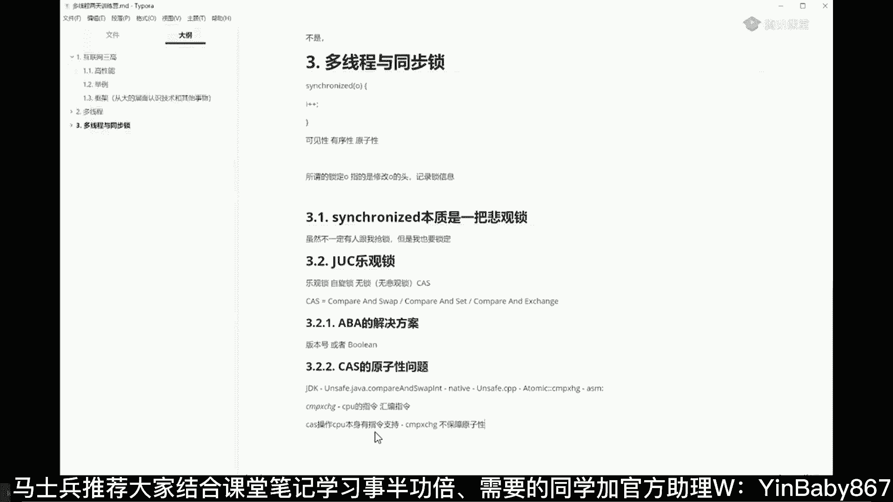
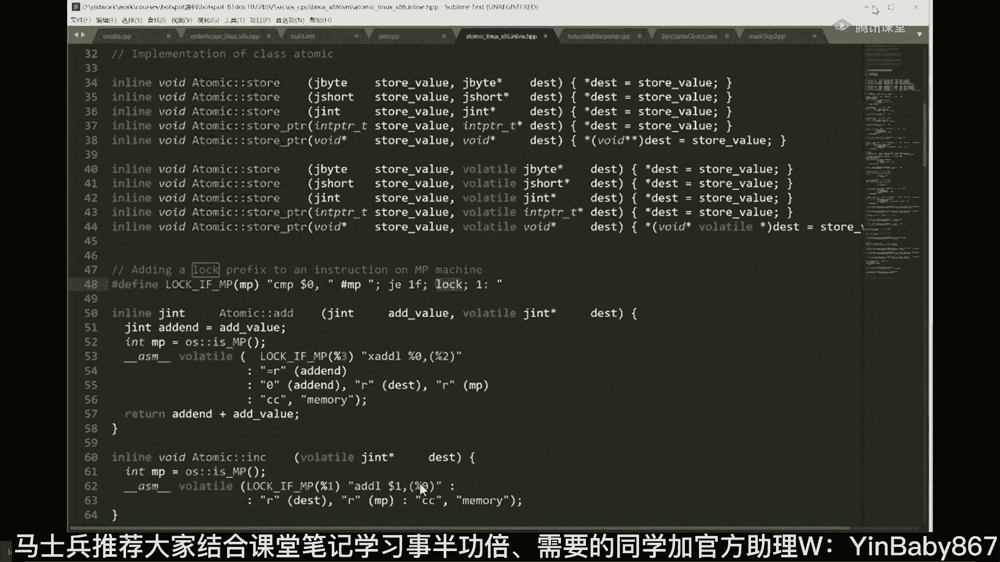
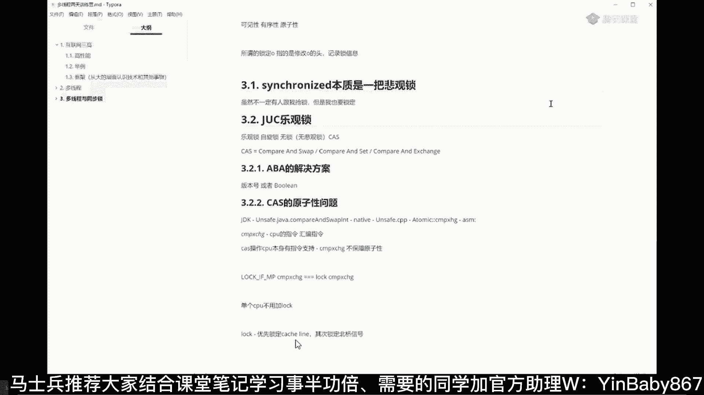

# 系列 5：P21：21、CAS原子性问题 - 马士兵学堂 - BV1E34y1w773

这个AABA问题不是最难的，最难的是下面这个问题，cs的原则性问题，这是最难的，嗯解释一下这个问题啊，cs原型问题，问题二，这个问题的本质是cs操作本身必须具备原子性，这是什么意思，同学们。

你们琢磨这件事嗯，我们说啊，就是这个cs操作本身是这么一个东西，if这个值是不是我们期望那只，如果是我们期望这个一，那么我就要把它改成二，大概这么一操作，你们琢磨着这件事。

如果有一个线程执行到这里的时候，判断哥们，你确实依然唯一还没有来得及把它改成二，然后被另外一个线程打断，已经把它改成八了，最后的数据一致性就又没有了，我再说一遍，在做最后一步比较并且操作并且交换。

并且设置的这个过程之中，刚做完比较还没有来得及做设置，中间被别的线程打断了，那这个时候依然是实现不了，我们最终的数据一致性，也就是说这把锁本身就实现不了了，所以CAS本身的操作二话不说，必须保障原子性。

叫做中间不能被打断，这叫做原子，这一步是怎么实现的，听懂了吗，这是下面我们要解决的另外一个问题，也是大厂会问到的另外一个问题，OK来。

我们来聊一聊这东西到底怎么实现的，这件事情实现上呢相对复杂一点点啊。

我讲讲看看能不能跟得上嗯，我看有好多同学在那敲unsafe啦，这个啦那个啦，你说的很对，为了了解清楚这个问题，我们我们挑一个比较简单的吧，比如说atomic energy，本身这哥们也是用cs实现的。

大家都知道啊，就是atomic enager作为一个数值的递增，是不用上锁的，对不对，不用上锁，它就一定是用cs实现的，你放心，比如说啊，原来我们得上这把锁，Synchronized，我们现在不用。

我们只要用increment and get来做这个操作就可以了，好好好听，我说这会儿还能跟上吗，能跟上，给老师扣一，好看这里看这里，好多同学搁那敲volatile，还没敲，对你是几个意思。

你咋那么逗呢，这volatile volit，啊这东西还没敲，对你是什么意思，别敲了啊，丢不丢人，行又一个没敲对了，行不行啊，大各各位，我又又又没敲对，哎呦行了行了行了哈哈，好大家看这里啊。

我们下面就来探讨他这个cs操作怎么来完成的，注意看count点，Increment and get，这就是做了递增操作了，我们看递增操作是怎么做的，点进去好，有同学敲了unsafe，说明你们说的很对。

确实用到了一个类，叫做unsafe，Get and at end，咱们再点进去，在这里你会看到cs操作，这个cs操作是compare and swap int比较，并且交换什么样的值。

一个int类型的值，你再点进去，再点进去就完蛋了，因为这里是native，是本地代码的实现，本地代码实现的就是C和C加加代码的实现，那这玩意儿它到底是怎么实现的，我就理解不了了，我就了解不了了。

再看一遍啊，就是说如果我要用一个cs操作来做自增，我是不需要上锁的，它本身是怎么完成的，它是调用了increment and get，调用了unsafe，Get and at int，在这个里面呢。

我又调用了compare and swap int，好这个方法是谁的方法，是我们on safe这个类的方法是他的方法好，这个方法到底是怎么实现的，它是native，native是怎么实现的。

是用C和C加加实现的，那大家读C和C加加的demo，swap啊，好swap，Swap，Swap dumb，讲道理，Swell，Swell，你吓得我都不敢读了，确认一下啊，读了这么多年是不是读错了。

读错了，一定要承认错误，swap读音，Swap，谢谢谢谢啊，你说的很对对，是读swap，我读错了啊，对不起，跟大家道个歉，不读swap是读swap，Sorry，嗯谢谢这三人行必有我师啊。

那刚才是谁教我来着，Dom，谢谢DOM，Thank you，好我们回了回了哈哈，讲着讲着技术聊英语了是吧，嗯好compared swap，Compared swap int，好好听，我说呃。

这里呢就是native，native呢是用C和C加加代码实现，那么C和C加加代码能不能读呢，其实也能读，其实也能读，那个，当然这个要读起来就相对困难啊，因为为什么呢。

因为这东西呢就相当于是HOSPORT的实现，因为HOSPORT本身拿是拿C和C加加写成的，中间还有一部分汇编，我带大家读一读，能跟上就跟跟不上呢，你就当听故事好吧，呃我们有hop源码课。

这课呢就是相对比较高端的课，首先你得给他做好编译，基本上windows环境编译不了，得是在LINUX环境底下比较好做编译啊，我一般偷懒都在LINUX下做编译，但是windows呢你可以直接看到源码。

这个没问题。

源码呢我给大家打开了，记住在那个呃java里面的那个unsafe那个类，实际上在C加加里面有一个类呢是和它对应的，这个类就叫做unsafe，点CPP是C加吗，还记得我们刚才用那个方法吗。

那个方法叫compare and swap in，那么在C加里面呢有这么一个方法和它对应，叫unsafe，Swap and int，好，讲到这儿还能还能跟上吗，能跟上给老师扣个一。

不能的那个你你你哪哪没跟上，你可以跟老师说说一说好不好，我一会儿我一会儿讲完，我再来给大家复习一遍好吧。

就是总而言之这块你们带那个那个cs，大家应该都能理解，对不对，cs的操作本质上是怎么完成的，我现在在讲的这件事啊，就是CAS应该能理解比较简单的概念啊，不难，下面我讲的是cs是必须要保证原子性的。

这个我相信大家也没问题啊，我们捋一遍啊，就是我刚开始给大家讲了cs的概念，然后呢告诉大家，cs操作本身必须要保证原子性，不然这本他这个锁就不成立了，然后呢，下面我们来聊的是，这东西到底怎么保证原子性的。

怎么保障呢，我们通过源码一步一步跟踪下来，我们读JDK源码的时候，发现他用的是unsafe那个类的，Compare and swap int，结果发现读到这的时候它是native的，是不是。

下面呢我们就是跟到native c和C加加代码里来，去看看这哥们到底是怎么实现的，好了，是不是是不是跟上了，可以跟上了吗，嗯跟上跟不上我们就塌了，好吧啊，看这里啊。

这个代码去哪里找这么细节的问题，咱们后面再聊吧，open jdk的代码上网去找就行了啊，老师会教你怎么找我，教你怎么编译，编译还比较困难，看这里啊，就是那个当我们读到这段代码的时候。

这里呢就是C和C加加的对于compare，对于cs的一个具体的实现，它是怎么写的，特别复杂的，我就不带你读了，你就注意看就行了，在这里呢他调用了一个atomic这个类，这是atomic类的静态方法。

叫compare and exchange方法，我们直接给他直接给它定位过去就可以了啊，直接给它定位过来，中间过程我就不带大家那个跟踪了，注意看，总而言之言而总之，我们跟到最后会发现。

它的实现方式呢是atomic这类的compare exchange方法好，我们读这个方法的时候，你会发现它的实现是一个ASMSM的，全称叫assembly language，叫做汇编语言。

简单说这是个汇编，汇编的实现，好汇编是由什么来实现的，是由他来实现，注意看叫compare and exchange，我们讲到这，我相信你已经得出来第一个结论了吧。

来记一下cs原型问题，我们都是通过JDK代码跟到了unsafe，这个类里面的，Compare and swap in，后来发现他是native代码，所以我们跟到了unsafe的CPP里面。

又跟到了atomic这个类，这个这个这个有一有一有一个方法叫compare，And exchange，跟到了这里面好，跟到这里面之后呢，我们发现它是一个汇编的实现，它是汇编的一个实现，这个汇编的时间。

这条指令叫什么，叫compare and exchange，好我们讲到这的时候，我相信你应该了解啊，这个东东这是一条指令，这是一个CPU的指令，是CPU的汇编指令，好讲到这能给他能跟上的老师可以。

就总而言之，它的底层是由哪条一条指令来实现的，哪条指令呢，就这条指令，这条指令叫compare and exchange，所以我们说cs本身CPU就有原始的指令，来支持他好，我们得到了这个结论了。

这个结论我们就得到了就是cs操作，CPU本身有指令支持哪条指令，就是这条指令，但现在问题来了，这条指令它能保证原子性吗，我很不幸的告诉你，这条指令不保证原子性，也就是说，虽然你看到了这条指令。

Compare and exchange，不保障，保证原子性，所谓的不保证原子性是什么概念啊，简单说就是这样一个概念，就是这是我一颗CPU，这是我一颗CPU，如果我两个CPU都要改内存的同一块地址。

这颗CPU用的是cs操作，这个CPU用的也是cs操作，互相之间有可能被打断，这个可能改了一半，还没来得及收回去的时候，被另外一个C车打断了，所以总而言之，言而总之，这哥们儿跟到最后也没戏。

因为他不不支持原子性，我讲到这儿呢，讲一点扩展的概念，有同学会说了，老师一条指令是不能够是不是原子的，是一个什么概念呢，不是原子的，就是它中间可能会分成好多步，而且有可能被其他线程或者CPU打断。

很多同学在这块老犯糊涂啊，我稍微多讲一点点就多了，不讲就讲一点点，看这里就拿这条语句来说，很多人认为这条语句呢他应该是个原子的啊，我new了一个对象，还能有中间被别人打断吗，其实如果你了解的话。

大家都知道java的源码啊，是被会被我们反编译成为，那不是反编译会被编译成为class文件，class文件这东东呢，它实际实质上啊本质上就是java虚拟机的汇编码，看这里我们看一下他的那个生成的汇编码。

你就理解了，Show bad code，在这个方法里面，main方法好了，这是这一句话生成的五条汇编码，看到了吗，这就是这优化生成的object o等于new object，翻译成class之后。

它是由五条指令构成，new duplicate special store和return，你敢说你在执行这里面的过程中，不被其他人打断吗，不可能，所以，在讲的稍微远一点点，我们说java代码写了一句。

很可能翻译成class之后，它是五句，而class是不是得交给JVM虚拟机去执行啊，去执行的话，是不是得翻译成为本地的汇编语言呀，这个有可能是50G能听懂吗，所以中间绝对有可能被别人打断。

笑到最后的时候，每一句汇编语言是不是有可能被别人打断，这个东西要去查手册，要查手册，你得去查那个英特尔那手册，看看哪条语句是原子的，哪条语句不是，我讲到这儿呢，我们来读这段，再来读这段代码。

你会发现呢，这哥们他不是原子性的，不是原子性，它到底怎么来实现呀，这事儿就麻烦了，我看他前面的前面还有一个叫lock if mp，这个我就不展开了啊，这个lock if mp呢转一下也可以啊。

你看一下他那个那个那个那个定义就可以了，这是一个宏操作，这是加的里面的特有的操作，java里面没有啊，叫宏操作，那么在这个里面呢，lock if mp后面你会看到这条指令，这条指令叫lock。

我先说结论啊。

我先说结论，就是你刚才看到了这个东西叫lock if mp，然后后面跟着的是compare and exchange指令，那么这个log e m p的意思呢，实际上最后会演变成为什么呢。

lock这条指令compare and exchange，所以最终的我们的cs的实现，是靠这条指令来实现，叫lock compare exchange，讲到这儿呢。

有同学可能会比较比较比较比较比较有疑问，说老师这个宏操作是什么意思呀，同学们听我说mp的意思呢，我们先理解什么叫mp p呢，叫，好这是什么意思啊，就是多个处理器，也就是说你要有多个处理器的情况下。

前面给你加一条lock指令，如果你是单个处理器，这条lock指令不用加，所以这是我们最终的一个汇编实现，我讲到这儿还能跟上的同学老师扣个一，嗯OKOK不错不错，那好当我们了解了这件事情之后。

下面我们就来探讨，为什么这样一句话就可以保证原子性了，我们探讨来探讨去，我们说cs要让cs本身具备原子性，然后呢找到了unsafe里面的cs操作，找到了C加加里面的unsafe cc。

这个cs操作跟到最后发现它是一条lock，指的就是c compare exchange指令，但这条指令不能保证原子性，最终的实现是一个lock加上compare exchange阿米达，这来探讨。

以前老同学跟着犯糊涂，也老有同学问我，他这么问，他说老师我是多个CPU，前面要加logo，我单个CPU前面还用加lock吗，单个CPU不用加，但是我单个CPU也可以跑多线程啊。

我单个CPU compare exchange的时候不会被我自己打断吗，这个真打不断，你在自己执行一条指令的时候，还能把自己给打断，那我那你太牛了，你先把自己给打死，再去打死别人，在我跑步的过程中。

先把自己腿打折，那你太牛了，所以别在这上面反弧度，单个CPU是不用加前缀指令的好吧，只有多个CPU才可以才会加这条指令，那么这条指令本质上是什么意思呢，其实很简单，这条指令的本质讲一个最简单的实现。

叫做这颗CPU，其中某一颗CPU要对它执行CNI操作的时候，只要前面加了lock，相当于把总线锁定，这根线只让我用，别人不不让用，什么时候我把这个值改完了，这根线才放开，那其他CPU发现这根线被锁了。

他肯定就访问不了了，必须得等别人把这把锁放开，他才能去访问，所以就保障了原子性，所以cs本身在底层保障的原子性，是用lock来实现的，当然这是简单的说法，要讲的话还可以讲的更复杂一些，好讲到这。

我相信大家应该理解，讲了很多东西啊，应该理解什么叫高性能，应该理解高性能的两个方面，响应和吞吐，应该理解单机的这种要怎么样提高一点点性能，所耗费的苦心，原来都是悲观锁，后来产生了很多乐观锁。

看了很多乐观锁好，那那个应该理解呢，乐观所得本质的实现是cs，应该理解cs本身呢，是最后这条汇编指令叫lock compared exchange，应该理解这个了对吧，但是如果我们讲的更深一点。

这条lock指令实际上本质它有好多好多东西的，这条lock指令呢说一下啊，简单说一下，这块听得懂就听，听不懂就算了，这条lock指令优先，锁定，Catch line，优先锁定缓存行。

有优先使用的是缓存锁，其次锁定北桥信号，然后才锁北桥，到这就算了，就到这吧，到到上面就可以了，到面试面试，面试到这一步的时候，面试官基本上可以拎起来吊，吊起来打了啊，基本上到这面试官不会往深里再问了。

当然缓存行这件事情是另外一个复杂的东西，有时间我再讲给大家听好吧，那么这个时候你应该理解了哦，这是cs的本身，OK北桥坏过是吧，北桥坏过。

