# 系列 5：P22：22、大厂提问：是不是CAS一定比悲观锁效率更高？什么时候用CAS，什么时候用悲 - 马士兵学堂 - BV1E34y1w773

好好我们继续啊。

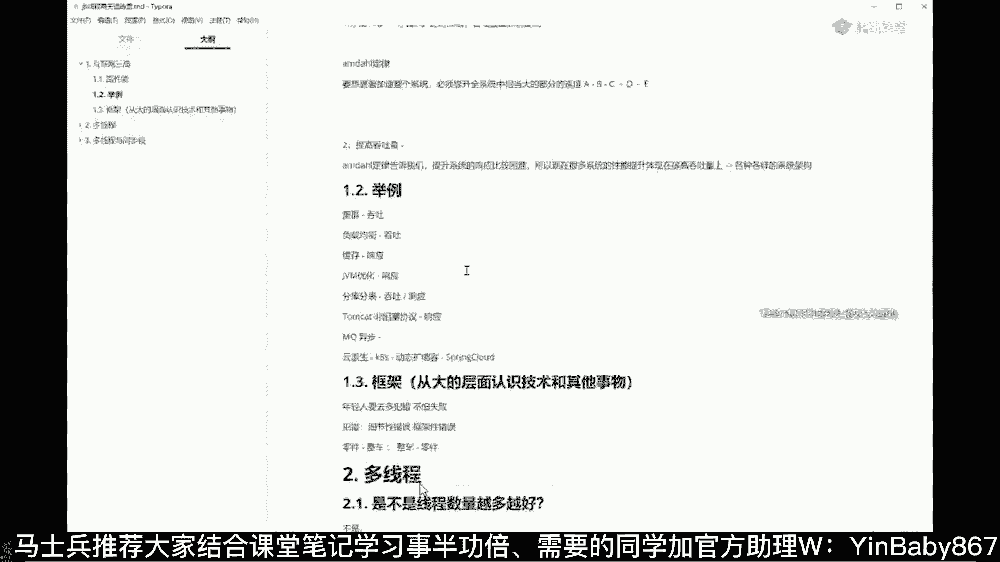

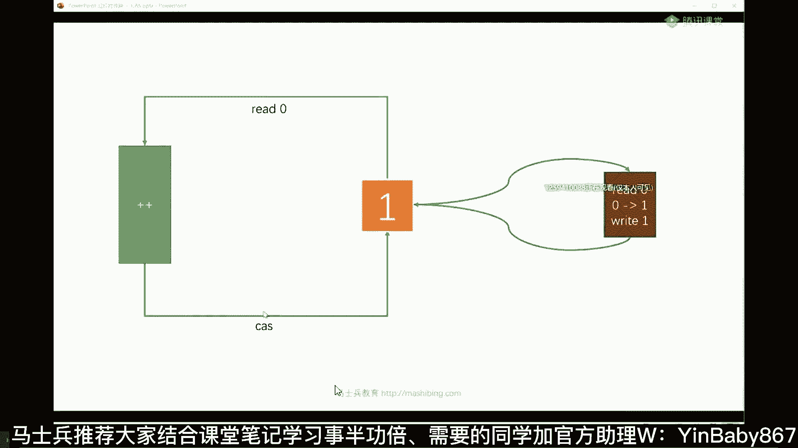

现在我们继续提问题，听我说，带上提问，那个是不是cs或者说用的GOC的，那些新的新的锁，一定就比A管所，效率要高，什么时候用cs漏管锁，什么时候用，没关系好，啊哈哈不不是的，看你那对，凡是问你一定的。

他一定是不一定有点绕啊，就是凡是问你一定的，他一定是不一定多CPU用cs单CPU用悲观锁，你这个脑洞很大啊，啊大大壮大壮还不叫大壮，哈尔滨，我说啊这个肯定是不对不对，我们琢磨这么一个问题。

首先第一点呢不是说CNS啊，我们说效率就一定比微管所效率高，千万别这么认为，嗯然后也不是说所有的情况都一定要用cs，都一定要用JUC新的锁就不要用synchronized，不是我先告诉你结论。

在你应用新的锁之前，如果能用synchronized解决问题的，优先使用synchronized，先说结论，能用，Sing sing，Sing，Synchronized，解决问题的优先使用。

优先使用synchronized，听明白了吧，能用synchronize这些问题优先使用的，好为什么是这样呢，好好听我讲，我们考虑一个问题啊，就是什么情形之下要用悲观锁，什么情形之下要用乐观锁。

我举个例子，这是一坑，咱们说有人要西门吹雪，西门吹雪，在这西门吹雪，要进去，噗噗噗，啊心吹雪呢，要进去噗噗噗要干，要要要要干事好，我们说悲观锁就是上来，西门吹雪二话不说，谁也进不来，同学们，你们想一下。

如果悲观锁上去，进不来，那么如果再来人的时候，微笑来了，花奔奔来了，好在来人的时候，其他人会怎么办呢，其他人会排队，记住这是操作系统的处理，西门吹雪，如果在里面呆着，上了这把锁，其他人再来了，叫排队。

踏踏实实到旁边屋里给我排队去，什么时候到你们了，操作系统叫醒你们，这个东西叫操作系统的线程调度算法，目前最常用的叫CFS算法，叫completely fair strategy，叫完全公平算法。

这个算法相对还比较复杂，一般来说考LINUX内核的时候会考会考到它啊，我们先不管，就总而言之，你们先憋着，老老实实给我排队去，在队列里边等着，什么时候叫醒你，你再出来，OK这叫排队，这是悲观锁。

那如果乐观锁的情况下是什么样的呢，乐观锁的情况下，拎着裤子转圈，微笑来了，就在这儿转圈儿玩儿，转圈儿到我了吗，每转一圈都看一眼诶，到我没有啊，每转一圈都看一眼，到我没有啊，好了，同学们听我说。

也就是说我们得得出一个结论来，如果我们用cs转圈这件事是消耗CPU的，听懂了吗，CPU你要执行while循环啊，它是一个循环，每循环一次都要看一眼，每循环一次都要看一眼，所以他要消耗CPU。

但是如果我们用悲观锁的话，它是不消耗CPU，为什么，因为它直接进队列，等待什么时候轮到你，什么时候C我们操作系统才会叫醒他，所以现在的问题是什么时候用cs，什么时候被挂锁，是不是就很简单得出结论了。

如果说西门吹雪执行的速度特别快，两秒钟完事啊，两个毫秒就完事了，不便秘，旁边有人等的人还比较少啊，俩人等着转两圈就转两圈，没有关系，很快就轮到我了，但是如果西门吹雪执行速度特别慢，便秘一进去就半小时。

你在旁边等的人还特别多，1万个人拎着裤子在旁边转圈，就等着西门吹雪，所有的CPU时间全耗在这些个现成的切换上了，好讲到这里，大家是不是理解了，是不是cs一定比被光子效率高，不是什么时候，cs没有悲观锁。

就看你整个县城要执行多长时间，等待的线程的数量多和少，好了，那么既然讲到这的时候，为什么我们你能用synchronized解决问题，优先使用synchronized，您刚才不是说了吗，说判断具体情况吗。

我要判断我等待数量很少，我直接用那个新的锁不就可以了吗，同学们听我说，是因为刚刚讲的这个synchronized以前的实现，它就是用悲观所实现的。

但是呢最新的synchronized synchronized，自从JDK，1。5之后还有1。4之后忘了啊，反正总而言之，现在这个肯定没问题，synchronized内部有所升级的过程。

在SYNCHRONT内部，本身它是从偏向锁到自旋锁到重量级锁，可以这么说，你用了synchronize之后呢，它内部就帮你试了，自选组好不好使啊，不好使，我就自动升级成为重量级的，这个重量级的。

就是我们刚刚所讲的这个悲观派对所，我再重复一遍这个结论，按正常的情况下，有的问题我们要用悲观排队来解决，有的问题呢我们要用乐观转圈来解决，但是现在呢由于synchronized在最新的实现里头。

自己内部做了一系列的锁升级，它会优先尝试比较简单的锁，比较简单的锁，不解决问题的时候，会自动的去尝试重量级的锁，所以我们优先使用它，因为它的内部帮我们自己做了尝试了，好了，自旋锁就是轻量级锁。

就是cs就是无锁等等，说的是一个概念，冒个泡怎么着，你要排个序吗，冒个泡难道是排个序吗，偏向锁是个啥，我勒个去，这讲起来还有完吗，我任何一个点给你展开都是一堆问题，我看时间吧，几点了，建议百度。

你百度能看懂也是你的本事嗯，偏向嗬，这新概念又来了是吧，偏向锁是可重入锁，这样子就有新的概念了，就可重入锁的概念就出来了是吧，10分钟我看能不能讲完吧好吧，你讲到十点偏向锁，简单给大家介绍可以吗。

介绍完偏向锁，咱们今天的课就到这，那可以的话，给老师扣一嗯，好什么叫偏向锁，偏向锁其实挺复杂的，我跟你说，偏向锁可以说是synchronized锁，升级里面最复杂的一个锁。

这个锁呢我尝试用简单的语言给你解释清楚，但是大家听我说，里面好多细节我就在这就不展开了，什么叫偏向锁，偏向锁的概念是这样子的，然后打开PPT好讲一些。

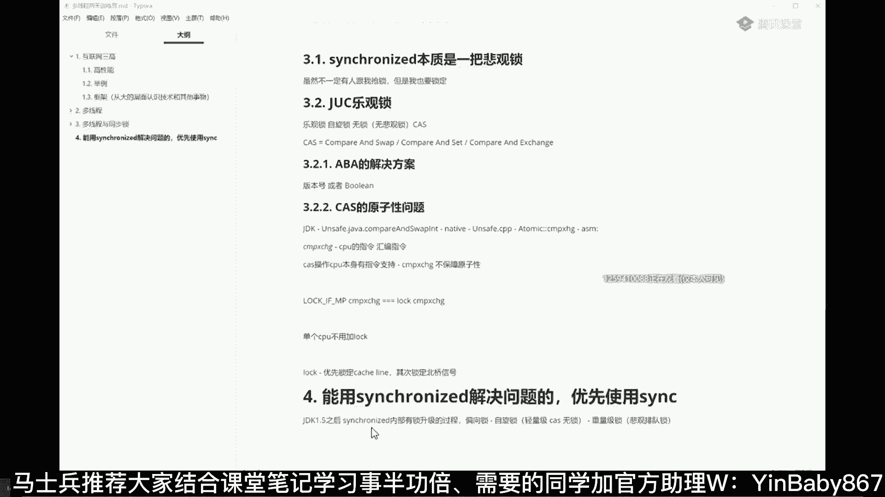

等会啊打开另外一个PPT。

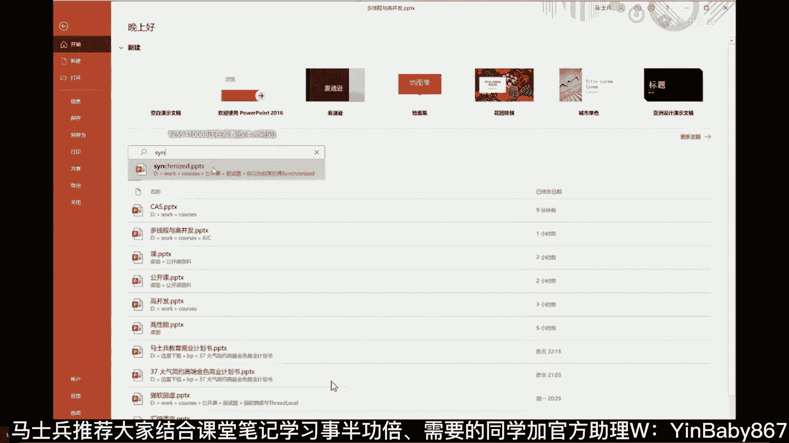

嗯嗯这个这个这个这个这个这个图。

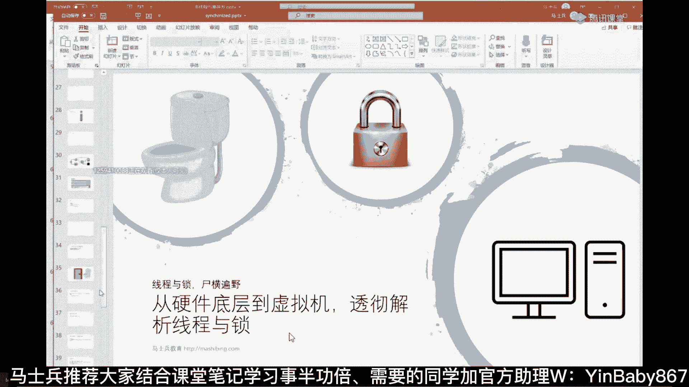

主要画起来比较方便啊，习惯用这个图。

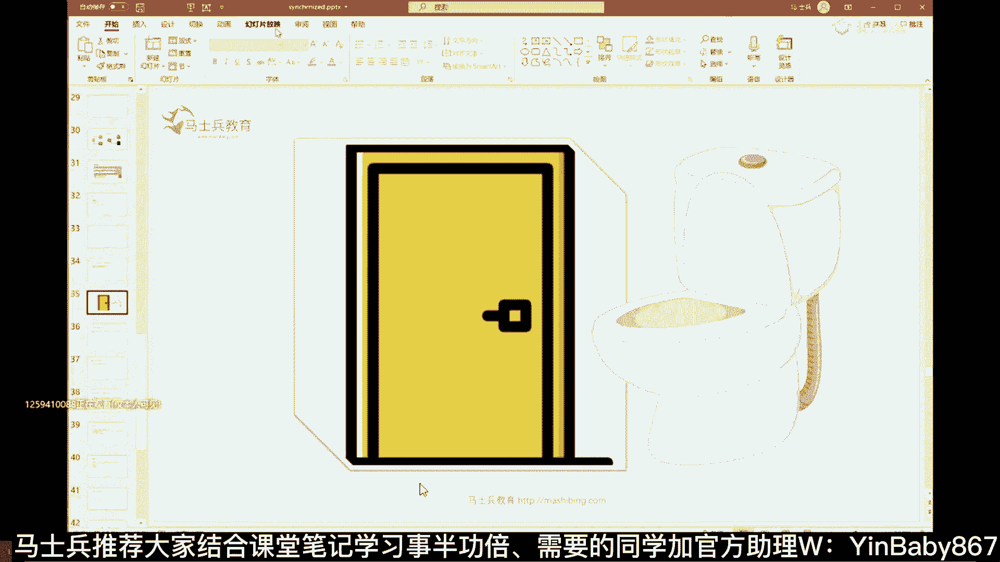

而且我说所谓偏向，我们说所谓重量级锁是啥意思。

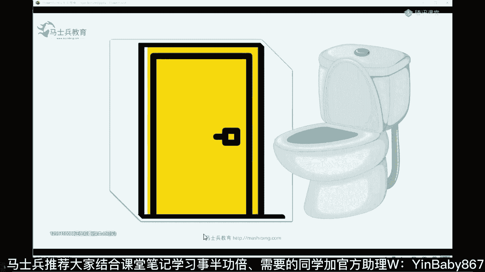

重量级锁的意思是上来二话不说把这锁定，然后进去进去里头干活，那么呃自旋锁的意思是看见被别人锁了，我就自己在这转圈，那么偏向锁是什么意思呢，记住偏向锁是应用于第一个线程，仔细听认真听，先把这结论给记住。

所谓偏向是应用于第一个线程，比如说第一个过来的人，他上的这把锁偏向锁，严格来讲，偏向锁不是一把锁，他就是一个标签，好好听我说，比如说有一哥们过来了，西门吹雪，他第一个过来，所谓给门上锁。

就是把他的名字直接贴在上面，上书四个大字，西门吹雪，好了，这个东西就叫偏向所有同学说老师好简单啊，这个东西你还你还把它搞得那么复杂干啥，其实很简单，我们说通过专业角度来讲呢，就是说第一个县城来了之后。

把自己的线程id记录在对象的脑袋上，Object header，我们刚开始最开始讲的那部分object header还记得吗，里面记录的锁信息，就是把自己的线程id记录在脑袋上，说这锁归我了，好吧。

这就这东西叫西门吹雪，但有同学可能就会说了啊。

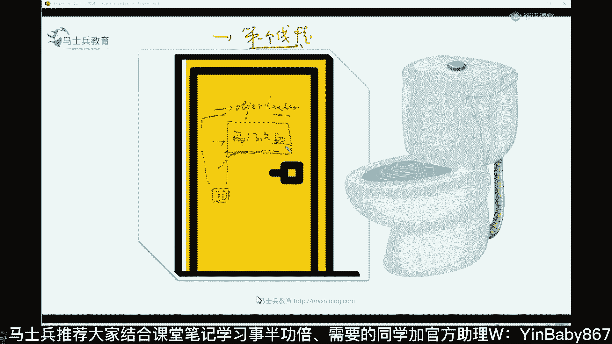

说老师这事儿不对呀，当然这个东西要了解的话呢。

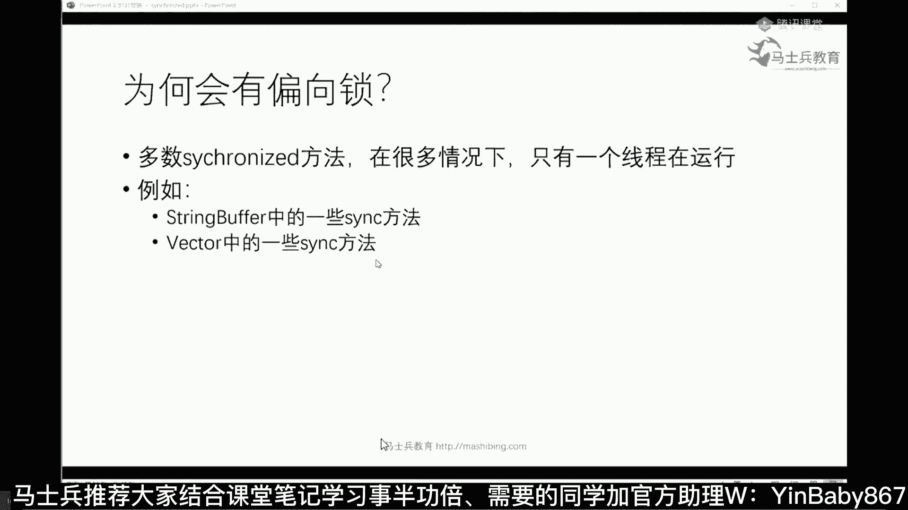

得把这张图给他，你自己抓下来吧，就是所谓的偏向锁呢指的是当前线程指针啊，相当于你把当前线程的id号给记录在脑袋上，好吧，然后呢，他用几位几几位来代表不同的偏向锁的状态，是这意思啊，反正总而言之。

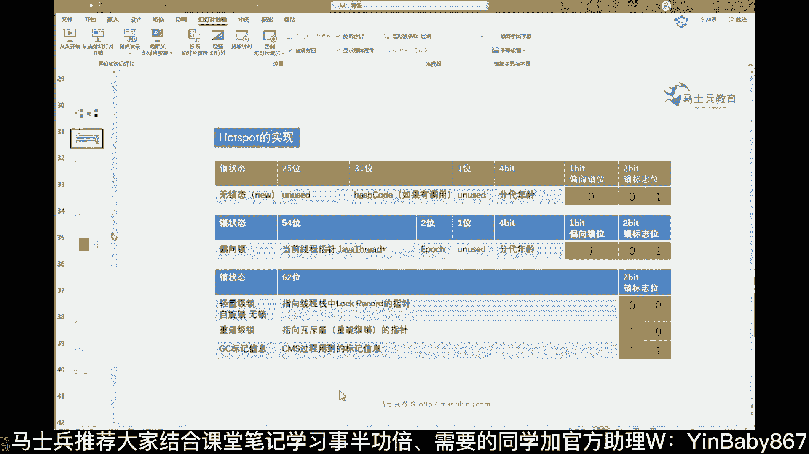

言而总之就是往上一贴就表示这把锁归我了，可是这个时候问题马上就来了，说这把锁归你了，那我后面再来人的时候怎么办，后面再来人的时候，凭什么这把锁归你啊，对不对，上面写着吹吹吹弦，你就你就随便吹啊，马上了。

五成五常大米就来了是吧，我大米还想往上贴呢，对不对，凭什么就归你，那我再来人的时候怎么办，记住再来人的时候撤销偏向锁，把他名字给撕下来层，然后呢，大米过来自旋升级为自旋锁转圈好吧，大米又来了啊。

这个欢乐马又来了是吧，欢乐又来了，大米跟欢乐转圈来，咱俩开始转圈，已经升级为自旋锁了，那我讲到这儿呢，有同学会觉得非常的奇怪，说老师啊，为什么会有偏向锁这个概念，您上来自选不就行了吗，为什么要偏向呢。

同学们听我说啊，就偏向这个概念呢，它设计上比较复杂，而且呢JDK15已经把它废了，比如说JDK15，你要用JDK15以后的偏向锁，这事你就可以把它忘了，因为它太复杂了，它复杂在哪呢，为什么要设计偏向锁。

这个大家还能听吗，还能跟上吗，可以是吗，为什么要设计偏向锁，这是最难理解的，偏向锁为什么要设计它，是因为在大多数的根据工业统计，在大多数的情况下，所谓的上锁那些个方法往往只有一个线程，只有一个线程在用。

啥意思，我给你举个例子。

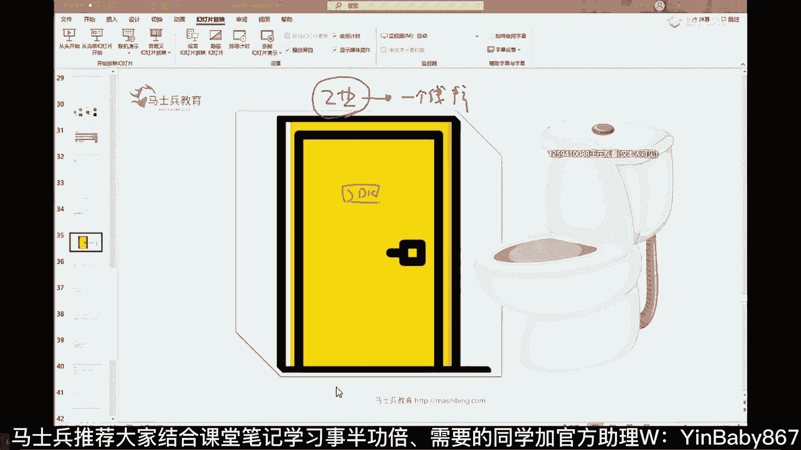

有一些吧，我们那个那个那个累累，你们就算没用，也应该听说过，比如说，Spring offer，这应该听说过，比如说vector，这应该听说过，对不对，好同学们听我讲这些个类呢。

我们点进去看它里面好多好多的方法啊，它里面有好多好多方法，就比如capacity吧，你会发现它的方法本身就是自己就上了锁了，叫synchronized，本身就是synchronized。

Synchronized，对不对，所以当我们用这些个类的时候，就算你自己没上锁，实际上你自然不自然的呢，你已经在应用锁的一些操作了，那现在问题就来了啊，那个真的我们用string buffer的时候。

它会产生锁定征吗，就是好多线程会同时在执行吗，不一定的。

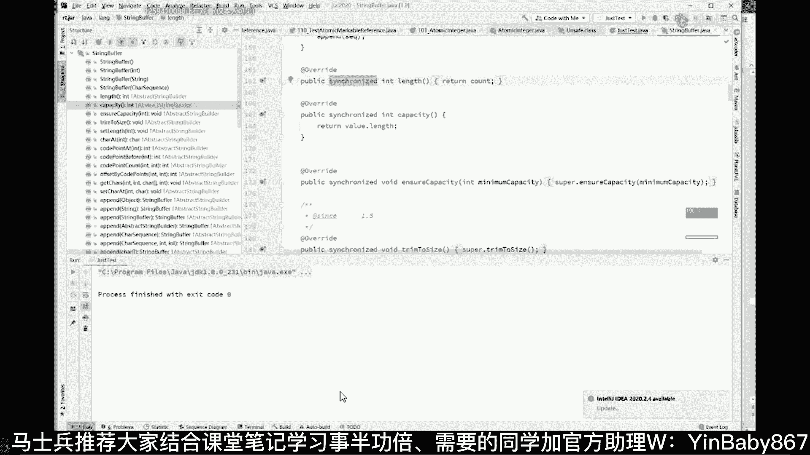

根据工业统计的结果呢是七八十%的时间，记住七八十%的时间，实际上只有一个线程在那里跑，听懂了吗，只有二三十%的时间，是有多线程在那里竞争，那为了这七八十%的时间，您老人家有事没事还上悲观锁，他合适吗。

肯定不合适，所以为了这七八十%的时间，我干脆呢我们就来一个标签锁就行了，你上来二话不说，先贴标签，反正你七八十%的时间，只要看见了标签，就我一个人用，我就不用有所竞争过程了，没有锁竞争了。

就我就不用考虑这个锁竞争过程了，所以设计出来了偏向锁，好偏向锁这概念能get到的老师扣一，10分钟左右，但是我们说偏向锁超级复杂，并不是这么简单的啊，偏向锁本身呢有一个上锁时间，有一个JVM的调优。

有一个锁的撤销，有一个批量所撤销和批量重偏向，这个是面试里面最复杂的一部分，就到这吧好吧，毕竟我们不可能一天一个晚上，把所有的东西全讲完，那也不太可能你也消化不了，cs有哪些应用啊，那个那个那个那个。

为啥叫偏向，因为因为偏向第一个线程啊，我就偏第一个线程，今天还讲不还讲啊，明天我们继续可以吗，嗯嗯掌握了这些是不是可以吊打面试官了，你掌握这些了。

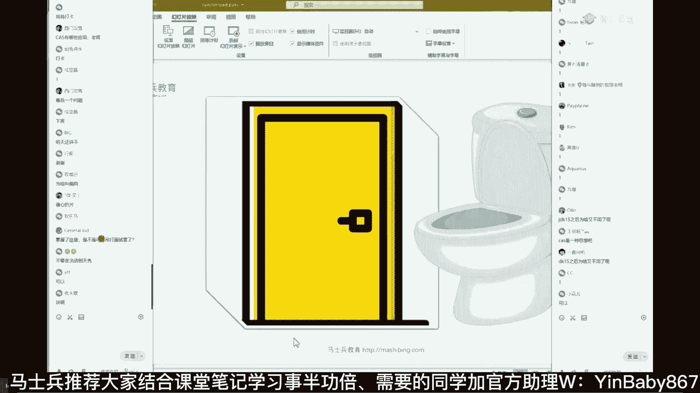

他只要问到这些。