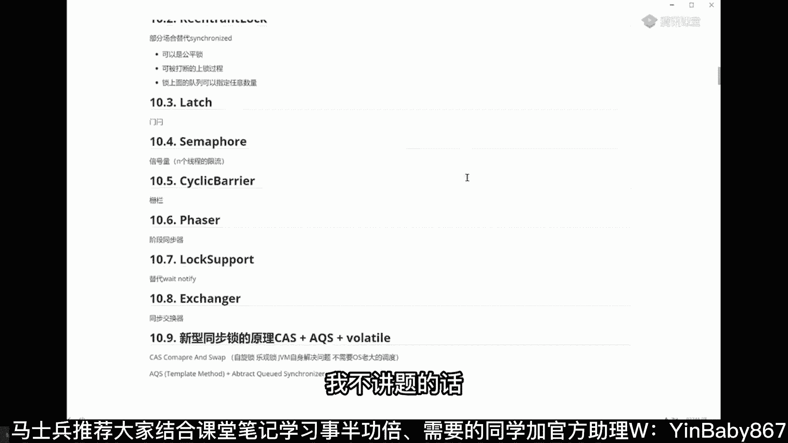
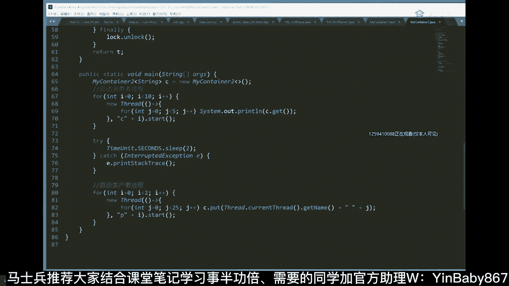
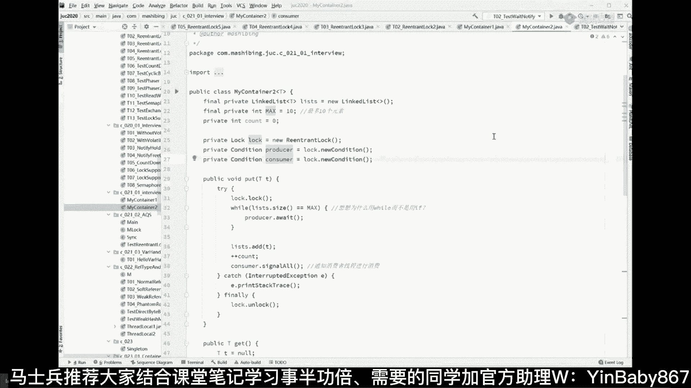

# 系列 5：P26：26、ReentrantLock - 马士兵学堂 - BV1E34y1w773

这样吧，这样讲起来真的就没完了，几点了，九点，降到哪里算哪里好吧，这个reaction log部分场合也可以替代，Synchronized，它是替代什么，它可以做公平锁，他有这么几个特点跟大家说一下。

可以是公平锁，可以是被打断的，可以可被打断的，上锁过程，像原来那个synchronized的，你是打断不了他的，你不可能用interrupt把它给打断，这个是可以被打断的，还有一个呢是，锁上面的队列。

可以指定，任意数量可以指定任意数量嗯，怎么跟你说呢，听我说啊，比如说啊我给你先消化原理，先不先不看这个代码怎么写，代码写起来比较简单，如果是这个这把锁，Ranrolock，如果net是这把锁的话。

L l range lock，那么这个时候呢，你可以指定它在上面有多少个队列，每一个队列呢被我们称之为一个condition，以前很多人讲这个condition的时候，老师在这种条件下怎么样。

在这种条件下怎么样，不要把condition理解为条件，把condition理解为队列，凡是new一个肯定是出来的时候，你就认为他有一个队列就可以了。

reaction lock有各种各样的condition，也就代表着有各种各样的不同的列，每一个condition你自己去new听懂了吗，你可以new好多个的，可以来一个生产者的队列。

可以来一个消费者的队列，可以来一个监管者的队列，计费计计数器的队列对吧，计数的人的队列都可以，那么当你要叫醒某一个的时候，非常简单，你就指定说我要叫醒这个队列的人，我要叫醒这个队列的人。

或者要叫醒这个队列的人，这是他的原理，哎这会儿能get到的，到时候扣个一，公平锁FIFO，你要这么聊，公平锁就太简单了，公平锁我刚才解释半天，结果发现你们理解的还是不对，你要让老师要怎么样。

才能够拎着你耳朵给你灌进去吗，公平锁就进入队列，但是这个队列下一步是不是FIFO，那是简单的调度算法，是有可能被操作系统的调度算法所决定，拎出来的，可能是这个，也可能是这个，也可能是这个。

当然他可以提前排好序，那个就叫FF了啊，但是并不是时间点上的FFO，EQS就完事了，EQS是自己写的调度调度算法了，AQS是JVM自己写的调度算法好了，这是reaction lock。

它本身的一个小含义，那他应该怎么写呢，应该怎么写这件事呢，给大家看代码片段吧，就就就就不去不去解释每个代码的含义了，你看这里啊，代码片段，作为我来说，我有一个reaction lock，与此同时。

我可以new出两个condition来，一个condition producer生产者，一个condition consumer，消费者，new new出来之后呢，put put线程啊。

put方法一般都是生产者用的，往里头put，所以生产者只要是我满了，list size等于max while循环，只要它满了，那你就await就可以了，producer await这种。

这就等同于我们前面所讲的什么东西呢，我前面所讲的O点weight，o weight是什么意思来着，还记得吧，这把锁上的队列，当前线程进入这把锁的队列，Producer weight。

当前线程进入这把锁的生产者队列，我这原装满了之后呢，我就wait了，我就开始往里加，加完了之后呢，Signal all，我加满了，我要叫叫醒消费者，哥们你赶紧去消费啊，signal去消费，消费消费。

Come on，赶紧去消费，好叫醒叫醒消费者，那消费者怎么做呢，消费者一旦空了，进入消费者等待队列，叫醒生产者，赶紧二话不说，快点给我去生产，因为我已经空了好了，同学们。

这个小程序就是解释了一下lock，Reaction，lock的含义，如果你要synchronized写怎么写啊，SYCHRONIZED写起来就得是，我我lock当前对象。

所以this weight这个weight就进入他，就他就没有分的那么细，他就只有一个队列啊，你这么理解就可以了，好嘞，这会儿能get到的老扣一吧，就是ANCHLOCK啊，这logo还有其他其他用法。

但是最主要的最主要的其实就在这，这就是信号量，Major major，你那个该该哪凉快去哪，待会好吧，这跟信号量没有半毛钱关系，这个叫信号量，叫SAMF嗯，锁的自从自从并发诞生以来。

各种锁的概念层出不穷，没有有的人呢把这个叫A所有的人呢，把这个叫B所有的人叫C锁，每个人都想证明自己，我说的这个最具权威性，知道概念是什么意思就OK了好吗，不要去追求细节。

非得说这个概念我就对那个概念我就对，这东西有人叫他便便嗯，有人叫他翔，你非得说叫翔就是对，叫便便就不对嘛，别这样别这样，OK自选所有人叫他无所，你说多讨厌对吧，然后马上就开始有后面有杠精就开始说了。

无锁到底是不是一把锁，就这么无聊，别这样啊，理解理解这东西，然后找一个约定俗成的叫法就行了，你又不是你又不是那个那个那个啊，索命名委员会的是吧，三七王松工作中是不是很少用啊，非大厂。

你要写CROD基本用不着写中间件必须得用，讲道题吧，讲道题吧，我不讲题的话。

很多时候你也理解不了这个锁的含义，讲题之前把这个概念再给大家介绍介绍。

分布式锁是不是更复杂，分布式环境没法用，分布式环境怎么没法用，就是你学死了，你会觉得分布式环境没法用，分布式环境的本质也是说到某一个地方去上锁，上完锁之后把它变成序列化，它的本质也是一样的，没有区别。

理解了锁的本质跟它是分布式还是单机，没有直接的区别，只不过有的人如果让你自己写，你就琢磨琢磨，你就琢磨一件事，如果让你自己写，自己写一把分布式锁，自己写，你会怎么做，找一台机器在上面记录一个数字。

所有的机器都访问了一台机器，把并发搞成一个单点序列搞定，就你不要用中间件，你自己写不就这样吗，所以最早开始的分布式锁就是数据库级别的，数据库里加一条记录不就不就搞定了，每次我要干的时候查这条记录在不在。

搞定了之后把这条记录给删了搞定，所以这东西本质是一样的啊，当然分封锁它的实现上的理论上是这样的，它实际上会稍微复杂一些，因为它要牵扯到各种的可用性，安全性呃，扩展性，把这些都考虑到包，包括性能。

所以呢就诞生了各种各样的方法啊，比如说用数据库的悲观锁，用数据库的乐观锁是吧，数据库相关的，用REDIS的各种锁三或者REDITION的红锁RELOCK，zookeeper的这叫强一致的锁。

这个锁呢叫做弱一致性，这个锁强一强一致性的锁，强调CP的，但是他效率他强一致，一致性高了，并发量肯定低，比JK更好用一些的ETCD是吧，哎也可以，甚至你可以自己写，阿里有阿里有道题。

基本上就是分布式事务吧，那个不能叫分布式锁，相关的，就是总而言之呢，学东西呢从底到向上慢慢的学好吧，先把最基本的概念理清楚了，再去聊这个分布式的，给分布式分布式事务呢大概讲的内容，我们大概讲了六节课。

六节六节整整的大课，所以东西还是比较多的，先把单机版的你先理解透了啊，java博大精深，不不不，这个跟java关系并不大，王松你要这么理解，反而就那个什么了，因为你想啊就锁这个概念本身啊。

他跟语言的关系都不大，你能听懂吗，就是他跟语言的关系都不大，就是其实类似于这样的东西，在C语言里面也有实现，有类库帮他实现了，在其他语言里面也有类库的实现，也有相应的实现，只不过我们在java语言。

你比较熟这个语法而已，从原理上来讲，这东西跟语言关系并不大。

学多了就可以穿起来，也容易理解和记忆。