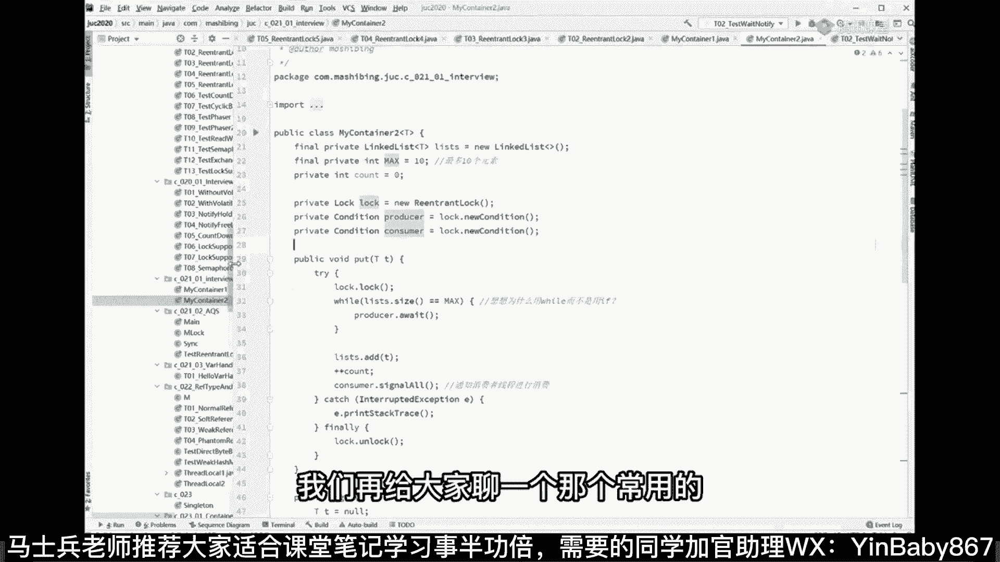
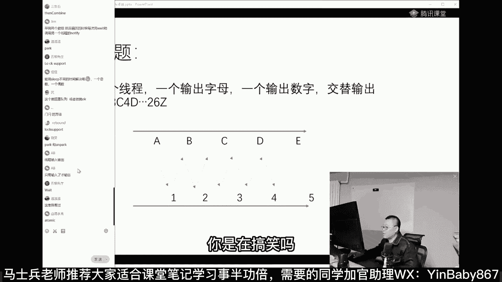
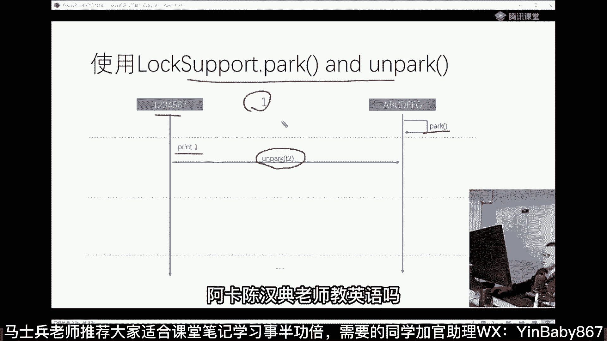
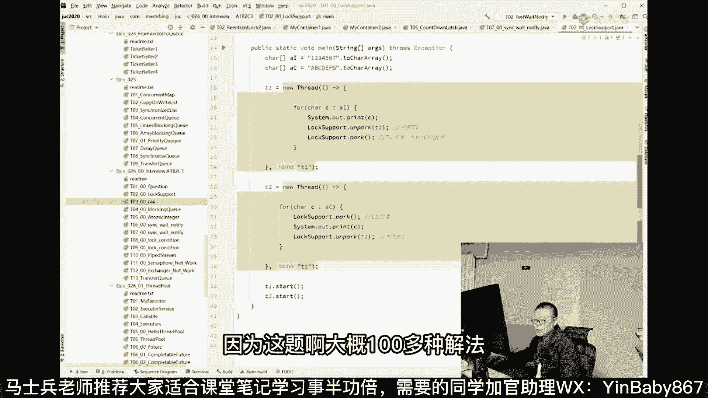
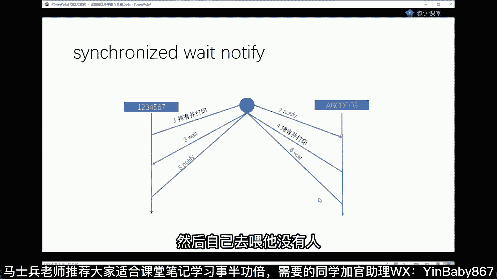

# 系列 5：P27：27、Latch - 马士兵学堂 - BV1E34y1w773

那我们再跟大家聊一个常用的也是比较简单的。

就是这个latch哎，这有点乱码啊，乱码先不去管它了，就是这个LCH，这个LCH叫什么东西呢，叫countdown latch，Countdown latch，常常见的最常用的就是它叫CALLCH。

LCH是什么意思，latch latch叫门栓，就是我在这儿在在在你下面啊，一堆一堆人来了，想打开这个门，想继续啊，想打开门进去冲进去要干啥好，我上面有一个门栓，这个门栓门栓是用来干嘛的呢。

这个门栓上的你可以理解为是一个计数器，这个计数器呢从上往下慢慢数，计数器的初始值是100来一个人给他count down一下，Countdown，count down一下，100-99减一。

再来一线城又counter一下就减二，什么时候减到零了，这个门就开了，这是大概它的含义，理解这个东西呢，我给大家举一个面试题吧。

这面试题呢我原来在也讲过，咱们快速的过啊。

因为这里面实际上是把各种锁呀，各种的这个新的新的新的同步器啊。

你都可以练到，这面试题是这样的啊。

这道题，这道题是线程交替输出的问题。

我们这是阿里。

就是阿里呢他们有时候不考算法。

但是他会考考你县城，县城是比较好的，两个线程啊，一个输出字母，一个数字交替输出。

就是你输出一下，我输出一下，要保证这个东西一定是交替的。

如果正常的情况不做同步的话，就两个线程随意的啊。

我这边输出111~26，另外一输出A到Z，那中间一定是乱的，一定是乱的，而且现在我的要求是，第一个线程输出ABCDE，第二线程12345，必须得是交替的，A1B2C3D4啊，E5。

就是这样这样交替执行的好，这个就是两个线程交替执行的含义，这是他一道面试题嗯，这道题怎么着给他给他点思考时间，简单的把我刚才讲的这些东西，你琢磨琢磨怎么用，好不好。

一点点思考时间，有个三四十秒试试。

wait notify可以解决吧，我跟你说了嘛，这东西实现的功能是用wait notify，Lock，Condition，Lock support，它实现的功能是一样的，实现的功能是一样的。

都可以解决，你你你你你肯定得找那个最优解吗。

用起来最舒服的那个是不是。

compleable future的combine可以吗。

我觉得应该是不太可以的，不信你写写。

Then combine，Then combine。

then combine也不行，因为你理解错了三生石。

你理解错了，你好好琢磨琢磨哪里理解错了。

then combine是新的任务，大哥人家都说的是两个县城。

您老人家那个可说不定那得是52个县城了。

说不定就是52个县城或者县城池里面的，若干个三生石，三生石。

你想的是不对滴，lock support park和on park对你微笑啊。

微笑就想到了微笑。

就是这么个水平高，lock support park和on park。

只有输入了才输出。

你要手工控制啊，人家要求交替输出，你的意思是我手工来。

我敲一下到你了，你是在搞笑吗。

这道题大概有一百一百来种解法，100来种。

牛逼了老哥，你咋就又牛逼了，你为什么老说我牛逼了，我姓马，县城互相传输。

合着我讲半天来，你还是没搞明白我在讲啥。

这个叫现成的同步同步。

叫synchronization，MR公开课吗，Yes，公开课使用pk。

唐湘平，先把单词给拼对了。

pack打包，是因为可以指定唤醒哪个锁吗。

换哪个县城，哎呦喂。

谁让你唤醒锁了。

channel嗯，你的那个这个呃。

小土豆小伙应该是写go语言的啊。

你写啥语言，老师也能给你讲语言。

在老师这就是把不同的刀的区别。

两个condition应该可以，good可以啊，没问题，很对啊，你们你们说的都非常的对。

这道题啊，最早是一道填空题，你知道吗，特别好玩。

最早是一道填空题，填空题呢他最早的最早这道题是什么样子。

我跟你说，这道题最早是一道填空题，填空题呢就是你呢应该你持有这把锁的时候。

是在这里要填notify呀，还是要填weight，填wait啊。

还是要填notify啊等等，我们先说我先说先说比较比较那什么的方式吧。

嗯突然有种降维打击的感觉。

有种被降维打击的感觉，为什么嗯你发生了什么。

你为什么被降维打击，女朋友叫你去，你女朋友叫降维，是你女朋友。

为什么不叫蒋大为，好看这里啊，我们先来聊这种这种方法。

我们来看这个lost park和on park该怎么做啊。

我们两个线程啊，这两个线程1234567ABCDEFG。

第一个线程开始执行的时候是怎么做呢，就是你上来有一个线程。

先让他park自己二话不说，先park懂吗，先让自己暂停。

先让自己暂停，能保证一件什么事，一定是呃，这哥们儿那个等着被唤唤醒了之后，你才可以继续执行吗，而另外一个另外一个线程怎么执行的，另外一个线程就先打印吗，打印个一，他打印完一之后，打印完这个一了。

然后再去unpack t2。

所以这个方法其实是最简单的，只不过原来呢很多人考试的时候。

他不了解这个方法，所以呢他就他就他就写了个特别复杂的，With notify。

体会到了吗，就是你让第二个线程上来，二话不说，先park，等我的第一个线程打印完成之后再调用on park。

而且它能保证你放心。

一定是先打印一，而不是先打印A。

阿卡陈汉典老师教英语吗。

想跟老师学英语，可以教老师，原来在新东方教过英语好，在这里pro one打印完之后在on park第二，然后on pk完了之后，注意on pk完了之后，他自己要立马去干嘛，要立马自己去park。

要让自己去赶紧赶紧赶紧park住这块儿能理解吗，让自己赶紧趴个主嗯，赶紧派个住之后呢，然后另外一个线程打开，他继续往下执行了吗，因为他被叫醒了，继续执行了，打印A打完edge。

打完A之后再叫醒T1。

就这样交替的一步一步地执行，自己在park和这个过程大家能看懂吗，抽烟上来一个线程，先去park，然后再打印一，叫醒刚才被park的线程，自己再去park这边打印完A。

接下来把刚才帕克的都叫醒了。

自己在帕克互相之间这么来回调，嗯来这个过程能get到的，老师扣一，所以这个写法是这样的。

但其实这个写法有一点点小小的bug在里面，比较隐蔽。

今天懒懒懒懒懒得讲了，就这样吧，大概能理解什么意思就OK。

好看这里啊大家写法就是这样的啊，两个线程T1T2T一，第一个线程是打印数字的，然后打印完数字之后呢，挨着盘的从数组里面把数字拿出来打印，打印一个叫醒T2，叫醒T2自己睡去，自己阻塞。

然后T2怎么做呢，T2应该是上来自己先park，先自己park，这样保证一定是T1先执行K。

这写法大概就这样的啊，来这块可以继续吗，没问题吧，两个同时异步跑on帕克的时候，对方不一定帕克怎么办，青色渡鸟，青色渡鸟水平不错啊，这么隐蔽的问题你都能找得出来。

青色渡鸟小伙伴们，新政体体体会一下青色度鸟的问题，然后自己尝试解答一下，两个同时异步跑on park的时候，对方还没帕克的时候怎么办，咳咳对方还没拉呢，你就让他擦屁股怎么办，上来拿纸先擦。

这肯定不合适啊，这块能理解吗，就这哥们还没park呢，你这时候有可能已经掉了on park了，这哥们已经掉了on park了，这个很正常啊，你比方说他就要选T2了，然后这哥们暂停了吗，在这暂停了。

然后T2线程的是打印完之后马上去调on帕克，T1，您这您这会儿还没还没帕克呢，能敏锐的发现这个问题的小伙。

青色渡鸟，你不应该叫青色，你可以写成红色了。

Sleep，我靠我就我就烦，有人说这sleep的，谁要是在现场同步里面玩sleep，你赶紧抽自己的两个，挤好几个大嘴巴子咳。

你知道你要睡眠多长时间吗，你说我睡十秒够了，万一不够呢，你到底要睡多少，谁要是在县城同步里面玩sleep，直接抽自己嘴巴子啊，好听，我说这件事非常的简单。

因为作为咱们正常的上锁解锁一定是lock lock，然后再unlock，但是这个park和on park是可以反过来调用的，你可以调用UNPARK在先，然后他在park。

那么这时候产生的效果会是什么样的呢，产生的效果是这边先调用了on park，然后你再调用park的时候，发现有哥们已经调用了on park，我就park不住，就直接去执行了，这块儿大家能get到吗。

你不要这样地看着我，加什么判断，还有这操作，是的，这就是帕克和on帕克的细节。

嗯好啦，我们就到这吧，好这是最简单的解决方案啊，多次park会计数吗，会的会计数的，on park t2T二，可能空指针。

来你告诉我，你告诉我。

我先把它弄完了，然后再调用的start，你告诉我怎么控制，为啥呢，指令重排了吗，跟指令重排有什么关系，还有孔子真脑子里咋想的，不好意思，看错了，看错就要被怼，在老师的课里，看错就要被怼。

当然你也可以怼我，你要水平够了，我欢迎你怼我，好下一个你看小土豆说下一个好，就听小土豆的，下一个挑几个比较好玩的解法啊，现在09：30讲几个得了，因为这题啊大概100多种解法。

真讲完也没什么意思，有一些就是就是就是属于特别无聊的。

脱了裤子放屁的那种就算了，自旋锁我就不讲了啊。

这手工实现自旋锁就不讲了，好咱们说这个synchronized the weight和notify。

就是最原始的，这也是最原始的解法，Sychronized way，notify应该怎么做。

很简单嘛，就是我首先让线程一启动持有这把锁，注意一定是synchronized这把锁，持有这把锁持有并且打印。

打印完之后就是第一个线程吃掉，并且打印打印了个一嘛。

打印了一，然后打印完之后通知另外一个县城。

哥们儿，你该醒了，或者通知这个锁上的队列。

队列等待的线程该醒了，然后自己一定要去wait，要去释放这把锁，如果你不释放这把锁的话，另外一哥们儿是持有不了，是拿不到这把锁的，所以一定要释放掉它。

Wait，然后这哥们呢第一个线程打印完。

通知完，自己去wait了，第二个线程抢到那把锁。

持有并打印，Notify，自己去wait。

就这么一步一步一步一步能看懂吗。

因为锁本身就是个奇数，就很像可重入锁，反过来应该也是可以用的。

辣椒我懒得怼你了，就当你说的对。

我看所本身不是技术，所本身的实现是一个lock record，放在县城站里面。

好了好了，咱们这个就扯的太太太深了。

来看这里，可以先wait和notify对，问题就在于你不可以先notify再去wait，On park，那个有可能没有帕克是怎么解决的，那是你那这个很简单，就是出bug了，你自己重新写。

那最后是不是要finally。

你在说啥，如果描述不清楚代码问题的。

就直接拿代码描述，不要拿嘴描述。

嗯拿嘴描述出一个代码问题，一个技术问题是很需要技术的。

你要是有这个能力的话，你的技术可以很弱，只要面试比较强就行好这个写法也比较简单。

大体的算法应该大家都知道，我们来看看这件事怎么写。

Synchronized we notify，就是无非就这么玩吗，仔细看，这是第一个线程呃，打印数字，打印完之后叫醒另外的线程自己去wait。

那第二个线程呢就是打印数字，叫醒另外的现场，自己去wait，两个县城都一样搞定嗯，这块不知道大家听清楚没有，然后这里面有几个，为什么说它原来叫填空题，因为他原来把这个地给空掉，让你填空。

这里面要填什么呀，是填到TIFY呀，还是弄一个O啊，还是wait啊，OK这里面最容易犯的问题就在于，这两句话能不能换位置。

再说一遍，这两句话能不能够换位置，思考一下好吗，那个，我们我们先说第一个问题啊，刚才那小伙被怼的那小伙叫啥来着，忘了欧点weight o点，Notify，这哥俩能不能换位置，琢磨一下能换吗。

这肯定不能换啊，大哥wait是几个意思啊，wait是几个意思，我想我想问你，wait的意思是，我进入等待队列，等着别人唤醒我，我才能继续往下执行，您老人家先把自己给wait了，先把自己给干死。

然后再去想着去干别人，先把自己砍死，再把敌人砍死，哈哈你跟你跟你跟你跟李冰冰有一拼啊，铁锅炖自己对好，这块这块能知道了是吧。

这块肯定是不行的，这块肯定是不行的，这是这是这是第一个问题啊，第二个容易出错的点在哪里呢，在这就是当循环结束的时候，当循环结束的时候。

看仔细看，当循环结束的时候，为什么还要在这里加一个notify，跑一下。

来虽然它是1A2B3C4D五，什么什么来输出的，看到了吗，但是呢他不结束，你发现没有不结束，琢磨琢磨，为什么我们琢磨一下嘛，按照这张图来说。

我叫醒你去自己喂它，我叫醒你自己喂它。

叫醒你自己喂它，总有一个线程也可能是A也可能是B叫醒了。

最后对方最后一次，然后自己去wait。

没有人再也没有人叫醒他了，因为这哥们已经结束了。

死锁之弦呀，哎呀让我说你啥，这跟死锁有半毛钱关系吗，他就是有一个县城，最后在那里，Wait。

没人叫醒了，所以你要想让县城正常结束的话。

在你循环结束之后，一定要加一个O点，notify或者all，查一下正常结束，顺利输出，正常结束了，同学们这块没问题的，老师扣个一，大家都明白，Synchronized with notify。

怎么玩了是吧，有问题你直接提啊，为什么wait notify都是O小深红，你是半截单进来的吗，合着我讲半天白讲了，这是这个学到了啊，之前面试手写没考虑过，这个也过了，利用对算你运气好。

你说这个程序相对来说比较简单的嗯。

那个我们说这里面还有一个隐含的小bug小问题。

假如我要求你数字必须先输出，或者字母必须先输出。

