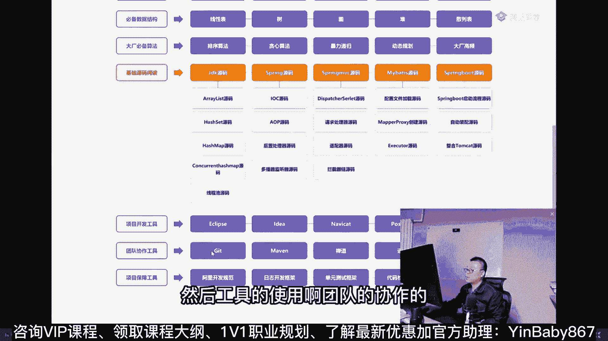
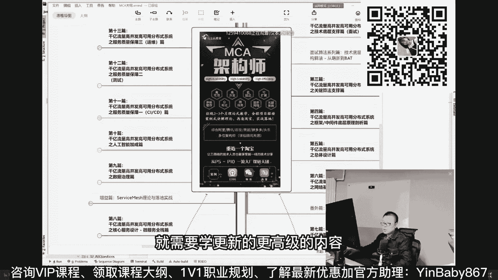
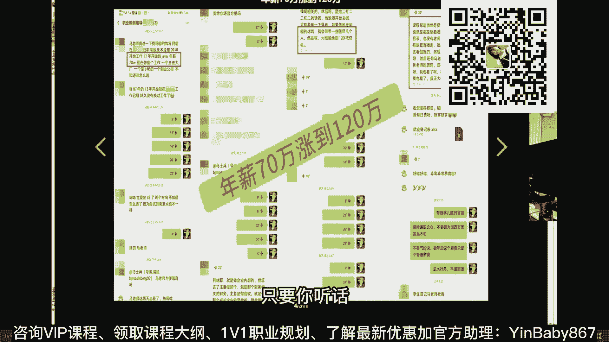
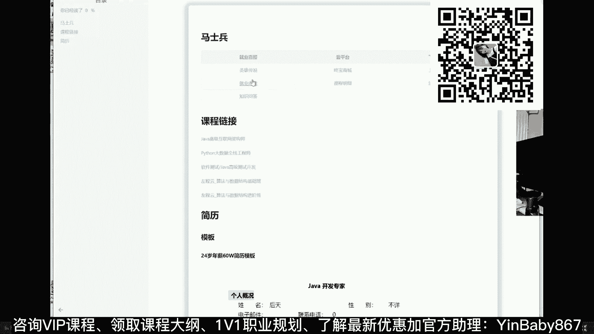
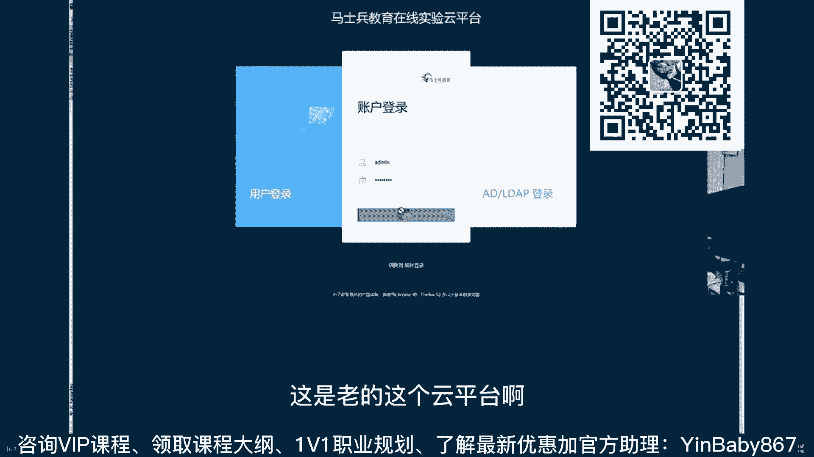
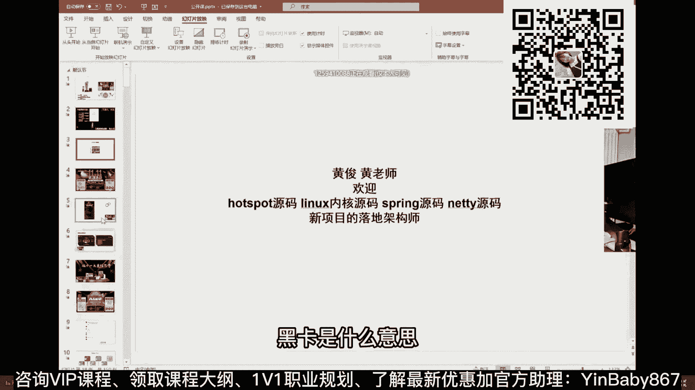
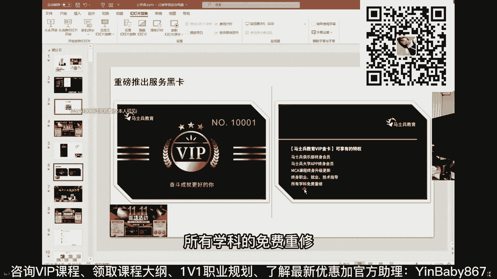

# 系列 5：P28：28、从独占走向部分占有，Semaphore实现线程的N个共占 - 马士兵学堂 - BV1E34y1w773

这个小程序呢基本上就没什么问题了，但是呢这里面有个哪个线程先启动的问题，它有可能是先执行的数字，也有可能先执行的字母，你怎么控制这两个线程的先后顺序，启动的先后顺序，你怎么控制。

怎么控制这两个线程的先后顺序，启动的前后顺序怎么，来个十天的，我刚才给你看这个聊天记录了吗，这个聊天记录的第一次，我给他做规划的时候是10月31号，提前wait，提前wait可以，这个是是一种方式啊。

这个an an o a NO o d a NO可以啊，提前wait就是有一个呢先wait一下，然后notify再继续可以，但写起来比较恶心，比较麻烦，写个变量做判断，写个变量做判断，小强啊。

哎不是小强啊，Skating，写个写个变量做判断，你在你在搞啥，你那个变量要不要加同步，你怎么着，你再来一同步，知道吧，同步两个对象的时候就容易产生死锁了，好这里可以用到什么呢。

可以用到CALLCHLCH，还记得那个latch是什么含义来着吗，的含义是有一个门栓，这一道门门栓上有个计数器是吧，哎我这个计数器呢给他写了个一，我让第一个线程上来之后。

先await wait的含义是这个门关死，门栓的上面写了个一，一变成零程序继续往下执行，听懂了吗，这个也是可以做的，Ok let await，第一个线程现在现在上来，先await。

那什么时候这个门栓继续往下执行呢，所以第一个线程执行到这里就先暂停了，他不会输出的好，第二个线程是这样做的，当他输出了数字之后，让这个门栓充当输出完数字才让他count down，那么你仔细琢磨一下。

我，我肯定是第二个线程先输出，输出完了之后，第一个线程才会继续往下运行，才会输出，五天A来这块能get到的倒可以，所以门栓的含义就大多数是用在这种语境上，就是到某一个点上，我必须暂停，嗯说到这儿呢。

我们就说一点那什么吧，嗯比如阿里有一道面试题，有一个很大的任务，AA任务分解成为A1A2A三，A 4a5 a 6a n，那么形象化的理解你可以这么理解，我要吃火锅好，我这是我的总任务。

我要派一个县城去买肉买菜买油买锅买柴火，那么这个时候我怎么去等待这些现成的结束，然后我烧好火锅之后跟着等着，等完了之后才能继续，怎么等待这些线程的结束呢，有一种方式还记得吗，叫join，Join。

Join，这种方式也可以，也没问题，但是你得挨着盘子去join，你不如在这里设一个门栓，在这里设拴住，这里记录这个数字，五，这个线程结束了，正常结束了，calm down变成四，这个线程结束了，变成三。

变成二，变成一，变成零的时候，说明所有线程正常结束，来火锅开动，Calm down，calm down lash经常被用作等待线程结束，你看波澜不惊多牛叉，我给他讲A他永远都是找我要币啊。

这些例子太平常了，有没有企业级的线程池运用累，每个人的水平不一样，波澜不惊的水平应该相对高，我希望相对高的同学们照顾一下，咱们零基础的这堂课，我第一次上来，我就先讲了。

今天我们主要讲应用级别比较简单的东西有，但不是这堂课讲VIP课里全有，线程池，我需要你了解基本的同步机制，我需要你了解同步队列，需要你了解手工创建，需要你了解各种各样不同类型的线程池。

我们才能聊企业级到底怎么用，洗衣机的用法，用的最多的scheduled fork join，以及非常普通的手工定义线程池，我跟你说啊，也跟大家说一下，就是很多时候是这样子的。

在一个多线程这个这个东西用的最多的地方，其实还不是企业级，其实还不是企业级，是什么呢，是那个那个那个那个就是面试啊，我告诉你前天就被灭了，这道题最后给了21KCML啊，张保伦真的是这样的吗，没关系啊。

咱们我们整体的班型呢，现在又是从零基础开始的呃，你像整体版型现在做的越来越越那什么了啊，你像入门性的基必备知识从哪开始讲啊，硬件的基础，windows命令行的基础虚拟机怎么安装，二进制是什么东西。

另一个常用命令怎么做，JAVS的基础是吧，嗯基础的核心面向对象集合等等嗯，MYSQL的基本的语法，前端的后端的设计的，然后那个呃基本的数据结构的，基本的算法的贪心和暴力递归呢，整理之中包括动态规划呃。

源码的解读的，然后工具的使用啊，团队的协作的项目的保障呢。

还有呢过相关的项目，这个大概就是一个零基础的课程了，所以你没有关系啊，就算你零基础跟着老师踏踏实实走，涨个薪水也跟玩似了啊，用对方法仨月足够看这里啊，这个就是门栓所常用的一些地方，好吧，好嘞嗯。

这是这道题呢，就是原来特别正统的解法，当然还有其他解法啊，还有一些其他的解法，这个图能发下吗，看下课程呃，这个图是目前整理了入门级别的了，我们进阶级的正在整理的过程中，就是原来我就是这样的啊。

就是原来的老图呢是这样的一张图，从P5开始，P5你应该掌握哪些，P6应该掌握哪些，他不是这张图不好看吗，所以我们就换了一种展现形式，这也是课程的升级之一吧，P7应该掌握哪些，P8应该掌握哪些嗯。

对整体各种细节的东西进行了分析，但是这个里面的组织的不是特别好，就是没有侧重点，然后详细的点呢并没有专门列出来，所以我们专门又组织了另外一种展现形式，听懂了吧，呃稍等两天，直接就在网页上了。

你就可以看了，好，那怎么成为VIP，你手里加小姐姐了吗，去报名，我再跟大家说一下，做好规划这件事超级重要，现在11月份，明年的金三银四，大概还有半年，半年时间，是足以让你达到P6P7的技术要求的。

听懂了吗，技术要求一定没问题，但是时间再短，你就只能走捷径，走捷径的成功率就没那么高了，像这种的成功率超级高，呃，我们课程的我要我要帮他做完规划啊，大概你说大二大三的学生，如果你是二本以上。

差不多基本上90%，我送你进大厂了，大二大三，因为你有一年的时间跟我们练，那太充足了，但是到大四呢，你基本上就只剩半年半年时间给我们练的话，这个概率就要低一些，一到3年概率会更低，这个时候玩7+1加一。

这个时候玩6+1，这个时候必须得玩6+2了，这个就要难好多，还有因为加项目必须得加项目对项目的理解，而你原来项目不给力，做背调，你还就完蛋了，好三到5年这块要玩的东西就比较多，八到10+2了。

因为这个东西除了项目，各种软性的东西就全来了，这个时候你必须得是P7了，像这种的基本上就是P6嘛，相对简单的多，像这种都是P5哇，太简单了，对我来说太轻松了，我强烈建议你这个时候你如果是这批人。

抓紧时间过来，好，以工作加大专呢，大专生看个简历吧，我们自己的一个简历简历，自己学生的简历啊，呃这小伙原来是做游戏后端的，他游戏后端的主城呢，大概的月薪应该是3万多到4万左右，是到到头了。

就嗯这哥们跳完互联网之后呢，他原来是拿3万5，然后跳互联网之后拿60万到70万，年薪大概5万5万到5万多，5万到5万5，我们课程呢我一会给你介绍一下，你就知道啊，就课程里面的这些东西，他就写了五条。

五条足以涵盖5年以下开发管理经验，负责项目日活300万，注册人数1。3亿，夸张了，不过没有关系，无所谓，游戏嘛对于构建高吞吐，低延迟分布式架构有分有分布经验，那么这块主要是什么内容呢，这块主要是指的。

我们的那个整体课程架构里面的，P7级别到P8级别的课，打开来瞅一简单的，就是这块呢主要就是指的是这部分的课了，分布式全体的理论，加上呢整个分布式的落地实践嗯，比如这个分布式id的中心怎么搭是吧。

然后配置中心锁集群事务集群，各种各样的集群，网关E的服务器，搜索集群，查查dB的这种分布式调度是吧，tan群MYSQL的集群等等，就是他指的是这部分了，好吧嗯，简单分的话，这部分30万到70万。

这部分是30万到70万的项目啊，这部分是30万到70万的项目，怎么做推荐系统，做画像怎么做那个spring cloud的地呃，怎么做蓝绿发布，灰度发布啊，怎么做ab测算等等，怎么做。

这个分分分分分分布事务的解决方案，到底应该怎么做，t cc的方案啊，LCN的方案，然后那个呃theta的各种解决方案，最大努力通知方案，A方案，事务消息方案等等都可以，就是加成项目吧。

就是基础的理论知识啊，加上项目，我今天给大家讲的，大概就是整个高层体系中的一门课吧，一门课里面的一小部分都按照高并发，这是第一版的第一版内容，这是第一版内容，因为他第一版的每个有两到三个小时的课。

特别长，所以我第二版就更新了一下，把那个细节的内容，把好多东西加上了，把好东西讲细了嗯，这两个拿下30万到70万，然后再想往上高，就是这个MCA架构师，从架构师的理论一直到落地，一会儿你要有兴趣。

我就给你详细解释解释啊，全国大概课程最多的课，课程最深的课，课程最长的课，又长又粗又深，如果找到比我们更长的更深的，这课可以免费送，你没有能做到这一点的，主要原因是因为舍得请人。

我们有20多位一线大厂的老师讲一门课，这也是很多机构都做不到的，好吧嗯，OK不说了，就这哥们大概是大专吗，27岁转过来运维60万到70万，融360，好嘞那个技术技术技术技术的聊两句，因为我还没聊完啊。

感觉呃，这因为这种这种的各种各样好玩的，解决方案也有特别多，像这种叫pp stream这种线程之间直接弄一根管道，互相通信的也有，用blocking cube也可以实现啊。

用atomic energy也可以实现，也没问题，用那个那个那个呃EXCHANGER就实际上实现不了，用SAMF得用两个SAMFA，用一个也实现不了嗯，说到线程池。

线程池是需要聊到那个那个刚才说到线程池，线程池是需要聊到这种消息队列的，任务队列，任务队列，那任务队列呢我给你讲个比较好玩的，就是你可以考虑用任务队列来实现这个事，这是一个非常好玩的解决方案。

这个呢是非常好玩的解决方案，来看这里看这里，我们讲最后一种解决方案吧，好不好，最后一种解决方案，然后我给大家介绍课程，OK介绍课程，介绍课也没关系啊，你也可以说一下你的情况，我帮你做一些职业上的规划。

也可以，来看这里，这个这个是特别好玩的一个解决方案，这个方案用到了一个任务队列，任务队列有好多好多种，从数据结构角度讲，有数组有链表，有各种各样的容器，有哈希表，那么呃从那个阻塞非阻塞的角度讲。

有阻塞有同步的，有非同步的啊，听说有带权重的，不带权重的这种的这种的队列呢非常的多，要想透彻理解线程池，就是任务队列这块必须得理解，理解到位才可以呃，所以它是有优先级的，刚才有同学想说说线程池。

我今天要给你讲，到线程池就得把任务队列给你讲完，但是我们可以聊一个比较好玩的队列，这个队列呢叫做transfer to transfer you，你们还在认真听吗，还在认真听老师扣个一，Good。

OK好好听我说啊，这个trans的Q是一个特别好玩的Q，他是个队列，队列呢就是个容器，记住这是个容器，好这个transfer呢它是一个非常好玩的容器，你可以认为它是一个，他是一个必须往里头装的东西。

伸着手扔进去，必须等人拿走，往里装的手才能出来，就是怎么说呢，你可以认为它是一个容量为零的队列，容量为零的意思不是说你真的装不了东西，而是说你装进去东西之后，像原来啊我们装一个往里队列里扔个东西的。

这个县城，往里头扔个馒头啊，扔坨便便，你总是扔进去之后，我就不管了，我就走了，我该干嘛，该跟学生继续扔，但是这个队列transfer transfer cute，它的好玩的地方在于。

你往里头扔了这坨便便，必须得等着收份工给他收走，你往里头扔个馒头，必须得等人拿走，把它吃了，你才能够这个线程才能离开，才能继续往下运行，所以它自带自带阻塞的功能，这是他的队列比较好玩的地方。

叫transfer cue，这个Q啊，也是这个队列呢，也是理解线程池非常重要的一环，线程池里面有一些常见的线程池，就是用它来实现的，我想有一个任务扔到我县城池里之后，必须得有人替我执行了，我才我才放心。

用什么，这叫可靠吗，不是说消息消息队列的时候也需要研究可靠吗，一定要这个消息被消费掉了，这个东西可以理解为和这个类比的，来这边能听懂的了，扣一。

LEON和那个县城池synchronized q是一个东西吗，线程池里面的synchronized q是通用的叫法，这是同步队列之一，嗯好可靠，这可靠这件事呢，当然他跟那个我们普通的说的消息队。

Rock mq rubim q，然后active卡夫卡不不不是那个意思，好这里的可靠呢是另外一种可靠，就是说我这县城只有等别人消费完了，我才能继续往下执行，你不你不给我消费，我就不走。

好这个队列呢有一种方法叫take take的，意思是伸着手往里头拿东西，比如说这个队列里面如果空了，如果这里面没东西了，那么你这个伸进去的手是不会出来的，我必须伸进手去，必须拿着东西我才会走。

这是消费者，而另外一个呢叫TRANSF，transfer的意思是，我必须有另外一只手，把这个东西给他传递进去了，而且另外一只手拿走了我这个线程才能继续，所以它自带同步功能，那这事就不好玩了。

好玩的地方在于什么呢，好玩的地方在于注意看我有两个线程，第一个线程我会把我的字母传进这个队列里，或者叫传进这个容器里传进去，这是那个容器，我会把我的字母传进去，C传进去是被谁拿走了。

被另外一个县城拿走了，被T1线程拿走了，T2先把字母传进去，被T1线程拿走，T1线程take拿到了这个字母之后，直接打印诶，结果你发现非常好玩，本来应该打印数字的，它是从队列里把这个东西给拿出来。

拿出来之后打印的是字母，而本来应该打印字母的，他拿到的反而是数字，就互相之间把我该有的东西，我把馒头递给你，你把萝卜递给我，你去打印馒头，帮我打印馒头，我来帮你打印萝卜，这叫它好玩的地方。

比较吊诡的地方，你们如果到过内蒙古的集市，到过新疆的集市，你会发现在卖羊卖骆驼的时候，都有一个套管，一根管子套在两个人的袖子上，然后大家伙两只手伸进去，我出两毛不行，攥住你的两毛五，我出一毛五好。

必须把这个手递手的递过去，程序才能继续往下运行，好玩的地方，T2放进去直接拿出来，拿不出来，没有这个方法，只能穿法，没有往外拿，这是比较好玩的一个啊，挺好玩的，当然还有其他各种各样的解决方案。

你可以自己去琢磨琢磨，怎么交替呢，还没意识到怎么交替啊，我这个县城把它扔进去，你没有拿走之前，没有拿走之前，是我是不会继续往下的，能听懂吗，我是不是得交过去之后，你就直接就直接把它打印了吗。

take可以认为这个take和这个同时执行的开，只有我这个打印完了tag之后，我才会给你传另外一个，所以你放心你，你在你在哪等你，你先把把你的传给我，你在等着我再传给你。

这个过程一定不会前后有有有交换啊，所以他就交替执行了呀，这不就交替执行吗，这两个谁先执行的，你拿count down let来控制，我只是省略了这步，谁先执行，有什么关系吗，我刚才不教你，教你了吗。

想控制哪个先执行，Count down li，怎么着还得每个都重新解一遍，嗯好了，回顾回顾我们今天讲的内容啊，今天给大家简单聊一聊，就是因为我我讲课有时候讲的比较深，偏深偏深。

就会发现有小伙伴他这个未必能跟得上，未必能get到，所以呢今天呢实际当中讲课呢，我一般会从那个应用级别的开始慢慢讲，然后慢慢再讲到原理及，应用级别的是吧，我们聊了一下这个什么cs。

什么cs a b AC a s的这种原则性的保障，聊着聊呢，呃比较经典的这种同步机制，就是sychronized with notify，以及他的问题，为什么他会被lock来替代。

为什么会被reaction lock来替代，嗯我们聊聊门栓这玩意儿啊，summer简单说了一下概念，没有聊cliberia FA exchanger，没有专门说，当然其实这些东西都相对简单。

比较难的地方点在于底层实现，底层实现，比如说我刚才说的任务调度算法，你一聊线程一定会聊到任务调度，医疗任务调度比较牛叉的人就开始问，就开始问你cf s，你不信你试试。

然后面算法的基本上就是l r u lo fu，你不信你试试去啊，你不玩不把这个玩通了，想去大场面费劲，就算你面积基本上蒙的成分居多，也可能那个面试官自己就不懂，因为以前是这样的。

有一些面试官他是不是非常专业的程序员吗，别的行转过来的，这个在以前的很长的时间段里头，这个现象是存在的，但我觉得以后会越来越专业啊，以后一定会越来越专业，最开始的时候鱼龙混杂。

后面一定是越专业的人生存能力越强，新星同步锁的原理，这个来不及讲了，就cs跟大家说了，AQS这个就相对相对难好多啊，这是需要你自己去读懂了这些锁的源码之后，这些锁就是用它来实现的，然后再去探究它。

就我在VIP里课里有讲好了，介绍课我刚才说过啊，就是这个整门课呀，我们大概自己是自己，目前是把它分成了大概四个阶段嗯，可以用钱来划分，也可以用职级来划分，我们先聊聊职级的吧，P5职级我我先告诉你啊。

P5P6本质上是同一职级，P5职级是入门级别的应届生，P5，P6职级是说在社会上工作了大概3年以内的，3年以内，3年左右，这个时候进P6最合适的，5年左右要考虑P7，P7这件事相对来说就难好多。

当然你进不去，你也只能拿P6薪水拿上就行，然后呢真正做到无中生有，真正做到对行业有影响，才能到P8，这个比较难，超级难，不过没关系啊，我还我觉得还是那句话，就学东西呢，我们一定要学牛逼的，学有效果的。

雪讲的比较深，比较长，比较多的，学老师比较多的，学老师比较牛的，这样才能够做到降维打击，你懂吗，整个课的效果我一会跟你说，简单说，老师这里的，今天讲的内容叫高成知识体系里面的一部分，一部分课的一小部分。

这部分内容还比较多，段正明白JMMJVM操作系统原理，我不念了，好吧，就这么跟你说，基本上市面上的这种，你看到的那那那那那些常见的这种课，这里全有，而且讲的非常深入，hdp have就是大数据相关的了。

就不说了啊等等这些问的知识点，后来有学员说那个老师知识点呢我够使了，但是我还想积攒项目经验，老师怎么办，八大项目从适合学校学校的学院的级别的，到到到到这种比较高级的啊，到分布式微服务的。

到excel的啊，现在有同学开始落地了，到推荐系统到中台啊，到流式计算，还有其他项目搞定，大概啊，我刚才给大家看到，我们整理出来的入门级别的版本，这部分这部分搞定你差不多0~20，0~25到30P5。

直击这样，这部分这两部分搞定差不多30~70，想往上再涨的时候，就需要学更新的更高级的内容。

这也是需要你你是降维打击啊，要想做到降维打击，学点男的，不要老学女的，这哥们儿是两个月，我让他从55万干到70万嗯，37岁好吧，他原来是做PP的，这哥们儿三个大狗大厂，三个超过700000offer。

要求严格保密，的8月25号报的名，拿了三个70万年包的82万年，报的75万年包的无人车配送，琢磨琢磨哪个公司你应该知道啊，无人车配送吗，这哥们儿原来年薪是七十七十，大概看了咱们的课程之后。

当然他这个本身能力也比较强，然后做查漏补缺，120代人，120万年薪课程的帮助当然挺大啊，一定是比较大，只要你听话就说。

如果说你不信老师，这个就没招了啊，凡是敢给于老师信任的，其实到最后这就是他们的效果好呃，其实到120的讲东西东西就比较多了，我就不会在这里给你一一念了，可以这么说啊，那个从基础到算法到底层的源码嗯。

李老师讲的源码课，现在大概讲了20节课，接近40个小时，spring的源码只讲了一半，还有一半把这一堂源码，一门源码课听懂搞定，你在面试官那里，那就是神，听过的都说好好，然后最重要的想70万到120万。

架构师要能落地，什么叫落地，这个就叫落地，我们搭建自己的私有云平台，在这个平台上搭建几十台机器，上百个节点，撑住千万级并发这样的一个系统架构出来，把这个系统架构搞定，并且能落地，百万年薪向你招手。

这是我们已经开放的云平台，好对不起，他好像是好像是换了换了位置，我们的云平台，云平台在哪里。

坏了是因为他密码忘了，忘了新新的名单都是记录在这里了，看看老的音频单还能用吗，这是老的这个云平台啊。

我们现在是有两套的，在线的这个实验运营平台，一套呢是基于，KVM另外一套是基于容器的，就基于虚拟机的和基于容器的，这是我们老的那套，老的那套应该是在撤了啊，我我我我忘了问我们李老师，那个新的那套在哪里。

就今天就不给大家演示了，就是你呢你会发现可以这么说啊，你在任何地方基本上都找不着，你自己能手工搭建几十台的服务器，说这些节点作为分布式id，这些节点处理分布式事务，这些节点产生分布式锁。

好把这些个所有的有机整合到一起，中间是怎么进行熔断降级，限流监控压测全链路的追踪，把这些个全整合到一起，OK你是架构师，我们才认为你是合格的架构师，所以从入门到入坟，在这里全帮你包含了，最重要还有一点。

还有一个叫黑卡，黑卡是什么东东诶，看这里，就是我们今天的活动黑卡是什么意思。

黑卡是我们俱乐部的终身会员，是我们app的终身会员，是我们MC课程的终身升级版，也就是说以后我们升级你是不用掏钱的，注意我们每年都升级，我们时时刻刻在升级，我们每周讲几十节课。

