# 系列 5：P31：31、spring的增强器的处理postProcessor讲解 - 马士兵学堂 - BV1E34y1w773

好不好好了，来往上收啊，回来之后来紧接着往上写，来往这来我们刚刚说了，刚刚经过我刚刚的讲解之后，我们其实已经把我们对应的XML文件和注解里面，定义的这些bean的定义信息，把它转换成我们的BD对象了。

有了BD对象之后很简单，我可以把对象里面的属性拿出来，通过反射的方式，我可以创建出具体对象，当我把对象创建出来之后，紧跟着下一步我是不是可以去使用对象了对吧，当我的对象使用完成之后，那简哥呢。

我是不是可以去销毁对象了，对啊，这是我们大概的一个流程嘛，基本流程都要这么定了好吧，从我们的创建到使用到销毁这个流程，这个环节能理解吗，你如果这样看起来的话，spring里面的东西其实还是比较简单的。

但是你想spring可能这么简单吗。

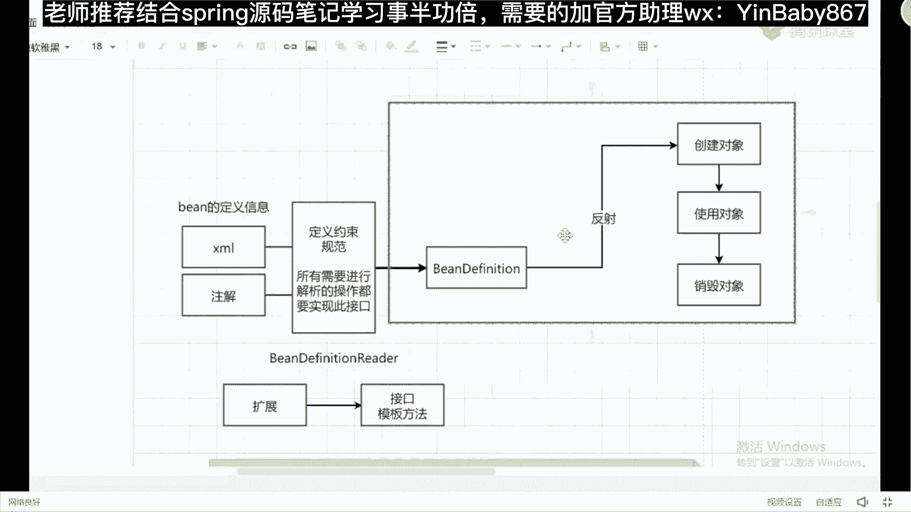

如果你真的看过源码的话，你可以点开它里面的统计，我刷新一下，你可以看一下它里面一共包含多少呢，包含了7000多个类，同学们，7000多java类不可能就完成这么点事啊。

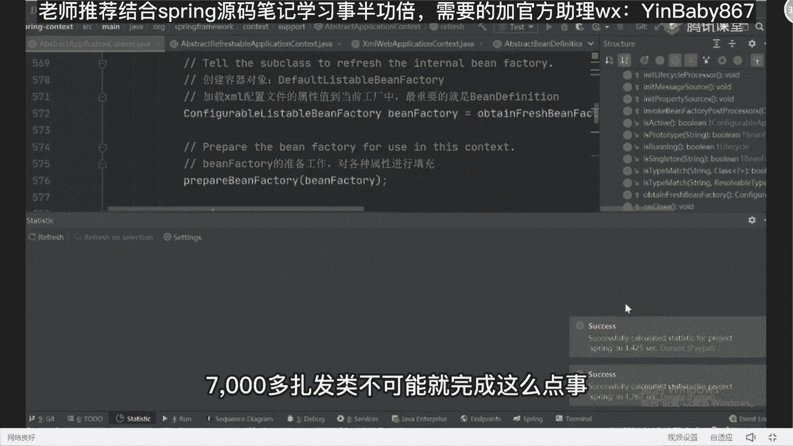

他完成的工作一定很多，我们找一下java费用，你可以搜一下java，1412都累这么多类，对这么多对象，这么多代码，我不可能完成这么简单的事情，所以在框架里面还是那句话，最主要和最核心的是什么。

你要体会的是它里面的扩展性，这个东西，我今天啊不止一次的说过扩展性这些东西了，我希望你能把这三个字给我记到心里面去，因为这东西才是框架，或者说你自研框架的一些核心点，那这样我有什么需要进行扩展的地方吗。

或者说我需要进行什么扩展吗，注意当我们的spring框架它是跟我们的业务无关的，每个人拿到spring框架之后，你可能做比如金融方面的业务，银行方面的业务，保险方面的业务好吧，医疗方面的业务。

各业务点不一样，那意味着不同的项目里面会产生不同的需要，我作为一个跟业务背景无关的一个框架，我如何能够适配到这些所有项目里面去呢，对应着我在框架的某些点里面，我要把它加进去，非常非常多的一些什么扩展点。

让用户可以按照自己的需要去随意的进行扩展，把其随意的进行扩展，这点是很重要的，那这样有什么扩展点呢，来听我讲，我相信很多同学在看源码的时候，多多少少见到过一些类似于这样的描述。

叫post processor文件这个东西吗，什么叫post processor，见过吧，这东西怎么理解，有人把它认为叫后置处理器没问题，后置处理器更多是什么，是直接翻译过来的。

我上课的时候给我们的VIP前兆，我说这东西啊，你最好把它称之为叫增强器，它是用来完成某些扩展功能存在的，那在这个扩展功能里面有两个非常重要，或者说比较著名的接口，哪两个呢。

第一个接口叫be factory post processor，这是第一个，我们只说接口好吧，此类有很多说接口，第二个叫b post processor，这两个是大家见的比较多的。

同时给大家用的比较多的两个接口，那这两个建什么意义呀，或者说他们两个接口有什么区别呀，其实你通过名字你能够发现两个东西的区别，区分点在于什么，他们针对的操作对象是不一样的，这个东西它针对操作象是谁啊。

是不是BBC，好吧，那同样的这个东西呢，看到的是谁。

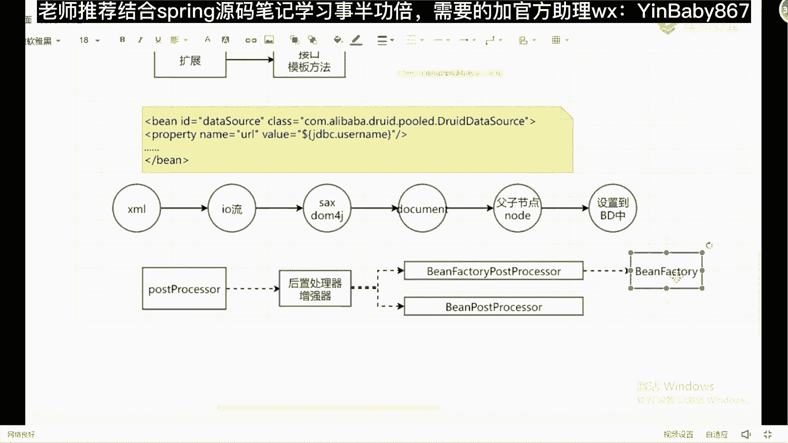

是我们的bean对象，是不是他们两个针对的对象是不一样的，但是不管你针对的东西是什么，最主要的点是什么，都是为了完成某些具体的扩展功能而存在的，这点是不可避免的，当然在这个里面还会有很多对应的扩展。

子类实现，比如说它依然会有些子类，什么子类，我写一下，里面有一个叫bean definition rtory post processor，它也会包含一些子类接口，实现子类接口实现我们就不说了啊。

因为这个子类里面有东西有很多，好吧，我们只说这些最关键的，所以你要知道什么，这两个东西一个叫bean factory post processor，一个叫bean post processor。

这东西我会挨个来给大家聊一下，可以来聊一下，好吧，来先说第一个，谁能给我解释一下什么叫being factory，什么叫bean factory，你们对于bean factory的理解是什么样子的。

谁能告诉我叫兵工厂吗对吧，大家一般人都是这么理解的，叫兵工厂啊，告诉大家，你翻译成兵工厂没问题，没毛病好吧，但是我希望大家看一下，原版里面对于bean factory的一个核心解释。

到底什么叫bean factory，其实并不是大家说的那个兵工厂。

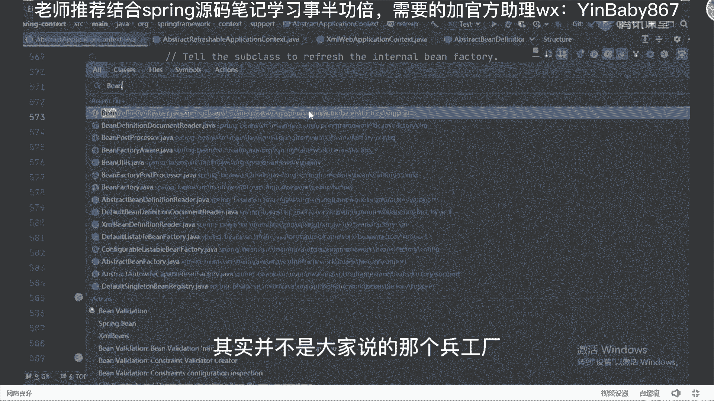

可以来看看，它也是一个接口，再往上翻翻翻翻，翻到这行来翻译一下，The root interface for assessing a spring being container，什么意思。

root interface吗，跟接口干嘛呢，根接口呢用来访问一个spring并容器的根接口，也就是说我如果想访问一个容器的话，必须要通过我们的什么bean factory来进行操作啊。

就好比什么意思啊。

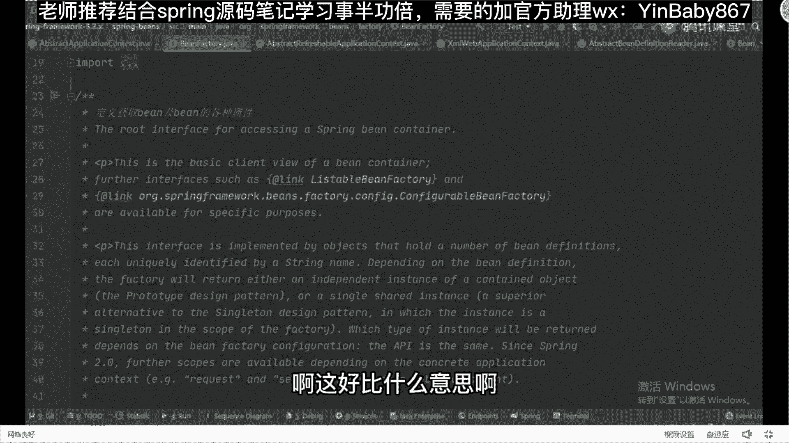

很简单，看好了，我这刚刚画了一个大框，这个大框我说的就是我们的容器，就跟你家的门一样，你家的房间影你家有个房间，你如果想进到这个房间里面去，必须要有门吧，没有门是不是要有个窗户，你才能进得去。

那这块是一个封闭的框子，我是不是也要给到一个对应的出入口，能方便我们对里面的属性进行相关的操作，所以这东西可以理解为什么叫FBATTERY，能理解吗，来能理解吧，给老师扣一，好吧。

那这个同学就会问老师不对，我在平常自己进行使用的时候，我很少会用到bean factory，我用的更多叫什么叫application context，因为我在写代码的时候，我基本上是这样干的。

怎么干的呢，叫contest，第2get bean，比如说里面有个对象叫我写一个person加class，我是这么做的，我通过这样的方式来获取我们的对象的，注意了，这个content是谁。

他翻译过来叫什么，叫application context，它也是一个接口。

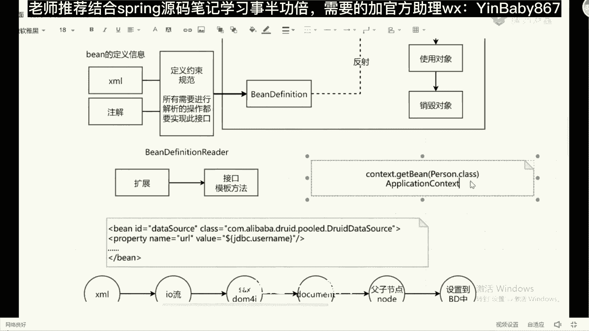

那这个接口和我们的bean factory有什么区别呢，你看一张类图，你知道吗，application你可以把它翻译成上下文，没关系。

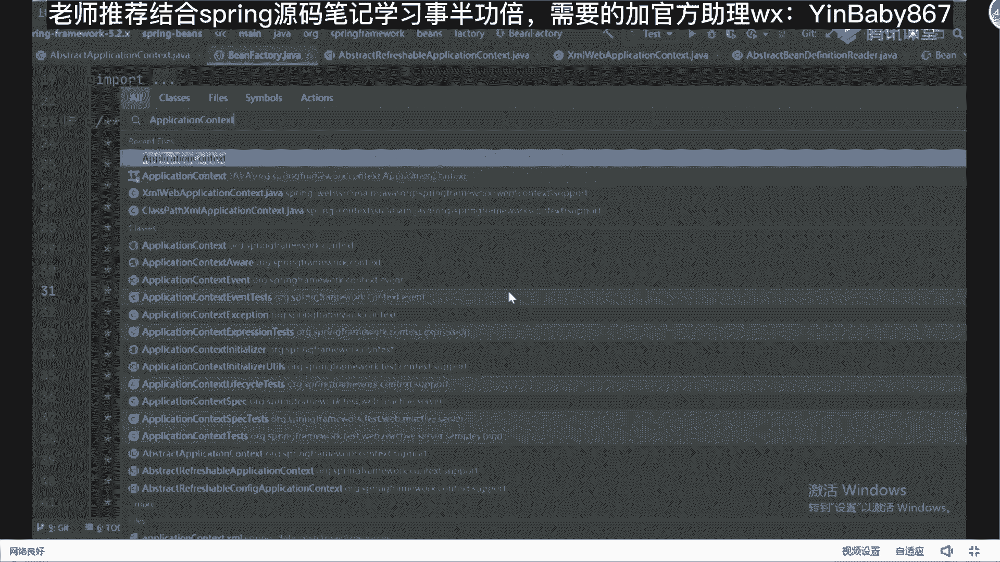

I这个接口你可以看一下这个接口，它诶它的类图标gram，这个东西它继承自定factory，所以并翻译叫什么叫根接口，所有东西，如果你想去获取到容器里面的一些属性也好，方法也属性也好，干嘛也好。

那些属性值也好，你必须要通过bean factory此类实现，只不过我在这些具体子类的时候，我提供了一些更加强大，或者说更加完善的一些功能而已，明白了吗，所以如果我想去敲容器的话。

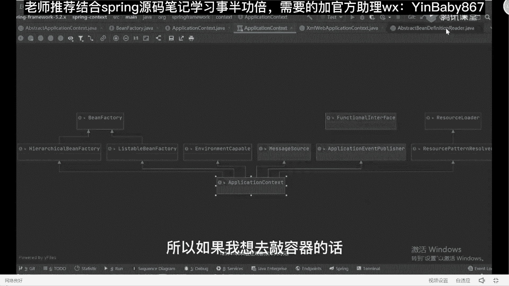

我最应该操作的是谁，是我们的bean factory来关于这个bean factory，能理解吗，所以我会干干什么事，可以证明才行，Bean factory，其实完全可以把它等同于我们当下的这个容器。

因为我操作的时候，容器里面包含了bean definition，包含我们对象，所以这个东西可以等同于我们这的容器，但其实它只是一个访问的根接口而已啊。

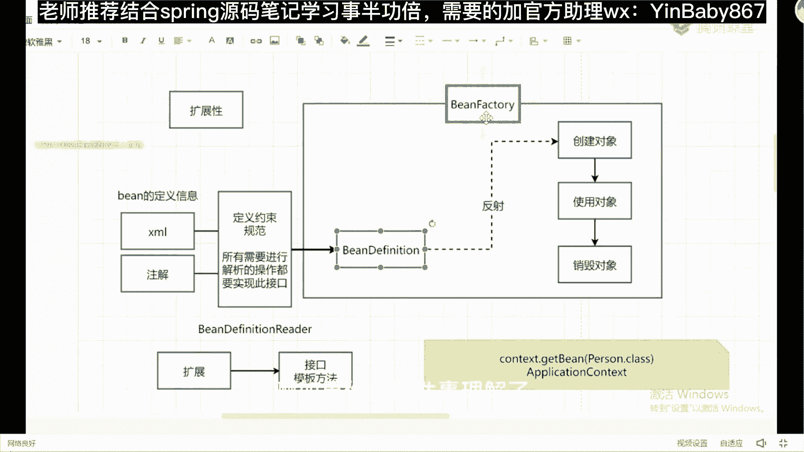

如果你把这件事理解了，那么紧跟着你再看这个接口的下面的这些注释。

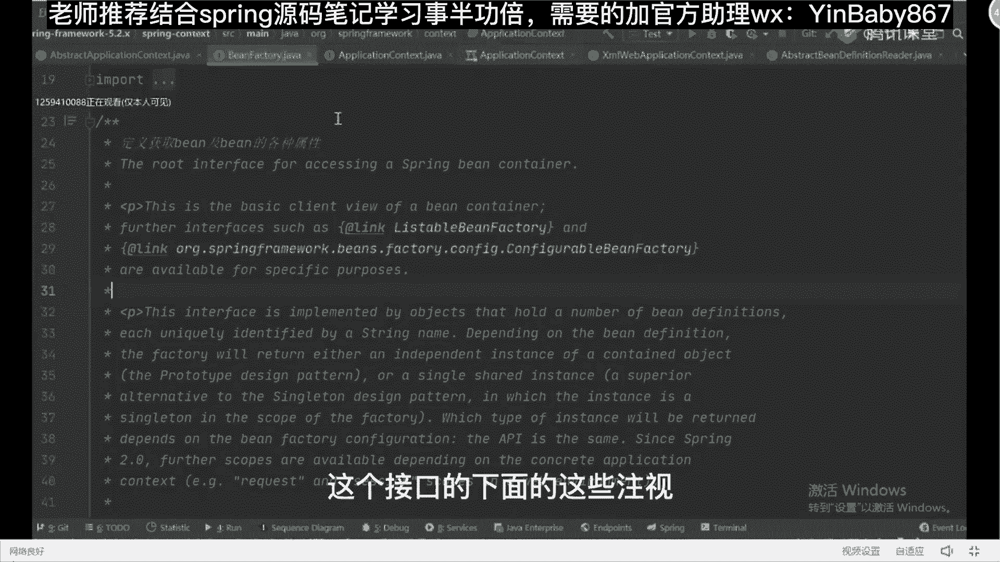

和下面这些翻译的时候，你就会体会到这样一个东西，往下看，说bean factory employment，说bean factory子类实现好吧。

food sport应该支持叫the standard bean lecircle interface，叫标准的bean的生命周期接口，什么意思啊，我的子类实现，必须要尽可能多地支持我的生命周期的接口。

好吧，他们the first set of insulation method，那their standard orders，意思他们这些初始化的方法，结合和他们的标准顺序如下所示。

你告诉我这块里面描述的是啥，描述什么东西，这坨描述啥不就是bean的生命周期吗，明白了吗，所以你们很多人都去网上搜一些，生命周期的东西，用搜吗，源码里面给你写的很详细，你有本事你把这些东西搞清楚。

你自然而然就搞明白了，明白意思吧，所以去看那些注释，它的注释很有意义，明白意思吗，所以你要把这东西搞明白了，OK当然分辨出去，这事一会我会敞开给你聊，不着急好吧，我们先回到这块，当然这个问题之后好了。

下面我就要思考了，那对于bean factory的扩展，我要怎么去扩展呢，很简单，举个例子，我刚刚在写了一个对象，写对象大家应该觉得很特殊，很奇怪，用在什么地方啊。

我这里面的这个property value，我用了一个东西叫dollar gdb c name，实际上我们知道我们在进行配置的时候，一般会引入一个外部的配置文件。

叫dB properties配置文件对吧，这个dB点properties文件里面，包含了我们连接数据库的四个属性，是不是这意思，那我问个问题啊，我们前面从cam文件解析完这些东西之后。

组装到bean definition里面去之后，注意啊，读到里面去之后，这里面的这个属性值会修改吗，会不会改，觉得会扣一，不会的，扣二会改吗，你们想想到底会不会改，肯定不敢骂你，这没必要去改它。

你这只是把原来我们写的tab文件也好，数据也好，完整的把它解决过来就可以了，那下一步我明明就应该开始创建对象了，你告诉我我要在哪去修改，我要从哪个地方去修改，所以在这块的时候。

就会包含了一个非常重要的接口，刚刚说的什么叫BEDEVI，post processor是这改吗，是不是我们可以来做一个验证。

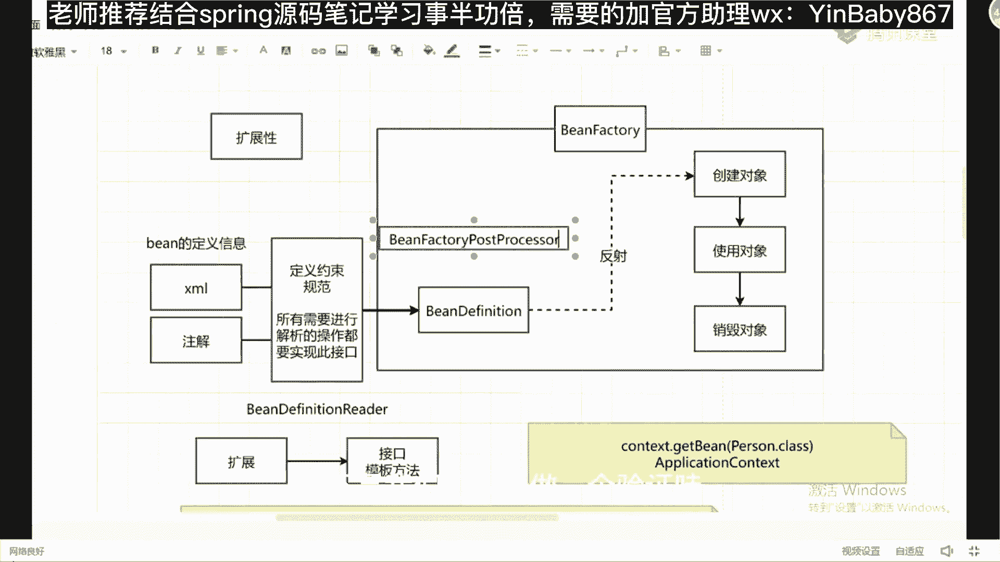

好吧，来思考这个接口叫B。

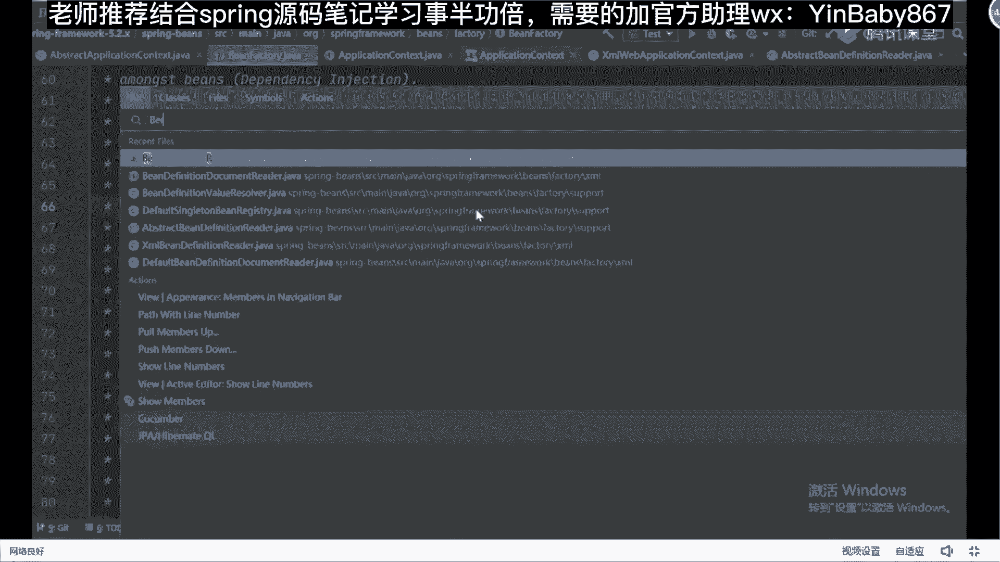

Battery boost processor，对接口在接口里面上面有一定的解释啊，不管它是吧，然后点开它有一堆的实现子类，子类是非常多的，我这不带你拿一个看了好吧，我们直接点进去。

它里面有这样一个实现类，叫police holder configure sport对吧，往上翻上面里面做一件事，看这句话还是看注释好吧，看注释怎么怎么怎么去解释这个类的，跟这个接口。

他说这是一个扑向的基础类，没问题吧，这个图像基础类用来干什么事呢，叫属性资源配置，也就是说它是一个用来进行属性资源配置的，一个基础抽象类啊，那进行什么属性资源配置呢。

大家看叫resolve police holders in the definition，Property value，在B在FINITION里面的，property里面的value里面的单位服务操作。

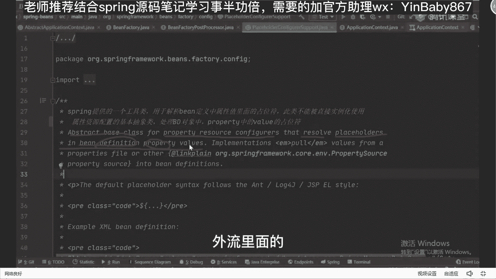

你再看一下刚刚我写的东西，他是在BD里面吧，是在BD的property里面吧，是在bd property里面的value里面吧，我是不是要把这个值进行替换了，刚刚有人问我说，老师为什么要替换你。

下一步就该对象创建了，创建完对象之后，紧跟着干嘛了，该那个属性值的设置了，你不能把这个属性值设置进去啊，所以只能在哪做，只能在bean factory post processor里面做事。

能一同学给他扣一，能理解吗，当然这块你可以写很多个，按照你的业务需要，你可以写很多个，你想写多少写多少个，就有人会说老师你说的是真的吗，是不是真的，我们完全可以来做一个验证哦，我给你验证一下这个事儿。

为什么不在创建对象里面做，创建对象属于JVM里面的东西呢，你一个属性值得替换，要放到JVM里面做吗，就跟你出去玩一样，你出去玩的时候，你告诉我你要不要提前做一些准备工作，什么时候带好。

你把一些一些吃的喝的带好，这不是一样的吗，我要提前把这些属性做好吗，是不是意思，你不做好这个准备工作，你怎么去做做事情呢，就这意思，所以非常简单，你要把这个东西搞明白了。

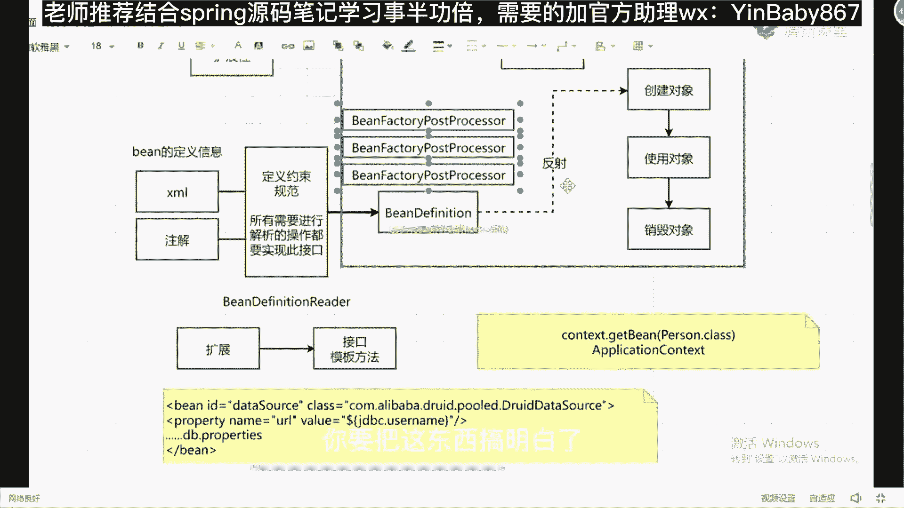

那我们可以来做一个验证，做一个验证，怎么验证来，我带你们看一个代码，稍微出点再往上看，注意像这里面我就写了一个data source，没问题吧，这些data source里面出现的都是dollar吧。

都是我们的占位符，那我可以干什么事，我就g debug，debug之后，我们直接去跳过去，好听到内行，我们看看是不是在哪。

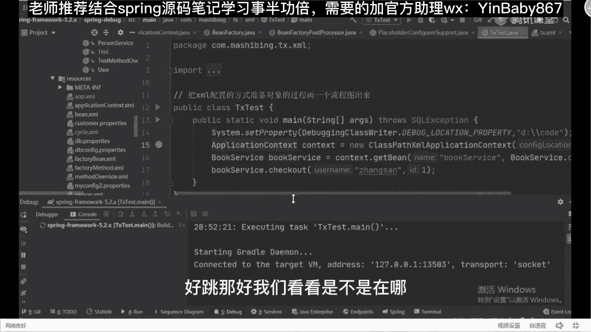

在我们的bean factory post processor里面完成这个工作的。

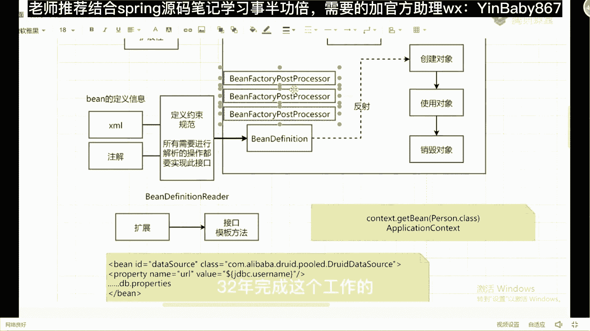

我先来验证一下，这东西很好验证好吧，这里面有一堆断点，把断点断掉，特殊搜索，大家来看看这块要注意了，我每次因为我编译的是源码，因为编译源码的时候比较浪费时间，有多少，编译一下好吧，来点MC进去往下走。

点F7F7，找到我们的REFLESH方法，然后往下走，往下走往下走，你进来慢慢走，不用管他跳过去就行了，刚刚这里没消完，拿走拿走到这步好了，当你到这步之后，我们打开我们的factory。

然后呢打开它之后往下找，找到一个东西叫bean definition map，这个bean definition map里面就是啥，就是我们说的那个封装好的必须对象。

所以我可以打开我们的data source，里面有一个property value，然后这个property value provide里面有provide list，找那个list你看到了吗。

是不是username，Password u 2java class name，你点开之后，你看看这个值是啥，他这个只有进行替换吗，同学们有没有替换，没有吧，我配置文件里面写的啥，对面是不是还是啥。

然后紧接着看往下一步做一个操作，谁能给我翻译一下这句话的意思是啥，这叫什么叫invoke，Bean factory tools，Processor，Invoke，什么意思，调用执行吧。

要执行bean factory post processor，来我们往下执行一下，走好了，执行完了，当我执行完成之后，你来看看值替换了吗，听完了没，听到了吗，不就是在这个步骤里面。

完成了这些替换值的工作吗。

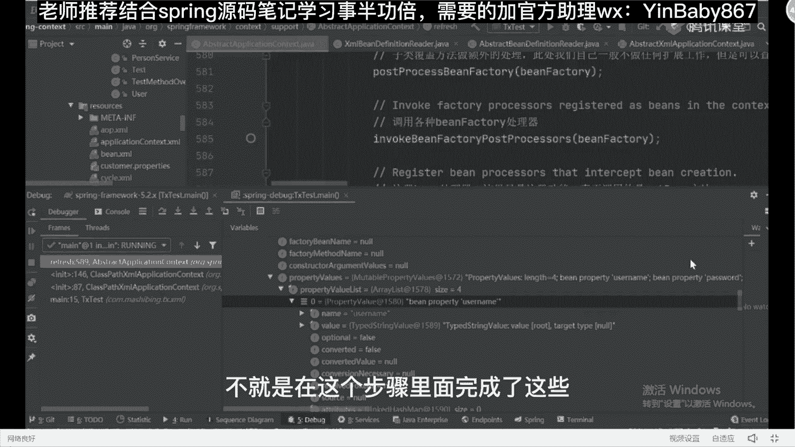

就这意思，所以你要把这搞明白了，把这搞明白了，明白意思吧，好吧，来这块能听懂，同学给老师扣个一，能听懂吗，好了完成之后来再问一个问题，再问个问题啊，我们现在我们刚刚讲了XML文件的方式。

我问一下XML和注解，XML和注解谁先有谁后，有的是先有的注解，还是先有XML文件，插入文件吧，比如说我现在插入文件这样一个配置方式，我先有了XML文件，配件方式方式之后，我一定要写出一个标准的。

咳咳咳，是解析流程对吧，咳咳咳，这没毛病吧，就是我在有刚开始有插盘文件吗，有插盘文件之后，我要有个标准解析流程好，后面我有了注解，我问一下，当我有了注解之后，我是把原来的这些标准的解析流程都干掉。

按说我要在这个基础上做扩展，扩展啊，肯定是一个扩展点，对不对，在原有流程基础上，原有流程基础之上做扩展，那这个问题来了，我们之前写过什么叫at controller对吧。

At component scan，At import，有这样一堆注解，我问一下，包括我们的at bean1对这样的注解，这些注解都是干嘛的，注解是干嘛的，是不是用来生成我们具体的。

或者说用来创建我们具体的bean对象吧，是不是意思好吧，那在请创建并对象之前，是不是先要有BD，那你告诉我BD在哪在哪，是不是在这个bean factory里面，对不对。

如果在bean factory里面的话，我现在想对他进行扩展扩展吗。

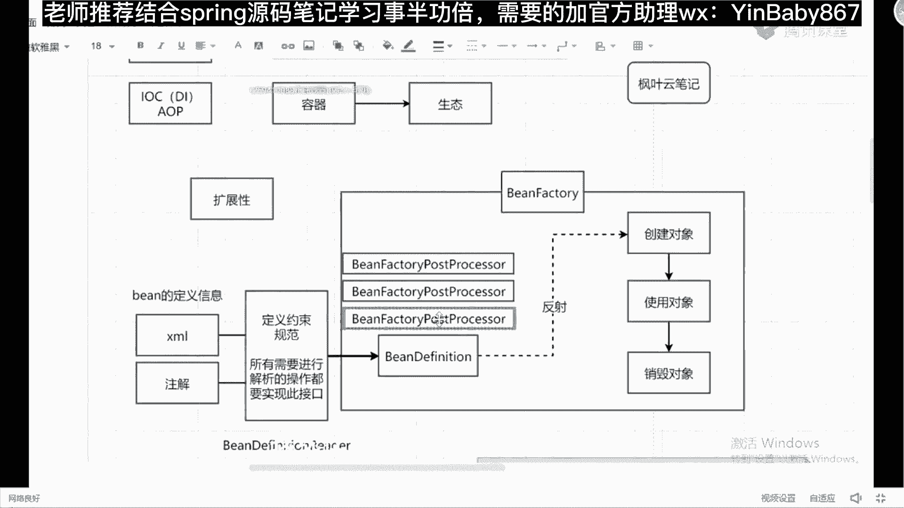

可以怎么做，一样你找到我们刚刚说的叫bean factory post processor，这接口说它的一个实现子类叫什么叫这玩意儿。

不知道有没有见过叫configuration class post processor，在这里面会有一个方法来处理这块，就这个方法好，这个方法里面你可以往里面点点开它，然后往下走。

点了我们的pass好吧，找pass之后找到我们的pass找他，然后你往这看，还在下面这个东西，你看那有什么东西，稍微判断一下你当前注解有没有实现这个类，如果有时间这个东西的话。

OK好我就把它声明成一个具体的注解对吧，再往下走是什么意思，process处理任何at property source这个注解的处理，往下走，要处理任何component scan注解的处理对吧。

往下走处理任何at import注解的处理对吧，往下走处理任何at import resource注解的处理，再往下走，at bean注解的处理，我是不是可以在这个环境里面完成这件事，能听懂吗。

这不也是扩展点，就因为我现在预留出来了很多具体的扩展点，所以在后续的时候我想增强某些功能的时候。

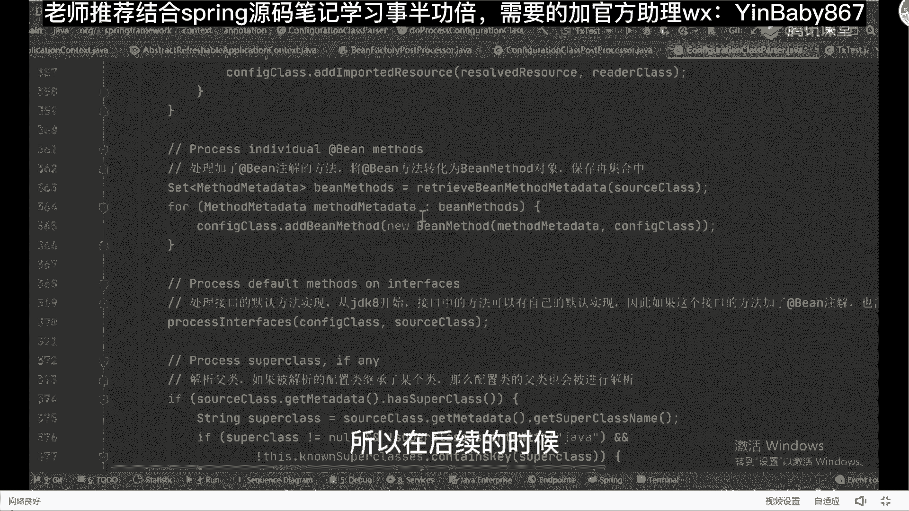

我可以按照我的需要去随意扩展，这玩意儿就是这个东西的核心所在，你小白啊，如果你对这个源码没看过，同学你不需要听懂，你把我刚刚说的东西，什么扩展这两个事给我记清楚就完事了，明白意思了吗，能听懂吧好吧。

所以他要经过这样一系列的一个处理过程，当这样的一系列处理过程处理完成之后，好往下走，诶诶诶诶诶诶画不过来了，一条线过来好吧，等到这步处理完了好了，我现在获取什么叫完整，是BD对象，明白了吗，完成B对象。

有了这个完整的BD对象之后，紧跟着我就可以去创建我们的对象了，这个时候这个创建流程它应该是一个实现，也就是说从这块开始才开始，涉及到我们具体对象的一个创建，明白意思了，来到这儿，能听懂的同学在这扣个一。

能听懂吗，这这这我看这些东西都是从官网里面看的，或者自己研究对象里面看的，优化了，毕竟是啥了，不就是bean definition吗，我把这个搞清楚了好了，大家搞完之后，那下一步很简单，该干嘛了。

来创建对象，使用对象，销毁对象对吧。

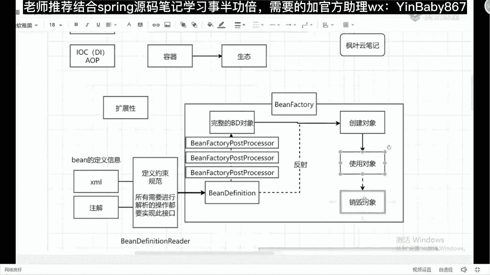