# 系列 5：P32：32、详解spring的bean的生命周期 - 马士兵学堂 - BV1E34y1w773

呃说这三个步骤啊，说这三个步骤我觉得其实有点有点少，正常情况下，我们其实应该里面包含一些其他步骤的，这个创建对象，其实可以分为两个环节的，哪两个环节的，一个叫实例化，还有个东西叫什么呢，叫初始化。

我是希望大家把这两个步骤给分开的，一个叫实例化，一个叫初始化，比如说先有的我们的实例化，然后再给我们的初始化，初始化完了之后，紧跟着才是对象，使用才是相互对象，所以当你把这块一起框起来的时候。

这是个什么东西，这是我们面试中经常面试被问到的一个问题，不就是bean的生命周期吗，就是bean的生命周期，所以你就需要把这个bean的生命周期，好好理解一下的bean的生命周期，能不能搞清楚了好吧。

那我这我在讲这个bean的生命周期之前好吧，先说明一件事，什么叫实例化，什么叫初始化呀，我需要把这两个东西给大家解释清楚啊，初始化实例化有什么区别，注意啊，实例化指示，在内存中要开辟空间好吧。

那初始化呢最容易理解的是什么叫属性赋值，属性赋值，明白了，这是大家正常的理解，你也可以这样的方式理解，只不过在spring里面，它提供的初始化的环节会更多，或者在初始化里面做的东西会更多一点。

这东西我会放那一会给大家详细去进行描述，这打开的东西哇，所以这个图我希望大家能够理解到了，把这东西好好的搞清楚好吧，来刚刚讲的这些东西，能理解或者能听懂的同学扣个一吧，好不好啊，不是说创建变量。

要创建对象，在堆里面申请空间，是这意思，OK接下来我们来解释一个问题吧。

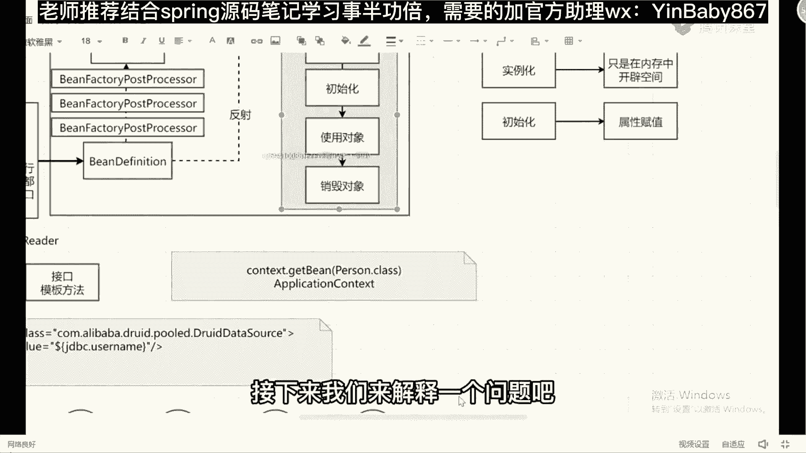

就是我们刚刚说的叫bean的生命周期啊，那bean的生命周期到底怎么去回答呀，这些并保存在什么地方，保存在我们的Mac里面去，在我们对象创建完成之后啊，有这样一个东西，一开始。

哎default b这东西就这样一个对象。

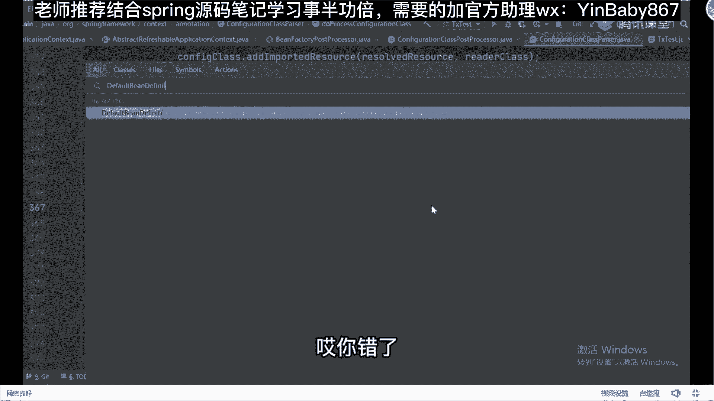

在这个对象里面呢，它里面包含了几个Mac结构，往下找啊，你找一下看吧，这三个东西这三个东西就是什么，就在这往上翻，是啥东西，这三个东西里面就用来干嘛，放我们具体的并对上了，这东西就是我们的一级缓存对吧。

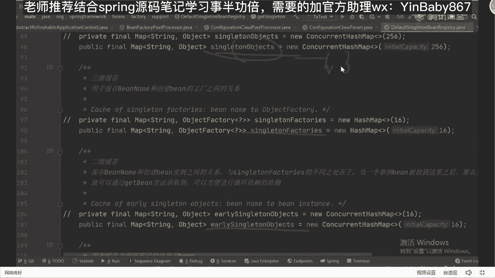

这是我们的三级缓存对吧，这是我们的二级缓存，这东西明天我会详细讲的，别着急别着急好吧，但你记住容器里面是有一堆的map结构的，map结构里面放的是什么，放的是我们具体的一个对象啊，先不管它。

OK我们先来把这个B的生命周期啊，啊生命周期好好去理解一下，到底什么叫生命周期是怎么理解东西啊，我相信啊很多同学之前都背过吧，啊不用截图好吧，这图我分享不用截图，没没必要截图好吧，你们就好好听课。

我保证我这节课讲的东西你能消化一下，没必要去记笔记，我这个图会分享出去的，好不好好听课，到这之后来，我们接着往下讲讲生命周期，我问一下生命周期你们是怎么背的呀。

我相信很多同学肯定会搜索bin的生命周期对吧，出来一堆帖子，非常详细，告诉你，啪一堆好了，我背一下啊，背完之后面试去说对吧，当然有很多同学比较聪明对吧，图片看下图片，有一张图应该用的比较多的。

就是这张图啊，一共有13个步骤对吧，大家把这13个步骤给记住了，我问一下这13个步骤，你记住了就真的能理解吗，这里面我就问一个问题，同学们，我就问一个问题，谁能给我详细的解释一下，这玩意是干啥的。

要检查AVA相关接口并设置相关依赖，就这一个步骤，先给我解释一下，理解不了是吧，小琴说对了哈，小心说是对的，除了小钱，其他都不理解好吧，我们来详细画一下这个流程好吧，流程再次重申一件事，同学们记住了。

bean的生命周期不需要背，听懂了吗，bean的生命周期不需要背，你就按照正常的一个线性思维，去理解它就可以了好吧，怎么理解很简单，第一个步骤，我们叫什么叫实例化，刚刚我已经解释过了，什么叫实例化。

实例化干嘛了，是要干嘛呢，就在堆空间中，申请内存，当你申请完内存之后，我问一下那个对象的属性值是什么值啊，对象的属性值是什么，零现在还说零，现在说零不合适吧，默认值吧，默认值好吧，你数据类型不一样。

肯定是默认值嘛，对不对，然后呢，当你实例化完成之后，紧跟着第二个思维方式，你肯定就想着老师，我实例化完成之后，紧跟着下一个步骤，我一定要开始进行，什么叫初始化，对吧，那初始化的时候。

很多同学想到第一件是干嘛，不用猜吧，肯定是要设置属性吧，你肯定要说是属性，对不对，那这块在描述的时候，你要怎么去描述这东西啊，你不要大人就说实际话，你说实际话是不对的或者不严谨的，你该怎么去说。

你要说变生命周期，从对象的创建开始，第一步我们称之为叫实例化，实例化是通过哪开始的呢，通过一个非常重要的方法，那个方法名字叫什么叫create有being，然后instance好吧，通过这个方法。

可以完成我们具体的实例化的操作啊，那这里面怎么完成的呢，这里面实现的核心逻辑是谁，是我们的反射，对吧，这个时候可以把你的反射技巧带一下吗，什么反射技巧，第一步我要获取到对应的class对象。

第二步我获取到我们的构造器，第三步我要开始new instance了，来创建对象，我问一下这个反射代码会吗，反正不会的，扣二反正会吗，会吧，看下来简单写一下好吧，比如说我现在想创建一个对象，我怎么写。

怎么写反课呀，很简单，跪求百度，简单写一下吧，好吧，简单写一下，第一步获取class对象有三种方式，第一种叫class for name，对吧，你们在刚接触数据库的时候，下载驱动的时候都是这么干的。

写一个字符串，就把它写一个class，class等于第一种方式，第二种方式，The class，等于什么东西的类名点，Class，没有第三个pl，class等于对象名点get class，这是第二步。

第二步叫获取构造器怎么做，container c t o r等于class点get ecli，对不对啊，第三步叫创建，对象，然后object obj等于CTOR点。

new means hans都准备好了吗，就是讲代码啊，谁如果反射不会的话，下去之后一定要看，好好看一下呃，反射这东西是基本功，我们叫童子功，这东西如果你都不会的话，我觉得你的基础知识。

或者是你的技术储备是有问题的，是有问题的啊，那为什么这么写，很简单，因为原文里面就是这么干的，我刚给大家说了，你如果看的话，可以找到这个方法，我们来看一下。

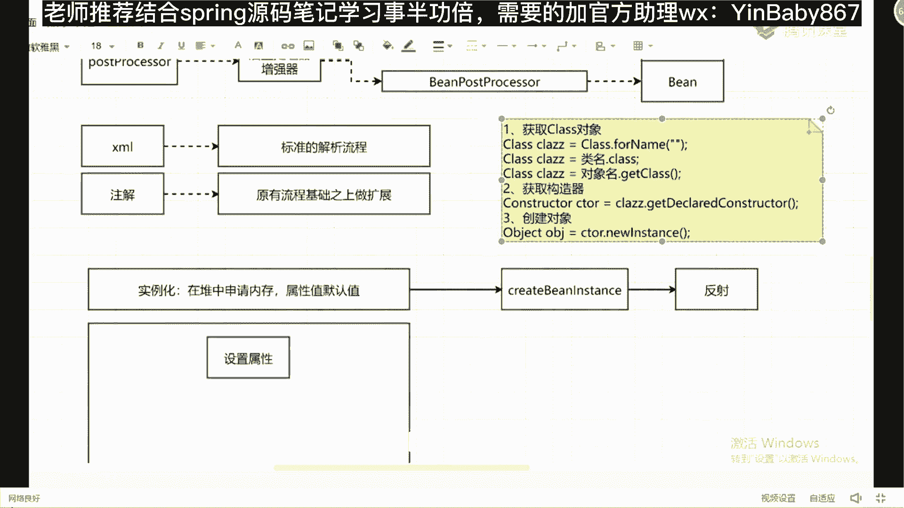

做一下the create in instance。

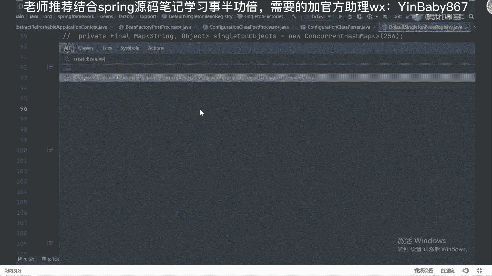

是这样方法，那里面第一步我先获取到我的class对象，获取到之后呢，往下翻翻，下面中间都是判断逻辑，判断逻辑无所谓，这个东西叫实例化，点开之后有一个实例化策略，选择实例化特别精确，进来之后。

第一个步骤叫class，class等于BD点，get in class获取到我们的class类对象，获取完成之后，第二步叫class表，Get declared constructor。

获取到我们的构造器，当我有了具体的构造器之后，紧跟着通过been utils来进行实例化，怎么实例化的叫CTOR点，new instance啊，它就完成了我们的反射，刚刚有人提到这事啊。

说老师反射不是效率低吗，那为什么那个然后用反射呢，注意了，反射效率低，它是有数量级的控制的，你在10万加对象创建的时候，有一口气创建10万加对象的时候，才有可能效率低，就我们创业这零零星。

这对这对象效率还是很高的啊，为啥要用being in tibeuti是什么，是spring里面提供的一个封装类，网上提供封装类，方便我们进行相关的一些病的处理工作。

你在公司里面是不是经常封装一些工具类呀。

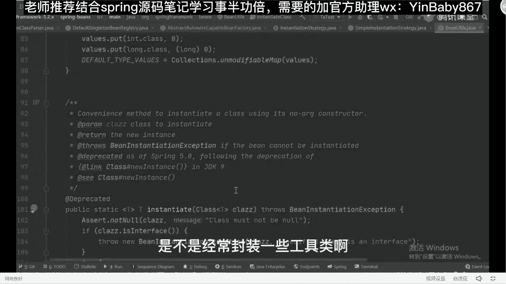

这是一样的意思，在spring里面他还帮我们提供了一个工具类，方便我们进行使用，就是这个反射，那这能听懂同学有点扣一，反正不方便，debug挺方便的，没啥不方便的，你不熟熟了就方便了，好好了。

这第一个步骤，所以当这个步骤执行完成之后，我们第二步骤干嘛了，该叫设置属性，设置属性呢同样，也会包含一个非常重要的方法，发的名字叫什么，叫pull b，有这样的方法，这个方法完成什么事情。

就你们刚刚说的，要给属性赋值，怎么赋值调用，set方法赋值里面就是这么干的，叫populate d，明白意思吧，啊populate b，这没问题吧，这是我们正常的一个线性思维吧，紧跟着第一步，先实例化。

实际完成之后，我们该进行设置属性了，来这块能理解同学给老师扣一，这样能理解吧，我觉得这个应该方便大家理解啊，当这个步骤完了之后，紧跟着下一步该干嘛了，如果你去看那张图的话，背那张图的话。

他告诉你叫什么叫检查，相关依赖并设置对应的一些属性，很多同学对于这东西是模棱两可的，或者说认知不清楚的，那什么叫检查where并设置相关依赖呢，其实非常简单啊，先先来看一下这个接口吧。

play接口叫什么叫aware这个接口，这是干嘛的，这个单词怎么翻译啊，谁能告诉我单词，感知对不对，联想到意识到通知对吧。

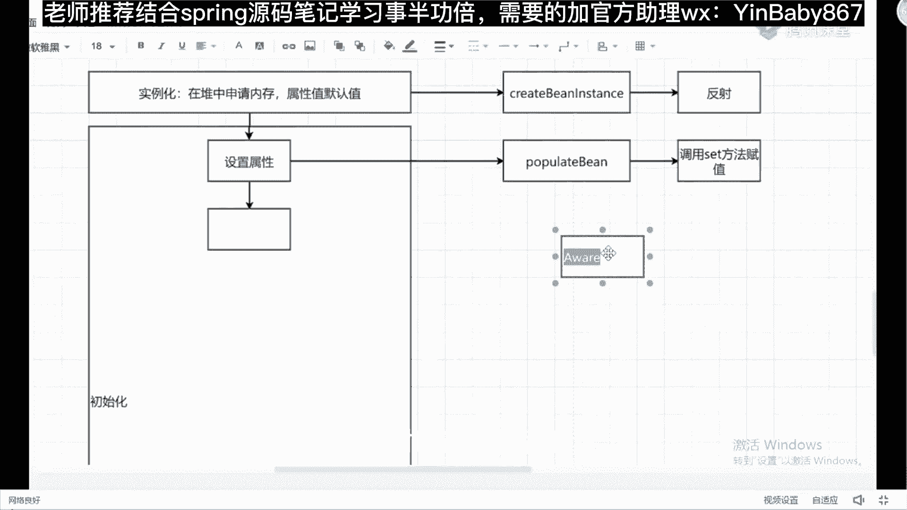

是这个意思吧，你如果看源码的话，你可以打开这个接口看一下。

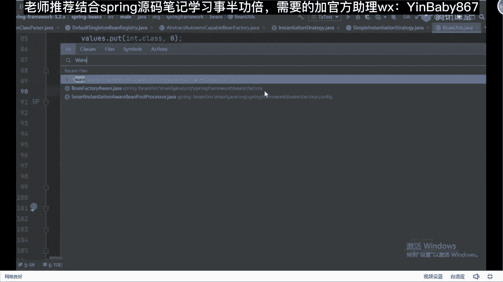

这结果很好玩，他跟我们那个那个呃SERIALIZABLE接口一样，里面什么都没有，它是一个空的接口实现，那为什么要包含这个玩意呢，或者这么个东西，它到底有什么样的意义和价值呢，举个例子你就听明白了。

好吧，来举个例子有啥意思呢，写在哪了，这块我写一个代码在里面new一个class，比如dog，好吧，我定义好dog类之后，我里面一定会干嘛，叫private int id，没问题吧。

private string name我一定可以定义这样一些属性值，是不是意思，当定好属性值之后，我必然要干嘛呢，写上它对应的set和get方法，然后呢，我在设置属性的时候。

我可以调用这些对应的set方法来设置属性值，没问题吧，等一下我调用，公共的set方法完成属性值的设置工作对吧，这能理解吧，一般都这么干好吧，但是有一个问题，同学们除了我们这样的一些自定义的属性之外。

还可能包含一些额外的属性，什么属性呢。

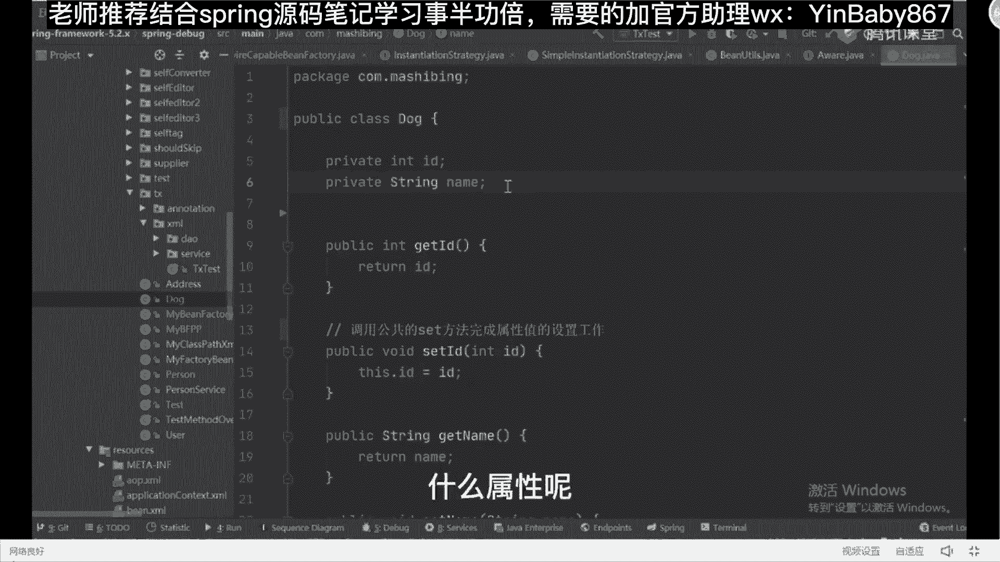

很简单，也就是说在整个容器里面对象好吧，如果按照使用者来分，可以分为几类，就是说啊按照使用来分，可以分为几类，两类吧，第一类叫什么叫自定义属性，比如说我们写的什么person啦，dog啦，看见啦。

这东西的定义属性就之外，还有个东西叫什么，也叫容器属性，什么叫容器属性的自定义对象，就自定义属性对象，还有什么叫容器对象，什么叫容器对象，就在容器里面使用的时候，或者容器在调用的时候需要用到对象。

这边有哪些啊，比如说很重要的，我们说的叫bean factory，再比如说叫application context对吧，再比如说VIRONMENT，对吧，这就是说RESULLER。

这些对象是你是我们自己创建的吗，不是吧，都是容器，在整个运行过程中。

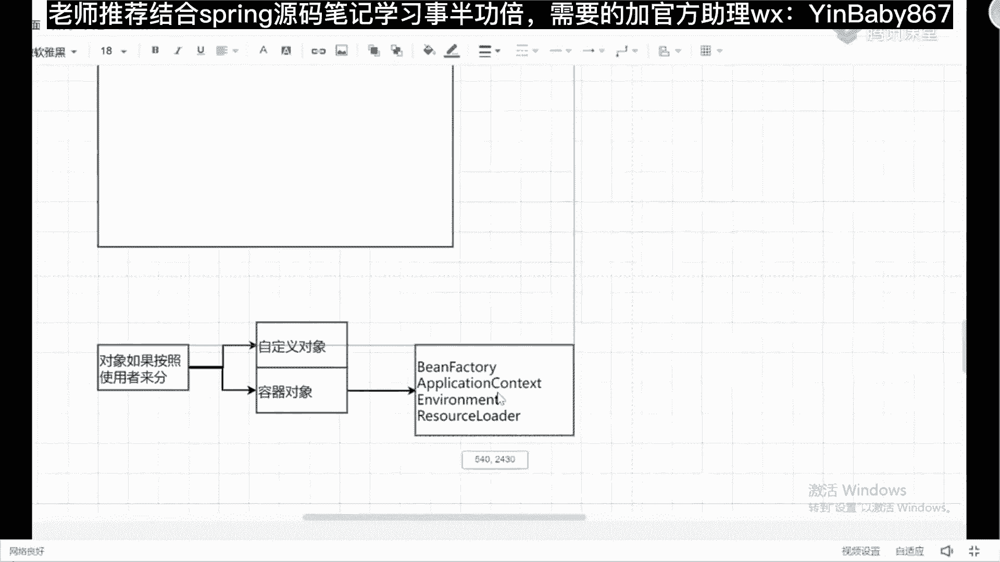

他们自己需要的对象是容器的吧，哇那假设我们自定义的对象里面，他如果包含了这样的属性怎么办，Create b factory，可以这么写吧，Private the application contest。

你不要问老师，我我对象里面不需要包含哪些属性，假设就需要吗啊假设结果呢怎么办，他们两个都是私有的属性，就意味着一件事情，我必须要通过公有的set和get方法，来把它给设置进去，对这里面会有一个问题。

什么问题，这就是谁在什么时候调用此set方法，为什么需要举个例子啊，举个例子，你这有道对不对，看完了你这有道到对象到对象交给容器，加入容器之后，我外面我写了一个测试类在里面可以怎么写呢，可以这么写。

这个叫context，第2get b dog，The class，当我设置好到对象之后，跟对象之后，我突然需要把dog对象设置到某一个对象里面去，怎么办，或者说我需要对。

只需要获取容器的其他对象来进行操作，怎么办，在多个对象中，在B对象中，啥意思呢，我dog里面我写了一个方法，写下，还有一个，Do do，你再写一个并开口，在这里面我需要干一件事，干什么事呢。

叫bean factory，点get be，写一个，我这不传参数了，这么干，我这里面需要用这个东西，我就需要用这些bat对象怎么办，你能保证你的容器里面严格不需要这玩意吗，你能保证吗，只有这样一个代码。

我这个地方怎么办，怎么负责人，你告诉我，你是不是需要把它设置成一个属性，你把它设置成一个属性之后，我是不是才能进行具体调用了，是不是，这意思能听懂吗，啊能听懂不，为啥要设置成私有属性。

大哥咱们学面向对象三大特征的时候，属性不都是私有的吗，看看为啥要设置成私有属性，这就封装吗，所以这里面我就必须要干嘛，把这个对象或者把这个属性给它赋值附上，如果我想赋值附上的话，我怎么赋值。

我一定要调用我们的SAMA，你XMB，你的赋值可以按你们说的来里面写配对象，class报告，我写这样的东西，我里面解属性了，property name等于deploy，你告诉我这写谁。

你告诉我这写什么东西，我写啥，你要想reform，你必须要干嘛，是不是有一个对象在这，你没对象，你写啥，你写你写不了，你喜欢那玩意儿就没法这么干，完了怎么办，所以我要把对象给它设置进去。

设置进去之后就是一件事，我是需要调用我们的set方法，来给大家进行处理的，这有一个set factory，下面有一个set application contest，在这里面就有个问题。

就是谁在什么时候变回复方法，谁在什么时候掉，第一个问题谁要告诉我，谁来教，是我们自己去掉吗，不是吧，肯定是容器，第二个问题在什么时候掉，啊什么时候初始化，你说一个初始化是不是太太太粗了。

别忘了这有个set factory in factory，还有个set up in contest，我如果在后面再加一个environment，我这可能还要再加一个，就set in warm，什么叫。

所以你很难判断，因此怎么办，很简单，能否，设置一个统一的接口来作为标识啊，当实现此接口，到时候来统一的设置这些属性操作，什么意思，当你打开aware接口之后。

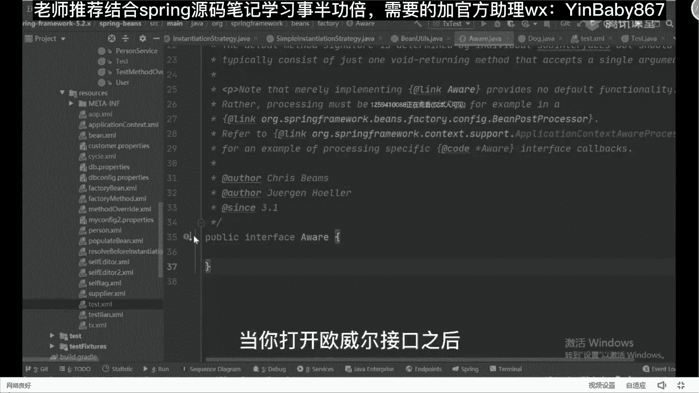

你可以搜一个接口叫B。

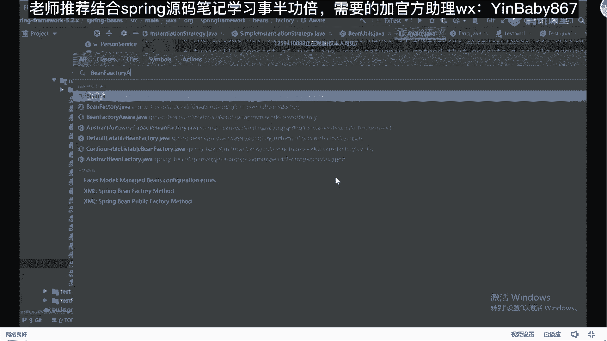

它里面有一个方法叫什么叫set bean factory，当您打开这个叫application context aware的时候。

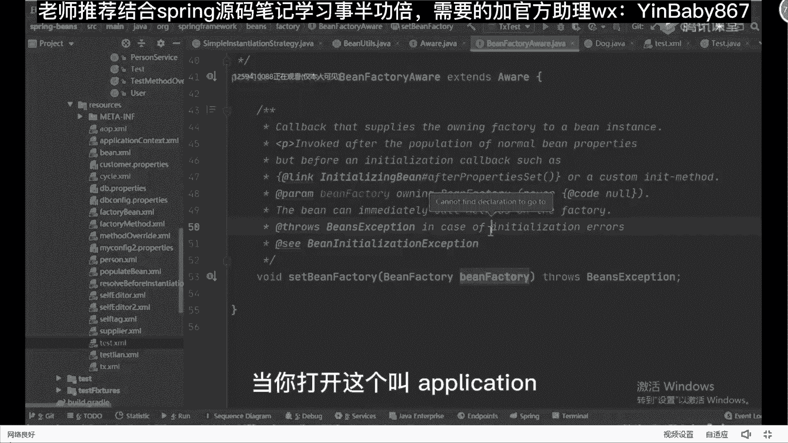

还有个方法叫什么叫set of lication contest，当你需要的时候，上一个environment aware接口叫set environment。

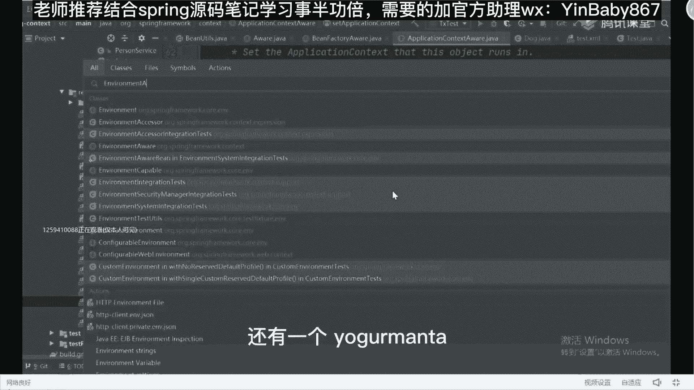

看到了吧，所以我可以做什么事情，我只需要在当前这个类上面加上一个东西，就行了，加什么叫be briaware对吧，application context aware对吧，Environment。

我里面是不是已经包含了这些四联通网了，那么我在进行这些属性的设置的时候，怎么判断，我只需要判断一下这个bean对象，instance of aware不就完了吗，怎么做一个都能判断B不括号。

ban instance of aware对吧，里面可以做什么设置，If，变instance叫BETHEORC，你还可以怎么调ban点，Set bean factory，我不可以进设置了。

能听懂这意思吗，我是不是可以这样逻辑判断。

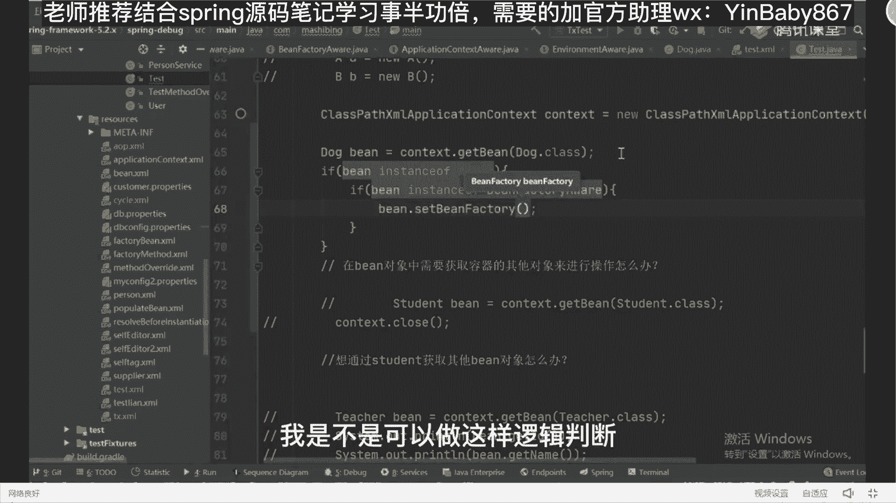

所以在这里面他也是一样的，在这个方法在里面的调用aware相关接口里面，都是说做什么事情，它所对应的方法也非常简单，就刚刚说的叫invoke，Uh aware methods，这东西有这玩意。

你可以打开。

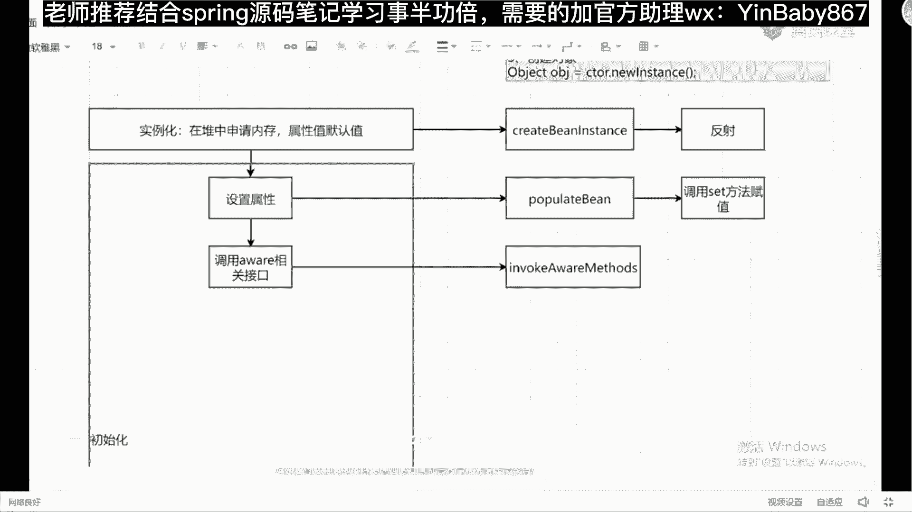

我要看看。

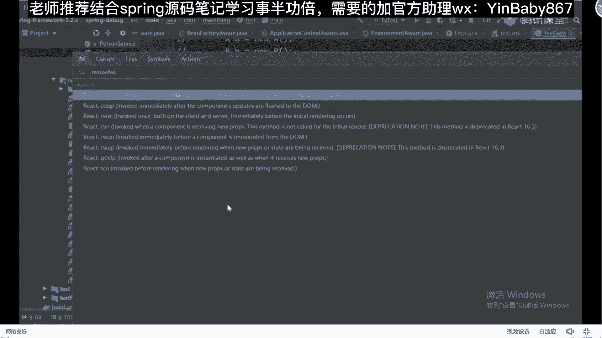

看了吗，Ban instance of aware，Ban instance of benim，Aware beset，Benin bin carloader。

Aware beset beculoader，看到了吗，你能不能做这样设置工作啊，能同学们能吗，听懂了没，听懂了没，这没问题吧。

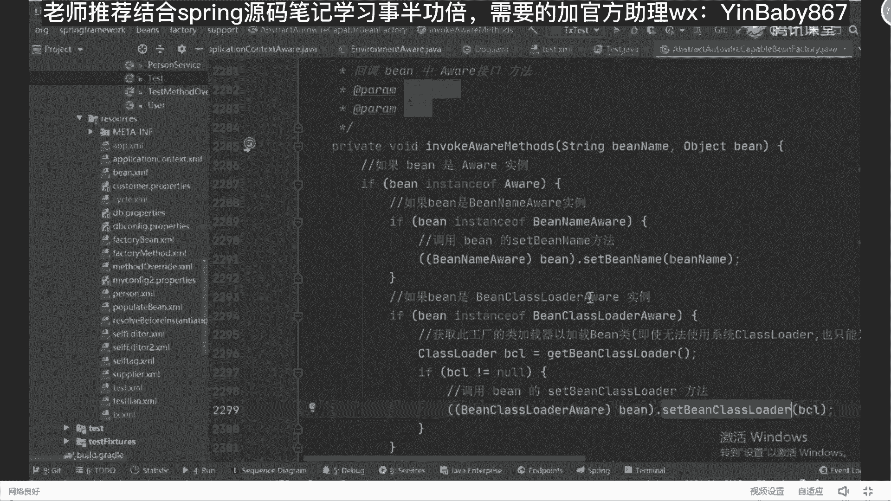

所以你再反过头来想一下，什么叫调用aware相关接口并设置相关依赖，这句话怎么去理解，啊什么理解，这部是不是也是设置，属性啊，上面设置什么属性叫自定义属性，下面呢找容器对象属性，听懂了吗。

所以他们两个包含在一块的时候，都属于什么操作，加上这个底，这个底，他俩统一叫做设置属性，懂了吗，啊明白意思吗，你现在你你想要什么，叫检查偶尔相关接口并依赖，有这玩意吗，就调用这些方法吗，完成这个工作吗。

来听懂的扣一，明白了吧好吧，所以把这东西理解清楚了，理解清楚了，当这块搞明白之后，紧跟着下面再来注意了，现在实例化堆里面已经有内存了，点歌的我的属性设置完成了，属性设置完了之后。

紧跟着郭凤龙还在问说奥威尔接口做什么用的，我讲了半天，我在讲啥，哪个在哪个设置自定义属性在前，服务器属性在后，好吧，明白了吗，所以当这个步骤做完之后，其实我这画一个大箭头，正常情况下。

在我们自己在创建对象的时候，你告诉我我自己创建对象的时候，是不是创建完之后就结束了，就这样还能划分一下，只要划分一下，很简单，当这个步骤，当上述方法调用完成之后，的对象能否直接拿过来并行使用，那么。

我告诉陈说了，要是自定义对象，这个时候还没在容器里面怎么办，你容器创建的时候已经把这些东西创建好了，明白了吗，他在前期的时候有很多对应的依赖，已经提前把对象创建好了，不会出现你说的那种情况。

压根不会出现，你详细看源码就知道了，那些对象提前都准备好啊，这对象能不能直接使用，可以吧，是可以的，但这个时候你要思考一件事，什么事，还是我们之前说的什么，他是一个框架呀，我不可能拿过来就直接使用了呀。

对不对，我还干嘛，比如老师是不是该纳入容器管理了，没到这块，他什么操作，判断是否需要对bean对象进行什么扩展，又是扩展这个点，所以当这个步骤我结束完了之后，紧跟着会做什么工作，做一件事叫执行铺。

叫前置处理方法好吧，有前置意味着一定有后置，叫执行后置处理方法，很多人很懵逼，老师什么叫前置，什么叫后置，这样东西到底怎么样去理解好吧，它与生俱来对应的，是我们的另外一个对象。

就是我在前面已经给大家做个普及的一个东西，什么叫b post processor。

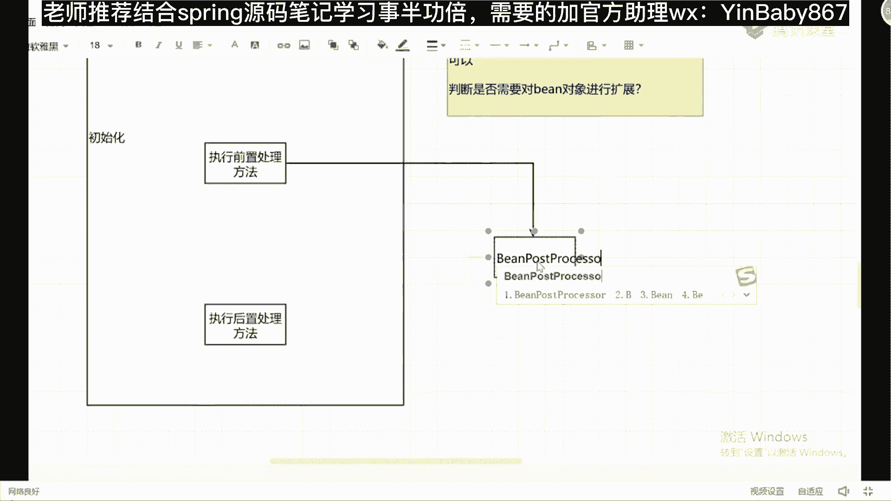

这玩意儿如果你打开这个接口的话，你会看到看一下ban post的同色的。

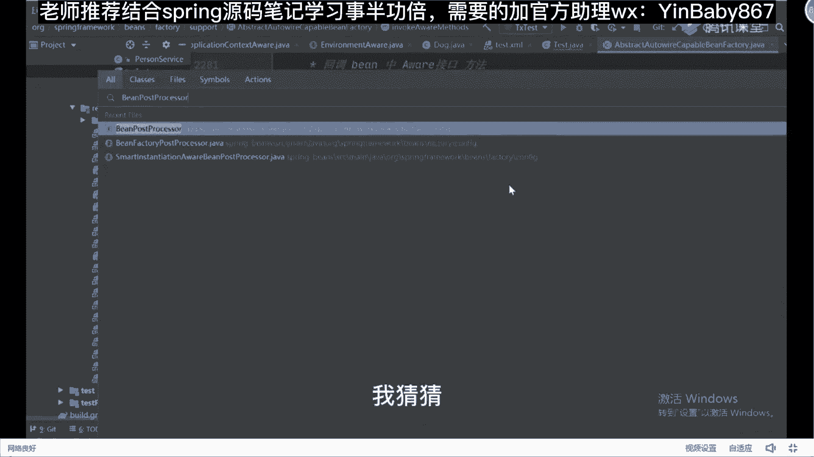

但是里面两个方法，一个叫post process before insulation，后面还有一个post process after insulation，好吧，所以这两个对应过来之后。

就是前置和后置的处理方法来，这能理解同学给老师扣一，我不需要做扩展，无所谓，我如果不需要做扩展，没关系，你跳过就可以了，如果你需要做扩展，你是不是在这里完成对吧，有什么用，并对象需要做什么扩展呀。

需要吗，我问一下，在spring里面有一个非常重要的东西，除了IOC还有个东西叫a OP吧，是的，Vip，我问你个问题啊，a OP的底层实现原理是啥，AOP的底层实现原理是啥，动态代理。

动态代理的两种实现方式是什么，第一个叫DK，第二个叫CDDD，没毛病吧，所以假设我现在这个对象，我就需要被创建动态的对象，怎么办，是不是意味着我要在中间某个步骤里面去生成，我们代理对象，我不可能不生成。

我是一定要生成的，那如果我想生成的话怎么办，我是不是一个接口，所以我要去找到这个接口。

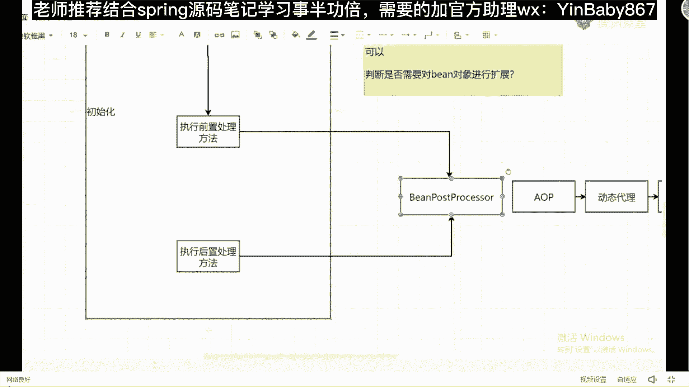

这个接口里面一样，你点开之后会发现有一堆的实现子类，一堆装着一个，找一个东西找他叫abstract auto propose creator是吧，你看这个东西吧，当你看到这个东西之后。

你找谁找它的前置和后置处理方法，我们先看前置，等一下叫before insulation，你告诉我这个前置处理方法里面有做，有做任何工作吗，有做任何工作吗，没有吧，有作品是录播吗，对是录播，没有吧。

前置如果没有的话，那就找谁找后置嘛，对不对，点开后置，后置里面是有处理逻辑的，那好了，我们来看一下它的处理逻辑怎么看啊，找他的方法吗，有一个方法叫什么叫mapper，if necessary对吧。

来点F4进去，点完之后往下拉拉拉拉拉，拉到这行来告诉我这个方法叫什么，叫啥啊，叫什么创建代理，对不对，按代理，然后再点进去，回到最后一行叫purpose fruary，点get propose。

我要获取我们代理工厂，我再点进去，是不是获取我们AOP代理对象，然后来获取代理DMC，进去进来之后发现他是接口里面的某一个时间，此类，那么这个时候你再点开它的实现，此类咱们你们看到了什么。

cg live a OP pose和jdk dynamic a OP prose，所以很多人都问我，老师动态代理或者a OP的入口在什么地方，这不是入口吗，是不是意思。

是不是我们刚刚看到的两种代理的方式，明白意思了吗，就从而进来的吗。

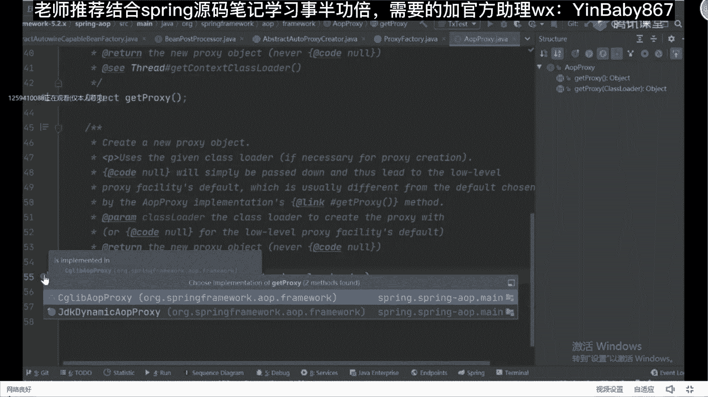

所以我可以干嘛，是在我们的后置方法里面，完成我们代理对象的创建，Raise，这不就是我们对应的一个扩展点吗，明白这意思了吧，所以你要把这个东西给理解了，刚才问我说，老师为什么AP要存在两种代理。

那你让我咋解释，谁能解释一下为什么a OP要存在两种代理啊，啊为啥他就是两种方式嘛，为啥为啥他就提供了两种实现的方式嘛，对不对，好吧，你要想用的话，你只能用这两种方式来进行实现嘛，不就这意思吗，好吧。

所以把东西搞清楚了，这中间是这块处理的一个逻辑，也就是说前置处理方法和后置处理方法都有，你可以来进行自己的一个实现，选择在前置处理方法里面进行扩展，也可以选择在后置处理方法里面进行扩展，你随意来挑。

看你心情，你开心就好，这么简单，明明白意思吧好吧，当你这儿搞明白了之后，所以扩展点就结束了。

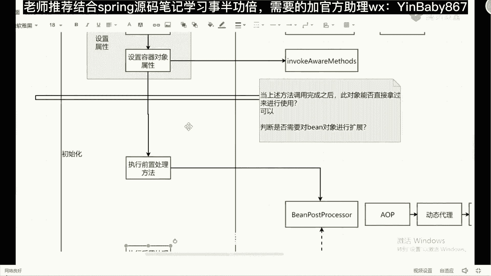

但是你注意了这两个扩展点中间那个接口，它的名字叫什么。

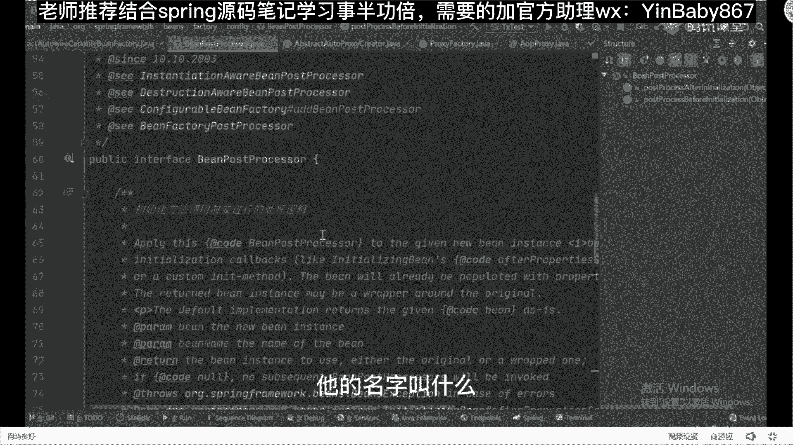

叫post process before，后面有个单词叫insulation，是什么意思啊，倒过来叫什么叫初始化，可能会懵逼的，老师怎么又一个初始化呀，我们最外层的这块不就是初始化吗，这是又一个初始化。

这个初始化是什么，它表示的叫什么叫调用初始化方法，什么叫调用初始化方法呢，也很好理解，同学们，等我把这圈画完，两条线好，什么意思呢，我们在配置某一个具体的bean对象的时候。

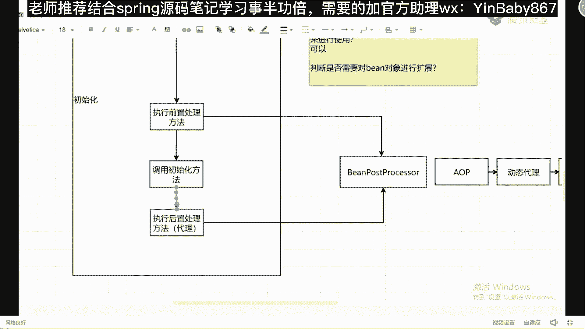

你是可以在bean对象里面加一个操作属性的，什么属性随便点开一个，这可以加一个叫init method，就是我们说的初始化方法，当然这个初始化方法一般是不用的，一般是不用的好吧，所以我们也没人计较这事。

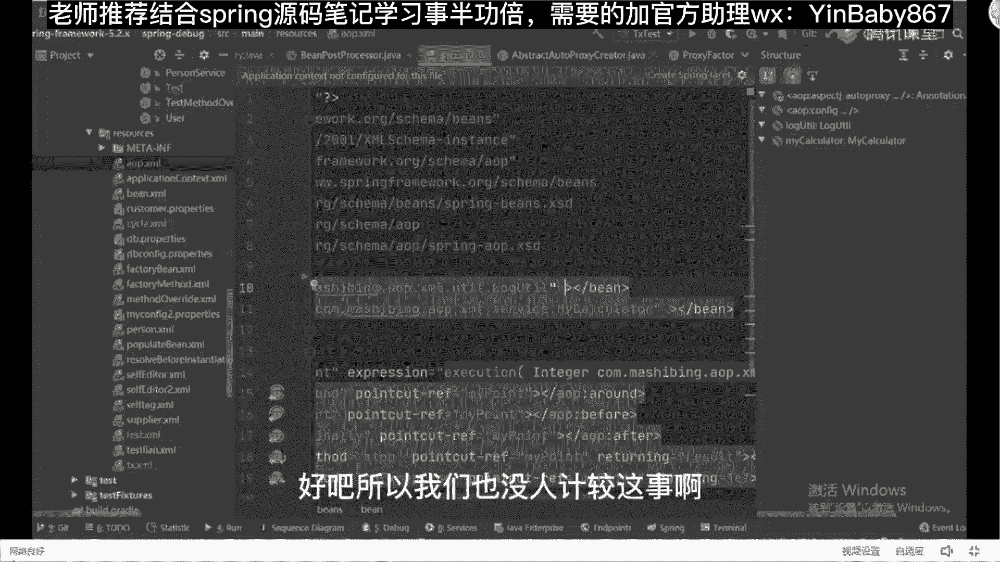

它对应过来的一个方法，处理逻辑叫什么，我写到这边吧，叫invoke delete method，配置最大名的就这玩意儿好吧，其实这个方法其实并不是特别重要，并不是特别重要，关键点是什么。

在当下这个方法里面，它也包含了一个相对比比较重要的处理逻辑，什么逻辑呢，它会判断，当前的B是否实现了一个东西，叫是否实现了intryon be这个接口，什么叫你来定啊，这玩意怎么理解呢。

在这里面如果你实现了它，那里面会调用，一个方法，你们很多人应该见过叫up，Property debuff，你实现这个接口，OK我才能调这个方法，如果不实现，我就不调了，明白意思了吗。

这句话能不能理解这俩中间这块的处理逻辑，我调一下，哎哎好了吧，明白意思吗，很多同学在公司里面应该是用到，用到过这个方法的，明白吗，所以这个it method并不重要，重要的是这里面这个东西。

你要把这东西给理解了，懂我意思了吧，好所以这就是这块的一个除油剂，当你这些东西我都做完了之后，就像你们刚刚说的，在干嘛呢，要把对象交给容器来管理对吧，当我交给容器来管理之后。

紧跟着下一步是不是一个东西叫对象啊，使用吧，我对象使用完了之后在干嘛。

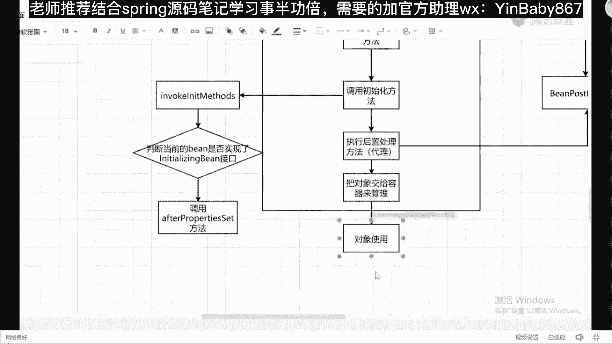

是不是要对象销毁啊，明白吗，怎么交给对象，我告诉你怎么叫对象好吧，当你创建完完整的对象之后好吧，你可以看到一个方法叫do create bean。

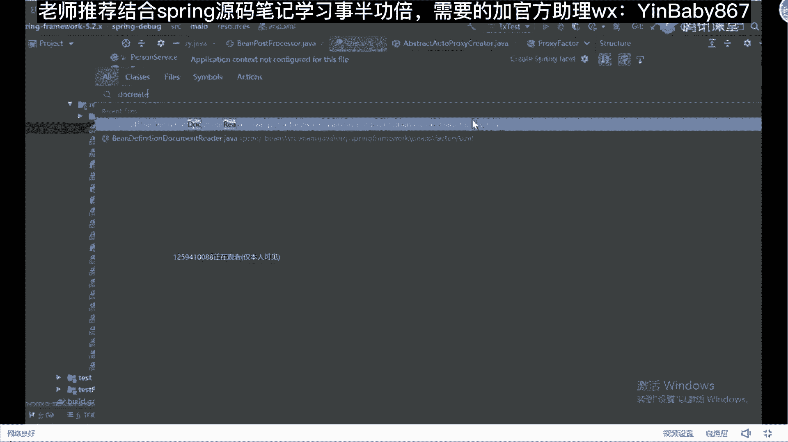

方法在多奎的be里面好吧，就是我们刚刚说的一些完整的处理逻辑，比如说这块，你说艾滋病第一步要调用aware methods，第二步执行前置处理方法，第三步执行我们的net method。

第四步执行后置处理方法，当这些方法我都执行完成之后，我往回传龙眼上面这东西处理完了，我可以把对象返回回去了，一直返回把这注册一个要销毁对象。

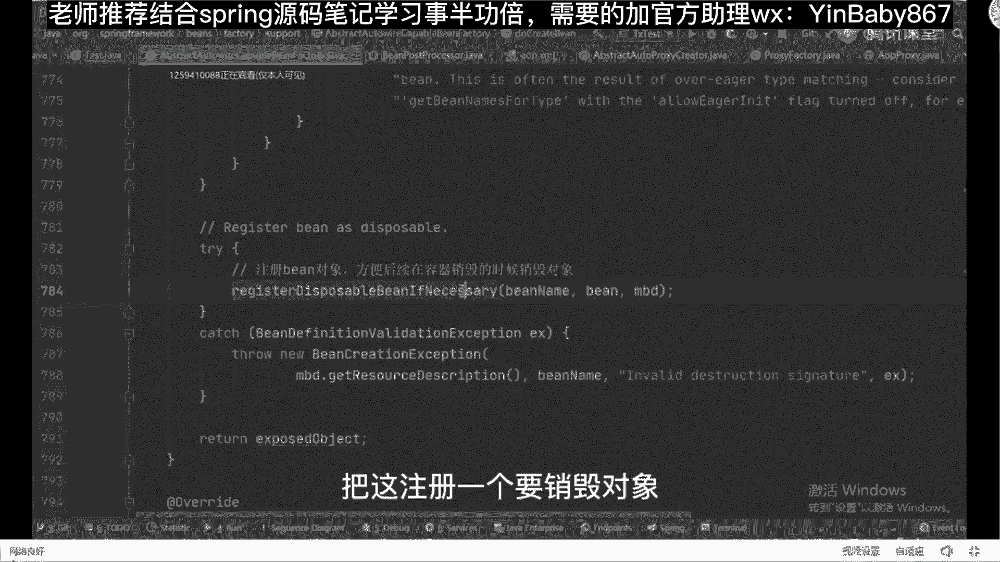

把对象暴露出去，当暴露出去之后，你可以找一个东西叫get。

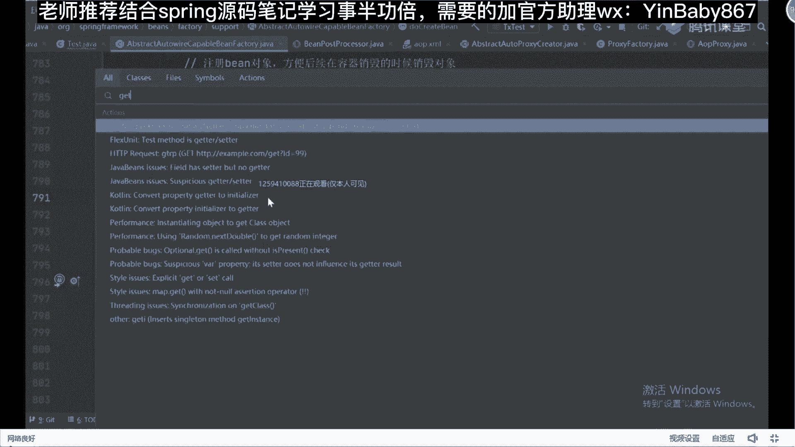

Wink，这一方法哎不是这个。

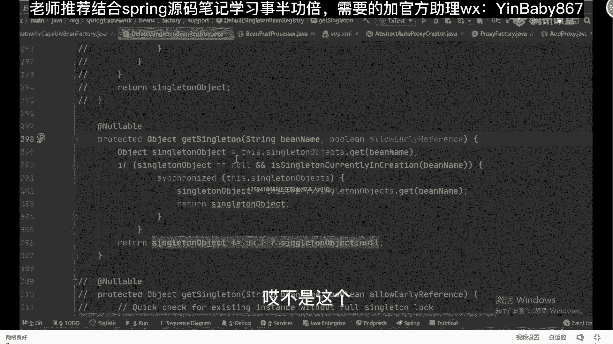

叫get singleton，诶是要get smoon吗，找一下，那不叫干干的新闻。

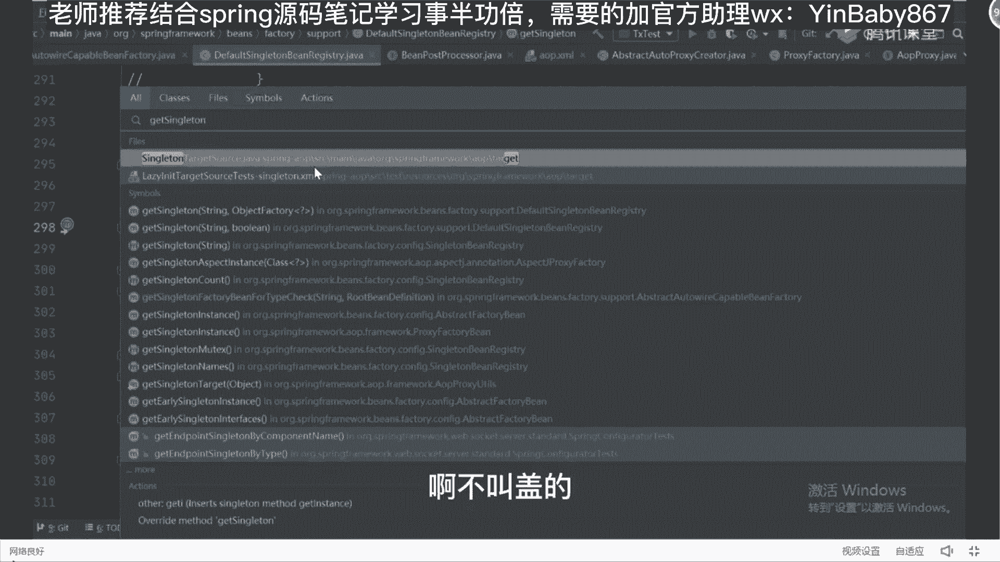

是这个方法啊，那里面可以传一个这个东西，在这个方法里面有一个这个操作逻辑，叫他找at singleton，在这个ADSLETON里面看，这叫this single object put。

把暴露的对象给他传回去，把它放到一级缓存里面去，然后你把它放到一级缓存里面去了好了，容器就帮我们给管理起来了，明白意思了吗，就这块处理逻辑好吧。

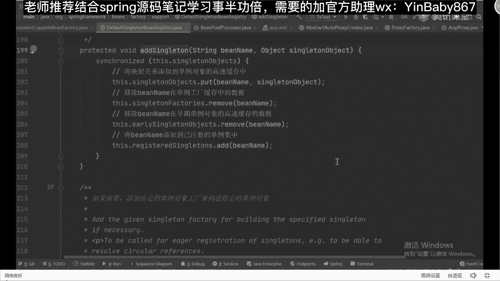

所以你要把这东西理清楚了，就是我们说的整个bean的生命周期。

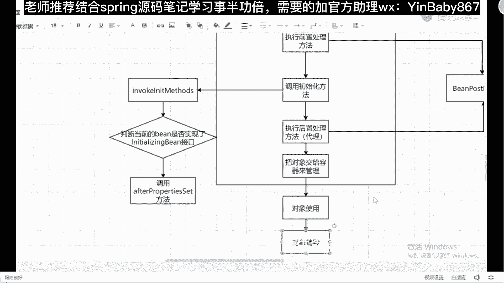

这时候有人会问老师，这个对象销毁你不讲吗，我一般不怎么样销毁，为什么不讲对象销毁，你们有自己的销毁过对象吗，同学们，你们有销毁过对象吗，我什么时候会触发这个效果，对象不是JCJC是垃圾回收容器。

里面是可以有一个关闭操作的，也就是说我们定义好一个具体的容器之后，比如说我们写的application contest，当你定义好它之后，在这里面你可以写一个context，点close方法。

当你调用close方法之后，你才会受到销毁，但是你告诉我你们谁写过close方法，每次都是直接点这东西结束吧，谁写过没写过，所以面试没问，没人问销毁，你感兴趣，你就看看，不给你就算了，无所谓啊。

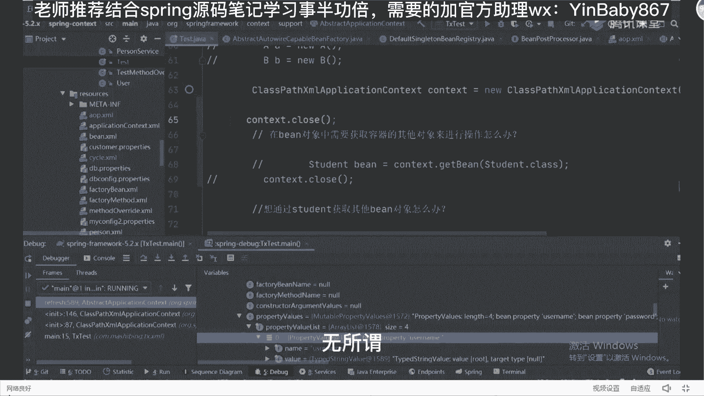

面试我们到目前为止没人遇到过问销毁的，所以你们也不需要在这上面浪费时间好吧，把销毁这个步骤记住就行了，所以这就是我们说的这个bean的生命周期，难理解吗，那同学们都能好不好理解，我就不难吗。

我还说这句话，这东西需要背吗，我觉得不需要背，我觉得不需要背，你就跟着去听好吧，理解这东西好吧，按照流程去捋这样的一个思路，捋这样的一个逻辑，我都说了，不用截图，我发给你们这个图，这图我给你们。

二维码有好吧，加过咱们咨询老师的同学是扫描二维码没加，没加过同学扫二维码加我指，他要好吧，把这个给大家，把这图给大家没问题啊，刚才说老师这个宝贝说老师太粗了，本命太脆了吗，我说了这个干嘛。

主要是帮你梳理你整个的逻辑线，我不是说我要一行一行带着你们去debug，如果一行一行带着你们debug，我告诉你几个词搞不定，没几个词根本搞不定，明白意思吧，另外依赖那里是不是代理会提前，是的。

如果你出现了循环依赖，那么代理对象的创建是有可能会提前的，这是明天我们要讲的东西，我告诉大家，你不需要去了解这些细节，如果你面试的时候能够按照我这样的方式，把这些东西都给面试官说清楚，面试官不会再问了。

我之前专门讲过我们面试突击班的源码，就spring源码，我如何让你在短期之内考虑这个东西，你不需要去看源码，K2没有意义，也没那个时间，就这个源码课，swim我大概讲了80个小时，课分VIP课。

我讲了80个小时，你马上要面试了，你有80个小时先直接去看这东西吗，纯视频八个小时，你自己消化消化160小时，不过分吧，对不对，所以你不可能，所以会告诉大家怎么样，你要掌握的是什么。

是一整个就是这个表述的方式，你要怎么去回答这个问题，让面试官感觉OK够了，我不需要再问了，明白意思吗，所以我说我之前也讲过这东西吗，我给他找一下，我也专门讲过这种面试，同学们当时上课的时候。

大家手敲我说答题技巧看好了好吧，哪个区点12345分开描述啊，避重就轻，没有重点好吧，有问题能站稳，面试多长时间，问的越多，可能漏馅越多，所以尽量拖时间，怎么去理解这东西，怎么解释好吧。

端着怎么去描述好吧，传一下LOK的比分实现，并且生命周期我要怎么去描述好吧，怎么解决循环依赖的问题，我要说什么东西，你把这个搞定，就按照我说的，里面会带很多的类接口方法的名字，你把这些名字记记住了。

然后面试的时候去跟面试官去说这东西，面试官感觉到哦，原来你学过或原来你看过这个源码，明白意思吗，内部反着给VIP的是吧，好吧，我说了这个图给你们，但是我这些带中文注释的这个源码我是不发的，为什么不发。

解释一下，因为这是给VIP在讲VIP课的时候好吧，分享出来的东西，我为了讲VIP课，我辛辛苦苦写的，如果免费给到大家，对VIP不太公平，所以非常抱歉好吧，所以买东西我希望大家能够记住了。

OK这图我可以给到大家，这个没问题，你把整体思路捋出来，捋出来之后按照你整体的东西，然后你整体逻辑自己下去之后。

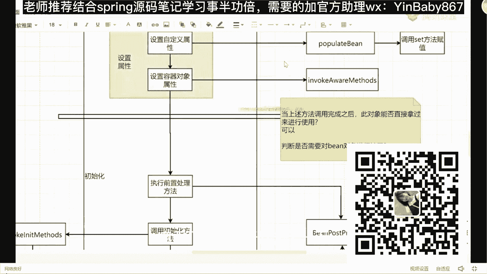

好好去干一下，好好去跟一下，好好去debug一下啊，这事比什么都重要。