# 系列 5：P55：55、互联网架构演变之路 - 马士兵学堂 - BV1E34y1w773

好了同学们，咱们开始准备上那个spring boot了，好吧，来能听到我的声音，同学扣波一，呃今天啊咱们开始那个讲spring boot，很多同学一直在问说那个spring boot讲什么程度呃。

我希望讲一个完整性的课，就是说从基础，然后呢到后面的一个精通，包括到源码，我们这边都会讲的，所以有些基础的东西啊，大家可能听得很烦，因为之前你们在公司里面你用到了，但是我这还是希望把这些东西啊。

整体再做一个回顾，很重要一点信息好吧，咱们咱们做过课，大概我的计划是6~8节课，有可能时间会更长啊，这不一定，但最少也要上六次课，懂我意思吧，从spring开始讲，不会的呃。

spring啊是我们基础班的一个课，spring从基础班的一个实验一个课，基础班的时候也是一样的，我也会从基础的东西开始讲，然后讲到源码呃，还是一样，我希望就是把这个整体的知识点啊。

都做一个整体的完整的一个学习，这样的话对大家的一个好处更明显一点，如果你所有东西都听一半，或者听一个阶段可能不太好，OK大数据是不是连老师上的呃，大数据讲了，还有base。

包括那个日日志的那个小小小项目，然后后续的话可能会讲麒麟啊，基本上三门课我都讲了呃，大家还是根据自己的需要说，我到底要学什么东西，基础版SPM没开始，刚刚讲到JS啊，刚讲到JSJS这块我没去讲。

然后请了一个专业的老师来讲解的，后面的话都给大家补起来，这大家放心啊，呃刚刚很多同学提到大数据，大数据这件事情，我再说一下大数据的东西啊，怎么说呢，呃很多同学说老师我没时间看。

我没时间看或者怎么怎么样好吧，还是一样，大数据应该是一个必备技能，你们现在买了课没时间看，没关系啊，没关没关系，后续的话啊，有时间了，一定要把大数据课补起来，因为你往后看三到5年。

大数据一定会像java一样，在大街，它会成为一个必备技能，而且咱们这边大数据课和大数据课，应该是比较专业的，光HDP周老师讲了14节课，懂我意思吧，应该有很多很多这方面的一个东西，非常非常完整。

所以你需要哪一块听哪个听哪块就可以了，不叫大家不要求大家说每天必须要跟某一门课，你根据自己的需求来决定就OK了，懂我意思吧，今天结合项目吧，看情况，看能不能讲到这块，但应该讲不到。

我们只是一个刚开始的一个基础课，好吧行了，废话不多说，我们开始讲解spring呃，加spring boot，然后再说一下啊，呃大家看到了，我上课的时候，首页打开了spring官网。

之前我在讲课的时候也一样，非常喜欢好非常喜欢，或者带大家看一下我们spring的一些，包括一些其他框架，一些官方网站和官方网站，为什么官网永远是我们第一手的一个学习资料。

所以我希望你们以后学知识也是一样的，所有东西从官网里面直接去看，这些点很重要的信息好吧，人家学说腾讯课堂目录有点乱，呃这个应该不会特别乱。

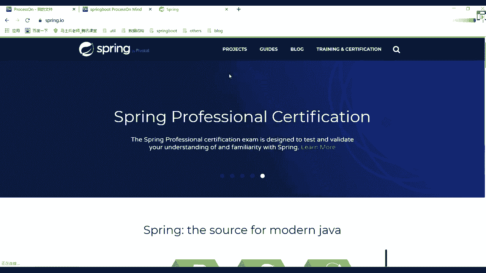

因为之前给大家做了一个整理，那天有学生反馈之后，我专门做了一个整理，大家可以看一下，其实啊只是java课里面稍微有点乱，因为java里面我们加了很多的一些怎么说呢，很多的一些加了很多餐。

所以这块可能会稍微乱一点，然后这边给大家做做好整理的网络分布式，然后spring cloud多线程高并发，spring源码，Net n i o，然后呢JVM1级流量的项目。

包括MYSQL调优架构师的前置知识，这块都给他做做了总结，明白意思吧，所以这块几乎后面的东西也都会一直更新的，不用担心啊，大数据的顺序有吗，大数据就按照课程顺序往里面写就行了。

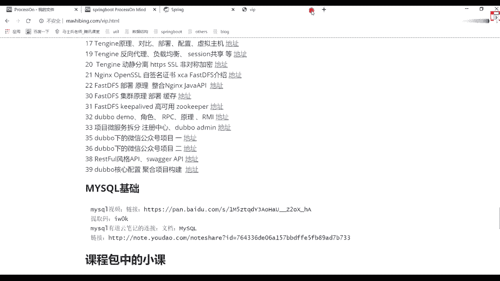

往里面去就OK了，懂我意思吧，就按照我们课程的一个呃，正正确目录顺序来SS来说啊，肺部流域说质检吗，呃没关系啊，你们能够找出来问题或者提出来bug，这很正常，我们是人不是神。

我们也会有自己认知错误的地方，如果有问题，希望大家能够及时反馈好及时反馈，没问题啊，咳现在没有意义，根本跟不上，慢慢就跟上了，总之一点你记住一定是要学的就可以了，懂我意思吧，架构设计没有。

有没有中台项目啊，呃这个怎么说呢，呃看情况吧，大家如果对中餐有有兴趣的话，可以学一下呃，给大家说一下中产项目，我们是请了一个现在已经投产的，已经在产生一些商业商业价值的。

一个项目的公司CPU来进行讲解的，所以咱们的中台才是正儿八经的中台项目啊，到时候你们期待就可以了，一定会有的啊，好了废话不多说，来先聊一下我们的spring boot好吧。

很多同学在公司里面一直在用spring bot吧，来在公司里面现在没有接触过spring boot，同学扣一没有接触过的，别说我接触过没有接触过扣一这么多吗，不可能吧，是我认知错误了吗。

人家给大家说一下呃，现现在还有很多传统项目，很多还是SSM呃，那我们就更要从刚开始来进行一个讲解了，刚开始进行讲解了，它一样，先说一下我们的SSM，其实在SM之前应该是什么叫SSH，对不对。

它是有一个整体的过渡阶段的，在S之前可能还有slate和JSP对吧，他们几乎都是一脉相承的一个东西，这块我希望从刚开始第一节课的时候，能够帮大家拔高我们整个架构的一个认知，好架构的一个认知，大家想一下。

在我们的项目，或者说我们的it行业发展起来之前，最开始的架构是咋不上最开始的架构，没人知道好吧，叫单一架构好，单一架构这块给大家看一个东西，看什么呀。

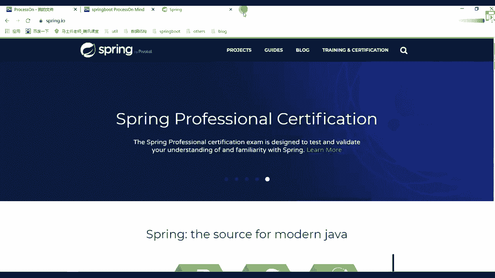

我们看一下double的一个官网，double官网里面有这样的一个描述，我不知道你们有没有看过，我们架构师根本不信这些话，不知道的东西，药性好吧，这些东西设计还是非常有意义的，我们来找一个文档。

在他文章里面有一个背景，大家可以看一下这样的一个描述，我们今天不讲double是吧，不讲double没关系，然后这单这边我们要看一下互联网的发展趋势，说随着互联网的一个发展，网站应用的规模不断扩大。

常规的垂直应用架构已无法应对，分布式服务架构以及流动计算架构势在必行，急需一个治理系统，来确保架构有条不紊地进行演进，所以这里面几乎画了这样一个学习路线图，或者说一个架构的演变过程的一个图。

这个图我不知道你们能不能看懂好吧，但大部分应该是没问题的，往上看上面放了framework什么框架吧，然后有architect，我们的架构，后面有我们的cluster，表示我们的集群。

他有这样一条时间线的这个图，我不知道你们有没有见过，没见过，没关系，我就带你们看好吧，刚开始ORMMACRPCSA，对不对，刚开始是什么呢，叫all in one，就是我们说的单一应用架构，这也说了。

当网站流量非常非常小的时候，只需要一个应用，将所有的功能都部署在一起，以减少部署节点和成本，此时用于简化增删改查工作量的数据访问框架，om是关键，这里面描述了一个什么信息啊。

就好比你们在刚刚接触java的时候好吧，一般在学到server之后，很多人可能说老师我终于学了，OK我可以做一个前后端交互的一个项目了，所以一般情况下都会开发一个非常简单的项目。

当你这个项目开发完成之后，一般都会部署一个外包，放到我们的一个top cat容器里面，好或者其他一些呃动态的一个web容器里面，然后进行一个运行，这个时候你看到你的浏览器可以进行访问。

然后书后面有一些数据交互，这是最开始这样一个过程，但是你要注意一点啊，这是最最最开始的时候一个架构思想，然后呢随着技术的一个演变，以及用户量的一个激增，慢慢的说这种单一应用架构。

不太符合我们实际的一个情况了，那怎么办，有了叫垂直应用架构，大家其实可以看一下这个图，看这个图来做一个对比，什么图对比，刚开始叫all in one，后面呢叫垂直的application应用架构。

什么意思啊，这个图是不是没有任何变化，好吧，刚开始一个蓝色块，后面变成三个蓝色块，然后下面集群规模由1~10台变成10~1000台，这表示都是我们的应用程序，也就是说当用户的一个访问量逐渐增大的时候。

单一应用增加机器带来的加速度是越来越小，为什么你想一件事啊，你想一件事，什么事情你注意了，任何一个硬件它都是有自己的一个性能上限的，你所有东西都部署在里面的话，就算你扩大或者增加你的硬件的一个效率。

他其实对大家速度影响也是非常小的，然后他说了江西应用拆成互不相干的几个应用，以提升效率，就是我现在需要把单一的一个应用拆分成，123，或者说N多个应用了，这样的话就变成一个什么呢，叫垂直应用架构。

然后演变之后说了，在垂直应用架构中，此时用于加速前端页面开发的，web框架的MVC是关键，什么叫MVC啊，model will control吧，包括你们现在写项目的时候一般都怎么写。

现在定义control用来接受我们用户的一个请求对吧，然后定一个model，我们的实体类好吧，然后还有我们的MV没有视图，是我们的一些浏览器页面，是不是进行这样的方式，你们现在做的时候依然是一样的。

只不过现在我们用spring也好，还用spring boot也好，他帮我们做了一个整体的整合好，整理整合这块大家注意了，好之后，我们再来说好之后我们再说这块，然后呢由垂直架构之后又做了一个演变。

叫什么呢，叫分布式架构，Distributed server，好service是什么意思啊，一样的，也就是说当垂直应用架构越来越多，应用之间交互不可避免将核心业务抽离出来，作为独立的服务。

逐渐形成稳定的服务中心，这个时候你注意了，当你形成N多个服务中心之后，会存在什么问题啊，他们之间一定要产生数据的一个整体，交互过程和整体交互过程，这个交互的时候通过什么，是通过我们的RBC了。

什么叫RPC，是不是要远程过程调用这样一个东西，好，远程过程调用这样的东西，好吧，这后面这说的，通过远程工过程调用来进行一个演变，然后用它之后还没完，又往下进行一个演变，怎么演变。

说当服务越来越多的时候，容量的评估，小资源服务的浪费等问题逐渐免疫明显，此时需要增加一个调度中心，基于访问压力实时管理集群容量，提高集群利用率，此时用于提高集群利用率，资源调度和治理中心就成为了关键。

就是我们的SOA，是不是大家看到了这段有一个基本的描述，这个描述里面，就阐述了我们整个互联网架构的一个演变之路，当然很多同学可能年纪还比较小好吧，你可能没有接触过前面这些架构的一个演练，过程，好吧。

你下来之后可能直接学spring boot搞定了，或者直接学微服务，对不对，但是前面这些历史你要有一个感知，会有一个认知，他一定是要不断进行发展的好吧，而发展的最终的目的是为了什么。

是不是使我们第一开发效率提升，第二我们对应的一个应用程序，它执行的一个效率要做一个提升，所以人们怎么样呢，会发挥自己的想象力，创造出来各种各样的一个东西好吧，来达到我们想要的效果，这块要注意了。

所以刚刚这个架构演变之路，能听明白，同学来扣个一就通，看懂吧，你永远不要想老师，你这个图你是怎么知道的，我还是那句话，你多去看官网，你不一定说我学什么技术，就一定要看什么官网啊，没必要。

但是你要知道一件事，当你开官网之后，他们其实可以交叉进行学习的，double里面的东西是不是介绍这个价格演变之路，我们在spring bot这就可以进行一个使用了。

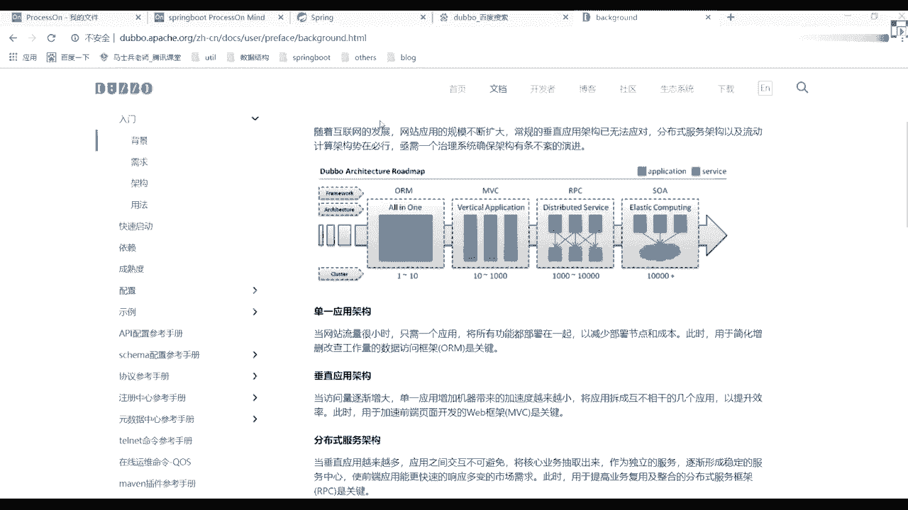

而且现在在企业里面几乎没有spring，没有公司不用spring了好吧，spring还有一个全家桶人工，里面提供了非常非常多的一个服务吧。

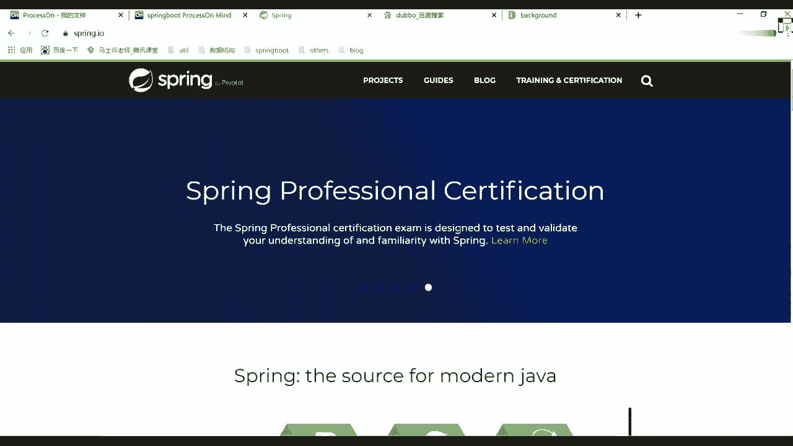

这块希望大家能够知道好吧，往下看，这是spring的一个官网，我刚上来打开，就是这个官网好吧，有spring boot，spring cloud和spring cloud data flow。

他这三块表示什么意思呀，什么意思，第一个叫build anything，叫构建一切好吧，第二个呢叫协调一切吧，第三个呢叫连接一切，这是spring他想做的一件事情。

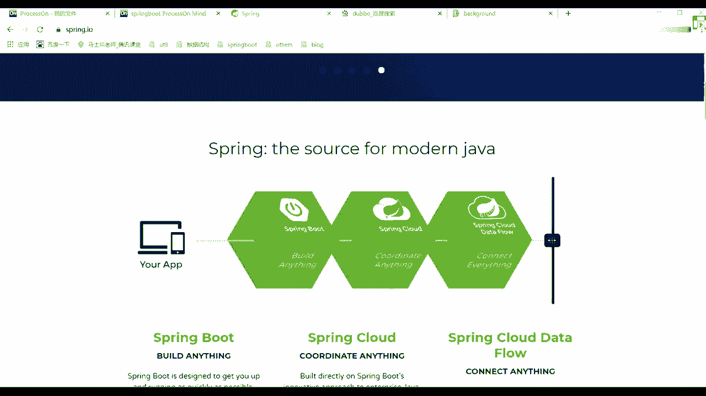

然后里面分了N多个组件来进行一个描述，第一个spring fm和五就是我们的spring框架，这东西咱们加过课里面可能不会再讲了，后续的话基础课里面会讲，把基础课里面会讲。

然后呢讲完之后我们会把那个课单独拿出来，成了一个小课，之前我也说过了，我们有自己的一个视频网站，这个视频网站我还在开发好吧，大概在1月1号的时候会重新给大家进行界面，把我们整个网站的一个设计。

把整个网站的一个设计都会进行一个更新好，其实现在也在做，我可以给大家提前看一个东西，看啥呀，给他找一下，就我后面一直在做升级，很多同学可能有平常问问题的时候，可能找不到我。

为什么一般都在开发这个开发这个项目，大家看一下叫web杠test，诶没了吗，Test gun，Web gun，Index html，大家看到了这个。

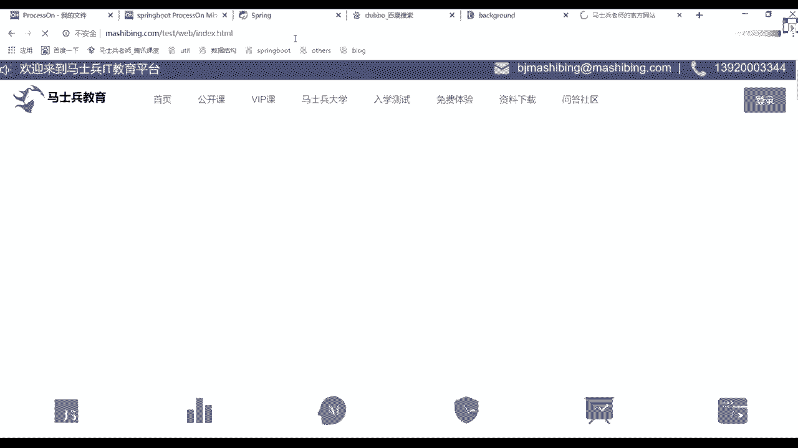

现在这样看起来这图现在还没做好吧，之后的时候别老想着翻车好不好。

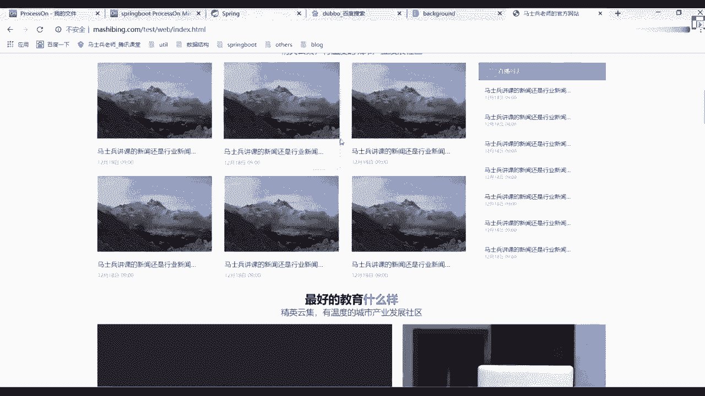

之后的时候，我们会把网站进行整体的一个升级啊，这是我们后期的一个网站。

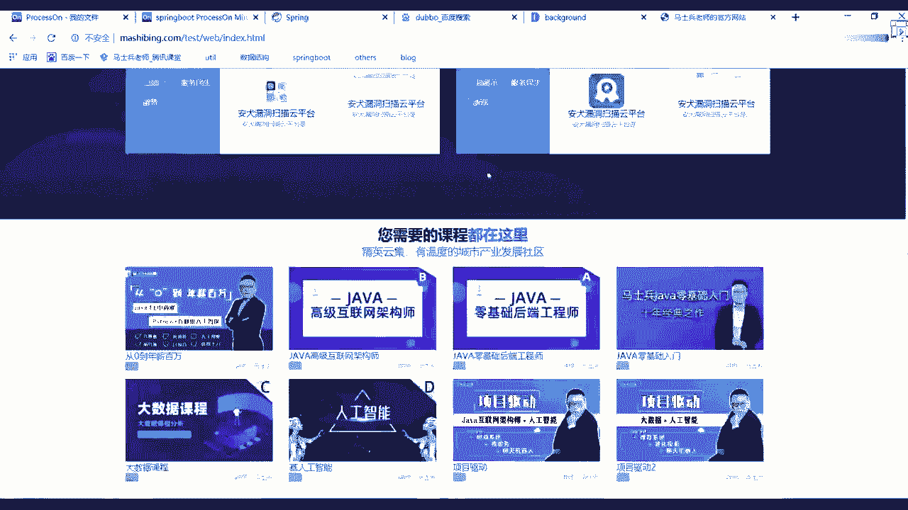

这边的一个规划，应该比我们现在官网要好好看很多吧好吧。

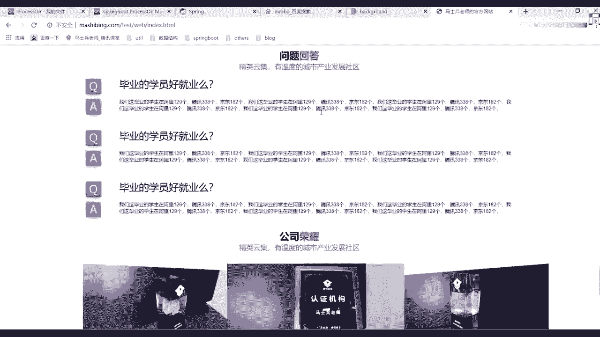

大家今天等着以后啊，还是那句话，会提供越来越多越来越好的服务给大家，你们从官网里面。

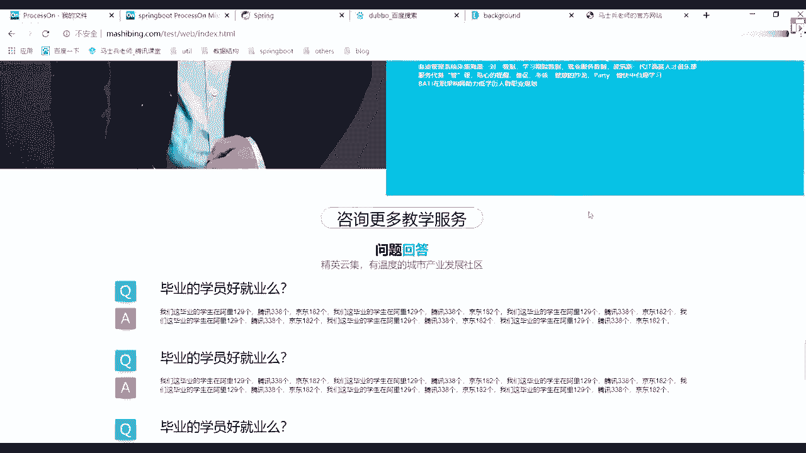

或者通过我们的视频网站都能看到很多信息，但这开发只不过呃需要一段时间，所以希望大家能给我一段时间好吧，一个人就是一支军队啊，不是啊，我们肯定要做这块东西的，懂我意思吧，用的技术你们就不用管了吧。

好用的技术你就不用管了，前端也是一手包办包办嘛，基本上都在自己做好吧，基本上都在都在自己做啊，所以有时候可能回答问题不太不太及时，原因在这就在这一块，要是招人不，我可以去找啊，可以投简历好吧。

欢迎大家投简历，反正你能想到的东西，我还是那句话，你能想到的东西我能做的都帮你做了，所以希望大家能够珍惜自己的时间，抓紧时间学习就够了，懂我意思吧，不知道七爷头像还有没有没有了没有了，没几天了。

是没几天了，我们后续这些东西都都都都在做啊，不给你们看其他页面了，没有意义啊。

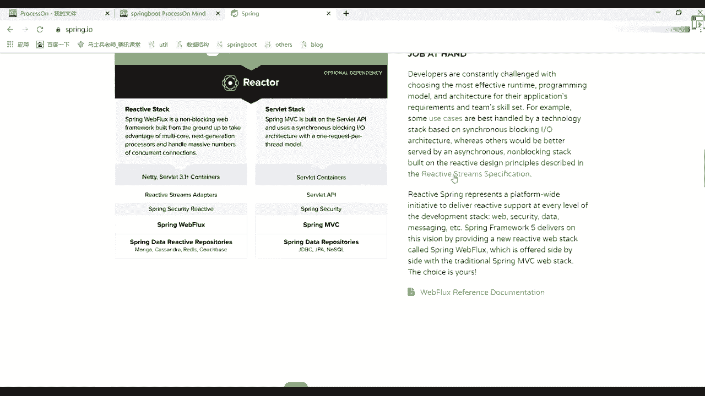