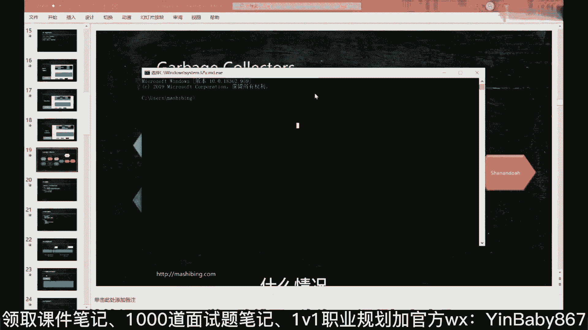
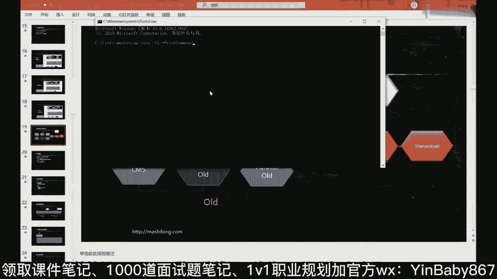
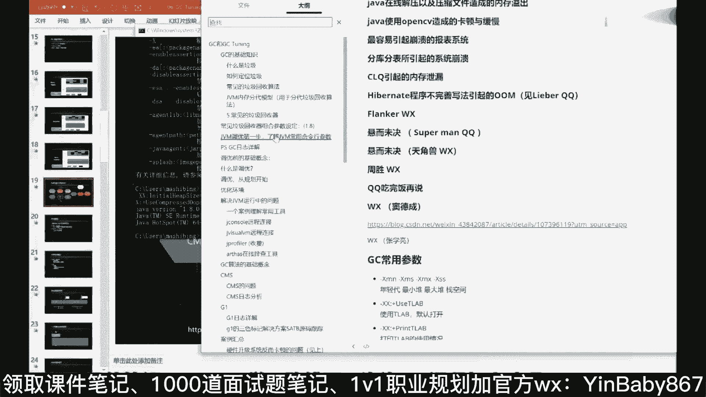

# 系列 5：P6：6、GC的演化过程 - 马士兵学堂 - BV1E34y1w773

好我们先把这个故事讲清楚，随着内存大小的不断增长而演进，我们大概明白了什么叫做分类算法，对不对，好在明白了大概明白了什么叫分代算法之后啊，我们来看看这个图，先先不不跟你讲了，这图要讲起来就没完了。

好看这里你不要讲这一节课，把所有细节全掌握啊，大哥我这讲了好几十个小时的课，你非让我一节课讲完，那也不可能的，好看这里啊呃从内存特别小的时候，内存很小啊，这这java刚诞生的时候，那会内存特别小。

大概就几兆到几十兆，就就就这么少啊，我记得那会儿八兆八兆内存是吧，呃几兆到几十兆内存，Shit，好，几兆到几十兆嗯，这样一个内存这个内存啊，他的那个采用的垃圾回收器呢就叫做serial，Serial。

特别简单，我给你说你就明白了，你看这里根据jvm java虚拟机规范的定义，serial是什么呢，叫做stop the world carbon collector with uses single dies read。

是读一下来叫做stop the world，Stop the world，世界停止，这个词呢叫STWSTW这个很重要，你记住这个词以后，就说STW不要跟人说世界停止，或者说什么什么什么什么乱七八糟的。

不要不要这么说，就直接说SW专业，显得你特别专业，Ok copy collector with uses a single desist js read，使用了一个单线程的GC，GC线程形象一点。

形象一点是江子弟，江子弟，你们哥仨，你你女朋友，你男朋友好，在里边扔线团，扔到一定程度，满了满了怎么办，好，这哥们是工作在年轻代的，满了满了咋办，很简单，你慢慢进来了。

哪里拿着一根扫帚来了之后的第一件事，你们仨给我停，Stop the world，业务线程全给我停止，停到我了，你们仨给我停住，不许再动了，不管你是什么什么姿势，什么什么动作不许再动了。

因为我要清理垃圾了，接下来你妈妈就顺着你们仨捋捋捋捋，捋到的这些全都不是垃圾，把那些垃圾全都清清除掉，清完了之后说你们仨继续go on，等你们仨又玩了一段时间又满了，怎么办，你慢慢又进来听stop。

然后等他清完，你们仨继续听懂这意思了吗，就一个线程给这就叫STW叫stop the world，进来给我停止，停止之后，垃圾回收器干活，由于他工作的年轻代，所以它叫做拷贝。

collector使用了单线程，一个线程就够了，为什么一个线程就够了呀，为什么有些人就够了，很简单嘛，因为内存少啊，空间特别小，年轻代是这样的，老年代也是这样的，老年代也是单线程。

等年轻代回收了很长时间，老年代占满了，产生负利息的时候怎么办，也是单线程，你妈妈又进来了，他这时候老年代的叫做。

Stop the world maxwell compared collection that uses a single dies thread，依然是单线程，只不过他这时候是工作的老年代。

因此它的算法是标记清楚或者标记压缩，或者标记清除完了之后，碎片化过于严重了，怎么办，进行压缩可以了吗，同学们很简单吧，来可以继续的扣一，这就是serial的算法，OK所以这张图啊。

我们翻过头来再看图去哪了，你看我一下就把这哥俩给讲了，好，这是常用的组合，那么下面我觉得我都不用怎么讲，你就明白了，下面叫什么叫PARALLEGAVAGE，这句话是什么意思呢，就是当你的内存越来越大了。

同学们内存越来越大，几十兆到上百兆，甚至到一个G的时候，这个没有一定之规啊，就是他跟你的业务是有关联的，什么时候你觉得业务不好玩不好使了，我告诉你，你这个时候就得考虑所谓的调优，第一步换垃圾回收器。

这种垃圾回收器不好使了，同学们，你们想想为什么内存变大，单线程就不好使了，很简单嘛，你原来啊你们家三平米，你妈妈一个人蹭蹭蹭两秒钟就扫过来了，没关系，停两秒没关系的，很多这种业务啊，暂停两秒钟。

卡顿两秒钟，没关系的，可以接受，或者几10ms就扫过来了，没关系啊，可以接受啊，没有问题，所以在这种情况下，你单线程就完全没问题，但是你们家现在变大了，你们家现在是100个平方，100个平方。

你妈妈一个人要清理过来，清理一次性清理100个平方，要清理多长时间，太长了，半小时，妈呀有没有人能够忍受半小时你的程序不动，你们现在正在进行双11秒杀，用户下单之后，突然间半小时不动，你的服务器没响应。

为什么没想要，因为你们哥仨是不是都在那STW，都在那蹲墙角呢，听懂了吗，所以这时候单线程不够不好使了，拿大腿想想优先采用的解决方案是个啥呀，同学们，多线程吗，parallel哦，这种叫parallel。

叫并行，多线程好并行，多线程工作在年轻代叫做parallel scavenge，工作在老年代叫parallel old，如果用图来画的话，就是最开始是你们哥，你们你们哥仨在这里工作。

突然间满了满了怎么办，你骂骂你爸爸，你姥姥，你姥爷一块进来，你们仨给我停，然后他们四个一块干活，迅速的帮你清理掉整个的垃圾来，你们仨继续周而复始好，这就是serial和serial old。

parallel scavenge和parallel old，它的玩法，讲错误了吧，哪里哪里错了，你说出来，是panel，No，你错了，损伤胆，Parallegivenge，Parallel old。

这哥俩的组合，这是经常用的简称，PS加PO，傻妞，我还没讲呢，着啥急，我告诉你你你们你们生产环境里头啊，我告诉你1。8，如果你们生产环境用的1。8，你没有换过任何垃圾回收器的时候，恭喜你。

你的默认垃圾回收器就是这哥俩，请你给我记住它，它叫做PS加PO叫parallegpa ode，还有同学可能会说，老师我怎么知道我用的是哪种垃圾回收器呢，严格讲这是明天我要讲的内容。

但是今天呢既然你们问到了，就稍微给你们说两句，可以说两句吗，对于java来说，你只要敲一个指令就可以，什么情况。

嗯java装xx。

print common command line flag回车，当然带一带带一程序或者带个version吧，好这里呢他会把呃你java虚拟机启动的时候，默认的那些个参数全给你列出来。

注意看这里面有个参数是什么，叫做use pologic，看到了吗，来看一眼，这是你java启动的时候默认带的参数叫做什么，叫做use parallel gc，哎那有同学可能会说。

老师这个use parallegc到底是个什么东东呢，放心像老师这么体贴的难言，肯定给你做了笔记了是吧，好use parallel DC是个什么东东，类，你找找看找找看，我记在哪了哈。

Here，这个use parallel DC呢指的是OK，就是parallel scavenge和parallel old的组合好了，你可以继续了吗，可以继续，老师扣一来老师这个笔记在哪呢。

我今天稍微给大家调整调整，好到现在为止你们听起来应该相对比较轻松吧，也不太难吧，因为你先建立比较轻松的整体性的树干，我们再去追究那些树叶子，还那时候你就轻松好多，PPT给不不给好，我刚才讲了两种组合了。

第一种是serial的组合，第二种是PALA的组合，调优的话呢，我明天给大家讲讲这块怎么调优，因为JDK1。8，只要你没改过，就是这哥俩好吧好，我们继续随着空间越来越大，现在不是几十兆上百兆1G吗。

现在空间变得更大了，现在是1G或者几十到到什么呢，到几10G，数10G好，我告诉你啊，到数10G的时候，你会发现，无论你怎么玩，你采用多少个人来啊，你说我采用我调一个团的人，来来帮我parallel吗。

原来原来只有一个，后来我把它变成N个多个，四五个四五个不够使了，我来我来四五百个行不行，我来1万个行不行，这里面就牵扯到一个操作系统的最基本的概念，就是线程是不是越多，它的效率就越高，是不是线程阅读。

效率会线性提高，是这样的吗，不一定明确说县城到达某一个阈值之后，它的效率反而会降低，原因是什么呀，原因又回到了这张图，刚才我看最开始我讲这张图的时候，老师就就就就就同学们，不是说老老有这张图没错。

原因就回到又回到这张图，为什么，因为一颗CPU的核或者一核的CPU，同一时刻只能执行一个线程，假如我们有16核，最多在同一时刻能执行16个线程同时执行，哪怕你使用线程撕裂者啊，最多也就是说四核八线程。

八核六线程，总而言之它是有数的，就算是你16个线程同时在运行，那么你这个时候派了1万个线程过来，你猜猜看会发生什么，会发生排队和切换，什么意思呢，就是我这1万个线程，我每一个都要让他有执行机会。

我怎么办呢，我就执行，你一会执行他一会执行，你一会执行，他一会儿在执行你的过程中把你拿走，把它拿进来好，这个过程叫做线程的切换，线程切换本身也是需要消耗CPU资源的，如果线程数量特别多的时候。

上下文的切换，Context switch，这是它的专业名词，好线程切换的所占的资源，就超过了线程本身运行所占的资源，所以CPU会把大量的时间用在线程切换上，它的效率反而会降低，不知道我说清楚没有。

一个厕所只有八个吨位，最多有八个人往里蹲，在里头蹲着，后来来了8万人，你猜怎么着怎么办，CPU就把这8万人排好队来，把你拎进去，蹲十十个毫秒，把你拎出来换另外一个，注意你们哥几个排队协调这个资源。

CPU也得管着，所以CPU会把大量的精力浪费在这个上面，因此不是人数越多越好，所以在在你到达一定阈值的时候，到达啊，好几十个G的时候，我告诉你你再增加多少个线程，没有效率，提升不上去了，这时候怎么办啊。

这时候就诞生了惊天地泣鬼神的，concurrent的玩法，concurrent垃圾回收，刚才这声音有点太君的味道，抬抬抬你个头啊，说太君吗，是佘赛花吗，好这个叫做CONCURRENDC，我告诉你。

垃圾回收器里面有哪些是concurrent c呢，here著名的承前启后，继往开来，历史青史有名的CMS concurrent Mark sweep，以及和他配合的朋友好继续。

替代CMS的g one后面的z dz，后面的SHINDOOR，这些所有的后面所产生的全都是concurrent，好我们先来说明什么叫concurrent，那到底什么叫concurrent呢。

concurrent的意思是是这个here，CONCURREN的意思是这个concurrent，意思是说当我垃圾回收器干活的时候，你的业务线程可以继续，what这叫cover的，知道吧并发。

所以所谓的并罚，指的是GC线程和垃圾回收线程啊，Sorry，GC线程和垃圾回收是一个GC线程和业务线程，我主要有没有看你们认真听讲，GC线程和业务线程可以同时在运行，原来都啥样，原来是GC1运行。

业务线程就得给我STW都得给我停住，Stop the world，现在不需要了，现在没关系啊，咱家特别大，已经变成500个平方一栋别墅，你们姐儿仨在里边玩儿，随便玩儿，你们的你们在旁边玩着啊。

我们我们这个妈妈爸爸爷爷奶奶姥姥姥爷，作为摄像师哦，Sorry，作为垃圾回收者，就在旁边捡你们玩出来的这些垃圾啊，你们别玩，我们边边捡垃圾，边玩边捡垃圾，你们随便扔了，那这时候就会产生一种什么现象。

这时候产生的现象就是，我的应用程序永远有响应，为什么，因为我业务线程在这里跑着呢，我当然有响应了，所以这是concurrent的本质，不知道我说清楚没有，来能get到这一点的同学老师扣一嗯。

当然这里面就会产生各种各样特别麻烦的问题，同学们，你们想想看，我我我往这边一边扔垃圾，你这边一边捡，万一我扔一会儿你呢扫描完这个对象说啊，这个对象是个垃圾，但是万一我一会儿又把它给捡回去了呢，对吧。

他又不是垃圾了呢，你把它清掉不就完蛋完蛋了吗，而且最重要的还有还有一个叫做万一，我比如说我我我我我我我本来啊这个对象呢，你扫描它不是垃圾，但是我玩着玩着，我已经把他的连线给它剪断了，它又变成垃圾了呢。

你又怎么处理，就给标错了，所以就会产生各种各样的问题，是不是啊，同学们好，这是concurrent，我们先来介绍concurrent的这种呃，开天地，开天辟地的第一个啊，就concurrent的呃呃。

Sorry，调出来can cover，里面呢开天辟地的第一个，开天辟地的第一个是什么呢，第一个垃圾回收器是什么呢，就是我们著名的cm，CMS全称叫做concurrent Mark sweep。

叫并发的标记清除，好它主要有四个阶段构成，我们一块来解释，注意这个cm是工作在哪个年代的，OK仔细看cm工作那年代呢，他工作在老年代，那么和CMS对应的工作，在年轻代的应该用什么垃圾回收呢。

你可以用serial，也可以用PU，它不能用parallel scavenge，好，我先来再进一步解释cm之前，我来解释什么叫PU，凡是在这里虚虚的线，注意啊，虚虚的都是可以互相配合的。

但是最常用的配合就三种，serial palace cavenge以及panel，加上cm就这三种，其他的你不要跟他想来想去的，就这三种，不用不用不用不用多想，好好听我讲这个盘六是什么东西呢。

can new的意思和palace cavenge是一模一样的，卡尼就是工作在年轻一代的多线程垃圾回收器，那有同学说了，他为什么不用parallel scavenge呢，原因是什么。

原因是我们来看判定的定义，你就知道了，这是判定在oracle官方文档里的定义，他说盘妞是什么，他说他是一个rap word copy collector，Which uses multiple re。

来读一下，Is dal world gbcollector，Which uses multiple js threats，I drop the wild，Gin the way。

Using multibes with thread，Okay，阿三口音，他说it defers from palace。

Garbage in that it has enhancements that makes usable with cms，这是它的本质，他说他和TELECAVENGE的本质的区别是什么。

它有一些增强enhancements，让他能够和cm更好的配合使用，所以它就是PARALLADIVA，只不过专门和cm做配合使用的，特殊的parallel就行了，Ok，好我们可以继续了吗。

所以到现在为止，当我们看这张图的时候，我觉得你们能看个大概了，你发现没有，这张图大概就已经产生了，然后你就会发现原来这是单线程，这是多线程，这个是特殊的多线程，它配和cm1块用，所以到现在为止。

作为分类模型，起码你掌握了一个两个三个四个五个好，下面我讲这里面最难掌握的CMS，准备好开准备好开始我们新的征程了吗，老师为什么P1开始不配合，gm要出判定，因为最开始的PS是和PO的配合使用的CMS。

后来诞生之后，发现原来设计的这些不符合他的要求，很难理解吗，啊听我说，cm作为整个concurrent这样的垃圾回收器，开天辟地的第一个秦始皇，他有天生的bug，但是呢你如果不从他开始学。

你就理解不了后面的g one，理解不了后面的z DC，理解不了后面的SHENDER就OK好，所以我们先要了解了解cm效仿go浪，你疯了吧，闪电你说你非得说啊，马克思是效仿闪电的，你不扯淡吗。

人家马克思先诞生，你闪电后诞生啊，虽然你早晚要去见他，我们马家门的名人马克思同学，但是你不能这么说，不能说他效仿你，你只能说你效仿他go on，效仿java好看，这里cm它是这么来玩的。

它的原理呢也非常简单，虽然说从最底层角度讲，它由六个阶段构成，但是你跟面试官聊，基本聊够聊，聊通这四个阶段就可以了，这四个阶段分别是什么呢，分别叫初始标记，并发标记，重新标记，并发清理，1。1点来讲。

它很容易理解，这里面最难理解的是这个阶段，这个阶段就是著名的三色标记算法，今天看时间吧好不好，现在已经十点了，看这里，呃这是，它的四个阶段，四阶段是什么呢，初始标记，初始标记的意思非常简单。

就是找到根儿上的对象，找到那些root对象，大家知道我们垃圾回收过程就是从根上开始找，先把这根上对象找到，这部分叫初始标记，注意它依然是STW的，但是他STW时间会非常短，为什么。

原来的STW时间是要你把所有工作全干完，所以他时间非常长，现在这个S加时间，你只要找到根上就可以跟上对象，毕竟没那么多，所以这个SW时间特别短，一般来说没有多长，所以没有关系，接下来就是最重要的阶段。

这个阶段是什么，这个阶段是我们的业务线程继续，不管你有多少个业务线程，几十个，或者你们哥仨，你们几13随便玩，你们在那玩的时候，我垃圾回收器就在工作了，垃圾回收器开始工作，我就开始找哪些是垃圾。

哪些是垃圾，哪些是垃圾，那是垃圾，你一边玩着一边听着，我一边标记着啊，不能叫，一边听着一边标记着，这个是垃圾，这是垃圾，这是垃圾，这个不是垃圾，全给你标出来，等我标好了之后，注意他一定会产生错标。

坐标主要有两种情况，第一种情况是好好听我讲，原来这哥们是个垃圾，原来这哥们是个垃圾，但是运行过程之中呢又有一个引用指向到了，OK他就变成不是垃圾了，这种的你后面不能把它给清掉，你得把它修正过来。

还有的呢，原来这哥们儿不是垃圾，有人有引用指向的，运行过程中呢，引用没有了，它又变它就变成垃圾了，好这是两种经常见的情况，这块大家能呃听得懂吗，这块是最难的内容了。

concurrent里面就是cm里面最难的内容，能能get到吗，嗯讲错了吧，宋海强一定是你错了，你放心，我不会错，凡是怀疑老师错了的，你们都错了，引用没了，怎么又会引诱回来，我一会讲给你听。

那个叫做先引用了，然后我们的垃圾回收器以为引用没了，三色标记，我一会儿讲给你听好吗，引用没了也能引用回来，我告诉你，虽然情况比较特殊，但是完全可以，比如说缓存你命中了，然后你那些没命中的，你要清掉了。

突然之间他又来了一个命中了，比如说你重写了finalize方法，原来死了对象，你就给他复活了，放心啊，我这没错，我这没bug，成员的bug就像自己的内裤不会展示给别人的，放心，总而言之会发生两种情况。

就这两种这两种情况最终都要进行修正好，这个修正过程要重新标记，修正过程不能让原线程继续，业务线程再继续的话，那你不断的新错误在产生了肯定不行，所以从整个的cm角度，一共有两个阶段是TW的。

一个是初始标记，一个是重新标记，毕竟出错的不会特别多，所以重新标记的这个STW时间也不会特别长，好最后呢我标完了，确确定标清楚了，这就这哥几个是垃圾，那哥几个不是垃圾，好累，并发清理，清理完了之后。

下一步好，这是大体的过程，这里面有很多细节，最差的最多的细节就在这，叫做三色标记算法，著名的三色标记算法go on采用什么算法，go on知道吗，三色标记，那小点点问SW了，怎么能出错。

大哥你看看这是SW吗，我说的是出错，是在这出的，嗯三色标记go on也是啊，所以你不要说那个java超go on，别扯好了，下面我连我，我详细给大家讲这个问题可以吗，讲这个有点难，今天我告诉你。

我讲完三色标记就没有时间讲g one，就没有时间给你们讲g one，Cdc shandollar excellent，你是想听这个还是想听三色标记，你们自己挑。

