# 系列 5：P64：64、thymelaf模板引擎 - 马士兵学堂 - BV1E34y1w773

好了这块有没问题，之后，这是我们这个web web开发相关的一些知识点，大家发现了这些知识点，我都是从官网里面截取了一部分，就我认为比较重要的东西拿出来之后，给你们讲了一下，来给你们讲一下。

这个我刚才大家已经发现了，我的模板引擎非常非常重要，好吧，之后我们在开发这个项目的时候，也需要用到我们对应这个模板引擎，相关的一些属性点，所以该怎么办，我们来看一下模板引擎应该怎么做。

学习在我们这块注意了，可以找一下sim，模板引擎呢找一下啊，在web开发这块注意了，一般情况下，推荐大家使用我们对应的一个模板引擎好吧，而且而且你注意一件事，模板的模板引擎。

大家看是除了Rest for a Rest web服务之外，你还可以使用small vc来服务动态HTML内容，spring vc支持多种模板技术，包括sim lab呃。

呃sim live framework和JSP，当然注意了，JSB这块，我不知道你们在公司里面还是否会使用，现在已经没人用这玩意儿了，好吧，大家想想JSP它是啥东西啊。

啊翻译过来叫啥叫java server配置吧，相当于说在JS页面里面，我可以嵌入我们对应代码java代码，然后呢，可以把我们后台返回的数据，动态的显示到我的页面里面。

而我们在使用我们对应的一个模板引擎之后啊，它也可以完成我们对应的功能功能，所以他说了，所mod里面提供了以下模板引擎的一个支持，Free mark ga，好吧哈，SIMPLIVE还有这些东西。

目前用的最多的可能是sim live这东西，所以SYMBOLIP这块我们要重点做一个学习，他说了，如果可以，请尽量避免使用JSP，当使用了内嵌SL的容器之后，会有几个已知限制，这块有限制好。

但不管怎么样，建议大家不要再用我们的JSP了，最好用我们的sim lip这块问题来了，sim lip我应该怎么学，在我们的spring boot的官网里面啊，官网里面FIREMARK这么多。

你们哎问一下，你们在公司里面用free Mark用多还是用SIMP，用多了，free Mark用多扣一，SIMPLIP用多扣二，都不用，VOEGSP指责后端前端分离行吧。

这块啊如果你用free Mark中用户多的话，你就它其实也一样的，你可以看一下官方网站，就是那个文件名称，后缀FTL，它里面有官方网站，其实也就是对应语法规则，你把这些语法标签掌握了之后就够了好吧。

直接讲完就够了，都不用清水JSP这这这这JSP现在已经不用了，大家看到了吧，这个文档里面都比较简单，其实里面有if else if是不是有些逻辑判断对吧，同样的sim live里面也是一样的。

好sim live也里面也是一样的，把它打开，这sim live里面就是说你用semi的时候，你可以怎么样呢，直接用我们的HTML页面返回就行了，好吧，它不需要形成一个单独的一个模板引擎。

就是在HTML页面里面直接进行嵌入，这个地方就是sim live，它的官网把simple lip用于官网，所以这块我把simon live这块给大家重点说一下free Mark，如果你们有需要的话。

把free Mark重点学学啊，这东西比不也不难，还是一样，从官号里面看就行了，他说了，在早期开发的时候，我们都用静态页面，也就是HTML页面，随着时间轴的发展，慢慢引入JSP页面，当在后端。

当在后端服务查询到数据之后，可以转发到我们的JS页面，可以轻松的使用JS页面实现数据的显示和交互，这里有非常强大的功能，但是在此时boot的时候，整个项目是以炸包的方式运行的，而不是外包。

而且还嵌入了tomcat容器，因此在某种情况下是不支持我们的JSP页面的，如果以纯静态页面的方式，会给我们开发带来很多的麻烦，所以推荐使用模板引擎，模块型有很多种啊，有jsp free Mark是吧。

一会儿干嘛呢，写一个页面模板，然后呢一个值动态的可以写一些表达式，这些值可以自从后台查询之后返回去，好吧，这是他这个图官网里的图啊，说TNT，然后下面页面这是dollar user。

就是这后面可以写我们的data数据，此时你用模板引擎之后，它显示的数据就是什么叫hello张三，就这样的信息，所以就是说把我们的数据做了一个，原生替换而已啊，所以sim lip啊。

他学起来并不是特别麻烦啊，并不是特别麻烦，大家看SIMLIP有些介绍，官网刚刚已经给你们打开了，还是老规矩，我们从官网里面来进行一个查看，第一个先选一下下面的有东西啊。

docs是倒钩门神DECENSION，这块有很多，大家看到了，是不是有using simi，有三的对吧，有三的下面都是三版本，之前还有用二二的版本，现在啊可能用三用的更多一点，我这讲的也是三。

你可以把这些文档可以在线看，也可以直接把它给下载回来，这块我已经下载好了，一会把分享出来，叫using sim，好同学看这个文档的时候看的很难受，因为全部都是英文的啊，全部都是英文的嘛。

所以这块也一样的，我给你们相应的匹配的找了一个中文的网站，看看这个你叫SIMF一个例文，什么sim leaf有什么样的东西，这块都是写好的，所以你看这个网站也能做一个学习。

但是我们后面如果要进行一个项目开发的话，这块你是必须要会的，所以这块我们先拿几个简单的东西来给大家，演示一下他到底做了什么样的一个事情，可以看一下什么是live，这做的比较一个比较详细的解释。

然后呢能SIMP能处理哪些对应的一个模板，网页发出来，来你们存一下，然后还有一些标准方言，如何构建一个虚拟杂货铺，这块给大家说一下，他这个网站比较好好在什么地方，它提供了一个对应的一个呃样例模板。

也是他给了一个项目，你通过这个项目之后，拿过来之后可以直接进行运行。

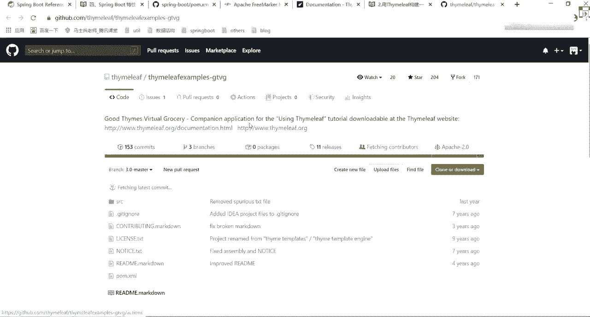

我这已经运行过了，可以给大家看一下，这东西叫他JVTVT，打开之后呢，怎么做，直接运行，看看这个效果啊，看这个效果，这是他那个SIMP官网里面提供出来的，一个模板的东西已经使用了是吧。

地址地址地址端口冲突了啊，停掉拜拜一小，此时的他还是一个外包来进行运行的，外包进行运行的，启动好了吗，等一下OK，启动好了。

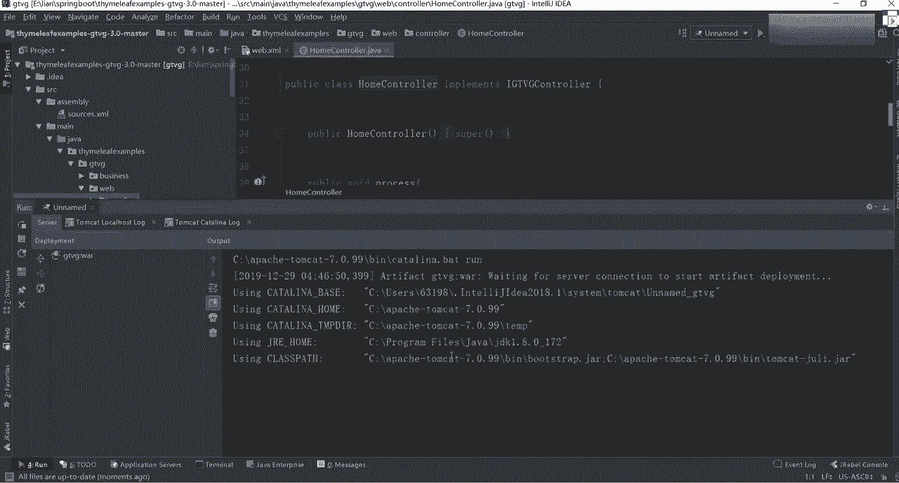

听到之后看到了吗，这大家提供好的一个官方网址，product list是不是有这样一个展示列表，然后下面有一个order list，然后告诉你说你怎么来查看，里面有什么的相关信息，再做一个展示。

然后返回返回user home，什么东西，return之类的，就他做了这样一个页面，你可以进行自己的一个查询，好自己一个查询，所以这块你可以下载下来这个代码，把这个代码运行一下，注意不需要改任何东西。

直接需要嵌入一个tom的容器，它能运行了非常简单的一个方式，这是他官网里面给我们做了一个，最基本的一个提供啊，最基本的一个提供，提供好之后，下面更多的是什么，你要看一下这东西应该如何进行一个使用。

看到一个东西叫标准表达式语法，然后看他说了，第一个叫简单表达式，里面有变量的，有选中变量的，有消息的，有URR2的，还有我们的片段，有常量，有文本操作，有算术操作，有布尔操作，比较和相等条件。

运算符和特殊符号，是包含了很多很多对应的一个相信息表，这边是不是都有，所以你在用的时候，直接拿这东西来进行查看就可以了，而且每一个点里面他俩都给你做了一个解释，告诉你说你应该如何进行一个最基本使用。

每块都解释了，所以这里面代码你其实可以拿过来之后，直接嵌到你的HTML页面里面，直接进行一个查看，都非常简单，这是第一点，你要看的，第二点，我如何来使用我们对应sim leaf，好吧，你往下翻翻。

翻到这块有个东西叫属性，在数学这块告诉你说，如果你想引入片段的话，你要用什么叫t h insert或者t h release，如果你要用迭代片段的话，用TH意识就是我们的循环条件的话。

T是if局部变量提示object t是base，一般属性ATTRR好吧，特殊属性有value hf src，文本的话属于我们text，然后呢呃片段的话可以用我们的服regent。

然后还有个t remove，是不是用的这些标签，比如说以后我们如果要写页面的话，你可以怎么样呢，直接用我们的FRAMEK引擎，直接往里面嵌就行了，非常简单，这个属于前端吗，呃不算前端吧。

就你写好前端页面之后，你可以自己做一个基本的修改，你懂我意思吧，好了，那这块我们怎么来做呢，怎么来做呢，也非常简单，下面文章里面我给你写了比较详细的一个模式，第一点你需要先引入我们的模板引擎。

我把地址也给你站出来了，就跟up地址好，这是第一点，当你把这个地址写出来之后，你注意了，当你引入当前这个配妹妹的一个依赖之，后面的一个依赖之后，而中文网址可以放到SIMT文档里面，可以可以。

我给你加一下中文，没事挂地址给大家粘一下，哎呦下课忘了背哪去了，呃我直接打开一下，重新打开，好这样吧，你们直接访问就行了，直接访问就行了，让大家看注意了，当你导入这个依赖之后，相应的它会有会有什么呢。

叫sim leaf，然后properties，所以这块我们也可以做一个最基本的查看，怎么查看。

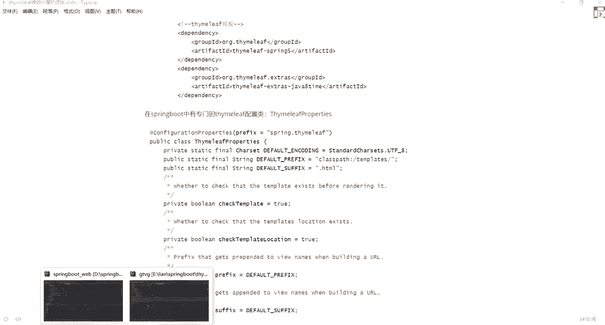

再写一个叫sam t h y leaf zr e f properties，打开之后你会看到它在哪，是不是指定好了，我们当前这个目录是一个template这个目录，然后呢，同时还会告诉你说。

这有一个点HTML的一个后缀对吧，里面包含很多信息，所以以后你如果需要自己开发一个web项目的话，直接写HTML页面就行了，把写HTML页面也写了，写完HTML页面之后，它会自动进行这些数据的一个渲染。

把那些值给我们给填进去。

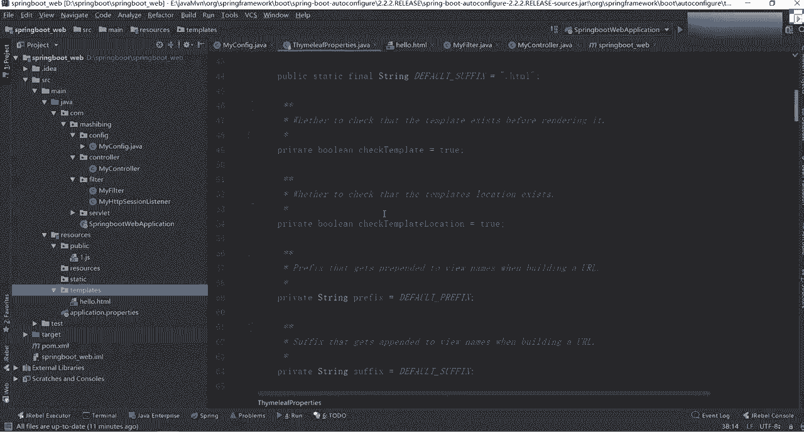

这我也举了一些例子，你把这东西看一下怎么使用啊，看着我写了一个非常简单的一个需求，说第一你需要在java代码里面写一些对应的信息，比如说这儿有个叫model相关的信息，这怎么用啊，让我们写一下试试吧。

先看一下第一个我应该怎么进行使用。

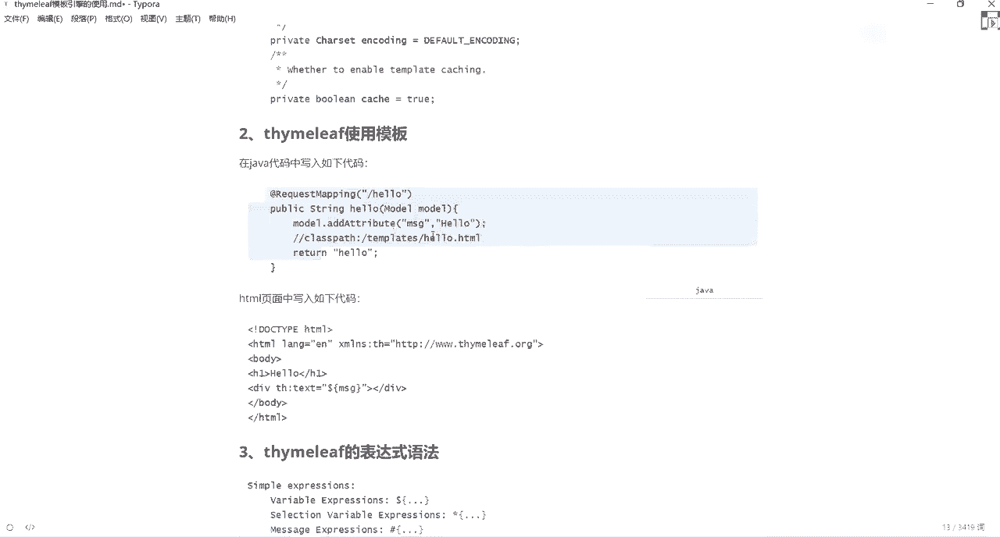

把它关掉了没用，把拿过来，这有一个controller是my controller，这是hello hello里面加一些东西，因为这是集成MVC的嘛，所以这直接用model就行了，卧槽。

这加一个属性叫model dead tribute，MSG是吧，Hello，然后呢逗号spring boot再返回这边回页面，返回页面之后再回到页面里面，我要写东西了，写什么，这个标签不要了。

不要之后注意了，你要想在HTML页面里面嵌入我们这个CV6模板，这你必须要加载一个标识，好吧，告诉他你用的就是我们sim leaf这样一个东西，怎么加以标识啊，官网里面也有一个明确表示。

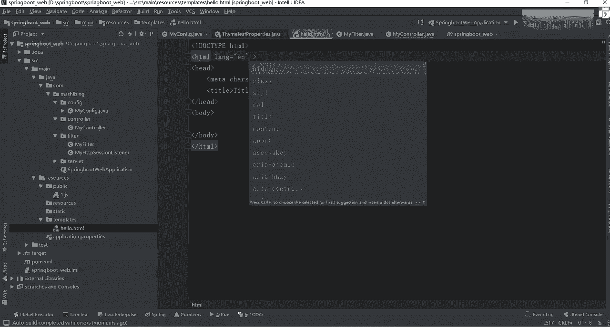

我找一下你哪去了，找一下我们的页面啊，这有页面啊，这个鸡蛋诶，没有吗，这没页面有关，应该我找一下啊，看着就这个东西，你把它给拿过来，把这段话拿过来，他说C打完之后粘到我们刚刚这个地方。

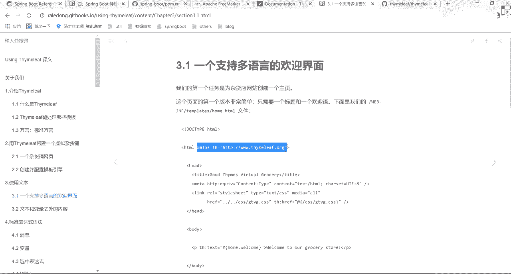

TT标签后面，粘完之后就搞定了，此时在用的时候，你可以干嘛叫显示加个东西吧，消息，为冒号后面加一个东西，比如加一个P标签吧啊这加一个叫TH冒号，是不是叫test引入的时候，这是一个变量嘛。

所以用dollar符号括号加一个东西叫MSG好，加完之后，这能做一个展示了，现在我们把当前这个应用程序启动一下，启动报错了，加一个封号，吹一下中括号，中号可以吧，可以可以可以，中框中框也可以，把那写写。

可能稍微麻烦一点，来启动好之后，我们这直接返回一个hello。

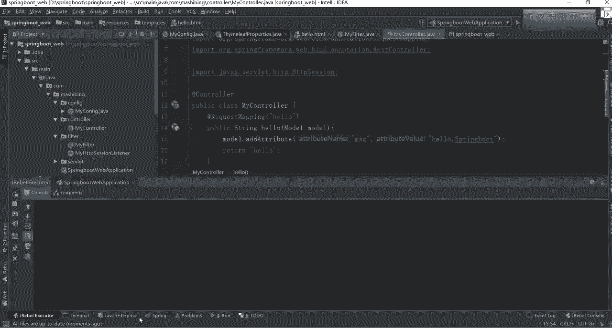

看这显示消息为HELLOSWIMT。

是不是意味着我们刚刚后台写进到model里面，的一个数据已经被我们前端这个页面给查到了，这就是C用户DF模板最基本的一个使用啊，最基本的一个使用，所以它并没有特别难，关键就是说我知道如何使用这些标签。

或者说如何使用这个贴标签就够了，理论来说所有的属性你都可以加TH冒号，但前提是一定要加上这样一个呃标识，告诉你说你要从sim live里面进行一个引入了啊，这块很重要，懂我意思吧。

下面来再接着看怎么用呢，现在告诉你说semi支持的一个语言表达式。

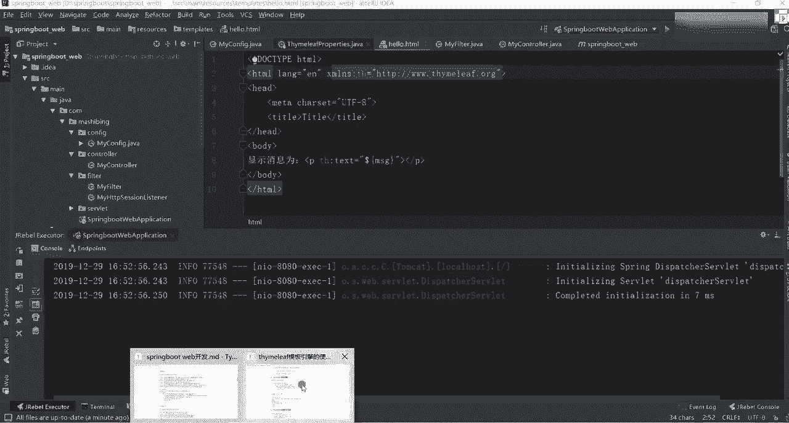

这块给它粘出来了，这块粘出来的信息啊，粘出来的信息就是我们刚刚给你看的东西啊，从官网里面看的哪看的，打开第四块是标准语法题的表达式里，每个里面表示什么意思，你要去边上的时候。

用dollar选出表达式的时候用星，然后呢消极表达式用井号，这个想法是，一般在国际化的时候用的比较多一点，然后还有什么选择，我们的U22用艾特符号，如果是片段的话，用波浪线对吧，你别告诉我。

还有其他的一些取值的方式，你直接拿过来取就行了，循环怎么弄呢，一会我给你演示循环应该怎么操作好，同时下面还有什么第十块，你记住了，第十个点里面告诉你说有哪些属性标签，你可以进行怎样的一个使用。

这个东西文档里面我都写好了啊，这站出来图说了，SIMI实例演示，test表示文本的一个内容，value表示当前元素的一个值，TH就是表示什么是我们的循环操作了，if表示条件判断。

insert表示我们代入的那个代码块的一个植入，然后呢FM表示定义代码块，object声明变量ATER表示修改属性，但修改属性一般没人用好，一般没人用，现在怎么做呀，来先看这地方。

我把这页面直接粘出来复制，这样写一个页面吧。

他们这里面右击new一个TML页面，Ph y m e l e f，转过来2V2V装完之后，大家发现了这个页面其实并不是特别麻烦好吧，包含什么信息，第一导入这个标签。

第二告诉你说这是一个text you test，然后呢这有个value，有个each是不循环，还有什么呢，我们这有test，然后object是不是各种各样的引用，这还可以做一些逻辑上的判断。

是不是这个意思，而且这可以做一个循环，这东西这东西并不难，关键是什么，这些数据来自于哪，这些数据在哪看还是一样，你从你对应的control层里面，给他做一个最基本的返回，怎么返回啊。

在一个public string这写一个SIMPLI括号，加一个at request mapping，括号CREMELEFSIMPLITHY加进来，加完之后，是不是可以往里面写我们对应属性值了。

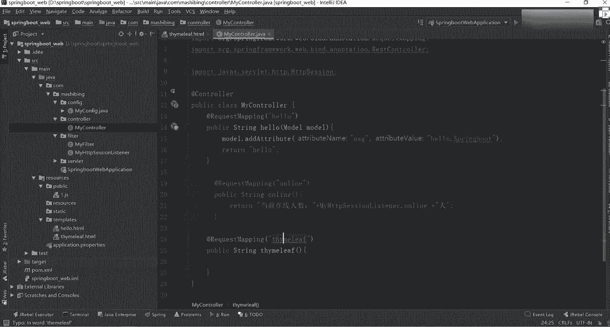

这数值你也没必要自己写，我都写好了，把它拿过来，cl c认为这加一个属性叫model map map。

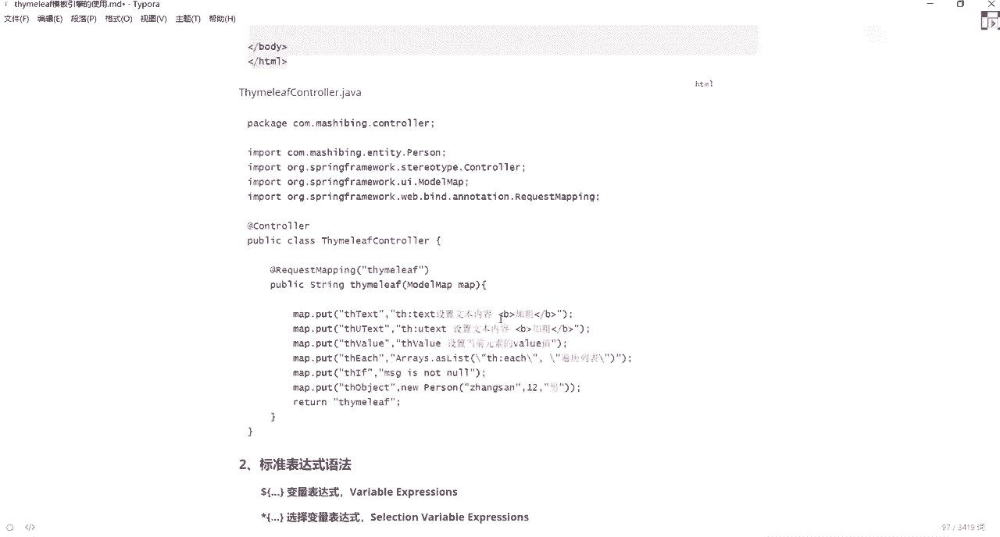

这是不是少了一个person类是吧，我们定一个person类吧，又一个page，这定义一个class person，Private string name。

Private int age by the stream，真的这东西都比较简单啊，然后写一个构造器，无参的，含参的就下一个set get方法，再加一个TOSTR，好了，这定义好之后。

这个值是不是就有了，OK当你这块写完之后，写完之后就OK了，现在怎么样呢，直接我这是不是启动好了，这边挺好用，重启一下吧，重启一下，感觉有点像以前SARS标签其实还是一样，不管是SARS有什么。

是不是有个东西叫OTN的表达式，好吧，你想一下你在学你在学那个JSP的时候，JSP的时候有什么东西，是不是有个东西叫ER表达式，还有一个叫什么叫egg s t r表达式是吧。

现在呢在rust里面有个叫OGNL，有人用OCN2，相当于你知道stress，很多同学已经不知道这个东西了，好像现在里面就是用了一个TH，其他现在都是什么，就是C标签，P标签是这些标签啊。

用这个标签拿来用就可以了，就这样意思啊，对象导航图语言对。

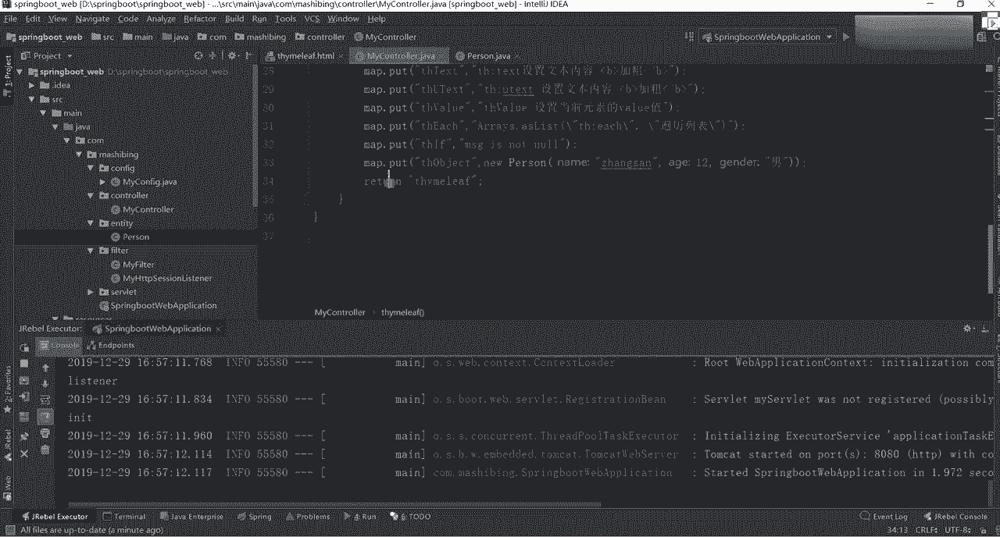

是这样的东西好了，这发完之后，我们这可以发送一个对应的请求，请问什么信息啊，叫sim lit h y m e l e a f到，从2%ph看，这听到了吗，是不是这些相关的数据我已经全部都请求到了，对吧。

这块你可以给我的页面的做对比，好做对比，对比之后你会看到这请求东西。

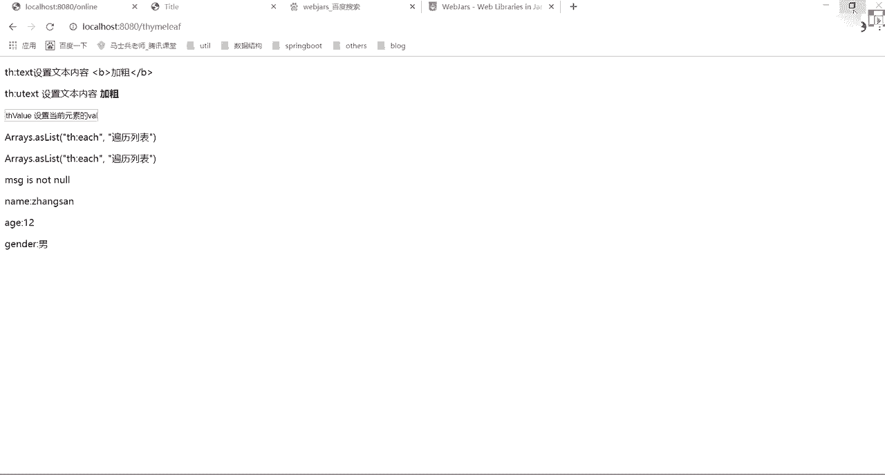

就是我们想要的那第一个test什么东西，然后呢引入对应的一个值，把这个值给做一个演示。

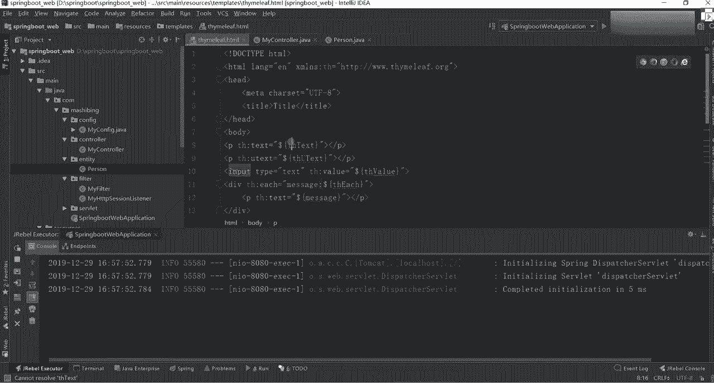

同时这里面还有啥页面了，是不是还有我们对应的一个循环链表，而list等于啥等于啥，等于啥，是往里面写出我们对应信息就行了，好判断它是否为空，然后内部等于啥等于啥，真的等于啥，关键就在于什么呢。

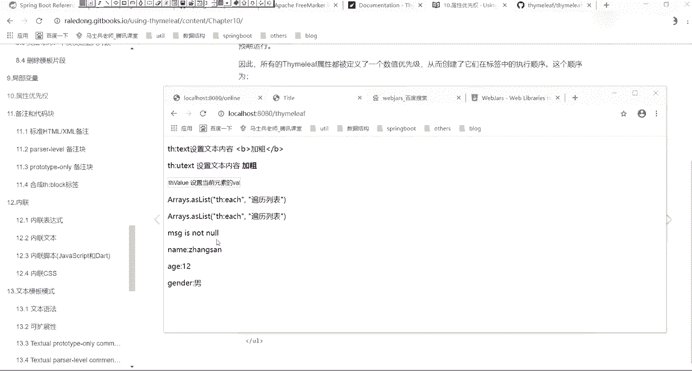

在于说你在使用这个HTML标签的时候，你要知道这些属性应该怎么引用，这里面我们主要用两个标签，一个是dollar开头的，一个是新开头的，dollar开头的表示引用的是什么，是对应的一个变量值。

而新开头什么意思，是指的是我刚上面是不是声明了一个变量，叫t h object，我们在这里面这个对象里面的属性，你要想引用的时候，必须要用心来进行引用了啊，这是他们之间的一个区别。

像后面刚刚看到A的标签对吧，在包括号刚看到的波浪线标签，这东西我后面会演示的，在这个页面你要会写明白，我意思吧好吧，你要知道这标签应该怎么进行引用，看到了跟我们刚才一样不一样一样吧，是不是没啥区别啊。

非常简单的一个实例啊，下来之后好好看一下这东西难吗，不难吧，这sim live最基本的一个使用这块之后。

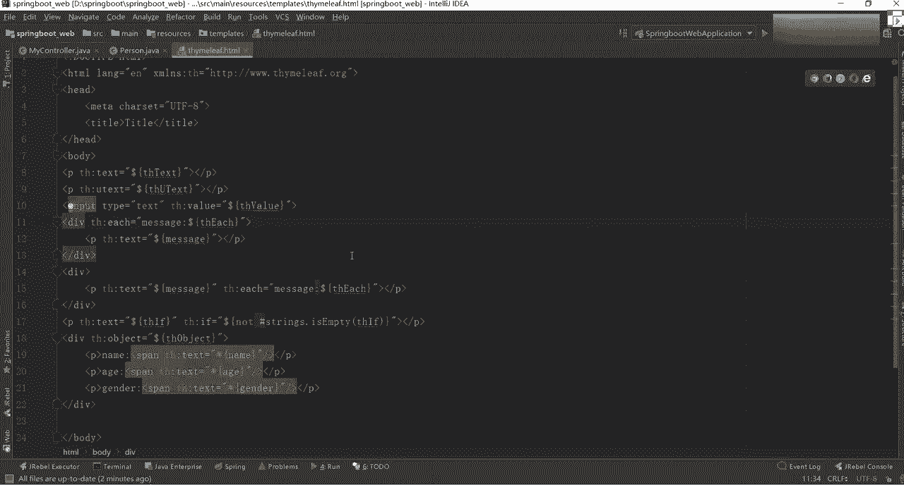

一定要自己做一个演示，这块来听白同学扣个一能听懂吧。

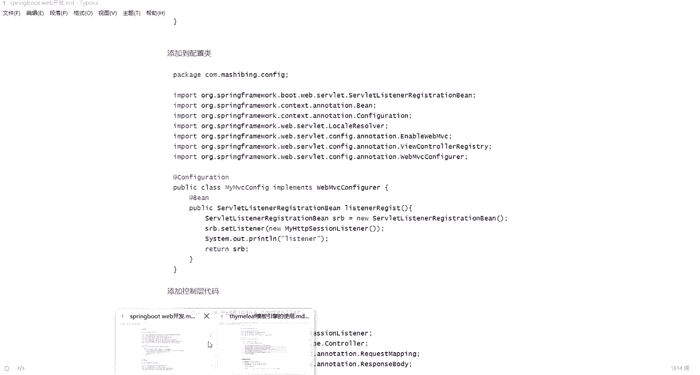

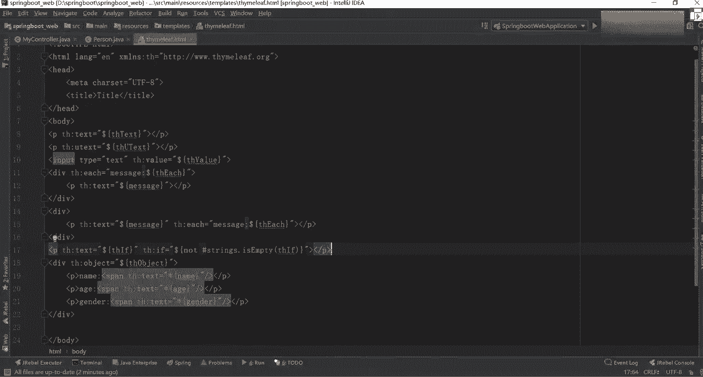

好了，除了这个sim live这块之外，还有什么东西，我再说了，还有标准表达式语言，比如说DOTA变量使用先叫选择变量表达式，这两个东西在上面的时候都已经用过了啊，所以我们这儿不再演示了好不再演示了。

但是你注意了，这个变量在使用的时候，它还有很多小细节在里面，什么细节，比如这第一个我可以把我们的session里面放数据，就说它可以获取到我们对应对象的属性和方，属性方法，同时可以使用什么呢。

Cd s vs local request response，Session service contest，是不是这些内置对象里面的属性，我也能从里面取到，比如说这样我来做一个演示吧，非常简单。

打开我们的这里面。

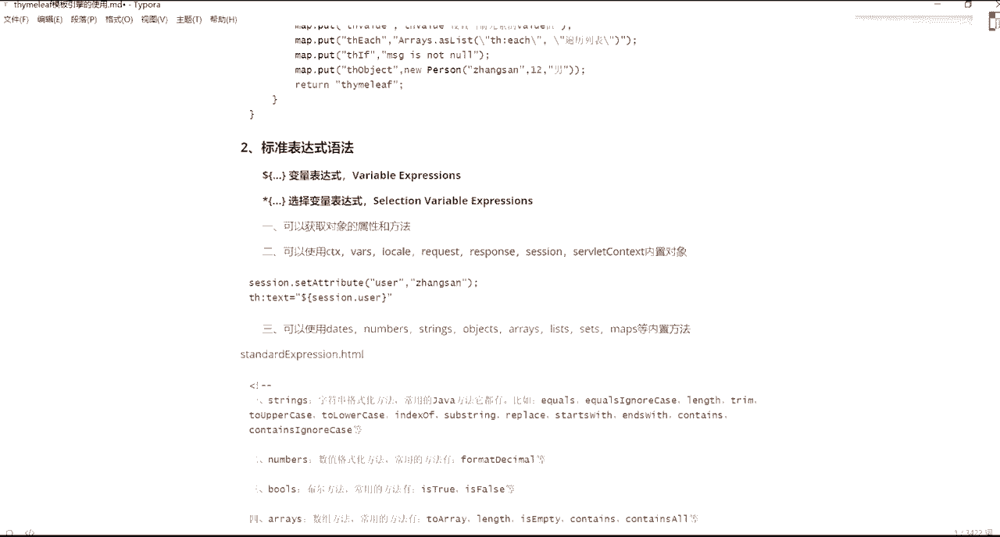

在我们的请求里面加一个逗号参数，逗号叫HTTP session session，加一个session点，Set attribute，这写一个name，逗号杠三，加完之后你也一样的，这页面里面加一个东西。

P标签TH冒号test，这写一个叫dollar括号，session点叫name，用完之后来，我们现在重新刷新，我们对一个浏览器页面。

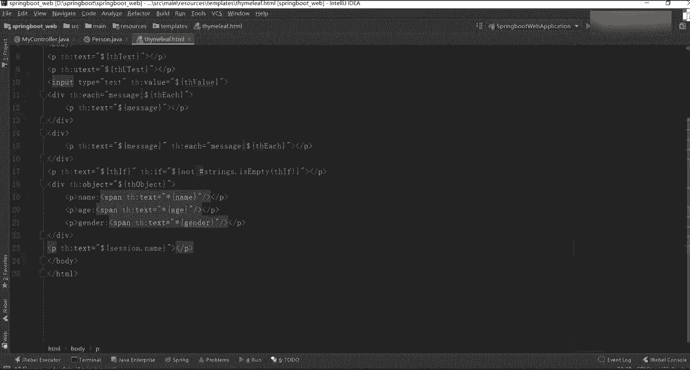

是吧，刚才出来了吗，出来了吧，是不是那个对象里面的属性值也能可以获取到，所以它用起来比较灵活一点，比较灵活一点，你可以按照自己的想法随意去进行一个更改好，这是第一个标准表达式，除此之外它在干嘛。

它还提供了很多内置的一个方法，比如说对日期吧，numbers数字吧，string字符串，object对象，array数组list集合，三支配集合，web设备集合。

我还可以用这些内置的这些方法来做一些处理，对吧，里面每个东西都解释了有哪些常用的方法，这块下面都给大家写案例了，好多要写案例了，下来之后，你可以把这些案例拿过来之后好好演示一下。

好看一下大概是什么样的一个效果，ok control层里面怎么往里面复数赋值，放数据我也写过了，我也写过了，很难过去之后好好看看，包括下面各种各样的演示代码，我都写的比较多，写的比较详细了。

所以你有能力好把这些东西全部给完成，懂我意思吧，好吧呃，下午时间差不多了，我们大家来聊聊这么多，晚上八点钟我们还有课，所以一会儿我把这个文档给大家分享出来，分享出来之后，你先按照我刚刚写的那些文档。

先自己去做一下操作，特别是作为初学者，一定要做一下，哪怕你把代码复制过去运行一下，也要用啊，也要试一试，懂我意思吧，刚刚没讲完，还讲什么东西，比如说国际化我们还没讲，比如说我们的数据，数据源还没讲好吧。

以及哦我们估计能把数据源讲完，讲完之后我们就开始讲源码，好给你们讲很多东西，所以一会把这个文档里面的代码，先做一个实施好，做一个演练，完了之后，我们晚上再接着聊，好吧行了，这些东西难吗。

觉得男同学扣一不，男同学扣二，难啊这还难啊，spring boot是不是一般不配置多数据源，我记得上一次是谁问我说，spring boot是配多配置那个数据源多，那个多数源配置怎么配，是是你问的吗。

风声可以配可以配，我这给大家写好了，我专门准备了一下，专门准备了一下spring boot数据源，今天刚学完数据源，找一下大纲，看着spring boot多数据源的一个配置，我这都写好了。

好晚上的时候可以给大家演示一下这个效果好，怎么来切换我们的数据源这块都有，所以你们面试问到的一些点或者自己不会的点，这都有啊，可以随local对，确实随logo，网上看挺麻烦的，比S麻烦。

需要用到spring里面的a OP，需要用到spring OP，还有很多东西啊，这块我都写好了，晚上讲的时候咱们再说行吧，MD是什么软件，这个我给大家写一下，T y p o r n。

那这里面带一些格式啊，看起来更舒服一点，看起来更舒服一点，笔记传到哪里了，传到我们的GITHUB上面去，我一会会往上传，会往上传，这个东西我都会都会给你们传上去啊，这怎么看，对按键也可以弹啊。

看搞一个maven的一个插件就行了，好像是maven插件就行了，行了，今天下午咱们就聊这么多，晚上八点钟准时再见，好同学们，OK拜拜，老师这个中文档哪找的呀，你中文文档你你你你你找就行了吧。

这个这个百度里面都有吧，其实大家发现了，其实我现在不是在百度里面找，就是你看到我们这些中文网站啊，他都在同一个根目录里面叫git book，我不知道这个网站你们有没有人看过叫git book。

这个网站下去之后，你们可以注册一下，好可以注册一下，里面有很多的一些中文的一些相关翻译，这都有要注册啊，注册的时候要需要翻墙哇，这只比较麻烦好，这边东西比较多，我基本上如果需要中文文档的话。

都会从这里面搜，这搜好吧，搜一下就行了好了，就这么多吧，OK晚上再见拜拜，对，所有课都往上上传，是的。

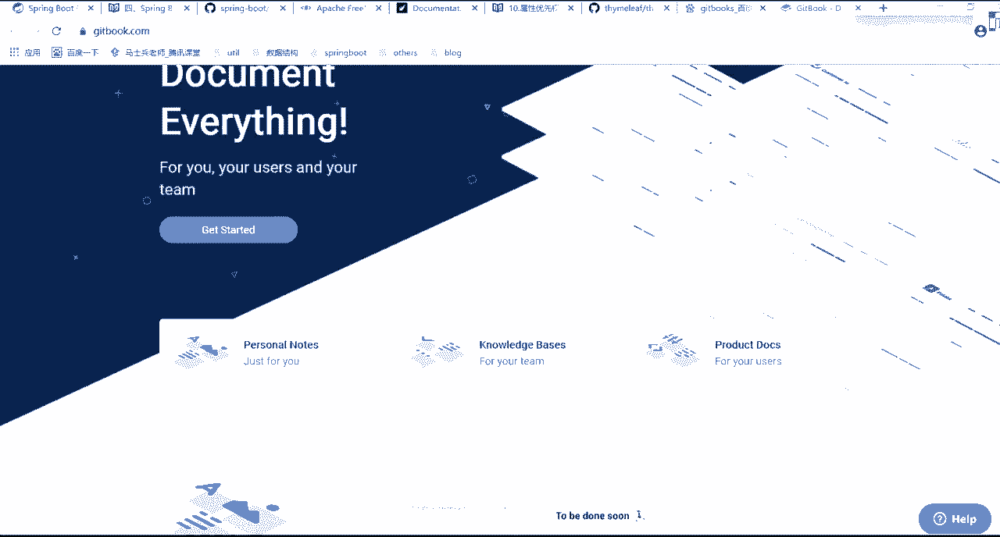